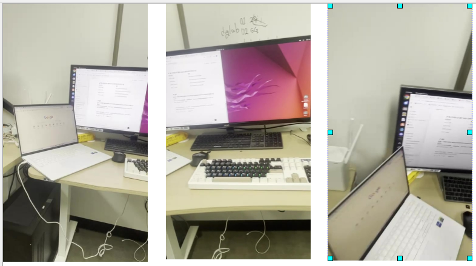

# 3DGS
https://github.com/graphdeco-inria/gaussian-splatting 논문의 코드 실행, 동작 원리 이해, 사용자 데이터셋에 대한 학습을 목적으로 함

## 0. 환경
- OS : Ubuntu 22.04
- GPU : RTX 3070Ti
- CUDA version : 11.8
- Python version : 3.9.*


## 1. Dataset
- 샘플데이터로 있는 train, truck, playroom등에 대해 먼저 학습을 진행했고 적절하게 결과가 나와서 직접 얻은 데이터(사진, 동영상)에 대해 돌려보고자 했다. 
- 실제로 아래와 같이 스마트폰 카메라로 직접 영상을 찍었다.
- 해당 영상은 iphone 12의 후방카메라로 찍은 약 23초의 영상이다(480 × 854).
-  
- 이 영상을 ffmpeg application을 이용해 아래와 같은 명령어를 통해 5fps로 설정해 이미지로 변환해주었다. 
```
$ffmpeg -i IMG_2293.mov -vf fps=5 -q:v 1  images/frame_%04d.jpg
```
- 135장의 이미지가 생성되었다.
  
  

## 2. Convert.py

- 1의 과정에서 얻은 이미지를 GS를 돌리기 위해서는 적절한 형식에 맞춰줘야 한다. 이는 잘 구현된 ```convert.py```을 이용하면 된다. 
- 구동 결과 이미지의 갯수에 따라 다르지만 위 동영상 기준으로 2분정도의 시간이 소요됐고 결과는 아래와 같이 나오게 된다. 
```bash
|---images          # 왜곡이 제거된(Undistorted) 이미지 파일들
|---sparse          # SfM(Structure-from-Motion) 결과 데이터
|---input           # 원본 이미지 파일
    |---0
        |---cameras.bin    # 카메라 파라미터 정보
        |---images.bin     # 이미지 포즈 및 관련 데이터
        |---points3D.bin   # 초기 3D 포인트 클라우드 데이터

```
## 3. train.py
- ```python train.py -s data/test_01 -m output/test_01``` 과 같은 명령어를 통해 학습을 진행하게 된다. 

```
python train.py -s data/test_01 -m output/test_01
Optimizing output/test_01
Output folder: output/test_01 [29/12 06:28:10]
Tensorboard not available: not logging progress [29/12 06:28:10]
Reading camera 264/264 [29/12 06:28:10]
Converting point3d.bin to .ply, will happen only the first time you open the scene. [29/12 06:28:10]
Loading Training Cameras [29/12 06:28:10]
Loading Test Cameras [29/12 06:28:17]
Number of points at initialisation :  6480 [29/12 06:28:17]
Training progress:  23%|▏| 7000/30000 [02:07<08:39, 44.26it/s, Loss=0.0853250, D
[ITER 7000] Evaluating train: L1 0.04595177620649338 PSNR 21.01699447631836 [29/12 06:30:25]

[ITER 7000] Saving Gaussians [29/12 06:30:25]
Training progress: 100%|█| 30000/30000 [10:27<00:00, 47.83it/s, Loss=0.0475140, 

[ITER 30000] Evaluating train: L1 0.027780645340681077 PSNR 25.32618293762207 [29/12 06:38:45]

[ITER 30000] Saving Gaussians [29/12 06:38:45]

Training complete. [29/12 06:38:45]

```
- 학습 로그는 위와 같다. 

## 4. Rendering 결과

- SIBR_viewers를 통해 학습된 결과물에 대해 볼 수 있다. 

- 휴대폰카메라로 찍어 렌더링한 결과 또한 같은 비율임을 알 수 있다.


## 5. 고찰

- 동영상을 통해 이미지를 얻어 GS를 진행했는데 이미지를 직접 찍어 진행할 때 성능에 어떤 차이가 있는지 확인 해 볼 필요가 있다고 생각한다.
- 렌더링한 영상에 대해 eval를 진행하지 않았는데 이 부분에 대해 진행 할 필요가 있다고 생각한다.
- 똑같은 동영상에 대해 이미지로 변환할 때 fps에 따라 성능 변화 또한 확인할 필요성이 있다고 생각한다. 
- 결과에 대해 SIBR_viewers를 통해 확인 할 수 있었는데 해당 GUI에 어떤 기능이 있는지 제대로 숙지해야 한다.
