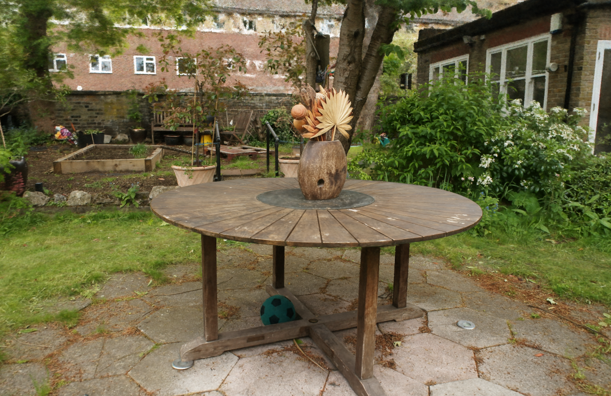
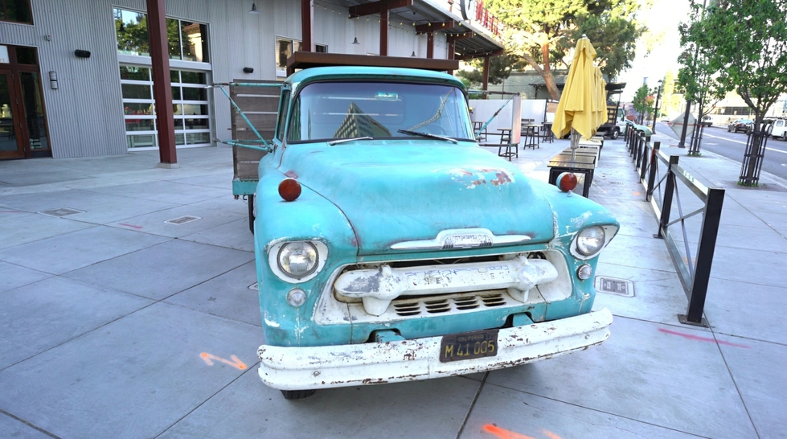
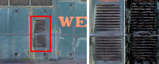

# 3DGS 렌더링 구현 분석

## 1. 개요

3DGS(3D Gaussian Splatting)의 렌더링은 **2D splatting 기반 tile rasterization + front-to-back alpha compositing**을 사용한다.

- **3DGS**: 3D Gaussian을 2D 이미지 평면에 투영(splatting)한 뒤 픽셀 단위로 alpha blending
- **3DGUT**: ray를 3D 공간으로 쏘아 Gaussian 볼륨과 직접 교차 판정

두 방법 모두 동일한 front-to-back alpha compositing 수식을 사용하지만, **alpha를 구하는 방식이 근본적으로 다르다.**

| | 3DGS | 3DGUT |
|---|---|---|
| 렌더링 방식 | 2D splatting (rasterization) | Ray-based 볼륨 렌더링 |
| alpha 계산 | 2D Gaussian 평가 × opacity | maxResponse × density |
| 정렬 | 타일 전체를 radix sort (한 번) | Gaussian 순회 + K-buffer |
| 연산 단위 | 타일(tile) 기반 병렬 | 픽셀(ray) 기반 병렬 |

### 렌더링 파이프라인 요약

```
SfM Points → 3D Gaussians 초기화
       ↓
각 Gaussian을 2D로 projection (splatting)
       ↓
(tile_id, depth) 키로 GPU radix sort
       ↓
타일별 pixel 순회: front-to-back alpha compositing
       ↓
최종 이미지 출력
```

---

## 2. 3D Gaussian 표현

### 2.1 파라미터

각 Gaussian은 다음 파라미터들로 정의된다:

| 파라미터 | 설명 | 차원 |
|---|---|---|
| μ (mean) | 3D 위치 | 3D vector |
| Σ (covariance) | 형태와 방향 (anisotropic) | 3×3 matrix |
| α (opacity) | 불투명도 | scalar ∈ [0,1) |
| SH coefficients | 방향에 따른 색상 (spherical harmonics) | 48 floats (4 bands) |

### 2.2 Gaussian 수식

3D 공간에서 Gaussian은 다음과 같이 정의된다:

```
G(x) = exp(-1/2 · (x-μ)ᵀ Σ⁻¹ (x-μ))
```

공분산 행렬 Σ는 직접 최적화하면 positive semi-definite 조건을 어기기 쉽다.
따라서 **scaling matrix S**와 **rotation matrix R**로 분리하여 표현한다:

```
Σ = R S Sᵀ Rᵀ
```

- **s** (3D scaling vector): 각 축 방향의 크기
- **q** (quaternion): 회전 방향

이를 통해 임의의 anisotropic 타원체 형태를 안정적으로 최적화할 수 있다.

### 2.3 Gaussian의 시각적 표현

각 Gaussian은 위치, 크기, 방향이 자유롭게 최적화되어 장면의 geometry를 효율적으로 표현한다.


> 단일 3D Gaussian의 등고선 시각화. 중심으로 갈수록 응답값이 높고 경계로 갈수록 부드럽게 감소한다.

최적화 후 Gaussian들을 60% 축소하면 장면의 기하학적 구조를 compact하게 표현하는 anisotropic 형태를 확인할 수 있다. 넓은 균일 영역은 소수의 크고 납작한 Gaussian으로, 얇은 구조는 길쭉한 Gaussian으로 표현된다.

---

## 3. 2D Projection (Splatting)

렌더링을 위해 3D Gaussian을 2D 이미지 평면으로 투영한다.
Zwicker et al. [2001]의 방법을 사용하여, viewing transformation W 하에서 카메라 좌표계의 공분산 행렬 Σ'를 계산한다:

```
Σ' = J W Σ Wᵀ Jᵀ
```

- **W**: viewing transformation matrix
- **J**: projective transformation의 affine 근사 Jacobian

이후 Σ'의 3행 3열을 제거하면 **2×2 공분산 행렬** (2D splat의 형태)을 얻는다.
이 결과는 2D 이미지 평면 위의 타원 형태의 splat이다.

---

## 4. 렌더링 전 Radix Sort

### 4.1 Tile 분할 및 Gaussian 할당

화면을 **16×16 픽셀 단위의 tile**로 분할한다.

각 Gaussian에 대해:
1. View frustum culling (99% confidence interval 기준)
2. Guard band로 near plane 인접 Gaussian 제거
3. Gaussian이 overlap하는 **모든 tile에 인스턴스 생성**
4. 각 인스턴스에 `(tile_id, depth)` 키 부여

```
key = (tile_id << 32) | depth_bits
```

### 4.2 GPU Radix Sort

모든 Gaussian 인스턴스를 **(tile_id, depth)** 키로 **GPU radix sort** 한 번에 정렬한다.

3DGUT의 globalDepth와 마찬가지로 여기서 사용하는 depth는 **Gaussian 중심의 카메라 Z값**이다.
픽셀별로 정확한 교차점 거리를 구하는 것이 아니라, Gaussian 중심을 기준으로 한 대표 깊이값이다.

| | 3DGS depth | 3DGUT globalDepth |
|---|---|---|
| 기준 | Gaussian 중심의 카메라 Z | Gaussian 중심의 카메라 Z |
| 용도 | 이미지 전체 radix sort 키 | radix sort 키 |
| 픽셀 의존성 | 없음 (타일 공유) | 없음 (타일 공유) |
| 정확한 깊이 | 없음 (근사 blending) | hitT (픽셀별 정확한 값) |

정렬 후 각 tile에 대해 첫 번째와 마지막 Gaussian의 인덱스를 기록해 **tile range list**를 생성한다.

---

## 5. Tile-based Rasterization (렌더링)

### 5.1 CUDA 스레드 구성

```
한 thread block = 하나의 tile (16×16 = 256 threads)
하나의 thread = 하나의 픽셀
```

각 thread block이 해당 tile의 Gaussian 리스트를 **공유 메모리(shared memory)에 협력 로드**하면서 처리한다.

### 5.2 렌더링 흐름

```
for each Gaussian G in tile_range (front → back):
    1. 픽셀 중심과 2D Gaussian의 거리 계산
    2. 2D Gaussian 응답값으로 alpha 계산
    3. front-to-back alpha compositing
    4. T < threshold → 해당 thread(픽셀) 종료

tile 내 모든 픽셀이 saturate → 전체 tile 종료
```

### 5.3 2D Alpha 계산

3DGS에서 alpha는 **2D 이미지 평면 위에서 직접 계산**된다:

```
α_i = min(0.99, opacity_i × exp(-σ_i))

σ_i = 1/2 · (Δx Δy) · Σ'⁻¹ · (Δx Δy)ᵀ
```

- **(Δx, Δy)**: 픽셀 중심과 2D Gaussian 중심 사이의 거리
- **Σ'**: 2D projected covariance
- **opacity_i**: 학습된 per-Gaussian 불투명도

3DGUT의 `maxResponse × density`와 기능적으로 동일하지만, 3DGS는 **이미 2D로 투영된 Gaussian** 위에서 거리를 계산한다는 차이가 있다.

---

## 6. Alpha Compositing (블렌딩)

### 6.1 블렌딩 수식

3DGS의 블렌딩은 3DGUT과 **완전히 동일한 front-to-back alpha compositing**을 사용한다.

```
C = Σᵢ cᵢ αᵢ Tᵢ

Tᵢ = Πⱼ＜ᵢ (1 - αⱼ)     (accumulated transmittance)
```

### 6.2 실제 연산 순서

```
T = 1.0  (초기 transmittance)

// tile range 내 Gaussian들을 front-to-back 순서로:
for each hit_i (sorted by depth):
    weight_i = α_i × T
    color   += c_i × weight_i
    T       *= (1 - α_i)

    if T < 0.0001:
        kill()   // 조기 종료

// 최종 출력
output_color = color
output_alpha = 1.0 - T
```

### 6.3 3DGS vs 3DGUT 블렌딩 비교

| | 3DGS | 3DGUT |
|---|---|---|
| 블렌딩 수식 | 동일 | 동일 |
| alpha 소스 | 2D projected Gaussian | ray × 3D Gaussian (maxResponse) |
| 깊이 정렬 | radix sort (렌더링 전, 전역) | K-buffer (렌더링 중, 픽셀별) |
| 정렬 정확도 | 근사 (Gaussian 중심 기준) | 정확 (hitT, 픽셀별) |
| 처리 단위 | tile 단위 | ray(픽셀) 단위 |

---

## 7. Backward Pass (역전파)

3DGS의 주요 장점 중 하나는 **gradient를 받을 수 있는 Gaussian 수에 제한이 없다**는 것이다.

역전파 시:
1. Forward pass에서 사용한 **정렬된 Gaussian 배열과 tile range를 재사용**
2. **back-to-front** 순서로 재순회
3. Forward pass 마지막의 **총 누적 opacity** 만 저장해두고, back-to-front 순회 중 각 Gaussian의 alpha로 나눠 중간 opacity 복원

```
// Forward에서 저장: 픽셀의 최종 누적 opacity T_final
// Backward에서: T_i 복원
T_i = T_final / Π_{j>i} (1 - α_j)
```

이로 인해 **동적 메모리 없이 고정 overhead**로 임의 깊이의 씬을 학습 가능하다.

---

## 8. Adaptive Density Control

### 8.1 개요

렌더링 중 학습을 거치며 Gaussian의 밀도를 adaptive하게 조절한다.

매 100 iteration마다:
- α < ε_α 인 Gaussian 제거 (pruning)
- view-space positional gradient 가 임계값 τ_pos = 0.0002 이상인 Gaussian 분열/복제

### 8.2 Clone vs Split


> 렌더링 결과 예시 (Bicycle scene). Gaussian들이 최적화되어 자전거의 얇은 프레임과 배경의 복잡한 텍스처를 효과적으로 표현한다.

| 상황 | 동작 | 설명 |
|---|---|---|
| Under-reconstruction (작은 Gaussian) | **Clone** | 같은 크기로 복제 후 gradient 방향으로 이동 |
| Over-reconstruction (큰 Gaussian) | **Split** | scale을 φ=1.6으로 나눠 2개로 분리 |

```
// Split 시 새 Gaussian 위치 초기화:
// 원래 Gaussian을 PDF로 사용하여 sampling
new_pos = sample_from_gaussian(original_gaussian)
new_scale = original_scale / 1.6
```

매 N=3000 iteration마다 α를 0에 가깝게 리셋하여 불필요한 Gaussian 정리.

---

## 9. 렌더링 결과

### 9.1 Garden 씬



> Mip-NeRF360 데이터셋의 Garden 씬. 야외 환경에서 복잡한 식물 텍스처와 원거리 배경을 고품질로 재현한다.

### 9.2 Truck 씬 (Tanks & Temples)



> Tanks & Temples 데이터셋의 Truck 씬. 세밀한 금속 질감과 주변 환경을 135fps 이상의 실시간 렌더링으로 처리한다.

### 9.3 Train 씬 비교 (디테일 부분)



> Train 씬 디테일 비교 (좌: 3DGS, 우: InstantNGP). 빨간 박스 영역에서 3DGS가 격자 구조를 더 선명하게 복원한다.

---

## 10. 실제 수행 예시

### 10.1 단순화된 블렌딩 예시

```
// 가정: 특정 픽셀에 3개의 Gaussian이 overlap (depth 순으로 정렬됨)
G1: depth=1.0, α=0.6, color=빨강  (가장 가까움)
G2: depth=2.0, α=0.4, color=초록
G3: depth=3.5, α=0.8, color=파랑  (가장 멂)

T = 1.0

G1: weight = 0.6 × 1.0 = 0.6
    color  += 빨강 × 0.6
    T      = 1.0 × (1 - 0.6) = 0.4

G2: weight = 0.4 × 0.4 = 0.16
    color  += 초록 × 0.16
    T      = 0.4 × (1 - 0.4) = 0.24

G3: weight = 0.8 × 0.24 = 0.192
    color  += 파랑 × 0.192
    T      = 0.24 × (1 - 0.8) = 0.048

output_alpha = 1.0 - 0.048 = 0.952
final        = rendered_color + background × 0.048
```

### 10.2 3DGS에서 alpha 계산 예시

```
// 픽셀 중심 p = (320, 240)
// 2D projected Gaussian 중심 μ' = (318, 242)
// 2D covariance Σ' = [[4, 1], [1, 2]] (비대칭 타원)

Δ = p - μ' = (2, -2)

σ = 1/2 · Δᵀ Σ'⁻¹ Δ
  = 1/2 · (2, -2) · Σ'⁻¹ · (2, -2)ᵀ

Σ'⁻¹ = 1/(4×2-1×1) · [[2,-1],[-1,4]] = 1/7 · [[2,-1],[-1,4]]

σ = 1/2 · 1/7 · ((2×2 + (-2)×(-1))×2 + (2×(-1) + (-2)×4)×(-2))
  = ... ≈ 0.857

gaussian_response = exp(-0.857) ≈ 0.424
α = min(0.99, opacity × 0.424)  // opacity는 학습된 값 (예: 0.8)
  = min(0.99, 0.8 × 0.424)
  = 0.339
```

---

## 11. 성능 비교

| Method | PSNR (Mip-NeRF360) | FPS | Train Time |
|---|---|---|---|
| Plenoxels | 23.08 | 6.79 | 25min |
| InstantNGP-Base | 25.30 | 11.7 | 5min |
| InstantNGP-Big | 25.59 | 9.43 | 7.5min |
| Mip-NeRF360 | 27.69 | 0.06 | 48h |
| **3DGS (7K iter)** | **25.60** | **160** | **6min** |
| **3DGS (30K iter)** | **27.21** | **134** | **41min** |

3DGS는 기존 SOTA인 Mip-NeRF360와 동등한 품질을 유지하면서, **렌더링 속도는 2000배 이상** 빠르고 **학습 시간은 70배** 단축된다.
