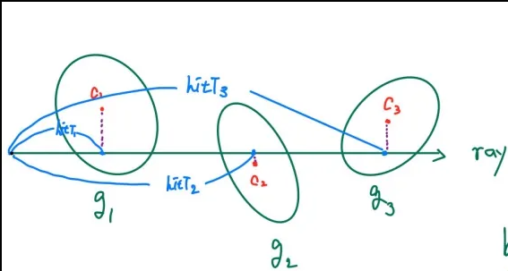
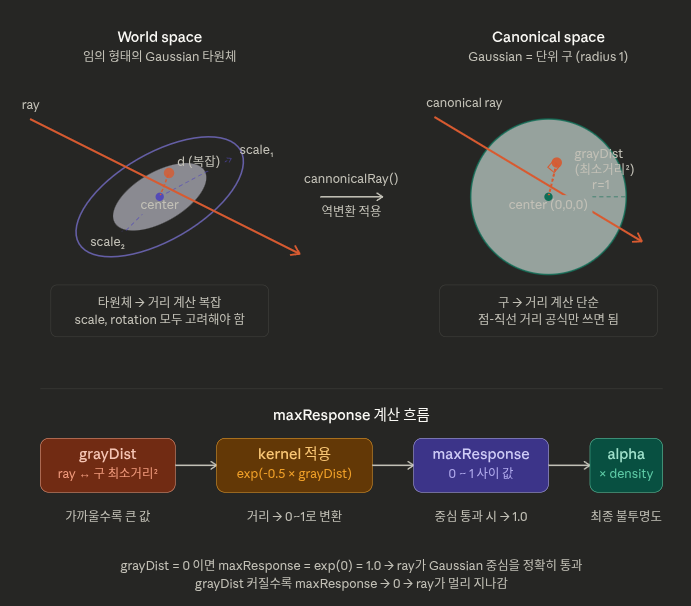

# GUT 렌더링에서의 블렌딩 구현 분석

## 1. 개요

GUT(Gaussian Unscented Transform)의 핀홀 카메라 렌더링은 **ray 기반 front-to-back alpha compositing**을 사용한다.
블렌딩 공식 자체는 3DGS와 동일하지만, alpha를 구하는 방식이 근본적으로 다르다.

- **3DGS**: 2D splatting 기반 (Gaussian을 이미지 평면에 투영 후 합성)
- **GUT**: Ray-based 볼륨 렌더링 (각 픽셀에서 ray를 쏘아 3D Gaussian과 직접 교차)

## 2. 렌더링 전 radix sort


먼저 hit판정은 이미 3d 공간 상에 gaussian이 어느 정도 깊이순으로 정렬되어 있다는 점이 중요하다. 
정렬되어 있는 이유는 렌더링 전에 tile별로 gaussian을 projection해 각 gaussian에 대해 depth가 정해지고 이것으로 radix sort를 진행한다.  
```
GlobalZOrder = true (기본값)
globalDepth = particleMean.x * viewMatrix[0][2]
        + particleMean.y * viewMatrix[1][2]
        + particleMean.z * viewMatrix[2][2]
        + viewMatrix[3][2]
Gaussian 중심을 카메라 공간의 Z축으로 투영한 값. 즉 카메라에서 봤을 때 앞뒤 거리.
```
핵심 차이는 ray 의존성이다.

같은 Gaussian이라도 어떤 ray(픽셀)에서 보느냐에 따라 hitT는 달라진다. 그런데 globalDepth는 그 프레임에서 카메라 기준 하나의 값으로 고정된다.

타일 안의 여러 픽셀들이 같은 Gaussian을 공유하는데, globalDepth는 그 Gaussian의 대표 깊이고 hitT는 각 픽셀 레이마다 미세하게 다른 정확한 깊이인것이다.


이것이 ray기준의 depth와 다른 이유를 정리하면 아래와 같다. 
| | globalDepth | hitT |
|---|---|---|
| 계산 시점 | projection 단계 (렌더링 전) | 렌더링 중 ray별로 |
| 기준 | Gaussian 중심의 카메라 Z값 | ray와 Gaussian 중심의 최근접점 거리 |
| ray 의존성 | ray와 무관, 모든 ray에 동일 | ray마다 다름 |
| 용도 | radix sort 키 | K-buffer 정렬 + depth map 출력 |


### 2.1 Hit판정 및 파이프라인 구조


이후 렌더링 과정에서는 어느 정도 정렬되어 있는 gaussian들에 대해 순차적으로 모두 hit판정을 진행하게 된다. 여기서 hit판정은 gaussian에 대해 `maxresponse`값과 `alpha`값이 특정 임계치를 넘는지를 기준으로 하며 넘게 될 경우 hit 판정이 되어 buffer에 저장하는 형태이다. 

정리하면 
1. 모든 Gaussian을 새 카메라 뷰로 projection                                                                                                                                                                                                                                     
2. 각 Gaussian의 새 depth 계산                                                                                                                                                                                                                                                   
3. 새 (tile_idx, depth_key) 키로 radix sort 재실행
    
    렌더링:
      1. canonical space 변환
      2. maxResponse 계산
      3. alpha 계산
      4. 두 임계값 모두 통과?
   
         → hitT 계산 → (idx, hitT, alpha) K-buffer에 insert

         → 아니면 skip

### 3. 렌더링 과정 실제 코드 흐름 

```
Ray 초기화 → Gaussian 순회 (hit 판정 + alpha 계산) → K-buffer insert/flush → processHitParticle (블렌딩 + T 갱신) → 순회 끝 drain → 최종 출력
```

### 3.1 Ray 초기화

각 픽셀마다 ray를 생성하고, transmittance를 1.0으로 초기화한다.

**파일**: `threedgut_tracer/include/3dgut/kernels/cuda/common/rayPayload.cuh:76-108`

```cuda
RayPayloadT ray;
ray.hitT          = 0.0f;
ray.transmittance = 1.0f;                         // T = 1 (완전 투명 상태)
ray.features      = tcnn::vec<FeatDim>::zero();    // 색상 누적값 = 0

ray.origin    = sensorToWorldTransform * vec4(sensorRayOriginPtr[ray.idx], 1.0f);
ray.direction = mat3(sensorToWorldTransform) * sensorRayDirectionPtr[ray.idx];
```

### 3.2 Gaussian Hit 및 Alpha 계산

ray는 Gaussian과의 hit 여부를 판정한다.
hit가 발생하면 해당 Gaussian의 인덱스와 깊이 정보가 ray의 hit buffer에 저장되며, 이후 이 buffer에 저장된 Gaussian들에 대해 density response를 평가하여 alpha 값을 계산한다.

**파일**: `threedgut_tracer/include/3dgut/kernels/slang/models/gaussianParticles.slang:186-222`
```c
// ray와 Gaussian의 교차 판정
alpha = min(MaxParticleAlpha, maxResponse * parameters. );
const bool acceptHit = ((maxResponse > MinParticleKernelDensity) && (alpha > MinParticleAlpha));

if (acceptHit) {
    depth = canonicalRayDistance(canonicalRayOrigin, canonicalRayDirection, parameters.scale);
}
```
여기서 `maxResponse`는 ray가 Gaussian의 canonical space를 통과할 때 얻는 최대 커널 응답값으로,
ray와 Gaussian 중심 사이의 상대적 위치 관계에 의해 결정된다.

#### maxResponse 계산 과정
hit 판정 전에 먼저 ray를 Gaussian의 **canonical space**로 변환한다.

**canonical space**란 Gaussian의 공분산 행렬(scale, rotation)을 단위 구(unit sphere)로 정규화한 공간이다.
이 변환을 통해 임의의 타원체 형태를 가진 Gaussian을 반지름 1의 구로 취급할 수 있어, 이후 거리 계산이 단순해진다.

canonical space로 변환된 ray에 대해 `canonicalRayMaxKernelResponse`를 호출하여 `maxResponse`를 계산한다.
```c
const float maxResponse = gaussianParticle.canonicalRayMaxKernelResponse
    (
    canonicalRayOrigin,
    canonicalRayDirection);
```


이렇게 계산된 maxResponse를 Gaussian의 density 파라미터와 곱하여 최종 alpha가 결정된다.

여기서 density 파라미터는 3DGS에서 gaussian의 파라미터 중 하나인 opacity와 기능적으로 동일하다. 

명칭이 다른 이유는 렌더링 방식의 차이에서 비롯된다. 3DGS는 Gaussian을 2D 이미지 평면에 투영한 뒤 픽셀 단위로 불투명도를 계산하는 **splatting** 방식이므로 `opacity`라는 표현이 직관적이다. 반면 3DGUT는 ray가 3D 공간의 Gaussian 볼륨을 직접 통과하며 해당 지점의 **밀도(density)** 를 샘플링하는 볼륨 렌더링 방식이므로, 물리적으로 더 정확한 표현인 `density`를 사용한다.

### 3.3 K-buffer 관리

hit 판정을 통과한 Gaussian들은 K-buffer에 삽입된다.
K-buffer는 고정 크기 K의 배열로, 항상 hitT 내림차순(index 0 = nearest)으로 정렬된 상태를 유지한다.

**파일**: `threedgut_tracer/include/3dgut/kernels/cuda/renderers/gutKBufferRenderer.cuh`
```c
struct HitParticle {
    static constexpr float InvalidHitT = -1.0f;
    int   idx   = -1;
    float hitT  = InvalidHitT;
    float alpha = 0.0f;
};
```

#### insert - 삽입 및 정렬

새 hit가 들어올 때마다 bubble sort로 내림차순 정렬을 유지한다.
buffer가 꽉 찬 상태에서 삽입이 발생하면, 가장 가까운 hit(index 0)를 즉시 flush하고 새 hit를 삽입한다.
```c
inline __device__ void insert(HitParticle& hitParticle) {
    const bool isFull = full();
    if (isFull) {
        m_kbuffer[0].hitT = HitParticle::InvalidHitT;  // nearest 제거 후 flush
    } else {
        m_numHits++;
    }
    // bubble sort: hitT 내림차순 유지 (index 0 = nearest)
    for (int i = K - 1; i >= 0; --i) {
        if (hitParticle.hitT > m_kbuffer[i].hitT) {
            const HitParticle tmp = m_kbuffer[i];
            m_kbuffer[i] = hitParticle;
            hitParticle  = tmp;
        }
    }
}
```

#### flush 및 drain 전략

buffer가 꽉 찰 때마다 nearest hit를 즉시 블렌딩(flush)하고, 같은 순회를 계속 이어간다.
별도의 sort → 재시작 과정은 없으며, Gaussian 순회가 끝난 뒤 buffer에 남은 hit들을 near → far 순서로 전부 소진(drain)한다.
```c
// 순회 중 - buffer 꽉 차면 nearest를 즉시 flush
if (hitParticleKBuffer.full()) {
    processHitParticle(ray,
                       hitParticleKBuffer.closestHit(hitParticle),
                       particles, ...);
}
hitParticleKBuffer.insert(hitParticle);

// 순회 끝 - 남은 buffer 전부 near→far drain
for (int i = 0; ray.isAlive() && (i < hitParticleKBuffer.numHits()); ++i) {
    processHitParticle(ray,
                       hitParticleKBuffer[KHitBufferSize - numHits + i],
                       particles, ...);
}
```

`processHitParticle`은 블렌딩 섹션(3.4)의 `densityIntegrateHit` + `featureIntegrateFwd` 호출로 이어지며,
transmittance가 임계값 이하로 떨어지면 `ray.kill()`로 조기 종료된다.


### 3.4 블렌딩 (핵심)
 
buffer에 저장된 Gaussian hit들은 깊이 순서로 정렬된 뒤 front-to-back alpha compositing으로 합성된다.

**파일**: `threedgut_tracer/include/3dgut/kernels/cuda/renderers/gutKBufferRenderer.cuh:153-165`

```cuda
// Forward pass: 각 hit된 Gaussian에 대해
const float hitWeight =
    particles.densityIntegrateHit(hitParticle.alpha,    // 이 Gaussian의 alpha
                                  ray.transmittance,     // 현재 누적 transmittance
                                  hitParticle.hitT,      // hit 깊이
                                  ray.hitT);             // 누적 깊이

particles.featureIntegrateFwd(hitWeight,                 // weight로 색상 합성
                              particleFeatures[hitParticle.idx],
                              ray.features);
```

#### `integrateHit` - weight 계산 및 transmittance 갱신

**파일**: `threedgut_tracer/include/3dgut/kernels/slang/models/gaussianParticles.slang:224-253`

```c
float integrateHit<let backToFront : bool>(
    in float alpha,
    inout float transmittance,
    in float depth,
    inout float integratedDepth, ...)
{
    // Front-to-back: weight = alpha * T
    const float weight = backToFront ? alpha : alpha * transmittance;

    // 깊이 누적
    integratedDepth += depth * weight;

    // transmittance 갱신: T *= (1 - alpha)
    transmittance *= (1 - alpha);

    return weight;
}
```

#### `integrateRadiance` - 색상 누적

**파일**: `threedgut_tracer/include/3dgut/kernels/slang/models/shRadiativeParticles.slang:84-99`

```c
void integrateRadiance<let backToFront : bool>(
    float weight,
    in vector<float, Dim> radiance,
    inout vector<float, Dim> integratedRadiance)
{
    if (weight > 0.0f)
    {
        // Front-to-back: C += color * weight
        integratedRadiance += radiance * weight;
    }
}
```

### 3.5 조기 종료

transmittance가 임계값 이하로 떨어지면 ray를 종료한다.

**파일**: `gutKBufferRenderer.cuh:167-169`

```cuda
if (ray.transmittance < Particles::MinTransmittanceThreshold) {  // 기본값 0.0001
    ray.kill();
}
```

### 3.6 최종 출력

**파일**: `threedgut_tracer/include/3dgut/kernels/cuda/common/rayPayload.cuh:159`

```cuda
// RGB = 누적 색상, Alpha = 1 - T (최종 불투명도)
radianceDensityPtr[ray.idx] = {ray.features[0], ray.features[1], ray.features[2],
                               (1.0f - ray.transmittance)};
```

### 4. 실제 수행 예시


#### 예시 이미지 


####
위 그림처럼 간단하게 블렌딩이 진행되기 전 buffer는 `{(g1, hitT1, alpha1),(g2, hitT2, alpha2),(g3, hitT3, alpha3)}`의 형태로 저장된다. 

여기서 각 파라미터들은
g1,g2,g3의 경우 hit된 gaussian을 식별하는 식별자의 역할을 한다.

hitT 1,2,3는 hit된 gaussian의 깊이를 나타내는데 여기서 원점으로부터 기준이 되는 점은 각 gaussian의 중점에서 ray로 내린 수선의 발이다. 즉 사진 기준에서 파란 점을 뜻한다. 

또한 alpha 1,2,3는 `alpha = min(MaxParticleAlpha, maxResponse * gaussian.density );` 로 계산되고 저장되는데 여기서 중요한 파라미터는 `maxResponse` 다.

`maxresponse`는 간단하게 말하면 gaussian의 중점과 ray사이의 최단거리를 말하며 이를 gaussian의 요소인 density에 곱해 alpha값을 계산하는 weight로 사용하는 것이다. 

즉 gaussian이 얼마나 ray와 가깝게 있는가를 체크하는 파라미터다.

블렌딩 과정 전에 `hitT`기준으로 버퍼를 정렬한다.

블렌딩과정에서는 순차대로 저장되어있는 hitT값을 기준으로 진행된다. 

블렌딩 과정을 수식으로 보면 
```
T = 1.0  (초기값)

  // buffer를 깊이순(near->far)으로 :
  hit_1: weight = alpha_1 × T          color += c_1 × weight
         T = (1 - alpha_1)

  hit_2: weight = alpha_2 × T          color += c_2 × weight
         T= (1 - alpha_2)

  hit_3: weight = alpha_3 × T          color += c_3 × weight
         T *= (1 - alpha_3)


  최종: output_alpha = 1.0 - T
```

실제 값이 있다면

```
G1: hitT=1.0, alpha=0.5, color=빨강  (가장 가까움)
G2: hitT=2.0, alpha=0.3, color=초록
G3: hitT=3.0, alpha=0.7, color=파랑  (가장 멂)


T = 1.0

G1: weight = 0.5 × 1.0 = 0.5
      color += 빨강 × 0.5
      T = 1.0 × (1 - 0.5) = 0.5

G2: weight = 0.3 × 0.5 = 0.15
      color += 초록 × 0.15
      T = 0.5 × (1 - 0.3) = 0.35

G3: weight = 0.7 × 0.35 = 0.245
      color += 파랑 × 0.245
      T = 0.35 × (1 - 0.7) = 0.105

output_alpha = 1 - T = 1 - 0.105 = 0.895

output_alpha의 의미: 이 픽셀이 Gaussian으로 얼마나 채워졌는가. 배경과 합성할 때:
final = rendered_color + background × T (= background × 0.105) 

```


### 4.2 `maxresponse`계산 



