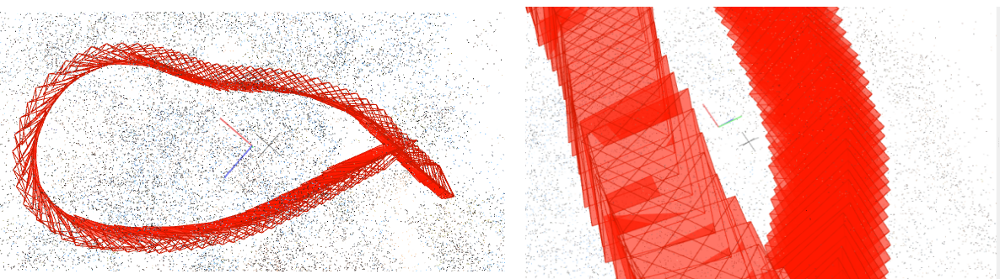
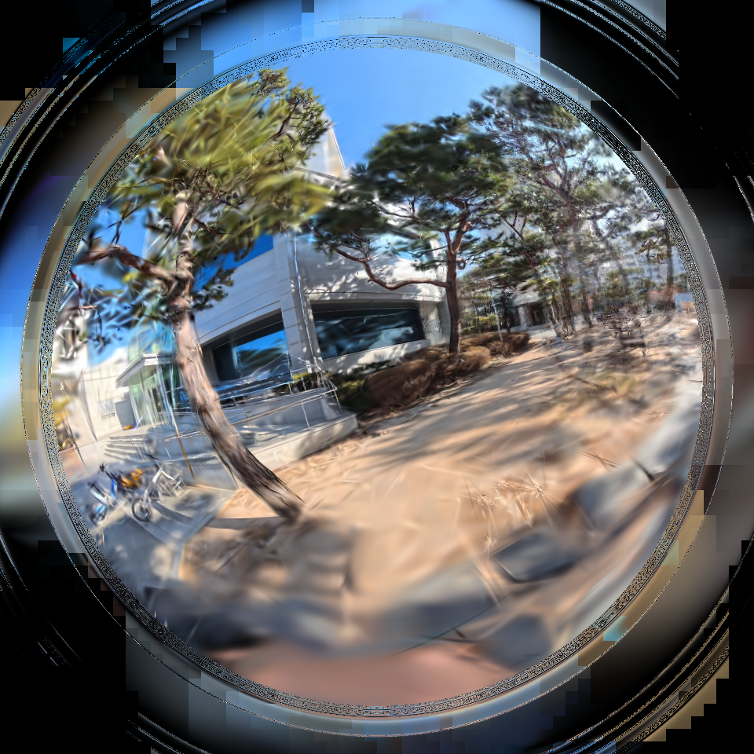
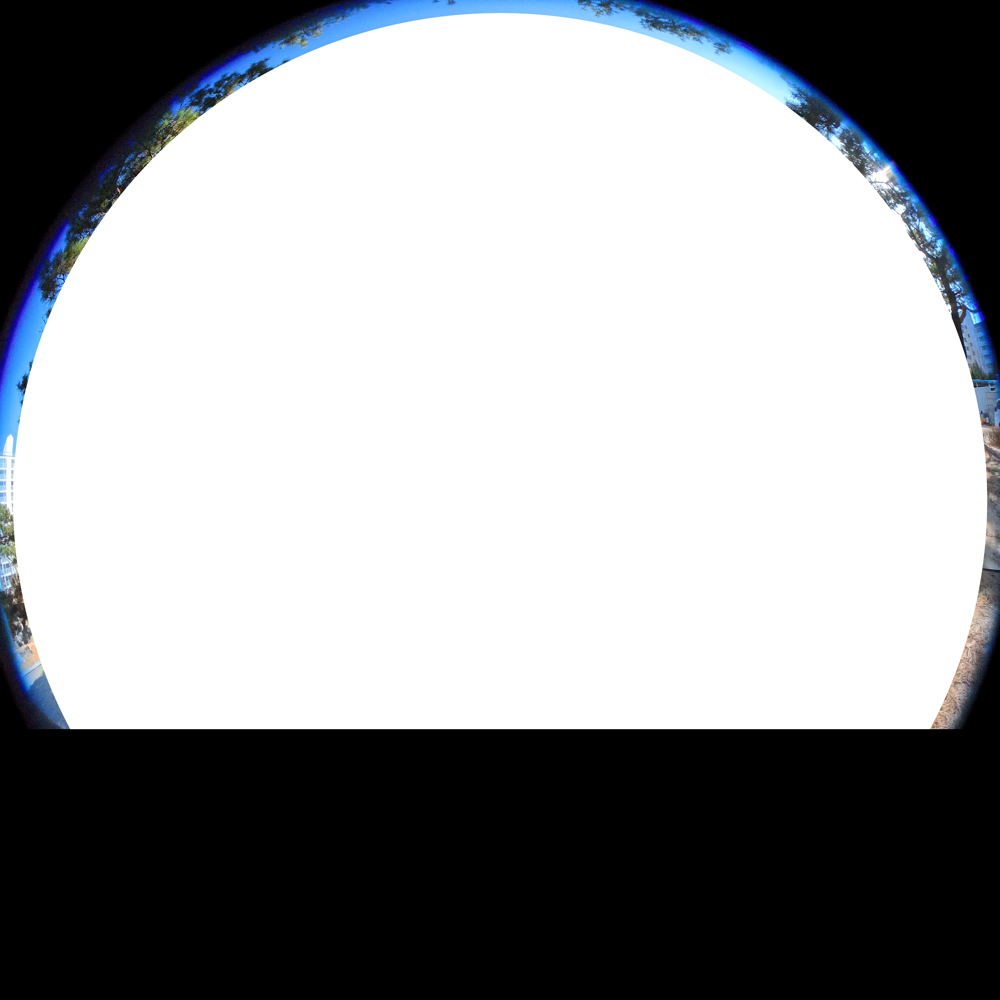
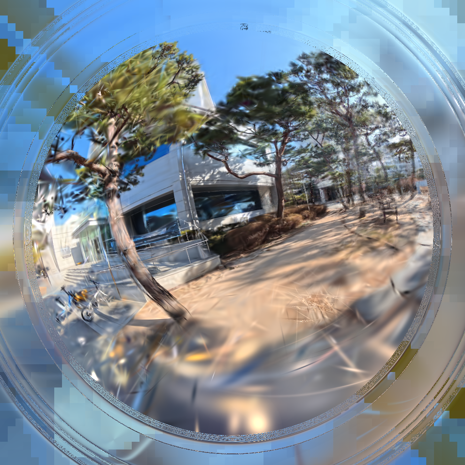

## 데이터셋 

- insv동영상파일을 두 개의 렌즈 중 촬영자가 안나온 렌즈에 대해 이미지를 추출함 

- 32초의 영상에서 3fps설정으로 3840x3840사이즈 92장의 이미지를 추출함


## COLMAP 수행

아래 명령어로 COLMAP 수행 
`--ImageReader.camera_model OPENCV_FISHEYE` 로 카메라 모델 설정

```
colmap feature_extractor --database_path database.db --image_path images --ImageReader.camera_model OPENCV_FISHEYE --ImageReader.single_camera 1 --ImageReader.default_focal_length_factor 1.0 --SiftExtraction.use_gpu 1 --SiftExtraction.max_num_features 8192 


colmap sequential_matcher \
 --database_path database.db \
 --SiftMatching.use_gpu 1


colmap mapper \
 --database_path database.db \
 --image_path images \
 --output_path sparse \
 --Mapper.ba_refine_principal_point 0

```
수행 결과 :

```
Cameras: 1
Images: 92
Registered images: 92
Points: 44580
Observations: 168582
Mean track length: 3.781561
Mean observations per image: 1832.413043
Mean reprojection error: 1.316313px
```




## 3DGUT 수행 

- 그대로 수행 시 이미지 크기가 너무 커 OOM문제가 발생 해 이미지리사이즈가 필요함

- 리사이즈를 1/4로 수행 후 실행  

` 
python train.py --config-name apps/colmap_3dgut.yaml path=data/sabit_fisheye out_dir=runs experiment_name=custom_3dgut dataset.downsample_factor=4
`

수행 결과 렌더 이미지가 아래와 같이 사이드가 부자연스럽게 나오는 것을 확인하고 마스킹을 이용해 해결하고자 함




마스킹 이미지는 아래와 같은 형태이고 아래쪽을 자른 이유는 사람 손이 포함되어 있어서 자름




마스킹을 적용한 후 학습한 결과는 아래와 같다. 



