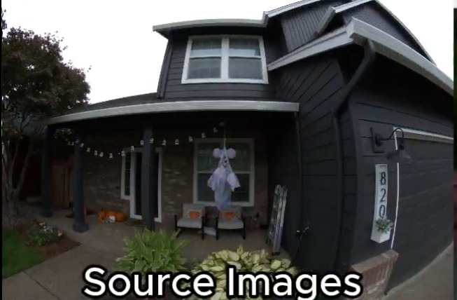
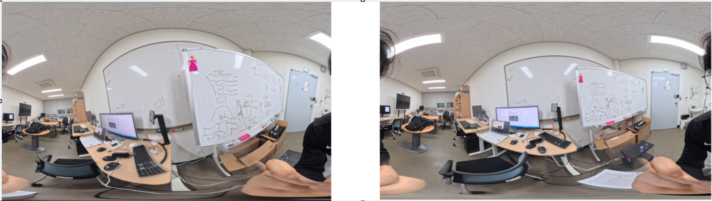
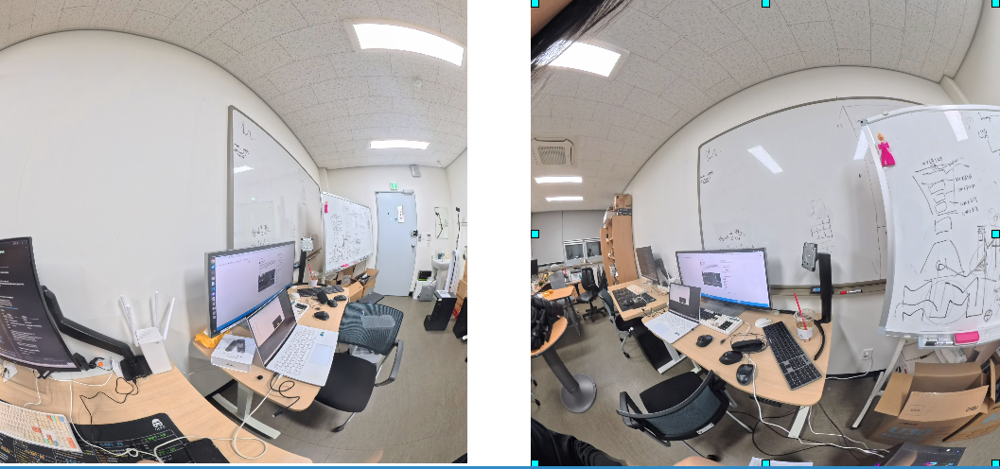
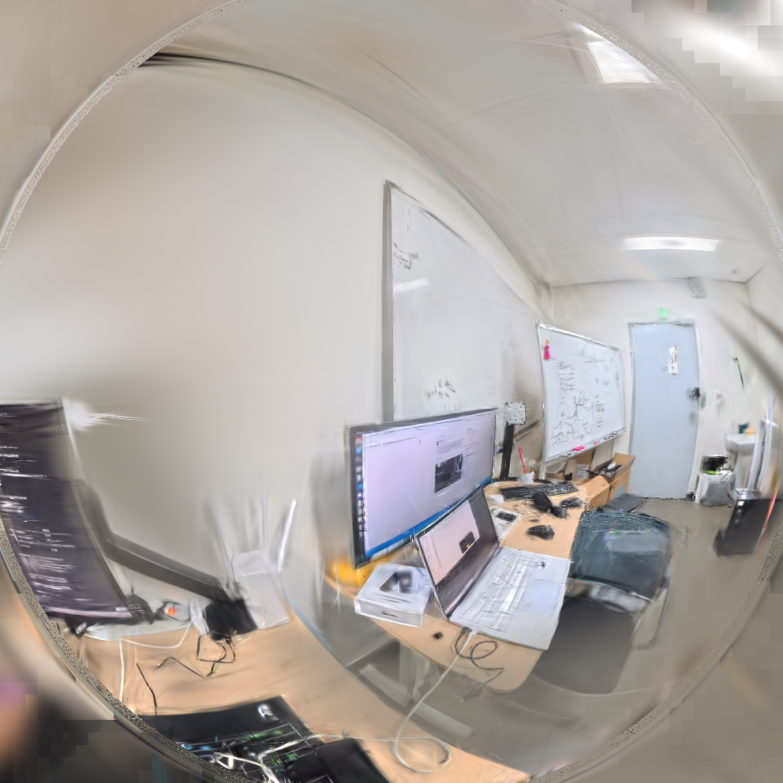
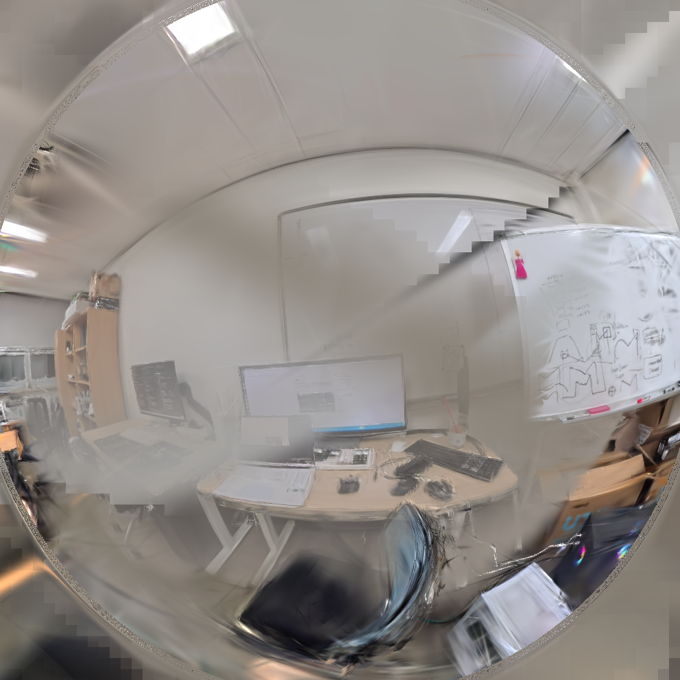
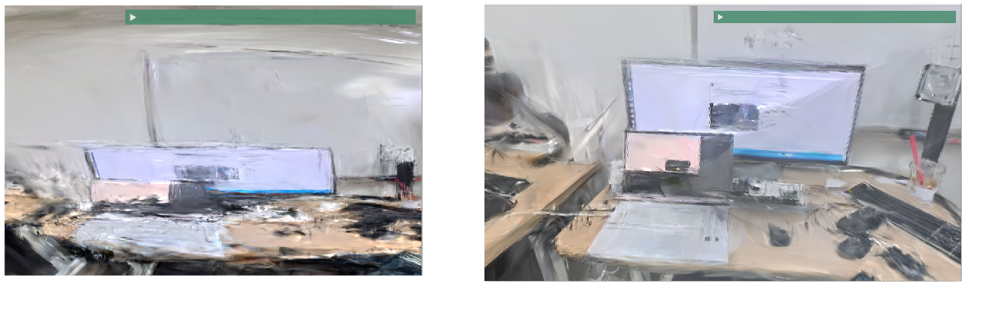
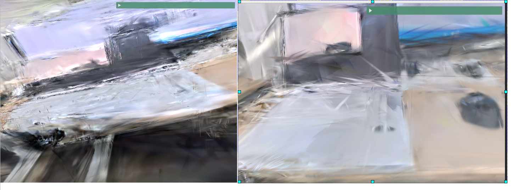

- Practice_3DGUT_v2의 결과에서 **circular fisheye image** 경우 적절한 결과가 나오지 않는다 판단하였고 이러한 이미지를 통한 사례를 찾지 못함 

- 구글링을 통해 Fisheye 이미지를 통해 3DGS를 수행하는 workflow를 찾은 결과 아래처럼 추측했다. 

- **https://x.com/jonstephens85/status/1912706266629013922?s=46** 이 링크상의 이미지처럼 풀프레임으로 되어 있는 이미지의 형태에서 수행하는 것으로 예상된다. 
   
- 엄연히 따지면 이 이미지는 fisheye이미지는 아니라고 할 수 있다.

- 어쨋든 이런 왜곡이 있는 풀프레임 이미지를 데이터로 하여 수행하고자 했다. 

## 데이터 
아래는 insta360 X5로 찍은 사진 두장이다(양 사이드에 얼굴이 나와 짜름)


이런 이미지를 예시 이미지와 같은 형태로 만들어주기 위해 아래와 같은 명령어로 처리했다.  

```
vf = (
        f"v360=equirect:fisheye:"
        f"h_fov={H_FOV}:v_fov={V_FOV}:yaw={YAW}:pitch={PITCH},"
        f"scale={out_size}:{out_size}"
    )

    cmd = [FFMPEG, "-y", "-i", in_path, "-vf", vf, "-frames:v", "1", out_path]

```


- 위와 같이 나오며 처음으로 본 샘플 이미지와 유사하게 왜곡이 있는 풀프레임 이미지로 나온것을 확인했다.

### COLMAP

```
colmap feature_extractor --database_path database.db --image_path images --ImageReader.camera_model OPENCV_FISHEYE --ImageReader.single_camera 1 --ImageReader.default_focal_length_factor 1.0 --SiftExtraction.use_gpu 1 --SiftExtraction.max_num_features 8192 


colmap sequential_matcher \
 --database_path database.db \
 --SiftMatching.use_gpu 1


colmap mapper \
 --database_path database.db \
 --image_path images \
 --output_path sparse \
 --Mapper.ba_refine_principal_point 0
```
다른 3DGS에서 지원하지 않는 camera_model인 OPENCV_FISHEYE를 3DGRUT에서 지원하기 때문에 OPENCV_FISHEYE로 설정한다. 


### 결과

┏━━━━━━━━━━━┳━━━━━━━━━━━┳━━━━━━━━━━━━┳━━━━━━━━━━┓
┃ mean_psnr ┃ mean_ssim ┃ mean_lpips ┃ std_psnr ┃
┡━━━━━━━━━━━╇━━━━━━━━━━━╇━━━━━━━━━━━━╇━━━━━━━━━━┩
│ 17.806    │ 0.705     │ 0.460      │ 1.072    │
└───────────┴───────────┴────────────┴──────────┘





뷰어에서의 결과는 아래와 같다. 


### PHINHOLE옵션

콜맵에서 카메라 모델로 OPENCV_FISHEYE가 아닌 PHINHOLE을 사용하면 아래와 같이 나온다. 

┏━━━━━━━━━━━┳━━━━━━━━━━━┳━━━━━━━━━━━━┳━━━━━━━━━━┓
┃ mean_psnr ┃ mean_ssim ┃ mean_lpips ┃ std_psnr ┃
┡━━━━━━━━━━━╇━━━━━━━━━━━╇━━━━━━━━━━━━╇━━━━━━━━━━┩
│ 17.224    │ 0.592     │ 0.499      │ 0.346    │
└───────────┴───────────┴────────────┴──────────┘

 


같은 뷰에서 비교했을 때 아래와 같다. 왼쪽이 PHINHOLE옵션, 오른쪽이 OPENCV_FISHEYE옵션





복원 품질에서 많은 차이가 있음을 확인 할 수 있다. PINHOLE의 경우 왜곡으로 인해 모니터가 비상적으로 길게 나온 것이 보인다. 

그에 반해 오른쪽 사진은 텍스쳐에 대한 복원은 조금 부족해도 왜곡은 사라진 것을 확인 할 수 있다. 