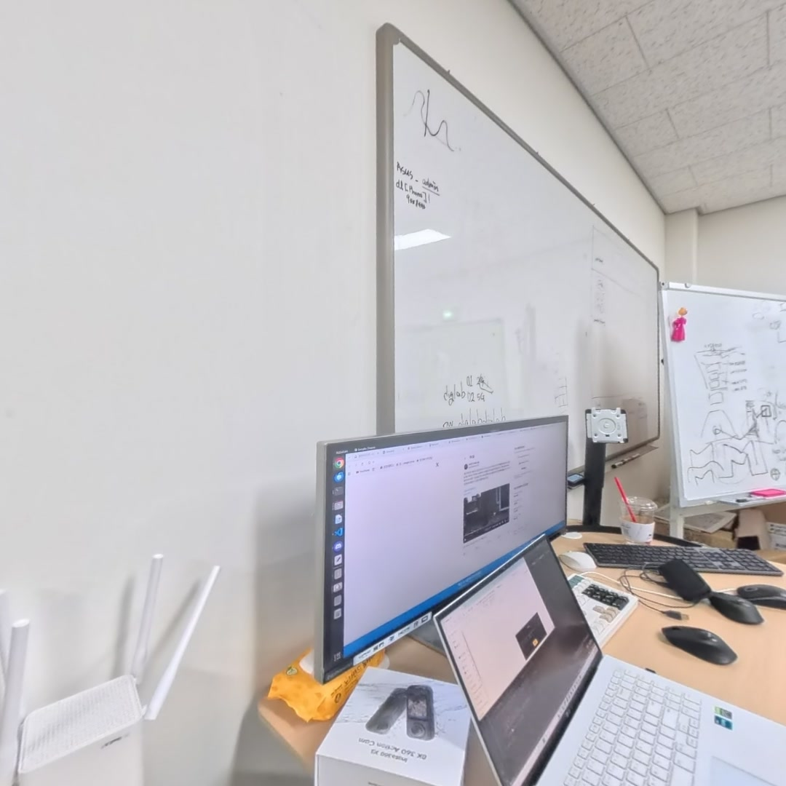
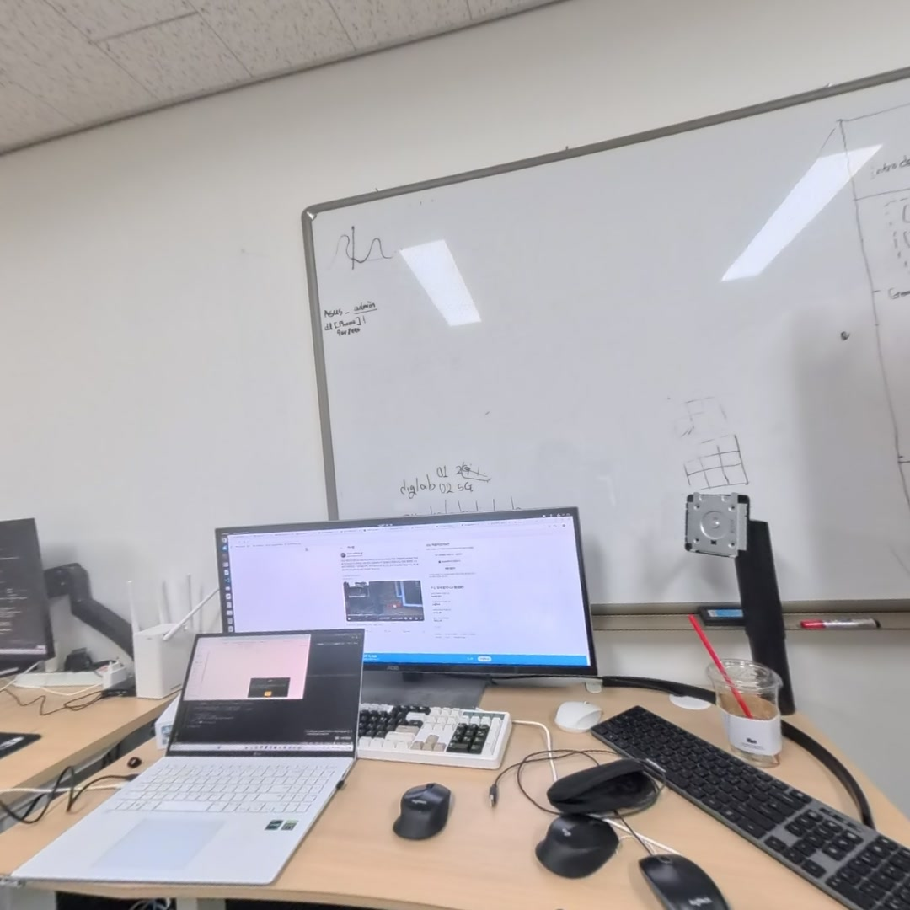
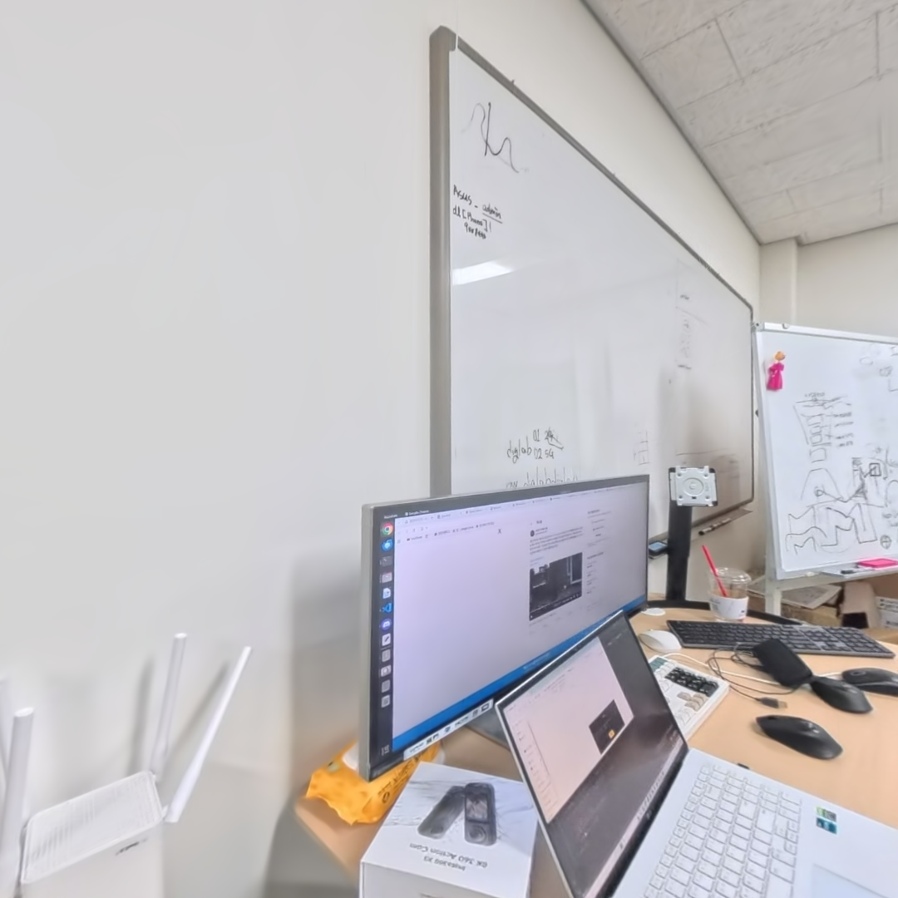
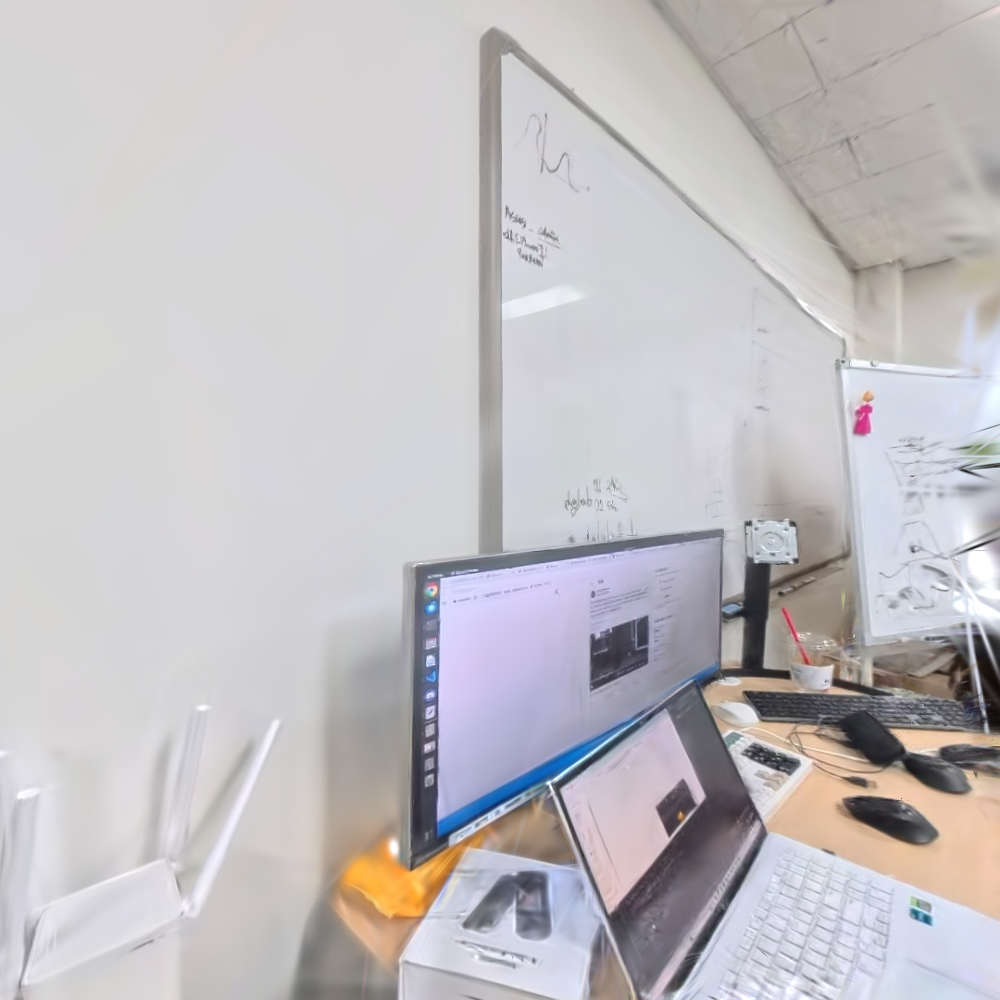
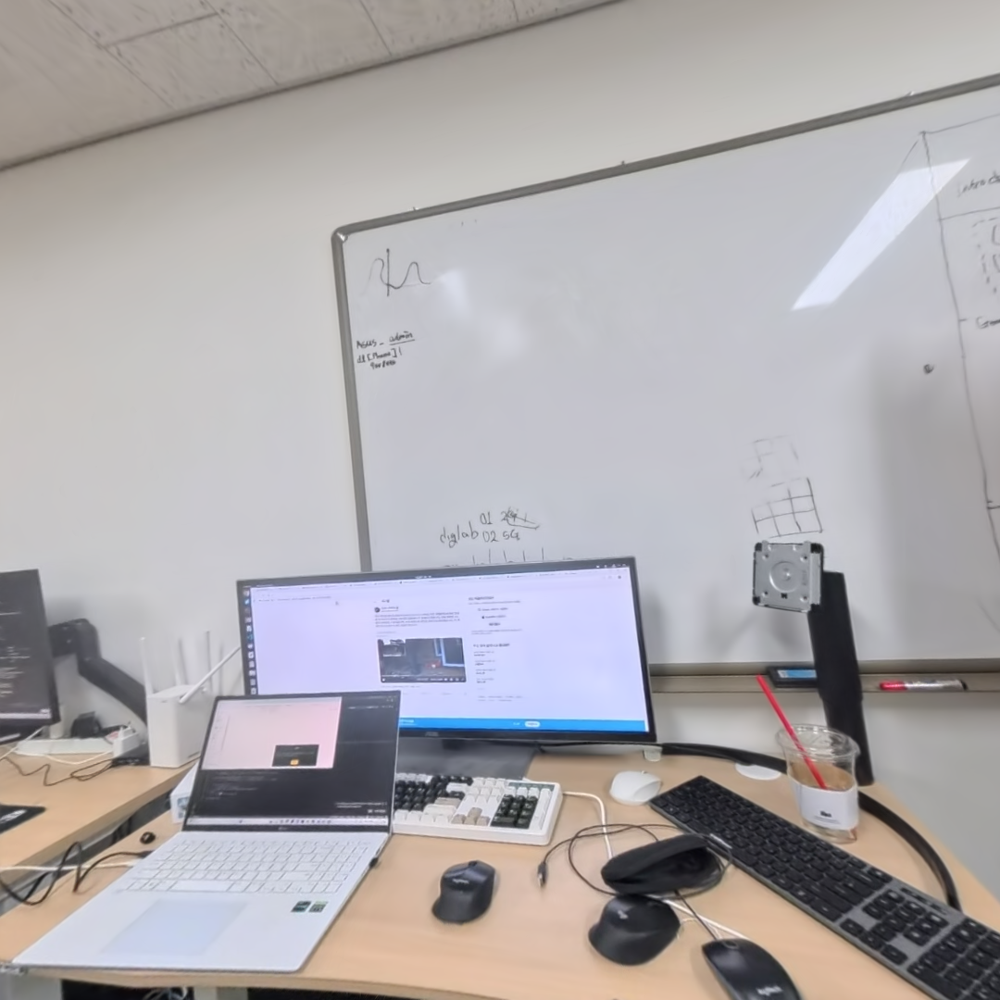

# 3DGUT Practice v4 — 360도 카메라 Perspective View 추출을 통한 3DGUT 수행

## 0. 개요

[3DGUT_Practice_v3](https://github.com/usnij/Research_repo/blob/main/Study/3DGUT_Practice_v3.md)에서는 360도 카메라(Insta360 X5)의 equirectangular 이미지를 fisheye로 변환하여 `OPENCV_FISHEYE` 모델로 3DGUT를 수행했다. 그 결과 PSNR 17.8 수준으로 품질이 낮았고, 어안 왜곡 이미지의 한계를 확인했다.

이번 v4에서는 접근 방식을 바꿔, 360도 equirectangular 이미지에서 **여러 방향의 perspective view(virtual pinhole) 이미지를 추출**하고, 이를 일반적인 COLMAP + PINHOLE 파이프라인으로 3DGUT 학습을 수행했다. 이 방식은 왜곡 없는 핀홀 이미지를 사용하므로 COLMAP SfM이 안정적이고, 기존 3DGS 파이프라인과 동일한 조건에서 비교가 가능하다.

**결론: 동일 데이터에서 3DGS가 3DGUT보다 품질이 우수했다.**

---

## 1. 환경

| 항목 | 내용 |
|------|------|
| OS | Ubuntu 22.04 |
| GPU | RTX 3070Ti |
| CUDA | 11.8 |
| Python | 3.11 (3dgrut conda env) |
| 카메라 | Insta360 X5 (360도 카메라) |

---

## 2. 데이터 준비

### 2.1 360도 이미지에서 Perspective View 추출

Insta360 X5로 촬영한 equirectangular(정방형) 이미지에서, 여러 yaw/pitch 조합의 perspective view 이미지를 추출가능하다. 이 과정에서 equirectangular → rectilinear(pinhole) 변환이 이루어지므로, 결과 이미지에는 렌즈 왜곡이 없다.

추출 방향 조합 (yaw, pitch):

(0°, 0°)에 해당하는 뷰의 14장 이미지를 추출했다.


### 2.2 원본 이미지 예시

| View 1 | View 2 |
|--------|--------|
|  |  |

---

## 3. COLMAP 수행

perspective view 이미지는 핀홀 카메라로 간주할 수 있으므로, COLMAP에서 `PINHOLE` 모델을 사용했다.

```bash
colmap feature_extractor \
    --database_path database.db \
    --image_path images \
    --ImageReader.camera_model PINHOLE \
    --ImageReader.single_camera 1

colmap sequential_matcher \
    --database_path database.db

colmap mapper \
    --database_path database.db \
    --image_path images \
    --output_path sparse
```

14장 전체가 정상적으로 등록되었다.

---

## 4. 학습 수행

### 4.1 3DGS (Gaussian Splatting)

기존 3DGS 파이프라인으로 학습을 수행했다.

### 4.2 3DGUT (Gaussian Unscented Transform)

동일 데이터에 대해 3DGUT 파이프라인으로 학습했다.

```bash
python train.py --config-name apps/colmap_3dgut.yaml \
    path=data/lab_norigv1 \
    out_dir=runs \
    experiment_name=lab_norig_3dgut
```

| 설정 항목 | 값 |
|-----------|-----|
| 렌더링 방식 | 3DGUT |
| 전략 | GSStrategy |
| 총 iteration | 30,000 |
| 카메라 모델 | PINHOLE (왜곡 없음) |
| Train/Test 분할 | interval=8 |

---

## 5. 결과 비교

### 5.1 시각적 비교

| | 원본 (Ground Truth) | 3DGS | 3DGUT |
|---|---|---|---|
| View 1 |  |  |  |
| View 2 |  |  |  |

3DGS(가운데)가 원본에 더 가까운 선명도와 디테일을 보이며, 3DGUT(오른쪽)은 고주파 디테일 손실과 텍스처 흐림이 관찰된다.

### 5.2 정량 메트릭

| 방법 | PSNR (dB) | SSIM | LPIPS |
|------|-----------|------|-------|
| **3DGS** | 41.7532310 | 0.9882917 | 0.0582241 |
| **3DGUT** |  26.6429901 | 0.8975731 | 0.1497668|


---

## 6. 분석: 3DGUT이 3DGS보다 낮은 품질을 보이는 이유

### 6.1 PINHOLE 데이터에서 UT의 이점 없음

3DGUT의 핵심은 **Unscented Transform(UT)**으로, 비선형 카메라 투영(렌즈 왜곡, 롤링 셔터)을 정확하게 처리하는 것이다. 그러나 이번 실험에서는:

- **이미지가 왜곡 없는 perspective view** (equirectangular에서 rectilinear로 변환)
- **COLMAP이 PINHOLE 모델로 추정** → 왜곡 계수가 모두 0
- **UT가 비선형 투영을 보정할 대상이 없음**

이 상황에서 UT는 7개 sigma point를 투영하고 2D Gaussian을 재조합하는 **불필요한 오버헤드**만 추가한다.

### 6.2 3DGS의 EWA Splatting이 더 효율적

왜곡이 없는 핀홀 카메라에서는 3DGS의 Jacobian 기반 EWA splatting이 **정확한 1차 근사**를 제공한다. 핀홀 투영은 비교적 선형에 가까우므로 Jacobian 근사 오차가 매우 작고, 결과적으로 3DGS의 투영이 더 정밀하다.

| 투영 방식 | 왜곡 없는 핀홀 | 왜곡 있는 카메라 |
|-----------|--------------|----------------|
| 3DGS (Jacobian) | **정확** (선형 근사 오차 매우 작음) | 부정확 (비선형 오차 큼) |
| 3DGUT (UT) | 정확하나 오버헤드 있음 | **정확** (sigma point가 비선형 처리) |

### 6.3 데이터 규모의 한계

14장이라는 적은 수의 학습 이미지도 품질 저하의 원인이 될 수 있다. 360도 카메라에서 더 많은 방향의 perspective view를 추출하면 개선될 여지가 있다.

---

## 7. 이전 실험과의 종합 비교

| 버전 | 데이터 소스 | 카메라 모델 | 이미지 수 | PSNR (GUT) | 비고 |
|------|-----------|-----------|----------|------------|------|
| **v1** | 아이폰 촬영 | PINHOLE | 135장 | 31.59 | GS(37.29) 대비 열세 |
| **v2** | Insta360 단일렌즈 (circular fisheye) | OPENCV_FISHEYE | 92장 | 14.49 | 심각한 품질 저하 |
| **v3** | Insta360 → 풀프레임 fisheye 변환 | OPENCV_FISHEYE | - | 17.81 | 개선되었으나 여전히 저품질 |
| **v4** | **Insta360 → perspective view 추출** | **PINHOLE** | **15장** | **33.72** | **GS 대비 열세** |

### 핵심 발견

1. **PINHOLE 데이터에서는 항상 3DGS > 3DGUT**: v1, v4 모두 동일한 결과
2. **FISHEYE 데이터에서 3DGUT의 이점은 제한적**: v2, v3에서 OPENCV_FISHEYE를 사용했지만 여전히 낮은 품질
3. **perspective view 추출이 가장 높은 PSNR**: v4(33.72)가 모든 360도 카메라 실험 중 최고

---

## 8. 결론

360도 카메라(Insta360 X5) 이미지에서 perspective view를 추출하여 3DGUT 학습을 수행한 결과, **PSNR 33.72dB, SSIM 0.9578**로 양호한 품질을 달성했으나, 동일 조건의 3DGS 대비 품질이 낮았다.

이는 **왜곡 없는 핀홀 이미지에서 UT의 이점이 발현되지 않기 때문**이며, 3DGS의 Jacobian 근사가 핀홀 카메라에서는 충분히 정확하기 때문이다.

3DGUT가 3DGS를 능가하려면 **렌즈 왜곡이 실질적으로 존재하는 raw 이미지**를 undistort 없이 직접 학습하거나, **롤링 셔터 데이터**를 사용해야 한다. 이는 논문의 설계 의도와 일치하며, 다음 실험에서 검증할 예정이다.
