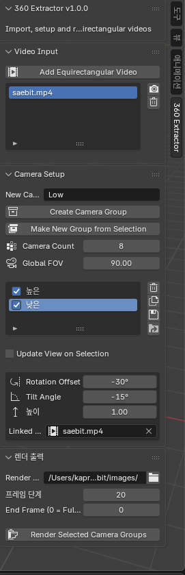
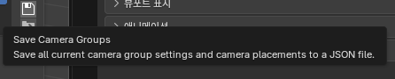
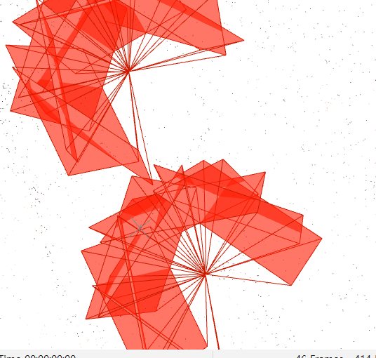
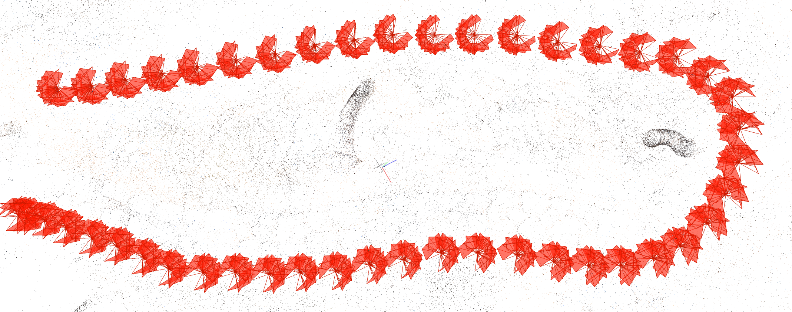

# **COLMAP rig constraint**
[COLMAP rig constraint를 활용한 GS pipeline](https://github.com/kyowon1108/gsplat-onthefly-nvs-study/blob/main/researchhistory.md)의 내용을 따라감으로서 GS에 대한 실전적인 경험 및 이론적 배경과 감각을 더욱 늘리는 것을 목표로함.

## COLMAP_Rig_Constraint 

- Rig_Constraint 과정은 기존의 COLMAP이 입력으로 받은 이미지를 전부 다른 독립된 Pose로 추정한다는 점과 차이가 있다. 

- 즉 입력으로 받은 이미지들이 임의의 위치나 어떤 특정 관계성을 프레임단위로 만족한다고 가정하고 그것을 제약해 재구성하는 것이다. 

- 가령 자동차에 달린 여러 카메라들을 예시로 들 수 있을 것이다. 

## **COLMAP의 과정**

- 기존의 COLMAP의 과정은 크게 4step 으로 구성된다. 

### 1. Feature Extraction (특징점 추출)
`colmap feature_extractor --database_path database.db --image_path images`

### 2. Sequential Matching (순차 매칭)
`colmap sequential_matcher --database_path database.db`

### 3. Sparse Reconstruction (희소 재구성)
`colmap mapper --database_path database.db --image_path images --output_path sparse/0`

### 4. Image Undistortion (이미지 왜곡 보정)
`colmap image_undistorter --image_path images --input_path sparse/0 --output_path undistorted --output_type COLMAP`


#### 여기서 COLMAP_Rig_Constraint를 수행하려면 몇 가지 과정이 추가되는데 핵심적인 method는 `rig_configurator`이다.  

- `rig_configurator`는 여러 카메라(센서)가 한 프레임에서 동시에 찍힌 데이터(이미지)를 COLMAP이 인식하게 해주는 것이다. 즉 DB에 rig/frame/sensor 관계를 재구성해주는 단계인 것이다. 

- rig_configurator를 수행하기 위해 필요한 것은 각 센서의 상대위치정보등을 담은 `rig_config.json`과 그에 맞춰 각 센서가 찍은 이미지를 적절한 디렉토리 구조로 되어 있어야 한다.  

- COLMAP 문서에서 요구하는 `rig_config.json`구조와 디렉토리 구조의 예시는 아래와 같다.  
    
```
[
  {
    "cameras": [
      {
        "image_prefix": "rig1/camera1/",
        "ref_sensor": true
      },
      {
        "image_prefix": "rig1/camera2/",
        "cam_from_rig_rotation": [
            0.7071067811865475,
            0.0,
            0.7071067811865476,
            0.0
        ],
        "cam_from_rig_translation": [
            0,
            0,
            0
        ]
      }
    ]
  },
  {
    "cameras": [
      {
        "image_prefix": "rig2/camera1/",
        "ref_sensor": true
      },
      ...
    ]
  },
  ...
]

```

**디렉토리 구조**
```
rig1/
    camera1/
        image0001.jpg
        image0002.jpg
        ...
    camera2/
        image0001.jpg # same frame as camera1/image0001.jpg
        image0002.jpg # same frame as camera1/image0002.jpg
        ...
    ...
rig2/
    camera1/
        ...
    ...
...

```
**같은 rig안에서 같은 프레임, 다른 센서의 이미지끼리는 파일명을 동일하게 하는 것이 핵심이다.**  


#### Image Undistortion

- Image Undistortion은 결론적으로 말하면 해당 파이프라인에서는 하지 않아도 된다. 왜나하면 Blender 360 Extractor단계에서 이미 이뤄지기 때문이다. 

- Blender 360 Extractor에서는 eqr 이미지에 대해 virtual pinhole 카메라를 정의할 수 있게 해준다. 결국 이를 통해 추출되는 이미지는 그냥 평범한 여러 장의 pinhole 이미지가 된다. 결론은 해당 파이프라인에서는 Image Undistortion단계는 필요하지 않다. 


## 실제 Insta360 X5 rig constraint 3DGS Pipeline

1. Instat360으로 촬영된 영상(.insv)을 Insta studio를 통해 mv4 파일로 변환

2. Blender 360 Extractor Tool을 통해 mp4영상에서 이미지 및 카메라에 대한 정보(json피일 형태) 추출

3. COLMAP 수행

4. Postshot 수행

### 1. .insv -> .mp4 변환

- 원본 .insv파일은 아래와 같다.


- Insta360 studio를 통해 변환한 mp4파일은 아래와 같이 나온다(사람이 나와 옆을 살짝 자름)

    

### 2. 이미지 추출

- Blender 360 Extractor Tool을 이용해 아래와 같은UI를 통해 이미지를 추출한다. 



- 촬영자가 안나오는 9개의 뷰에서 20프레임으로 설정해 이미지를 추출했다. 


- 이렇게 나온 데이터셋의 결과는 아래와 같다. 


| 항목 | 값 |
|------|---|
| 원본 영상 | 7680×3840 (29.97fps), 30초 |
| 총 이미지 수 | 414장 |
| 카메라 수 | 9대 (High 5대 + Low 4대) |
| 프레임 수 | 46개 |
| 이미지 해상도 | 1920×1920 |

- 또한 아래 이미지의 버튼을 눌러 카메라 뷰에 대한 위치를 `json`형태로 추출해준다.

)

```
[
    {
        "name": "High",
        "radius": 1.0,
        "height": 1.0,
        "tilt": 15.000000417413029,
        "rotation_offset": 0.0,
        "cameras": [
            {
                "name": "High_Cam01",
                "location": [
                    1.0,
                    0.0,
                    1.0
                ],
                "rotation": [
                    0.43045932054519653,
                    0.5609855055809021,
                    -0.5609855055809021,
                    -0.43045932054519653
                ],
                "angle_offset": 0.0
                ...
        ...
```


### 3. COLMAP수행

- 전 단계에서 얻은 카메라에 대한 `json`파일을 바탕으로 `rig_config.json`파일을 작성하고, 이미지에 대한 디렉토리 구조를 위에서 설명한 것처럼 변경해야한다. 

- `rig_config.json` 파일은 아래와 같이 작성되어 있다. 
```
[
  {
    "rig_id": 1,
    "cameras": [
      {
        "image_prefix": "High_Cam01/",
        "ref_sensor": true
      },
      {
        "image_prefix": "High_Cam02/",
        "cam_from_rig_rotation": [
          0.9238795198081952,
          2.8480464533549614e-08,
          0.36964381827344894,
          -0.09904585044919136
        ],
        "cam_from_rig_translation": [
          0.7071067617414908,
          -0.07580647783295112,
          -0.28291311920733253
        ]
      },
      {
        "image_prefix": "High_Cam06/",
        "cam_from_rig_rotation": [
          0.3826834540320676,
          2.6927669092355574e-08,
          -0.8923990886165519,
          0.23911762930916056
        ],
        "cam_from_rig_translation": [
          -0.7071068612572545,
          -0.44183179121886557,
          -1.6489384642771128
        ]
      },
         ...
    ...
```

- 하나의 rig안에 모든 카메라가 속해 있는 형태이며 Blender 360 Extractor을 통해 추출한 json파일의 정보를 COLMAP이 이해하는 “rig 좌표계 기준 각 카메라의 상대 자세”로 변환한 것이다.


- `rig_config.json`에서 요구하는 것은 다음과 같다. 

    - `cam_from_rig_rotation` : Rig → Camera 회전 (쿼터니언)

    - `cam_from_rig_translation` : Rig → Camera 이동 (3D 벡터)

    - $\ P_{cam} = R_{cam<-rig}P_{rig}+t_{cam<-rig}$

    - 이를 위해서는 먼저 **rig 좌표계**를 정의해야 한다. 여기서는 임의의 한 카메를 rig좌표계의 기준으로 뒀고 "High_Cam01"를 "ref_sensor": true 으로 적용할 수 있다.

    - 결국 이제 각 카메라마다 "High_Cam01" 기준 상대 pose를 구하면 된다. 

    - 여기서 또 주의해야 하는 점은 가지고 있는 Blender 360 Extractor을 통해 얻은 정보는 Blender 좌표계이고 COLMAP이 해석하는 좌표계는 OpenCV 좌표계 변환인 점을 주의해야 한단. 


- `feature_extractor` 단계에서 `--ImageReader.single_camera_per_folder 1`
- `rig_configurator`수행
- `sequential_matcher` 단계에서 `--FeatureMatching.rig_verification 1`
- `mapper` 단계에서 `--Mapper.ba_refine_sensor_from_rig 0`, `--Mapper.ba_refine_focal_length 0`, `--Mapper.ba_refine_principal_point 0`, `--Mapper.ba_refine_extra_params 0` 수행해준다.

- COLMAP GUI 시각화 결과는 다음과 같다. 

)

)

### 4. postshot 수행 

- POSTSHOT을 통해 렌더링한 이미지는 아래와 같이 나온다.


