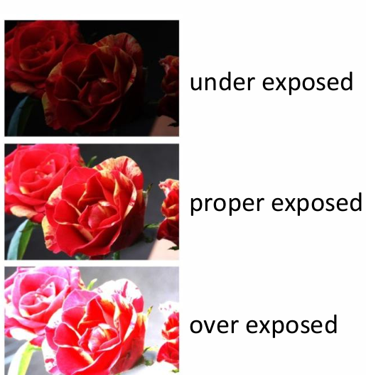
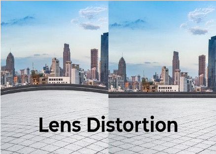
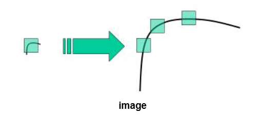
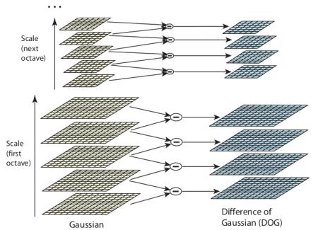
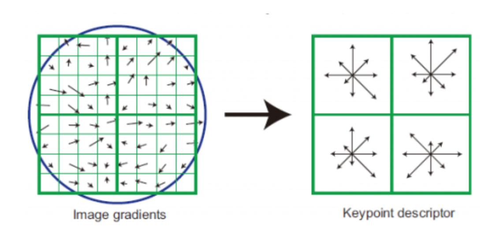
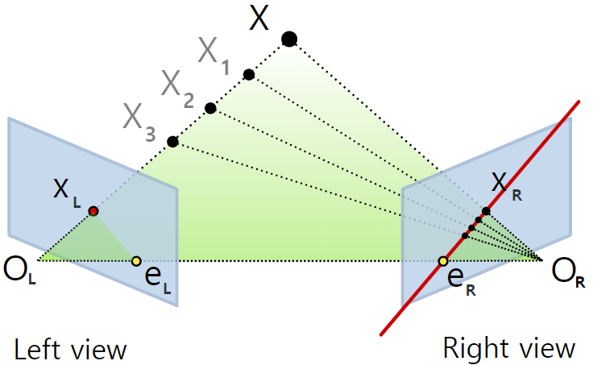

# Camera_study

- 노출(Exposure): 이미지의 밝기를 결정하는 빛 수신부(sensor)에 도달하는 빛의 양을 의미
  - 이는 조리개(Aperture) 크기와 셔터 속도(Shutter Speed)에 의해 조절됨
  - 조리개가 클수록(F-Number가 낮을수록) 더 많은 빛이 들어오고, 셔터 속도가 느릴수록 더 많은 빛이 들어온다.
  - 
  - F-Number : 초점거리(focal length) / 조리개(Aperture) 지름 
  - 초점거리(Focal length) : 카메라 중심(Center of Projection, COP)에서 이미지 평면(센서)까지의 거리(물리적 정의)
    - 초점거리는 얼마나 넓게 보느냐를 정의한다. 
    - $$FOV(Field of View, 시야각)=2arctan(\frac{sensorsize​}{2f})$$
            | focal length | 특징            |
            | ------------ | ----------      |
            | 작음         | 넓은 시야 (광각) |
            | 큼           | 좁은 시야 (망원) |
    - 주로 CV에서는 모델링 구간에서 상수로 놓는다. -> 이유 : 초점거리가 달리지면 다른 카메라를 쓰는셈이 됨
    - GS에서는 projection Jacobian에 직접 포함됨


## 카메라 모델:
- 핀홀 모델(Pin-hole Model): 조리개 크기가 충분히 작다고(거의 점) 가정하는 모델이다. 핀홀 모델은 기하학적 왜곡이나 흐림 효과 등은 무시한다.
- 렌즈 모델(Lens Model): 현실의 카메라라고 볼 수 있으며, task를 수행할 때 카메라 내부의 기구적인 부분을 고려해야할 필요가 있다.
  - 하지만 이미지 분류(image classification)나 객체 검출(YOLO)같은 task에서는 고려하지 않는다.
  - 기하가 중요한 Task에서 주로 전처리 단계에서 왜곡을 최대한 줄이게 된다.


## Camera Projection

(1) World -> Camera 
- $X_c = RX_w + t$
- Extinsic 변수에 의해 변환된다. 
- 이는 월드좌표계상의 오브젝트의 좌표가 카메라를 원점으로 하는 좌표계에서 본 3D 좌표로 변환되는 것이다.
- 이 과정에서 나온 output은 결국 카메라로 부터 떨어진 위치를 뜻한다. 

(2) Camera -> Normalized image

- $X_{norm} = \begin{pmatrix}{x}\\{y}\\{z}\end{pmatrix}= \begin{pmatrix}{X_c/Z_c}\\{Y_c/Z_c}\\{1}\end{pmatrix}$
- 이는 카메라로부터 얼마나 앞에 있는지를 뜻하는 Z_c를 X와 Y에 나눔으로서 원근감을 표현하게 해준다. 즉 3차원상의 오브젝트를 사영해주는 것이다.
- Z_c가 커질수록 카메라로부터 더 멀리떨어진 것이므로 작게 보이게 되는것이다. 

(3) Noramlized image -> pixel
- Normalized image 좌표를 실제 이미지의 픽셀 좌표로 변환하는 단계이며, 이 변환을 담당하는 것이 바로 내부변수 행렬 K다.
- $K = \begin{pmatrix}
    {​fx} & {0} & {​cx}\\
    {0} & {fy} & {​cy} \\
    x{0} & {0} & {1}\end{pmatrix}$
    | 항목         | 의미                   | 비고         |
    | ---------- | -------------------- | ---------- |
    | (f_x, f_y) | 초점 거리 (픽셀 단위)        | 시야각, 확대/축소 |
    | (c_x, c_y) | 주점 (principal point) | 이미지 중심     |
    | skew       | 센서 기울기               | 대부분 0      |
- K 행렬을 통한 출력이 아래와 같이 나오게 된다. 
  
    $u= \begin{pmatrix}{u}\\{v}\\{1}\end{pmatrix}$
- 이는 실제 이미지 좌표이며 OpenCV기준 (0,0) 은 이미지의 좌상단에 해당한다. 


## Camera Calibration 
- 현실 카메라가 찍은 이미지로부터 카메라 파라미터들을 추정하는 과정이다. 

- 실제 Gaussian Splatting task에서 Camera Calibration은 필수적인 전처리 단계 중 하나이다.
  

- Calibration의 목표는 크게 3가지:
  1. Intrinsic(내부파라미터) 추정 : K
  2. Distortion(렌즈 왜곡) 추정 : $(k_1,k_2,p_1,p_2,...)$
  3. (캘리브레이션 이미지마다) Extrinsic(외부파라미터) 추정
  - 즉 task에 사용하는  lens 카메라의 특징들을 확인하기 위함

- 수행 과정

 1. 카메라로 체커보드를 직접 찍을 수 있는 경우
     - 이 경우 실제 체커보드를 준비해 카메라로 다양한 거리, 각도로 촬영한 이미지를 사용한다. 
     - OpenCV의 ```findChessboardCorners```와 ```cv2.calibrateCamera```로 추정 가능
     - undistort를 통해 픽셀좌표 재배치
       - Undistort : 기하학적으로 올바른 좌표계로 변환하는 것
     - 주로 이 과정은 로봇이나 자율자동차 같은 연구 환경에서 사용
  
 2. 이미 촬영된 이미지들만 있는 경우(Nerf, GS) 

    - 이 경우 COLMAP을 주로 사용
    - COLMAP : 여러 장의 이미지로부터 카메라 파라미터(내-외부)와 장면의 3D 구조를 추정하는 Structure-from-Motion(SfM) + Multi-View Stereo(MVS) 도구이다.


## Camera pose estimation
  - 카메라가 월드좌표계에서 어디에 있고, 어디를 보고 있는지(R, t)를 추정하는 것
  - 이는 보통 카메라의 외부 변수로 표현한다.

  - 3D 점들의 월드좌표계상에서의 위치를 이미지와 함께 입력으로 받아 R,t를 출력하는 PnP방식이 있다. 이는 이미 3D 구조를 알고 있는 상황에서 들어온 이미지에 대해 어디서 찍혔는지 추정하게 된다
  


## COLMAP
- COLMAP은 위에서 설명한 SfM(Structure from Motion)과 MVS(Multi-View Stereo)와 Calibration을 범용적으로 사용 할 수 있게 만든 라이브러리이다. 
  - SfM은 이미지들을 입력으로 받아 Camera Parameter와 Point Cloud를 생성하고
  - MVS는 'SfM 결과값'을 입력으로 받아 3D 모델을 Reconstruction한다.

- SfM
  
  - SfM은 아래 과정을 통해 진행되게 된다. 
- 
  
  
  1. Feature Extration
    - 각 이미지마다 feature를 추출한다. 이는 SIFT 알고리즘으로 주로 진행된다.  
      - SIFT(Scale Invariant Feature Transform)은 이름 그대로 Scale에 불변한 피쳐 추출 알고리즘이다.

      - 기존의 알고리즘은 아래 그림처럼 Scale에 강건하지 않은 모습을 띈다. 즉 강건하지 않은 알고리즘을 사용할 경우 피쳐 추출이 잘 이뤄지지 않을 것이다. 
      -  https://docs.opencv.org/4.x/da/df5/tutorial_py_sift_intro.html

      - SIFT알고리즘은 가우시안 블러를 이용해 만든 Scale-Space를 통해 피쳐 추출이 이뤄진다. 이는 동일한 구조를 여러 Scale에서 관측해 그중 가장 안정적인 feature를 선택하기 때문에 강건하다고 볼 수 있다. 
      - SIFT 알고리즘은 feature로 관측한 부분에서 Key point descriptor가 구해지게 된다. 여기에는 해당 영역에서 밝기 변화가 어느 방향으로 얼마나 강하게 나타나는지에 대해 벡터정보로 나타내는 gradient 방향 분포를 담고 있다. 
      - 

  2. Matching
     - SIFT알고리즘을 통해 나온 SIFT descriptor(keypoint_descriptor)를 각각의 이미지 쌍에서 유사한 피쳐를 찾는다.

  3. Geometric Vertication
     - Feature들이 기하적으로 말이 되는지 확인하는 단계로 matching 단계에서 찾은 쌍들에 대해 찾는것이다.
     - RANSAC으로 잘못된 매칭 제거
     - 에피폴라 제약 사용
     -  (https://xoft.tistory.com/80)
     - 여기서 e_L과 e_R은 각 이미지를 찍는 카메라의 중심점을 서로 잇는 선에서 나오는 점이다. 
     - 위의 이미지 상에서 다른 위치에서 찍은 두 이미지를 뜻하는 O_L과 O_R에서 어떤 점 X가 서로 같은것임을 가리키려면 e_R~X_R선위에 존재해야 한다는 것이다.(위 그림에서는 선위에 존재함) 
     - 이 빨간선을 에피폴라 선이라고 부름 
  
     - RANSAC(Random Sample Consensus)은 outlier가 섞여 있어도, 올바른 모델을 확률적으로 찾아내는 강건한(robust)추정 알고리즘이다. 
     - 전체 샘플 중에서 적은 수에 해당하는 샘플을 랜덤하게 뽑아 모델을 만들어 좋은 성능이 나올 때까지 반복한다.
     - 이는 outlier가 많은 데이터 중 운이 좋게 inlier만으로 모델이 생기는 것을 기대한다. 
  4. Initialization
     - 위 과정들을 통해 매칭이 잘 된 이미지쌍을 고른다. 
     - 두 뷰로부터 (R,t)와 초기 3D점들을 만듦
     - 이를 통해 기준의 되는 하나의 카메라로 부터 다른 카메라가 어떻게 회전, 이동되어있는지 파악할 수 있다. 
  5. Image Resistration 
     - 나머지 이미지에 대해 PnP알고리즘을 이용해 카메라 Pose를 등록한다. 
  1. Triangulation


  7.BUndle Adjustment 
  - 최종적으로 모든 $R^i, t^i$ ,3D점을 reprojection error가 최소가 되도록 한 번에 최적화한다.


### MVS 개요

   입력 (SfM 결과)
- 카메라 포즈 (위치·자세)
- 카메라 내부 파라미터
- 희소 3D 포인트 클라우드 (Sparse Point Cloud)

 출력
- 각 뷰(view)에 대한 **Depth Map**
- 모든 depth map을 통합한 **Dense Point Cloud (조밀 3D 점군)**
- (후처리 시) **Mesh / Textured Model**

---

2️⃣ COLMAP MVS 전체 파이프라인

 (1) View Selection (스테레오 쌍 선택)

- 각 이미지에 대해 **겹침(overlap)** 이 충분한 이웃 뷰들을 선택
- 선택 기준:
  - 시점 간 각도 차이 (baseline)
  - 공유되는 3D 포인트의 개수
- 목적:
  - 신뢰도 높은 **Stereo Matching**을 수행하기 위함

---

 (2) Depth Map Estimation (핵심 단계)

- **이미지 단위(view-wise)** 로 depth map을 계산
- 사용 방식:
  - **PatchMatch Stereo**
    - 픽셀 단위로 깊이를 확률적으로 추정
    - 여러 뷰 간 **포토메트릭 일관성(cost)** 을 최소화
- 결과:
  - 각 픽셀마다 깊이 값이 할당됨  
    → *“이 픽셀은 카메라로부터 얼마나 떨어져 있는가?”*

📌 이 단계가 **MVS 전체 성능의 대부분을 좌우**함

---

 (3) Depth Map Filtering

- 잘못 추정된 깊이 값 제거
  - 시야각 차이가 지나치게 큰 경우
  - 광도 불일치로 인한 outlier
- 여러 뷰 간 **Depth Consistency Check** 수행
- 목적:
  - 노이즈 제거
  - 표면의 기하 구조를 더 날카롭게 유지

---

 (4) Fusion (Depth → 3D)

- 모든 뷰의 depth map을 **하나의 월드 좌표계**로 통합
- 각 픽셀을 3D 점으로 변환:
  - `(u, v, depth) → 3D point`
- 결과:
  - **Dense Point Cloud**
  - 희소 SfM 포인트보다 훨씬 조밀한 3D 구조


## ○ 참고문서

- [[개념 정리] SfM](https://xoft.tistory.com/88)
- [[개념 정리] Epipolar Geometry](https://xoft.tistory.com/80)
- https://docs.opencv.org/4.x/da/df5/tutorial_py_sift_intro.html


    
    


