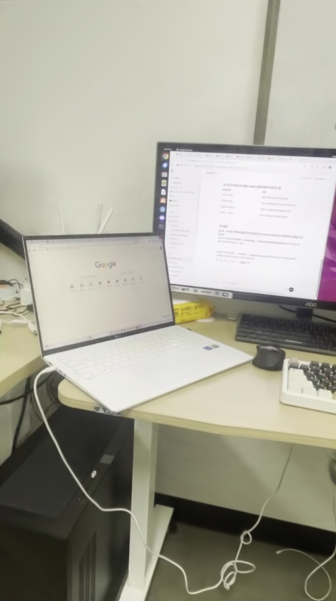
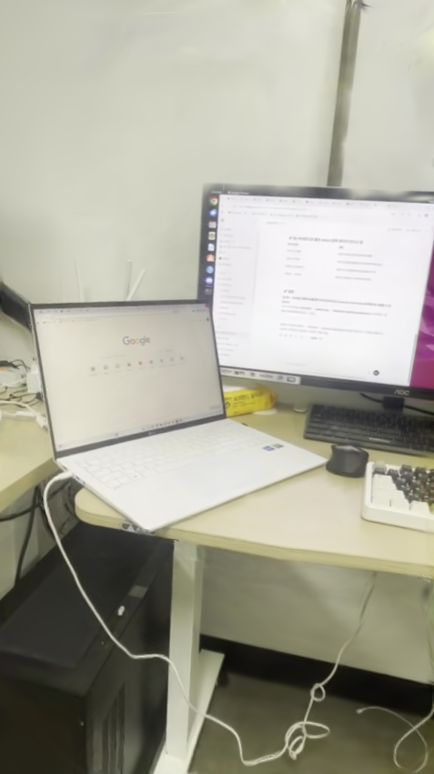
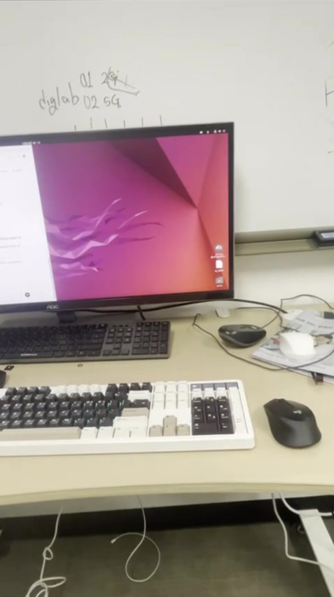
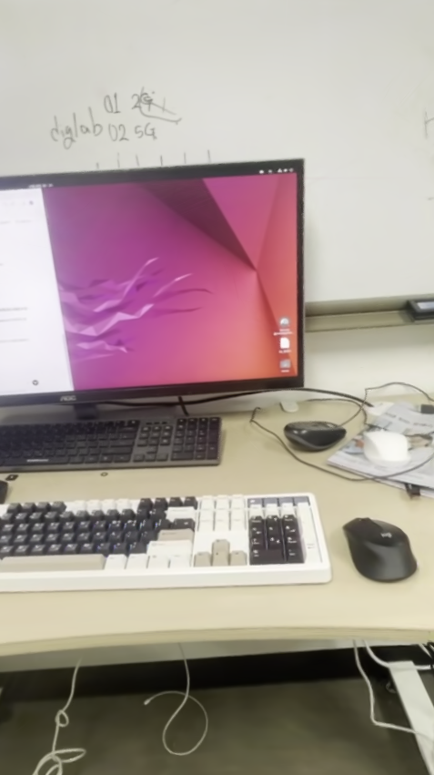

# 3DGUT
https://github.com/nv-tlabs/3dgrut 논문의 코드 실행, 동작 원리 이해, 사용자 데이터셋에 대한 학습을 목적으로 함

## 0. 환경
- OS : Ubuntu 22.04
- GPU : RTX 3070Ti
- CUDA version : 11.8
- Python version : 3.9.*


## 1. Dataset

- 데이터는 위 링크에서 예제로 사용되는 데이터와 **직접 찍은 데이터**로 학습을 진행했다.

- 논문의 프로젝트에서는 데이터의 종류를 세 가지로 설정해 성능을 평가하고 있다.
    1. `nerf_synthetic`
    2. `Mip-NeRF 360(colmap)`
    3. `ScanNet++`
    - 각 데이터셋의 간단한 특징은 `nerf_synthetic` **CG**데이터이며, 순수한 렌더링 성능을 위한 데이터라고 보여지며, `Mip-NeRF 360(colmap)`은 **실제 촬영** 데이터이고 카메라포즈를 COLMAP으로 추정하게 된다. `ScanNet++`은 `Mip-NeRF 360`보다 고난도에 해당하는 데이터로 텍스쳐가 불규칙하고, 조명/노이즈/왜곡이 심한 데이터에 해당한다. 

- **직접 찍은 데이터는** 2번에 해당하고 그에 맞춰 진행했다. 

- 데이터는 3DGS를 진행했던 것으로 진행했다.


## 2. train

`python train.py --config-name apps/colmap_3dgut.yaml path=data/mipnerf360/bonsai out_dir=runs experiment_name=bonsai_3dgut dataset.downsample_factor=1` 
진행했고 
```
(3dgrut) :~/Documents/Github/3dgrut$ python train.py --config-name apps/colmap_3dgut.yaml path=data/time_check out_dir=runs

──────────────────────────────── Load Datasets ─────────────────────────────────
Load Dataset (train) ━━━━━━━━━━━━━━━━━━━━━━━━━━━━━━━━ 100% :: 🕒 Elapsed 0:00:00
Load Dataset (val) ━━━━━━━━━━━━━━━━━━━━━━━━━━━━━━━━━━ 100% :: 🕒 Elapsed 0:00:00
─────────────────────────────── Initialize Model ───────────────────────────────

Loading extension module lib3dgut_cc...
[07:31:26] [INFO] 🔆 Using GS strategy                              logger.py:67
──────────────────────── Setup Model Weights & Training ────────────────────────
[07:31:27] [INFO] 🤸 Initiating new 3dgrut training..               logger.py:67
           [INFO] Found 11794 colmap points                         logger.py:67
           [INFO] 🔆 Using Adam optimizer                           logger.py:67
           [INFO] 🔆 Using Adam optimizer                           logger.py:67
           [INFO] 📊 Training logs & will be saved to:              logger.py:67
           runs/time_check-2201_073127                                          
──────────────────────────────── Training 3DGUT ────────────────────────────────
[07:31:31] [INFO] Cloned 853 / 11794 (7.23%) gaussians              logger.py:67
           [INFO] Splitted 5929 / 12647 (46.88%) gaussians          logger.py:67
           [INFO] Density-pruned 58 / 18576 (0.31%) gaussians       logger.py:67
[07:31:32] [INFO] Density-pruned 39 / 18518 (0.21%) gaussians       logger.py:67
[07:31:33] [INFO] Density-pruned 23 / 18479 (0.12%) gaussians       logger.py:67
[07:31:34] [INFO] Cloned 2416 / 18456 (13.09%) gaussians            logger.py:67
           [INFO] Splitted 6058 / 20872 (29.02%) gaussians          logger.py:67
...

           [INFO] Density-pruned 67 / 240450 (0.03%) gaussians      logger.py:67
[07:35:03] [INFO] Density-pruned 87 / 240383 (0.04%) gaussians      logger.py:67
[07:35:04] [INFO] Density-pruned 64 / 240296 (0.03%) gaussians      logger.py:67
[07:35:06] [INFO] Cloned 3041 / 240232 (1.27%) gaussians            logger.py:67
           [INFO] Splitted 495 / 243273 (0.20%) gaussians           logger.py:67
           [INFO] Density-pruned 47 / 243768 (0.02%) gaussians      logger.py:67
[07:35:08] [INFO] Density-pruned 81 / 243721 (0.03%) gaussians      logger.py:67
[07:35:10] [INFO] Density-pruned 73 / 243640 (0.03%) gaussians      logger.py:67
[07:39:21] [INFO] 💾 Saved checkpoint to:                           logger.py:67
                                 

                 🎊 Training Statistics                 
┏━━━━━━━━━┳━━━━━━━━━━┳━━━━━━━━━━━━━━━┳━━━━━━━━━━━━━━━━━┓
┃ n_steps ┃ n_epochs ┃ training_time ┃ iteration_speed ┃
┡━━━━━━━━━╇━━━━━━━━━━╇━━━━━━━━━━━━━━━╇━━━━━━━━━━━━━━━━━┩
│ 30000   │ 255      │ 474.11 s      │ 63.28 it/s      │
└─────────┴──────────┴───────────────┴─────────────────┘

```


## 3. 결과  

| Id | Raw | 3DGS| 3DGUT |
|-----------|-----|--------|-----|
| 1 |  |  |  |
| 2 |  |  |  |
| 3 |  |  |  |


| |SSIM |PSNR|LPIPS|학습시간|
|-----|-----|-----|-----|-----|
|3DGUT|0.9633064|31.5870323|0.0849544|약 8분 20초|
|3DGS|0.9815034|37.2909775|0.0558935|약 12분 32초 |


- 결론적으로 말하면 3DGUT의 성능이 3DGS보다 저열하다. 

