# Z-Thickness Blending: Effective Fragment Merging for Multi-Fragment Rendering
Dongjoon Kim, Heewon Kye | Pacific Graphics 2021 (CGF Vol.40, No.7) | DOI: 10.1111/cgf.14409

해당 논문에 대한 이해를 목적으로 논문을 읽고 정리함

---

## 1. Introduction

### Multi-Fragment Rendering(MFR)이란

**Multi-Fragment Rendering**은 하나의 픽셀 위치에 여러 fragment가 동시에 존재할 때 이를 처리하는 렌더링 기법이다.

GPU 파이프라인은 크게 두 단계로 동작한다:
1. **Store pass**: 3D geometry 정보를 framebuffer에 저장 (screen-space geometric information 생성)
2. **Resolve pass**: 저장된 screen-space 정보를 활용해 최종 이미지 생성

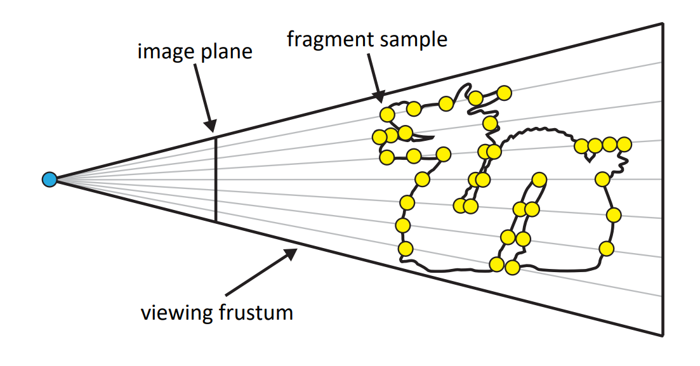

> 시점(eye)에서 뻗어나오는 ray들이 viewing frustum 내 여러 geometry(fragment)와 교차한다. 동일 픽셀에 여러 fragment가 동시에 들어오는 것이 MFR의 핵심 과제다.

이 기법은 **Order-Independent Transparency(OIT)**, dynamic photorealistic rendering, screen-space global illumination 등 다양한 실시간 렌더링 효과에 사용된다.

---

### 두 가지 핵심 문제

#### 문제 1: Fragment Overflow

k-buffer는 픽셀당 최대 k개의 fragment만 저장할 수 있다. 복잡한 씬에서는 fragment 수가 k를 초과하면 **fragment overflow**가 발생하며, 이로 인해:
- 잘못된 occlusion 표현
- 화면 flickering artifact

#### 문제 2: Z-Fighting

깊이 값이 거의 동일한 **coplanar fragment** 사이에서 부동소수점 반올림 오류로 인해 어느 fragment가 앞에 있는지 프레임마다 달라진다. 결과적으로:
- 노이즈처럼 보이는 speckling
- 애니메이션 중 픽셀 단위 깜빡임

---

### 기존 방법의 한계와 비교

| 방법 | 방식 | Z-fighting 처리 | 교차 기하 처리 | 메모리 |
|---|---|---|---|---|
| k-buffer | 고정 k개 fragment 저장 | 불가 (별도 처리 필요) | 가능 (k 이내) | Bounded |
| A-buffer | 픽셀당 linked list | 불가 | 가능 | Unbounded |
| MBT (moment) | transmittance 함수 근사 | 자연스럽게 처리 | **불가** | Bounded |
| Weighted OIT | 깊이·opacity 기반 weighted blend | 부분적 | 부분적 | Bounded |
| **Z-Thickness (본 논문)** | **fragment merging** | **자연스럽게 처리** | **가능** | **Both** |

아래는 흰 구(sphere) + 빨강/초록/파랑 세 큐브가 교차하는 씬에서 각 방식의 렌더링 결과다:

| (a) 개별 fragment 저장 (coplanarity 미처리) | (b) parameterized transmittance | (c) coplanarity 처리 포함 |
|---|---|---|
| 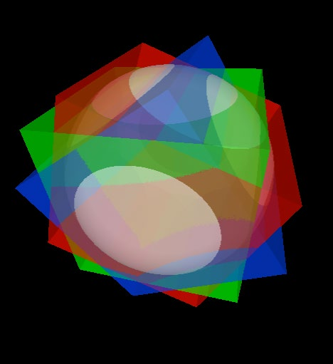 | 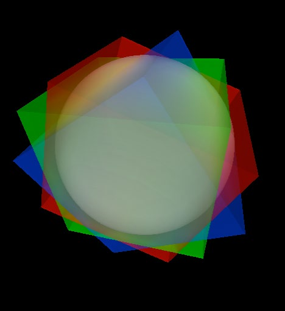 | 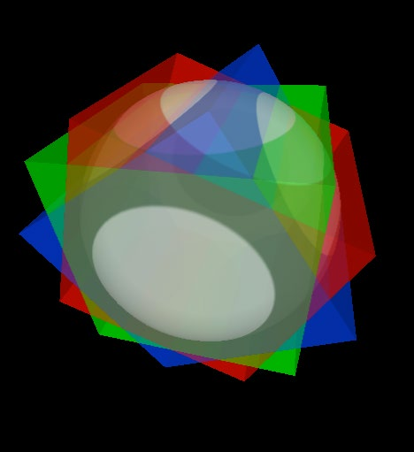 |

> (a): 색깔은 잘 나오지만 교차 경계에서 z-fighting이 생길 수 있다. (b): transmittance 근사 방식은 교차 기하를 정확히 표현하지 못한다. (c): 본 논문의 방식으로 교차와 coplanar 표면을 모두 올바르게 처리한다.

---

## 2. Related Work

- **A-buffer** (Car84): 픽셀당 linked list로 모든 fragment 캡처. 무제한 메모리 요구.
- **k-buffer** (BCL*07): 고정 크기 GPU buffer로 k개 fragment 캡처. fragment overflow 문제 존재.
- **k⁺-buffer** (VPF15): dynamic k + 최적 GPU 구현으로 k-buffer 개선. 본 논문의 bounded 구현 기반.
- **Adaptive Transparency (SML11)**: transmittance 함수를 고정 term 수로 heuristic 근사. 픽셀 간 불일치 발생.
- **MBT (MKKP18)**: moment 기반 theoretical transmittance 근사. coplanar 해결, 교차 기하 처리 불가.
- **Weighted Blended OIT (MB13)**: opacity·depth 기반 weighted blending. 정렬 불필요. coplanar 처리 불완전.
- **Layered WOIT (FEE20)**: 일정 간격 레이어별 local blending. 교차 기하가 시각적으로 구분될 경우 한계.
- **Core-tail (MCTB13, SV14)**: 앞 k개는 정렬 보존, 뒤는 tail 누적. 겹치는 fragment 고려 부족.
- **Binary z-test (VF12)**: coplanar speckling 억제. 별도의 coplanar fragment 추출 처리 필요.

---

## 3. Method

### 핵심 아이디어

각 fragment에 **z방향의 가상 두께(z-thickness)**를 부여하여, 표면을 반투명 매질 밴드(translucent band)로 모델링한다.

이를 통해:
- 깊이가 가까운 fragment들 사이에 **가상 overlap**을 만들어 자연스럽게 병합
- z-fighting 문제를 speckling 없이 continuous blending으로 해결
- 메모리 효율적인 multi-layer 표현 가능

---

### 3.1 Z-Thickness Surface Model

아래 그림은 fragment buffer 내에서 closely located fragment들과 z-fighting fragment들이 어떻게 저장되는지를 보여준다:

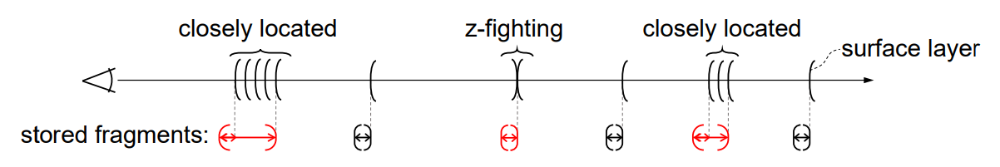

> **빨간 괄호**: z-thickness에 의해 하나로 병합된 fragment. **검은 괄호**: 서로 충분히 멀어 개별 저장되는 fragment. closely located fragment들과 z-fighting 위치의 fragment들은 두께 범위 내에서 자동으로 병합된다.

z-thickness 모델의 두 가지 이점:

**이점 1: Z-Fighting 해결**

두 coplanar 큐브(빨강/파랑)를 렌더링할 때:

| z-fighting 문제 발생 | z-thickness blending으로 해결 |
|---|---|
| 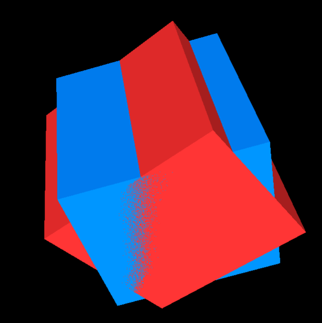 | 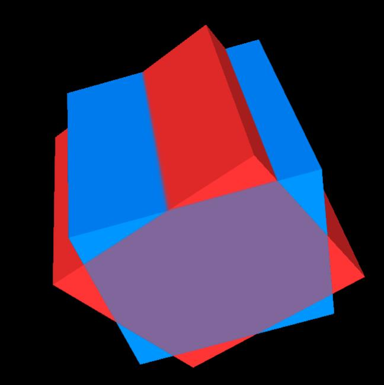 |

> 왼쪽: 깊이 값이 거의 동일해 노이즈처럼 speckling이 생긴다. 오른쪽: z-thickness가 두 surface를 병합해 연속적이고 부드러운 blending 가시성을 표시한다.

**이점 2: 메모리 효율적인 multi-layer 표현**

인접한 fragment들을 하나의 두꺼운 fragment로 병합하고, 멀리 떨어진 fragment들은 별도 저장한다. 이를 통해 제한된 buffer 용량에서도 풍부한 screen-space geometry 정보를 유지할 수 있다.

---

### 3.2 Fragment Merging

인접한 N개의 fragment를 M개(M ≤ N)로 병합하는 근사 모델이다.

병합된 fragment는 두 값으로 정의:
- **(i)** 인접 fragment들의 **최대 깊이 값**
- **(ii)** 인접 fragment들을 아우르는 **z-thickness 값**

두 가지 병합 방식을 제안한다:

#### 3.2.1 Smooth Fragment Merging (SFM)

깊이 정렬이 보장된 환경(resolve pass)에서 사용한다.

두 fragment가 부분적으로 겹칠 때:
1. 각 fragment의 z 경계로 최대 **3개의 세분(subdivided) fragment** 생성
2. 세분 fragment들의 가시성을 **over operator** (front-to-back blending)로 합성
3. 병합하여 하나의 두꺼운 fragment로 출력

겹침 정도(degree of partial overlap)를 고려하므로, 교차 지점 주변 픽셀에서 **부드러운 색상 전환** (anti-aliasing 효과)을 제공한다.

#### 3.2.2 Order-independent Fragment Merging (OFM)

fragment 순서가 불확정적인 환경(store pass, k-buffer)에서 사용한다.

- 세분 없이 겹치는지 여부만 판단해 병합
- **mix-operator** (Section 3.3.2)로 순서 독립적 가시성 결정
- SFM보다 단순하지만 덜 정밀

#### 3.2.3 SFM vs OFM 시각적 차이

두 방식 모두 교차하는 두 실린더(빨강/파랑)에 적용한 결과:

| SFM (Smooth Fragment Merging) | OFM (Order-independent Fragment Merging) |
|---|---|
|  |  |

> SFM: 교차 경계 주변에서 겹침 정도에 비례한 연속적인 색상 전환이 일어난다. OFM: 겹침 여부만 판단하므로 전환이 단조롭지만 순서 독립적으로 동작한다.

---

### 3.3 Visibility Decision

#### 3.3.1 Visibility Subdivision

각 fragment는 **homogeneous medium**으로 가정한다. extinction coefficient τ가 일정하므로, 깊이 z까지의 누적 opacity:

```
A(z) = 1 - e^(-τz)
```

fragment 두께 d에서의 opacity를 A_d = A(d)라 하면:

```
A(z) = 1 - (1 - A_d)^(z/d)    (0 ≤ z ≤ d)
```

emission-absorption 광학 모델(Max95)에 기반한 깊이 z에서의 누적 색상:

```
C(z) = C_d · A(z) / A_d
```

**β 파라미터**로 지수 감쇠와 선형 근사 사이를 제어:

```
A(z) = β · (z/d) · A_d + (1-β) · (1 - (1-A_d)^(z/d))    (0 ≤ β ≤ 1)
```

β에 따른 opacity 곡선 변화 (opacity = 0.99인 경우):

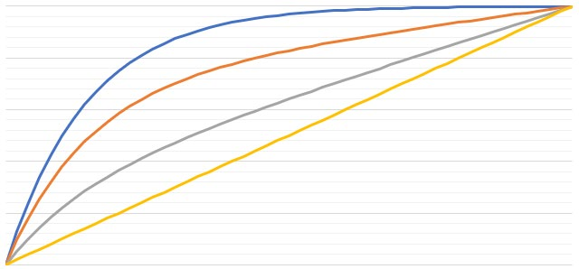

β에 따른 opacity 곡선 변화 (opacity = 0.5인 경우):

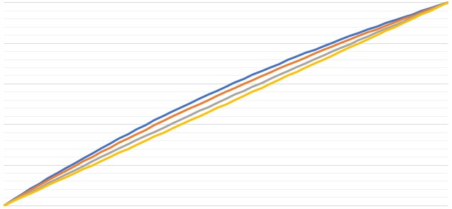

> 위: opacity가 높을 때(0.99) β 값에 따라 곡선 형태가 크게 달라진다. β=0이면 급격한 지수 감쇠, β=1이면 선형에 가까운 완만한 전환. 아래: opacity가 낮을 때(0.5)는 β의 영향이 상대적으로 작다.

| β 값 | 효과 |
|---|---|
| 0 | 순수 지수 감쇠 (물리적으로 정확) |
| 1 | 선형 근사 → 교차 지점에서 더 부드러운 전환 |
| 크게 (≈1) + 큰 z-thickness | 내부 구조가 보이는 **ghosted 효과** |

앞쪽 세분 fragment (C(z), A(z))를 알면, 뒤쪽 세분 fragment의 가시성 (C_b, A_b)는 over operator의 역산으로 결정:

```
(C_b, A_b) = [(C_d, A_d) - (C(z), A(z))] / (1 - A(z))
```

이 분해의 장점:
- 지수 연산 없이 단순 나눗셈으로 계산 가능
- A(z)를 선형 근사로 대체해도 수식 구조 동일

β에 따른 구(sphere) 교차 시각 효과:

| β = 0.0 | β = 1.0 |
|---|---|
|  |  |

> β=0: 교차 경계가 날카롭게 구분된다. β=1: 경계가 부드럽게 전환되어 anti-aliasing 효과를 낸다. 큰 z-thickness 값(구 반지름의 0.05배)을 사용해 시각적 차이를 강조한 예시.

#### 3.3.2 Mix Operator

완전히 겹치는 fragment들이 순서와 무관하게 동등하게 기여해야 할 때 사용한다 (OFM에서 사용).

**누적 opacity** A_acc:
```
A_acc = 1 - Π_i (1 - A_i)
```

**누적 color** C_acc (각 fragment의 opacity로 정규화):
```
c_acc = Σ_i (c_i · A_i) / Σ_i A_i
C_acc = c_acc · A_acc
```

새 fragment가 들어올 때 **incremental 업데이트**:
```
Ã_acc = 1 - (1 - A_acc)(1 - A_new)

C̃_acc = [C_acc/A_acc · A_sum + C_new] / (A_sum + A_new) · Ã_acc
```

여기서 A_sum = Σ A_i는 fragment 하나의 element로 함께 저장한다.

---

## 4. Implementation

### 4.1 공통 연산

#### 4.1.1 Fragment Merging 적용 규칙

| Pass | 상황 | 사용 방식 |
|---|---|---|
| Store pass | fragment 순서 불확정 | **OFM** |
| Resolve pass | fragment depth-sorted | **SFM** |
| Store pass에서 OFM 적용 후 | adjacent fragment 이미 병합됨 | Resolve pass에서 추가 SFM 불필요 |

Resolve pass에서의 SFM 알고리즘 (Algorithm 1):

```
Fin[N]  = f1, f2, ..., fN    // depth-sorted N fragments
Fout[M]                       // 최대 M fragments 출력

fi = Fin[0], c = 0
for i in 0..N:
    fnext = Fin[i+1]  (if exists)

    if fi and fnext overlap:
        fmerge = SFM(fi, fnext)
        if fmerge is null:             // 병합 불가 → 각각 저장
            if c < M-1:
                Fout[c] = fi, c++
                fi = fnext
            else:                      // tail-handling
                fi.v   = OVER(fi.v, fnext.v)
                fi.t   = fnext.z - fi.z + fi.t
                fi.z   = fnext.z
                fi.a  += fnext.a
        else:
            fi = fmerge
    else:
        if c < M-1:
            Fout[c] = fi, c++
            fi = fnext

if fi is not null:
    Fout[c] = fi, c++
```

시간 복잡도: **O(N)** (선형)

#### 4.1.2 Tail-handling

fragment overflow를 완전히 피할 수 없는 경우, k-front fragment를 초과하는 fragment들을 **tail fragment**로 누적한다.

| Pass | Tail 처리 방식 |
|---|---|
| Store pass | mix-operator (순서 불확정) |
| Resolve pass | over-operator (순서 확정) |

#### 4.1.3 Z-Thickness 값 결정

z-buffer의 비선형 특성을 고려해, 깊이 z에서의 **z-resolution** P(z)를 계산한다:

```
P(z) = b / (b/z - 1/2^n) - z

b = z_n · z_f / (z_n - z_f)
```

- z_n: near plane 깊이
- z_f: far plane 깊이
- n: precision bits (단정밀도 float = 24)

기본 z-thickness 값: **2 × P(z)** → z-fighting 해결에 충분한 여유 확보

사용자가 시각화 목적에 따라 수동 조절 가능 (예: surfel 렌더링 시 10×P(z), ghosted 효과 시 씬 크기 수준까지).

---

### 4.2 Bounded Memory (k-buffer 기반)

- **k⁺-buffer** (VPF15) 기반으로 고정 M = k개 fragment만 저장
- **Rasterizer-Ordered-View** (Direct3D 11.3): atomic 처리로 data race 방지
- max array buffer + fragment culling으로 k-front fragment 효율적 교체
- OFM을 store pass에서 순서 독립적으로 직접 구현

### 4.3 Unbounded Memory (Dynamic Fragment Buffer)

- **Dynamic Framebuffer** (MCTB12): atomic count instruction으로 data race 없이 모든 fragment 저장
- **3단계 구성**: Count pass → Store pass → Resolve pass
- Resolve pass에서 SFM 적용
- 최대 1024개/픽셀까지 사전 할당 → 정확하지만 느림

---

## 5. Experiments

- **환경**: Intel Core i7-7700 3.6GHz, 32GB RAM, NVIDIA GeForce GTX 1080, Windows 10 x64
- **출력 fragment 수**: M = 8
- **비교 대상**:
  - **DFB**: Dynamic Fragment Buffer (unbounded, 레퍼런스)
  - **MBT**: Moment-based Transmittance (bounded, 교차 기하 처리 불가)
  - **SKB**: Static k⁺-Buffer (bounded, fragment overflow 취약)
  - **SKB+OFM**: 제안 방법 (bounded + OFM)
  - **DFB+SFM**: 제안 방법 (unbounded + SFM)

---

### 5.1 Order Independent Transparency (OIT)

#### 5.1.1 시각적 비교

포인트 클라우드(large surfel) bunny 모델에 교차 평면과 coplanar 텍스트를 superimpose한 씬:

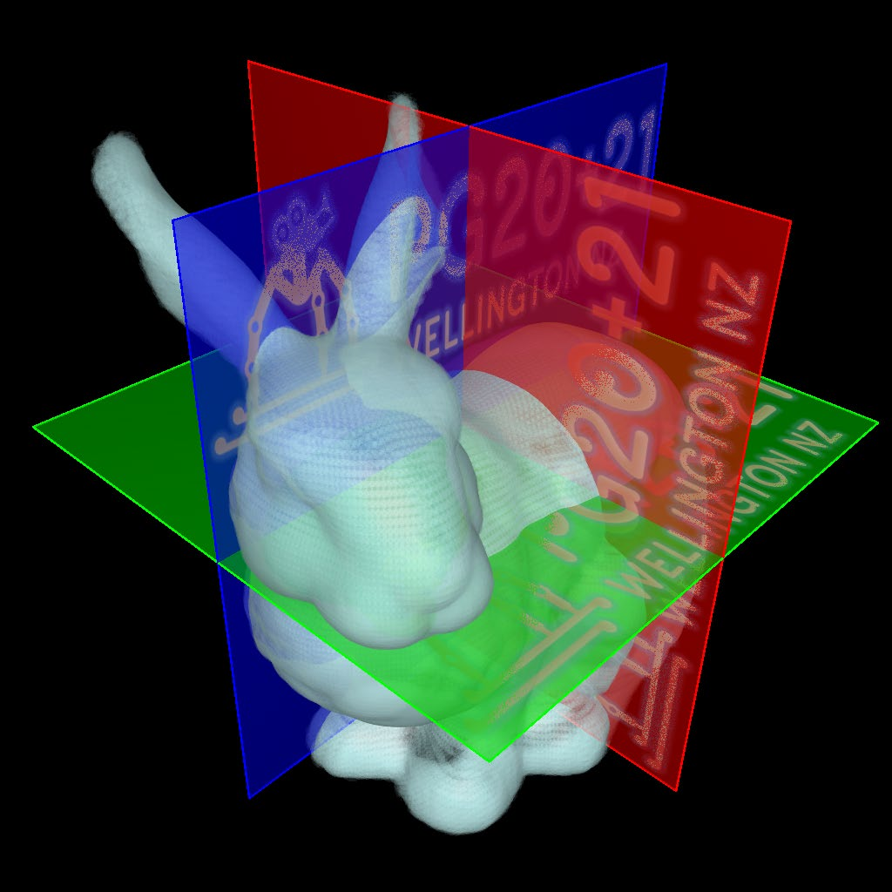

> Bunny surfel 모델(흰색)에 빨강/초록/파랑 교차 평면과 PG2021 텍스트가 coplanar하게 superimpose되어 있다. 이 씬은 z-fighting + fragment overflow + 교차 기하 세 가지 문제를 동시에 포함한다.

#### 5.1.2 heatmap 오차 비교 (DFB 기준)

sportscar 데이터(1075 mesh objects)와 hairball 데이터에서 DFB 대비 오차 heatmap:

| Sportscar heatmap | Hairball |
|---|---|
| 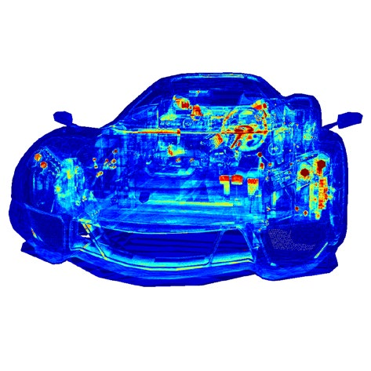 | 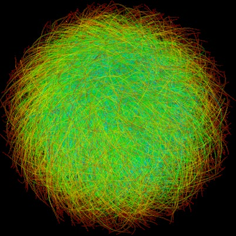 |

> 왼쪽: 1075개 mesh가 교차하는 복잡한 스포츠카 씬에서 DFB 대비 색상 오차를 heatmap으로 표시. 빨간 영역이 오차가 큰 픽셀. 오른쪽: 고주파 디테일의 hairball. 두 데이터 모두에서 SKB+OFM은 SKB 단독보다 DFB에 훨씬 근접한다.

주요 결과:
- **DFB+SFM**: DFB 대비 거의 동등한 품질, SFM의 resolve pass overhead는 sorting 대비 무시할 수준
- **SKB+OFM**: SKB 대비 OIT 품질 크게 향상, fragment overflow 영향 감소
- **MBT**: 교차 기하 처리가 없어 경계에서 부정확한 결과

---

### 5.2 Z-Thickness 효과 변화

#### 5.2.1 Local Depth Blending / Surfel 렌더링

- z-thickness = **10 × P(z)** 설정 시: 인접 surfel 간 자연스러운 색상 전환
- z-fighting speckling 완전 제거
- 거리 단서(distance cue) 시각화 → 표면 간 깊이 정보를 색상 전환으로 표현

#### 5.2.2 Ghosted Illustration

외부 표면의 가시성 대비를 낮춰 내부 구조를 투시하는 효과:

| 단일 구 내부 가시화 | 다중 구 내부 가시화 |
|---|---|
| 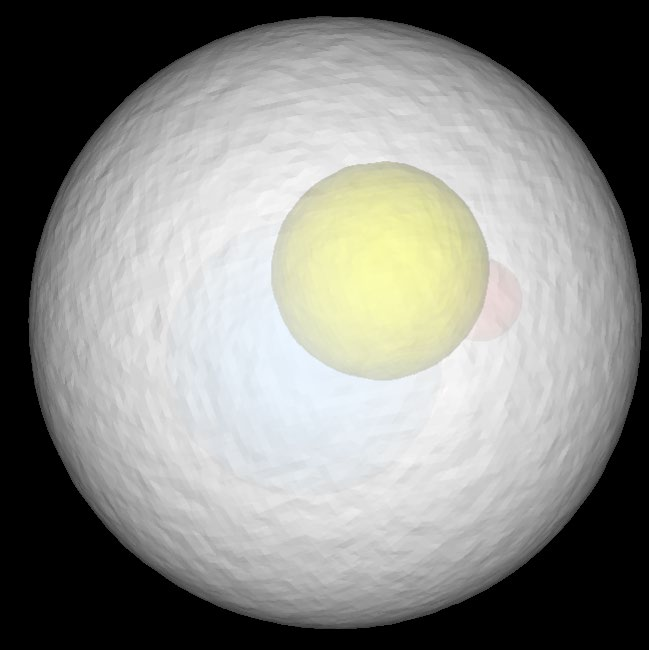 | 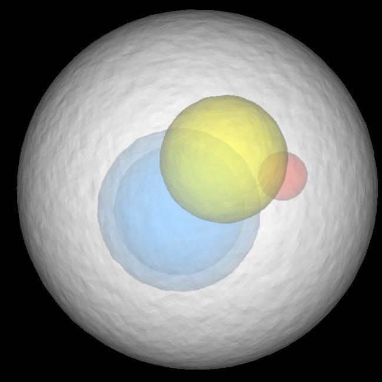 |

> β = 1, z-thickness = 흰 구의 반지름으로 설정. 외부 흰 구는 낮은 대비로 투명하게 보이고, 내부 구들(노랑/파랑/빨강)이 깊이 단서와 함께 가시화된다. 모든 표면의 opacity = 0.99.

---

### 5.3 Volumetric Object와의 Hybrid Rendering

얇은 투명 다각형 표면(polygonal surface)과 두꺼운 반투명 볼륨(volumetric surface)의 교차 처리:

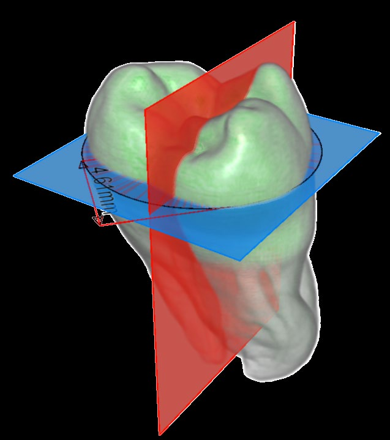

> CT 데이터로 만든 치아(tooth)를 반투명하게 시각화하고, 측정 plane과 widget을 polygonal primitive로 superimpose. SFM을 통해 볼륨-폴리곤 경계가 부드럽게 처리된다.

- 기존 normal sampling: 볼륨-폴리곤 경계에서 banding artifact 발생
- **DFB+SFM**: smooth visibility transition → volume ray-casting의 sampling discontinuity artifact 제거, 100× supersampling 결과와 유사한 품질

---

### 5.4 Screen-Space Rendering 확장

Screen-space 알고리즘(AO, DOF 등)은 framebuffer의 geometry 정보를 직접 활용한다. z-thickness로 병합된 fragment는 front/back 경계를 갖고 있어 multi-layered screen-space geometry로 활용 가능하다.

| Screen-space DOF/blur (with SFM) | Screen-space DOF/blur (normal sampling) |
|---|---|
| 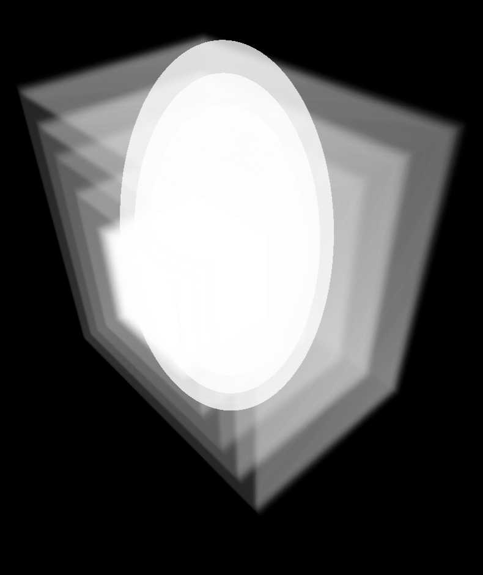 | 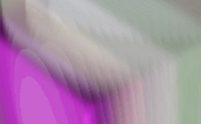 |

> SFM 적용 시 multi-layered geometry를 올바르게 사용해 반투명 primitive를 포함한 씬에서도 AO, DOF 효과가 정확하게 적용된다.

- **Virtual front surface**: 원래 geometry shape 유지
- **Back boundary**: z-thickness 모델 기반 깊이 값 사용
- Ambient Occlusion, Depth-of-Field에 적용 성공

---

## 6. Conclusions

### 핵심 기여 요약

1. **Z-fighting 해결**: z-resolution 기반 z-thickness로 coplanar layer를 continuous blending으로 처리
2. **Fragment overflow 완화**: 인접 fragment 병합으로 제한된 buffer에서 더 많은 정보 유지
3. **Smooth visibility transition**: SFM이 겹침 정도를 고려한 부드러운 가시성 전환 제공
4. **Multi-layered screen-space rendering 지원**: AO, DOF 등 screen-space 효과에 적용 가능

### 두 가지 구현 방식

| 방식 | 메모리 | 정확도 | 속도 | 적합 상황 |
|---|---|---|---|---|
| **DFB + SFM** | Unbounded | 높음 | 상대적으로 느림 | 정확한 결과 필요 시 |
| **SKB + OFM** | Bounded (k=8) | 중간 | 빠름 | 실시간 렌더링 |

### 한계 및 향후 연구

- **추가 메모리**: z-thickness (4 bytes float) + A_sum (4 bytes float) per fragment → 겹치는 layer가 없는 씬에서 불필요한 낭비
- **Higher-order 결합**: subdivided fragment의 가시성 결정을 MBT(MKKP18)와 결합 시 추가 개선 가능
- **Adaptive z-thickness**: pixel area 기반 attention-level-of-detail 방식으로 z-thickness 값을 적응적으로 결정

---

## 참고

- 논문 파일: `논문/CGF_PG21_zThickness.pdf`
- 발표 슬라이드: `논문/zthickness-pg20-21.pdf`
