# Fragment Blend 구현 보고서

**기준 환경**: Bonsai 씬, downsample_factor=2, 30k iteration
**Baseline**: k_buffer_size=0 (vanilla 3DGUT), PSNR 32.352 dB

---

## 목차

- [1. 바닐라 3DGUT 구조 요약](#1-바닐라-3dgut-구조-요약)
- [2. Gaussian Fragment Blend (GFB)](#2-gaussian-fragment-blend-gfb)
- [3. 전체 실험 결과 요약](#3-전체-실험-결과-요약)
- [4. 결론](#4-결론)

---

## 1. 바닐라 3DGUT 구조 요약

### 렌더링 파이프라인

```
[Gaussian 파라미터] → [Unscented Transform 투영] → [Tile 단위 정렬]
    → [Ray-Gaussian 교차 판정] → [K-Buffer 삽입]
    → [Drain 시 processHitParticle] → [순차 Alpha Compositing]
```

### 핵심 특성

- **투영**: Unscented Transform(UT)으로 3D Gaussian → 2D 투영 (비선형 카메라 지원)
- **정렬**: Tile 단위 global z-order (per-pixel 정렬 없음, 논문 Sec 4.3)
- **K-Buffer**: MLAB(Multi-Layer Alpha Blending) — ray당 k개 히트를 max-heap으로 관리
  - 기본값 `k=0` (정렬 없는 vanilla), 논문 실험에서는 `k=16` ("Ours (sorted)")
  - k=0 ≈ k=16 (핀홀 카메라 기준 comparable quality)
- **Compositing**: 표준 순차 alpha blending — Gaussian 하나당 단일 alpha 값 (point mass)

### 확장의 동기

> 논문 자체가 인정: *"as our method still uses a single point to evaluate each primitive, it is currently unable to render overlapping Gaussians accurately"*

겹치는 Gaussian을 점(point mass)이 아닌 체적(volume)으로 처리하자는 것이 Fragment Blend 계열 확장의 공통 목표.

---

## 2. Gaussian Fragment Blend (GFB)

### 2.1 설계 동기

바닐라 3DGUT의 문제:

$$
\text{color} \mathrel{+}= \alpha_i \cdot T \cdot \mathbf{f}_i, \qquad T \mathrel{\times}= (1 - \alpha_i)
$$

Gaussian 하나가 ray 위에서 단일 alpha 값 하나로 처리된다. Ray가 Gaussian 타원체를 통과하는 전체 구간 `[t1, t2]`에 alpha가 균등하게 기여하는 것이 아니라, 밀도 최대점(`hitT`) 한 지점에 집중된 **점 질량(point mass)** 형태다.

GFB의 목표: Ray가 Gaussian 타원체를 통과하는 구간 전체에 걸쳐 **실제 3D Gaussian의 bell-curve 밀도 프로파일**을 반영한 연속적인 alpha 분포를 사용.

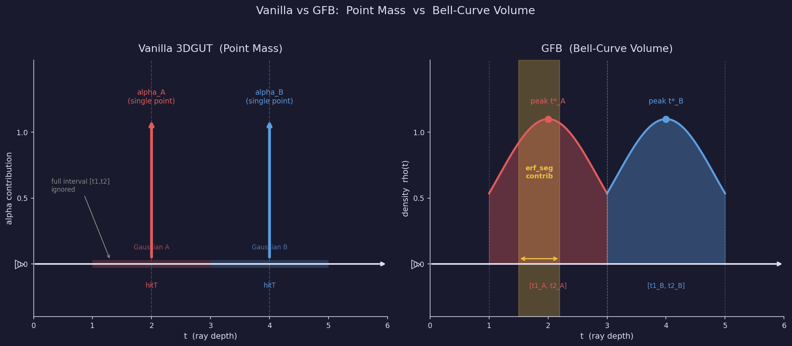

---

### 2.2 Forward: Ray-Ellipsoid 교차 계산 (Canonical Space)

각 Gaussian에 대해 ray가 타원체를 통과하는 구간 `[t1, t2]`와 그 내부 밀도 peak `t*`를 canonical space 변환으로 계산한다.

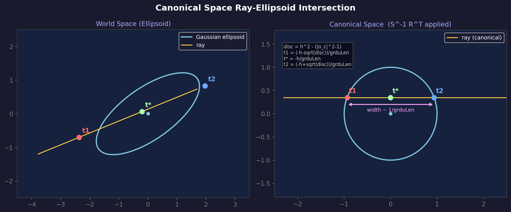

#### Canonical Space 변환

$$
\begin{aligned}
\mathbf{giscl} &= \mathbf{1}/\mathbf{scale} & &\text{(element-wise 역수)} \\
R^T &= \text{quaternionToMatrix}(q) & &\text{(world} \to \text{canonical 회전)} \\
\boldsymbol{\delta} &= \mathbf{o}_\text{ray} - \boldsymbol{\mu} & &\text{(ray origin} \to \text{Gaussian center)} \\[6pt]
\mathbf{rd} &= R^T \cdot \mathbf{d}_\text{ray} & &\text{(canonical ray 방향, 미정규화)} \\
\mathbf{ro} &= R^T \cdot \boldsymbol{\delta} & &\text{(canonical ray origin)} \\[6pt]
\mathbf{grdu} &= \mathbf{giscl} \odot \mathbf{rd} & &\text{(scale 적용)} \\
\mathbf{o}_c &= \mathbf{giscl} \odot \mathbf{ro} & &\text{(scale 적용)} \\[6pt]
\text{grduLen} &= \|\mathbf{grdu}\| & &\text{(canonical ray 속도)} \\
\mathbf{d}_c &= \mathbf{grdu} / \text{grduLen} & &\text{(단위 canonical 방향)}
\end{aligned}
$$

#### 판별식과 교차점 계산

단위 구체(unit sphere)와 ray $\mathbf{r}_c(t) = \mathbf{o}_c + t \cdot \mathbf{d}_c$의 교차 조건:

$$
\|\mathbf{o}_c + t \cdot \mathbf{d}_c\|^2 = 1
$$

$$
\begin{aligned}
h &= \mathbf{d}_c \cdot \mathbf{o}_c \\
\text{disc} &= h^2 - \left(\|\mathbf{o}_c\|^2 - 1\right) & &\text{(disc} < 0 \text{이면 교차 없음)} \\
sq &= \sqrt{\text{disc}}
\end{aligned}
$$

$$
t_1 = \frac{-h - sq}{\text{grduLen}}, \qquad
t_2 = \frac{-h + sq}{\text{grduLen}}, \qquad
t^* = \frac{t_1 + t_2}{2} = \frac{-h}{\text{grduLen}}
$$

`disc`는 후에 `erf_tot` 계산에도 사용된다.

---

### 2.3 Forward: 1D 밀도 프로파일

Canonical space에서 ray 위의 밀도는 **t의 1D Gaussian 함수**:

$$
\rho(t) = C \cdot \exp\!\left(-\frac{1}{2} \cdot \text{grduLen}^2 \cdot (t - t^*)^2\right)
$$

- `t*`: 밀도 최대점 (ray-ellipsoid 구간의 정확한 중점)
- `grduLen`: canonical space에서의 ray 속도 (bell-curve의 폭 결정)
- `C`: 최대 밀도 스케일 (alpha 보존을 위한 정규화 상수)

이 bell-curve는 `t1`과 `t2`에서 자연스럽게 감소하며, `[t1, t2]` 구간에서 적분하면 Gaussian의 전체 투과 기여를 나타낸다.

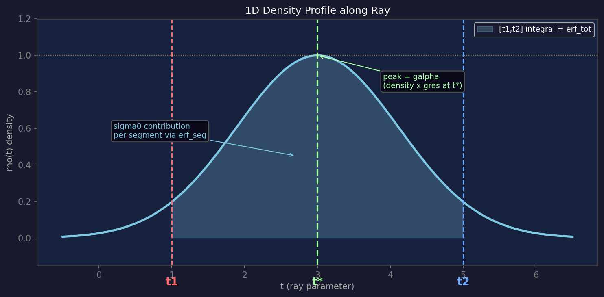

---

### 2.4 Forward: erf 기반 구간 적분

#### 기본 계산량 (Gaussian 당 1회)

$$
\sigma_{0,i} = -\log(1 - \alpha_i), \qquad
\text{erf\_tot}_i = \operatorname{erf}\!\left(\sqrt{\frac{\text{disc}_i}{2}}\right)
$$

#### 구간 $[s_{lo},\, s_{hi}]$에서의 기여도

$$
u_{hi} = (s_{hi} - t^*_i)\cdot\frac{\text{grduLen}_i}{\sqrt{2}}, \qquad
u_{lo} = (s_{lo} - t^*_i)\cdot\frac{\text{grduLen}_i}{\sqrt{2}}
$$

$$
\text{erf\_seg}_i = \frac{1}{2}\Bigl(\operatorname{erf}(u_{hi}) - \operatorname{erf}(u_{lo})\Bigr)
$$

$$
\text{contrib}_i = \sigma_{0,i} \cdot \frac{\text{erf\_seg}_i}{\text{erf\_tot}_i}
$$

`erf_tot_i`로 나누는 정규화가 **N=1 일관성**을 수학적으로 보장:

$$
s_{lo} = t_1,\; s_{hi} = t_2
\;\Rightarrow\; \text{erf\_seg} = \text{erf\_tot}
\;\Rightarrow\; \text{contrib} = \sigma_0
\;\Rightarrow\; \alpha_k = 1 - e^{-\sigma_0} = \alpha_i \quad \checkmark
$$

---

### 2.5 Forward: Segment Sweep (N-way 구간 분할)

N개 Gaussian의 `[t1_i, t2_i]`를 이벤트 포인트로 사용해 ray를 최대 `2N-1`개 구간으로 분할한다.

#### 1단계: 2N 이벤트 포인트 정렬 (Insertion Sort)

```
events = [(t1_0, entry), (t2_0, exit), (t1_1, entry), (t2_1, exit), ...]
events.sort()  // t 기준 오름차순
```

각 이벤트에는 어떤 Gaussian의 t1/t2인지 (`gi`), entry인지 exit인지 (`ep_en`) 기록.

#### 2단계: 구간별 Forward Sweep

각 구간 $[s_{lo}, s_{hi}]$에 대해:

$$
\tau_k = \sum_{i \in \text{active}} \text{contrib}_i(s_{lo}, s_{hi})
$$

$$
\alpha_k = 1 - \exp(-\tau_k)
$$

$$
\mathbf{c}_k = \sum_{i \in \text{active}} \frac{\text{contrib}_i}{\tau_k} \cdot \mathbf{f}_i
$$

$$
\text{color} \mathrel{+}= \alpha_k \cdot T \cdot \mathbf{c}_k, \qquad T \mathrel{\times}= (1 - \alpha_k)
$$

#### 구간 처리의 핵심 특성

- **기여도 비례**: 각 Gaussian은 구간 내 bell-curve 면적 비율만큼 tau에 기여 → peak(`t*`) 근처 구간에 alpha 집중
- **완전한 체적 처리**: 단순 hitT 한 점이 아닌 `[t1, t2]` 전 구간에 alpha 분산
- **Overlap 정확도**: N개가 동일 구간에 겹칠 때 상호 간섭을 연속적으로 처리

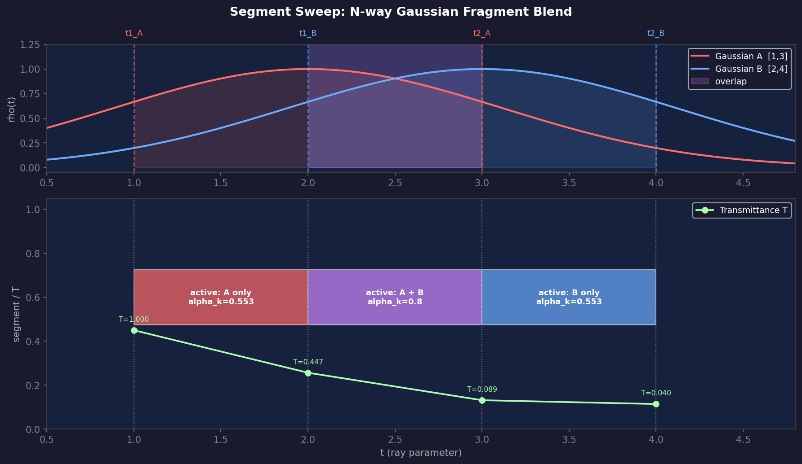

---

### 2.6 Forward 전체 파이프라인 요약

입력: $N$개 HitParticle $\{idx,\; t_1,\; t_2,\; \text{grduLen},\; \text{disc},\; \alpha,\; \mathbf{f}\}$

**[사전 계산 — Gaussian 당 1회]**

$$
\sigma_{0,i} \leftarrow -\log(1 - \alpha_i), \qquad
\text{erf\_tot}_i \leftarrow \operatorname{erf}\!\left(\sqrt{\tfrac{\text{disc}_i}{2}}\right), \qquad
t^*_i \leftarrow \frac{t_{1,i} + t_{2,i}}{2}
$$

**[Segment Sweep]** $2N$ 이벤트 포인트 → Insertion Sort 후 각 구간 처리:

$$
\text{erf\_seg}_i \leftarrow \frac{1}{2}\left[\operatorname{erf}\!\left(\frac{(s_{hi}-t^*_i)\,\text{grduLen}_i}{\sqrt{2}}\right) - \operatorname{erf}\!\left(\frac{(s_{lo}-t^*_i)\,\text{grduLen}_i}{\sqrt{2}}\right)\right]
$$

$$
\text{contrib}_i \leftarrow \sigma_{0,i} \cdot \frac{\text{erf\_seg}_i}{\text{erf\_tot}_i}, \qquad
\tau_k \leftarrow \sum_i \text{contrib}_i, \qquad
\alpha_k \leftarrow 1 - e^{-\tau_k}
$$

$$
\mathbf{c}_k \leftarrow \sum_i \frac{\text{contrib}_i}{\tau_k} \cdot \mathbf{f}_i, \qquad
\text{color} \mathrel{+}= \alpha_k \cdot T \cdot \mathbf{c}_k, \qquad
T \mathrel{\times}= (1 - \alpha_k)
$$

---

### 2.7 구현 위치

| 파일 | 내용 |
|------|------|
| `gutKBufferRenderer.cuh` | `processNWayGaussianFB()` — 전체 forward/backward 구현 |
| `configs/render/3dgut.yaml` | `gaussian_fragment_blend: false` (기본값) |
| `threedgut_tracer/setup_3dgut.py` | `-DGAUSSIAN_GAUSSIAN_FRAGMENT_BLEND` define |
| `threedgut_tracer/include/3dgut/threedgut.cuh` | `TGUTRendererParams::GaussianFragmentBlend` |
| `shRadiativeGaussianParticles.cuh` | `addGeomGradientAtomic()` — geometric grad atomic write |

---

### 2.8 Backward 설계 및 검증 과정

GFB backward는 총 3가지 gradient 경로가 있으며, 각 버전에서 순차적으로 추가됐다.

#### 세 가지 Gradient 경로

$$
\begin{aligned}
&\textbf{PATH 1:} \quad \sigma_0 \to \alpha \to \text{gres} \to (\mathbf{o}_c, \mathbf{d}_c) \to \text{position, scale, quaternion} \\
&\qquad \text{gres} = \exp(-\tfrac{1}{2}|\mathbf{perp}|^2), \quad \mathbf{perp} = \mathbf{o}_c - h\,\mathbf{d}_c \\[6pt]
&\textbf{PATH 2 (PARTIAL):} \quad \text{erf\_seg} \to t^*, \text{grduLen} \\
&\qquad\qquad\qquad\qquad\quad \text{erf\_tot} \to \text{disc} \to h, \mathbf{o}_c \\[6pt]
&\textbf{PATH 3 (BOUNDARY):} \quad s_{lo}/s_{hi} = t_1[j] \text{ or } t_2[j] \text{ 로서 differentiable} \\
&\qquad d_{t_1}, d_{t_2} \to h, sq \to \text{disc} \to h, \mathbf{o}_c, \quad +\; d_{\text{grduLen}}
\end{aligned}
$$

#### v1 (초기): PATH 1만 전파

$$
\frac{\partial \mathcal{L}}{\partial \sigma_{0,i}} \to \frac{\partial \mathcal{L}}{\partial \alpha_i} \to \texttt{densityProcessHitBwdToBuffer}
$$

erf_seg, erf_tot를 통한 geometric gradient (PATH 2, 3) 완전 누락.

#### v2 (수정): PATH 1 + PATH 2 추가

erf_seg → t_star, grduLen / erf_tot → disc 경로 추가. 그러나 **BOUNDARY gradient (PATH 3)** 누락.

Python gradcheck로 검증 결과: PATH 3 (boundary gradient)이 position gradient의 87%, scale gradient의 262%를 차지함을 확인. → PARTIAL backward(v2)는 지배적인 gradient를 누락한 상태.

#### v3 (최종): PATH 1 + PATH 2 + PATH 3

Segment 경계 `s_lo = t1[gi]` 또는 `s_hi = t2[gi]`가 이동할 때의 gradient를 추가:

구간 경계 $s$에서의 밀도율:

$$
\dot{\tau}_j(s) = \frac{\sigma_{0,j} \cdot \text{bell}(s,\, j)}{\text{erf\_tot}_j}
$$

경계 gradient 누적:

$$
\frac{\partial \mathcal{L}}{\partial s} = \pm\left(
  \frac{\partial \mathcal{L}}{\partial \tau_k} \sum_j \dot{\tau}_j(s)
  + \frac{\partial \mathcal{L}}{\partial \alpha_k} \cdot \alpha_k \sum_j \frac{\dot{\tau}_j(s) \cdot \tilde{f}_j}{\tau_k}
\right)
$$

$s = t_1[\text{gi}]$ 또는 $s = t_2[\text{gi}]$이면 $\partial_{t_1}$ 또는 $\partial_{t_2}$로 누적.

누적된 `d_t1[i]`, `d_t2[i]` → d_h, d_sq → d_disc → canonical backward.

**Python gradcheck 결과 (gfb_gradcheck.py v5)**:

```
position    : max_rel_err = 0.0000  ✓
scale       : max_rel_err = 0.0000  ✓
quaternion  : max_rel_err = 0.0000  ✓
density     : max_rel_err = 0.0000  ✓
features    : max_rel_err = 0.0000  ✓
```

v3 Python manual backward = FULL autograd 완전 일치.

#### Seg 구조체 변경 (v3)

```cpp
struct Seg {
    float T, alpha, tau;
    TFeaturesVec c;
    int mask;
    float s_lo, s_hi;
    int lo_ep;  // ep_gi | (ep_en << 16): s_lo에 해당하는 Gaussian의 t1/t2 정보
    int hi_ep;  // ep_gi | (ep_en << 16): s_hi에 해당하는 Gaussian의 t1/t2 정보
};
```

---

### 2.9 버전별 실험 결과

| 방법 | PSNR | vs Baseline | 비고 |
|------|------|------------|------|
| GFB v1 (PATH 1만) | 28.688 | -3.664 | sigma0만 전파 |
| GFB v2 (PATH 1+2) | 13.856 | **발산** | BOUNDARY 누락 → gradient 불완전 |
| GFB v3 (PATH 1+2+3) | 28.358 | -3.994 | 수학적으로 완전한 backward |

v3가 v2 발산을 해소하고 정상 수렴했으나, v1보다 약간 낮은 PSNR. 수학적으로 완전한 backward임에도 불구하고 geometric gradient가 3DGUT 학습 방향과 충돌하는 것으로 판단.

---

### 2.10 GFB Forward 모델의 근본적 한계

#### 3DGUT의 alpha 계산 방식

3DGUT에서 각 Gaussian의 alpha는 **ray와의 2D 투영 거리 기반**으로 계산된다:

$$
\begin{aligned}
\mathbf{perp} &= \mathbf{o}_c - \mathbf{d}_c \cdot (\mathbf{d}_c \cdot \mathbf{o}_c) & &\text{(ray에 수직인 canonical 거리 벡터)} \\
\text{gres} &= \exp\!\left(-\tfrac{1}{2}\|\mathbf{perp}\|^2\right) & &\text{(Gaussian response)} \\
\alpha &= \text{density} \times \text{gres} & &\text{(opacity} \times \text{response)}
\end{aligned}
$$

이 alpha는 ray 방향에 수직인 거리(`perp`)에만 의존하며, ray 방향 `t`에 대한 밀도 분포는 존재하지 않는다. 즉, **3DGUT의 alpha는 1D 밀도 프로파일이 없는 point-mass 모델**이다.

#### GFB가 가정하는 것

GFB는 이 alpha로부터 역산한 $\sigma_0 = -\log(1-\alpha)$를 3D Gaussian의 전체 소광 계수로 사용하고, ray 방향에 대해 bell-curve로 분포시킨다:

$$
\rho(t) \propto \exp\!\left(-\frac{1}{2} \cdot \text{grduLen}^2 \cdot (t - t^*)^2\right)
$$

그러나 이 bell-curve는 3DGUT의 alpha 계산과 **수학적으로 무관**하다. 3DGUT의 alpha는 `perp` (ray에 수직)으로만 결정되고 ray 방향 `t`에 대한 변화가 없으므로, GFB가 t축으로 bell-curve를 가정하는 것은 임의적인 가정이다.

#### 학습 역학 충돌

3DGUT 학습에서 Gaussian들은 overlap 없이 서로의 빈 공간을 채우는 방향으로 최적화된다. GFB의 geometric gradient (erf_seg → t_star, disc → disc, boundary → t1/t2)는 Gaussian의 위치/크기가 bell-curve 밀도 가정에 맞게 배치되도록 유도하므로, 기존 3DGUT 학습 방향과 반대로 작용한다.

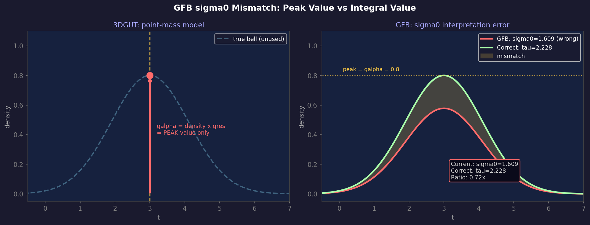

---

## 3. 전체 실험 결과 요약

**공통 조건: Bonsai, downsample_factor=2, 30k iter**

| 기술 | PSNR | vs Baseline |
|------|------|------------|
| **Baseline (k=0)** | **32.352** | — |
| GFB v1 (k=16, PATH 1) | 28.688 | -3.664 |
| GFB v2 (k=16, PATH 1+2) | 13.856 | **발산** |
| GFB v3 (k=16, PATH 1+2+3) | 28.358 | -3.994 |

### GFB v3 렌더링 결과 vs GT (Bonsai, 30k iter)

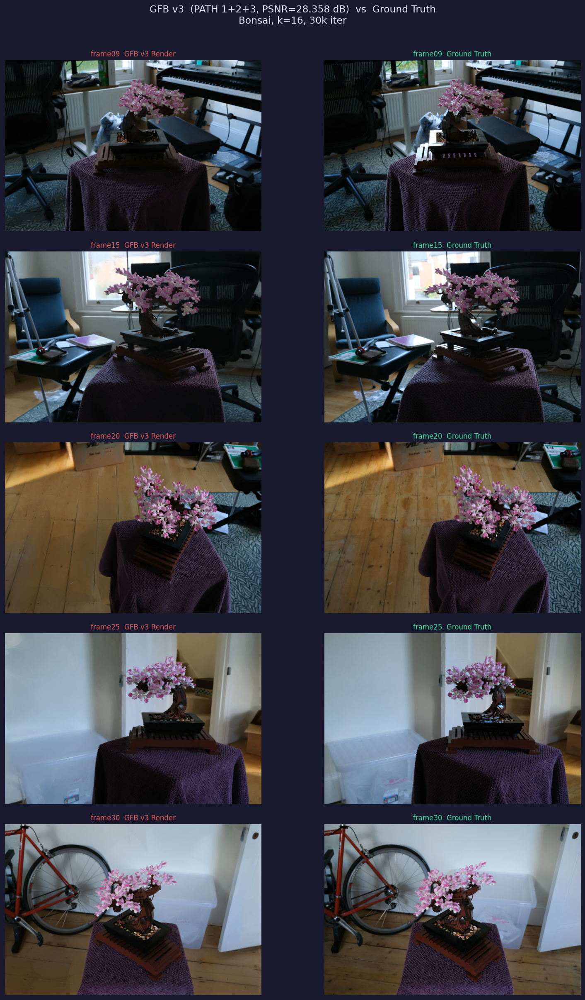

| Frame | GFB v3 Render | Ground Truth |
|-------|--------------|--------------|
| 09 | 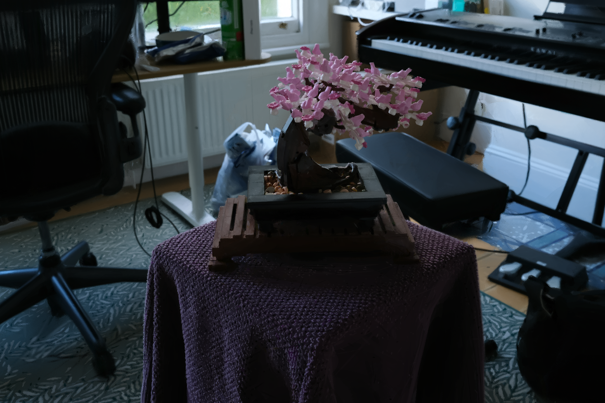 | 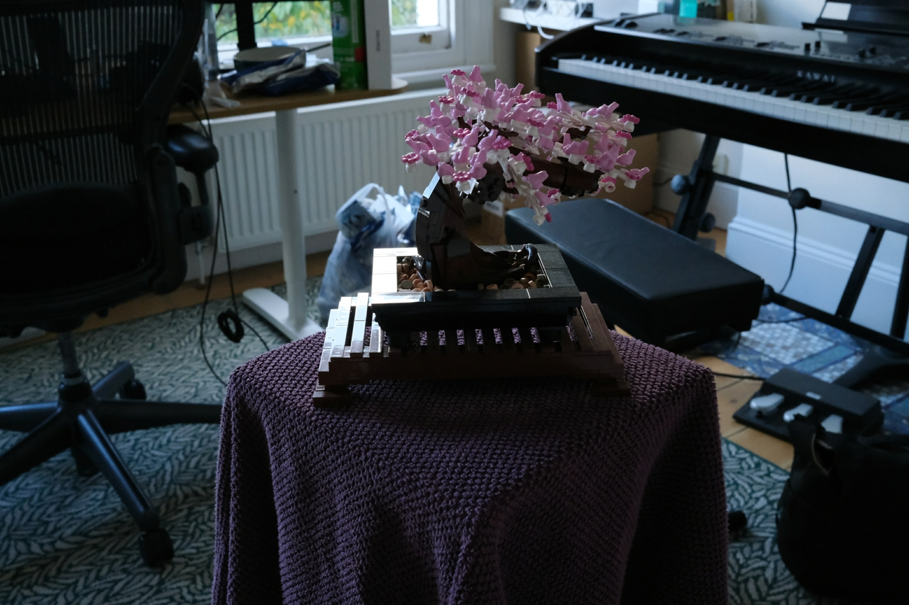 |
| 15 | 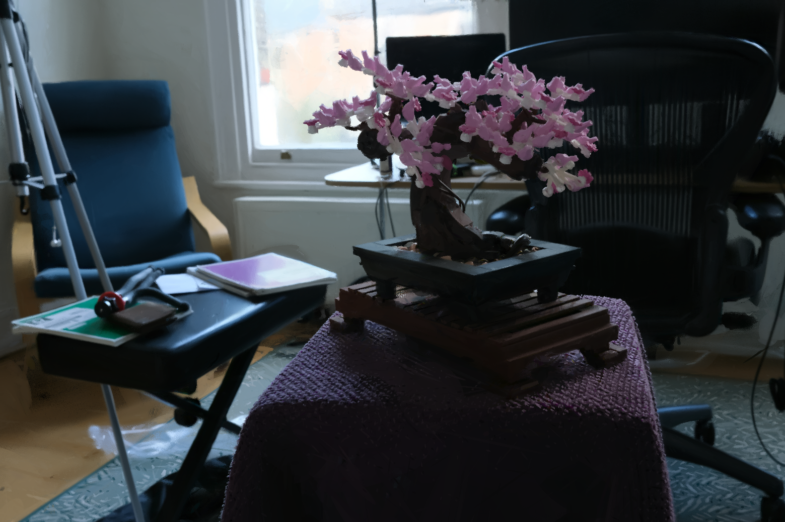 |  |
| 20 | 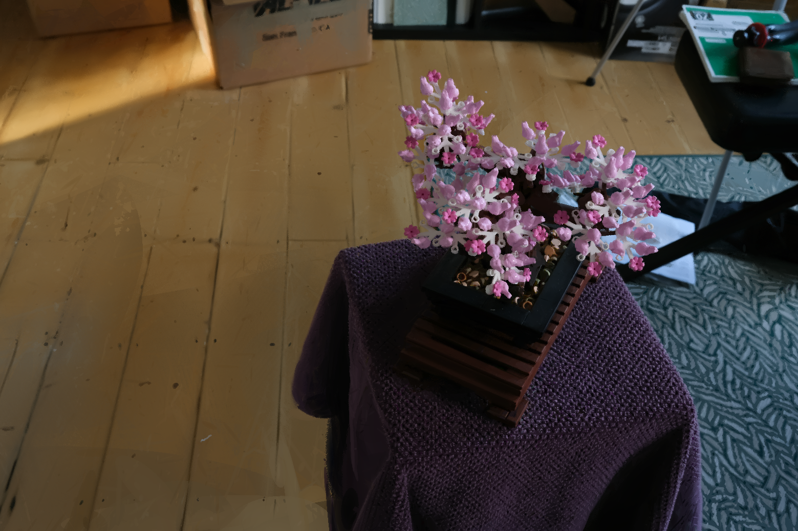 | 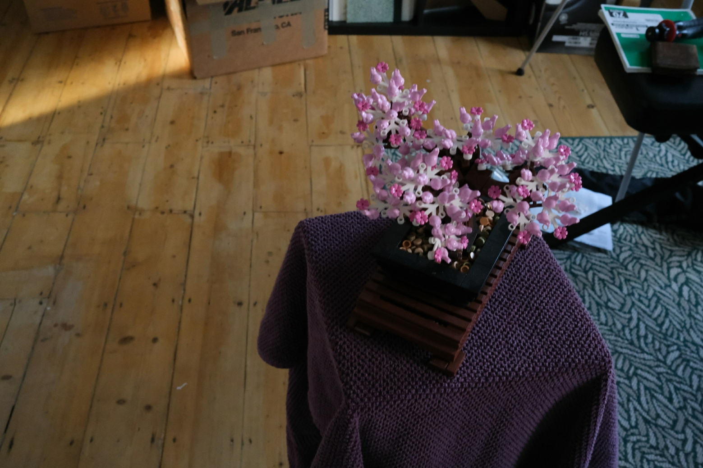 |
| 25 |  |  |
| 30 |  |  |

---
