[[260409]report.md](https://github.com/usnij/Research_repo/blob/main/report/%5B260409%5D%5B%EB%AA%A8%EC%A7%84%EC%88%98%5DGaussianFragmentBlending_report.md) 내용과 서술형식에 대한 교수님 피드백을 바탕으로 현재 설계되어있는 부분에 대해 레포트 재작성


## 목차

- [목차](#목차)
- [1. 바닐라 3DGUT 구조 요약](#1-바닐라-3dgut-구조-요약)
  - [렌더링 파이프라인](#렌더링-파이프라인)
  - [핵심 특성](#핵심-특성)
  - [확장의 동기](#확장의-동기)
- [2. Gaussian Fragment Blend (GFB)](#2-gaussian-fragment-blend-gfb)
  - [2.1 설계 동기](#21-설계-동기)
- [3. Forward](#3-forward)
  - [3.1  Ray-Gaussian 교차 계산 (Canonical Space를 통해 t1 t2계산)](#31--ray-gaussian-교차-계산-canonical-space를-통해-t1-t2계산)
    - [Canonical Space 변환](#canonical-space-변환)
  - [3.2  \[t1,t2\] 알파 프로파일](#32--t1t2-알파-프로파일)
    - [3.2.1 단일 Gaussian — \[t1,t2\] 구간 적분](#321-단일-gaussian--t1t2-구간-적분)
    - [3.2.2 겹쳐있을 때 처리](#322-겹쳐있을-때-처리)
- [4. 바닐라 3DGUT vs GFB — 추가 구현 변수 정리](#4-바닐라-3dgut-vs-gfb--추가-구현-변수-정리)
- [5. Backward](#5-backward)
  - [5.1 Gradient 경로](#51-gradient-경로)
  - [5.2 버전별 구현 과정](#52-버전별-구현-과정)
    - [v1 — PATH 1만 전파](#v1--path-1만-전파)
    - [v2 — PATH 1 + PATH 2](#v2--path-1--path-2)
    - [v3 — PATH 1 + PATH 2 + PATH 3](#v3--path-1--path-2--path-3)
- [6. 실험 결과](#6-실험-결과)
  - [렌더링 비교 (Vanilla 3DGUT vs GFB v3 vs GT)](#렌더링-비교-vanilla-3dgut-vs-gfb-v3-vs-gt)


## 1. 바닐라 3DGUT 구조 요약

### 렌더링 파이프라인

```
[Gaussian 파라미터] → [Unscented Transform 투영] → [Tile 단위 정렬]
    → [Ray-Gaussian 교차 판정] → [K-Buffer 삽입]
    → [Drain 시 processHitParticle] → [순차 Alpha Compositing]
```

### 핵심 특성

- **투영**: Unscented Transform(UT)으로 3D Gaussian → 2D 투영 (비선형 카메라 지원)
- **정렬**: Tile 단위 global z-order (per-pixel 정렬 없음, 논문 Sec 4.3)
- **K-Buffer**: MLAB(Multi-Layer Alpha Blending) — ray당 k개 히트를 max-heap으로 관리
  - 기본값 `k=0` (정렬 없는 vanilla), 논문 실험에서는 `k=16` ("Ours (sorted)")
  - k=0 ≈ k=16 (핀홀 카메라 기준 comparable quality)
- **Compositing**: 표준 순차 alpha blending — Gaussian 하나당 단일 alpha 값 (point mass)

### 확장의 동기

> 논문 자체가 인정: *"as our method still uses a single point to evaluate each primitive, it is currently unable to render overlapping Gaussians accurately"*

겹치는 Gaussian을 점(point mass)이 아닌 체적(volume)으로 처리하자는 것이 Fragment Blend 계열 확장의 공통 목표.

## 2. Gaussian Fragment Blend (GFB)

### 2.1 설계 동기

바닐라 3DGUT의 문제:

$$
\text{color} \mathrel{+}= \alpha_i \cdot T \cdot \mathbf{f}_i, \qquad T \mathrel{\times}= (1 - \alpha_i)
$$

Gaussian 하나가 ray 위에서 단일 alpha 값 하나로 처리된다. Ray가 Gaussian 타원체를 통과하는 전체 구간 `[t1, t2]`에 alpha가 균등하게 기여하는 것이 아니라, 밀도 최대점(`hitT`) 한 지점에 집중된 **점 질량(point mass)** 형태다.

GFB의 목표: Ray가 Gaussian 타원체를 통과하는 구간 전체에 걸쳐 **실제 3D Gaussian의 bell-curve 밀도 프로파일**을 반영한 연속적인 alpha 분포를 사용.


## 3. Forward

- 해당 구조에서 Forward는 아래와 같은 순서로 진행된다.

  1. Gaussian 순회하며 hit판정 후 k-buffer 삽입
  2. 삽입할 때 k-buffer가 가득 차있으면 compositing 시작
  3. 겹침을 고려한 블랜딩(k-buffer의 모든 가우시안 compositing) 
  4. transmittance가 임계치 이하가 아니면 다시 1번부터 수행하며 임계치 이하가 될 때 까지 반복

- 여기서 3번 과정이 어떻게 되는지가 Forward의 핵심이다.


### 3.1  Ray-Gaussian 교차 계산 (Canonical Space를 통해 t1 t2계산)

- t1 t2는 ray와 gaussian이 hit 되었을 경우에만 구한다. 

- t1 t2는 ray와 gaussian이 만나는 출발점과 끝점에 해당하는데 gaussian의 경우 경계가 뚜렷한 하나의 도형이 아니라 무한히 퍼져있는 연속 분포 형태이기 때문에 임계값을 설정해서 출발점과 끝점으로 보는 구조로 설계했다. 

- t1 t2는 기존에 구해지는 hitT를 구하는 식을 응용해 구하게 된다. 


- 여기서 hitT는 ray-gaussian 중점 사이의 가장 가까운 지점의 t값이며 이는 cannonical space로 변환해서 구하게 된다.


#### Canonical Space 변환
- Canonical Space 변환 : 타원체 형태인 3D Gaussian은 gaussian의 중심을 원점으로 하며 반지름이 1인 구로 transform을 함 
- 이 transform을 동일하게 ray에도 수행한다. 여기서 ray에 대한 함수도 변하며 변한 함수값은 gaussian의 중심과 ray사이에 대한 거리를 의미하게 된다. 
---
먼저 ray의 식은 아래와 같다.


$$
\begin{aligned}
r = o_{ray} + t \cdot d_{ray} \qquad
o_{ray} : \text{ray 시작점} \qquad
d_{ray}: \text{ray 방향벡터}
\end{aligned}
$$

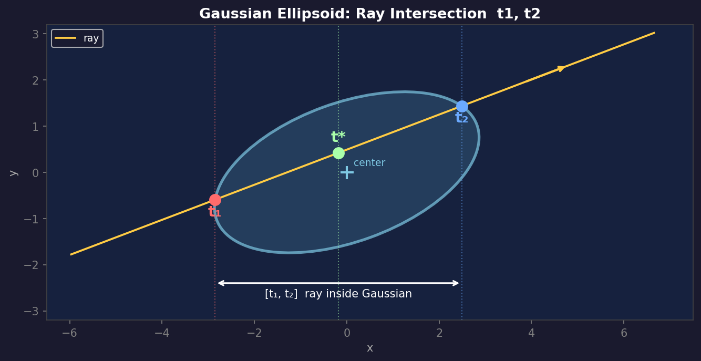

즉 구하고자 하는 t1,t2를 그림으로 보면 위의 같다. 편의를 위해 2차원의 타원 형태로 봤지만 gaussian은 3차원의 흩뿌려져 있는 타원체 연속 분포이다.  

그리고 t1 t2를 구하기 위해 ray의 각 변수를 cannonical space로 변환해줘야 한다. 이는 이미 기존의 3DGUT에 구현되어 있는 부분에서 추가적인 구현을 해서 구하게 된다.  

추가적인 구현전에 이미 구현되어 있는 부분에 대해 아래 수식을 통해 먼저 설명한다.

- 아래 수식은 Gaussian center - ray 사이의 최단 거리에 해당하는 부분의 t값(hitT)를 구하는 과정이며 위 그림상에서 t*에 해당하는 위치를 구하는 과정이다.

- 여기서 변수 hitT와 t*는 동일하다.  

---
$$
\begin{aligned}
\mathbf{giscl} &= \mathbf{1}/\mathbf{scale} & &\text{(element-wise 역수)} \\
\end{aligned}
$$

$$
\begin{aligned}
R^T &= \text{quaternionToMatrix}(q) & &\text{(world} \to \text{canonical 회전)} \\
\end{aligned}
$$

- 여기서 $giscl$, $R^T$ 는 cannonical space 변환 행렬에 해당한다. 즉 타원체를 구로 변환해주는 행렬이다.

---
$$
\begin{aligned}
\boldsymbol{\delta} &= \mathbf{o}_\text{ray} - \boldsymbol{\mu} & &\text{(ray origin} \to \text{Gaussian center)} \\[6pt]
\mathbf{ro} &= R^T \cdot \boldsymbol{\delta} & &\text{(canonical ray origin)} \\[6pt]
\mathbf{o}_c &= \mathbf{giscl} \odot \mathbf{ro} & &\text{(scale 적용)} \\[6pt]
\end{aligned}
$$
- 먼저 ray_origin에 대한 수식은 위와 같고 처음에는 translation이다. 즉 cannonical space는 원점이 gaussian center이므로 그에 맞춘 것이다.
- 그리고 위에서 정의한 $giscl$, $R^T$ 를 곱해준다. 

---
$$
\begin{aligned}
\mathbf{rd} &= R^T \cdot \mathbf{d}_\text{ray} & &\text{(canonical ray 방향, 미정규화)} \\
\mathbf{grdu} &= \mathbf{giscl} \odot \mathbf{rd} & &\text{(scale 적용)} \\
\text{grduLen} &= \|\mathbf{grdu}\| & &\text{(grdu 벡터 크기)} \\
\mathbf{d}_c &= \mathbf{grdu} / \text{grduLen} & &\text{(canonical에서의 ray방향 단위 벡터)}
\end{aligned}
$$
- $d_{ray}$ 는 ray를 구성하는 방향벡터이고 이에 대해서도 cannonical space로 변환해주는 과정이다. 
---


- 이렇게 cannonical space에서의 ray 식을 구할 수 있게 된다.

$$
\begin{aligned}
r_{canonical} = o_{c} + t \cdot \mathbf{grdu}
\end{aligned}
$$

- $r_{canonical}$를 $y(t)$라고 보면 이 함수의 출력은 t에 대한 cannoinical space상의 ray의 한 점을 의미하며 이는 하나의 벡터로 볼 수 있고 
- canonical space는 원점이 gaussian center이므로 **$||y(t)||$는 t에 대해 gaussian center와의 거리의 크기가 된다.**
- 즉 $||y(t)||$ 가 최소가 되는 t가 위 그림에서의 t* 이다.


여기서 우리는 t1과 t2를 구하는 것이 목적이고 이를 위해서는 canonical space의 구가 반지름이 1이라는 점을 이용해 구하게 된다. 즉 $||y(t)||$ 가 1이 되는 지점 두 포인트가 t1, t2가 되는 것이다.

- 이를 구하는 수식은 아래와 같다.

$$
\|\mathbf{o}_c + t \cdot \mathbf{d}_c\|^2 = 1
$$

$$
\begin{aligned}
h &= \mathbf{d}_c \cdot \mathbf{o}_c \\
\text{disc} &= h^2 - \left(\|\mathbf{o}_c\|^2 - 1\right) & &\text{(disc} < 0 \text{이면 교차 없음)} \\
sq &= \sqrt{\text{disc}}
\end{aligned}
$$

$$
t_1 = \frac{-h - sq}{\text{grduLen}}, \qquad
t_2 = \frac{-h + sq}{\text{grduLen}}, \qquad
t^{\ast} = \frac{t_1 + t_2}{2} = \frac{-h}{\text{grduLen}}
$$


---
- canonical space의 모습을 간단하게 2D에서 생각해보면 아래와 같다. 

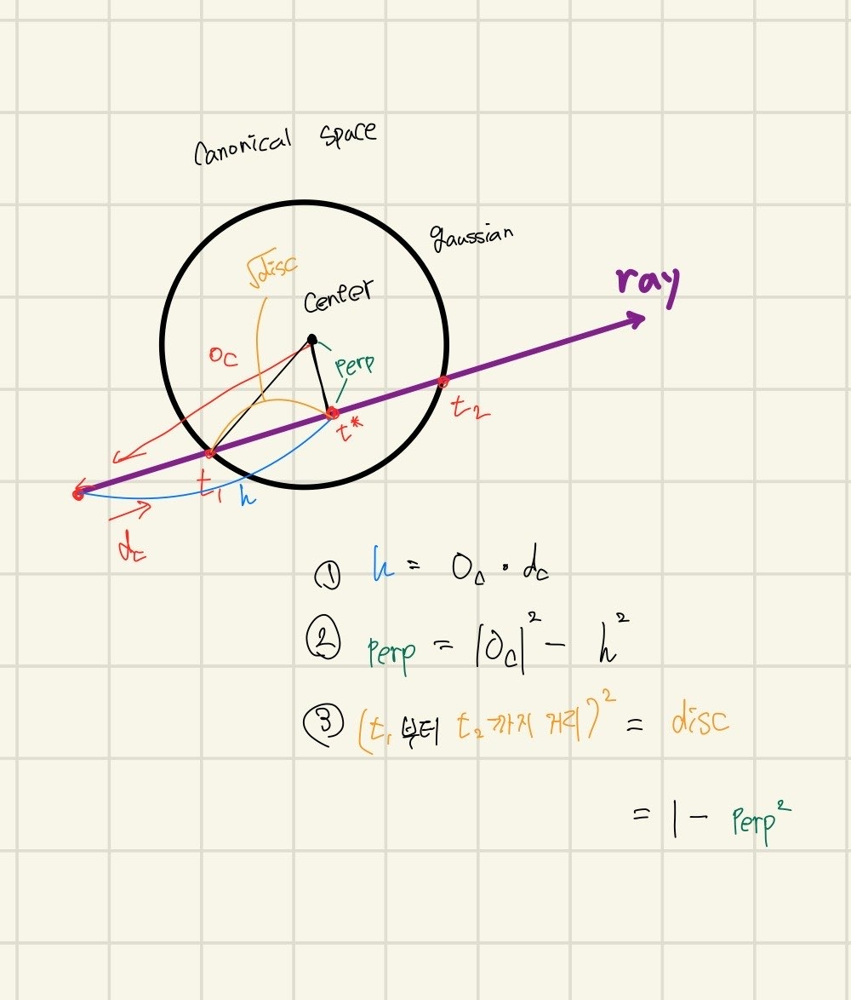

- 해당 그림에서 2번 과정이 perp를 이용해 바닐라gut에서는 hitT점을 구하고 끝이며 이후 과정은 추가적으로 구현하게 되는 것이다. 

- 위의 식에서 t1,t2를 구할 때 `grduLen`로 나누는 이유는 canonical space에서 intersection을 풀 때 단위벡터 `d_c` 기준으로 풀었기 때문이다

### 3.2  [t1,t2] 알파 프로파일

- 3.1에서 t1, t2를 구했다. 이제 이 구간에서 t에 대한 alpha 값이 어떻게 결정되는지가 핵심이다.

- alpha는 빛이 매질을 통과하면서 얼마나 감쇄되는지로 결정된다. 매질 속을 진행하는 빛의 세기 $I(t)$에 대해 다음 미분방정식을 세울 수 있다.

$$
\frac{dI}{dt} = -\rho(t) \cdot I(t)
$$

- 현재 위치 t의 밀도 $\rho(t)$만큼 빛이 흡수된다는 의미다. 이를 풀면:

$$
T(t) = \frac{I(t)}{I(t_1)} = \exp\left(-\int_{t_1}^{t} \rho(s)\, ds\right) = e^{-\tau(t)}, \qquad \tau(t) = \int_{t_1}^{t} \rho(s)\, ds
$$

- $T(t)$는 투과율(Transmittance)이고 $\tau(t)$는 광학 깊이(optical depth)다. alpha는 흡수된 비율이므로:

$$
\alpha(t) = 1 - T(t) = 1 - e^{-\tau(t)}
$$

- 즉 ray가 구간 $[s_i, s_j]$를 통과할 때 alpha는 아래와 같다.

$$
\alpha(s_i,\, s_j) = 1 - \exp\left(-\int_{s_i}^{s_j} \rho(t)\, dt\right)
$$

- 바닐라 3DGUT는 Gaussian 하나를 t* 한 지점의 point mass로 처리한다. GFB는 이를 확장해서 $[t_1, t_2]$ 전 구간에 걸쳐 $\rho(t)$를 bell-curve로 분포시킨다.

$$
\rho(t) \propto \exp\left(-\frac{1}{2} \cdot \mathrm{grduLen}^2 \cdot (t - t^{\ast})^2\right)
$$

- 이때 $[t_1, t_2]$ 전체를 적분한 총 광학 깊이 $\sigma_0$는 galpha로부터 결정된다. 이는 3.2.1에서 설명한다.

---

#### 3.2.1 단일 Gaussian — [t1,t2] 구간 적분

**galpha와 sigma0**

- 바닐라 3DGUT에서 ray가 Gaussian을 hit하면 `galpha`를 계산한다. t* 지점의 밀도를 단일 지점에서 평가한 alpha값이며 canonical space에서 수직거리 `perp`를 이용한다.

$$
\mathrm{galpha} = 1 - \exp\left(-\mathrm{density} \cdot \exp\left(-\frac{1}{2}\,\mathrm{perp}^2\right)\right)
$$

---

- 위 식은 $\alpha = 1 - \exp(-\sigma)$ 형태이므로 광학 깊이를 역산하면 `sigma0`를 구할 수 있다.

$$
\sigma_0 = -\ln(1 - \mathrm{galpha})
$$

---

- 이 $\sigma_0$를 이 Gaussian이 $[t_1, t_2]$ 전 구간에 걸쳐 기여하는 총 광학 깊이로 사용한다. 즉 bell-curve를 $[t_1, t_2]$에서 적분하면 $\sigma_0$가 되도록 정규화 조건을 설정한다.

$$
\int_{t_1}^{t_2} \rho(t)\, dt = \sigma_0
$$

---

- 이 정규화 상수가 `erf_tot`이다. Gaussian bell-curve의 적분은 erf 함수로 표현된다.

$$
\begin{aligned}
\mathrm{erf\_tot} = \mathrm{erf}\!\left(\sqrt{\frac{\mathrm{disc}}{2}}\right), \qquad \mathrm{disc} = 1 - \mathrm{perp}^2
\end{aligned}
$$


---

- 세그먼트 $[s_\mathrm{lo},\, s_\mathrm{hi}] \subseteq [t_1, t_2]$에 대한 기여량은 전체 대비 erf 비율로 구한다.

$$
\begin{aligned}
\mathrm{erf\_seg} = \mathrm{erf}\!\left(\frac{(s_\mathrm{hi} - t^{\ast}) \cdot \mathrm{grduLen}}{\sqrt{2}}\right) - \mathrm{erf}\!\left(\frac{(s_\mathrm{lo} - t^{\ast}) \cdot \mathrm{grduLen}}{\sqrt{2}}\right)
\end{aligned}
$$

---
 
$$
\mathrm{contrib} = \sigma_0 \cdot \frac{\mathrm{erf\_seg}}{\mathrm{erf\_tot}}, \qquad \alpha_\mathrm{seg} = 1 - \exp(-\mathrm{contrib})
$$

- 세그먼트이 전체 구간 $[t_1, t_2]$일 때(겹침 없는 경우) erf_seg = erf_tot이 되므로:

$$
\mathrm{contrib} = \sigma_0 \implies \alpha_\mathrm{seg} = 1 - e^{-\sigma_0} = \alpha_i
$$

- 즉 겹침이 없을 때는 바닐라 3DGUT와 결과가 동일하다. GFB는 바닐라의 수학적 확장이다.

---

이에 대해 임의의 Gaussian에 대한 알파프로파일을 한 번 그래프로 그려보면 아래와 같다. 
- 여기서 grduLen, disc,alpha의 경우 바닐라에서 사용하는 변수이고 sigam0는 bell-curve를 위해 구현한 변수이다. 

- 그림에서 상단은 $\rho(t)$의 bell-curve이며 음영 구간인 $[t_1, t_2]$를 적분하면 정확히 $\sigma_0$가 된다. 하단은 $t_1$부터 t까지의 누적 alpha이고 $t_2$에 도달했을 때 정확히 galpha로 수렴하는 걸 볼 수 있다.

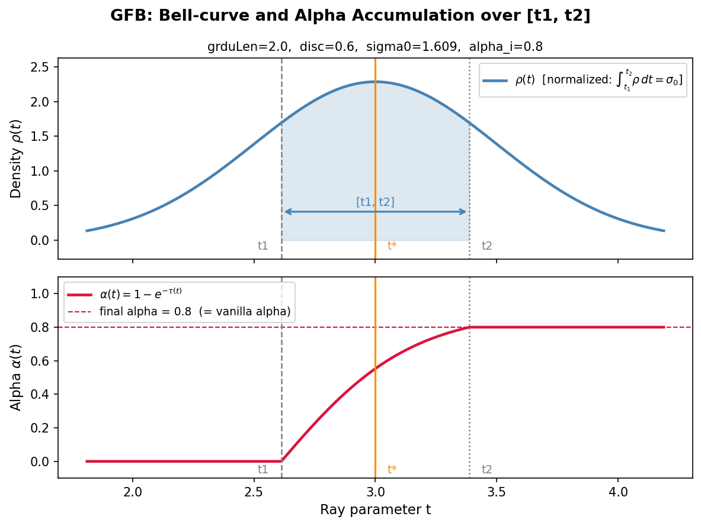


---

#### 3.2.2 겹쳐있을 때 처리

- k-buffer 내에 여러 Gaussian이 있을 때 같은 t 위치에서 여러 Gaussian의 $\rho(t)$가 동시에 기여한다.

- 각 Gaussian의 t1, t2를 모아서 정렬하면 t1/t2들이 자연스럽게 세그먼트의 경계를 만들어낸다. 2개의 Gaussian이 겹치는 경우 아래 그림처럼 3개의 구간이 생긴다.


- 각 세그먼트에서 활성화된 Gaussian들의 contrib를 합산한다.

$$
\mathrm{contrib\_total} = \sum_{i \in \text{active}} \sigma_0^{(i)} \cdot \frac{\mathrm{erf\_seg}^{(i)}}{\mathrm{erf\_tot}^{(i)}}
$$

$$
\alpha_\mathrm{seg} = 1 - \exp\left(-\mathrm{contrib\_total}\right)
$$

- 겹치는 구간에서 contrib가 합산되기 때문에 두 Gaussian이 겹치는 구간에서 더 높은 불투명도가 나온다.

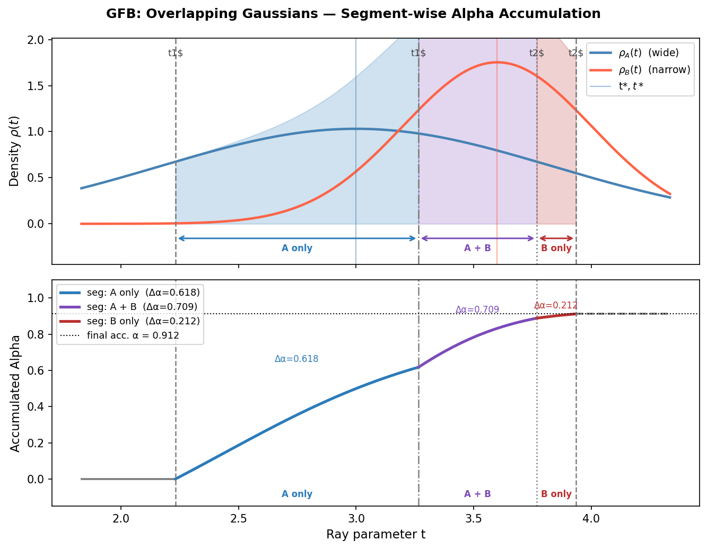

위 그림은 두 Gaussian A(넓음)와 B(좁음)가 겹치는 경우다. 상단은 각각의 bell-curve이고 하단은 front-to-back 방향으로 누적되는 alpha다. entry/exit point 4개가 3개의 세그먼트을 만들고 각 구간에서 활성화된 Gaussian만 contrib에 기여한다. seg2(A+B 겹치는 구간)에서는 두 contrib가 합산되어 alpha가 더 빠르게 올라간다. 세 구간을 front-to-back으로 합성한 최종 누적 alpha는 $1 - (1-0.618)(1-0.209)(1-0.232) = 0.952$다.

---

## 4. 바닐라 3DGUT vs GFB — 추가 구현 변수 정리

- 바닐라 3DGUT에서 GFB를 구현하면서 새롭게 추가된 변수와 기존에 있던 변수를 정리하면 아래와 같다.

| 변수 | 바닐라 3DGUT | GFB | 설명 |
|------|:-----------:|:---:|------|
| `grduLen` | ✓ | ✓ | canonical ray 방향의 크기. 바닐라에서 hitT 계산에 사용. GFB에서는 bell-curve 폭 결정에도 사용 |
| `galpha` (alpha) | ✓ | ✓ | t* 지점의 점 질량 alpha. GFB에서 sigma0의 입력값 |
| `perp` | ✓ | ✓ | ray에 수직인 canonical 거리벡터. `perp = o_c - h·d_c` |
| `hitT` (t*) | ✓ | ✓ | ray-Gaussian 최근접점의 t. |
| `disc` | ✗ | ✓ | t1,t2 계산을 위해 추가, ray-단위구 교차 판별식. `1 - perp²` (음수이면 미교차) |
| `t1`, `t2` | ✗ | ✓ | ray가 Gaussian 단위구에 들어오고 나가는 t값. GFB에서 추가 |
| `sigma0` | ✗ | ✓ | `galpha`로부터 역산한 총 광학 깊이. bell-curve 정규화에 사용 |
| `erf_tot` | ✗ | ✓ | `[t1,t2]` 전체 bell-curve 면적. `erf(sqrt(disc/2))`로 계산 |
| `erf_seg` | ✗ | ✓ | 각 세그먼트 내 bell-curve 면적. `erf_tot`로 나눠서 contrib 비율 결정 |
| `contrib` | ✗ | ✓ | 한 세그먼트에서 Gaussian i의 광학 깊이 기여량. `sigma0 * erf_seg / erf_tot` |


- 바닐라에서 GFB로 가면서 핵심적으로 추가된 부분은 **t1, t2 기반의 세그먼트 분할**과 **erf 적분을 통한 연속 alpha 분포**다. galpha, grduLen 같은 기존 변수는 그대로 재활용한다.

---

## 5. Backward

- Forward에서 loss가 계산되면 각 Gaussian 파라미터(position, scale, quaternion, density, features)로 gradient를 전파해야 한다.

- GFB backward에는 크게 3가지 경로가 있다. 구현 과정에서 각 경로를 순차적으로 추가했고 버전마다 결과가 달랐다.

### 5.1 Gradient 경로

**PATH 1 — sigma0 → alpha 경로**

- contrib = sigma0 * erf_seg / erf_tot이고 sigma0 = -log(1 - alpha)이므로, loss에서 contrib로 흘러온 gradient가 sigma0를 거쳐 alpha로 전파된다.
- alpha는 galpha이며 galpha는 density와 `perp`로 결정되므로 position, scale, quaternion으로 최종 전파된다.

$$
\frac{\partial \mathcal{L}}{\partial \sigma_0} \to \frac{\partial \mathcal{L}}{\partial \alpha} \to \frac{\partial \mathcal{L}}{\partial \mathrm{perp}} \to \frac{\partial \mathcal{L}}{\partial \mathrm{position,\; scale,\; quaternion}}
$$

**PATH 2 — erf 기하 경로**

- contrib = sigma0 * erf_seg / erf_tot에서 erf_seg와 erf_tot도 파라미터에 의존한다.
- `erf_seg`는 t_star와 grduLen에 의존하고, `erf_tot`는 disc에 의존한다.

$$
\frac{\partial \mathcal{L}}{\partial \mathrm{erf\_seg}} \to \frac{\partial \mathcal{L}}{\partial t^{\ast},\; \mathrm{grduLen}}
\qquad
\frac{\partial \mathcal{L}}{\partial \mathrm{erf\_tot}} \to \frac{\partial \mathcal{L}}{\partial \mathrm{disc}} \to \frac{\partial \mathcal{L}}{\partial h,\; \mathbf{o}_c}
$$

**PATH 3 — 구간 경계 경로**

- 세그먼트의 경계 `s_lo`, `s_hi`가 각 Gaussian의 t1, t2이기 때문에 경계 위치 자체도 파라미터에 의존한다.
- t1, t2가 이동하면 해당 구간의 tau_k가 변하므로 이 변화량도 전파해야 한다.

$$
\frac{\partial \mathcal{L}}{\partial s} = \pm \left( \frac{\partial \mathcal{L}}{\partial \tau_k} \sum_j \dot{\tau}_j(s) + \frac{\partial \mathcal{L}}{\partial \alpha_k} \cdot \alpha_k \sum_j \frac{\dot{\tau}_j(s) \cdot \tilde{f}_j}{\tau_k} \right)
$$

여기서 $\dot{\tau}_j(s) = \sigma_0^{(j)} \cdot \mathrm{bell}(s, j) / \mathrm{erf\_tot}^{(j)}$ 이다. 누적된 `d_t1[i]`, `d_t2[i]`는 다시 h, disc를 거쳐 position, scale, quaternion으로 전파된다.

---

### 5.2 버전별 구현 과정

#### v1 — PATH 1만 전파

- erf_seg, erf_tot를 통한 geometric gradient를 완전히 무시하고 sigma0 → alpha 경로만 구현했다.
- 수학적으로 불완전하지만 학습은 수렴했다. PSNR 28.688 dB.

#### v2 — PATH 1 + PATH 2

- erf_seg → t*, grduLen 경로와 erf_tot → disc 경로를 추가했다.
- 그런데 **PATH 3 (경계 gradient)** 가 누락된 상태였다.
- Python gradcheck로 확인했더니 PATH 3이 position gradient의 87%, scale gradient의 262%를 차지하는 것으로 나왔다. 즉 v2는 지배적인 gradient를 누락한 상태였고 결과적으로 **발산**했다. PSNR 13.856 dB.

#### v3 — PATH 1 + PATH 2 + PATH 3

- 구간 경계 gradient까지 모두 추가해서 수학적으로 완전한 backward를 구현했다.
- 발산 문제는 해소됐지만 PSNR 28.358 dB로 v1보다 오히려 약간 낮았다.


---

## 6. 실험 결과

**공통 조건: Bonsai 씬, downsample_factor=2, 30k iteration**

| 방법 | PSNR | vs Baseline |
|------|------|-------------|
| **Vanilla 3DGUT (k=0)** | **32.352** | — |
| GFB v1 (PATH 1) | 28.688 | -3.664 |
| GFB v2 (PATH 1+2) | 13.856 | **발산** |
| GFB v3 (PATH 1+2+3) | 28.358 | -3.994 |

---

### 렌더링 비교 (Vanilla 3DGUT vs GFB v3 vs GT)

| Frame | Vanilla 3DGUT | GFB v3 | GT |
|-------|--------------|--------|----|
| 09 | 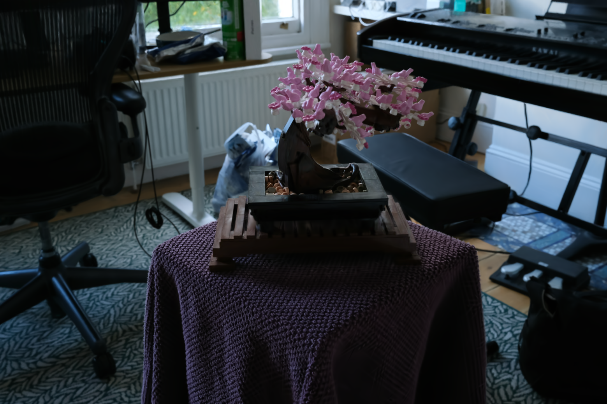 |  |  |
| 15 | 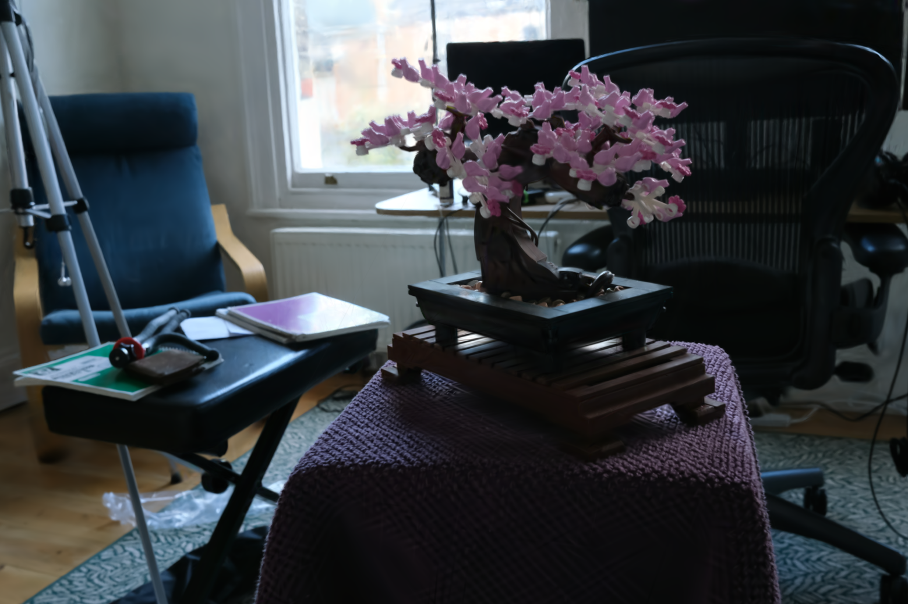 |  | 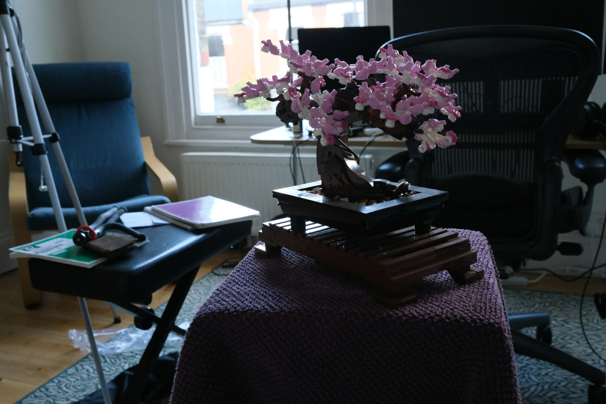 |
| 20 | 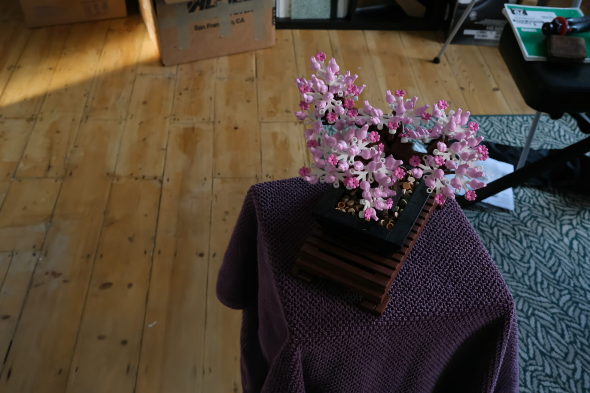 |  |  |
| 25 | 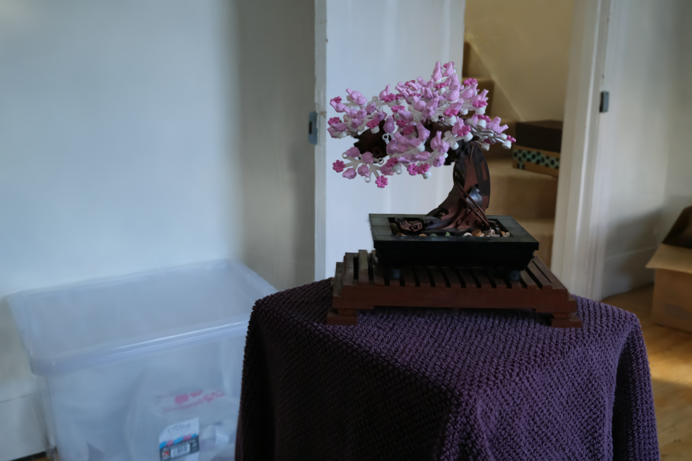 | 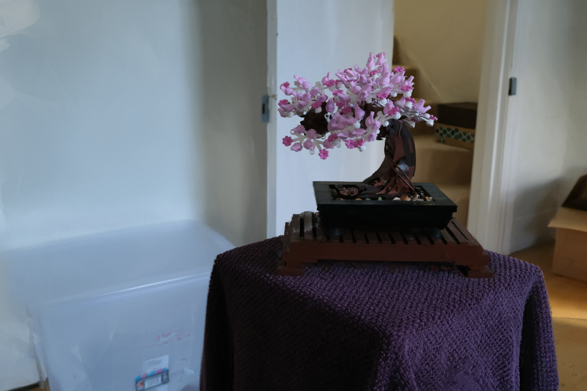 | 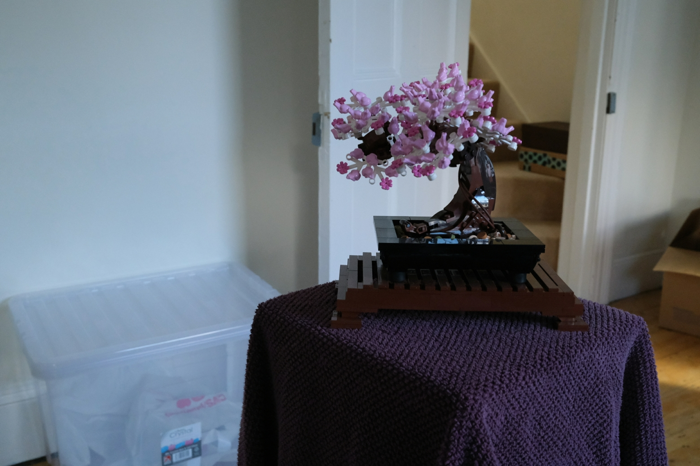 |
| 30 |  |  |  |

- Vanilla 3DGUT (32.352 dB)는 GFB v3 (28.358 dB)보다 전반적으로 선명하다. GFB는 bell-curve 가정으로 인한 smearing 효과로 detail이 흐려지는 경향이 있다.
- 특히 잎사귀 같이 얇고 겹치는 구조에서 차이가 두드러진다.