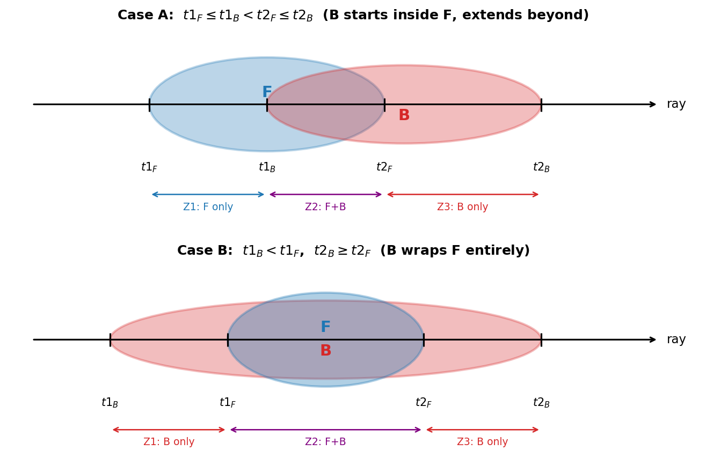

[260415][모진수]GaussianFragmentBlending_OptionA_report.md 이후 GFB 계열 실험 결과를 바탕으로 forward를 재설계한 방향 정리

**기준 환경**: Bonsai 씬, downsample_factor=2, 30k iteration
**출발점**: GFB v1/v3/OptionA 모두 ~28 dB 한계 → forward 재설계 결정

---

## 목차

- [목차](#목차)
- [1. 기존 GFB의 문제점 요약](#1-기존-gfb의-문제점-요약)
- [2. 설계 방향](#2-설계-방향)
- [3. Alpha Profile 정의](#3-alpha-profile-정의)
- [4. K-Buffer 정렬 변경 (hitT → t2)](#4-k-buffer-정렬-변경-hitt--t2)
- [5. Blending 함수 설계](#5-blending-함수-설계)
  - [입력](#입력)
  - [처리 흐름](#처리-흐름)
- [6. Overlap 처리 (Z-Thickness SFM)](#6-overlap-처리-z-thickness-sfm)
  - [겹침 조건](#겹침-조건)
  - [t2 정렬에서 가능한 두 케이스](#t2-정렬에서-가능한-두-케이스)
  - [Case A: B가 F 안에서 시작, F 너머로 확장 (일반적 케이스)](#case-a-b가-f-안에서-시작-f-너머로-확장-일반적-케이스)
  - [Case B: B가 F를 완전히 감쌈](#case-b-b가-f를-완전히-감쌈)
  - [Premultiplied → Raw Color 변환](#premultiplied--raw-color-변환)
- [7. Forward 수식 정리](#7-forward-수식-정리)
- [8. Z-Thickness 논문과의 수학적 차이](#8-z-thickness-논문과의-수학적-차이)
  - [8.1 Opacity Model](#81-opacity-model)
  - [8.2 Color Subdivision](#82-color-subdivision)
  - [8.3 Peeling (Back-Subdivision)](#83-peeling-back-subdivision)
  - [8.4 Mix Operator (논문 Section 3.3.2)](#84-mix-operator-논문-section-332)
- [9. Backward 설계](#9-backward-설계)
  - [9.1 GFB Backward에서 배운 교훈](#91-gfb-backward에서-배운-교훈)
  - [9.2 2단계 전략](#92-2단계-전략)
    - [Phase 1: galpha-only backward (권장 시작점)](#phase-1-galpha-only-backward-권장-시작점)
    - [Phase 2: 선택적 geometric gradient (Phase 1 성공 후)](#phase-2-선택적-geometric-gradient-phase-1-성공-후)
  - [9.3 구현 노트](#93-구현-노트)
- [10. 기존 GFB와 비교](#10-기존-gfb와-비교)
- [참고](#참고)

---

## 1. 기존 GFB의 문제점 요약

- **Bell-curve (erf) density profile**: sigma0 역산 필요, galpha → 1일 때 sigma0 발산
- **Backward geometric gradient 충돌**: PATH2 (erf_seg → grduLen)와 PATH3 (boundary t1, t2)가 3DGUT 학습 방향과 충돌
- **PATH2만 있고 PATH3 없으면 발산**: 둘 사이의 균형이 필요하나 이 균형이 학습 방해
- **K=1 실험 결과**: forward는 vanilla와 동일한데도 28.318 dB → backward 자체가 문제

**핵심 결론**: erf 기반 density profile 자체를 버리고 선형 alpha profile로 재설계한다.

---

## 2. 설계 방향

Z-Thickness 논문(CGF/PG 2021, Kim & Kye)의 SFM(Smooth Fragment Merging) 방식을 기반으로:

1. **선형 alpha profile**: `A(t) = (t - t1) / (t2 - t1) * galpha`
2. **K-buffer를 t2 기준 정렬**: exit depth 기준으로 정렬해 앞에서 끝나는 Gaussian을 먼저 drain
3. **Blending 함수**: drain된 Gaussian을 누적 fragment에 SFM 방식으로 합산
4. **sigma0 역산 없음**: galpha 직접 사용


---

## 3. Alpha Profile 정의

Gaussian i가 ray와 교차하는 구간 `[t1_i, t2_i]`, alpha = `galpha_i`일 때:

```
d_i = t2_i - t1_i

A_i(t) = (t - t1_i) / d_i * galpha_i     (t1_i ≤ t ≤ t2_i)
```

- t = t1_i: A = 0 (진입 시 opacity 없음)
- t = t2_i: A = galpha_i (완전히 통과 시 원래 opacity 복원)
- 선형 증가 → Z-Thickness 논문의 β=1 케이스 (Eq.4에서 β=1)

이는 균일 매질 모델(homogeneous medium)의 선형 근사로, 기존 GFB의 bell-curve보다 단순하고 안정적이다.

밀도로 표현하면:

```
rho_i = galpha_i / d_i    (구간 내 균일 밀도)
```

구간 내 transmittance:

```
T_i(t) = exp(-rho_i * (t - t1_i)) = (1 - galpha_i)^((t - t1_i) / d_i)
```

---

## 4. K-Buffer 정렬 변경 (hitT → t2)

기존: k-buffer를 hitT (closest approach) 기준 정렬
변경: **t2 (exit depth) 기준 정렬**

이유: t2가 작은 Gaussian이 ray에서 먼저 끝난다 → overlap 처리 시 앞에서 완전히 끝나는 fragment를 먼저 drain해야 기하학적으로 올바른 순서

drain 시점:
- buffer가 꽉 찼을 때 → t2가 가장 작은 Gaussian을 drain → blending 함수에 전달

**핵심 불변량**: drain은 t2 오름차순으로 발생하므로, 각 drain의 t2_B >= 이전 drain의 t2. 누적 fragment F의 t2_F = max(이전 모든 drain의 t2)이므로 **다음 drain의 t2_B >= t2_F**가 보장된다. 즉 B는 항상 F보다 같거나 더 멀리 확장된다.

---

## 5. Blending 함수 설계

### 입력
- **Fragment F**: 이미 여러 Gaussian이 합산된 누적 fragment
  - 구간 `[t1_F, t2_F]`, 누적 alpha `A_F`, premultiplied color `V_F = c_F * A_F`
- **Gaussian B**: 새로 drain된 Gaussian
  - 구간 `[t1_B, t2_B]`, `galpha_B`, premultiplied color `V_B = c_B * galpha_B`

> **표기 규약**: 이 문서에서 대문자 `V`는 premultiplied color (= raw_color × alpha), 소문자 `c`는 raw color를 나타낸다. Z-Thickness 논문의 "visibility" = `(V, A)` = (premultiplied color, alpha).

### 처리 흐름

```
if t1_B >= t2_F:
    # 겹침 없음 → F를 ray에 바로 composite, B가 새 fragment 시작
    composite(ray, F)
    new_fragment = B

else:
    # 겹침 있음 → SFM으로 merge
    merged_fragment = SFM(F, B)
    new_fragment = merged_fragment
```

---

## 6. Overlap 처리 (Z-Thickness SFM)

Z-Thickness 논문 Section 3.2.1/3.3.1의 SFM을 선형 alpha profile에 적용한다.

### 겹침 조건

```
t1_B < t2_F    (B의 시작이 F의 끝보다 앞에 있음)
```

### t2 정렬에서 가능한 두 케이스

t2 정렬 불변량 (`t2_B >= t2_F`)에 의해 다음 두 케이스만 존재:



**Case A: B가 F 안에서 시작, F 너머로 확장** (`t1_F ≤ t1_B < t2_F ≤ t2_B`)

```
t1_F     t1_B     t2_F     t2_B
 |--------|========|--------|
 Zone 1   Zone 2   Zone 3
 F only   F+B      B only
```

**Case B: B가 F를 완전히 감쌈** (`t1_B < t1_F` 이고 `t2_B >= t2_F`)

```
t1_B     t1_F     t2_F     t2_B
 |--------|========|--------|
 Zone 1   Zone 2   Zone 3
 B only   F+B      B only
```

### Case A: B가 F 안에서 시작, F 너머로 확장 (일반적 케이스)

```
Zone 1: [t1_F, t1_B]  → F만 존재
Zone 2: [t1_B, t2_F]  → F(back) + B(front) 겹침
Zone 3: [t2_F, t2_B]  → B만 존재
```

**Zone 1 — F의 front portion** (직접 비율 분배):

```
r_F1 = (t1_B - t1_F) / d_F           # F의 front 비율
A_F1 = r_F1 * A_F
V_F1 = r_F1 * V_F
```

**Zone 2 — F의 back portion + B의 front portion**:

```
r_F2 = (t2_F - t1_B) / d_F           # F의 back 비율 (= 1 - r_F1)
A_F2 = r_F2 * A_F
V_F2 = r_F2 * V_F

r_B2 = (t2_F - t1_B) / d_B           # B의 front 비율
A_B2 = r_B2 * galpha_B
V_B2 = r_B2 * V_B
```

**Zone 2 합성** (F_back OVER B_front, F가 앞):

```
A_zone2 = A_F2 + A_B2 * (1 - A_F2)
V_zone2 = V_F2 + V_B2 * (1 - A_F2)
```

**Zone 3 — B의 back portion**:

```
r_B3 = (t2_B - t2_F) / d_B           # B의 back 비율 (= 1 - r_B2)
A_B3 = r_B3 * galpha_B
V_B3 = r_B3 * V_B
```

**최종 merged fragment** — Zone 1 OVER Zone 2 OVER Zone 3:

```
# Zone1 OVER Zone2
A_12 = A_F1 + A_zone2 * (1 - A_F1)
V_12 = V_F1 + V_zone2 * (1 - A_F1)

# (Zone1+2) OVER Zone3
A_merged = A_12 + A_B3 * (1 - A_12)
V_merged = V_12 + V_B3 * (1 - A_12)

t1_merged = t1_F
t2_merged = t2_B     # B가 더 멀리 확장
```

### Case B: B가 F를 완전히 감쌈

```
Zone 1: [t1_B, t1_F]  → B만 존재
Zone 2: [t1_F, t2_F]  → F 전체 + B(mid) 겹침
Zone 3: [t2_F, t2_B]  → B만 존재
```

**Zone 1 — B의 front portion**:

```
r_B1 = (t1_F - t1_B) / d_B
A_B1 = r_B1 * galpha_B
V_B1 = r_B1 * V_B
```

**Zone 2 — B의 mid portion + F 전체**:

```
r_B2 = (t2_F - t1_F) / d_B
A_B2 = r_B2 * galpha_B
V_B2 = r_B2 * V_B

A_F2 = A_F         # F 전체가 overlap zone에 포함
V_F2 = V_F
```

**Zone 2 합성** (B_mid OVER F, B가 앞):

```
A_zone2 = A_B2 + A_F2 * (1 - A_B2)
V_zone2 = V_B2 + V_F2 * (1 - A_B2)
```

**Zone 3 — B의 back portion**:

```
r_B3 = (t2_B - t2_F) / d_B
A_B3 = r_B3 * galpha_B
V_B3 = r_B3 * V_B
```

**최종 merged fragment** — Zone 1 OVER Zone 2 OVER Zone 3:

```
A_12 = A_B1 + A_zone2 * (1 - A_B1)
V_12 = V_B1 + V_zone2 * (1 - A_B1)

A_merged = A_12 + A_B3 * (1 - A_12)
V_merged = V_12 + V_B3 * (1 - A_12)

t1_merged = t1_B     # B가 더 앞에서 시작
t2_merged = t2_B     # B가 더 멀리 확장
```

### Premultiplied → Raw Color 변환

최종 composite 시 raw color가 필요하면:

```
c_merged = V_merged / A_merged       # A_merged > 0일 때
```

---

## 7. Forward 수식 정리

전체 ray compositing (premultiplied 기준):

```
V_ray = 0,  T = 1

for each fragment F in drain order:
    V_ray += T * V_F           # V_F = c_F * A_F (premultiplied)
    T     *= (1 - A_F)

    if T < min_transmittance: break

final_color = V_ray            # 이미 premultiplied sum
```

혹은 raw color 기준 (기존 vanilla과 동일한 형태):

```
color = 0,  T = 1

for each fragment F:
    color += T * A_F * c_F
    T     *= (1 - A_F)
```

개별 Gaussian의 alpha 기여:

```
A_i = galpha_i                          (단독 처리 시, N=1)
A_i(t) = (t - t1_i) / d_i * galpha_i   (SFM 내부, zone 분할 시)
```

N=1일 때 vanilla와의 관계:
- A_i = galpha_i → **vanilla와 수학적으로 동일** ✓

---

## 8. Z-Thickness 논문과의 수학적 차이

### 8.1 Opacity Model

| | Z-Thickness 논문 | 본 설계 |
|---|---|---|
| 정확한 모델 Eq.(2) | `A(z) = 1 - (1 - A_d)^(z/d)` | — |
| β 혼합 Eq.(4) | `A(z) = β·(z/d)·A_d + (1-β)·(1-(1-A_d)^(z/d))` | β=1 고정 |
| 사용 수식 | β를 제어 파라미터로 사용 | `A(z) = (z/d)·galpha` |

- β=0: 정확한 지수 모델 (Beer-Lambert)
- β=1: 선형 근사 (본 설계)
- 논문 Figure 8에서 alpha가 클 때(0.99) β=1과 β=0의 차이가 큼
- **의도적 선택**: 선형 모델이 backward에서 단순하고 안정적. alpha가 높은 Gaussian에서의 오차는 학습으로 보상 가능

### 8.2 Color Subdivision

| | 논문 Eq.(3) | 본 설계 |
|---|---|---|
| front color | `C(z) = C_d · A(z)/A_d` | `V_front = V_F · r` |

논문의 `C`는 premultiplied color (visibility). 본 설계도 premultiplied 기준으로 통일 → 일치.

### 8.3 Peeling (Back-Subdivision)

| | 논문 Eq.(5) | 본 설계 |
|---|---|---|
| back visibility | `(C_b,A_b) = [(C_d,A_d) - (C(z),A(z))] / (1-A(z))` | 직접 비율 분배 |

논문 Eq.(5)는 정확한 peeling이지만 β≠1일 때 필요하다. **β=1(선형)에서는 alpha가 비율에 정비례**하므로 직접 비율 분배(`A_zone = r * A_total`)가 Eq.(5)와 수학적으로 동치이다:

```
# β=1 검증: Eq.(5)로 back을 구하면
A_back = (A_d - r*A_d) / (1 - r*A_d)

# 직접 비율: A_back = (1-r)*A_d

# 두 값은 A_d가 작을 때 거의 같고, A_d → 1일 때 차이 발생
# 예: A_d=0.5, r=0.5 → Eq.(5): 0.333, 직접비율: 0.25
```

**주의**: 정확히는 Eq.(5) peeling이 올바르지만, 선형 근사의 일관성을 위해 직접 비율 분배를 사용한다. 이 오차는 β=1 선형 모델의 본질적 근사 오차 범위 내에 있다.

### 8.4 Mix Operator (논문 Section 3.3.2)

논문의 mix operator(Eq.6-8)는 완전히 겹치는 fragment를 **순서 무관**하게 합성한다:

```
A_acc = 1 - ∏(1 - A_i)              (Eq.6)
c_acc = Σ(c_i · A_i) / Σ(A_i)      (Eq.7, density-weighted average)
```

본 설계는 **SFM(over-operator 기반, 순서 의존)**을 사용한다. t2 정렬이 depth order를 보장하므로 SFM이 적절하며, mix operator보다 정교한 visibility transition을 제공한다 (논문 Section 3.2.3 참조).

---

## 9. Backward 설계

### 9.1 GFB Backward에서 배운 교훈

| 실험 | 결과 | 교훈 |
|------|------|------|
| GFB v1 (galpha gradient만) | 28.688 dB | 안정적이나 forward 한계 |
| GFB v3 (galpha + geometric) | 28.358 dB | geometric gradient가 학습 방해 |
| GFB K=1, bnd=0 (PATH2만) | 14.884 dB | geometric without stabilizer → 발산 |

**핵심**: geometric gradient (t1, t2 방향)가 3DGUT 학습 방향과 충돌한다. forward를 개선하더라도 backward에서 같은 실수를 반복하면 안 된다.

### 9.2 2단계 전략

#### Phase 1: galpha-only backward (권장 시작점)

**원칙**: SFM forward의 zone 비율(`r1, r2, r3`)에 사용되는 `t1, t2`를 **상수로 취급** (stop gradient). galpha에 대한 chain만 전파한다.

```
# Zone 비율은 상수 (detached)
r1 = detach((t1_B - t1_F) / d_F)
r2 = detach((t2_B - t1_B) / d_F)
r3 = detach((t2_F - t2_B) / d_F)

# alpha는 galpha의 선형 함수 (비율이 상수이므로)
A_F1 = r1 * A_F    → ∂A_F1/∂galpha_F = r1 * (∂A_F/∂galpha_F)
A_F2 = r2 * A_F    → ∂A_F2/∂galpha_F = r2 * (∂A_F/∂galpha_F)
A_F3 = r3 * A_F    → ∂A_F3/∂galpha_F = r3 * (∂A_F/∂galpha_F)
A_B  = galpha_B    → ∂A_B/∂galpha_B  = 1
```

**Gradient 전파 경로** (Case A 기준, backward chain rule):

```
# Step 1: d_A_merged → d_A_12, d_A_F3
d_A_12 = d_A_merged * 1
d_A_F3 = d_A_merged * (1 - A_12)
d_A_12 += d_A_merged * (-A_F3)     # A_12의 추가 기여

# Step 2: d_A_12 → d_A_F1, d_A_zone2
d_A_F1    = d_A_12 * 1
d_A_zone2 = d_A_12 * (1 - A_F1)
d_A_F1   += d_A_12 * (-A_zone2)

# Step 3: d_A_zone2 → d_A_F2, d_A_B
d_A_F2 = d_A_zone2 * 1
d_A_B  = d_A_zone2 * (1 - A_F2)
d_A_F2 += d_A_zone2 * (-A_B)

# Step 4: d_A_F1, d_A_F2, d_A_F3 → d_A_F
d_A_F = d_A_F1 * r1 + d_A_F2 * r2 + d_A_F3 * r3

# Step 5: d_A_F → d_galpha_F (누적 fragment의 경우 재귀적)
# Step 6: d_A_B → d_galpha_B = d_A_B * 1
```

**V(premultiplied color)에 대해서도 동일한 chain rule** 적용.

**Phase 1의 성질**:
- N=1 → 겹침 없음 → `A = galpha`, `d_galpha = d_A` → **vanilla backward와 완전 동일** ✓
- N>1 → forward는 SFM으로 정교한 color mixing, backward는 galpha chain만 → 안정적
- geometric gradient 충돌 없음

#### Phase 2: 선택적 geometric gradient (Phase 1 성공 후)

Phase 1에서 baseline 근접 결과를 확인한 후에만 시도한다.

```
# zone 비율의 t1, t2에 대한 gradient 추가
r1 = (t1_B - t1_F) / d_F
∂r1/∂t1_F = -1/d_F + (t1_B - t1_F)/d_F^2 = -(t2_F - t1_B)/d_F^2
∂r1/∂t2_F = (t1_B - t1_F)/d_F^2           # d_F = t2_F - t1_F 변화

# scale factor로 점진적 활성화
d_t1_actual = geom_scale * d_t1_raw    # geom_scale: 0.0 → 1.0
d_t2_actual = geom_scale * d_t2_raw
```

Phase 2는 config 파라미터(`geom_gradient_scale`)로 제어한다.

### 9.3 구현 노트

- **Forward**: SFM zone subdivision 전체 수행 (Phase 1/2 공통)
- **Backward Phase 1**: zone 비율(`r1,r2,r3`)을 상수로, galpha chain만 전파
- **Backward Phase 2**: zone 비율의 t1/t2 gradient 추가 (scale factor 제어)
- **t1, t2 → position, scale, quaternion 전파**: 기존 3DGUT projector의 ray-ellipsoid intersection backward 재사용

---

## 10. 기존 GFB와 비교

| 항목 | GFB | Linear Z-Thickness |
|------|-----|---------------------|
| density profile | bell-curve (erf) | linear ramp (β=1) |
| sigma0 역산 | 필요 | 불필요 |
| k-buffer 정렬 | hitT | **t2** |
| overlap 처리 | erf 비율 분배 | **SFM zone subdivision** |
| color mixing | density 가중평균 | **zone별 over-operator** |
| premultiplied 기준 | 혼재 | **명시적 premultiplied** |
| backward Phase 1 | PATH1 (sigma0→galpha) | **galpha-only (비율 detach)** |
| backward geometric | PATH2+3 (충돌) | **Phase 2에서 선택적** |
| backward 안정성 | PATH3 없으면 발산 | **Phase 1에서 보장** |
| N=1 vanilla 동치 | forward만 ✓ | **forward + backward 모두 ✓** |
| Zone 분할 케이스 | N/A | **Case A (포함) + Case B (앞쪽 겹침)** |

---

## 참고

- Z-Thickness 논문: Kim & Kye, "Z-Thickness Blending for Multi-Fragment Rendering", CGF/PG 2021
- 핵심 수식: Eq.(2) opacity model, Eq.(3) color subdivision, Eq.(4) β blending, Eq.(5) peeling
- GFB 실험 히스토리: `[260409]`, `[260413]`, `[260414]`, `[260415]` 보고서 참조
- 핵심 코드 위치: `gutKBufferRenderer.cuh` — `processNWayGaussianFB` 함수 교체 예정
