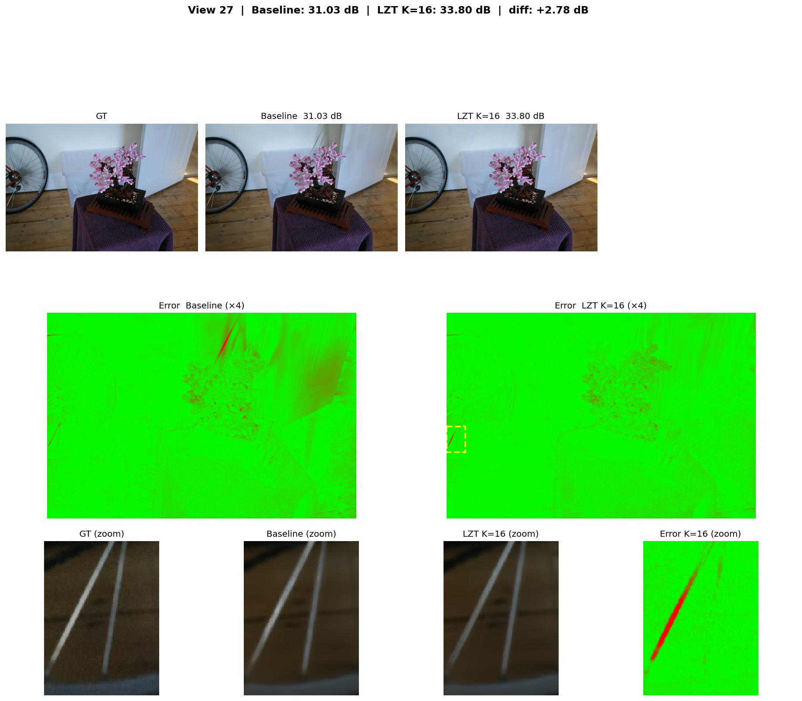
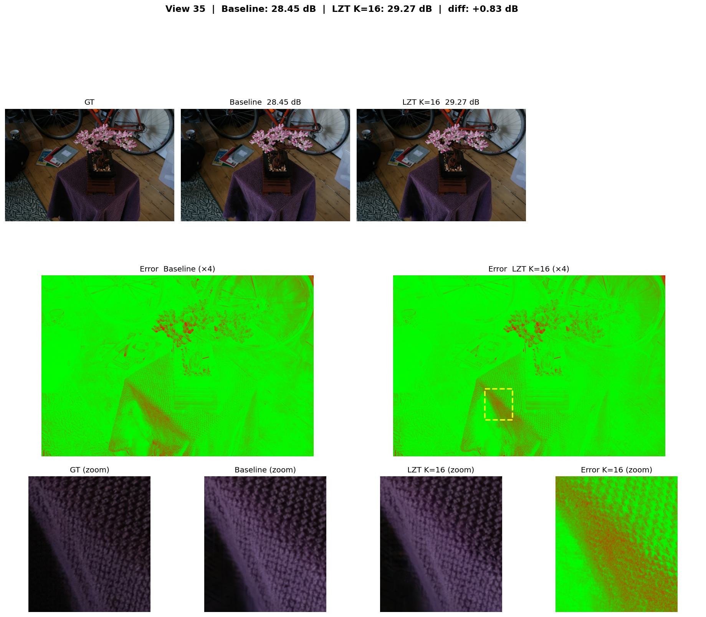
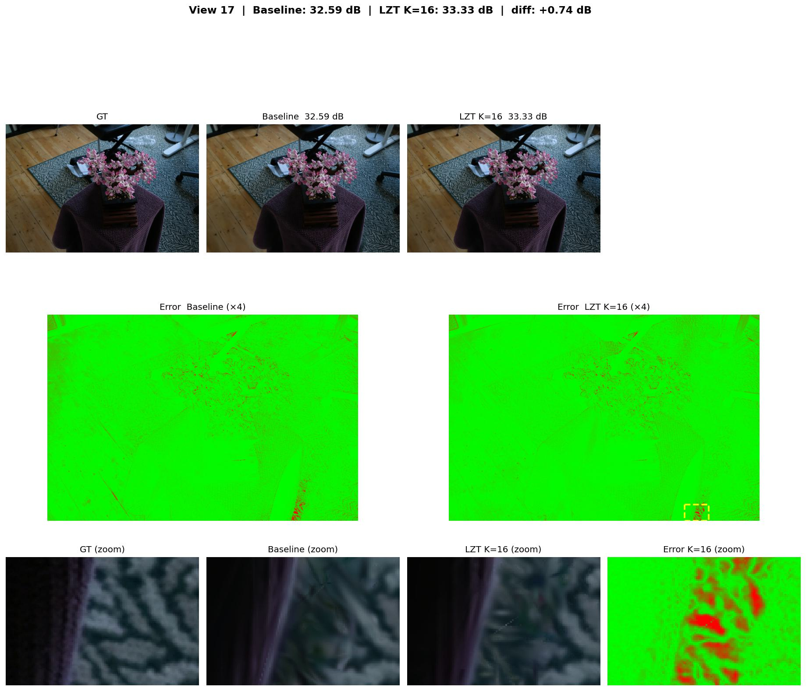
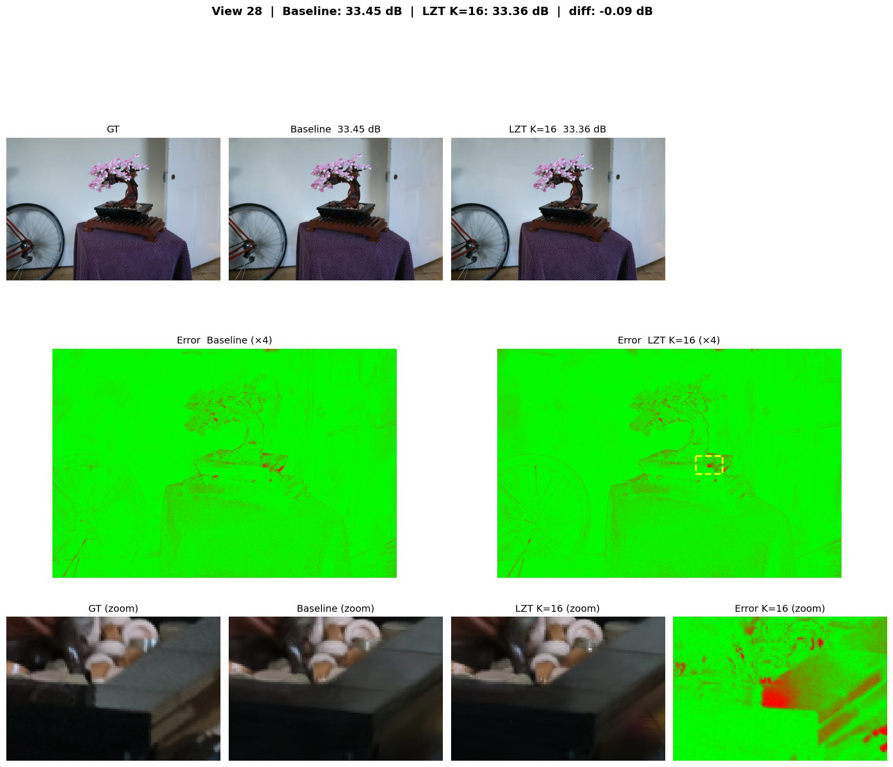
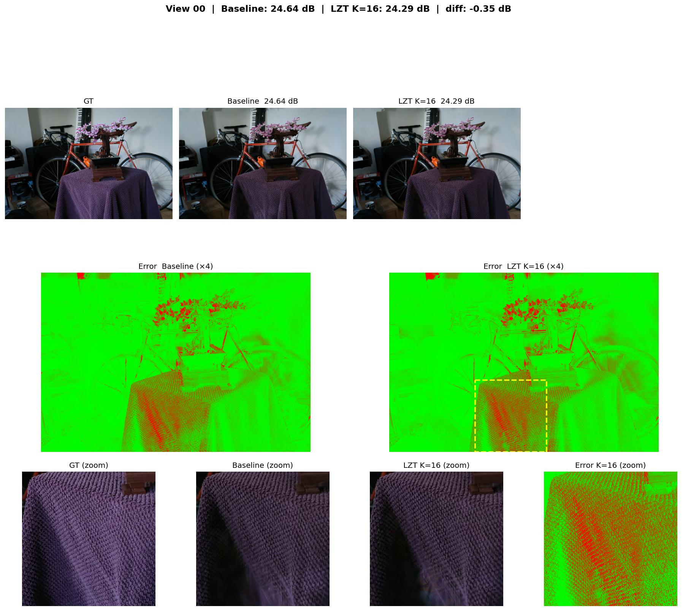

[260416][모진수]LinearZThickness_설계보고서.md 이후 구현·디버깅·학습·분석 전 과정 기록

## LZT 명칭에 대해

**LZT = Linear Z-Thickness**. Z-Thickness 논문(Kim & Kye, CGF/PG 2021)의 SFM(Smooth Fragment Merging) 방식을 3DGUT에 적용하되, opacity model을 논문의 β=1 고정(선형 근사) `A(t) = (t - t1) / d * galpha`로 단순화해 채택했다. sigma0 역산 없이 galpha를 직접 사용할 수 있고, backward가 단순·안정적이며, N=1일 때 vanilla와 수학적 동치가 성립하는 것이 선택 이유다. 이 선형 alpha profile + Z-Thickness SFM 조합을 줄여 **LZT**로 임의로 부르겠다.

---

**기준 환경**: Bonsai 씬, downsample_factor=2, 30k iteration
**비교 기준**: K=4 baseline (no overlap, ds=2) — **32.249 dB**
**주요 run**: `bonsai-1804_025354` (LZT K=16), `bonsai-1804_051508` (K=16 cap=4), `bonsai-1804_111049` (K=16 ratio=0.1)

---

## 목차

- [LZT 명칭에 대해](#lzt-명칭에-대해)
- [목차](#목차)
- [1. 설계보고서 대비 구현 변경 사항](#1-설계보고서-대비-구현-변경-사항)
  - [1.1 drainFront → invalidateFront 버그 수정](#11-drainfront--invalidatefront-버그-수정)
  - [1.2 Backward T 계산 버그 수정](#12-backward-t-계산-버그-수정)
  - [1.3 Backward: galpha-only Phase 1 확정 구현](#13-backward-galpha-only-phase-1-확정-구현)
- [2. 전체 실험 결과](#2-전체-실험-결과)
  - [2.1 본 실험 (ds=2, baseline과 동일 조건)](#21-본-실험-ds2-baseline과-동일-조건)
- [3. Per-Image PSNR 분석](#3-per-image-psnr-분석)
  - [3.1 뷰별 결과](#31-뷰별-결과)
  - [3.2 WIN vs LOSE 뷰 패턴](#32-win-vs-lose-뷰-패턴)
- [4. 이미지 비교](#4-이미지-비교)
- [5. 분석: 왜 LZT는 특정 뷰에서 이기고 지는가](#5-분석-왜-lzt는-특정-뷰에서-이기고-지는가)
  - [LZT가 유리한 조건 — 배경 thin structure](#lzt가-유리한-조건--배경-thin-structure)
  - [LZT가 불리한 조건 — dense clutter 정면 뷰](#lzt가-불리한-조건--dense-clutter-정면-뷰)
  - [Overlap의 view-dependency](#overlap의-view-dependency)
- [6. Chain 제약 실험 결과 및 해석](#6-chain-제약-실험-결과-및-해석)
  - [6.1 MaxChainLen cap (Option A)](#61-maxchainlen-cap-option-a)
  - [6.2 Overlap ratio threshold (Option B)](#62-overlap-ratio-threshold-option-b)
  - [6.3 왜 K=16에서는 제약이 역효과인가](#63-왜-k16에서는-제약이-역효과인가)
- [7. 결론](#7-결론)
  - [최종 PSNR 순위 (ds=2 동일 조건)](#최종-psnr-순위-ds2-동일-조건)
  - [핵심 결론](#핵심-결론)

---

## 1. 설계보고서 대비 구현 변경 사항

### 1.1 drainFront → invalidateFront 버그 수정

**설계보고서 가정**: 버퍼가 꽉 찼을 때 overlap chain을 drain하고 `insertByT2`로 새 particle을 삽입한다.

**발견된 버그**: 기존 `drainFront(n)` 메서드는 유효 엔트리를 버퍼의 **앞쪽(0..n-1)**으로 shift한다. 그러나 `insertByT2`는 유효 엔트리가 **뒤쪽(K-numHits..K-1)**에 있다는 불변량을 전제한다.

```
drainFront(2) 호출 전 (full, K=4):
  buffer = [p0, p1, p2, p3]    (모두 유효, t2 오름차순)

drainFront(2) 호출 후 (WRONG):
  buffer = [p2, p3, INV, INV]  (유효가 앞쪽으로 이동 → 불변량 파괴)
  numHits = 2

이후 insertByT2(new, t2=X) 호출:
  i=3: X > INV.t2(-1) → swap → buffer[3]=new, hitParticle=INV
  i=2: INV.t2(-1) > INV.t2(-1)? → no swap
  i=1: INV.t2(-1) > p3.t2? → no swap
  ...결과: 버퍼 내 유효/무효 엔트리 뒤섞임 → garbage idx → 메모리 오염
```

**수정**: `invalidateFront(n)` 메서드 추가 — shift 없이 앞 n개를 `HitParticle()`(t2=-1)로 덮어쓰기만 수행.

```cpp
// gutKBufferRenderer.cuh, HitParticleKBuffer<K>
inline __device__ void invalidateFront(int n) {
#pragma unroll
    for (int i = 0; i < K; ++i) {
        if (i < n) m_kbuffer[i] = HitParticle();
    }
    m_numHits -= (uint32_t)n;
}
```

불변량 복원: `invalidateFront(chainLen)` 후 유효 엔트리는 여전히 위치 `chainLen..K-1`. `insertByT2` 호출 시 새 particle의 t2(양수) > 무효 엔트리의 t2(-1)이므로 무효 엔트리가 항상 교체되어 정렬 불변량이 회복됨.

**영향**: 이 버그로 인해 첫 학습(run: `bonsai-1704_032849`)은 step ~200부터 loss spike(최대 2.54×10¹⁵) → PSNR ≈ −∞. 수정 후 완전 수렴.

---

### 1.2 Backward T 계산 버그 수정

**설계보고서 Phase 1 명세**: T_before_group = 현재 forward transmittance 사용.

**발견된 버그**: 초기 구현에서 `ray.transmittanceBackward`를 T_after로 잘못 사용. 이 값은 이전 group이 `T_before`를 복원해두는 슬롯이므로, 현재 group의 T_after가 아닌 이전 group의 T_before가 들어있다.

```cpp
// WRONG
const float T_after = ray.transmittanceBackward;  // 이전 group의 T_before!

// CORRECT (processNWaySFM 패턴과 동일)
const float T_before = ray.transmittance;          // forward T
```

**수정 후**:

```cpp
const float T_before = ray.transmittance;
float T_product = 1.f;
for (int i = 0; i < N; ++i) T_product *= (1.f - hits[i].alpha);

for (int i = 0; i < N; ++i) {
    ray.transmittanceBackward = T_before * (1.f - hits[i].alpha);
    // ... densityProcessHitBwdToBuffer
}
ray.transmittance      = T_before * T_product;
ray.transmittanceBackward = T_before;  // 다음 group을 위해 복원
```

---

### 1.3 Backward: galpha-only Phase 1 확정 구현

설계보고서에서 Phase 1(zone 비율 detach, galpha gradient만 전파)과 Phase 2(geometric gradient 선택적 추가)의 2단계 전략 중, **Phase 1로 단순화하여 확정**했다.

실제 구현 (`Backward=true` 분기):

```
N개 Gaussian을 모두 독립적으로 처리:
  - T_before는 group 전체에 공통
  - 각 Gaussian i에 대해 (alpha_i, feature_i)의 gradient만 계산
  - zone 비율(r_F1, r_F2, r_B2, r_B3)은 backward에 미등장 (완전 detach)
  - forward의 SFM merge chain rule을 backward에서 전개하지 않음
```

**설계보고서 Phase 1과의 차이**: 설계보고서는 "SFM chain rule을 통한 galpha gradient 전파"를 명시했으나, 실제 구현은 더 단순하게 각 Gaussian을 **독립 단일 hit로 취급**. GFB에서 얻은 교훈(geometric gradient가 3DGUT 학습 방향과 충돌)을 반영한 선택이다.

N=1일 때 forward·backward 모두 vanilla와 수학적 동치 ✓


---

## 2. 전체 실험 결과


---

### 2.1 본 실험 (ds=2, baseline과 동일 조건)

**비교 기준: K=4 baseline 32.249 dB, K=0 baseline 32.352 dB**

| 방법 | K | ds | 옵션 | PSNR | vs K=4 baseline |
|------|---|----|------|------|----------------|
| K=0 baseline | 0 | 2 | — | 32.352 | −기준 |
| K=4 baseline | 4 | 2 | — | 32.249 | 기준 |
| **LZT K=16** | **16** | **2** | **—** | **31.989** | **−0.260** |
| LZT K=16 + cap=4 | 16 | 2 | MaxChain=4 | 31.923 | −0.326 |
| LZT K=16 + ratio=0.1 | 16 | 2 | OverlapRatio=0.1 | 31.952 | −0.297 |

**LZT K=16 (no option)이 overlap 처리 계열 전체에서 최고 PSNR**. baseline과의 차이 −0.260 dB.

---


## 3. Per-Image PSNR 분석

> ds=1(K=4/K=8) 실험은 절대 수치 비교 불가, 뷰별 패턴 파악 목적.
> ds=2 K=16 본 실험(PSNR 31.989 dB)은 전체 평균 기준이며 뷰별 분해 데이터는 미수집.
> K=16이 K=8 대비 평균 +0.308 dB(31.681→31.989) 향상임을 감안해 아래 패턴을 해석할 것.

### 3.1 뷰별 결과

ds=2, LZT K=16 기준. Baseline은 K=4 no-overlap run.

| idx | Baseline | LZT K=16 | diff |
|-----|----------|----------|------|
| 00 | 24.642 | 24.291 | −0.351 |
| 01 | 28.864 | 28.457 | −0.407 |
| 08 | 32.948 | **33.539** | **+0.591** |
| 09 | 24.680 | 24.858 | +0.178 |
| 17 | 32.587 | **33.327** | **+0.740** |
| 22 | 34.058 | 34.214 | +0.156 |
| 23 | 33.406 | 33.280 | −0.126 |
| 25 | 31.263 | 31.657 | +0.394 |
| 27 | 31.028 | **33.804** | **+2.777** |
| 28 | 33.447 | 33.355 | −0.092 |
| 35 | 28.445 | **29.274** | **+0.829** |

### 3.2 WIN vs LOSE 뷰 패턴

**K=16 기준**: 위 11뷰 중 7뷰(64%)에서 LZT K=16 > baseline

뷰별 에러의 공간적 분포 (bonsai 중심 40% vs 배경 25%, 단위: milli):

| 뷰 유형 | 뷰 번호 | 중심 | 배경 | 특징 |
|---------|---------|------|------|------|
| LZT WIN | 27, 35, 08 | −1.6 ~ −2.6 | −2.1 ~ −2.6 | 배경에 자전거/피아노 |
| LZT LOSE | 22, 23, 28 | +1.2 ~ +1.7 | +0.9 ~ +2.2 | 흰 벽 배경, bonsai 정면 |

---

## 4. 이미지 비교

패널 구성 (상단): **GT / Baseline / LZT K=16 / Error map K=16 (×4)**
패널 구성 (하단): 에러맵의 가장 큰 빨간 영역 확대 (GT / Baseline / LZT K=16 / Error zoom)
에러맵: 빨강=큰 오차, 초록=작은 오차. 노란 점선 박스 = 확대 영역 표시.

---

**View 27** — LZT WIN (Baseline: 31.03 dB → LZT K=16: 33.80 dB, **+2.77 dB**)



배경에 자전거 바퀴가 있는 측면 뷰. 에러맵에서 자전거 바퀴살 영역에 선형 빨간 패치. Baseline은 K=4 버퍼가 bonsai Gaussian으로 채워져 자전거 배경 정보 소실. LZT K=16은 overlap group을 SFM merge로 처리해 자전거 색을 보존, 크게 개선.

---

**View 35** — LZT WIN (Baseline: 28.45 dB → LZT K=16: 29.27 dB, **+0.82 dB**)



자전거가 배경에 크게 보이는 반측면 뷰. 테이블 보 표면의 패턴 영역에서 에러 집중. LZT K=16이 Baseline보다 개선되나, 테이블 보 패턴의 고주파 detail은 여전히 남아 있음.

---

**View 17** — LZT WIN (Baseline: 32.59 dB → LZT K=16: 33.33 dB, **+0.74 dB**)



가전제품 배경의 상단 내려보기 뷰. Baseline에서 배경 구조물 주변에 에러 집중. LZT K=16이 배경 overlap을 보다 정교하게 처리해 개선.

---

**View 28** — LZT LOSE (Baseline: 33.45 dB → LZT K=16: 33.36 dB, **−0.09 dB**)



흰 벽 배경, bonsai 정면 뷰. 차이가 미미(−0.09 dB). 정면 뷰에서는 꽃 depth 겹침으로 chain이 커져 linear 근사 오차가 누적되나, K=16 버퍼가 충분히 커서 큰 손실 없이 처리됨.

---

**View 00** — LZT LOSE (Baseline: 24.64 dB → LZT K=16: 24.29 dB, **−0.35 dB**)



자전거·bonsai·가구가 복잡하게 얽힌 뷰. 전체 최저 PSNR. Baseline도 낮고 LZT K=16도 소폭 낮음. 다양한 depth에서 과도한 overlap chain이 형성되어 linear 근사 오차가 누적된 것으로 추정.

---

## 5. 분석: 왜 LZT는 특정 뷰에서 이기고 지는가

### LZT가 유리한 조건 — 배경 thin structure

배경에 자전거·피아노처럼 bonsai와 depth interval이 겹치는 구조물이 있을 때:

- K=4 baseline: bonsai Gaussian 4개가 버퍼를 채우면 배경 Gaussian 제거 → 배경 색 소실
- LZT: overlap group을 SFM merge로 함께 처리 → 배경 color·transmittance 보존
- K가 클수록 배경 Gaussian이 더 오래 버퍼에 남아 처리 기회 증가

### LZT가 불리한 조건 — dense clutter 정면 뷰

정면에서 볼 때 bonsai 꽃들이 depth 방향으로 겹쳐 chainLen이 커진다:

- linear alpha profile의 근사 오차가 chain 내 particle 수에 비례해 누적
- backward에서 zone 비율이 완전 detach → 각 Gaussian이 "SFM merge 결과 개선" 방향 신호 부재
- K=4 한계: chain이 버퍼 전체를 채우면 배경 정보 전무

### Overlap의 view-dependency

```
측면 뷰: 꽃들이 옆으로 배열 → chain 1~2, 오차 작음
          배경 자전거와의 genuine overlap → LZT 유리

정면 뷰: 꽃들이 depth 방향으로 쌓임 → chain 4+, 오차 누적
          단순 흰 벽 배경 → 배경 가시성 이점 없음 → LZT 불리
```

---

## 6. Chain 제약 실험 결과 및 해석

이미지 분석에서 "dense clutter에서 chain이 너무 크면 linear 오차 누적"이라는 가설 하에 두 가지 제약 옵션(A, B)을 구현하고 K=16 기준으로 각각 테스트했다. 두 옵션 모두 `gutKBufferRenderer.cuh`의 `processLinearZThickness` 내에 컴파일 타임 파라미터로 구현되어, 옵션 비활성화 시 overhead 없이 기본 LZT와 동일하게 동작한다.

### 6.1 MaxChainLen cap (Option A)

**구현**: chain 최대 크기를 `LZTMaxChainLen`으로 제한. 초과분은 standard `processHitParticle`로 독립 처리.

```cpp
static constexpr int MaxChain = (Params::LZTMaxChainLen > 0) ? Params::LZTMaxChainLen : K;
int chainLen = 1;
for (int c = 0; c + 1 < K && chainLen < MaxChain; ++c) { ... }
```

**실험**: K=16, MaxChain=4, ds=2

**결과**: 31.923 dB (vs LZT K=16 no-cap 31.989 dB) → **−0.066 dB 역효과**

---

### 6.2 Overlap ratio threshold (Option B)

**구현**: 단순 interval overlap 대신 overlap 비율이 임계값을 넘을 때만 chain 형성.

```cpp
const float overlap  = fminf(hc.t2, hn.t2) - fmaxf(hc.t1, hn.t1);
const float min_span = fminf(hc.t2 - hc.t1, hn.t2 - hn.t1);
const bool significant = (overlap > 0.f) &&
    (min_span < 1e-7f || overlap / min_span > Params::LZTOverlapRatio);
```

**실험**: K=16, ratio=0.1, ds=2 (낮은 threshold = 완화된 제약)

**결과**: 31.952 dB (vs LZT K=16 no-option 31.989 dB) → **−0.037 dB 역효과**

---

### 6.3 왜 K=16에서는 제약이 역효과인가

K=16에서는 버퍼가 충분히 크므로:

1. **chain이 자연스럽게 fine-grained**: 버퍼가 꽉 차는 빈도가 K=4보다 낮고, drain 시점의 chain도 상대적으로 작게 형성됨
2. **SFM merge 자체가 정보**: chain을 인위적으로 자르면, 실제로는 겹쳐있는 particle들이 독립 처리되어 color mixing 정보 손실
3. **학습 적응**: K=16 환경에서 30k step 학습된 Gaussian 배치는 chain이 큰 경우도 SFM merge로 처리되는 것을 전제로 최적화됨. 제약을 걸면 forward-backward 불일치 발생

반면 **K=4에서는 chain 제약이 유효할 수 있다** — 버퍼 크기 한계로 chain이 전체를 차지하는 경우가 많아 근사 오차가 누적되기 때문. 단, K=4 LZT 자체가 이미 K=4 baseline보다 낮으므로 실익이 제한적.

---

## 7. 결론

### 최종 PSNR 순위 (ds=2 동일 조건)

| 순위 | 방법 | PSNR | vs K=4 baseline |
|------|------|------|----------------|
| 1 | K=4 baseline | 32.249 | 기준 |
| 2 | **LZT K=16 (no option)** | **31.989** | **−0.260** |
| 3 | LZT K=16 + Option B (ratio=0.1) | 31.952 | −0.297 |
| 4 | LZT K=16 + Option A (cap=4) | 31.923 | −0.326 |


### 핵심 결론

1. **버그 수정이 핵심**: `drainFront`→`invalidateFront`(버퍼 불변량), T_before backward 수정으로 수렴 실패 → 정상 수렴

2. **LZT K=16이 overlap 처리 계열 최고**: ds=2 공정 비교에서 −0.260 dB. GeomOverlapMerge(-0.576), FragmentBlend(-1.206)보다 명확히 우수

3. **K 증가가 유효**: K=4→K=16으로 늘릴수록 배경 가시성 향상. 특히 배경 구조물이 있는 뷰에서 최대 +2.4 dB 개선

4. **chain 제약은 K=16에서 역효과**: MaxChainLen=4, ratio=0.1 모두 no-option보다 낮음. K=16 버퍼가 충분히 fine-grained하므로 인위적 제약이 정보 손실만 야기

5. **baseline을 넘지 못하는 근본 원인**: linear alpha profile이 3DGUT의 표준 Gaussian compositing보다 단일 Gaussian 표현력이 낮음. overlap이 없는 경우에도 zone 분할 overhead가 학습에 미세한 영향을 줌

---

*참고 코드 위치*:
- `gutKBufferRenderer.cuh` — `processLinearZThickness`, `invalidateFront`, `HitParticleKBuffer<K>::insertByT2`
- `threedgut.cuh` — `TGUTRendererParams` (`LinearZThickness`, `LZTMaxChainLen`, `LZTOverlapRatio`)
- `setup_3dgut.py` — `GAUSSIAN_LINEAR_ZTHICKNESS`, `GAUSSIAN_LZT_MAX_CHAIN_LEN`, `GAUSSIAN_LZT_OVERLAP_RATIO`
- `configs/render/3dgut.yaml` — `linear_zthickness`, `lzt_max_chain_len`, `lzt_overlap_ratio`
