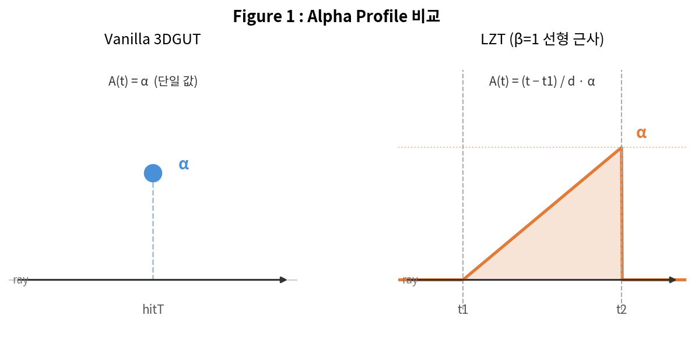
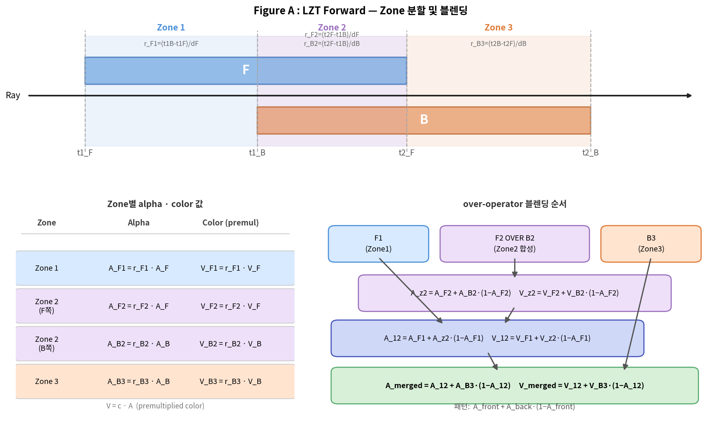
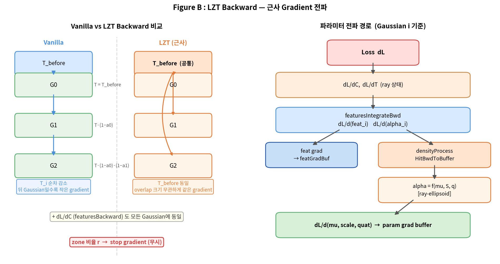

LZT(Linear Z-Thickness) Forward/Backward 설명

**기준 구현**: `gutKBufferRenderer.cuh` — `processLinearZThickness` (line 1228–1409)

---

## 1. Alpha Profile

Vanilla은 각 Gaussian을 hitT의 단일 opacity로 처리한다. LZT는 ray 교차 구간 `[t1, t2]`에서 opacity가 **선형으로 증가**한다고 가정한다 (Z-Thickness 논문 β=1).



```
A(t) = (t - t1) / d · α      (d = t2 - t1)
```

N=1일 때 (겹침 없음) → vanilla와 수학적으로 동치.

---

## 2. Forward

K-buffer를 **t2(exit depth) 기준**으로 정렬. Overlap하는 Gaussian 그룹을 SFM(Smooth Fragment Merging)으로 처리한다.

t2 정렬 불변량(`t2_B ≥ t2_F`)으로 케이스는 2개만 존재. Case A 기준:



**변수 설명**

- `F` — 이전 Gaussian들이 이미 합쳐진 누적 fragment. `(t1_F, t2_F, A_F, V_F)`
- `B` — 새로 drain된 Gaussian 하나. `(t1_B, t2_B, A_B, V_B)`
- `V = c · A` — premultiplied color

**Zone 비율** (overlap 길이를 각 fragment 길이로 나눈 값):

| 변수 | 수식 | 의미 |
|------|------|------|
| `r_F1` | `(t1_B - t1_F) / d_F` | F 중 겹치기 전 구간 비율 |
| `r_F2` | `(t2_F - t1_B) / d_F` | F 중 겹치는 구간 비율 |
| `r_B2` | `(t2_F - t1_B) / d_B` | B 중 겹치는 구간 비율 |
| `r_B3` | `(t2_B - t2_F) / d_B` | B 중 겹친 이후 구간 비율 |

`r_F1 + r_F2 = 1`, `r_B2 + r_B3 = 1`

**Over-operator** (패턴: `A_front + A_back · (1 - A_front)`):

```
A_z2     = A_F2 + A_B2 · (1 - A_F2)      Zone2: F_back OVER B_front
A_12     = A_F1 + A_z2 · (1 - A_F1)      Zone1 OVER Zone2
A_merged = A_12 + A_B3 · (1 - A_12)      최종 merged fragment
```

---

## 3. Backward



### 근사 설계

Forward에서 N개 Gaussian이 zone 비율로 합쳐지므로, 정확한 backward는 다음을 요구한다:

```
정확한 dL/dα_i ∝ T_before_i · r_i     (T는 순차 감소, r은 zone 비율)
정확한 dL/dc_i ∝ T_before_i · α_i · r_i
```

그러나 GFB 실험에서 zone 비율의 t1/t2 geometric gradient가 3DGUT 학습 방향과 충돌해 PSNR 하락을 확인했다. 따라서 **zone 비율을 상수로 취급(stop gradient)** 하는 근사 backward를 채택했다.

### 구현

```cpp
const float T_before = ray.transmittance;
const TFeaturesVec savedFeatBwd = ray.featuresBackward;  // dL/dC

for (int i = 0; i < N; ++i) {
    ray.featuresBackward = savedFeatBwd;                          // 복원
    ray.transmittanceBackward = T_before * (1.f - hits[i].alpha); // T_before 전달
    // 내부에서: T_before = transmittanceBackward / (1 - α_i) = T_before

    featuresIntegrateBwd(...);          // dL/d(feat_i), dL/d(α_i)
    densityProcessHitBwdToBuffer(...);  // dL/d(μ, scale, quat)
}
ray.transmittance = T_before * T_product;
```

### Vanilla과의 차이

| | Vanilla | LZT backward |
|---|---|---|
| **T 스케일** | `T_i = T · ∏_{j<i}(1-α_j)` (순차 감소) | `T_before` 공통 |
| **색깔 gradient** `dL/dC` | 순차 누적 | `savedFeatBwd` 공통 |
| **zone 비율** | 해당 없음 | 무시 (stop gradient) |
| **overlap 크기 반영** | — | **반영 안 됨** |

overlap 구간이 아무리 짧아도 그룹으로 묶이면 동일한 `T_before`와 `dL/dC`를 받는다. 각 Gaussian은 마치 **독립적으로 `T_before · α_i · c_i`만큼 기여했다고 가정**하고 gradient가 계산된다.

---

## 4. Benchmark (Vanilla k=0 vs LZT k=16)

결과 디렉터리: `results/all13/` (Vanilla), `results/lzt_k16/` (LZT)

| 씬 | Vanilla k=0 | LZT k=16 | 차이 |
|----|------------|----------|------|
| bonsai | 32.366 | 31.958 | -0.408 |
| counter | 28.994 | 28.645 | -0.349 |
| kitchen | 31.189 | 30.822 | -0.367 |
| drjohnson | 29.047 | 29.299 | +0.252 |
| playroom | 30.084 | 30.493 | +0.409 |
| room | 31.404 | 30.644 | -0.760 |
| flowers | 21.421 | 21.408 | -0.013 |
| garden | 27.046 | 26.848 | -0.198 |
| train | 21.869 | 21.632 | -0.237 |
| truck | 25.281 | 24.696 | -0.585 |
| bicycle |  — (eval 오류)| —  | — |
| stump | — (eval 오류)|  — | — |
| treehill | — (eval 오류) | — | — |

LZT가 개선된 씬: **drjohnson (+0.252)**, **playroom (+0.409)** → Deep Blending 계열  
LZT가 하락한 씬: room (-0.760), truck (-0.585), bonsai (-0.408)

---

*그림 생성 코드*: `report_image_모진수/260421/gen_lzt_diagrams.py`
