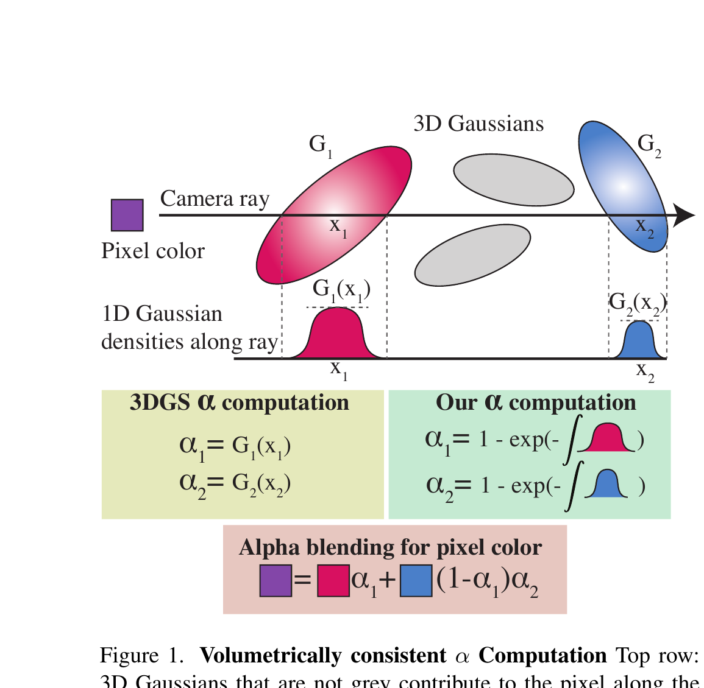
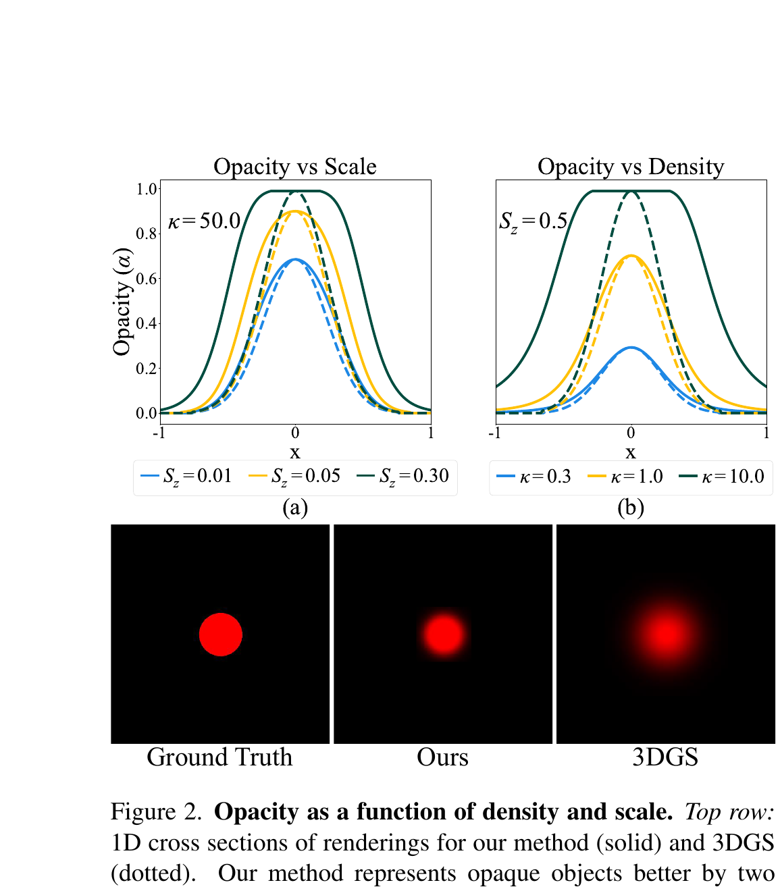
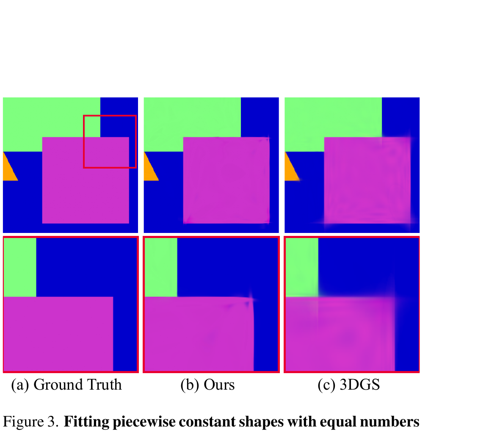
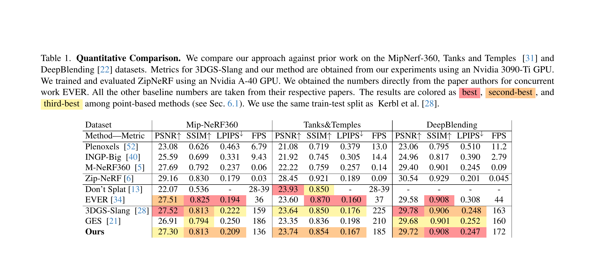
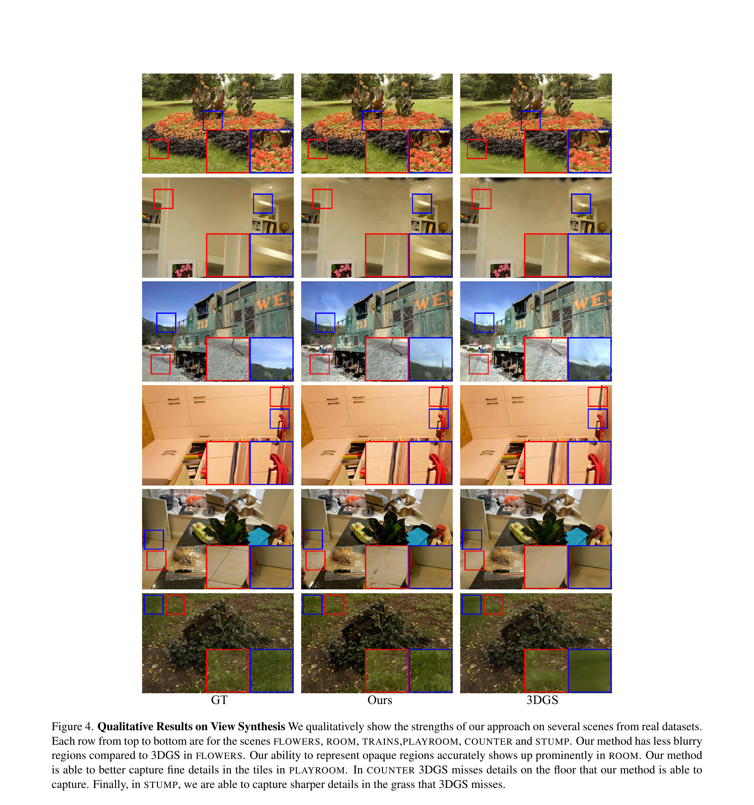
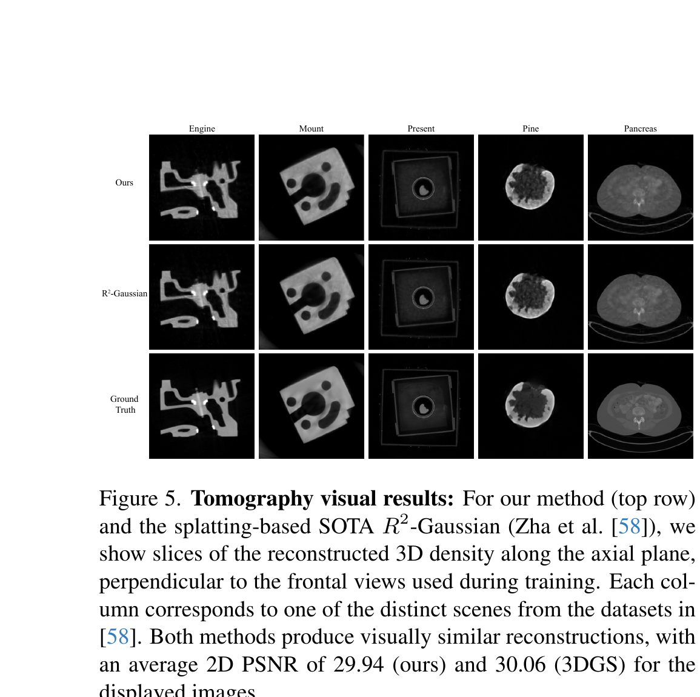
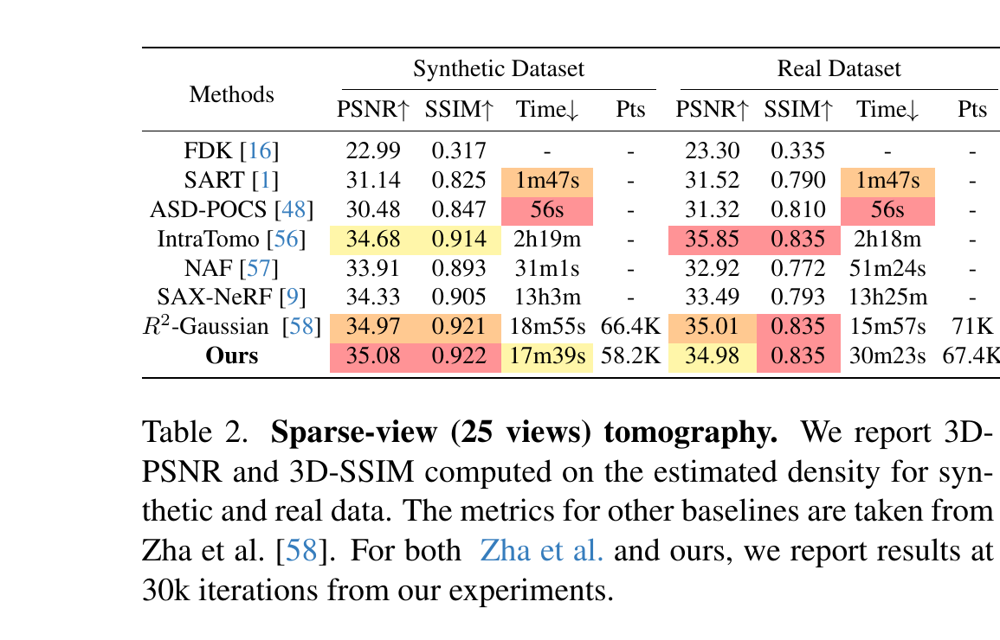
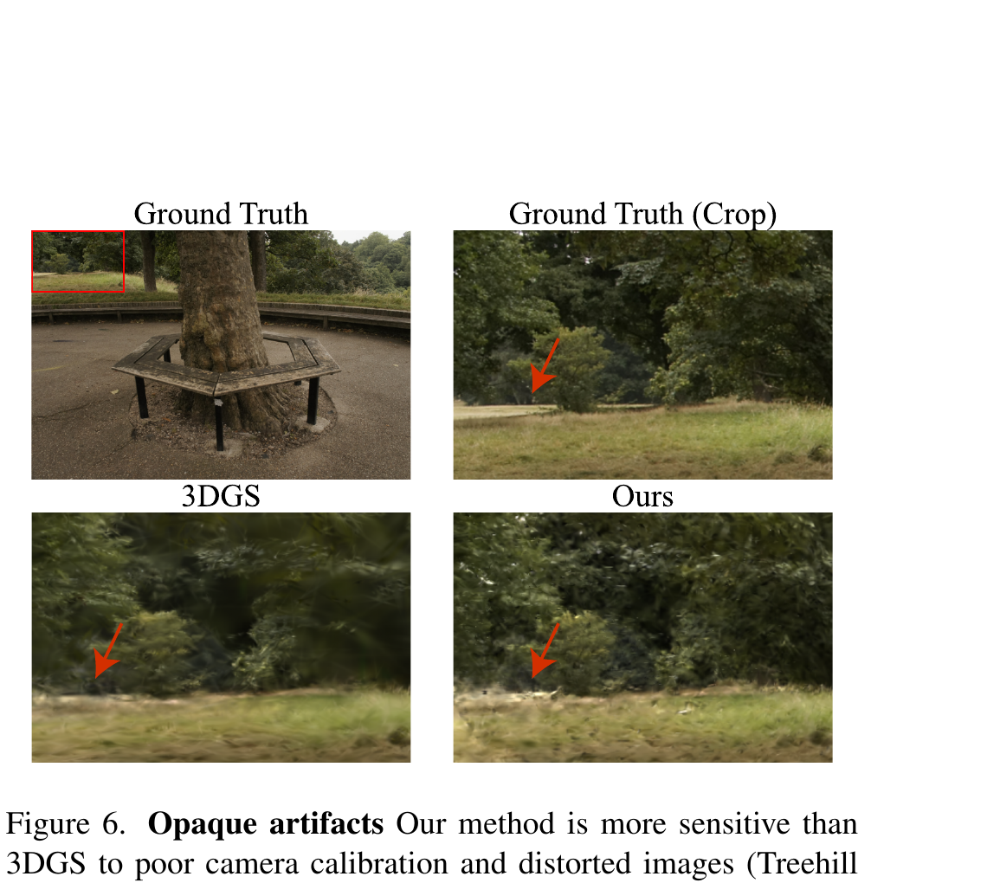

# [260503][모진수] Vol3DGS 논문 조사 보고서

---

## 1. 개요

| 항목 | 내용 |
|------|------|
| 제목 | Volumetrically Consistent 3D Gaussian Rasterization |
| 저자 | Chinmay Talegaonkar, Yash Belhe, Ravi Ramamoorthi, Nicholas Antipa |
| 소속 | UC San Diego |
| 발표 | **CVPR 2025 Highlight** |
| arXiv | 2412.03378 |
| 코드 | github.com/chinmay0301ucsd/Vol3DGS |

> **[Abstract 직접 인용]**
> *"We show that the core approximations in splatting are unnecessary, even within a rasterizer; we instead volumetrically integrate 3D Gaussians directly to compute the transmittance across them analytically. We use this analytic transmittance to derive more physically-accurate alpha values than 3DGS, which can directly be used within their framework. The result is a method that more closely follows the volume rendering equation (similar to ray-tracing) while enjoying the speed benefits of rasterization."*
> — Talegaonkar et al., CVPR 2025

---

## 2. 배경: 기존 3DGS의 문제

### 2.1 핵심 개념 — Fig. 1



**[논문 Fig. 1 캡션]** *"3DGS's splatting approximates the volume rendering equation and sets α_i = G_i(x_i), that is the maximum density of the Gaussian along the ray. Our approach instead performs volumetrically consistent α computation by accumulating the density along the ray α_i = 1 − exp(−∫G_i(x)dx) in accordance with the volume rendering equation."*

3DGS는 ray가 통과하는 Gaussian의 **최댓값** 하나만 alpha로 사용한다. Vol3DGS는 ray 방향으로 밀도를 **적분(면적)**하여 alpha를 계산한다 — 두께가 두꺼울수록 더 불투명해지는 물리적으로 올바른 동작이다.

### 2.2 Vanilla 3DGS의 alpha 계산 방식

기존 3DGS는 3D Gaussian을 카메라 평면에 **2D Gaussian으로 투영(splatting)**하고 픽셀의 2D Gaussian 값을 alpha로 사용한다:

$$\alpha_i = o_i \cdot \hat{G}_i(p)$$

### 2.3 핵심 문제: z-scale 무시

3D Gaussian을 2D로 투영할 때 affine Jacobian 근사를 사용하는데, 이 과정에서 **ray 방향(z) 성분이 사라진다**:

$$\Sigma' = J W \Sigma W^\top J^\top$$

> **[논문 직접 인용]** *"This is physically inaccurate; larger z-scales should increase a Gaussian's contribution, making it more opaque. Our method captures this effect."*

### 2.4 3DGS의 3가지 근본적 근사

논문 Section 3.2에서 명시:

| # | 근사 | 영향 |
|---|------|------|
| 1 | **지수함수 선형화** ($e^{-x} \approx 1-x$) | 두꺼운 매질에서 transmittance 부정확 |
| 2 | **자기 차폐(self-occlusion) 무시** | opaque 표면 표현 한계 |
| 3 | **공분산 선형화** (Jacobian 근사) | z-scale 완전 소실 |

> *"Each of these make renderings less physically-based and hurt view synthesis quality."*

---

## 3. Vol3DGS 핵심 아이디어

**"3D Gaussian 자체를 volumetric medium으로 취급하고, ray-Gaussian 적분을 closed-form으로 계산하여 alpha를 geometry에서 유도한다."**

### 3.1 Ray를 따른 1D Gaussian 투영

Ray $\mathbf{r}(t) = \mathbf{o} + t\mathbf{d}$ 가 3D Gaussian을 통과할 때, $t$에 대한 1D Gaussian으로 분해된다 (논문 Eq. 15):

$$g_j(t) = G_j(\gamma_j \mathbf{d}) \cdot \exp\!\left(-\frac{(t - \gamma_j)^2}{2\beta_j^2}\right)$$

두 파라미터의 물리적 의미 (논문 Eq. 16):

$$\gamma_j = \frac{(\boldsymbol{\mu}_j - \mathbf{o})^\top \Sigma_j^{-1} \mathbf{d}}{\mathbf{d}^\top \Sigma_j^{-1} \mathbf{d}}, \qquad \beta_j = \frac{1}{\sqrt{\mathbf{d}^\top \Sigma_j^{-1} \mathbf{d}}}$$

| 파라미터 | 의미 |
|----------|------|
| $\gamma_j$ | ray가 Gaussian 중심에 가장 가까워지는 $t$ 위치 (피크 깊이) |
| $\beta_j$ | **ray 방향으로의 Gaussian 폭** — z-scale 그 자체 |
| $G_j(\gamma_j \mathbf{d})$ | 가장 가까운 점에서의 3D Gaussian 값 (2D 단면) |

### 3.2 핵심 수식 — per-Gaussian Transmittance

논문의 핵심 결과 (Eq. 19):

$$\boxed{\bar{T}_j = \exp\!\left(-\kappa_j \cdot G_j(\gamma_j \mathbf{d}) \cdot \sqrt{2\pi} \cdot \beta_j\right)}$$

$$\alpha_j = 1 - \bar{T}_j$$

**3DGS vs Vol3DGS 비교:**

| | 3DGS | Vol3DGS |
|--|------|---------|
| alpha | $o_i \cdot \hat{G}_i^{2D}(p)$ — 2D 투영 최댓값 | $1 - \exp(-\kappa_j G_j(\gamma_j\mathbf{d})\sqrt{2\pi}\beta_j)$ — ray 적분 |
| z-scale 반영 | **없음** | $\beta_j$로 **완전 반영** |
| geometry 독립성 | opacity = free parameter | opacity가 scale+rotation에서 유도 |

### 3.3 kappa($\kappa$) 재파라미터화

논문 Eq. 20:

$$\kappa_j = -\log(1 - 0.99\,\theta_j) \cdot \frac{1}{3}\left(\frac{1}{s_x} + \frac{1}{s_y} + \frac{1}{s_z}\right)$$

> *"The reparameterization promotes high density for small Gaussians and discourages it for larger ones, which we have found to benefit view synthesis quality."*

---

## 4. 핵심 효과: Opaque 표면 표현

### Fig. 2 — Opacity vs Scale/Density



**[논문 Fig. 2 캡션]** *"Top row: 1D cross sections of renderings for our method (solid) and 3DGS (dotted). Our method represents opaque objects better by two mechanisms: 1) increasing the scale along the camera ray (a); 2) increasing the volume density (b); both increase the flat region where α = 1. Since 3DGS splats 3D Gaussians onto the image plane as 2D Gaussians, irrespective of the scale (a) or the opacity (b), the cross-sections are all Gaussian with α = 1 possible only at the center.*
>
> *Bottom row: We optimize the parameters of a single 3D Gaussian to fit a circle using 3DGS and our method. As we saw in the top row (a) and (b), regardless of scale or opacity, 3DGS can only render a 2D Gaussian in image-space, resulting in a blurry fit of the opaque object. On the other hand, our method adjusts density and scale to produce a more opaque rendering."*

**그래프 해석:**
- **(a) Opacity vs Scale** (κ=50 고정): Vol3DGS(solid)는 S_z가 커질수록 flat-top 영역이 넓어짐. 3DGS(dashed)는 scale과 무관하게 동일한 bell-curve.
- **(b) Opacity vs Density** (S_z=0.5 고정): Vol3DGS는 κ가 높을수록 α→1 구간이 넓어짐. 3DGS는 중심점에서만 α=1 도달 가능.
- **하단 원 피팅**: Vol3DGS(Ours)는 선명한 원, 3DGS는 번지는 bell-curve 형태.

### Fig. 3 — Piecewise Constant 형태 피팅



**[논문 Fig. 3 캡션]** *"Our method, by increasing the volume density κ can make rendered 3D Gaussians close to opaque (b), which is a closer match to the ground truth (a), with LPIPS 0.005 (lower is better). 3DGS splats 3D Gaussians onto the screen as 2D Gaussians, which are only fully opaque at their center; this leads to artifacts especially near edges (see inset in second row) and much worse LPIPS 0.027."*

동일한 수의 Gaussian으로 직사각형 색 패턴을 피팅한 결과. Vol3DGS는 경계가 선명하고, 3DGS는 edge에서 blurring과 bleeding artifact가 발생한다. **LPIPS 기준 5.4배 향상 (0.005 vs 0.027).**

---

## 5. 렌더링 파이프라인 비교

```
Vanilla 3DGS:
  3D Gaussian (μ, Σ, opacity, color)
       ↓ EWA Splatting — affine Jacobian (z 성분 소실)
  2D Gaussian (μ', Σ')
       ↓ 픽셀 좌표 대입
  α_i = o_i · Ĝᵢ²ᴰ(p)        ← z-scale 무시
       ↓ Alpha compositing
  C = Σᵢ cᵢ αᵢ Π_{j<i}(1-αⱼ)

Vol3DGS:
  3D Gaussian (μ, Σ, κ, color)
       ↓ Ray 방향으로 1D 투영 (NO splatting)
  βⱼ = 1/√(dᵀ Σⱼ⁻¹ d)        ← z-scale 완전 반영
  τⱼ = κⱼ · Gⱼ(γⱼd) · √(2π) · βⱼ
  α_j = 1 - exp(-τⱼ)          ← geometry에서 유도
       ↓ Alpha compositing (동일 구조)
  C = Σᵢ cᵢ αᵢ Π_{j<i}(1-αⱼ)
```

> *"In the rasterizer, we simply swap out 3DGS's α computation with ours."* (Section 5)

---

## 6. 3DGUT와의 관계

| Vol3DGS 수식 | 3DGUT (gutKBufferRenderer.cuh) |
|---------|-------------------------------|
| $\beta_j = 1/\sqrt{\mathbf{d}^\top \Sigma^{-1} \mathbf{d}}$ | `1.0 / grduLen` |
| $G_j(\gamma_j \mathbf{d})$ | `exp(-(1-disc)/2)` = sigma_peak |
| $\tau = \kappa \cdot G_j \cdot \sqrt{2\pi} \cdot \beta_j$ | `tau = sigma_peak * SQRT_2PI * erf_tot / grduLen` |

| 항목 | Vol3DGS | 3DGUT |
|------|---------|-------|
| 렌더러 | Single pass rasterizer | k-buffer 기반 정렬 렌더러 |
| Gaussian 겹침 | 처리 없음 | k-buffer로 깊이 정렬 후 처리 |
| 카메라 모델 | Pinhole | Unscented Transform (비핀홀 지원) |

**우리 GUT-Medium 구현은 Vol3DGS와 동일한 수학적 구조를 독립적으로 도출하여 3DGUT k-buffer 프레임워크에 적용한 것이다.**

---

## 7. 실험 결과

### 7.1 Novel View Synthesis 정량 비교 — Table 1



**[논문 Table 1]** MipNeRF-360, Tanks&Temples, DeepBlending 데이터셋 비교. 결과는 **best**, **second-best**, third-best 순으로 색상 표기.

주요 관찰:
- MipNeRF-360 PSNR: Vol3DGS 27.30 vs 3DGS-Slang 27.52 (−0.22 dB, L2 loss 불일치)
- **SSIM/LPIPS는 전 데이터셋에서 개선** — 지각적 품질 향상
- Tanks&Temples: PSNR 23.74 vs 23.64 (+0.10 dB), LPIPS 0.167 vs 0.176 (개선)
- 속도: 136 FPS vs 159 FPS — 약 15% 감소, 여전히 실시간

> *"Our method consistently matches or outperforms rasterization-based methods such as 3DGS and GES on SSIM and LPIPS."* (Section 6.1)

### 7.2 정성적 비교 — Fig. 4



**[논문 Fig. 4 캡션]** *"Each row from top to bottom are for the scenes FLOWERS, ROOM, TRAINS, PLAYROOM, COUNTER and STUMP. Our method has less blurry regions compared to 3DGS in FLOWERS. Our ability to represent opaque regions accurately shows up prominently in ROOM. Our method is able to better capture fine details in the tiles in PLAYROOM. In COUNTER 3DGS misses details on the floor that our method is able to capture. Finally, in STUMP, we are able to capture sharper details in the grass that 3DGS misses."*

GT | Ours | 3DGS 순으로 비교. 각 씬의 inset(빨간/파란 박스)에서 Vol3DGS의 세부 디테일 우월성이 확인된다.

### 7.3 Sparse-View Tomography — Fig. 5 + Table 2



**[논문 Fig. 5 캡션]** *"For our method (top row) and the splatting-based SOTA R²-Gaussian (Zha et al. [58]), we show slices of the reconstructed 3D density along the axial plane, perpendicular to the frontal views used during training."*



**[논문 Table 2]** 25뷰 희소 촬영 기반 CT 재구성 비교. Vol3DGS가 SOTA인 R²-Gaussian보다 **PSNR 35.08 vs 34.97, Gaussian 수 58.2K vs 66.4K**로 더 높은 품질을 더 적은 점으로 달성.

> *"Our method works out of the box for 3DGS-based tomography pipelines, where we match or exceed the state-of-the-art in performance, with fewer points."*

---

## 8. 한계 및 실패 케이스 — Fig. 6



**[논문 Fig. 6 캡션]** *"Our method is more sensitive than 3DGS to poor camera calibration and distorted images (Treehill from MipNerf-360). We produce opaque artifacts whereas 3DGS prefers a blurry solution with lower error (see red arrows)."*

카메라 캘리브레이션 오차가 있는 Treehill 씬에서 Vol3DGS는 hard opaque artifact가 발생한다. 3DGS는 blurry하게 degradation되어 오히려 PSNR 손실이 적다. Volumetric consistency의 역설적 단점.

**논문(Section 7)에서 명시된 4가지 한계:**

| # | 한계 | 설명 |
|---|------|------|
| 1 | **카메라 캘리브레이션 민감성** | 포즈 오차 시 hard opaque artifact 발생 |
| 2 | **Tile sorting artifact 유지** | per-tile 정렬 사용 → popping artifact 여전히 존재 |
| 3 | **PSNR 개선 없음 (MipNeRF-360)** | L2 loss와 새로운 표현 방식의 불일치 |
| 4 | **Overlap 처리 동일** | Gaussian 겹침 시 독립 transmittance 가정 유지 |

> *"Since our method, like 3DGS, is rasterization-based, it inherits some of its issues. Per-tile (instead of per-pixel) primitive sorting and no overlap handling introduces popping artifacts."* (Section 7)

---

## 9. 요약 및 우리 연구와의 연관성

| 항목 | Vol3DGS | 우리 GUT-Medium |
|------|---------|----------------|
| 기반 | 3DGS rasterizer (SLANG.D) | 3DGUT k-buffer renderer |
| alpha 유도 | erf 적분 (ray-Gaussian) | erf 적분 (동일 수식) |
| opacity 파라미터 | kappa (scale 정규화됨) | geometry-only 탐색 중 |
| overlap 처리 | **없음** (single pass) | k-buffer 정렬 후 처리 |
| 카메라 모델 | Pinhole | Unscented Transform (비핀홀 지원) |
| zone 처리 | 없음 | ZPGC, LZT 등 탐색 중 |
| 발표 | **CVPR 2025 Highlight** | 진행 중 |

> **[논문 결론 직접 인용]** *"We introduce a more physically-accurate version of 3DGS by computing alpha values via analytical 3D Gaussian integration instead of splatting. Our approach integrates the strengths of physically-based ray tracing with the efficiency of rasterization. It enables higher quality reconstruction than 3DGS (as measured by SSIM and LPIPS)."* (Section 9)

**우리 작업의 차별점:**
1. **3DGUT Unscented Transform**: 비핀홀 카메라(어안렌즈 등) 지원 — Vol3DGS는 pinhole 전용
2. **k-buffer 기반 정확한 overlap 처리**: Vol3DGS가 포기한 overlap 문제를 k-buffer로 접근
3. **Zone-based 진정한 medium 렌더링**: ZPGC, LZT 등 확장된 compositing 탐색
4. **독립적 도출**: Vol3DGS와 동일한 수학 구조를 독립적으로 발견 → 유효성 상호 검증

---

*보고서 작성: 모진수 / 2026-05-03*
*참고: Talegaonkar et al., "Volumetrically Consistent 3D Gaussian Rasterization," CVPR 2025. arXiv:2412.03378*
