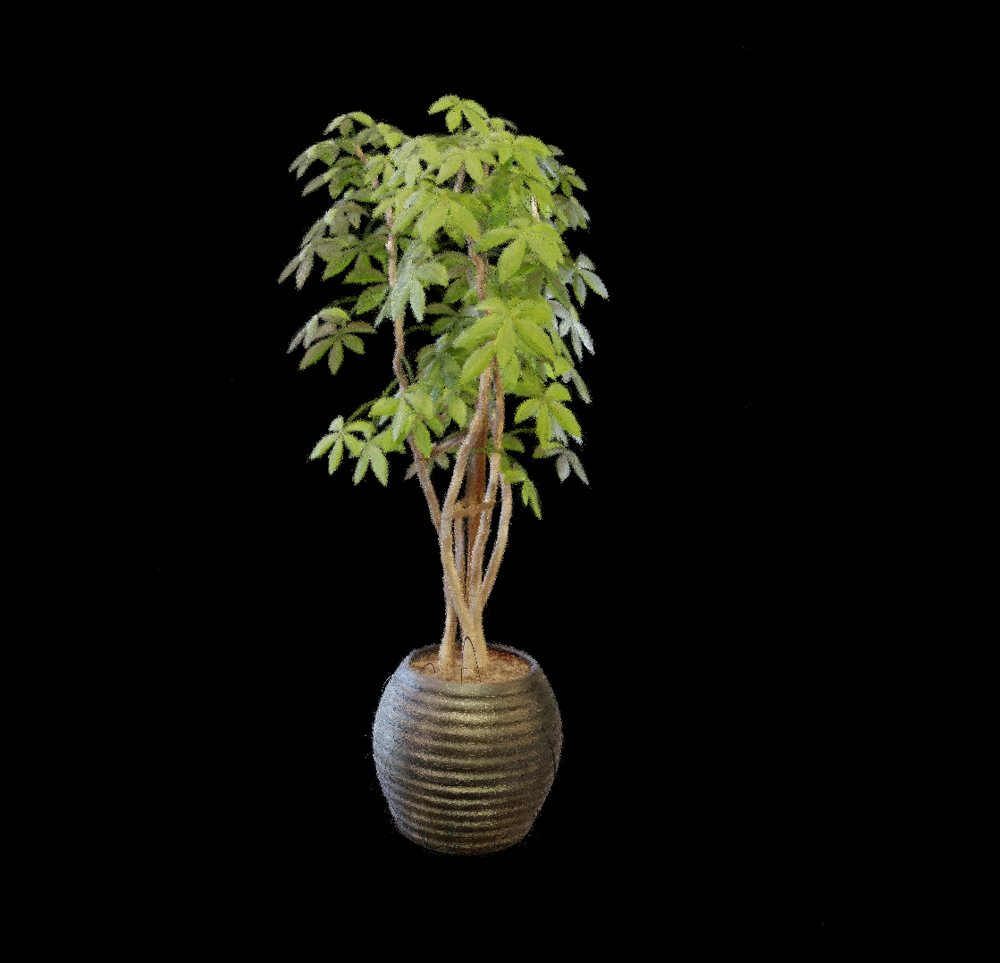
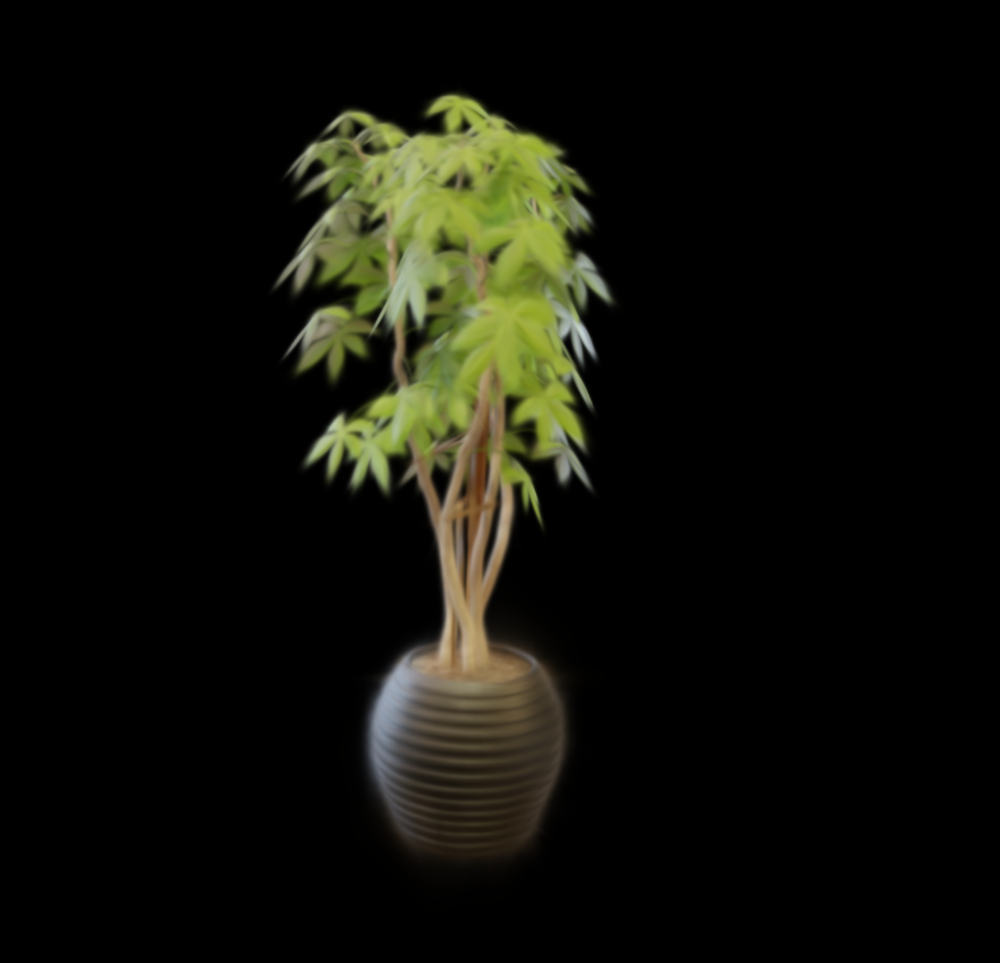
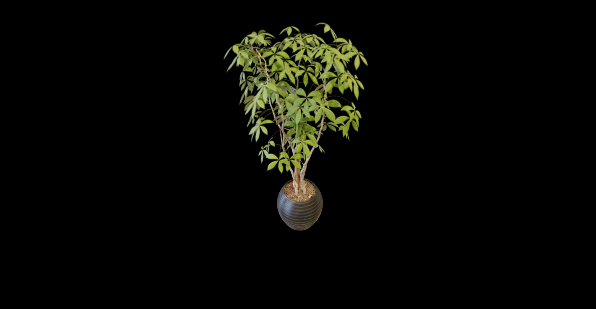
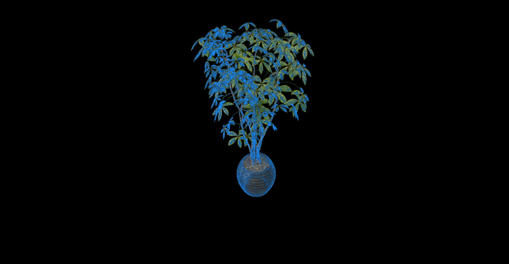
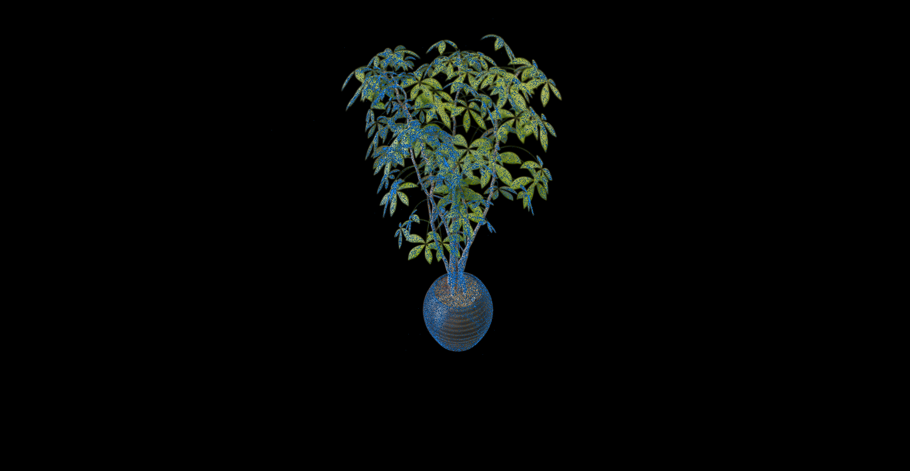
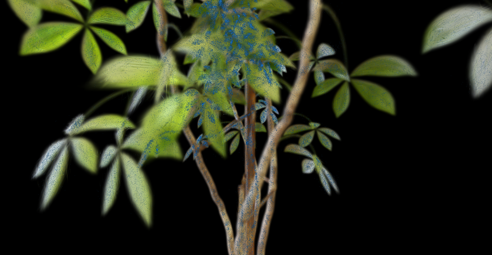

# Medium V3 결과 보고서


## 1. 구현 — 바닐라 3DGUT 대비 변경점

### 1.1 Forward

**바닐라 3DGUT alpha 계산** (`gaussianParticles.slang`):

```
d_canonical  = 레이에서 Gaussian 중심까지 canonical 공간 최소 거리
maxResponse  = exp(−0.5 × d_canonical²)    
alpha        = min(MaxParticleAlpha, maxResponse × density)
```

Gaussian의 position/scale/rotation은 canonical transform을 통해 `d_canonical`에 반영되며, `density`는 별도 학습 파라미터. alpha가 Gaussian의 2D 투영 peak response에 직접 결합됨.

**Medium V3 alpha 계산** (`gutKBufferRenderer.cuh`):

```
a_i          = exp(a_raw)                   ← 새로운 per-Gaussian 흡광 파라미터
rho_geom     = exp(−(1 − disc) / 2)        ← 레이의 최근접점 Gaussian 밀도
v            = sqrt(disc / 2)
I_geo_flat   = rho_geom × √(2π) × erf(v)  ← 레이 방향 무관 path integral
tau          = a_i × I_geo_flat
alpha        = 1 − exp(−min(tau, 20))
```

**바닐라와 Medium V3의 구조적 차이:**

두 방식의 가장 큰 차이는 **alpha를 결정짓는 파라미터의 구조와 활성화 범위**다.

바닐라에서 alpha는 **geometry와 density의 곱**으로 결정된다: `alpha = maxResponse × sigmoid(density_raw)`. 


`maxResponse = exp(−0.5 × d_canonical²)`는 position/scale/rotation이 결정하는 per-ray 기하 함수이고, 


`sigmoid(density_raw)`는 per-Gaussian 스칼라로 (0, 1) 범위에서 peak opacity 크기를 제어한다.

두 파라미터의 **역할은 수식에서 분리된다**: density는 peak opacity의 크기(0~1)를 결정하고, geometry(maxResponse)는 그 opacity가 공간적으로 어떻게 퍼지는지(falloff 형태)를 결정한다. geometry가 어떤 형태이든 density는 (0, 1)에서 자유롭게 움직이고, density가 어떤 값이든 geometry는 footprint 형태를 자유롭게 조정할 수 있다.

Medium V3에서 alpha는 `tau = a_i × I_geo_flat` → `alpha = 1 − exp(−tau)` 로 계산된다. 

**tau를 구성하는 두 항의 역할이 분리된다:**

- **`disc`**: ray-Gaussian중심 사이의 거리 
- **`I_geo_flat`**: disc만으로 결정되는 Gaussian 경로 적분. 레이가 Gaussian 내부를 통과하는 경로에 걸친 Gaussian 밀도의 적분값. 중점 통과(disc=1)일 때 방향 무관하게 항상 1.712, 스치는 레이(disc→0)일 때 0. 파라미터 없는 순수 geometry 함수.
- **`a_i = exp(a_raw)`**: per-Gaussian 밀도. 단위 경로 적분당 밀도를 제어. 범위 (0, ∞) — 값이 클수록 같은 geometry에서도 더 높은 tau.

`alpha = 1 − exp(−tau)`는 Beer-Lambert 변환이다. tau→0이면 alpha→0, tau가 크면 alpha→1.

| | 바닐라 | Medium V3 |
|---|---|---|
| opacity 파라미터 | `density` (1개) | `a_raw` (1개) |
| 활성화 | `sigmoid` → **(0, 1)** | `exp` → **(0, ∞)** |
| geometry 반영 경로 | `maxResponse`에 혼합 | `I_geo_flat`으로 분리 |
| alpha 수식 | `maxResponse × sigmoid(density)` | `1 − exp(−a_i × I_geo_flat)` |

이 활성화 범위의 차이가 핵심이다. `sigmoid`는 값이 1에 가까워질수록 포화되어 gradient가 소멸한다. `exp`는 포화 없이 a_i가 계속 커질 수 있지만, 그대로 두면 alpha → 1에 수렴하면서 동일한 문제가 발생한다.

gradient 소멸 메커니즘: `alpha = 1 − exp(−tau)`에서 a_raw의 gradient 경로는 다음과 같다.

```
d_loss/d_a_raw = d_loss/d_alpha × d_alpha/d_tau × d_tau/d_a_raw
                                   ↑
                           exp(−tau) = 1 − alpha
```

alpha → 1이면 `exp(−tau) → 0`이 되어, d_loss/d_alpha가 아무리 커도 a_raw의 gradient가 0에 수렴한다. sigmoid 포화와 동일한 메커니즘이다(`d(sigmoid)/dx = sigma × (1 − sigma) → 0`).

`a_raw`에 상한값 0.99를 적용(`clamp_(max=0.99)`)하면 tau 최대값이 `exp(0.99) × 1.712 ≈ 4.6`으로 제한되어 `exp(−4.6) ≈ 0.01`이 보장된다. disc=1 기준 alpha 최대 99%로 제한하면서, a_raw의 gradient가 완전히 소멸하지 않도록 한다.

**I_geo_flat의 disc 의존성과 shape 수렴에 대한 영향:**

"레이가 Gaussian을 스쳐 지나가면 기여도가 작아진다"는 특성은 vanilla GS 계열도 공유한다. 그러나 두 방식의 **감소량**이 구조적으로 다르다.

| disc | V3 I_geo_flat (정규화) | vanilla maxResponse (정규화) |
|------|----------------------|---------------------------|
| 1.00 (중점 통과) | 1.000 | 1.000 |
| 0.50 | 0.594 | 0.779 |
| 0.10 | 0.232 | 0.638 |
| 0.02 (거의 스침) | 0.101 | **0.613** |

vanilla의 `maxResponse = exp(-0.5 × (1-disc))`는 disc=0(완전 스침)에서 `exp(-0.5) ≈ 0.607`로 수렴한다. 즉 스치는 레이도 61%의 기여도를 유지한다. 반면 V3의 `I_geo_flat`은 `erf(v)` 항이 포함되어 있어 disc=0에서 **정확히 0**이 된다(`erf(0) = 0`).

이 구조적 차이가 Gaussian 형태 수렴에 직접 영향을 준다. vanilla에서는 Gaussian의 edge 영역(낮은 disc)도 상당한 gradient 신호를 생성하므로, Prolate처럼 edge가 넓은 형태도 누적 gradient로 살아남을 수 있다. V3에서는 유효한 gradient가 **center 근처(high disc)에 집중**된다. 따라서 많은 훈련 레이를 center hit으로 받을 수 있는 형태, 즉 여러 방향에서 고르게 disc가 높은 **중간 크기 ellipsoid**가 효율적이다. 극단적 Prolate(편장형)나 very flat disc는 대부분의 레이가 낮은 disc로 통과해 gradient가 거의 누적되지 않아 불리하다. 이것이 보고서 Section 3의 Gaussian 형태 분포(Prolate 91%→45.7%, 중간 8.6%→53.3%) 변화의 물리적 원인이다.

결론적으로 가장자리를 통과하는 것에 대해 물리적으로 정확하게 구현한 현 파이프라인으로 인해 가우시안의 형태가 달라지게 되는 것이다. 

**구현 위치:** `gaussianParticles.slang:207–211` (바닐라), `gutKBufferRenderer.cuh:237–246` (Medium V3), `gs.py:125–134` 

---

### 1.2 Backward

바닐라는 forward 코드(`gaussianParticles.slang`)에서 자동 미분으로 position/scale/rotation/density 전체 gradient를 생성.

Medium V3에서 수동 CUDA backward로 처리하는 항목:

```
d_a_raw     = d_tau_eff × tau              ← exp(a_raw) chain rule
d_tau_geom  = d_tau × a_i                  ← geometry 방향 gradient (stop-grad on a_i)
d_disc      = d_rho_geom × rho_geom × 0.5
            + d_erf_v × (2/√π) × exp(−v²) / (4v)
```


---

## 2. 인터렉티브 뷰어 수정

### 2.1 SuperSplat에서 흐리게 나온 원인

SuperSplat(표준 3DGS 뷰어)에서 Medium V3 체크포인트를 로드했을 때 전체 씬이 매우 흐리게 렌더링됨.

**원인:** SuperSplat은 체크포인트의 `density` 필드를 표준 3DGS 방식으로 해석:

```
opacity = sigmoid(density)   ← SuperSplat의 해석 방식
```

Medium V3는 학습 중 `density.data = a_raw.data`로 동기화함 (`gs.py:134`). 즉 저장된 `density` = 학습된 `a_raw` 값.

| a_raw 값 | sigmoid(a_raw) | 실제 Medium V3 alpha (disc=1) |
|---------|---------------|-------------------------------|
| init: −2.303 | 0.091 (9.1%) | 15.7% |
| 학습 평균: ≈ −1.65 | **0.161 (16.1%)** | ~30% |
| 상한값 clamp(0.99) | 0.729 (72.9%) | 99% |

SuperSplat이 `sigmoid(−1.65) ≈ 0.16`으로 렌더링하면 모든 Gaussian이 ~16% 투명도 → 씬 전체가 흐리게 보임. **Medium V3의 `a_raw`는 `exp()` 활성화 기반 물리 모델용으로 최적화되어 있어, `sigmoid()` 기반 뷰어에서는 올바르게 표현되지 않음.**

| GUT k=16 (SuperSplat) | Medium V3 (SuperSplat) |
|:---:|:---:|
|  |  |

GUT은 정상적으로 렌더링되지만, 동일 뷰어에서 Medium V3는 전체가 흐릿하게 표현된다.

### 2.2 compare_viewer.py 수정

표준 뷰어로는 Medium V3를 올바르게 렌더링할 수 없어 별도 뷰어(`compare_viewer.py`) 구현.

**핵심 설계: subprocess 분리**

```
compare_viewer.py
├── left  subprocess: model(Batch(...)) → GAUSSIAN_MEDIUM_V2=false 플래그로 컴파일
└── right subprocess: model(Batch(...)) → GAUSSIAN_MEDIUM_V2=true  플래그로 컴파일
```

3DGUT의 CUDA 플러그인이 컴파일 타임 플래그(`-DGAUSSIAN_MEDIUM_V2`)로 분기하는 전역 싱글톤 구조여서, 두 모델을 같은 프로세스에 로드하면 플래그 충돌 발생. subprocess 분리로 해결.

각 subprocess는 `model(Batch(...))` 호출 → 체크포인트의 config에서 `medium_v2=True` 여부를 읽어 해당 CUDA 커널 경로(`tau = a_i × I_geo_flat`) 실행. 렌더링 결과를 Queue로 전달.

---

## 3. 시각적 비교 (Ficus, GUT k=16 vs Medium V3)

### 3.1 Overview

#### Render

| GUT (205K) | Medium V3 (85K) |
|:---:|:---:|
|  |  |

전체 씬을 대상으로 두 모델 모두 충실한 재현을 보인다. 육안으로는 품질 차이가 거의 없다.

#### Blue Point Centers

| GUT (205K) | Medium V3 (85K) |
|:---:|:---:|
|  |  |

- **GUT (좌)**: 205K Gaussian이 씬 전체를 빽빽하게 커버. 물체 형태가 파란 점으로 거의 완전히 채워짐.
- **Medium V3 (우)**: 85K Gaussian으로 훨씬 성긴 분포. 렌더링 색이 점 사이로 드러나, Gaussian 갯수 차이가 명확히 시각화됨.

### 3.2 Middle View

#### Render

| GUT (205K) | Medium V3 (85K) |
|:---:|:---:|
|  |  |

#### Blue Point

| GUT (205K) | Medium V3 (85K) |
|:---:|:---:|
|  |  |

### 3.3 Zoom View

#### Render

| GUT (205K) | Medium V3 (85K) |
|:---:|:---:|
|  |  |

개별 잎사귀 수준까지 줌인한 비교. Gaussian 형태 차이(Prolate vs 중간 형태)가 잎 경계 표현에서 드러남.

#### Blue Point Centers

| GUT (205K) | Medium V3 (85K) |
|:---:|:---:|
|  |  |

근접 뷰에서의 center 분포. Medium V3는 성긴 분포에도 불구하고 유사한 품질을 유지.

---

## 4. 결과 비교 (GUT k=16 Baseline vs Medium V3)

두 모델 모두 **K-Buffer=16, 30K iter** 기준.

### 3.1 Ficus 씬 (NeRF Synthetic)

| 모델 | Gaussian 수 | PSNR | 학습 속도 |
|------|-------------|------|-----------|
| **GUT k=16 (Baseline)** | 205,380 | **36.276 dB** | 14.8 ms/step |
| **Medium V3** | 23,744 | 35.362 dB | — |
| **차이** | **−88%** | **−0.914 dB** | — |

Medium V3는 GUT 대비 Gaussian 수를 **88% 감소**시키면서 PSNR 손실은 **0.914 dB**에 불과하다.

### 3.2 Bonsai 씬 (downsample_factor=2)

| 모델 | Gaussian 수 | PSNR | 학습 속도 |
|------|-------------|------|-----------|
| **GUT k=16 (Baseline)** | 1,230K | **31.576 dB** | 80.2 ms/step |
| **Medium V3** | 715K | **30.607 dB** | 142 ms/step |
| **차이** | **−42%** | **−0.969 dB** | **+77%** |

bonsai도 Gaussian 수가 1.23M→715K로 42% 감소했다. 학습 속도는 더 적은 Gaussian에도 불구하고 Medium V3의 manual CUDA backward 등 추가 연산으로 77% 느리다. vanilla 대비 −0.969 dB gap은 V3 설계 고유의 gap(버그 아님)으로, ficus gap과 동일한 수준임이 확인됐다.

### Gaussian 형태 분포 (Ficus 기준)

학습 완료 후 각 Gaussian의 장축/단축 비율(scale ratio = s_max / s_min)을 기준으로 형태를 분류했다.

| 형태 | 기준 | GUT k=16 | Medium V3 |
|------|------|-----------|-----------|
| 구형 (Spherical) | ratio < 2 | 0.3% | 1.0% |
| 중간 (Disc/Ellipsoid) | 2 ≤ ratio < 10 | 8.6% | **53.3%** |
| Prolate (편장형) | ratio ≥ 10 | **91.0%** | 45.7% |
| 장축/단축 비율 중앙값 | — | 414 | **9.5** |

Medium V3는 I_geo_flat의 disc 기반 gradient 구조로 인해 edge-on(장축 방향) 레이에서 disc ≈ 0 → I_geo_flat ≈ 0 → gradient 소멸. 따라서 극단적으로 납작한 disc 형태가 V3 물리에서 불리하게 작용, 자연스럽게 중간 형태(moderate ellipsoid)로 수렴.

---

## 5. 바닐라 Gaussian 수 강제 감소 대비 정량 비교

Medium V3의 Gaussian 감소가 물리 모델 설계의 효과인지, 가우시안 수가 적을 때 베이스라인과 근접한 결과값이 나오는 현상황이 의미가 있는것인지 검증하기 위해 GUT k=16 바닐라에서 Gaussian 수를 강제로 제한한 실험과 비교한다. 모두 Ficus, 30K iter, K-Buffer=16 기준.

| 방법 | Gaussian 수 | PSNR | vs Vanilla 205K |
|------|------------|------|----------------|
| Vanilla 205K (baseline) | 205,380 | 36.276 dB | — |
| Vanilla spawn_cap 100K | 99,949 | 36.309 dB | +0.033 dB |
| Vanilla spawn_cap 23K | 22,997 | **36.047 dB** | −0.229 dB |
| Vanilla hard cap 100K | 104,756 | 34.596 dB | −1.680 dB |
| **Medium V3** | **23,744** | **35.362 dB** | **−0.914 dB** |

**spawn_cap vs hard cap 차이**: `spawn_cap`은 매 densification step마다 gradient 기준 상위 K개만 생성해 총 수를 유지하는 방식이다. 반면 `max_num_gaussians`(hard cap)는 총 수가 한도에 도달하면 densification을 완전히 중단한다. spawn_cap은 중요도 기반 선별이 지속되어 23K에서도 −0.229 dB에 불과하지만, hard cap 100K는 densification 중단 이후 Gaussian 배치가 최적화되지 못해 −1.680 dB로 크게 하락한다.

**Medium V3 대비 해석**: 동일한 23K 수준에서 비교하면 바닐라 spawn_cap 23K(36.047 dB) vs Medium V3 23K(35.362 dB)로 바닐라가 −0.685 dB 앞선다. 바닐라는 gradient 기준 상위 Gaussian을 선별해 같은 수로 최적 배치하는 반면, Medium V3 초기 버전은 densification 설계(densify.end=15K 등)가 최적화되지 않은 상태다. 이후 densify.end 연장·prune threshold 조정 등 densification 개선으로 Medium V3는 84K/35.999 dB까지 향상됐으며, 물리 모델 자체의 형태 분포 변화(Prolate 91%→46%, 중간 9%→53%)는 단순 수 감소와 구별되는 특성이다.

---

## 6. 결론


구현 측면에서는 per-Gaussian `a_raw` 파라미터와 `I_geo_flat` 수식(grduLen 제거)이 핵심 변경점이다. Gaussian 수 감소는 설계된 물리 모델의 부산물: disc 기반 gradient 구조가 극단적 Prolate(편장형) 형태를 기피, 중간 형태(moderate ellipsoid)로 수렴시키며 개별 Gaussian의 coverage가 넓어진다.

**표현 효율성** 관점에서 Medium V3는 적은 수의 Gaussian으로 유사 품질을 달성함으로써 개선 가능성을 입증한다.
