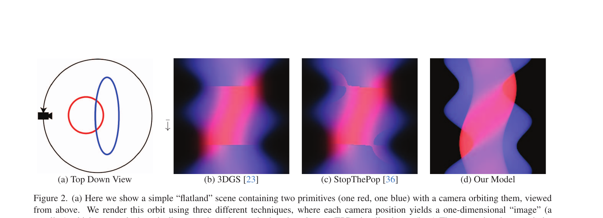
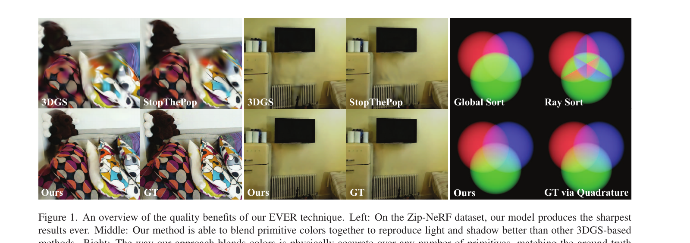
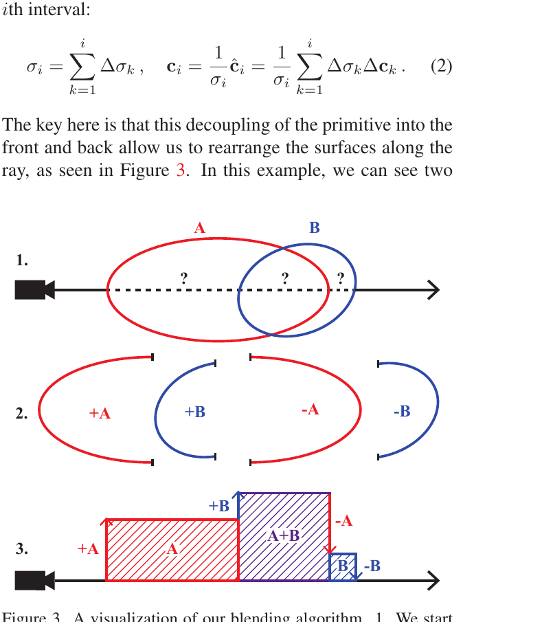
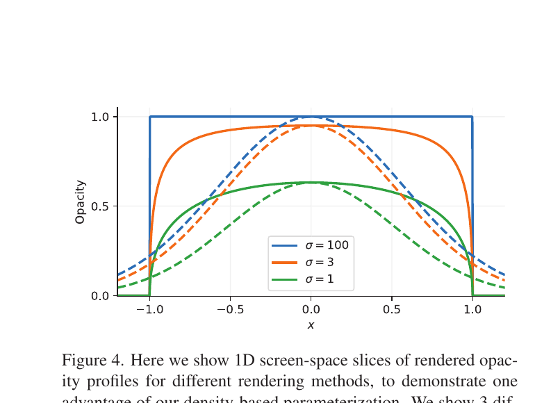
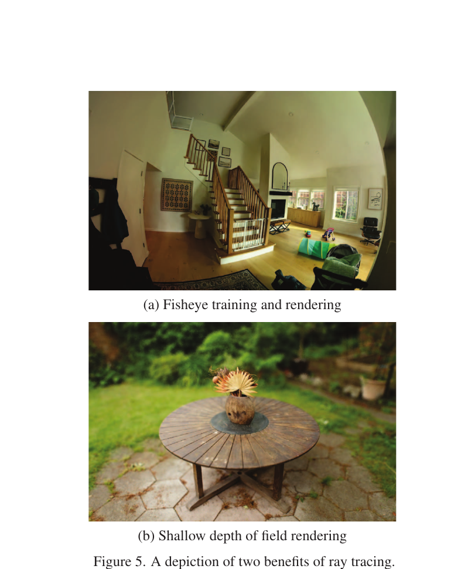
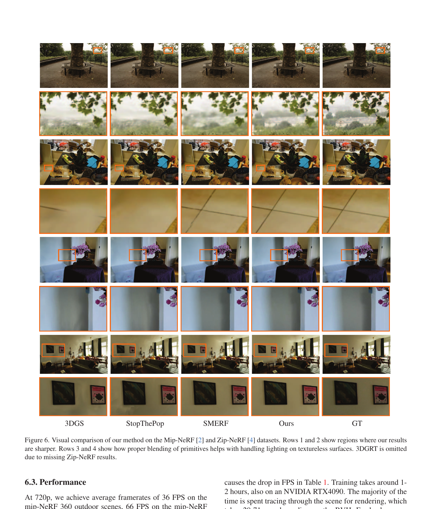
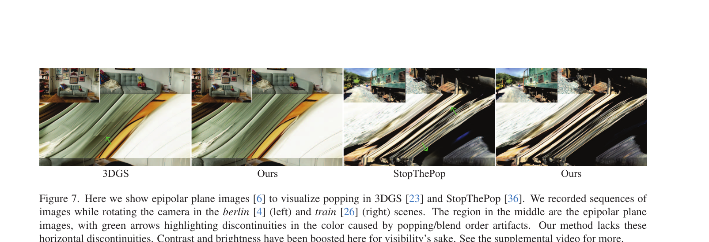

# EVER: Exact Volumetric Ellipsoid Rendering for Real-time View Synthesis
**논문 보고서 | 2026-06-04 | 모진수**

> Alexander Mai, Peter Hedman, George Kopanas, Dor Verbin, David Futschik, Qiangeng Xu, Falko Kuester, Jonathan T. Barron, Yinda Zhang  
> ICCV 2025 (Google + UC San Diego)

---

## 목차

1. [배경 및 동기](#1-배경-및-동기)
2. [Forward: Exact Primitive-based Rendering](#2-forward-exact-primitive-based-rendering)
3. [Backward: Adjoint Rendering](#3-backward-adjoint-rendering)
4. [Densification: Adaptive Density Control 수정](#4-densification-adaptive-density-control-수정)
5. [Results](#5-results)
6. [요약 및 우리 연구와의 관계](#6-요약-및-우리-연구와의-관계)

---

## 1. 배경 및 동기

### 1.1 3DGS의 근본적 한계: Popping

3DGS는 Gaussian primitive들을 카메라로부터의 mean 거리 기준으로 정렬(sort)한 뒤 alpha compositing으로 렌더링한다. (primitive의 정의는 2.1절 참조) 이 방식은 두 가지 가정에 의존한다:

1. **Primitive들이 서로 겹치지 않는다**
2. **카메라 위치만으로 primitive 순서를 결정할 수 있다**

이 두 가정은 실제 장면에서 거의 항상 위반된다. 결과적으로 카메라가 움직이면 정렬 순서가 바뀌어 색이 갑자기 바뀌는 **popping artifact**가 발생한다. Figure 2의 EPI(Epipolar Plane Image)에서 수평선 불연속으로 명확히 보인다.


### 1.2 Popping 해결 시도: StopThePop

popping을 해결하기 위한 선행 연구로 **StopThePop** (Radl et al., 2024)이 있다. 3DGS는 카메라 위치에서 모든 Gaussian의 중심까지 거리를 계산해 **scene 전체를 한 번에** 정렬한다 — 즉 모든 ray가 동일한 정렬 순서를 공유한다. 카메라가 조금만 움직여도 두 Gaussian의 depth 순서가 뒤바뀌는 순간 색이 갑자기 바뀐다.

StopThePop은 이를 **per-ray sorting**으로 개선한다. 각 pixel(ray)마다 독립적으로 Gaussian을 정렬하여, 전역 정렬 순서 역전으로 인한 popping을 억제한다.

그러나 StopThePop도 근본적인 한계가 있다. 두 Gaussian이 **공간적으로 겹치는(overlap) 경우**, 단순히 정렬 순서를 바로잡는 것만으로는 부족하다. Overlap 구간에서는 A가 앞인지 B가 앞인지 자체가 ray 위의 위치에 따라 달라지며, 두 Gaussian을 여전히 **별개 개체로 따로 렌더링한 뒤 합치기** 때문에 overlap 구간의 blend가 부정확하다 — 이를 **blend order artifact**라 한다. 3DGRT도 ray tracing을 활용하지만 overlap 정확도는 동일하게 무시된다.


### 1.3 EVER의 핵심 기여

EVER는 **상수 밀도(constant density) 타원체(ellipsoid)** 표현을 사용하여, ray가 각 ellipsoid와 교차하는 두 지점(front/back surface)을 정확히 추적함으로써 **임의 개수의 overlapping primitive를 물리적으로 정확하게 합성**한다. 이는 근사 없는 exact volume rendering이다.

아래 Figure 1은 논문 첫 페이지의 결과 요약으로, 3DGS/StopThePop 대비 EVER의 품질 향상을 한눈에 보여준다.



---

## 2. Forward: Exact Primitive-based Rendering

이 섹션이 EVER의 핵심이다. 수식 전개와 알고리즘 구조를 상세히 다룬다.

### 2.1 Scene Representation

각 primitive는 다음으로 정의된다:

| 파라미터 | 설명 |
|----------|------|
| 위치 벡터 (position) | 3D 공간에서의 중심 좌표 |
| 회전 쿼터니언 (rotation quaternion) | 타원체의 방향 |
| 스케일 벡터 $\mathbf{s} = (s_x, s_y, s_z)$ | 세 축 방향 반경 |
| 밀도 $\sigma$ (상수) | 타원체 내부 전 영역에 걸쳐 균일 |
| 색상 $\mathbf{c}$ (3D 색상) | 구면 조화 함수(SH) 2차 계수로 시점 의존적 색상 표현 |

3DGS의 Gaussian과 기하학적으로 동일한 ellipsoid이지만, **opacity가 아닌 density를 직접 모델링**한다는 점이 결정적 차이다.

논문은 3DGS와의 차이를 다음과 같이 명시한다:

> *"While 3DGS Gaussians are treated as 2D 'billboards', our ellipsoids blend together so as to constitute a proper and consistent 3D radiance field."*

3DGS의 Gaussian은 카메라 방향으로 투영된 2D 평면 위에 Gaussian 함수를 씌운 것으로, 엄밀한 3D 입체가 아니다. 반면 EVER의 타원체는 ray가 앞뒤 표면을 실제로 통과하는 3D 입체로, 내부에 균일한 밀도가 채워진다. 이러한 이유로 논문은 "Gaussian"이라는 이름 대신 더 중립적인 **primitive**라는 용어를 사용한다.

### 2.2 Volume Rendering Integral (기존 NeRF 공식 리뷰)

표준 volume rendering 방정식 (radiative transfer equation):

$$C = \int_0^\infty c_\mathbf{r}(t)\,\sigma_\mathbf{r}(t)\exp\!\left(-\int_0^t \sigma_\mathbf{r}(s)\,ds\right)dt \tag{1}$$

여기서 $t$는 ray 위의 거리, $\sigma_\mathbf{r}(t) = \sigma(\mathbf{o}+t\mathbf{d})$는 밀도, $c_\mathbf{r}(t) = c(\mathbf{o}+t\mathbf{d}, \mathbf{d})$는 색상이다.

NeRF는 이 적분을 quadrature로 근사한다. EVER는 **closed-form으로 정확히 계산**한다.

### 2.3 Double-Intersection 알고리즘

EVER 렌더링의 핵심 아이디어: **ray와 교차하는 모든 primitive의 front surface와 back surface를 각각 하나의 이벤트(event)로 처리**한다.

#### Step 1: Front Surface 통과 시

primitive $k$의 front surface에 진입할 때, 두 누적 합(running total)에 기여를 **더한다**:

- 밀도 누적: $\sigma_i \mathrel{+=} \Delta\sigma_k$
- premultiplied 색상 누적: $\hat{\mathbf{c}}_i \mathrel{+=} \Delta\sigma_k \cdot \Delta\mathbf{c}_k$

#### Step 2: Back Surface 통과 시

동일 primitive $k$의 back surface를 나올 때, **빼준다**:

- 밀도 누적: $\sigma_i \mathrel{-=} \Delta\sigma_k$
- premultiplied 색상 누적: $\hat{\mathbf{c}}_i \mathrel{-=} \Delta\sigma_k \cdot \Delta\mathbf{c}_k$

#### Step 3: 구간별 밀도와 색상 계산

이 running total을 이용해 두 연속 교차점 사이 구간 $i$의 밀도와 색상을 계산한다:

$$\sigma_i = \sum_{k=1}^{i} \Delta\sigma_k, \qquad \mathbf{c}_i = \frac{1}{\sigma_i}\hat{\mathbf{c}}_i = \frac{1}{\sigma_i}\sum_{k=1}^{i}\Delta\sigma_k\,\Delta\mathbf{c}_k \tag{2}$$

밀도와 색상은 **각 구간 $\Delta t_i$ 내에서 상수**이므로, 구간별 volume rendering의 closed-form solution이 존재한다:

$$\text{Contribution of segment } i = \mathbf{c}_i\bigl(1 - \exp(-\sigma_i\,\Delta t_i)\bigr) \tag{3}$$

#### Step 4: 최종 렌더링 식

모든 구간에 걸쳐 alpha compositing:

$$C = \sum_{i=1}^{N} \mathbf{c}_i\bigl(1 - \exp(-\sigma_i\,\Delta t_i)\bigr)\prod_{j=1}^{i-1}\exp(-\sigma_j\,\Delta t_j) \tag{4}$$

이 식은 외형상 Max(1995)의 quadrature rule과 동일하다. 그러나 결정적 차이가 있다: **quadrature는 piecewise-constant를 근사로 사용하지만, EVER에서 이는 의도적 설계 결정이지 근사가 아니다.** 밀도가 구간 내 실제로 상수이기 때문에 exact integration이 된다.

### 2.4 Figure 3 해석

```
1. 두 primitive A(빨강), B(파랑)이 overlap하는 경우
   ray: ─────[+A]────[+B]────[-A]────[-B]────→

2. 각 교차점에서 Δσ 변화량 표시
   +A    +B    -A    -B

3. 구간별 running total:
   구간1: σ=A                    (A만 존재)
   구간2: σ=A+B  (overlap 구간!) (A와 B 동시 존재)
   구간3: σ=B                    (B만 존재)
```

3DGS/StopThePop은 overlap 구간에서 A와 B를 별도로 렌더링하고 합치므로 blend order artifact가 발생한다. EVER는 overlap 구간에서 **A+B의 합산 밀도와 혼합 색상**을 정확히 계산한다.



### 2.5 Density 파라미터화 (Equation 5)

3DGS에서 opacity 프레임워크를 density 프레임워크로 전환할 때 문제가 발생한다: **density가 커질수록 opacity가 1에 수렴하고 gradient가 0에 수렴**하여 학습이 멈춘다.

해결책: opacity 공간의 파라미터 $\alpha_k \in [0, 1]$을 최적화하고, rendering 시 density로 변환:

$$\sigma(\alpha_k) = \frac{-\log(1 - 0.99 \cdot \alpha_k)}{\min(s_{kx},\, s_{ky},\, s_{kz})} \tag{5}$$

**설계 의도 분석:**

| 요소 | 역할 |
|------|------|
| $-\log(1-0.99\cdot\alpha_k)$ | opacity → density 역변환 (표준 Beer-Lambert 역함수) |
| $0.99$ 계수 | $\alpha_k=1$일 때 $\sigma \to \infty$ 방지 (수치 안정성) |
| $\min(s_{kx}, s_{ky}, s_{kz})$ 나누기 | 가장 얇은 축 방향에서의 ray 통과 시 peak opacity = $\alpha_k$ 보장 |

즉, **어느 방향에서 봐도 최소한 하나의 시점에서 opacity가 $\alpha_k$에 도달**하도록 density를 역산한다. 이로써 opacity 의미를 유지하면서도 density 기반 exact rendering이 가능하다.

### 2.6 Opacity Profile 비교 (Figure 4)

3DGS Gaussian은 항상 부드러운 Gaussian falloff profile을 가진다. EVER의 타원체는 $\sigma$에 따라:

- $\sigma = 1$ (낮음): 부드러운 종 모양 (Gaussian과 유사)
- $\sigma = 3$ (중간): 더 평탄한 상단, 가파른 경계
- $\sigma = 100$ (높음): 거의 perfect step function (완전 불투명 타원체)

이 유연성 덕분에 날카로운 경계선을 표현할 수 있어 **이미지 선명도(sharpness)**가 향상된다.



### 2.7 Ray Tracing & BVH

#### BVH란?

**BVH(Bounding Volume Hierarchy)** 는 3D 공간의 물체들을 계층적으로 감싸는 경계 박스(bounding box) 트리 구조다. 각 노드는 자식 노드들을 모두 포함하는 박스를 가지며, ray가 어떤 물체와 교차하는지 탐색할 때 박스와 먼저 교차 판정을 해서 불필요한 물체를 통째로 건너뛴다.

```
        [전체 장면 박스]
       /               \
  [왼쪽 절반]       [오른쪽 절반]
  /        \         /        \
[A박스]  [B박스]  [C박스]  [D박스]
  |         |        |         |
 [A]       [B]      [C]       [D]
```

ray가 오른쪽 절반 박스와 교차하지 않으면 C, D 전체를 검사하지 않고 넘어간다. 수백만 개의 primitive를 매 ray마다 전수 검사하면 O(N)이지만, BVH를 쓰면 **O(log N)**으로 줄어든다.

#### EVER에서의 BVH 활용

EVER는 **NVIDIA OptiX** 프레임워크를 통해 BVH를 구성한다. 각 ellipsoid에 **AABB(Axis-Aligned Bounding Box)** — 축에 정렬된 직육면체로 물체를 감싸는 가장 단순한 경계 박스 — 를 부여하고, OptiX가 이를 이용해 BVH를 자동으로 빌드한다.

Ray-ellipsoid 정확한 교차 판정은 Haines et al. (2019, *Ray Tracing Gems*)의 isotropic ray/sphere intersection을 변형해 사용한다. 핵심 아이디어는 **ellipsoid를 단위 구(unit sphere)로 변환한 공간에서 ray-sphere 교차를 계산**하는 것이다.

중심 $\boldsymbol{\mu}$, 회전 $\mathbf{R}$, 스케일 $\mathbf{S} = \text{diag}(s_x, s_y, s_z)$로 정의된 ellipsoid에 대해, 변환 행렬 $\mathbf{M} = (\mathbf{RS})^{-1}$을 적용하면 ellipsoid가 단위 구가 된다. 이 변환 공간에서:

$$\mathbf{o}' = \mathbf{M}(\mathbf{o} - \boldsymbol{\mu}), \qquad \mathbf{d}' = \mathbf{M}\mathbf{d}$$

ray $\mathbf{r}(t) = \mathbf{o} + t\mathbf{d}$의 교차 조건 $\|\mathbf{o}' + t\mathbf{d}'\|^2 = 1$을 전개하면 이차방정식이 된다:

$$\|\mathbf{d}'\|^2\,t^2 + 2(\mathbf{o}' \cdot \mathbf{d}')\,t + \left(\|\mathbf{o}'\|^2 - 1\right) = 0$$

판별식 $\Delta = (\mathbf{o}' \cdot \mathbf{d}')^2 - \|\mathbf{d}'\|^2\left(\|\mathbf{o}'\|^2 - 1\right)$이 양수이면 교차가 발생하고, 두 근:

$$t_{1,2} = \frac{-(\mathbf{o}' \cdot \mathbf{d}') \mp \sqrt{\Delta}}{\|\mathbf{d}'\|^2}$$

이 바로 **2.3절 double-intersection 알고리즘의 front surface($t_1$)와 back surface($t_2$) 이벤트**가 된다. Haines et al.은 판별식 계산 시 수치 소거(catastrophic cancellation)를 방지하는 안정적인 구현을 제공하며, EVER는 이를 그대로 활용한다.

3DGS는 rasterization 기반이라 BVH가 필요 없고, 3DGUT은 ray tracing 기반이지만 k-buffer 방식으로 per-ray hit을 관리해 BVH 없이 동작한다. EVER는 OptiX를 통해 BVH를 활용하는 구현 방식을 선택했다. 또한 3DGRT의 접근 방식을 통합해 각 OptiX trace 호출 내에서 multiple hit을 큐에 누적함으로써 효율을 높인다.

BVH는 **매 학습 step마다 재구성**한다 (20-71ms 소요). Densification으로 primitive 위치와 수가 바뀌기 때문이다.

#### BVH의 한계와 Anisotropic Regularizer

BVH 효율성은 각 primitive의 AABB 크기에 직접 의존한다. 문제는 **회전된 anisotropic ellipsoid** — 즉 한 축이 극단적으로 긴 needle 형태의 primitive는 AABB가 실제 부피보다 훨씬 크게 잡힌다:

```
실제 ellipsoid (가늘고 기울어진 형태):  /
AABB (이를 감싸는 박스):              ┌──────┐
                                      │  /   │  ← 빈 공간이 많음
                                      └──────┘
```

빈 공간이 많은 큰 AABB는 불필요한 교차 판정을 유발해 BVH 탐색이 느려진다. 이를 억제하기 위해 Eq.7의 **Anisotropic Regularizer**를 추가한다 (4.3절 참조).



---

## 3. Backward: Adjoint Rendering

### 3.1 Adjoint Rendering 전략

EVER는 **adjoint rendering** 방식으로 backward를 구현한다:

> **Forward pass에서 중간값을 저장하지 않고, backward pass에서 필요한 값을 재계산한다.**

일반적인 automatic differentiation은 forward의 모든 중간값을 저장(store)해야 한다. Gaussian 수백만 개 × 교차 이벤트를 저장하면 메모리가 폭발적으로 증가한다. Adjoint approach는 이를 회피한다.

### 3.2 Backward 연산 분해

backward 과정은 다음 단계로 이루어진다:

| 단계 | 시간 | 내용 |
|------|------|------|
| Intersection 저장 | ~16ms | ray-ellipsoid 교차 정보 (t값, primitive ID) |
| Primitive 로딩 | 13-20ms | 저장된 intersection으로부터 primitive 파라미터 로딩 |
| Gradient 누적 | 13-20ms | 각 primitive에 gradient를 atomic add |

### 3.3 Gradient 흐름

Eq.(4)에서 파라미터 $\theta_k = (\sigma_k, \mathbf{c}_k, \text{position}_k, \text{rotation}_k, s_k)$에 대한 gradient:

**색상 gradient**: 각 구간에서 $\mathbf{c}_i$에 대한 gradient → running total 역전파 → 각 $\Delta\sigma_k \cdot \Delta\mathbf{c}_k$ 기여로 분배

**밀도 gradient**: $\sigma_i$에 대한 gradient → $\sigma_i = \sum \Delta\sigma_k$ → 해당 구간에 존재하는 모든 primitive에 분배

**기하 gradient**: 교차점 $t$의 변화 = $\Delta t_i$ 변화 = 구간 경계 이동 → position/rotation/scale gradient

### 3.4 SH(Spherical Harmonics) Shading

색상은 2차까지의 SH 계수로 모델링된다 (degree 0, 1, 2 = 총 9개 계수 × RGB = 27개 float). View direction $\mathbf{d}$에 대해:

$$\mathbf{c}(\mathbf{x}, \mathbf{d}) = \sum_{l=0}^{2}\sum_{m=-l}^{l} f_{lm}(\mathbf{x})\, Y_{lm}(\mathbf{d})$$

Backward에서는 SH 계수에 대한 gradient도 계산된다.

#### SH Degree 비교: EVER vs 3DGS vs 3DGUT

| 방법 | 최대 SH degree | 채널당 계수 수 | 총 파라미터 (RGB) |
|------|--------------|-------------|-----------------|
| **EVER** | **2** | 9 (l=0,1,2) | **27** |
| 3DGS | 3 | 16 (l=0~3) | 48 |
| 3DGUT | 3 | 16 (l=0~3) | 48 |

각 degree별 계수 수: $\sum_{l=0}^{L}(2l+1) = (L+1)^2$. 따라서 degree 2는 $(2+1)^2 = 9$, degree 3는 $(3+1)^2 = 16$.

3DGS와 3DGUT은 모두 degree 3을 기본값으로 사용한다. EVER가 degree 2에서 멈추는 이유는 **exact volume rendering이 이미 view-dependent 효과 일부를 흡수**하기 때문이다. 3DGS에서 SH 고차 계수가 보완해야 했던 overlap 구간의 부정확한 blending 오류가, EVER에서는 double-intersection 알고리즘으로 수식적으로 제거된다. 즉, representation 용량을 줄여도 rendering 정확도 자체가 높아지므로 품질 손실이 최소화된다.

실제로 Table 1에서 EVER는 degree 3 SH를 쓰는 3DGS 대비 **SSIM과 LPIPS에서 명확히 우위**다. PSNR이 약간 낮은 것은 blurring에 관대한 MSE 특성 때문이지 SH degree 차이 때문이 아니다 (5.2절 참조). 결과적으로 degree 2 선택은 **파라미터 효율과 렌더링 속도를 위한 설계 결정**이다.

---

## 4. Densification: Adaptive Density Control 수정

### 4.1 3DGS ADC 개요

3DGS의 Adaptive Density Control(ADC)은 학습 중 주기적으로:
- **Clone**: 작은 primitive를 복제하여 coverage 확대
- **Split**: 큰 primitive를 분할하여 세밀한 표현
- **Prune**: 불필요한(거의 투명한) primitive 제거

xy 평면에서의 gradient 크기가 임계값을 초과하면 clone/split을 수행한다.

### 4.2 EVER에서 필요한 수정

#### 문제 1: Spatial Gradient Scale 차이

EVER의 spatial gradient는 3DGS보다 작은 경향이 있다. 이유: 정확한 volume rendering으로 각 primitive의 기여가 더 정확히 분리되어 gradient noise가 줄어들기 때문이다.

**해결**: 임계값을 낮춤

| 파라미터 | 3DGS 기본값 | EVER 수정값 |
|----------|------------|------------|
| Split threshold | (높음) | $2.5 \times 10^{-7}$ |
| Clone threshold | (높음) | $0.1$ |

#### 문제 2: Density 기반 Split 조건 추가

3DGS의 split은 opacity 기반이지만, EVER는 density 기반이므로 새로운 splitting condition이 필요하다.

**Equation 6 — Additional Split Condition:**

$$0.99 < 1 - \exp\!\bigl(-\sigma(\alpha_k) \cdot \max(s_{kx}, s_{ky}, s_{kz})\bigr) \tag{6}$$

해석: **major axis 방향으로 봤을 때 opacity가 0.99를 초과하면 (즉, gradient가 거의 소멸했으면) split을 트리거**한다. 이 조건이 없으면 매우 불투명한 primitive는 gradient 소멸로 인해 계속 커지기만 한다.

#### Split 처리

- primitive 크기를 절반으로 줄임
- 위치를 정규분포에서 샘플링한 작은 오프셋만큼 무작위로 이동 (두 자식이 동일한 위치에서 출발하면 gradient도 동일해져 독립적으로 학습되지 않으므로, 초기 위치를 살짝 다르게 설정해 대칭성을 깨줌)
- **density를 절반으로 나눔** ← 3DGS에는 없는 EVER 고유 처리. 하나의 primitive를 둘로 나눌 때 density를 그대로 유지하면, 같은 위치에 동일한 density의 primitive가 두 개 생겨 총 기여량이 2배로 뛰어 장면 표현이 망가진다. density를 반으로 줄여야 두 자식을 합친 기여량이 원래 부모와 동등해진다. 이 원칙은 Bulo et al. (2024, "Revising Densification in Gaussian Splatting")에서 제안된 것으로, EVER는 동일한 논리를 density 프레임워크에 적용한다.

### 4.3 Anisotropic Regularizer

BVH 효율성을 위해, 지나치게 anisotropic한 primitive(needle-like ellipsoid)를 억제하는 정규화 항을 추가:

$$\text{stopgrad}(1-\alpha)\bigl(\max(s_x,s_y,s_z) - \min(s_x,s_y,s_z)\bigr) \tag{7}$$

| 요소 | 역할 |
|------|------|
| $\text{stopgrad}(1-\alpha)$ | 불투명한 primitive는 억제하지 않음 (투명할수록 강하게 패널티) |
| $\max - \min$ | 세 축 스케일의 범위 = anisotropy 척도 |

이 regularizer의 목적:
- 회전된 anisotropic ellipsoid는 AABB가 크게 됨 → BVH 검색 비효율
- 불필요하게 늘어난 primitive를 더 구형에 가깝게 유도
- **단점**: ablation에서 "No Anisotropic"이 FPS 41.2로 더 빠르고 PSNR도 약간 높음 → quality-speed tradeoff

---

## 5. Results

### 5.1 평가 데이터셋

| 데이터셋 | 씬 수 | 특성 |
|----------|-------|------|
| Mip-NeRF 360 | 9씬 | 실내/실외 혼합, 일반적 대규모 장면 |
| Zip-NeRF | 4씬 | 매우 대규모, 최고 난이도 |
| Tanks & Temples | 2씬 | 야외 대형 구조물 |
| Deep Blending | 2씬 | 실내 복잡 장면 |

### 5.2 정량적 결과 (Table 1)

#### Mip-NeRF 360 (9씬 평균)

| 방법 | PSNR↑ | SSIM↑ | LPIPS↓ | GPU-hr↓ | FPS↑ |
|------|-------|-------|--------|---------|------|
| 3DGS | **27.48** | .816 | .216 | 0.54 | 224 |
| StopThePop | 27.33 | .816 | .212 | 0.60 | 180 |
| 3DGRT | 27.20 | .818 | .248 | 0.83† | 156† |
| SMERF | 27.99 | .818 | .238 | 272 | 139MB |
| **EVER (Ours)** | 27.51 | **.825** | **.194** | 1.04 | **36** |
| ZipNeRF (offline) | 28.54 | .828 | .198 | 32 | 0.5 |

**분석**: PSNR은 3DGS보다 소폭 낮지만(27.51 vs 27.48), SSIM과 LPIPS에서 명확히 우월하다. 이 패턴은 세 metric의 수식적 차이에서 기인한다.

**PSNR**은 픽셀 단위 MSE의 역수다:
$$\text{PSNR} = 10\log_{10}\frac{\text{MAX}^2}{\text{MSE}}, \quad \text{MSE} = \frac{1}{N}\sum_i(y_i - \hat{y}_i)^2$$
모든 픽셀의 오차를 동등하게 평균하므로, 전체가 살짝 뿌옇게 blurring된 이미지도 경계선이 날카롭지만 1픽셀 어긋난 이미지보다 높은 점수를 받을 수 있다. 3DGS의 Gaussian falloff는 암묵적인 공간 평활화(spatial smoothing) 효과가 있어 MSE를 낮춘다.

**SSIM**은 로컬 구조(엣지, 패턴)의 상관관계 $\sigma_{xy}$를 측정한다:
$$\text{SSIM}(x,y) = \frac{(2\mu_x\mu_y+C_1)(2\sigma_{xy}+C_2)}{(\mu_x^2+\mu_y^2+C_1)(\sigma_x^2+\sigma_y^2+C_2)}$$
EVER의 정확한 blending과 step-function 가능한 opacity profile이 경계선을 선명하게 재현하므로 SSIM에서 이득을 가진다.

**LPIPS**는 VGG/AlexNet feature로 perceptual similarity를 측정하므로 선명한 텍스처와 엣지를 사람 눈과 유사하게 평가한다. 논문도 이를 직접 언급한다:

> *"The combination of more flexible primitive appearance, combined with color blending, allows our method to represent gradients better."*

#### Zip-NeRF (4씬 평균) — EVER의 핵심 결과

| 방법 | PSNR↑ | SSIM↑ | LPIPS↓ | FPS↑ |
|------|-------|-------|--------|------|
| 3DGS | 25.84 | .817 | .358 | 559 |
| StopThePop | 25.92 | .819 | .352 | 403 |
| **EVER (Ours)** | **26.58** | **.845** | **.308** | **24** |
| ZipNeRF (offline) | 27.37 | .836 | .305 | 0.5 |

**핵심**: Zip-NeRF 씬에서 **SSIM은 offline ZipNeRF보다 높음(0.845 > 0.836)**, LPIPS도 offline과 거의 동등(0.308 vs 0.305). 이는 대규모 장면에서 correct blending의 효과가 극대화됨을 보여준다.

#### Tanks & Temples + Deep Blending (4씬 평균)

| 방법 | PSNR↑ | SSIM↑ | LPIPS↓ |
|------|-------|-------|--------|
| 3DGS | 26.65 | .848 | .263 |
| StopThePop | 26.60 | .847 | .252 |
| **EVER (Ours)** | **26.59** | **.889** | **.234** |

SSIM .889로 다른 방법들(.847~.865) 대비 큰 폭으로 향상.



### 5.3 Popping 정량 분석 (Table 2)

StopThePop(StP) 논문의 popping metric 사용. 값이 낮을수록 popping 없음.

| 방법 | DeepBlending (step=7) | M360 Indoor (step=7) | Tanks & Temples (step=7) |
|------|----------------------|---------------------|--------------------------|
| 3DGS | 0.0122 | 0.0149 | 0.0315 |
| StopThePop | 0.0055 | 0.0073 | 0.0114 |
| **EVER (Ours)** | **0.0000** | **0.0000** | **0.0000** |

**EVER는 완벽한 0.0000** — 수학적으로 exact rendering이므로 popping이 원천적으로 불가능하다.



### 5.4 Ablation (Table 3)

`bicycle`, `counter` (Mip-NeRF360) + `berlin` (Zip-NeRF) 씬 평균:

| 방법 | PSNR↑ | SSIM↑ | LPIPS↓ | FPS↑ |
|------|-------|-------|--------|------|
| Splatted (ray train, splat render) | 26.63 | .845 | .329 | - |
| No Mixing (ray sort, no blending) | 26.79 | .849 | .305 | - |
| 3DGS | 27.02 | .853 | .301 | - |
| 3DGS + Our Changes | 26.94 | .832 | .323 | - |
| No Anisotropic | **27.25** | .865 | .277 | **41.2** |
| No Points | 27.19 | .863 | .277 | 41.4 |
| No Rand Center | 27.08 | .859 | .278 | 41.4 |
| **EVER (Full)** | 27.17 | **.862** | **.277** | 41.9 |

**주요 ablation 인사이트**:
- "Splatted" < "No Mixing" < "Full": **blending의 질적 기여** 확인
- "3DGS + Our Changes"는 3DGS보다 낮음: ADC 수정이 density primitive 없이는 도움이 안 됨
- "No Anisotropic": PSNR 27.25로 EVER Full보다 높지만 FPS 41.2 (EVER 41.9보다 낮음!) — 오히려 FPS도 낮아지는 흥미로운 결과

### 5.5 성능 분석

| 지표 | 수치 |
|------|------|
| 추론 FPS (Mip-NeRF360 outdoor, 720p) | ~36 FPS |
| 추론 FPS (Mip-NeRF360 indoor, 720p) | ~66 FPS |
| 추론 FPS (Zip-NeRF, 720p) | ~30 FPS |
| 학습 시간 (EVER) | 1-2시간 (RTX4090) |
| 학습 시간 (3DGS) | ~32분 (0.54 GPU-hr) |
| BVH 재구성 (per step) | 20-71ms |
| Backward: intersection 저장 | ~16ms |
| Backward: primitive 로딩 + gradient 누적 | 13-20ms |
| 메모리 (Mip-NeRF360) | 1134MB |
| 메모리 (Zip-NeRF) | 1694MB |

추론은 3DGS 대비 약 6배 느리지만, 학습은 약 2배 차이에 그친다. 추론이 더 큰 폭으로 느린 이유는 매 프레임마다 BVH ray tracing을 수행하기 때문이며, 학습 시에는 BVH 재구성(20-71ms)이 전체 step 시간에 분산되어 상대적으로 overhead가 작다. NeRF 계열 대비로는 수백 배 빠르다(ZipNeRF 0.5 FPS vs EVER 30 FPS).

---

## 6. 요약 및 핵심 기여점 및 개선할 부분

### 6.1 EVER의 핵심 요약

| 구분 | 내용 |
|------|------|
| 표현 | 상수 밀도 타원체 (3DGS ellipsoid + density 파라미터화) |
| Forward | Double-intersection: front/back surface 이벤트로 running total 관리 → exact closed-form |
| Backward | Adjoint rendering: 중간값 저장 없이 재계산 |
| Densification | ADC threshold 수정 + density 기반 split 조건 + density halving on split |
| 결과 | Popping 완전 제거, Zip-NeRF에서 offline 방법과 동등한 SSIM/LPIPS |

### 6.2 3DGS 대비 EVER의 장점

| 항목 | 3DGS | EVER |
|------|------|------|
| Popping | 발생 (전역 정렬 의존) | 완전 제거 (exact rendering) |
| Overlap 처리 | 무시 (각 Gaussian 독립 렌더링) | 정확한 합산 밀도/색상 계산 |
| 표현 | 2D billboard (view-dependent opacity) | 3D 입체 (물리적 density 필드) |
| Opacity profile | 항상 Gaussian falloff | σ에 따라 smooth~step function까지 |
| 카메라 모델 | 표준 핀홀만 지원 | Fisheye, DoF 등 ray tracing 기반 효과 가능 |
| 화질 (SSIM/LPIPS) | 기준 | 전 데이터셋 명확히 상회 |
| 화질 (PSNR) | 약간 높음 | 약간 낮음 (blurring에 덜 관대한 metric 특성) |

핵심은 **물리적으로 일관된 3D radiance field**라는 점이다. 3DGS는 view-consistent 렌더링을 흉내내는 반면, EVER는 수식적으로 exact한 volumetric rendering을 보장한다.

### 6.3 우리 연구에서의 개선 포인트

EVER는 방향성이 명확하지만 실용적 한계도 있다. 우리 연구(k-buffer 기반 파이프라인)에서 참고할 개선 포인트:

| 항목 | EVER의 현황 | 개선 여지 |
|------|------------|----------|
| 추론 속도 | 36 FPS (3DGS 대비 ~6배 느림) | BVH overhead 감소 또는 k-buffer로 대체 |
| 학습 속도 | 1-2시간 (3DGS 대비 ~2배) | BVH 재구성 주기 줄이기 |
| Gaussian 수 | 3DGS 대비 더 많아지는 경향 (densification 차이) | split 조건 튜닝으로 수 제어 |
| 메모리 | 1134~1694MB (3DGS 222~563MB 대비 2-3배) | intersection 저장 방식 최적화 |

---

*보고서 작성: 모진수 | 논문 출처: EVER, ICCV 2025*
