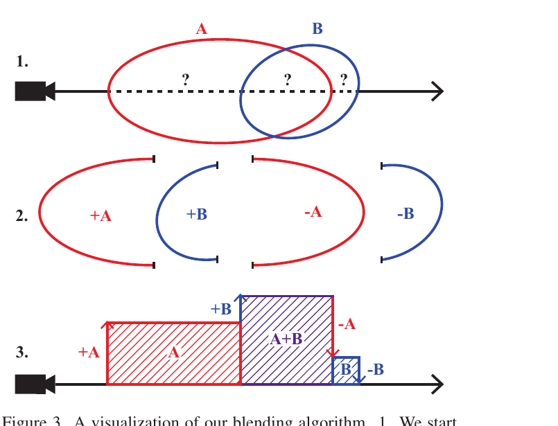

# EVER Overlap 처리 구현 분석


## Q1. 구현부를 확인한 것인지?

실제 구현은 아래 파일들에 있다:

| 파일 | 역할 |
|------|------|
| `ever/splinetracers/fast_ellipsoid_splinetracer/slang/shaders.slang` | OptiX ray generation / any-hit / intersection 셰이더 |
| `ever/splinetracers/fast_ellipsoid_splinetracer/slang/spline-machine.slang` | `update()` (forward blending), `inverse_update_dual()` (backprop용 state 역산) |
| `ever/splinetracers/fast_ellipsoid_splinetracer/slang/fast_shaders.slang` | `backwards_kernel` (backpropagation) |
| `ever/splinetracers/fast_ellipsoid_splinetracer/create_aabbs.cu` | 각 Gaussian을 AABB로 변환해 BVH 등록 |


---

## 배경: OptiX와 optixTrace

EVER의 렌더링 파이프라인은 NVIDIA OptiX 위에 구현되어 있다.

**OptiX**는 NVIDIA가 제공하는 GPU 레이트레이싱 프레임워크다. CPU/CUDA 코드에서 장면을 설정하고, GPU에서는 다음 4가지 셰이더 타입으로 레이트레이싱을 처리한다:

| 셰이더 | 호출 시점 | EVER에서의 역할 |
|--------|----------|----------------|
| `raygeneration` | 레이 하나당 1회 | 레이 루프 전체 제어, 최종 색상 출력 |
| `intersection` | BVH가 AABB 후보를 찾을 때 | 실제 ellipsoid와의 교차 계산 → `(t_enter, t_exit)` 반환 |
| `anyhit` | intersection이 hit를 보고할 때 | 수집된 hit를 t 기준 정렬해 payload에 삽입 |
| `miss` | 레이가 아무것도 안 맞을 때 | (EVER에서는 비어있음) |

**`optixTraceP32`** 는 한 번의 레이트레이싱 탐색 호출이다. 레이(`origin`, `direction`, `tmin`, `tmax`)를 BVH에 쏘고, any-hit 셰이더를 통해 수집된 결과를 `payload`(32개의 uint 레지스터)에 담아 반환한다. EVER는 이 payload를 `(t값, tri_id)` 쌍 16개짜리 버퍼로 사용한다.

### AABB와 BVH

**AABB(Axis-Aligned Bounding Box)** 는 좌표축에 정렬된 직육면체 바운딩 박스다. Gaussian ellipsoid를 완전히 감싸는 가장 작은 축 정렬 박스로, `create_aabbs.cu`에서 회전 행렬을 이용해 각 축 방향 최대 반경을 계산한다:

```cuda
aabbs[i] = {
  .minX = center.x - sqrt(M[0][0]² + M[0][1]² + M[0][2]²),
  .maxX = center.x + sqrt(M[0][0]² + M[0][1]² + M[0][2]²),
  ...
};
```

**BVH(Bounding Volume Hierarchy)** 는 이 AABB들을 트리 구조로 묶은 공간 가속 구조다. `optixTrace`가 호출되면 OptiX가 BVH를 순회하며 레이와 교차 가능한 AABB 후보들만 빠르게 추려낸다. AABB와 교차하는 후보가 나오면 intersection 셰이더가 호출되어 실제 ellipsoid 수식으로 정밀 교차를 계산하고 `(t_enter, t_exit)`를 반환한다.

즉 AABB는 "BVH 탐색을 위한 근사 바운딩"이고, 실제 교차 계산은 ellipsoid 수식으로 별도 처리된다.

---

## Q2. Stream 방식이 아닌 것으로 처리되는 것인지?

**결론적으로 Stream 방식이 맞다.**

`rg_float()` (ray generation shader)의 메인 루프:

```slang
// shaders.slang
while (state.logT < LOG_CUTOFF && iter < max_iters)
{
    let start_t = abs(state.t);   // 직전에 처리한 t 위치부터 재시작

    uint payload[2*BUFFER_SIZE];  // 16개짜리 hit 버퍼 초기화
    for (int i=0; i<BUFFER_SIZE; i++) payload[2*i] = asuint(1e10f);

    optixTraceP32(traversable, origin, direction, start_t, tmax, payload);

    for (int i=0; i<BUFFER_SIZE; i++) {
        ctrl_pt = get_ctrl_pt(tri, ctrl_pt.t);
        state = update(state, ctrl_pt, tmin, tmax, max_prim_size);
        iter++;
    }
}
```

동작 방식:
1. 한 번의 `optixTrace`가 `start_t`부터 시작해 **최대 16개의 hit 이벤트**를 수집
2. 수집된 16개를 t 순서대로 `update()` 처리
3. 누적 투명도(`logT`)가 임계값 미만이면 `start_t`를 이동해서 **다음 구간을 다시 탐색**
4. 임계값 초과(충분히 불투명해짐) 또는 `max_iters` 도달 시 종료

즉, 전체 ray 구간을 한 번에 처리하는 것이 아니라 **16개 배치씩 스트리밍**한다.

---

## Q3. 모든 구간의 active list를 만들고 거기서 blending 하는 것인지?

**아니다.** 명시적 active list를 미리 만들지 않는다.

### 핵심 아이디어: Entry/Exit 이벤트


각 Gaussian은 두 개의 이벤트로 표현된다:

```
tri = 2 × prim_id + 1   → entry  (dirac = +density)
tri = 2 × prim_id + 0   → exit   (dirac = -density)
```

여기서 prim_id는 가우시안을 뜻하며 Primitive의 약자이다. 그리고 가우시안을 Primitive로 표현하는 이유는 논문의 내용을 바탕으로 다음과 같이 추론할 수 있다.

> *"While 3DGS Gaussians are treated as 2D 'billboards', our ellipsoids blend together so as to constitute a proper and consistent 3D radiance field."*

3DGS의 Gaussian은 카메라 방향으로 투영된 2D 평면 위에 Gaussian 함수를 씌운 것으로, 엄밀한 3D 입체가 아니다. 반면 EVER의 타원체는 ray가 앞뒤 표면을 실제로 통과하는 3D 입체로, 내부에 균일한 밀도가 채워진다. 이러한 이유로 논문은 "Gaussian"이라는 이름 대신 더 중립적인 **primitive**라는 용어를 사용한다.


그리고 각 primitive는 다음으로 정의된다:

| 파라미터 | 설명 |
|----------|------|
| 위치 벡터 (position) | 3D 공간에서의 중심 좌표 |
| 회전 쿼터니언 (rotation quaternion) | 타원체의 방향 |
| 스케일 벡터 $\mathbf{s} = (s_x, s_y, s_z)$ | 세 축 방향 반경 |
| 밀도 $\sigma$ (상수) | 타원체 내부 전 영역에 걸쳐 균일 |
| 색상 $\mathbf{c}$ (3D 색상) | 구면 조화 함수(SH) 2차 계수로 시점 의존적 색상 표현 |

3DGS의 Gaussian과 기하학적으로 동일한 ellipsoid이지만, **opacity가 아닌 density를 직접 모델링**한다는 점이 결정적 차이다.


### `update()` 함수 동작 (`spline-machine.slang`)

```slang
SplineState update(state, ctrl_pt, ...) {
    new_state.drgb = state.drgb + ctrl_pt.dirac;  // entry: +, exit: -

    float4 avg = state.drgb;           // 현재 구간에서 활성화된 Gaussian들의 누적 밀도
    let area = avg.x * dt;             // 밀도 × 구간 길이
    let alpha = 1 - exp(-area);        // 표준 volume rendering alpha
    let weight = alpha * exp(-logT);   // transmittance 가중치

    new_state.C = state.C + weight * rgb_norm;  // 색상 누적
    new_state.logT = logT + area;
}
```

`drgb.x`는 현재 레이 위치에서 **겹쳐있는 Gaussian들의 밀도 합**이다. Gaussian이 entry 이벤트를 만날 때 밀도가 더해지고, exit 이벤트를 만날 때 빠진다. 이 running sum이 명시적 active list를 대체한다.

---


## Q4. Gaussian A는 "일반적인" 블렌딩 식에서 어떻게 backprop이 되는 것인지?

### Forward 시 저장: `tri_collection`

Forward pass에서 각 레이가 처리한 이벤트 순서를 전부 저장한다:

```slang
tri_collection[idx.x + iter * dim.x] = tri;  // 레이별 × 스텝별 저장
```

### Backward: 역순 재생 + Slang 자동 미분

`backwards_kernel` (`fast_shaders.slang`):

```slang
for (int i=num_iters; i-->0; )   // 역방향으로 순회
{
    // tri_collection에서 이전 이벤트 복원
    uint old_tri_ind = tri_collection[ray_ind + (i-1) * ray_origins.size(0)];

    // Forward state를 역산 (중간 상태 전체 저장 불필요)
    SplineState old_dual_state = inverse_update_dual(dual_state, ctrl_pt, old_ctrl_pt, ...);

    // Slang 자동 미분으로 gradient 계산
    bwd_diff(update)(old_deriv_state, deriv_ctrl_pt, ...);

    // 각 Gaussian의 parameter gradient를 atomic add로 누적
    atomic_add_float3(model.dL_dmeans, prim_ind, deriv_mean.d);
    atomic_add_float3(model.dL_dscales, prim_ind, deriv_scales.d);
    atomic_add_float4(model.dL_dquats, prim_ind, deriv_quat.d);
    model.dL_ddensities.InterlockedAdd(prim_ind, deriv_density.d, temp);
}
```

### Gaussian A의 gradient 흐름

**EVER Figure 3** — 논문에 표기된 아래 예시 그림에서 backward에 생각해보자 



예를 들어 A가 B보다 먼저 시작해서 B 안에서 끝나는 경우:

```
레이 →  [A_entry]  [B_entry]  [A_exit]  [B_exit]
         +dens_A    +dens_B    -dens_A    -dens_B
```

- **A_entry 이벤트** (tri = 2A+1): `drgb += density_A` → 이 시점부터 A가 blending에 기여
- **A_exit 이벤트** (tri = 2A): `drgb -= density_A` → 이 시점부터 A의 기여 종료
- Backward: `tri_collection`에 기록된 **두 이벤트 각각에서** `bwd_diff(update)`가 호출됨
- 두 번의 호출을 통해 A의 `density`, `color`, `scale`, `position`에 대한 gradient가 누적됨

`inverse_update_dual`이 중간 SplineState를 역산할 수 있도록 수식이 설계되어 있어, 모든 중간 상태를 저장하지 않아도 된다 (메모리 절약).


