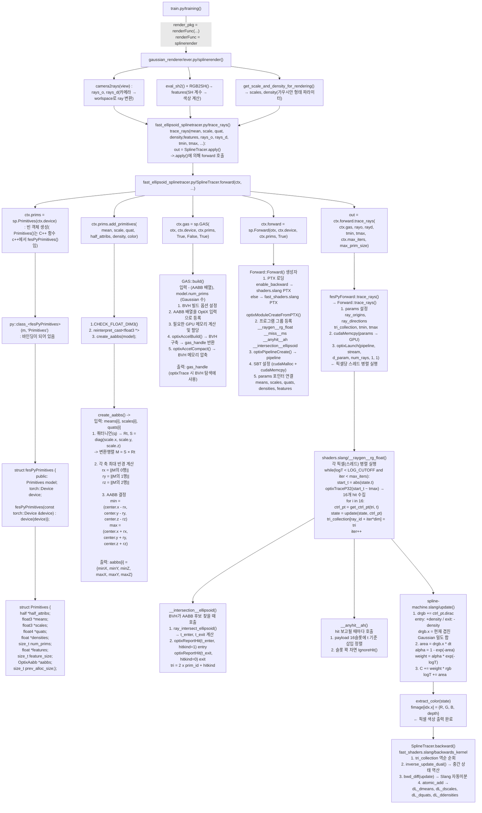

# EVER 렌더링 파이프라인 분석

## 1. 전체 파이프라인



---

## 2. 파이프라인 단계 요약

### 2-1. splinerender() — [gaussian_renderer/ever.py](notes/ever_py.md)

렌더링 파이프라인의 시작점. 세 가지 입력을 준비해서 `trace_rays()`로 넘김.

| 출력 | 함수 | 설명 |
|------|------|------|
| `rays_o, rays_d` | `camera2rays(view)` | ray(cam_space)를 worldspace로 변환 |
| `features` | `eval_sh2() + RGB2SH()` | SH->색상 계산 |
| `scales, density` | `get_scale_and_density_for_rendering()` | 각 Gaussian의 크기와 밀도 |

```python
# gaussian_renderer/ever.py
out, extras = trace_rays(
    pc.get_xyz, scales, pc.get_rotation, density, features,
    rays_o, rays_d, tmin, tmax, 100, means2D, full_wct,
    max_iters=MAX_ITERS, return_extras=True,
)
```

`trace_rays`는 [ever/splinetracers/fast_ellipsoid_splinetracer.py](notes/fast_ellipsoid_splinetracer_py.md)에 정의된 **래퍼 함수**다. 내부에서 `SplineTracer.apply()`를 호출하며, 이 시점에 PyTorch autograd 그래프가 등록된다.

```python
# ever/splinetracers/fast_ellipsoid_splinetracer.py
def trace_rays(mean, scale, quat, density, features, rayo, rayd, ...):
    out = SplineTracer.apply(          # ← .apply()로 autograd에 등록
        mean, scale, quat, density, features,
        rayo, rayd, tmin, tmax, max_prim_size,
        dL_dmeans2D, wcts, max_iters, return_extras,
    )
    return out
```

| 호출 | 의미 |
|------|------|
| `trace_rays(...)` | 래퍼. 인자 정리 후 `.apply()` 호출 |
| `SplineTracer.apply(...)` | autograd 엔진이 `forward()` 실행, computation graph 등록 |
| `SplineTracer.forward(ctx, ...)` | 실제 렌더링 수행. `ctx.save_for_backward()` 호출 |

### 2-2. SplineTracer.forward() — [fast_ellipsoid_splinetracer.py](notes/fast_ellipsoid_splinetracer_py.md)

`.apply()` 호출 시 PyTorch autograd 엔진이 `SplineTracer.forward(ctx, ...)`를 실행한다. 내부 흐름은 아래와 같다.

```
SplineTracer.apply(mean, scale, quat, density, features, rayo, rayd, ...)
│
│  [Step 1] AABB 생성
├─ ctx.prims = sp.Primitives(ctx.device)
│  ctx.prims.add_primitives(mean, scale, quat, ...)
│       └─ C++: create_aabbs() → 각 Gaussian마다 AABB 계산
│              → ctx.prims.aabbs[] (GPU 배열) 채워짐
│
│  [Step 2] BVH 빌드
├─ ctx.gas = sp.GAS(otx, ctx.device, ctx.prims, ...)
│       └─ C++: GAS::build() → optixAccelBuild()
│              → BVH 트리 생성, ctx.gas.handle 획득
│
│  [Step 3] OptiX 파이프라인 셋업
├─ ctx.forward = sp.Forward(otx, ctx.device, ctx.prims, True)
│       └─ C++: Forward::Forward()
│              → PTX 로딩 (shaders.slang 컴파일 결과)
│              → 프로그램 그룹 등록 (raygen / anyhit+intersection / miss)
│              → SBT 설정
│              → params에 Gaussian 파라미터 포인터 연결
│
│  [Step 4] GPU 렌더링 실행  →  2-3 참고
└─ out = ctx.forward.trace_rays(ctx.gas, rayo, rayd, tmin, tmax, ...)
        └─ C++: Forward::trace_rays()
               → cudaMemcpy(params → GPU)
               → optixLaunch(num_rays, 1, 1)
                    └─ GPU: __raygen__rg_float()  ← 픽셀당 1스레드
                            SplineState state = make_empty_state()  ← ★ 여기서 선언
                            while (...) { state = update(state, ...) }
```

| 객체 | C++ 타입 | 역할 |
|------|----------|------|
| `ctx.prims` | `fesPyPrimitives` | Gaussian raw 파라미터 + AABB GPU 배열 |
| `ctx.gas` | `fesPyGas` | BVH 트리. `ctx.gas.handle`을 trace_rays에 전달 |
| `ctx.forward` | `fesPyForward` | OptiX 파이프라인 + Gaussian 파라미터 포인터 |

### 2-3. GPU 렌더링 실행 — Forward::trace_rays() → __raygen__rg_float()

> [Forward.cpp](notes/Forward_cpp.md) · [shaders.slang → 03_rg_float.md](notes/03_rg_float.md)

Python에서 `ctx.forward.trace_rays(ctx.gas, rayo, rayd, tmin, tmax, max_iters, max_prim_size)`를 호출하면 pybind11을 통해 C++ `Forward::trace_rays()`로 진입한다. 이 함수가 GPU 파라미터를 조립하고 OptiX를 실제로 실행하는 마지막 C++ 단계다.

```
Forward::trace_rays(gas_handle, rayo, rayd, tmin, tmax, max_iters, max_prim_size)

  [Params 조립]
  params.handle      = gas_handle        ← ctx.gas.handle (BVH 핸들)
  params.rayo        = rayo.data_ptr()   ← ray origin GPU 배열 포인터
  params.rayd        = rayd.data_ptr()   ← ray direction GPU 배열 포인터
  params.tmin/tmax   = tmin, tmax
  params.max_iters   = max_iters
  params.fimage      = 출력 색상 버퍼 포인터
  params.last_state  = SplineState 저장 버퍼 포인터  ← backward용
  params.tri_coll    = 이벤트 순서 기록 버퍼 포인터  ← backward용
  ※ means/scales/quats 등 Gaussian 파라미터 포인터는
    Forward() 생성자에서 이미 연결됨 (ctx.prims 기반)

  [GPU로 전송]
  cudaMemcpyToSymbol(SLANG_globalParams, &params)

  [OptiX 실행]
  optixLaunch(pipeline, SBT, num_rays, 1, 1)
       └── GPU: __raygen__rg_float() × H×W 스레드 동시 실행
```

`optixLaunch(num_rays, 1, 1)` 이후 H×W개 GPU 스레드가 동시에 실행된다. 각 스레드(픽셀)가 아래 알고리즘을 독립적으로 수행한다.

```
알고리즘: __raygen__rg_float() — 픽셀당 1 스레드

초기화
  state ← SplineState(drgb=initial_drgb, logT=0, C=0, t=0)
        ※ initial_drgb: ray origin이 Gaussian 내부일 때 미리 계산된 값

반복 (logT < 5.54 이고 iter < max_iters 동안)
  ┌─ [BVH 탐색] optixTrace(start_t ~ tmax)
  │     → __intersection__ellipsoid(): ellipsoid마다 (t_entry, t_exit) 계산
  │     → __anyhit__ah():              t 기준으로 payload 16슬롯에 삽입 정렬
  │
  └─ [이벤트 처리] payload 16개를 순서대로
        ctrl_pt = get_ctrl_pt(tri, t)
            entry(tri 홀수): dirac = (+σ,  +σ·c)
            exit (tri 짝수): dirac = (−σ,  −σ·c)
        state = update(state, ctrl_pt)   ← 색상·밀도 누적 (아래 3절)
        tri_collection[ray + iter×W] = tri  ← backward 재생용 기록

출력
  fimage[ray] = extract_color(state)
  last_state[ray] = state   ← backward 시작점
```

이 루프의 핵심인 **Entry/Exit 이벤트 → `drgb` running sum → `update()`** 구조가 Gaussian 오버랩을 정확하게 처리하는 방식이다. 아래 3~6절에서 각 부분을 상세히 설명한다.

---

## 3. Entry/Exit 이벤트 — 오버랩 블렌딩

> [shaders.slang → 04_intersection_anyhit.md](notes/04_intersection_anyhit.md)


### Entry/Exit 인코딩

각 Gaussian을 두 개의 이벤트로 쪼갠다.

```
tri = 2 × prim_id + 1  →  entry  →  dirac = (+σ,  +σ·color)
tri = 2 × prim_id + 0  →  exit   →  dirac = (−σ,  −σ·color)
```

`drgb.x` = 현재 ray 위치에서 겹쳐있는 Gaussian들의 σ 합계 (running sum).  
이벤트를 t 순으로 처리하면 명시적 정렬이나 병합 없이 겹침이 자동으로 반영된다.

### A, B 오버랩 예시

```
ray →  [A_entry]  [B_entry]  [A_exit]  [B_exit]
dirac:   +σA        +σB        −σA        −σB

drgb.x:   0  →  σA  →  σA+σB  →  σB  →  0
구간:           S1:A만   S2:A+B   S3:B만
```

---

## 4. 렌더링 자료구조 고찰

렌더링 파이프라인에 등장하는 다섯 가지 자료구조의 역할과 관계를 정리한다.

### 4-0. 전체 관계도

```
[씬 구성 — SplineTracer.forward() 진입 시 1회 생성]

  Gaussian 파라미터 (means, scales, quats, densities, features)
         │
         ▼
  ctx.prims (fesPyPrimitives)  ← N개 Gaussian 전체 원본 데이터
         │
         ├─ create_aabbs() → AABB[N]  ← 각 Gaussian의 바운딩박스
         │                               ctx.prims 안에 함께 저장
         │
         └─ GAS::build()  → BVH       ← AABB[N]로 만든 가속 구조
                            ctx.gas    ctx.gas.handle로 참조


[렌더링 — optixLaunch 후 픽셀당 1 스레드]

  픽셀당:
    SplineState  (레지스터, while 루프 전체를 carry)
         │
         │  while 루프 1회마다:
         │      optixTrace → BVH 탐색 → payload (16슬롯, 임시)
         │                                   │
         │              for i in 16:          │
         └─────────────────── state = update(state, payload[i])
```

### 4-1. AABB (Axis-Aligned Bounding Box)

> [create_aabbs.cu → create_aabbs_cu.md](notes/create_aabbs_cu.md)

각 Gaussian 하나를 감싸는 **축 정렬 바운딩박스**. BVH 빌드의 입력 단위다.

- Gaussian의 공분산에서 `M = S·Rᵀ` 계산 후, 각 축 방향 최대 반경으로 박스를 결정한다.

```
AABB_min = center − [‖M[0,:]‖₂, ‖M[1,:]‖₂, ‖M[2,:]‖₂]
AABB_max = center + [‖M[0,:]‖₂, ‖M[1,:]‖₂, ‖M[2,:]‖₂]
```

- **역할**: BVH가 "ray 근처 Gaussian 후보"를 빠르게 걸러내는 근사 필터. AABB 통과 후보에 대해서만 `__intersection__ellipsoid()`가 정밀 교차 계산을 수행한다.
- AABB는 Gaussian 전체를 감싸는 보수적 근사이므로 false positive는 있어도 false negative는 없다.

### 4-2. BVH (Bounding Volume Hierarchy)

> [GAS.cpp → GAS_cpp.md](notes/GAS_cpp.md)

AABB들을 계층적으로 묶은 **공간 가속 구조**. OptiX가 내부적으로 관리하며 `gas_handle`로 참조한다.

- `optixAccelBuild(AABB[N])` → GPU 위 BVH 트리 생성
- `optixAccelCompact()` → 트리 메모리 압축
- `ctx.gas.handle` = `Forward::trace_rays()`와 `optixLaunch`에 전달되는 64비트 핸들

```
optixTrace 호출 시:
  ray → BVH 루트 → AABB 교차 검사 → 후보 Gaussian 목록
                                          │
                                          └─ __intersection__ellipsoid() 호출
```

BVH는 씬 구성 시 1회만 빌드된다. 렌더링 중에는 read-only로 모든 픽셀 스레드가 공유한다.

### 4-3. ctx.prims (fesPyPrimitives) — 씬 전체 원본 데이터

> [py_binding.cpp → py_binding_cpp.md](notes/py_binding_cpp.md)

N개 Gaussian의 원본 파라미터와 AABB 배열을 모두 담는 **씬 레벨 자료구조**.

| 데이터 | GPU 배열 | 설명 |
|--------|---------|------|
| `means` | float3[N] | Gaussian 중심 위치 |
| `scales` | float3[N] | 3축 반경 |
| `quats` | float4[N] | 회전 quaternion |
| `densities` | float[N] | 밀도 σ |
| `features` | float[N×D] | SH 계수 (색상) |
| `aabbs` | OptixAabb[N] | AABB 배열 — BVH 빌드 입력 |

`ctx.forward`(OptiX 파이프라인)가 생성될 때 이 배열들의 포인터를 `Params` 구조체에 연결해 셰이더 안에서 `means[]`, `scales[]` 등으로 접근한다.

**수명**: `SplineTracer.forward()` 진입~종료. `optixLaunch` 전 준비 완료, 모든 스레드가 공유.

### 4-4. payload — optixTrace 1회의 임시 hit 버퍼

> [shaders.slang → 04_intersection_anyhit.md](notes/04_intersection_anyhit.md)

`optixTrace()` 한 번 동안만 살아있는 **16슬롯 임시 배열**. t 기준 오름차순으로 hit 이벤트를 저장한다.

```
payload[32]  (= 16슬롯 × 2 레지스터: t값 + tri 인덱스)

초기:     [1e10, ∅] × 16   (빈 슬롯)

optixTrace 중:
  __anyhit__ah()가 hit마다 삽입 정렬
  슬롯 꽉 차면 t가 큰 것을 밀어내거나 IgnoreHit()

optixTrace 반환 후:
  raygen이 payload 읽어 update() 호출
  → 다음 optixTrace 호출 시 다시 초기화
```

16개 제한은 하드웨어 레지스터 수 때문. 16개보다 많은 Gaussian이 겹치면 스트리밍 루프가 여러 번 돌며 처리한다.

### 4-5. SplineState — 픽셀당 렌더링 누적 상태

> [spline-machine.slang → 01_SplineState.md](notes/01_SplineState.md)

각 픽셀 스레드가 while 루프 전체를 통해 **carry하는 running accumulator**. payload가 임시라면 SplineState는 persistent하다.

| 필드 | 타입 | 역할 |
|------|------|------|
| `drgb` | float4 | x = 현재 겹친 σ합, yzw = σ·color합. entry시 +, exit시 − |
| `logT` | float | 누적 log-transmittance. 5.54 초과 시 루프 종료 |
| `C` | float3 | 누적 색상 → 최종 픽셀 색상 |
| `t` | float | 마지막 이벤트 t → 다음 optixTrace의 start_t |
| `padding[0]` | float | 누적 depth |
| `distortion_parts`, `cum_sum` | float2 × 2 | distortion loss 계산용 |

**수명**: `__raygen__rg_float()` 진입~종료. 루프가 몇 번 돌든 하나의 SplineState가 유지된다.

### 4-6. 자료구조 비교 요약

| 자료구조 | 생성 시점 | 수명 | 범위 | 목적 |
|---------|---------|------|------|------|
| AABB | `add_primitives()` | forward 전체 | 씬 전체 공유 | BVH 빌드 입력, 후보 필터 |
| BVH | `GAS::build()` | forward 전체 | 씬 전체 공유 | ray-Gaussian 교차 가속 |
| ctx.prims | `sp.Primitives()` | forward 전체 | 씬 전체 공유 | Gaussian 원본 데이터 저장 |
| payload | `optixTrace()` 호출마다 | 루프 1회 | 픽셀 로컬 | 16개 hit 이벤트 임시 수집 |
| SplineState | `make_empty_state()` | while 루프 전체 | 픽셀 로컬 | 색상·밀도 누적 |

---

## 5. update() — 볼륨 렌더링 색상 누적

> [spline-machine.slang → 02_update.md](notes/02_update.md)

이벤트 하나를 처리할 때마다 호출. 논문 Eq.4의 i번째 segment 기여를 누적한다.

```
알고리즘: update(state, ctrl_pt)

dt   = ctrl_pt.t − state.t          ← 이전~현재 이벤트 사이 구간 길이
avg  = state.drgb                   ← dirac 더하기 전 (현재 구간 활성 밀도)
area = avg.x × dt                   ← σ_total × Δt

alpha  = 1 − exp(−area)             ← 이 구간의 불투명도
weight = alpha × exp(−state.logT)   ← transmittance 가중치

state.C    += weight × (avg.yzw / avg.x)  ← 색상 누적
state.logT += area                         ← 흡수량 누적
state.drgb += ctrl_pt.dirac               ← 다음 구간 running sum 갱신
```

**핵심**: `avg`는 `ctrl_pt.dirac`을 더하기 **전** 값이다. 현재 이벤트 이전 구간의 밀도로 적분하고, 이후 dirac을 더해 다음 구간을 준비하는 순서가 정확성을 보장한다.

### 상태 진화표 (A, B 오버랩 — `tA0 < tB0 < tA1 < tB1`)

| 이벤트 | 닫히는 구간 | avg.x (前) | area | weight | drgb.x (後) |
|--------|-----------|-----------|------|--------|------------|
| A_entry | 빈공간 | 0 | 0 | 0 | 0 → σA |
| B_entry | S1: A만 | σA | σA·Δ1 | α1 | σA → σA+σB |
| A_exit | S2: A+B | σA+σB | (σA+σB)·Δ2 | α2·T | σA+σB → σB |
| B_exit | S3: B만 | σB | σB·Δ3 | α3·T | σB → 0 |

---

## 6. Backward

> [backwards_kernel.slang → 05_backward.md](notes/05_backward.md)

### 저장 최소화 전략

중간 SplineState를 전부 저장하지 않고, 마지막 state와 이벤트 순서(`tri_collection`)만 저장한다. `inverse_update_dual()`로 역산해 중간 state를 복원하므로 메모리 O(ray 수)로 유지된다.

### Backward 알고리즘

```
알고리즘: backwards_kernel() — 픽셀당 1 스레드

시작: dual_state = last_state[ray]
      deriv_state.d ← bwd_diff(extract_color)(dL_doutput)

역순 순회 (iter N → 0):
  1. old_state = inverse_update_dual(dual_state, ctrl_pt, old_ctrl_pt)
                 ← dirac 빼기, logT/C 역산으로 직전 state 복원

  2. bwd_diff(update)(old_deriv_state, deriv_ctrl_pt, ..., deriv_state.d)
                 ← update()의 adjoint 계산

  3. bwd_diff(safe_intersect)(deriv_ctrl_pt.d)
                 ← ctrl_pt adjoint → geometry gradient

  4. atomicAdd(dL_dmeans, dL_dscales, dL_dquats, dL_ddensities, dL_dfeatures)
                 ← 여러 ray가 동시에 같은 Gaussian에 쓰므로 atomic 필수
```

### A의 gradient가 두 구간에서 모이는 이유

σA는 S1(A만), S2(A+B) 두 구간 모두의 `drgb.x`에 포함된다. 역전파 시 두 구간 모두에서 `bwd_diff(update)`가 dL/dσA를 계산하고 atomicAdd로 합산된다.

| 역순 스텝 | 닫힌 구간 | A gradient |
|----------|---------|-----------|
| B_exit | S3: B만 | A 없음, adjoint carry |
| A_exit | S2: A+B | adj → drgb.x (σA+σB 포함) |
| B_entry | S1: A만 | adj → drgb.x (σA 단독) |
| A_entry | 빈공간 | carry 합산 → dL_dσA 확정 |
