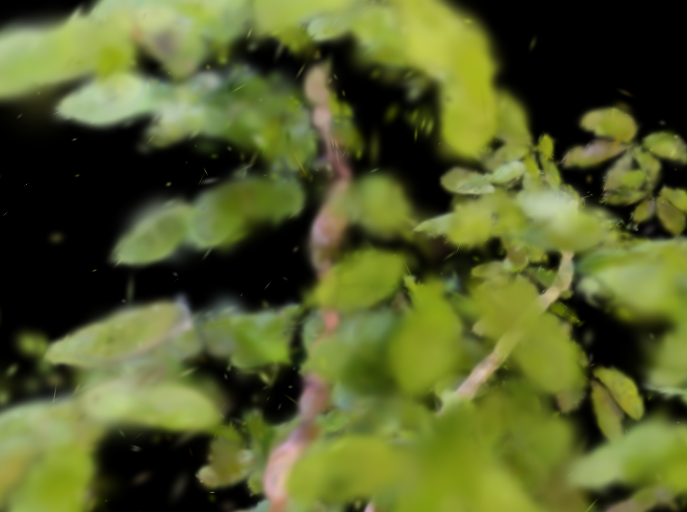
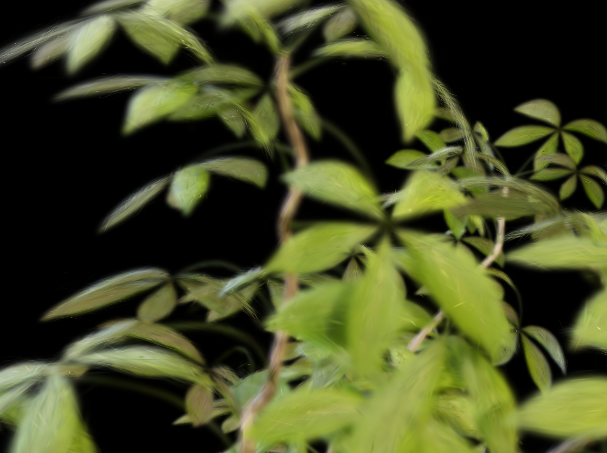
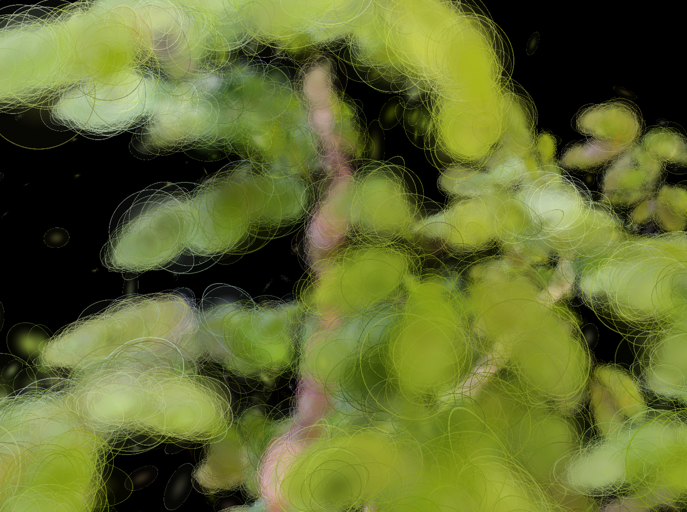
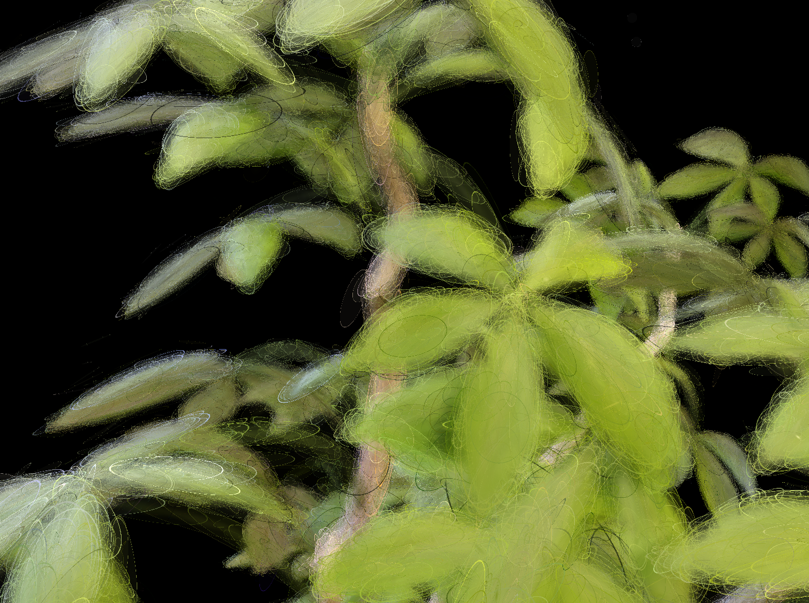

# EVER Ficus 렌더링 분석 보고서

**실험 대상:** EVER (Exact Volumetric Ellipsoid Rendering) vs GUT — NeRF Synthetic Ficus  

---

## 1. EVER 학습 시간 분석

### 1.1 반복당 단계별 소요 시간 (iter > 100 기준 평균)

| 단계 | 평균 (ms) | 비율 |
|---|---|---|
| **Forward** | 41.56 | 64.1% |
| Backward | 12.23 | 18.9% |
| Optimizer step | 5.67 | 8.7% |
| Loss 계산 | 1.38 | 2.1% |
| **총 iteration** | **64.8** | 100% |

- **총 학습 시간 (30k iter):** 32.5분
- **평균 처리 속도:** 15.4 it/s

### 1.2 Forward Pass 세부 분석

Forward pass(41.56ms) 내부 단계별 breakdown:

| 단계 | 평균 (ms) | 비율 |
|---|---|---|
| **optixLaunch** (OptiX 레이트레이싱) | 19.39 | **46.9%** |
| camera2rays (레이 생성) | 16.39 | 39.7% |
| gas_bvh (BVH 재구성) | 2.34 | 5.7% |
| eval_sh (구면 조화 함수 평가) | 0.39 | 1.0% |
| scale_density (밀도 변환) | 0.21 | 0.5% |

**Forward의 약 47%가 OptiX 레이트레이싱(optixLaunch)에 집중되며, 레이 생성(camera2rays) 포함 시 전체 forward의 86% 이상이 ray 관련 연산.**

---

## 2. EVER vs GUT 가우시안의 형태 시각적 비교

### 2.1 렌더링 결과 비교

| | EVER | GUT |
|---|---|---|
| **렌더링** |  |  |
| **SuperSplat 뷰어** |  |  |

---

## 3. Gaussian 형태 정량 분석 (구형도)

각 Gaussian의 3개 축 스케일 $s_{\min} \leq s_{\text{mid}} \leq s_{\max}$에 대해 구형도를 정의:

$$\text{Sphericity} = \frac{s_{\min}}{s_{\max}} \in (0, 1] \quad \text{(1 = 완전한 구, 0 = 완전히 납작한 디스크)}$$

| 지표 | EVER | GUT |
|---|---|---|
| 유효 Gaussian 수 | 670,609 | 55,169 |
| **구형도 평균** | **0.652** | **0.097** |
| 구형도 중앙값 | 0.660 | 0.062 |
| 이방성 평균 (max/min) | 2.46× | 25.17× |
| 이방성 중앙값 | 1.51× | 16.05× |
| 거의 구형 (>0.9) | 25.1% | 0.0% |
| 중간 (0.3~0.9) | 64.8% | 5.4% |
| **매우 납작 (<0.3)** | 10.1% | **94.6%** |

- **EVER:** 평균 구형도 0.652로 대부분 구형에 가까운 타원체. Volume rendering 기반이므로 방향에 무관하게 일관된 밀도 표현이 가능한 구형이 유리.
- **GUT:** 94.6%가 구형도 0.3 미만의 극단적으로 납작한 디스크형. Rasterization splat 구조에서 표면 텍스처 표현에 flat Gaussian이 효율적.

---

## 4. 결론

- EVER의 느린 학습 속도의 원인은 정교한 Gaussian 처리를 위한 레이 트레이싱의 결과로 보여진다. (Forward의 47%가 optixLaunch 단독 소비)

- EVER에서 최종 Gaussian의 형태는 surface 모델(GUT)에서 볼 수 없는 구형의 형태로 나타나며, 이는 volume rendering과 surface rasterization의 근본적인 표현 방식 차이를 반영한다.

- NeRF Synthetic처럼 배경이 없는 데이터셋에서 EVER의 density 기반 표현(softplus)은 배경 Gaussian을 완전히 제거하지 못해 시각적 artifact가 발생하며, 이는 opacity 기반 방법(GUT 등)에서는 나타나지 않아 실시간 뷰어에서 확인하기 어려움.