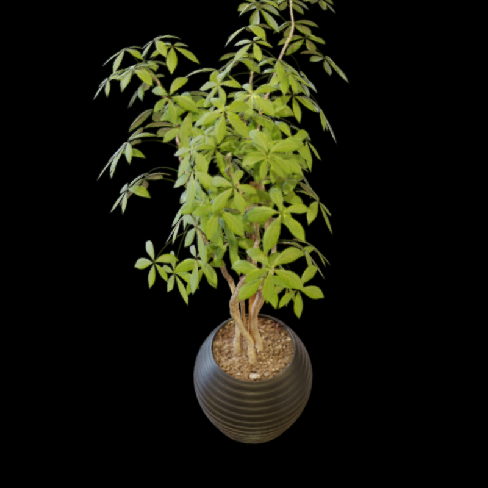
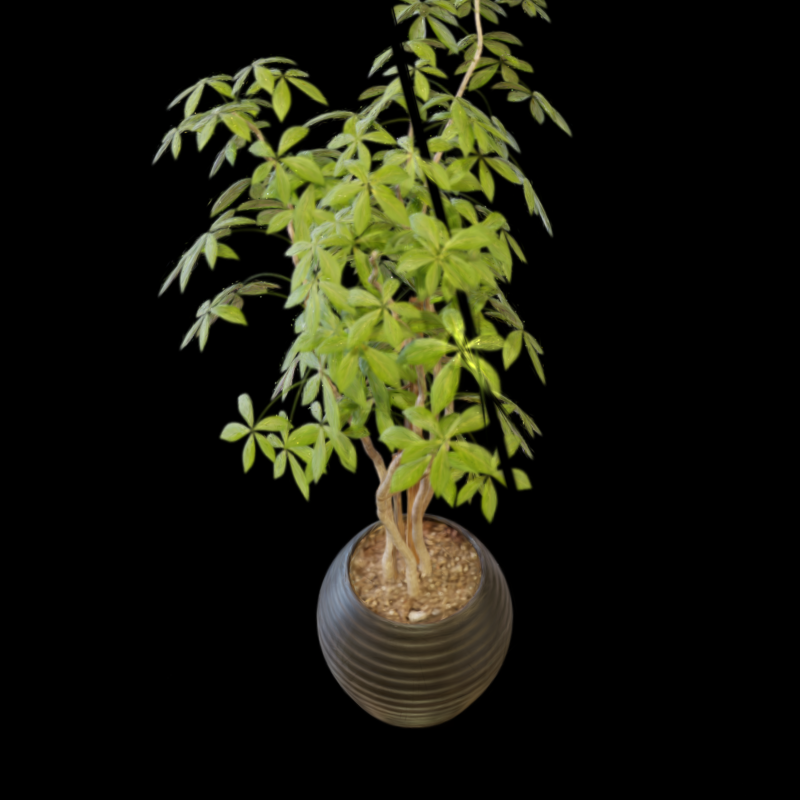
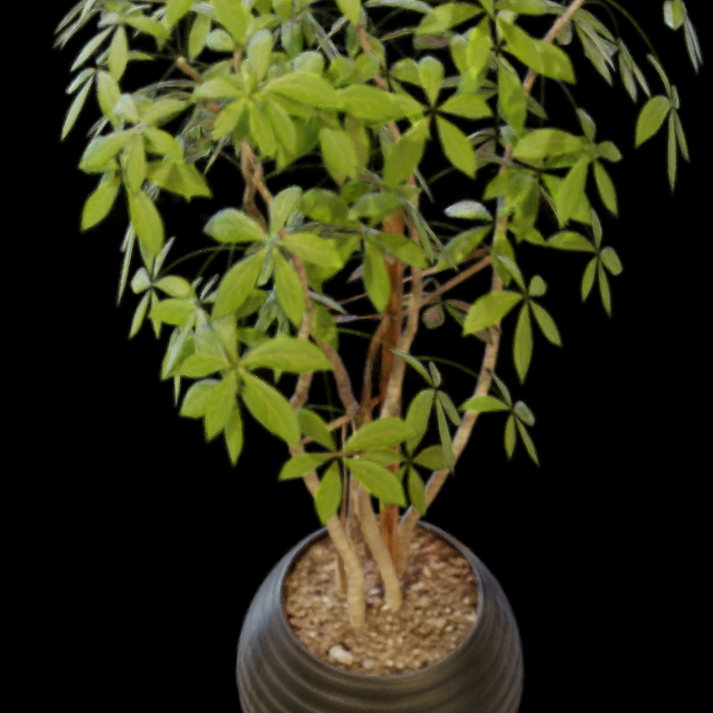
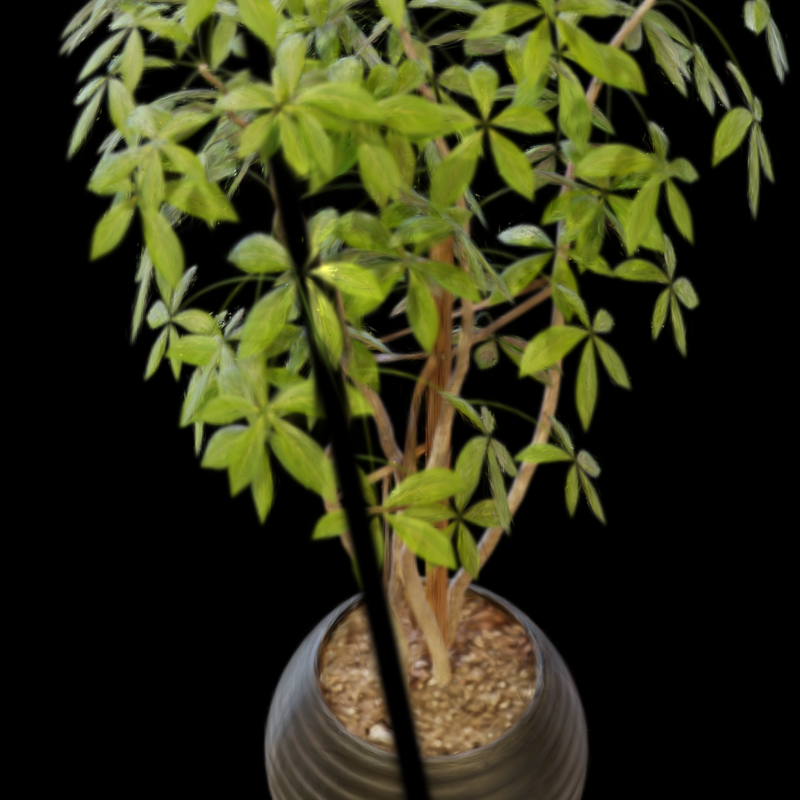
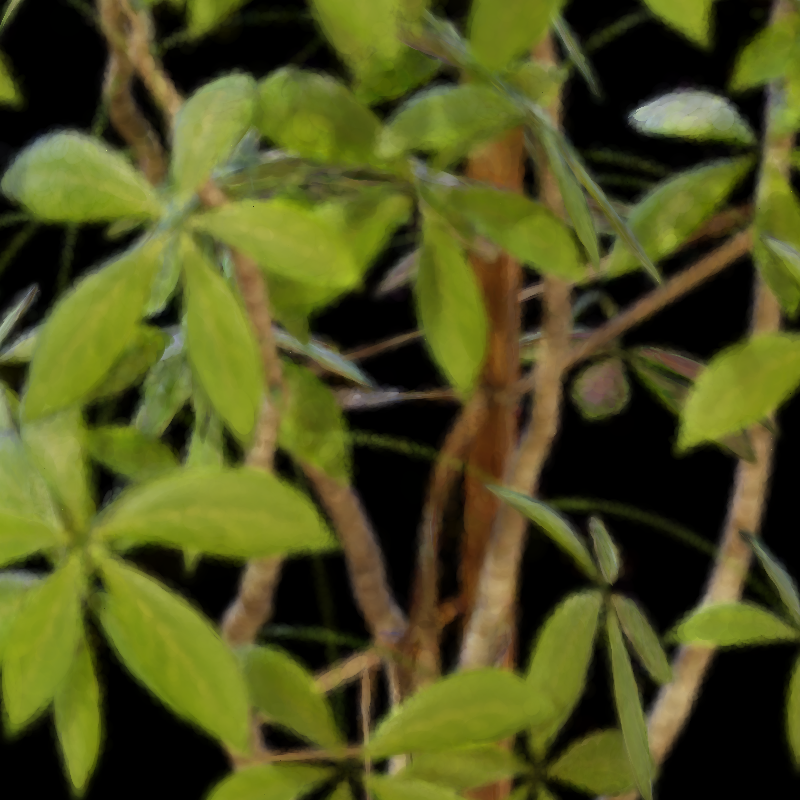
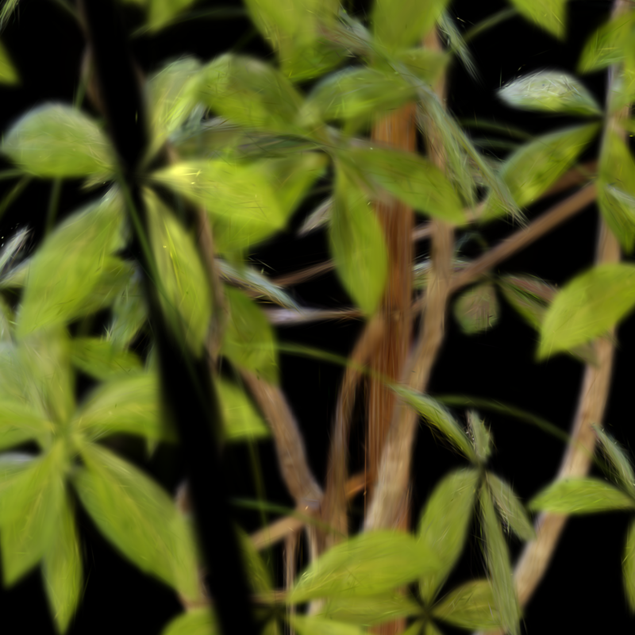

# EVER Ficus 렌더링 분석 보고서 v2

**실험 대상:** EVER (Exact Volumetric Ellipsoid Rendering) vs GUT — NeRF Synthetic Ficus  
**주요 추가 분석:** 배경 Gaussian 문제 원인 규명 및 해결

---

## 1. EVER 학습 시간 분석

### 1.1 반복당 단계별 소요 시간 (iter > 100 기준 평균)

| 단계 | 평균 (ms) | 비율 |
|---|---|---|
| **Forward** | 41.56 | 64.1% |
| Backward | 12.23 | 18.9% |
| Optimizer step | 5.67 | 8.7% |
| Loss 계산 | 1.38 | 2.1% |
| **총 iteration** | **64.8** | 100% |

- **총 학습 시간 (30k iter):** 32.5분
- **평균 처리 속도:** 15.4 it/s

### 1.2 Forward Pass 세부 분석

| 단계 | 평균 (ms) | 비율 |
|---|---|---|
| **optixLaunch** (OptiX 레이트레이싱) | 19.39 | **46.9%** |
| camera2rays (레이 생성) | 16.39 | 39.7% |
| gas_bvh (BVH 재구성) | 2.34 | 5.7% |
| eval_sh (구면 조화 함수 평가) | 0.39 | 1.0% |
| scale_density (밀도 변환) | 0.21 | 0.5% |

**Forward의 약 47%가 OptiX 레이트레이싱에 집중되며, 레이 생성(camera2rays) 포함 시 전체 forward의 86% 이상이 ray 관련 연산.**

---

## 2. EVER vs GUT 렌더링 결과 비교

### 2.1 학습 조건

| | EVER | GUT |
|---|---|---|
| SH degree | 2 | 2 (`max_n_features=2`) |
| 학습 반복 수 | 30,000 | 30,000 |
| 데이터셋 | NeRF Synthetic Ficus | NeRF Synthetic Ficus |

### 2.2 정량 비교

| 지표 | EVER | GUT (SH2) |
|---|---|---|
| **Test PSNR** | **34.7 dB** | **33.8 dB** |
| 유효 Gaussian 수 | 315,051 | 212,254 |
| 학습 시간 (30k iter) | ~42분 | ~9분 |

> **이전 보고서 대비 Gaussian 수 변화:** EVER는 배경을 학습에서 제거하기 위해 배경 Gaussian이 loss penalty를 받아 자연스럽게 pruning되어 670,609 → 315,051로 감소. GUT는 SH3(기본값, 55,169)에서 SH2로 변경 시 Gaussian당 색상 표현력이 낮아져 동일 장면을 표현하기 위해 densification이 더 많이 일어나 212,254로 증가.

### 2.3 렌더링 비교

| | EVER | GUT |
|---|---|---|
| **전경** |  |  |
| **중경** |  |  |
| **근접** |  |  |

> GUT 중경 이미지에서 줄기 영역의 검정 선 확인 가능 — SH2의 방향별 색상 표현력 부족으로 특정 시점에서 내부 줄기 Gaussian의 색상 평가값이 0으로 클램핑됨.

---

## 3. Gaussian 형태 정량 분석 (구형도)

$$\text{Sphericity} = \frac{s_{\min}}{s_{\max}} \in (0, 1] \quad \text{(1 = 완전한 구, 0 = 완전히 납작한 디스크)}$$

| 지표 | EVER  | GUT |
|---|---|---|
| 유효 Gaussian 수 | 315,051 | 212,254 |
| **구형도 평균** | **0.648** | **0.097** |
| 구형도 중앙값 | 0.736 | 0.062 |
| 이방성 평균 (max/min) | 6.62× | 25.17× |
| 이방성 중앙값 | 1.36× | 16.05× |
| 거의 구형 (>0.9) | 29.8% | 0.0% |
| 중간 (0.3~0.9) | 52.0% | 5.4% |
| **매우 납작 (<0.3)** | 18.2% | **94.6%** |

- **EVER:** 구형도 평균 0.648. Volume rendering 기반이므로 방향에 무관하게 일관된 밀도 표현이 가능한 구형이 유리. mask 제거 후 배경 Gaussian 거의 없어져 분포가 더 깔끔해짐.
- **GUT:** 94.6%가 구형도 0.3 미만의 극단적으로 납작한 디스크형. Rasterization splat 구조에서 표면 텍스처 표현에 flat Gaussian이 효율적.

---

## 4. GUT SH2 학습 중 발생한 문제 및 수정

### 4.1 SH2 학습 결과 검정 프레임 문제

테스트 200장 중 **58장(29%)이 완전 검정 렌더**로 출력됨. 

**원인:** `max_n_features: 2` 파라미터 하나만 변경했으나, SH2의 낮은 색상 표현력과 기본값으로 비활성화된 scale pruning의 조합이 문제를 유발.

| 요소 | SH3 기본 설정 | SH2 실험 |
|---|---|---|
| 방향별 색상 표현력 | 높음 (16 coeffs/채널) | 낮음 (9 coeffs/채널) |
| `prune_scale.start_iteration` | -1 (비활성, 기본값) | -1 (비활성, 동일) |
| 배경 Gaussian 크기 | 방향별 어둡게 표현 → 소형 유지 | 방향별 표현 불가 → 크기로 보상 |
| 결과 | 정상 | scale > 100 Gaussian 38개 생성 |

SH2에서 배경 Gaussian이 방향 의존적 색상을 표현하지 못하므로 크기를 키워 loss를 줄이려 하고, scale pruning이 꺼져 있어 제한 없이 성장. 이 극단 Gaussian(scale 최대 1,790)이 특정 카메라 각도에서 view frustum에 진입해 k-buffer(크기 16)를 포화시켜 검정 출력 발생.

**해결:** `prune_scale` 활성화 후 재학습.

```yaml
strategy:
  prune_scale:
    start_iteration: 500   # -1 → 500으로 변경
    end_iteration: 15000
    threshold: 1.0
```


**재학습 결과:**

| 지표 | prune_scale 비활성 | prune_scale 활성 |
|---|---|---|
| Test PSNR | 28.0 dB | **33.8 dB** |
| std PSNR | 7.82 | **2.92** |
| 검정 프레임 | 58/200 (29%) | **0/200** |
| scale > 100 Gaussian | 38개 | **0개** |

### 4.2 SH2 검정 선 Artifact

prune_scale 활성화 후 검정 프레임 문제는 해결됐으나, 특정 시점에서 줄기 영역에 **검정 선 형태의 시각적 artifact** 잔존.


**원인:** SH degree 2의 방향별 색상 표현력 한계.

- SH2: 채널당 9개 계수 → 낮은 각도 해상도
- SH3: 채널당 16개 계수 → 높은 각도 해상도

줄기 내부 Gaussian이 학습 카메라 시점에서 올바른 색상을 학습했더라도, 테스트 시점에서 SH2의 낮은 주파수 표현이 해당 방향에서 색상 평가값을 음수 영역으로 끌어내림 → 렌더러가 0으로 클램핑 → 검정.

EVER는 softplus density + volumetric 적분 방식으로 방향 의존성이 완화되어 동일 artifact 미발생. SH3로 학습 시 더 높은 각도 해상도로 해당 시점도 올바르게 표현 가능.

---
