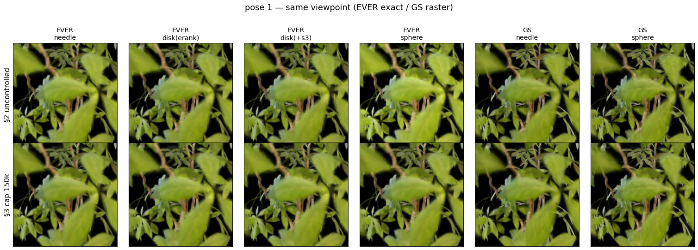
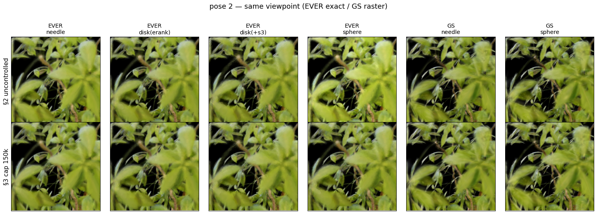
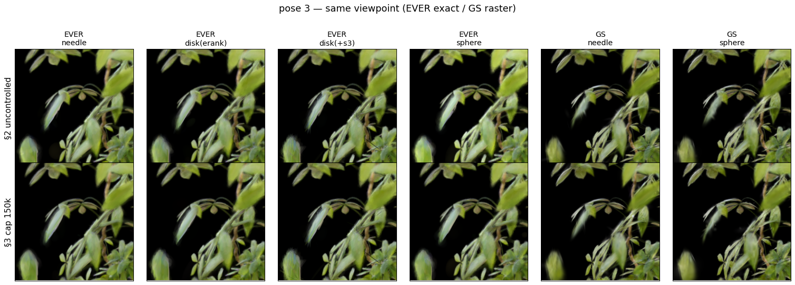
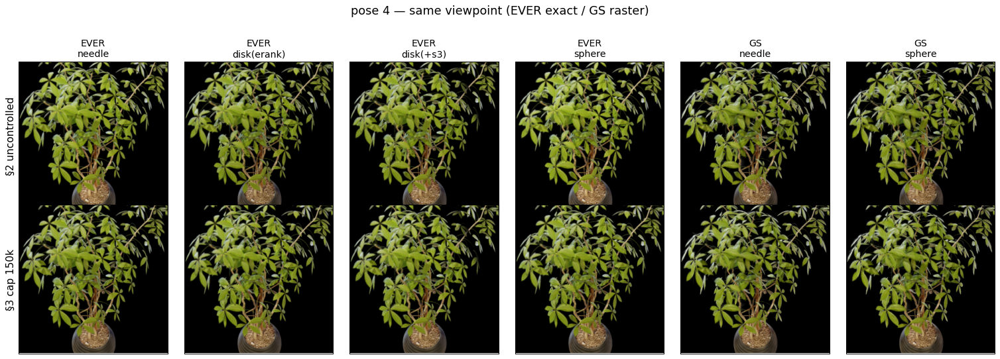
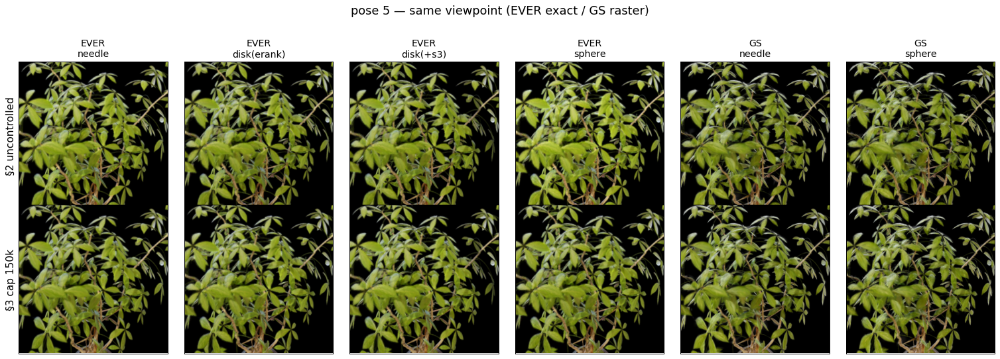
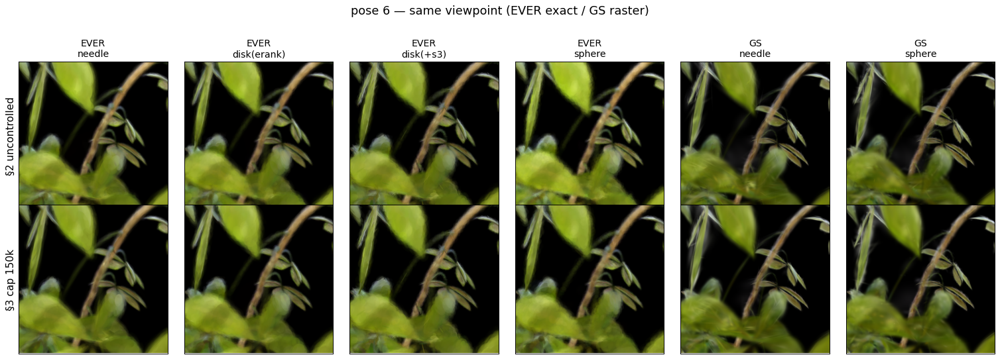
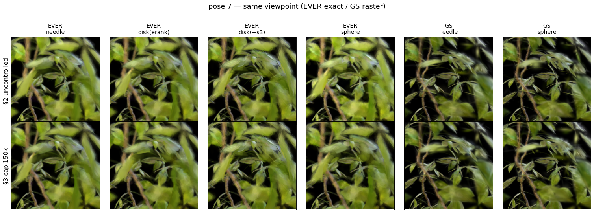
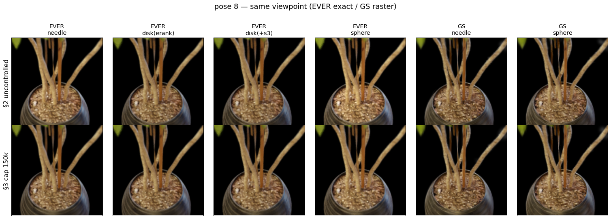

# 가우시안 프리미티브의 형태 (Needle / Disk / Sphere) 정리

각 3D 가우시안은 3개의 축 스케일 $s_1 \ge s_2 \ge s_3$ (정렬된 표준편차)로 형태가 결정된다.
세 축의 상대적 크기에 따라 프리미티브는 크게 **세 가지 형태**를 가진다.

---

## 1. 세 가지 형태

| 형태 | 축 관계 | 차원성 | effective rank | 직관 |
|---|---|---|---|---|
| **Needle (바늘/선형)** | $s_1 \gg s_2 \approx s_3$ | 1D (선) | $\approx 1$ | 한 축만 김. 얇은 막대 |
| **Disk (원반/평면)** | $s_1 \approx s_2 \gg s_3$ | 2D (면) | $\approx 2$ | 두 축은 크고 한 축만 얇음. 납작한 판 |
| **Sphere (구/등방)** | $s_1 \approx s_2 \approx s_3$ | 3D (부피) | $\approx 3$ | 세 축이 균등. 공 |

*세 축 스케일 비율에 따른 실제 타원체 형태 (좌: needle, 중: disk, 우: sphere). 렌더 스크립트: `notes/render_shapes.py`*

**형태 측정 지표 (요약):** 각 가우시안을 **Westin 삼분류**로 needle/disk/sphere 중 하나로 분류
($c_l=(s_1{-}s_2)/s_1$, $c_p=(s_2{-}s_3)/s_1$, $c_s=s_3/s_1$ 의 argmax). 단일 비율 sphericity($s_{\min}/s_{\max}$)는 needle과 disk를 못 가려 사용하지 않음. (effective rank: 원 Roy & Vetterli 2007 / GS 적용 erank 2406.11672; Westin: 확산텐서 MRI에서 차용.)

---

## 2. 결과 ① — 개수 미통제 (자연 수렴, ficus, 30k)

각 config를 규제만 바꿔 자연 수렴시킨 결과. **개수가 config마다 크게 달라** 속도·화질 비교에 개수 교란이 섞임.

### EVER (레이트레이싱)
| | **Needle** (λ=0) | **Disk / erank-only** | **Disk / erank+s₃** | **Sphere** (기본 λ=0.1) |
|---|---|---|---|---|
| 지배 형태 | needle 70% | disk 47% | disk 99% | sphere 63% |
| gaussian 수 | 180k | 205k | **150k** | **315k** |
| FPS (인퍼런스) | 57.6 | 81.0 | **114.3** | 77.8 |
| PSNR | **34.92** | 34.76 | 34.51 | 34.73 |
| SSIM | **0.9857** | 0.9851 | 0.9839 | 0.9849 |
| LPIPS | **0.0138** | 0.0150 | 0.0199 | 0.0156 |

### GS (3DGS 원조, 래스터라이제이션)
| | **Needle** (λ=0, 기본) | **Sphere** (EVER 패널티 주입 λ=0.1) |
|---|---|---|
| 지배 형태 | needle 80% | sphere 53% |
| gaussian 수 | 291k | 308k |
| FPS (인퍼런스) | 373.1 | **423.7** |
| PSNR | **34.85** | 34.71 |
| SSIM | **0.9872** | 0.9867 |
| LPIPS | **0.0117** | 0.0120 |

*(GS FPS는 타일 래스터 기준이라 EVER의 레이트레이싱 FPS(수십)와 절대값 직접 비교는 불가. 단 GS 내부에선 **sphere가 개수 많은데도 needle보다 빠름** — 둥근 2D footprint가 적은 타일만 덮기 때문. 화질은 needle이 소폭 우위.)*

**관찰**
- 규제 없으면 EVER·GS 모두 **needle**로 수렴. 화질(PSNR/SSIM/LPIPS)은 needle이 최고.
- EVER **sphere(기본)는 개수가 압도적(315k)** — 구는 표현력이 낮아 같은 디테일에 더 많은 프리미티브 필요.
- 이 개수 차이가 FPS 비교를 교란(§3에서 통제).

---

## 3. 결과 ② — 개수 통제 (spawn_cap=150k, ficus, 30k)

개수 교란 제거를 위해 **spawn_cap=150k**(자연 최소 개수)로 모두 학습 → 전 config가 ~150k로 동일. (spawn_cap = 총 개수 상한, 초과분은 gradient top-K 유지: [scene/gaussian_model.py:713](../scene/gaussian_model.py#L713).)

### EVER (레이트레이싱)
| **모두 ~150k** | **Needle** (λ=0) | **Disk / erank-only** | **Disk / erank+s₃** | **Sphere** (기본) |
|---|---|---|---|---|
| 지배 형태 | needle 72% | disk 51% | disk 99% | sphere 61% |
| gaussian 수 | 145.9k | 147.7k | 150.3k | 149.2k |
| PSNR | **34.89** | 34.74 | 34.51 | 34.69 |
| SSIM | **0.9856** | 0.9850 | 0.9839 | 0.9847 |
| LPIPS | **0.0140** | 0.0152 | 0.0199 | 0.0161 |
| FPS (인퍼런스) | 65.4 | 91.1 | **114.3** | 113.6 |

### GS (3DGS 원조)
| **모두 150k** | **Needle** (λ=0) | **Sphere** (λ=0.1 주입) |
|---|---|---|
| 지배 형태 | needle 77% | sphere 51% |
| gaussian 수 | 150.0k | 150.0k |
| PSNR | **34.83** | 34.71 |
| SSIM | **0.9872** | 0.9868 |
| LPIPS | **0.0118** | 0.0120 |
| FPS (인퍼런스) | 514.3 | **627.7** |

*(PSNR/SSIM/LPIPS: metrics.py / FPS: measure_fps(.gs). GS FPS 절대값은 타일 래스터라 EVER와 직접 비교 불가.)*

**관찰 — 순수 shape 효과 (개수 교란 제거)**
- **속도**: 둥글/납작할수록 빠름 — EVER: sphere≈disk(114) > erank(91) > needle(65); GS: sphere(628) > needle(514). **두 렌더러 모두 sphere가 needle보다 빠름** (EVER는 AABB, GS는 2D 타일 footprint).
- **화질**: needle > (erank) > sphere > disk+s₃. EVER·GS 모두 needle이 최고. 이방성(needle)이 표현력 최고, 과평탄 disk(s₃)가 최저.

**핵심 교정 (개수 통제가 밝힌 것)**
- 자연 개수에서 보였던 "disk/erank가 sphere보다 유리"는 **대부분 개수 교란**이었다.
- **sphere를 315k→150k로 반토막 내도 PSNR 거의 불변(34.73→34.69)** → sphere의 진짜 약점은 shape가 아니라 **패널티가 유발한 과densification(개수 낭비)**.
- 동일 개수에선 **sphere도 정상적 Pareto 지점**(빠름+준수 화질)이고, 오히려 **disk+s₃가 sphere에 열등**(속도 동일, 화질 최저).
- 따라서 EVER 기본의 실질 개선점은 "shape를 disk로 교체"가 아니라 **개수 통제(spawn_cap)** 일 수 있다.

---

## 4. 시점별 렌더 비교 (같은 포즈, EVER exact / GS raster)

동일 카메라 포즈 8개로 각 모델을 렌더한 비교. 각 그리드: **상단 §2 미통제 / 하단 §3 cap150k**, 열 = shape (EVER needle·disk(erank)·disk(+s₃)·sphere / GS needle·sphere). EVER는 splinerender(exact 볼류메트릭), GS는 rasterizer, 배경 검정 통일.

> 모델별 원본 렌더·ply는 `Desktop/0708/<모델태그>/` 에 정리됨 (원본 ply 1개 + 8포즈 png).

---

## 핵심 한 줄
> 규제 없으면 needle(화질↑·느림), 둥글수록 BVH 빠름(sphere/disk).
> 단 sphere 기본의 비효율은 shape가 아니라 **과densification**이며, 개수만 통제하면 sphere도 효율적이다.
