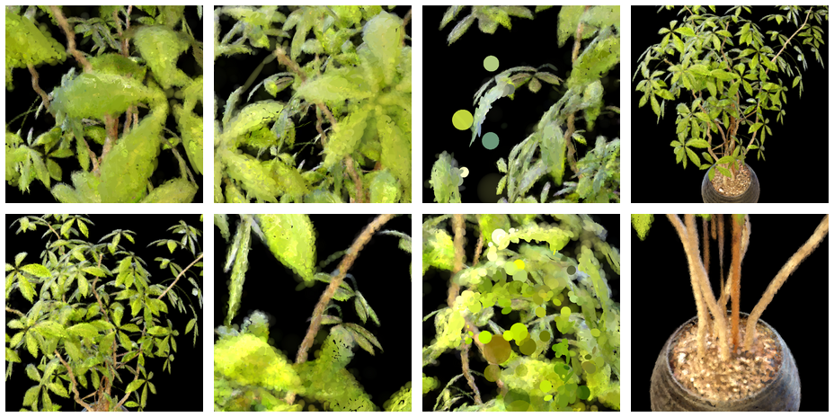
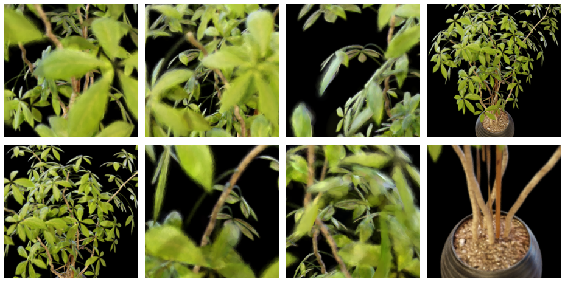
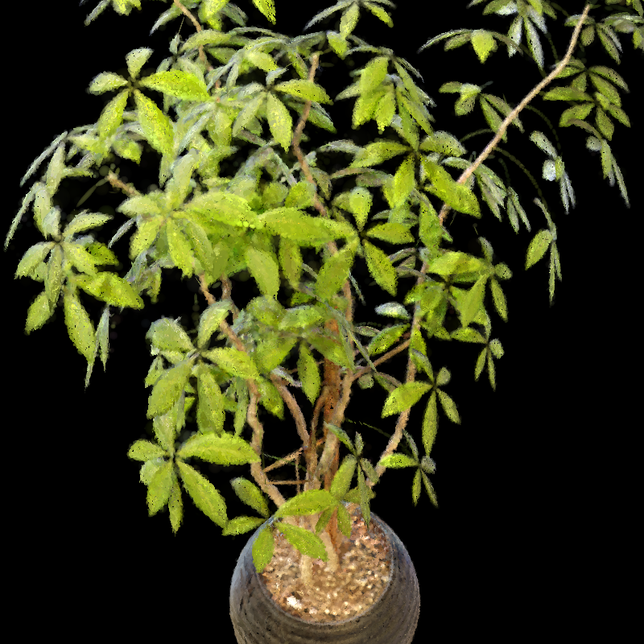
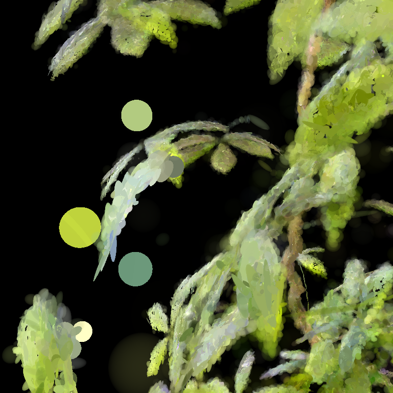
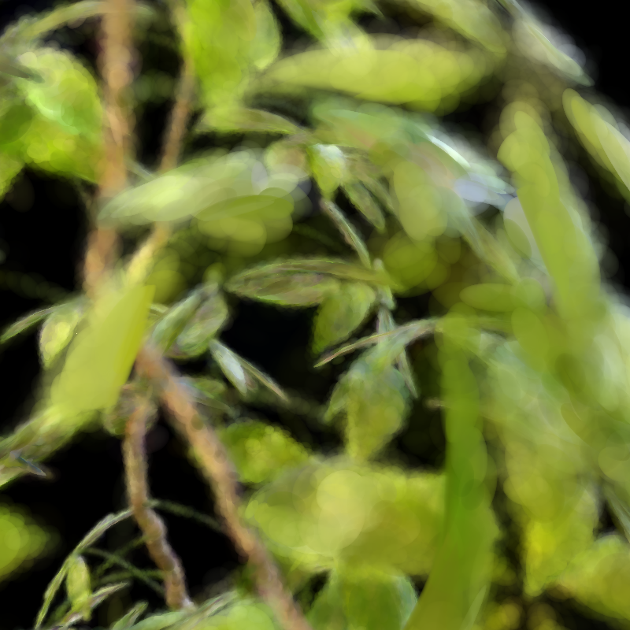
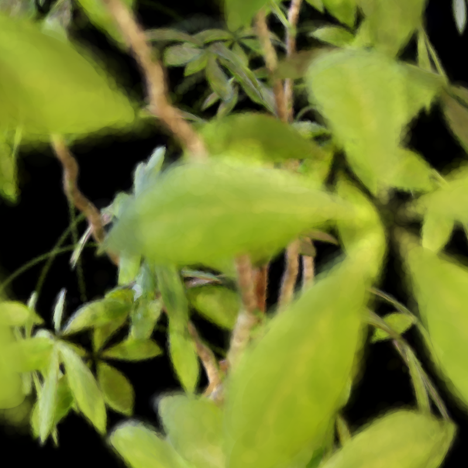

# 근사구조 vs EVER-sphere Ficus 렌더링 비교 보고서

**실험 대상:** NeRF Synthetic Ficus, 근사구조(30k) vs EVER sphere  
**이미지 폴더:** `report_image_모진수/260714/`  
**핵심 질문:** 근사구조 방식과 EVER sphere 방식이 동일 Ficus 씬에서 화질·아티팩트에서 어떤 차이를 보이는가

---

## 1. 요약

- 두 폴더 모두 동일한 **Ficus** 씬을 8개 동일 시점(pose_1~8)에서 렌더링한 결과이다.
- **근사구조**는 잎의 질감·잎맥 등 고주파 디테일이 살아 있지만, 근접 시점에서 **떠 있는 원형 blob splat 아티팩트**가 뚜렷하게 남는다.
- **EVER sphere**는 8개 시점 전체에서 떠 있는 blob 아티팩트가 **관찰되지 않아** 깨끗하지만, 근접 시점에서 잎이 **뭉개지듯 흐려지는(soft/bokeh) 경향**이 있다.
- 즉 이번 비교의 핵심은 "어느 쪽이 낫다"가 아니라 **디테일(근사구조) ↔ 아티팩트 억제·매끈함(EVER)** 의 트레이드오프이다.

---

## 2. 실험 조건

| 항목 | 내용 |
|---|---|
| 데이터셋 | NeRF Synthetic **Ficus** |
| 비교 방법 A | **근사구조** (`ficus_zt_posaware_geom01_full_30000`) |
| 비교 방법 B | **EVER** (`s2_ever_sphere`) |
| 반복 수 | A: 30k |
| 시점 수 | 각 방법 8 pose (pose_1 ~ pose_8) |
| 보조 산출물 | A: `contact_sheet_zt_geom01.png` / B: `contact_sheet_ever_sphere.png`(pose_1~8로 생성), `s2_ever_sphere.ply` |

---

## 3. 핵심 이미지 비교

### 3.1 대표 결과 (근사구조 컨택트 시트)

*근사구조의 8개 시점을 한눈에 본 것. 원경(pose_4, pose_8)은 나무·화분 형태가 잘 잡히지만, 근접 시점(pose_3, pose_7)에서는 잎 사이 빈 공간에 반투명 원형 splat이 떠 있는 것이 보인다.*

### 3.2 대표 결과 (EVER sphere 컨택트 시트)

*3.1과 동일한 시점·동일한 배치(pose_1~8, 4×2)로 정리한 EVER sphere 결과. 근사구조에서 floater가 뚜렷했던 pose_3·pose_7 자리에도 떠 있는 원형 splat이 보이지 않으며, **8개 시점 전체에서 floater가 관찰되지 않는다.** 반면 잎 표면은 speckle 없이 매끈하지만 근접 시점(pose_2, pose_3, pose_6, pose_7)에서 잎 경계가 전반적으로 부드럽게 뭉개진다.*

**3.1 vs 3.2 한눈 비교**

| 항목 | 근사구조 (3.1) | EVER sphere (3.2) |
|---|---|---|
| floater | pose_3, pose_7에서 뚜렷 | 8개 시점 모두 없음 |
| 잎 질감 | speckle 있고 거칠지만 잎맥 또렷 | 매끈하고 균일 |
| 근접 선명도 | 개별 잎 구분 뚜렷 | bokeh처럼 흐려짐 |
| 원경(pose_4, 8) | 형태·디테일 양호 | 형태 양호, 약간 부드러움 |

### 3.3 전체 나무 원경 비교 (pose_4)

| 근사구조 | EVER sphere |
|---|---|
|  |  |

**관찰**
- 근사구조는 잎 표면에 미세한 점무늬(speckle)가 있어 질감이 거칠지만 잎의 윤곽·잎맥이 또렷하다.
- EVER sphere는 잎이 더 매끈하고 색이 균일하며 speckle이 거의 없다. 대신 잎 경계가 약간 부드럽다.

### 3.4 근접 시점 비교 (근사구조 pose_3 vs EVER pose_7)

| 근사구조 (근접) | EVER sphere (근접) |
|---|---|
|  |  |

**관찰**
- 근사구조 근접에서는 잎 사이 검은 배경 위로 **뚜렷한 원형 blob splat(연두·청록·흰색)** 이 떠 있다 → floater 아티팩트.
- EVER sphere 근접에서는 떠 있는 blob은 없지만 잎이 **bokeh처럼 흐려져** 개별 잎 구분이 약해진다.

### 3.5 매끈함 참고 (EVER pose_1)

*EVER sphere의 부드러운 표현이 잘 드러나는 시점. 색 전이가 매끄럽고 floater가 없으나, 근접에서 초점이 나간 듯한 blur가 남는다.*

---

