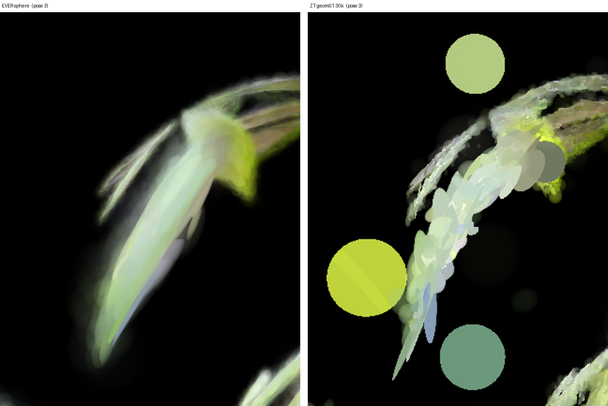
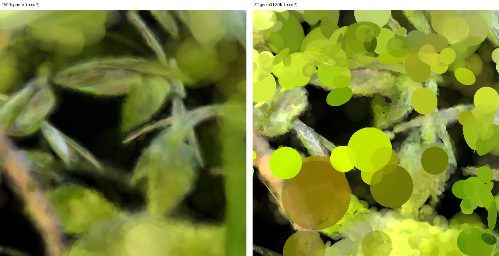
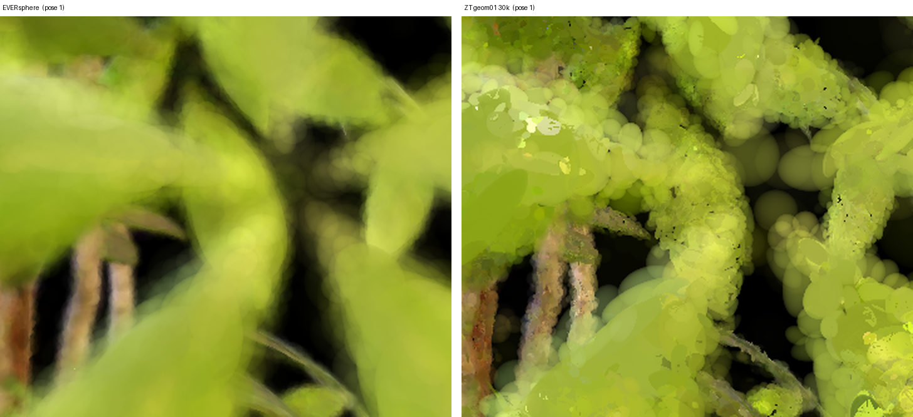
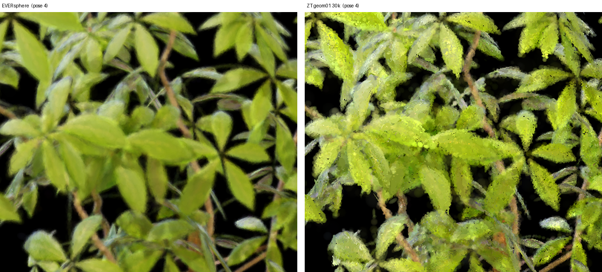
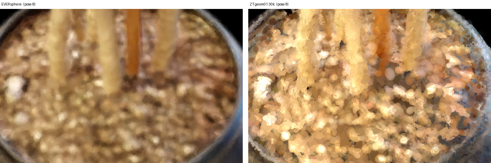

# 근사구조(ZT geom01) vs EVER sphere Ficus 렌더링 비교 보고서

**실험 대상:** NeRF Synthetic Ficus, 근사구조 ZT geom01 (30k) vs EVER sphere  
**이미지 폴더:** `report_image_모진수/260714/`  
**핵심 질문:** 근사구조 방식과 EVER sphere 방식이 동일 Ficus 씬에서 화질·아티팩트에서 어떤 차이를 보이는가

---

## 1. 실험 조건

| 항목 | 내용 |
|---|---|
| 데이터셋 | NeRF Synthetic **Ficus** |
| 비교 방법 A | **근사구조 ZT geom01** (`ficus_zt_posaware_geom01_full_30000`) |
| 비교 방법 B | **EVER sphere** (`s2_ever_sphere`) |
| 반복 수 | A: 30k |
| 시점 수 | 각 방법 8 pose (pose_1 ~ pose_8), 800×800 |
| 보조 산출물 | A: `contact_sheet_zt_geom01.png` / B: `contact_sheet_ever_sphere.png`, `s2_ever_sphere.ply` |
| 비교 crop | `report_image_모진수/260714/crop_ever_vs_zt/` (본 보고서에서 생성) |

---

## 2. 핵심 이미지 비교

### 2.1 대표 결과 (EVER sphere 컨택트 시트)

*8개 시점 전체에서 floater가 없고 색 전이가 매끄럽다. 근접 시점(pose_1, 2, 3, 6, 7)은 전반적으로 초점이 나간 듯 부드럽고, 원경(pose_4, 8)은 나무·화분 형태가 안정적으로 잡힌다.*

### 2.2 대표 결과 (근사구조 ZT geom01 컨택트 시트)

*2.1과 동일한 시점·동일한 배치(pose_1~8, 4×2)로 정리한 근사구조 결과. 원경(pose_4, 8)은 EVER보다 잎 윤곽이 또렷하지만, **근접 시점에서는 잎이 불투명한 원형 splat 덩어리로 분해된다.** 특히 pose_3·pose_7은 배경 위에 떠 있는 원반이 축소 상태에서도 바로 보인다.*

### 2.3 배경 floater — 근사구조의 결정적 약점 (pose_3 crop)

### 2.4 근접 시점 붕괴 — 화면 전체가 원반으로 덮임 (pose_7 crop)

### 2.5 잎 표면 질감 — 근사구조의 splat 알갱이 노출 (pose_1 crop)

### 2.6 원경 디테일 — 근사구조가 앞서는 지점 (pose_4 crop)

### 2.7 화분·줄기 텍스처 (pose_8 crop)

