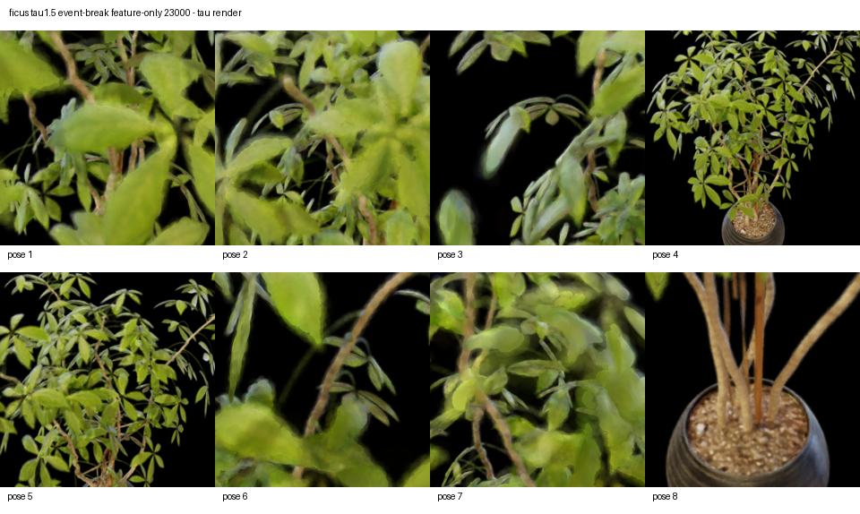
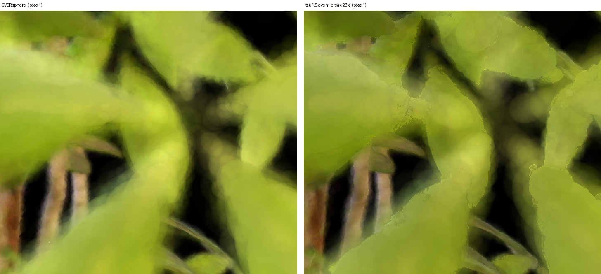
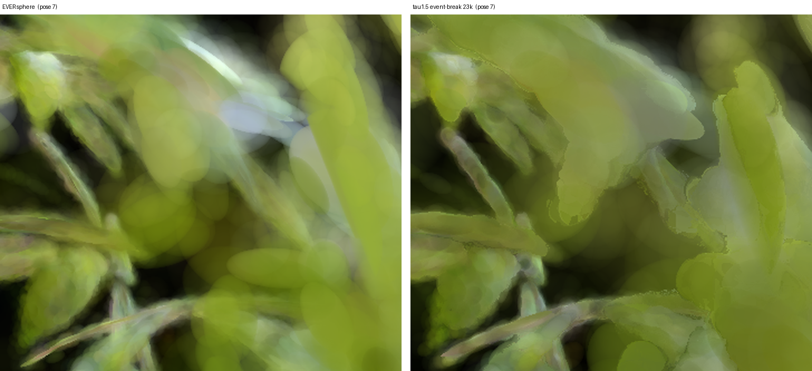
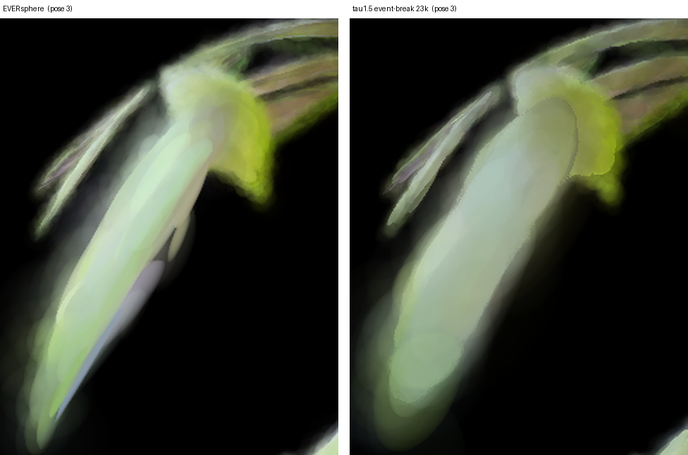
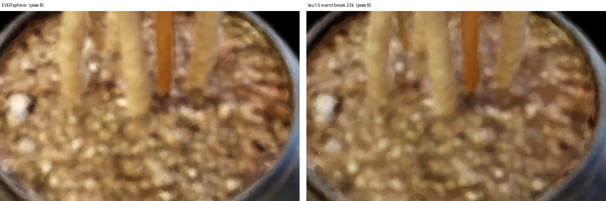
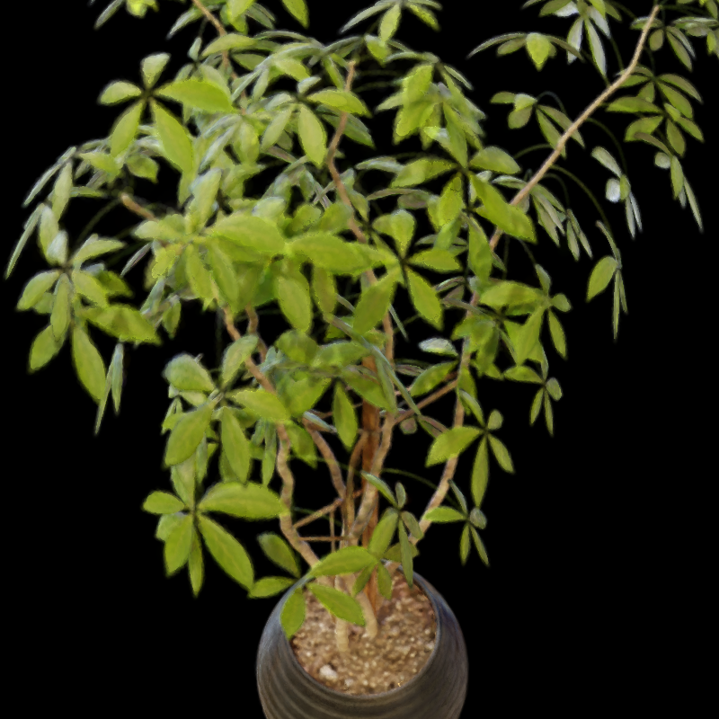

# EVER sphere vs τ=1.5 event-break Ficus 렌더링 비교 보고서

**실험 대상:** NeRF Synthetic Ficus, EVER sphere vs τ=1.5 event-break feature-only (23k)  
**이미지 폴더:** `report_image_모진수/260714/`  
**핵심 질문:** τ=1.5 event-break 설정이 EVER sphere 대비 렌더링 화질·아티팩트에서 어떤 차이를 만드는가

---

## 1. 실험 조건

| 항목 | 내용 |
|---|---|
| 데이터셋 | NeRF Synthetic **Ficus** |
| 비교 방법 A | **EVER** (`s2_ever_sphere`) |
| 비교 방법 B | **τ=1.5 event-break feature-only** (`ficus_tau1p5_eventbreak_featureonly_23000_tau`) |
| 반복 수 | B: 23k |
| 시점 수 | 각 방법 8 pose (pose_1 ~ pose_8), 800×800 |
| 보조 산출물 | A: `contact_sheet_ever_sphere.png`, `s2_ever_sphere.ply` / B: `contact_sheet_tau.png` |
| 비교 crop | `report_image_모진수/260714/crop_ever_vs_tau/` (본 보고서에서 생성) |

---

## 2. 핵심 이미지 비교

### 2.1 대표 결과 (EVER sphere 컨택트 시트)

*8개 시점 전체에서 floater가 없고 색 전이가 매끄럽다. 근접 시점(pose_1, 2, 3, 6, 7)은 전반적으로 초점이 나간 듯 부드럽고, 원경(pose_4, 8)은 나무·화분 형태가 안정적으로 잡힌다.*

### 2.2 대표 결과 (τ=1.5 event-break 컨택트 시트)

*2.1과 동일한 시점·동일한 배치(pose_1~8, 4×2)로 정리한 τ 결과. **여기서도 floater는 8개 시점 모두에서 관찰되지 않는다.** 축소해서 보면 2.1과 구도·형태가 거의 같아 보이지만, 잎 하나하나의 윤곽이 더 또렷하게 끊어져 있고 전체 톤이 한 단계 어둡다.*

### 2.3 잎 경계 — τ의 가장 뚜렷한 이득 (pose_1 근접 crop)

### 2.4 초점 이탈 영역 — τ가 불리해지는 지점 (pose_7 근접 crop)

### 2.5 극근접 잎 — τ가 형태를 뭉개는 지점 (pose_3 crop)

### 2.6 원경·정밀 텍스처 (pose_8 화분 crop)

### 2.7 원경 전체 나무 (pose_4)

| EVER sphere | τ=1.5 event-break |
|---|---|
|  |  |
