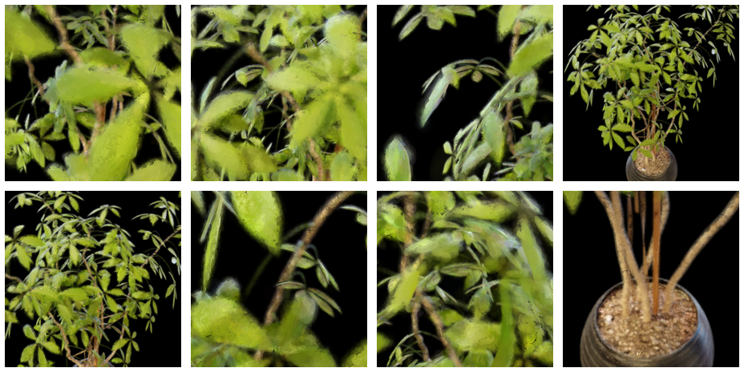
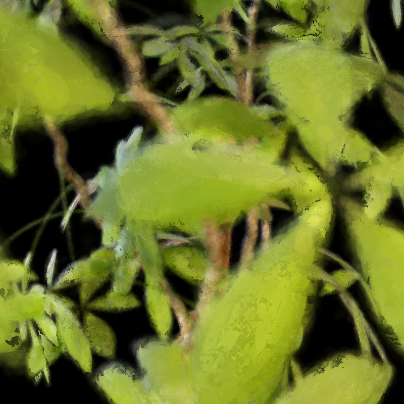
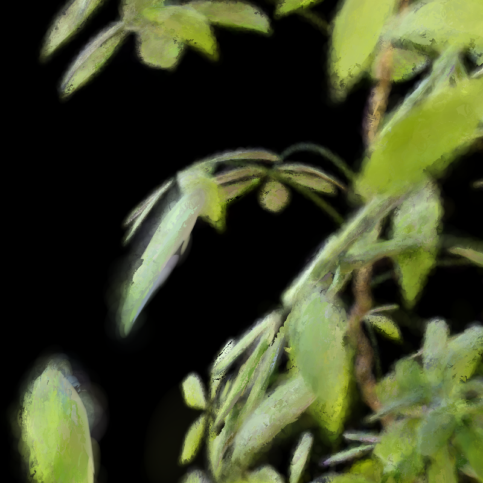
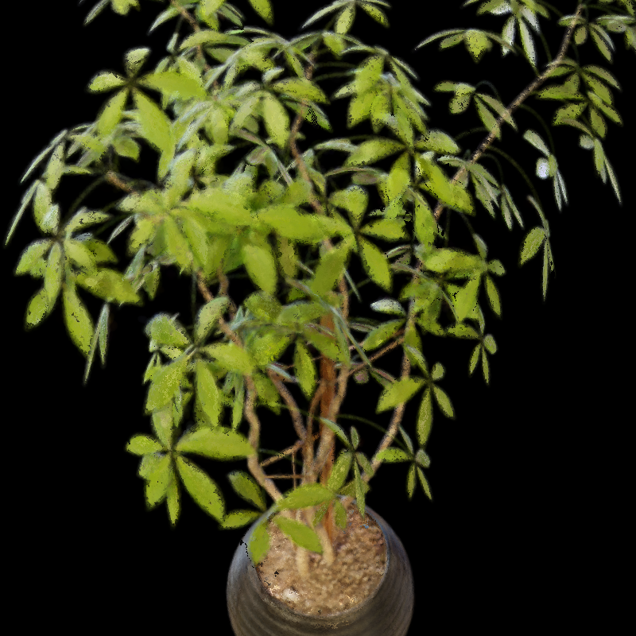
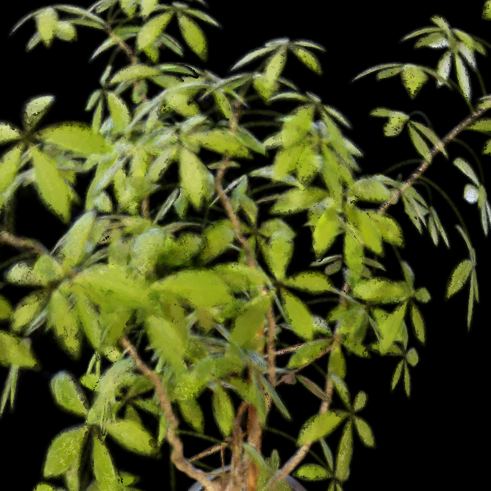
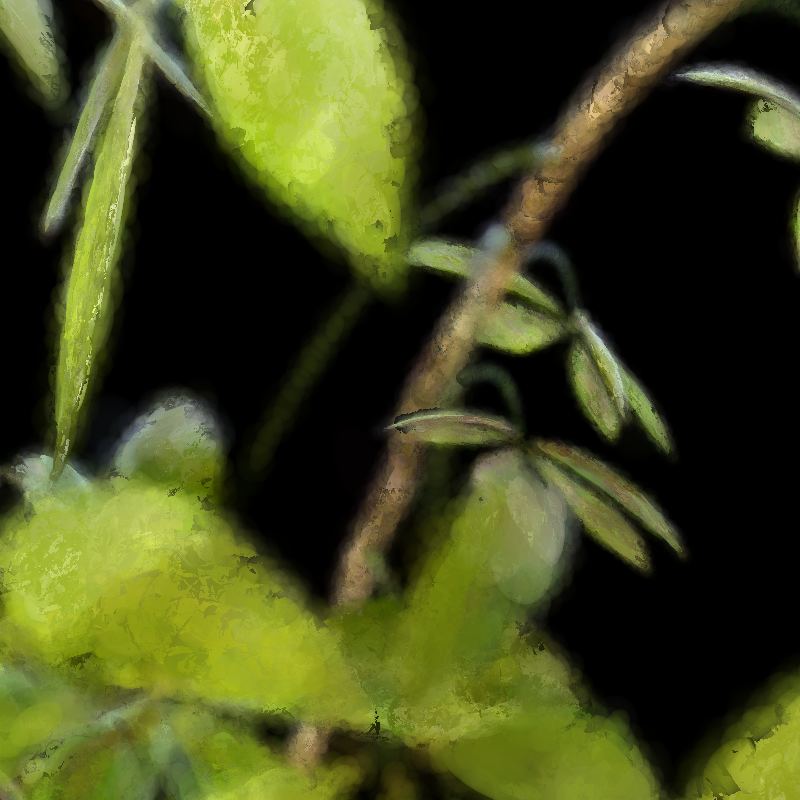
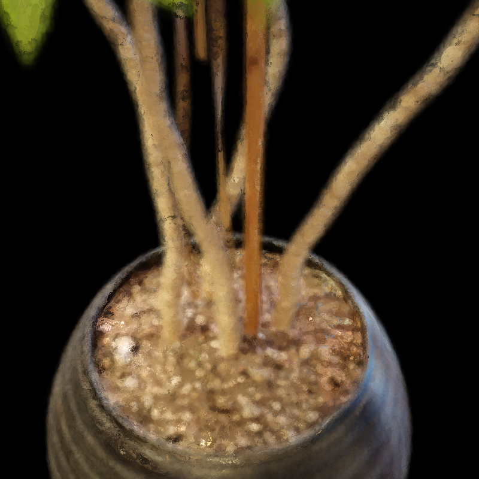

# ficus 근사구조 vs exact 렌더링 비교 보고서

**실험 대상:** Ficus, 근사구조 vs exact  
**이미지 폴더:** `report_image_모진수/260715/`  
**핵심 질문:** 근사구조 방식과 exact 방식이 동일 Ficus 씬에서 어떤 차이를 보이는가

---

## 1. 실험 조건

| 항목 | 내용 |
|---|---|
| 데이터셋 | **Ficus** |
| 비교 방법 A | **근사구조** (`ficus_fast_zt_single`) |
| 비교 방법 B | **exact** (`ficus_exact`) |
| 시점 수 | 각 방법 8 pose (pose_1 ~ pose_8), 800×800 |

---

## 2. 핵심 이미지 비교

### 2.1 컨택트 시트 (근사구조)

### 2.2 컨택트 시트 (exact)

### 2.3 pose_1

| 근사구조 | exact |
|---|---|
|  |  |

### 2.4 pose_2

| 근사구조 | exact |
|---|---|
|  |  |

### 2.5 pose_3

| 근사구조 | exact |
|---|---|
|  |  |

### 2.6 pose_4

| 근사구조 | exact |
|---|---|
|  |  |

### 2.7 pose_5

| 근사구조 | exact |
|---|---|
|  |  |

### 2.8 pose_6

| 근사구조 | exact |
|---|---|
|  |  |

### 2.9 pose_7

| 근사구조 | exact |
|---|---|
|  |  |

### 2.10 pose_8

| 근사구조 | exact |
|---|---|
|  |  |
