# ficus zt_single vs exact 렌더링 비교 보고서

**실험 대상:** Ficus, zt_single vs exact  
**이미지 폴더:** `report_image_모진수/260715/`  
**핵심 질문:** zt_single 방식과 exact 방식이 동일 Ficus 씬에서 어떤 차이를 보이는가

---

## 1. 실험 조건

| 항목 | 내용 |
|---|---|
| 데이터셋 | **Ficus** |
| 비교 방법 A | **zt_single** (`ficus_no_mask_zt_single`) |
| 비교 방법 B | **exact** (`ficus_no_mask_exact`) |
| 시점 수 | 각 방법 8 pose (pose_1 ~ pose_8), 800×800 |
| 보조 산출물 | A: `contact_sheet_zt_single.png` / B: `contact_sheet_exact.png` |
| 원본 경로 | `~/Desktop/0708/ficus_no_mask_zt_single/`, `~/Desktop/0708/ficus_no_mask_exact/` |

---

## 2. 핵심 이미지 비교

### 2.1 컨택트 시트 (zt_single)

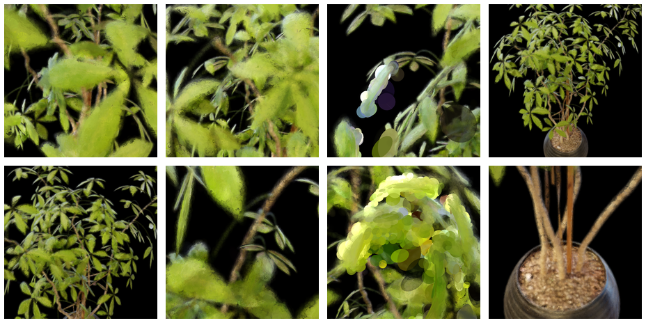

### 2.2 컨택트 시트 (exact)

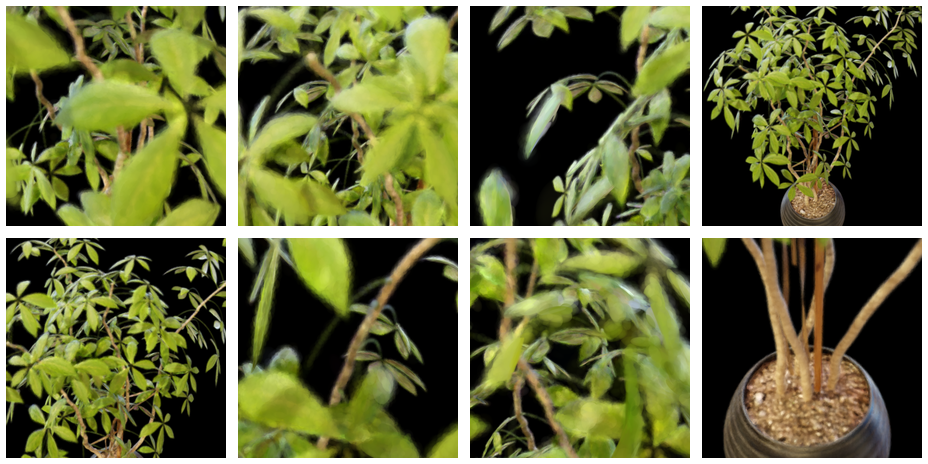

### 2.3 pose_1

| zt_single | exact |
|---|---|
| 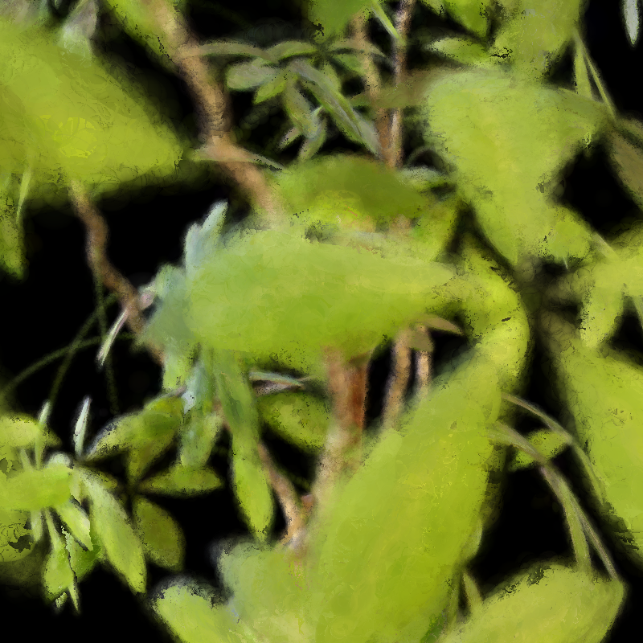 |  |

### 2.4 pose_2

| zt_single | exact |
|---|---|
| 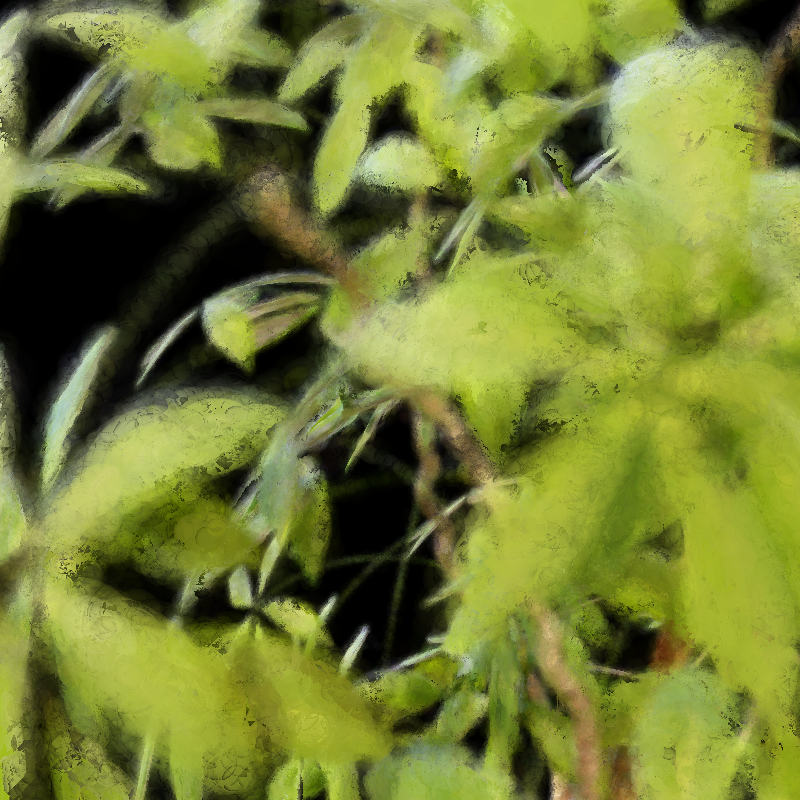 | 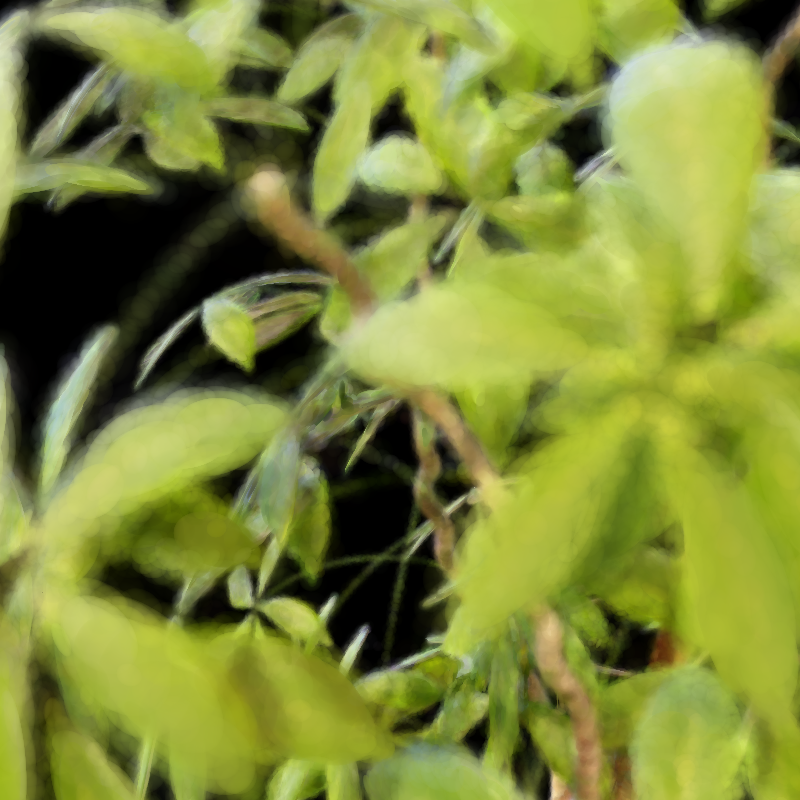 |

### 2.5 pose_3

| zt_single | exact |
|---|---|
| 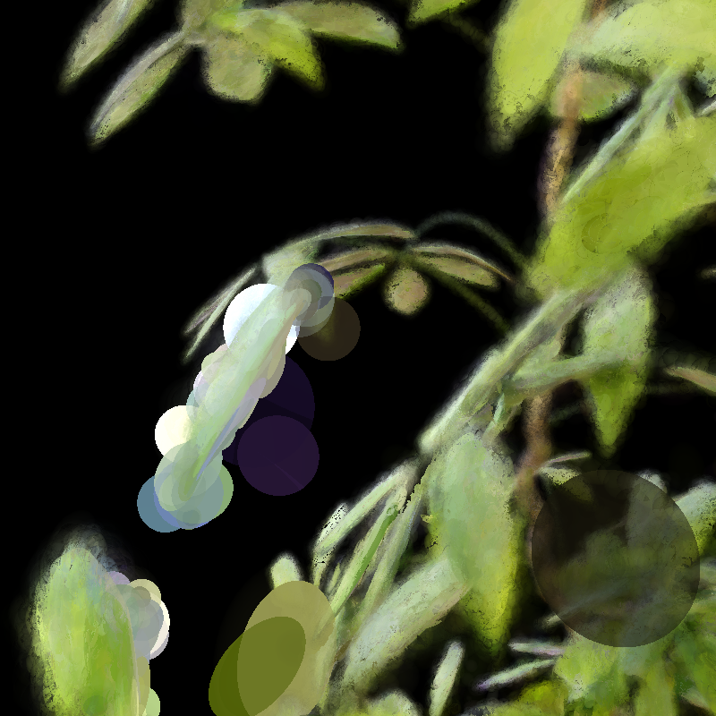 | 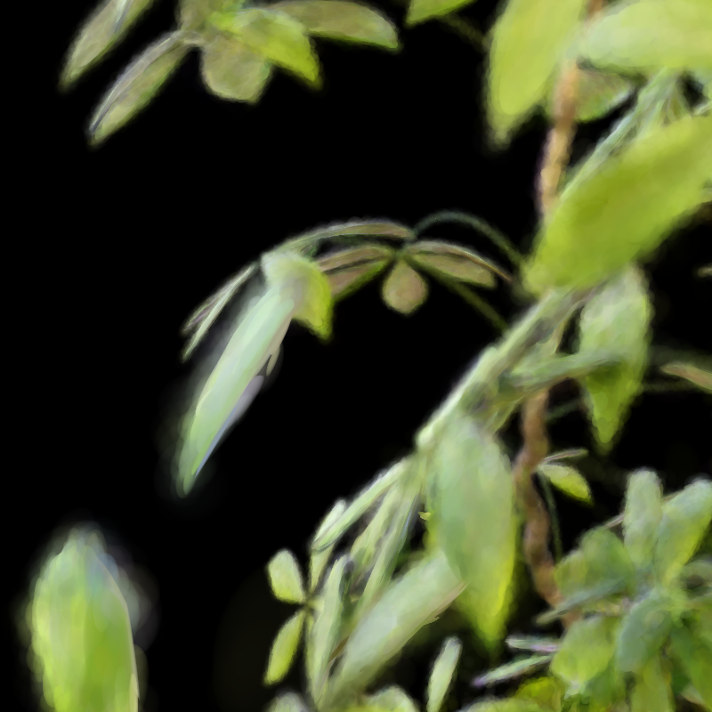 |

### 2.6 pose_4

| zt_single | exact |
|---|---|
| 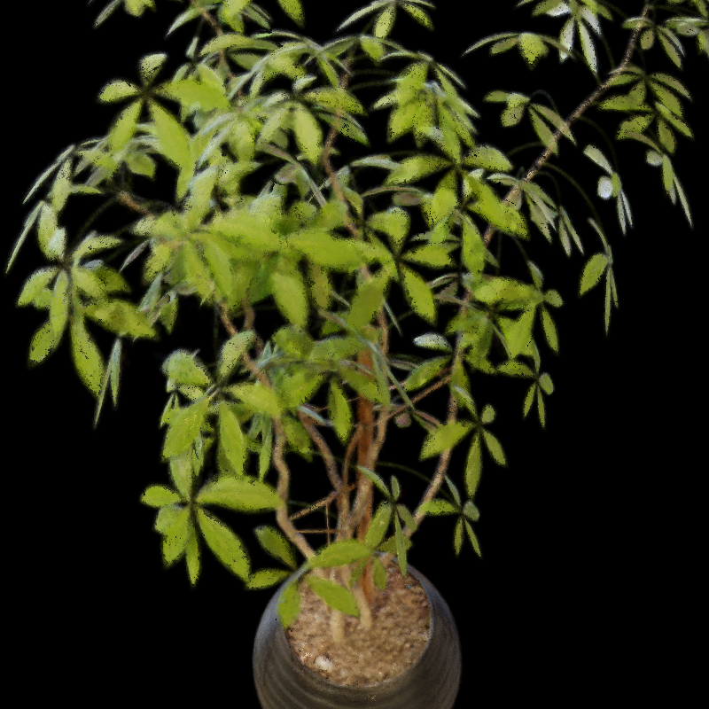 | 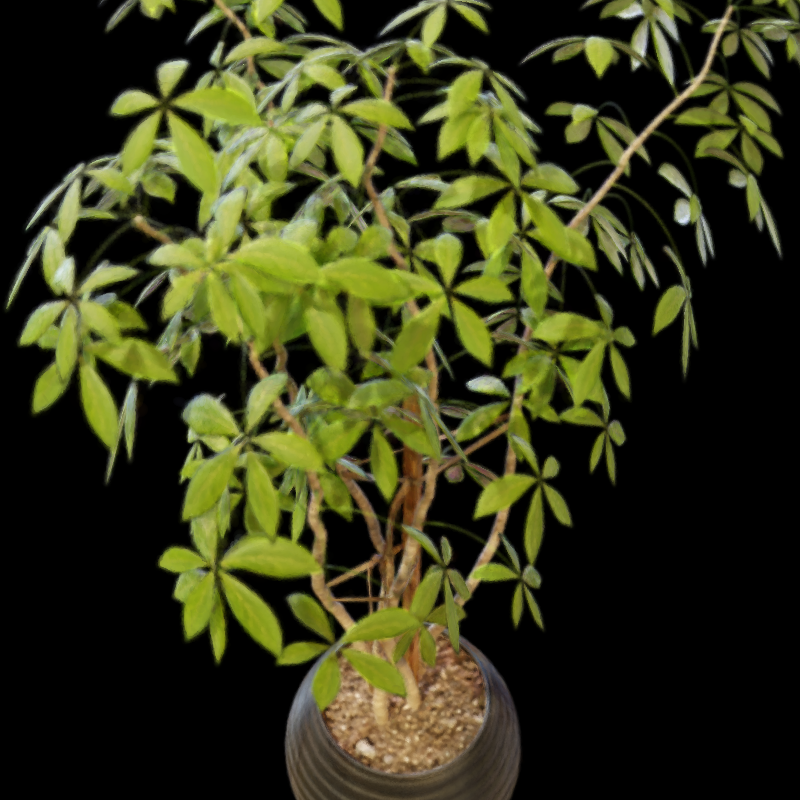 |

### 2.7 pose_5

| zt_single | exact |
|---|---|
| 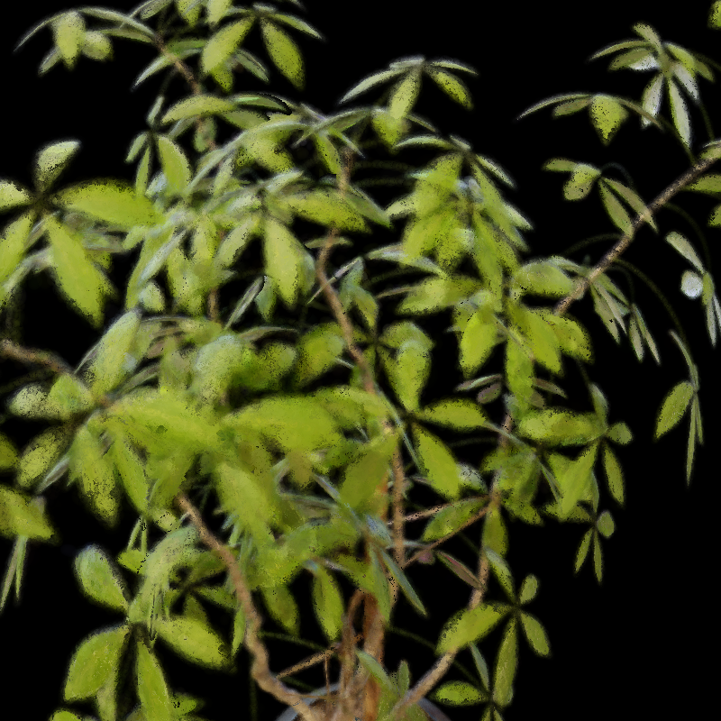 |  |

### 2.8 pose_6

| zt_single | exact |
|---|---|
| 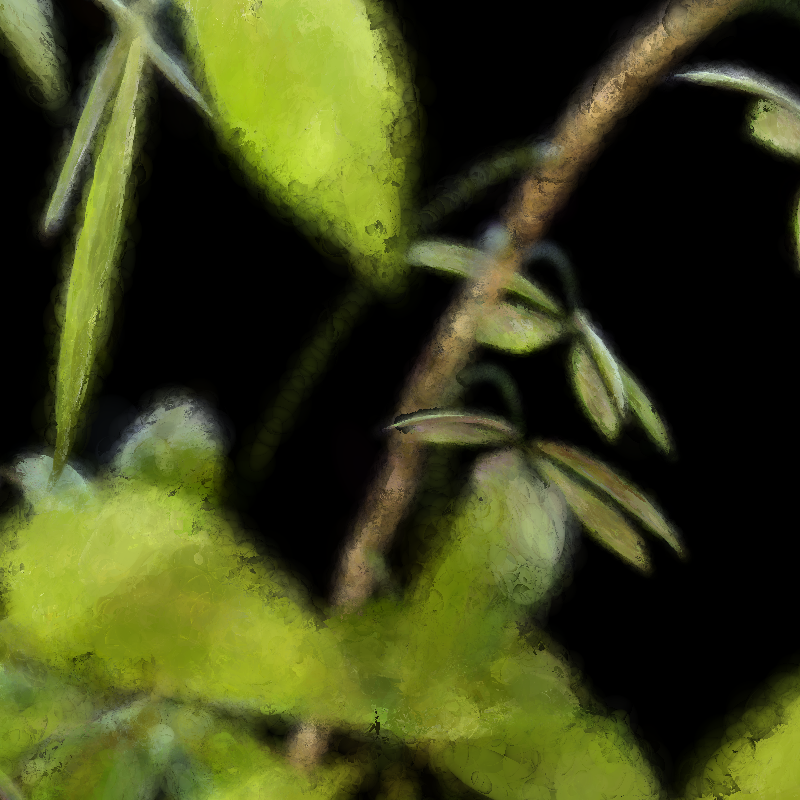 | 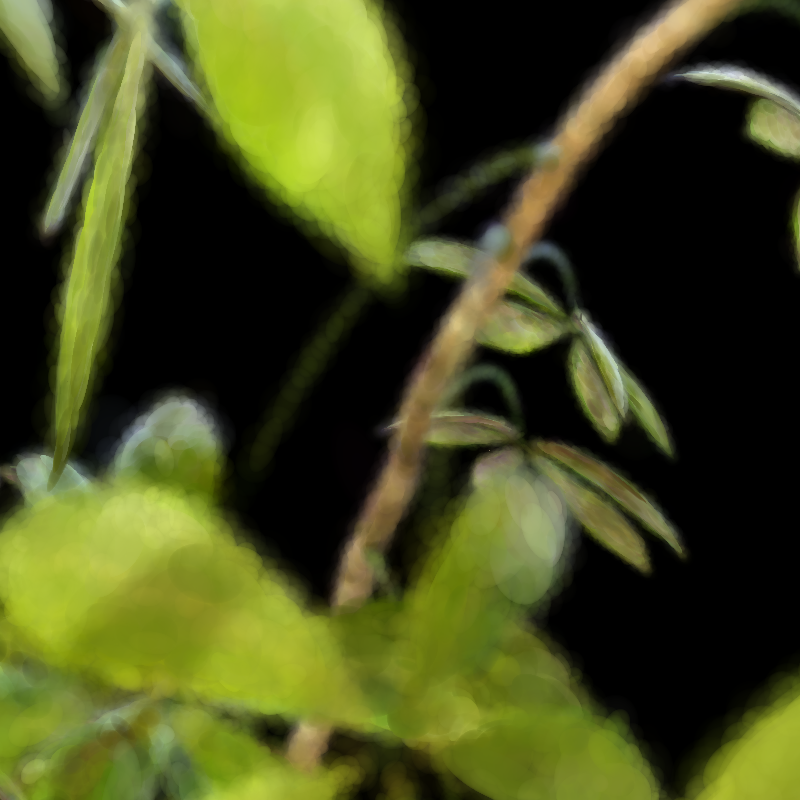 |

### 2.9 pose_7

| zt_single | exact |
|---|---|
| 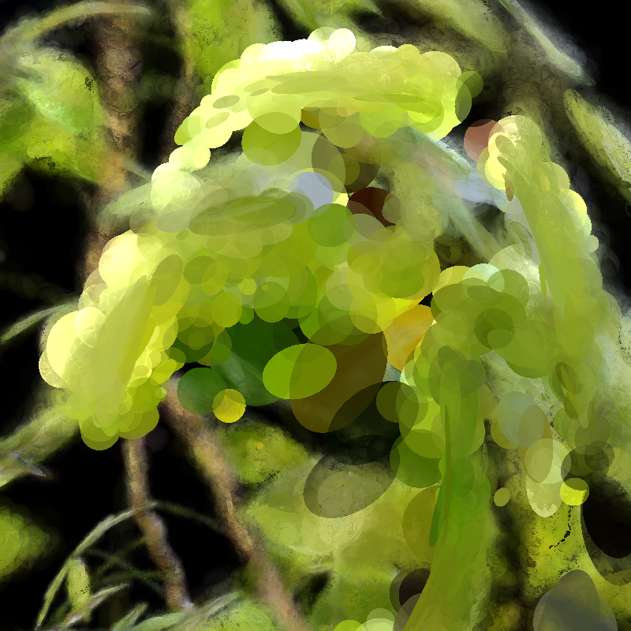 | 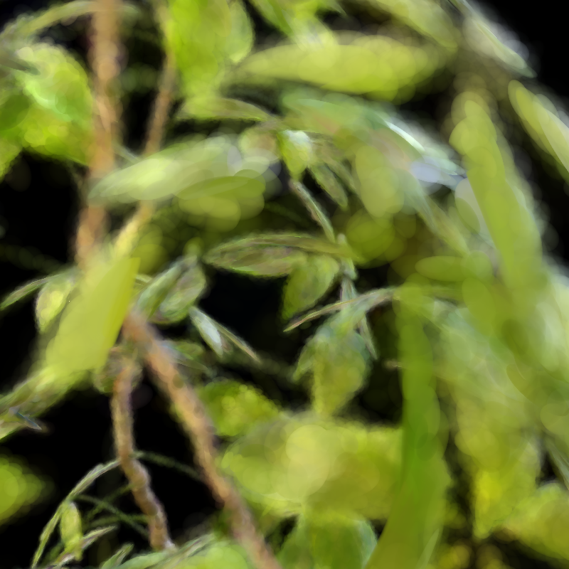 |

### 2.10 pose_8

| zt_single | exact |
|---|---|
| 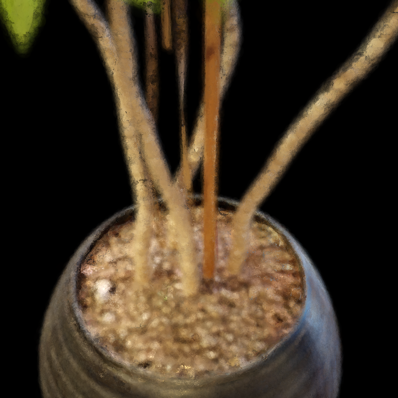 |  |
