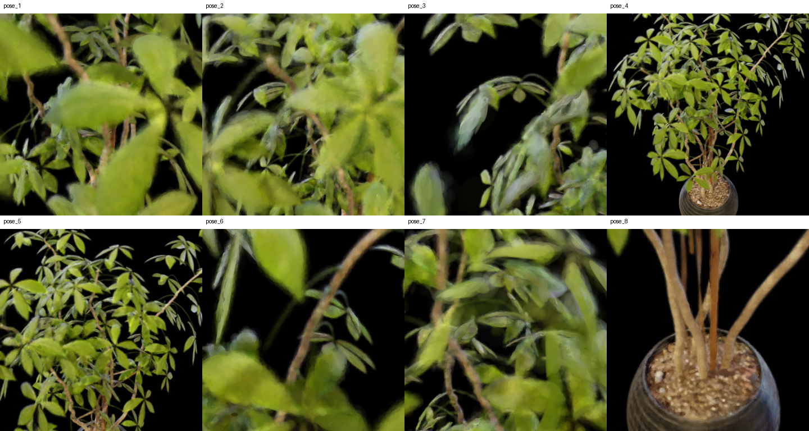
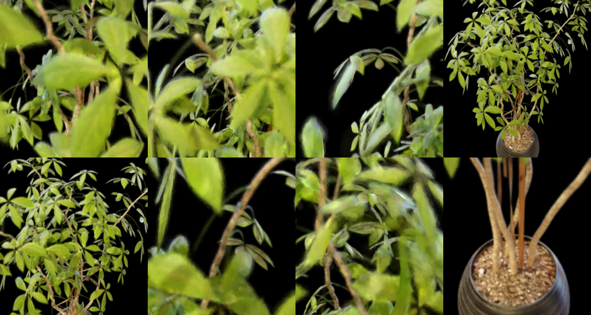
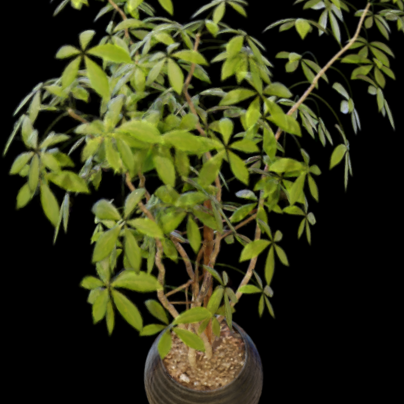

# 근사구조 풀학습 vs 원본 EVER 렌더링 비교 보고서

**실험 대상:** Ficus, 근사구조 풀학습 vs 원본 EVER  
**이미지 폴더:** `report_image_모진수/260722/`  
**핵심 질문:** 근사구조 풀학습 방식과 원본 EVER 방식이 동일 Ficus 씬에서 어떤 차이를 보이는가

---

## 1. 실험 조건

| 항목 | 내용 |
|---|---|
| 데이터셋 | **Ficus** |
| 비교 방법 A | **근사구조 풀학습** (`ficus_zt_mode14_cap16_init40k_slowgrow_120k_30000`) |
| 비교 방법 B | **원본 EVER에서 가우시안 갯수제한** (`s3_ever_sphere`) |
| 시점 수 | 각 방법 8 pose (pose_1 ~ pose_8), 800×800 |
| 보조 산출물 | A: `contact_sheet.png` / B: `contact_sheet_ever_sphere.png`(pose_1~8로 생성), `s3_ever_sphere.ply` |

---

## 2. 핵심 이미지 비교

### 2.1 컨택트 시트 (근사구조 풀학습)

### 2.2 컨택트 시트 (원본 EVER)

### 2.3 pose_1

| 근사구조 풀학습 | 원본 EVER |
|---|---|
|  |  |

### 2.4 pose_2

| 근사구조 풀학습 | 원본 EVER |
|---|---|
|  |  |

### 2.5 pose_3

| 근사구조 풀학습 | 원본 EVER |
|---|---|
|  |  |

### 2.6 pose_4

| 근사구조 풀학습 | 원본 EVER |
|---|---|
|  |  |

### 2.7 pose_5

| 근사구조 풀학습 | 원본 EVER |
|---|---|
|  |  |

### 2.8 pose_6

| 근사구조 풀학습 | 원본 EVER |
|---|---|
|  |  |

### 2.9 pose_7

| 근사구조 풀학습 | 원본 EVER |
|---|---|
|  |  |

### 2.10 pose_8

| 근사구조 풀학습 | 원본 EVER |
|---|---|
|  |  |

## 3. 정량 지표

### 원본 EVER 15만 가우시안 모델과 근사구조 학습 모델 정량 비교

비교 대상은 ficus scene 기준이며, 두 모델 모두 30000 iteration 학습 결과이다.  
원본 EVER는 primitive 수를 약 15만 개 수준으로 근사구조의 가우시안 갯수와 비슷하게 맞춘 모델을 사용하였다.

| 항목 | 원본 EVER 15만 모델 | 근사구조 학습 모델 |
| --- | ---: | ---: |
| test PSNR | 34.7047 dB | 32.2331 dB |
| test L1 | 0.004797 | 0.006567 |
| train PSNR | 36.4417 dB | 33.6914 dB |
| train L1 | 0.003755 | 0.005330 |
| 최종 Gaussian 수 | 149,167 | 119,166 |
| 평균 iteration time | 37.23 ms | 23.97 ms |
| 전체 학습 시간 | 21.61 min | 11.98 min |

