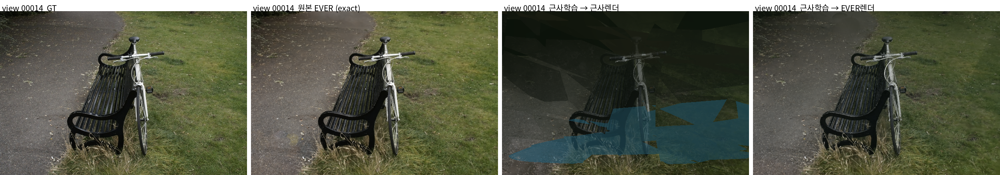
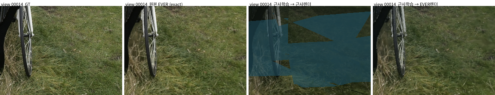
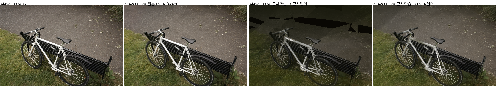
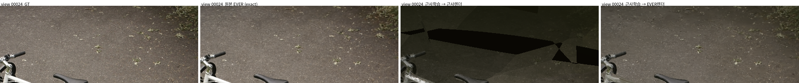
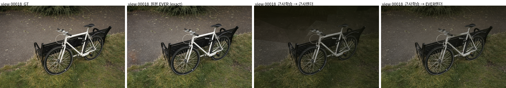
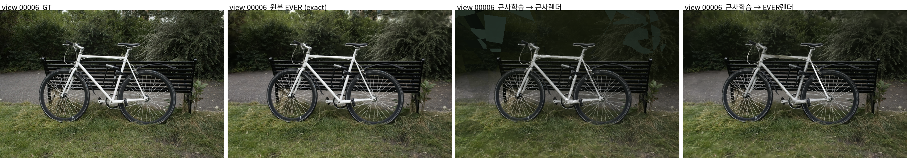

# [260723][모진수] 오늘 수행한 것

## 1. 오늘의 연구 진행 상황 및 수행한 것

오늘 진행한 것은 크게 다음과 같다.

1. 지금까지의 근사 학습안(기본 근사구조 + 근사 학습)이 **베이스라인으로 성립하는지**를 다른 씬으로 확장해 확인
2. Mip-NeRF360 실외 씬(bicycle)으로 확장했을 때, **근사 학습 루프 자체가 잘못 수렴하는 것**을 확인하고 그 원인을 디버깅중에 있다.

연구 맥락은 다음과 같다.


지금까지의 근사 학습안은 Ficus(합성·object-centric) 씬에서 검증해 왔다.

Ficus에서는 근사 학습으로 만든 모델이 exact EVER 대비 약 2.5dB 낮은 수준까지는 재현되어, "근사 친화적 분포를 학습으로 찾는다"는 방향의 베이스라인으로 쓸 수 있었다.

이번에는 이 베이스라인이 실제 실외/복잡 씬으로도 이어지는지 확인하기 위해 Mip-NeRF360 bicycle로 확장했는데, 여기서는 근사 렌더 이전에 근사 학습 자체가 잘 수렴하지 않는것을 확인했다.


결론적으로, **Ficus 한정으로는 지금까지의 근사 학습안을 베이스라인으로 가져갈 수 있다고 판단했으나, bicycle 씬에서는 학습 루프 자체가 잘못된 것을 확인해 현재 그 부분을 디버깅 중이다.**


## 2. 오늘 수행한 실험

### 2.1 실험 목적

Ficus 한정으로 확인된 근사 학습 베이스라인이 실외/복잡 씬으로도 이어지는지 확인하기 위해, Mip-NeRF360의 bicycle/bonsai를 **원본 EVER와 근사 학습 기본안을 동일 조건으로** 새로 학습해 비교했다.

- EVER는 고해상도 학습 비용이 크므로 강한 downsample을 기본값으로 사용
  - bicycle: `images_8`
- 공정 비교를 위해 `spawn_cap`을 원본 EVER와 근사 학습 기본안 모두 동일하게 맞춤

실행 스크립트 및 output:

```text
scripts/run_mipnerf360_ever_vs_zt_slowgrow.sh

output/bicycle_ever_ds8_cap120000_30000
output/bicycle_zt_slowgrow_ds8_cap120000_30000
output/bicycle_ever_ds8_cap2000000_30000
output/bicycle_zt_slowgrow_ds8_cap2000000_30000
output/bonsai_ever_ds4_cap120000_30000
output/bonsai_zt_slowgrow_ds4_cap120000_30000
```

### 2.2 primitive budget 재조정

1차 벤치마크는 `spawn_cap=120000`으로 돌렸으나, GUT bicycle benchmark의 최종 Gaussian 수(1M~6M)와 비교하면 지나치게 작은 budget이었다. 

따라서 GUT ds8(2.25M)과 비슷한 scale인 `spawn_cap=2000000`으로 다시 맞춰 원본 EVER / 근사 학습 기본안을 재실행했다.

## 3. 실험 결과

### 3.1 정량 결과 (bicycle)


| 케이스 | iteration | inference | PSNR | SSIM | L1 | inference forward FPS |
|---|---:|---|---:|---:|---:|---:|
| EVER 학습 후 EVER로 inference | 30000 | exact EVER | 26.426 | 0.8223 | 0.03386 | 28.93 |
| EVER 학습 후 근사구조로 inference | 30000 | approx | 20.628 | 0.6446 | 0.05724 | 22.01 |
| EVER 학습 7000 iter 후 근사구조로 inference | 7000 | approx | 18.927 | 0.6034 | 0.06838 | 21.24 |
| 근사구조 풀학습 후 근사구조로 inference | 30000 | approx | 15.340 | 0.5006 | 0.13465 | 12.58 |
| 근사구조 풀학습 후 EVER로 inference | 30000 | exact EVER | 20.575 | 0.7186 | 0.07052 | 12.52 |
| 근사구조 7000 iter 후 근사구조로 inference | 7000 | approx | 20.094 | 0.5798 | 0.07162 | 7.00 |
| 근사구조 7000 iter 후 EVER로 inference | 7000 | exact EVER | 23.425 | 0.6911 | 0.04699 | 6.96 |


`bicycle_근사` 중간 추이:

- 초기 points 40,000 → 7000 iter에서 이미 cap 2M 도달, test PSNR 20.628	
- 이후 30000 iter까지 학습할수록 오히려 하락, 최종 test PSNR **15.340** 


### 4. 정성 결과 및 이미지


각 그림은 **좌→우로 GT / 원본 EVER(exact 렌더) / 근사학습→근사렌더 / 근사학습→EVER렌더** 4열로 나란히 배치했다. 

3·4열은 동일한 근사 학습 모델을 각각 근사구조/EVER로 추론한 것으로, 3.1 정량표의 15.340dB(근사렌더)·20.575dB(EVER렌더) 행에 해당한다. 

그림 1~3은 원본 EVER 대비 근사렌더 PSNR 격차가 큰 view(정성 차이가 크게 드러나는 경우), 그림 4는 격차가 상대적으로 작은 view이다.

**그림 1. bicycle test view 00014 — 격차 큰 view**



**그림 1-1. view 00014 지면 영역 확대 (좌하단 crop)**



**그림 2. bicycle test view 00024 — 격차 큰 view**



**그림 2-1. view 00024 지면·경로 영역 확대 (상단 crop)**



**그림 3. bicycle test view 00018 — 격차 큰 view**



**그림 4. bicycle test view 00006 — 격차 상대적으로 작은 view**



관찰:

- 원본 EVER(exact 렌더)는 전경 자전거 형태·배경 벤치·잔디 구조를 GT에 가깝게 재현한다. 이것이 이번 씬에서 도달 가능한 기준선이다.
- **근사 렌더**는 배경 나뭇잎·잔디 영역에서 **저폴리곤 형태의 cluster 조각 artifact**가 넓게 나타나고, 반투명 blob이 겹치며 전체적으로 어둡고 얼룩진다. 전경 자전거는 형태가 남지만 배경/지면 표현이 크게 무너진다.
- 이 artifact는 근사 렌더 단계에서만 생기는 것이 아니라, 4.1의 수치처럼 **exact 렌더로 봐도 20.5dB**라 근사 학습이 만든 분포 자체가 이미 나쁘다.

