# [260724][모진수] 오늘 수행한 것

## 1. 오늘의 연구 진행 상황 및 수행한 것

오늘 진행한 것은 크게 다음과 같다.

1. 어제 확인한 bicycle 씬 근사 학습 수렴 문제를, **단순 forward/backward의 수렴 실패가 아니라 씬이 바뀌며 코드/파라미터가 맞지 않는 버그 케이스**로 보고 재점검
2. 재점검 결과 실제 구현 버그를 찾아 수정하고, densification recipe가 scene-scale에 맞지 않는 문제를 확인·완화

연구 맥락은 다음과 같다.

어제까지는 bicycle에서 근사 학습이 primitive를 2M까지 늘려도 오히려 품질이 떨어져(30k에서 근사 렌더 15.27 dB), "학습 루프 자체가 잘못되었다"는 것까지만 확인했다.

교수님 코멘트대로 이를 단순 수렴 실패로 보지 않고 **버그/파라미터 케이스**로 놓고 데이터 경로·다운샘플·primitive budget·densification 구현을 다시 점검했다. 그 결과 densification 쪽에서 실제 구현 버그를 찾았고, 근사구조 특유로 densification 기준이 scene-scale에 민감해지는 원인도 정리했다.

결론적으로, **수렴 문제의 상당 부분이 근사 forward/backward 자체가 아니라 densification 버그·recipe 문제였음을 확인했고, 이를 수정하니 근사 렌더 PSNR이 15.27 → 22.6 dB로 크게 회복되고 정성적으로도 꽤 개선되었다. 다만 (1) 정성적으로 아직 문제가 많고, (2) 근사구조의 속도 이점이 확인되지 않는다는 두 한계가 남아 있다.**

## 2. 재점검 및 원인 분석

### 2.1 실제 구현 버그 — 수정

`scene/gaussian_model.py` densification 경로에서 두 가지 버그를 확인·수정했다.

| 위치 | 버그 | 수정 |
| --- | --- | --- |
| `densify_and_explore()` | child opacity 분배 시 physical scale이 아니라 inverse-activation 이후 raw scale을 `divide_opacity()`에 전달 | `child_scaling = scaling / multi`를 physical scale로 유지하고, optimizer에 넣을 때만 `scaling_inverse_activation` 적용 |
| `densify_and_prune()` | 변수상 `density` 자리에 opacity가 들어가던 경로 | rendering density로 교정 |

### 2.2 근사구조에서 densification 기준이 scene-sensitive해지는 이유
 

- **gradient scale 변화**: 근사 forward/backward는 여러 event/Gaussian을 cluster로 묶어 대표값으로 gradient를 전달하므로, `xyz_gradient_accum`의 절대 scale·분포가 exact renderer와 달라진다. 고정 `densify_grad_threshold`의 의미가 씬마다 달라진다.

- **근사 renderer의 증폭**: exact compositing은 overlap이 복잡해도 어느 정도 복구하지만, 근사 renderer는 overlap이 복잡할수록 cluster approximation error가 커진다.

즉 기존 GS/EVER에서 허용되던 공격적 densification이 근사구조 + outdoor scale에서는 나쁜 Gaussian 분포를 만든다. 이를 원인 분리용으로 `densify_grad_threshold`를 올려 초반 mass explore를 막자 품질이 크게 회복됐다.

## 3. 실험 결과

### 3.1 정량 결과 (bicycle, 근사 렌더 기준)

`densify_grad_threshold`는 어제 기본값 2.5e-7에서 mass explore를 막는 방향으로 sweep했다.

| 케이스 | grad_threshold | iter | gaussian | PSNR | SSIM | L1 |
| --- | --- | ---: | ---: | ---: | ---: | ---: |
| 기존 근사 학습(수정 전) | 2.5e-7 | 30000 | 1,837,037 | 15.275 | 0.5008 | 0.1347 |
| 수정안  | 2.5e-6 | 7000 | 323,660 | 23.190 | - | - |
| 수정안  | 2.5e-6 | 30000 | 1,530,261 | 22.619 | - | - |
| 원본 EVER(참고, exact 렌더) | - | 30000 | 1,828,993 | 26.426 | 0.8223 | 0.0339 |

- 초반 mass explore를 막자 근사 렌더 PSNR이 **15.27 → 22.6 dB로 회복**됐다. bicycle 실패의 핵심이 단순 primitive 부족이 아니라 초반 과격한 densification임을 강하게 시사한다.
- 다만 정량 수치에서는 7000iter에서 더 높은 수치를 보이지만 정성적인 측면에서 30,000 iter에서 더 안정적인 모습을 확인 할 수 있다.

### 3.2 정성 결과 및 이미지

수정 후 featured 모델은 수정안 B(2.5e-6, 30k, 근사 렌더, 근사 렌더 PSNR 21.69)다.

각 그림은 **좌→우로 GT / 수정 전 근사 / 수정 후 근사 / 원본 EVER(exact 렌더)** 4열로 나란히 배치했다. 2·3열이 이번 수정의 before→after 비교이고, GT(기준)와 원본 EVER(도달 가능한 상한)를 양옆에 두었다. 수정 전 근사는 3.1 정량표의 15.275dB, 수정 후 근사는 22.619dB(30k) 행에 해당한다.

그림 1-2는 수정 전 대비 개선이 크게 드러나는 view, 그림 3은 수정 후에도 한계가 남는 worst view(4.1 참조), 그림 4-6은 수정 후에도 원본 EVER 대비 품질 격차가 큰 view이다.

**그림 1. bicycle test view 00014 — 수정으로 개선이 큰 view (근사 렌더 PSNR 13.5 → 24.0)**

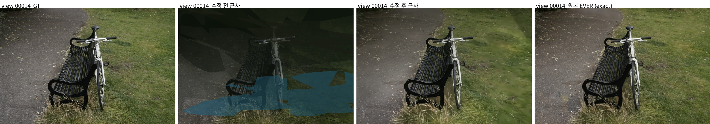

**그림 1-1. view 00014 지면 영역 확대 (좌하단 crop)** — 수정 전의 파란 반투명 blob·저폴리곤 조각이 수정 후 사라진다.

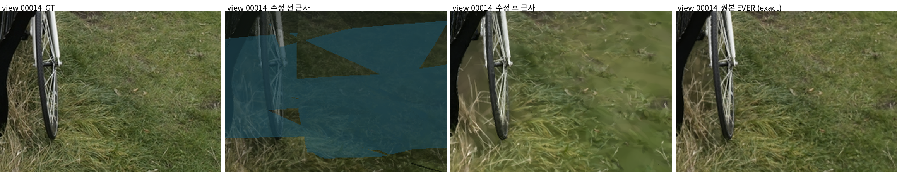

**그림 2. bicycle test view 00024 — 수정으로 개선이 큰 view (근사 렌더 PSNR 13.2 → 21.7)**

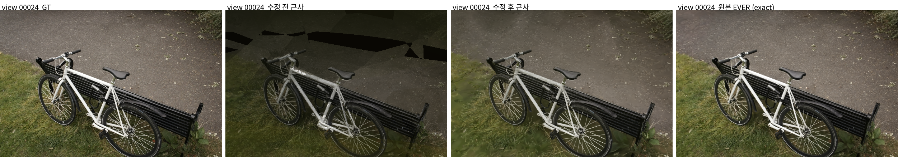

**그림 2-1. view 00024 경로 영역 확대 (상단 crop)** — 수정 전의 검은 저폴리곤 블록이 수정 후 사라진다.

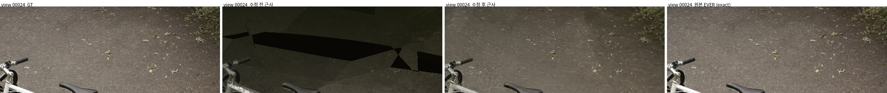

**그림 3. bicycle test view 00000 — 수정 후에도 한계가 남는 worst view (근사 렌더 PSNR 13.9 → 17.9)**

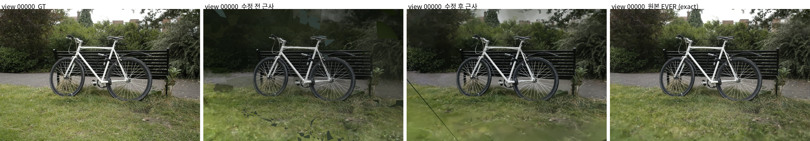

**그림 3-1. view 00000 좌하단 지면 확대 (crop)** — 수정 후에도 잔디가 녹색 blob으로 뭉개지고 좌하단 검은 대각선 artifact가 남는다.

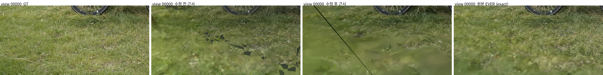

**그림 4. bicycle test view 00022 — 수정 후에도 EVER 대비 품질 격차가 큰 view (근사 렌더 18.5 vs EVER 29.6)**

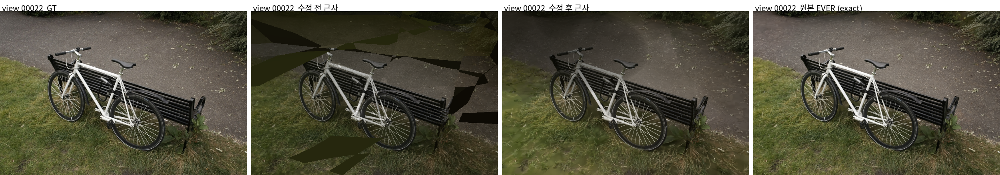

**그림 5. bicycle test view 00021 — EVER 대비 품질 격차가 큰 view (근사 렌더 20.7 vs EVER 28.0)**

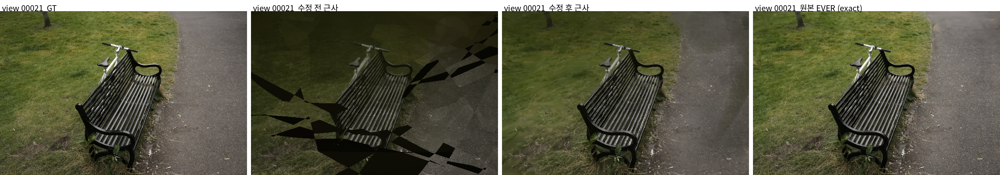

**그림 6. bicycle test view 00020 — EVER 대비 품질 격차가 큰 view (근사 렌더 21.8 vs EVER 28.4)**

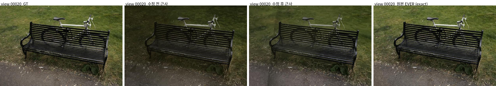

관찰:

- 수정 전에는 배경·잔디에 저폴리곤 cluster 조각 artifact와 검은 대각선 조각이 넓게 나타나고 전체가 어두웠다. 수정 후에는 이 대형 artifact가 대부분 사라지고 전경 자전거·배경 벤치·foliage 구조가 GT에 상당히 가깝게 복원된다(그림 1~2).
- 다만 개선 폭은 view마다 다르다. worst view 00000(그림 3)에서는 수정 후에도 잔디/바닥이 녹색 blob으로 뭉개지고 좌하단 검은 대각선 artifact가 남으며, 전체 색감이 GT보다 어둡다. 이 잔여 오차는 4.1에서 정리한다.
- 배경/지면이 넓게 보이는 view(그림 4~6)에서는 수정 후에도 원본 EVER 대비 격차가 크게 남는다. 경로가 올리브색으로 탁해지고 잔디가 blob으로 뭉개지며 배경 상단에 올리브 다각형 patch가 남아, EVER가 GT에 가깝게 재현하는 영역을 근사구조가 아직 따라가지 못한다.

### 3.3 7천 iter vs 3만 iter — PSNR과 정성 품질의 불일치

3.1에서 근사 렌더 PSNR은 7천 iter(23.19)가 3만 iter(22.62)보다 높았다. 25개 test view 평균으로도 7천 iter가 23.18, 3만 iter가 21.69로 7천 iter가 더 높다. 그러나 정성적으로는 3만 iter가 더 안정적인 view가 많다.

각 그림은 **좌→우로 GT / 7천 iter / 3만 iter** 3열이다. 7천 iter는 배경 잔디·바닥의 texture와 색이 GT에 가까워 PSNR이 높지만, **자전거 바퀴 스포크가 끊기고 지면이 위로 녹아오르는(melt) 불안정**이 함께 나타난다. 3만 iter는 배경 texture를 잃어 PSNR은 낮아지지만, 구조(스포크·엣지)는 더 완전하고 안정적으로 수렴한다.

**그림 7. bicycle test view 00013 — 7천 iter PSNR 25.0 > 3만 iter 21.7 (정성은 3만이 안정적)**

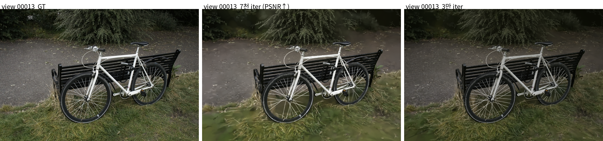

**그림 7-1. view 00013 앞바퀴 확대 (crop)** — 7천 iter는 아래쪽 스포크가 끊기고 잔디가 바퀴 위로 melt되지만, 3만 iter는 스포크가 원형으로 이어지고 지면이 더 균일하다.

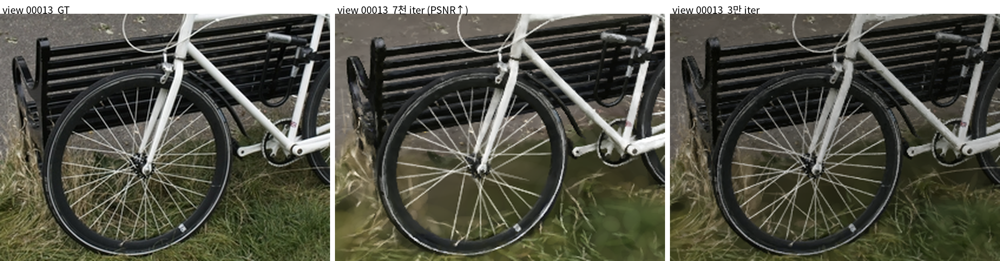

**그림 8. bicycle test view 00018 — 7천 iter PSNR 25.5 > 3만 iter 22.3 (정성은 3만이 안정적)**

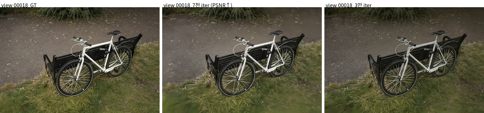

**그림 8-1. view 00018 바퀴·프레임 확대 (crop)** — 7천 iter는 뒷바퀴·하단 지면이 흐릿하게 뭉개지고 melt haze가 끼지만, 3만 iter는 바퀴 테두리·스포크가 더 또렷하고 뒷바퀴 구조가 살아 있다.

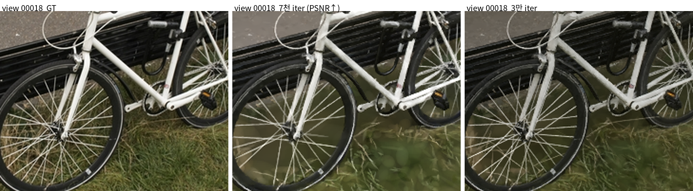

관찰:

- 7천 iter가 PSNR에서 앞서는 것은 주로 **배경/지면의 색·저주파 texture가 GT에 가깝기 때문**이고, 이 영역은 화면에서 넓은 면적을 차지해 PSNR을 크게 끌어올린다.
- 반면 3만 iter는 배경 texture를 일부 잃는 대신 **자전거·벤치 같은 구조물의 형태가 더 완전하게 수렴**한다. 스포크 끊김·melt haze 같은 국소 불안정이 줄어 전체적으로 더 안정적으로 보인다.
- 즉 이 구간에서는 **PSNR 단일 지표가 정성 품질과 일치하지 않으며**, featured 모델로 3만 iter를 택한 근거가 된다.

## 4. 남은 한계

### 4.1 정성적으로 아직 문제가 많다

수정 후에도 다음 오차가 남는다.

- 전체 RGB가 GT보다 어두운 bias (worst view 00000: R −0.090, G −0.083, B −0.063)
- 하단 잔디/바닥이 큰 녹색 반투명 blob으로 뭉개짐
- 수풀/배경 foliage의 local contrast·고주파 texture 손실
- 일부 view의 좌하단 검은 대각선 artifact

즉 자전거/벤치 같은 object-level structure는 유지되지만, background/ground appearance를 넓은 Gaussian blob과 어두운 색감으로 설명하는 경향이 남아 있다.

### 4.2 근사구조의 속도 이점이 확인되지 않는다

- 어제 2M scale 측정에서도 근사 렌더(≈54 ms/frame)는 exact 렌더(≈53 ms/frame)와 비슷했고, 원본 EVER(≈23 ms/frame)보다 오히려 느렸다.
- 즉 현재 bicycle 조건에서는 "근사구조가 빠르다"는 이점을 아직 실증하지 못했다. 품질 회복과 별개로, 속도 이득을 살리려면 렌더 경로/클러스터 구조를 다시 봐야 한다.

## 5. 다음 계획

| 우선순위 | 작업 | 이유 |
| ---: | --- | --- |
| 1 | 고정 threshold 대신 **adaptive growth control** 도입 (gradient top-k parent cap, per-interval split budget) | scene마다 threshold를 손튜닝하는 방식을 피하고, "근사 renderer가 안정적으로 처리 가능한 growth rate"를 직접 제어 |
| 2 | densification 종료(18k) 이후 후반 품질 하락 원인 분리 | 7k가 30k보다 좋은 현상 → feature/density/geometry update 중 무엇이 품질을 깎는지 확인 |
| 3 | 어두운 RGB bias·잔디 blob 원인 점검 | background/ground appearance가 넓은 blob·저주파로 수렴하는 경향 완화 |
| 4 | 근사 렌더 경로의 실제 속도 이득 재검증 | approx/exact 출력이 동일하게 나오는 구간의 renderer mode 분리 여부부터 확인 |

정리하면, 오늘은 bicycle 수렴 문제가 근사 forward/backward 자체보다 **densification 버그·recipe 문제**였음을 확인하고 수정해 품질을 크게 회복했다. 다음 단계는 (1) 고정 threshold 튜닝을 adaptive growth control로 대체해 정성 품질을 더 끌어올리고, (2) 근사구조의 속도 이점을 실제로 확보하는 것이다.
