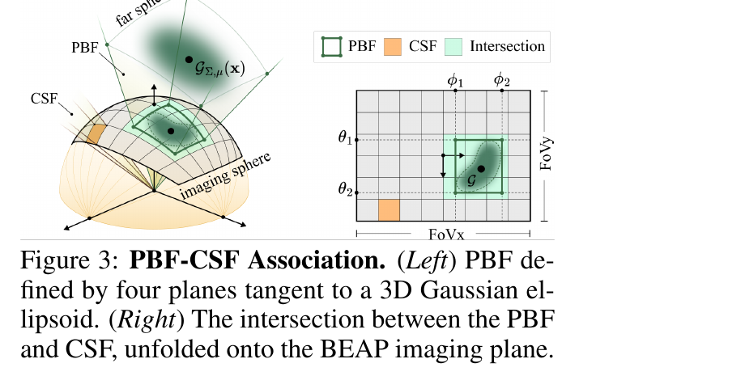
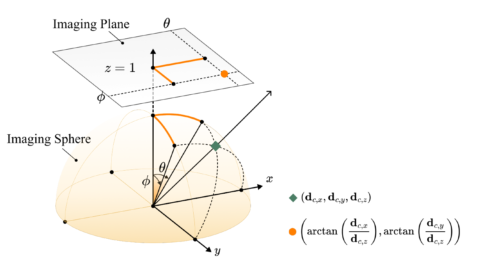
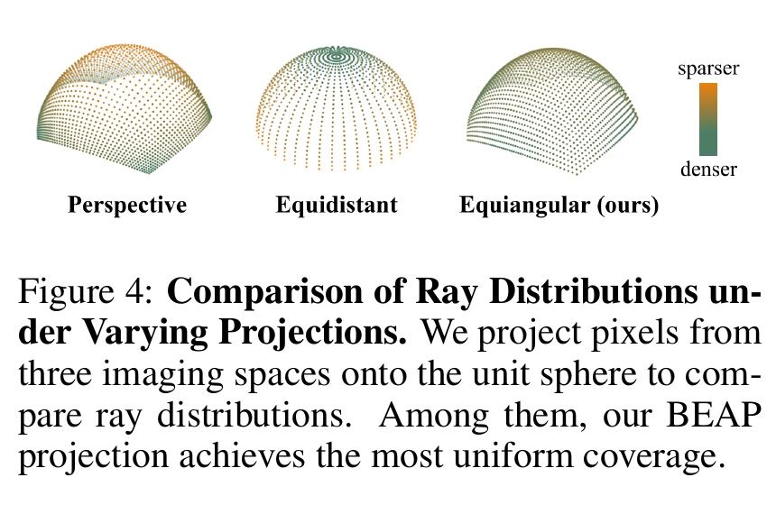
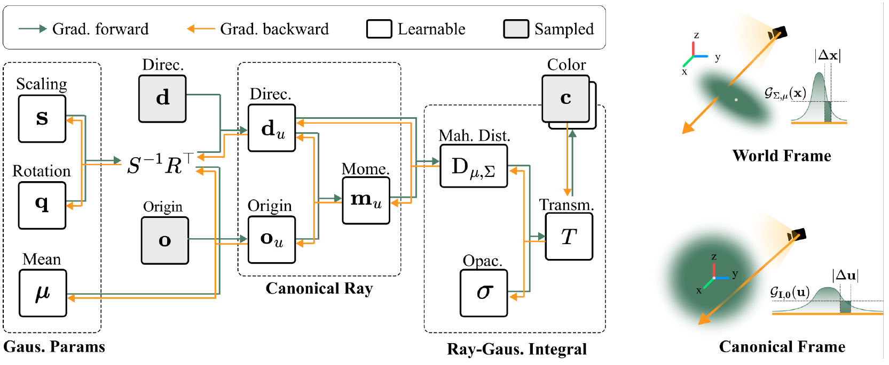

# 3DGEER: 3D Gaussian Rendering Made Exact and Efficient for Generic Cameras

## 1. 논문 개요 및 성과 수준

### 1.1 서지 정보

- **논문명:** *3DGEER: 3D Gaussian Rendering Made Exact and Efficient for Generic Cameras*
- **저자:** Zixun Huang, Cho-Ying Wu, Yuliang Guo, Xinyu Huang, Liu Ren
- **소속:** Bosch Research North America, Bosch Center for AI
- **게재 학회:** **ICLR 2026 (International Conference on Learning Representations)**
- **논문 상태:** ICLR 2026 conference paper
- **arXiv:** 2505.24053v3 (2026년 3월 12일 버전)
- **주요 분야:** 3D Gaussian rendering, differentiable rendering, generic camera model, fisheye/wide-FoV rendering, real-time novel-view synthesis

### 1.2 이 논문이 해결한 문제

기존 3DGS는 3D Gaussian을 화면의 2D Gaussian으로 투영할 때 projection Jacobian을 이용한 local affine approximation을 사용한다. 좁은 FoV에서는 효율적이지만, fisheye 및 wide-FoV 카메라처럼 투영 비선형성이 큰 환경에서는 다음 문제가 발생한다.

- 실제 3D Gaussian의 투영 형상과 근사된 2D conic 사이의 불일치
- Gaussian을 잘못된 tile에 배정하거나 필요한 tile에서 누락하는 association 오류
- ray 기반 Gaussian 평가와 screen-space association 사이의 불일치

반대로 EVER나 3DGRT 같은 ray-based 방법은 projective approximation을 피할 수 있지만, BVH traversal과 다중 intersection 처리 비용 때문에 3DGS 수준의 속도를 달성하기 어렵다.

3DGEER는 이 간극을 다음 세 요소로 해결한다.

1. **Closed-form ray–Gaussian response:** 3D Gaussian을 canonical space로 변환하고 ray를 따라 누적되는 Gaussian density를 closed form으로 유도한다.
2. **Particle Bounding Frustum(PBF):** Gaussian의 λσ ellipsoid에 접하는 네 평면으로 정확한 angular bound를 만들고, 이를 tile의 Camera Sub-Frustum(CSF)과 대응시킨다.
3. **Bipolar Equiangular Projection(BEAP):** 영상 pixel과 ray의 수평·수직 각도를 선형 대응시켜 PBF–CSF association과 wide-FoV 학습 ray sampling을 단순화한다.

3DGEER는 **projective exactness와 real-time efficiency를 동시에 달성한 것**을 핵심 성과로 주장한다.

## 2. Method: PBF–CSF 기반 타일링

3DGEER의 가장 큰 차별점은 **각 Gaussian을 어떤 tile에 넣을지 결정하는 방식**이다. 기존 3DGS와 3DGUT는 Gaussian을 screen space에 근사 투영해 tile 범위를 계산하지만, 3DGEER는 camera space의 실제 Gaussian 영역을 기준으로 PBF를 만들고 이를 tile의 CSF와 직접 대응시킨다.

*Figure 3. 왼쪽은 camera space의 PBF와 CSF, 오른쪽은 이를 BEAP 영상 좌표에 펼친 모습이다.*

### 2.1 PBF와 CSF란 무엇인가

**PBF(Particle Bounding Frustum)** 는 카메라에서 Gaussian을 바라봤을 때, 해당 Gaussian에 닿을 가능성이 있는 ray 방향 전체를 감싸는 경계다. Figure 3 왼쪽의 녹색 Gaussian 영역을 네 개의 접평면으로 둘러싼 구조가 PBF다. 즉 PBF는 Gaussian의 실제 색이나 alpha를 계산하는 것이 아니라, 이 Gaussian이 어느 방향에서 보일 수 있는지 나타내는 후보 범위다.

**CSF(Camera Sub-Frustum)** 는 하나의 image tile에 포함된 pixel ray들을 3D에서 묶어 표현한 영역이다. 2D 영상에서는 단순한 직사각형 tile이지만, 카메라 원점에서 그 tile의 pixel ray들을 펼치면 Figure 3 왼쪽의 주황색 frustum이 된다.

정리하면 다음과 같다.

| 구분 | 의미 |
|---|---|
| PBF | 하나의 Gaussian이 영향을 줄 수 있는 ray 방향 범위 |
| CSF | 하나의 tile에 속한 pixel ray들의 방향 범위 |
| PBF–CSF 교차 | 해당 Gaussian을 그 tile의 후보 목록에 넣어야 함 |

### 2.2 PBF–CSF 타일링 과정

타일링은 다음 순서로 진행된다.

1. Gaussian을 camera space로 변환한다.
2. Gaussian의 유효 영역을 감싸는 네 접평면을 구해 PBF를 만든다.
3. 영상의 각 tile을 해당 pixel ray들의 CSF로 표현한다.
4. PBF와 CSF가 겹치면 해당 Gaussian ID를 그 tile에 등록한다.
5. 각 tile은 등록된 Gaussian만 depth 순서로 정렬하고 pixel별 렌더링을 수행한다.

Figure 3 오른쪽에서 녹색 사각형은 Gaussian의 PBF, 주황색 칸은 하나의 CSF를 의미한다. 두 영역이 겹치는 경우에만 Gaussian이 해당 tile의 후보가 된다. 하나의 PBF가 여러 CSF에 걸치면 같은 Gaussian이 여러 tile에 복제된다.

### 2.3 이 방식이 중요한 이유

3DGUT는 Gaussian의 일부 sample point를 카메라 영상에 투영한 뒤 screen-space 범위를 추정한다. 이 범위가 실제 ray–Gaussian 영역보다 작으면 필요한 Gaussian을 누락해 artifact가 생기고, 너무 크면 불필요한 Gaussian까지 tile에 포함되어 렌더링이 느려진다.

3DGEER는 Gaussian을 2D conic으로 근사하는 대신, camera space의 Gaussian ellipsoid에 직접 접하는 PBF를 계산한다. 따라서 실제 Gaussian geometry와 tile 후보 범위가 더 일관적이며, tight한 PBF 덕분에 tile당 불필요한 Gaussian 수도 줄어든다.

즉 PBF–CSF의 핵심 효과는 다음 두 가지다.

- **정확도:** 실제 기여 가능한 Gaussian을 tile 후보에서 누락하지 않는다.
- **속도:** 불필요한 Gaussian 등록을 줄여 duplication, sorting 및 pixel별 검사 비용을 함께 감소시킨다.

이후의 ray–Gaussian response 계산과 front-to-back alpha compositing은 3DGUT와 상당히 유사하다. 따라서 3DGEER의 핵심 차별점은 새로운 합성식보다는 **PBF–CSF를 이용해 tile별 Gaussian 후보를 더 정확하고 효율적으로 구성한 것**에 있다.

## 3. Method: BEAP 기반 영상 표현과 ray sampling

BEAP(Bipolar Equiangular Projection)는 3DGEER의 세 번째 기여이며, **영상의 pixel을 어떤 ray에 대응시킬 것인가**를 다시 정의한 부분이다. 섹션 2의 PBF–CSF가 "Gaussian을 어떤 tile에 넣을지"의 문제였다면, BEAP는 "tile과 pixel 자체를 어떤 좌표계로 정의할지"의 문제를 다룬다. 두 기여는 서로 독립된 아이디어가 아니라, BEAP 좌표계 위에서 PBF–CSF 대응이 가장 단순해지도록 설계된 한 쌍이다.

### 3.1 BEAP의 정의

BEAP는 카메라 공간의 ray 방향을 두 개의 **입사각(incidence angle)** 으로 표현한다. 정규화된 view-space 방향 벡터 $\mathbf{d}_c = (d_{c,x}, d_{c,y}, d_{c,z})$에 대해

$$\theta = \arctan\left(\frac{d_{c,x}}{d_{c,z}}\right), \qquad \phi = \arctan\left(\frac{d_{c,y}}{d_{c,z}}\right)$$

로 정의하며, $\theta$는 수평면(xz), $\phi$는 수직면(yz)에서의 입사각이고 각각 $-\pi/2 \sim \pi/2$ 범위를 갖는다 (논문 Eq. 6).

이를 잘 이해할 수 있는 비유는 지구본에서의 위도 경도로 생각하면 이해하기 쉽다.

*Figure E.1. view-space 방향 벡터(녹색)를 imaging sphere에 정규화한 뒤 xz·yz 평면으로 각각 투영해 얻은 $(\theta, \phi)$가 BEAP 영상 좌표(주황색 점)가 된다.*

"Bipolar"라는 이름은 여기서 나온다. 일반적인 구면좌표는 하나의 극(pole)을 기준으로 azimuth와 elevation을 정의하지만, BEAP는 **x축 기준 각도와 y축 기준 각도라는 두 개의 독립적인 축각(bipolar)** 으로 방향을 표현한다. 그리고 이 두 각도를 영상 좌표에 **선형(equiangular)** 으로 대응시킨다.

$$(x, y) = \left\lfloor \frac{w\theta}{\mathrm{FoV}_x} + \frac{w+1}{2},\ \frac{h\phi}{\mathrm{FoV}_y} + \frac{h+1}{2} \right\rfloor$$

즉 pixel 좌표는 스케일과 중심 이동만으로 각도에서 얻어지며, **한 pixel 이동 = 일정한 각도 변화**가 성립한다 (논문 Eq. 11).

| 투영 방식 | pixel ↔ 각도 관계 | 특징 |
|---|---|---|
| Perspective(pinhole) | $x \propto \tan\theta$ | 화각이 커질수록 주변부가 급격히 확대, 180°에서 발산 |
| Equidistant(fisheye) | $r \propto \varphi$ (반경 방향 단일 각) | 중심 근처를 과다 표본화 |
| **BEAP (본 논문)** | $x \propto \theta$, $y \propto \phi$ (두 축 각 각각) | FoV 손실 없이 tile ↔ 각도 구간이 정확히 일치 |

### 3.2 BEAP를 도입한 세 가지 이유

논문은 BEAP의 도입 근거를 세 가지로 제시한다.

**(1) 대화각 영상을 FoV 손실 없이 표현한다.** perspective 투영은 $\tan\theta$ 관계 때문에 FoV가 180°에 가까워지면 영상 좌표가 발산한다. 따라서 fisheye 영상을 pinhole 평면에 올리려면 화각을 잘라내야 한다. BEAP는 각도를 그대로 선형 매핑하므로 $\pm 90°$ 범위 전체를 유한한 영상으로 담을 수 있다.

**(2) tile과 CSF가 동일한 파라미터화를 갖는다.** 이것이 섹션 2와 직접 연결되는 부분이다. BEAP 영상에서 하나의 직사각형 tile은 곧 $[\theta_a, \theta_b] \times [\phi_a, \phi_b]$라는 각도 구간이며, 이는 CSF의 정의와 정확히 동일하다. PBF 역시 $[\theta_1, \theta_2]$와 $[\phi_1, \phi_2]$ 네 개의 각도 경계로 정의되므로 (논문 Eq. 7), PBF–CSF 교차 판정은 **두 각도 구간의 겹침 검사**로 축약된다. 별도의 conic 투영이나 좌표 변환 없이 단순 비교 연산만으로 association이 끝나므로 GPU 병렬화에 유리하다.

정리하면 다음과 같은 대응이 성립한다.

| 3DGS (screen space) | 3DGEER (BEAP angular space) |
|---|---|
| 2D conic의 AABB | PBF의 $[\theta_1,\theta_2] \times [\phi_1,\phi_2]$ |
| 직사각형 tile | CSF의 각도 구간 |
| AABB–tile 겹침 검사 | 각도 구간 겹침 검사 |

**(3) ray sampling이 3D 공간에서 더 균일해진다.** 이것이 화질에 직접 영향을 주는 부분이다.

*Figure 4. 세 가지 영상 공간의 pixel을 단위 구에 투영해 ray 분포를 비교한 결과다. 초록색은 조밀, 주황색은 희소한 영역을 뜻한다.*

Figure 4를 보면 각 투영의 표본 분포 편향이 드러난다.

- **Perspective:** 영상 중심부는 희소하고 주변부에 표본이 과도하게 몰린다. 즉 정보량이 적은 주변부가 영상 면적의 대부분을 차지한다.
- **Equidistant:** 반대로 중심 근처(극점)에 표본이 집중되어 과다 표본화가 발생한다.
- **Equiangular(BEAP):** 구 전체에 걸쳐 가장 균일한 분포를 보인다.

표본이 균일하다는 것은 학습 시 각 방향의 ray가 비슷한 비중으로 loss에 기여한다는 의미다. 논문은 이로 인해 gradient가 더 매끄럽고 일관되어 수렴이 개선되고 세부 묘사가 좋아진다고 설명한다.

### 3.3 inverse interpolation

BEAP는 렌더링 좌표계인 동시에 **supervision 좌표계**이기도 하다. 실제 촬영 영상은 pinhole이나 KB fisheye로 저장되어 있으므로, BEAP 격자에서 균일하게 뽑은 ray마다 원본 영상의 ground-truth 색을 가져와야 한다. 논문 Appendix E는 그 절차를 다음과 같이 정의한다.

1. BEAP 격자에서 $(\theta, \phi)$를 균일 샘플링한다.
2. 이를 정규화된 방향 벡터 $\mathbf{d} = (x, y, z)$로 환원한다 (Eq. E.1–E.3).
3. 카메라 모델별 투영식으로 원본 pixel 좌표를 구한다.
   - Pinhole: $x/z = \tan\theta$, $y/z = \tan\phi$를 intrinsic $K$에 대입 (Eq. E.4)
   - KB fisheye: $r = \sqrt{\tan^2\theta + \tan^2\phi}$, $\varphi = \arctan(r)$에 왜곡 다항식 $\varphi_d = \varphi(1 + k_1\varphi^2 + \cdots + k_4\varphi^8)$을 적용 (Eq. E.5–E.7)
4. 해당 위치에서 색을 보간해 그 ray의 supervision 색으로 사용한다.

이 구조 덕분에 BEAP는 특정 카메라 모델에 종속되지 않는다. 카메라별로 다른 것은 4단계의 투영식뿐이고, 렌더러 내부는 항상 동일한 angular 좌표계에서 동작한다. 논문이 BEAP를 "arbitrary FoV camera model을 통일하는 image representation"이라 부르는 이유다.

## 4. Rendering 

3DGEER의 핵심 기여와 개선점은 compositing 단계 전의 타일링시스템이라고 파악했다. 그렇다면 실제 compositing 단계는 어떻게 이뤄지는가

결론부터 말하면 **합성식 자체는 3DGS 및 3DGUT와 동일하다.** depth 순으로 정렬된 Gaussian을 front-to-back으로 alpha blending한다 (논문 Eq. B.3).

$$C(\mathbf{o}, \mathbf{d}) = \sum_i c_i(\mathbf{o}, \boldsymbol{\mu}_i)\, T_i \prod_{j=1}^{i-1} (1 - T_j)$$

여기서 $c_i$는 광학 중심 $\mathbf{o}$에서 본 SH 기반 view-dependent color이고, $T_i$는 $i$번째 Gaussian이 그 ray에 기여하는 투과율(transmittance)이다. 3DGS와 다른 것은 이 식의 형태가 아니라 **$T_i$를 무엇으로 계산하는가**이다. 3DGS는 3D Gaussian을 화면에 투영해 얻은 2D conic을 pixel 위치에서 평가하지만, 3DGEER는 3D ray와 3D Gaussian의 적분을 closed form으로 직접 계산한다. 섹션 4는 이 부분을 다룬다.

### 4.1 Canonical transformation: 모든 Gaussian을 등방성으로

문제의 핵심은 ray를 따라가는 밀도 적분

$$T(\mathbf{o}, \mathbf{d}) = \sigma \int_{t \in \mathbb{R}} \mathcal{G}_{\Sigma, \mu}(\mathbf{o} + t\mathbf{d})\, dt$$

를 닫힌 형태로 푸는 것이다. Gaussian마다 covariance $\Sigma$가 다르므로 일반적으로는 매번 다른 적분이 된다. 3DGEER는 **모든 Gaussian이 동일한 등방성(isotropic) 형태가 되는 canonical space**로 좌표를 옮겨 이 문제를 하나의 적분으로 통일한다 (논문 Eq. 1, B.4).

$$\begin{bmatrix} \mathbf{x} \\ 1 \end{bmatrix} = H \begin{bmatrix} \mathbf{u} \\ 1 \end{bmatrix} = \begin{bmatrix} RS & \boldsymbol{\mu} \\ \mathbf{0} & 1 \end{bmatrix} \begin{bmatrix} \mathbf{u} \\ 1 \end{bmatrix}$$

*Figure 2. 왼쪽은 Gaussian 파라미터 $s, q, \mu, \sigma$에서 transmittance까지의 forward/backward gradient 흐름이고, 오른쪽은 world frame의 비등방 Gaussian이 canonical frame에서 등방 Gaussian으로 바뀌는 과정이다. 초록 상자는 밀도 × ray 구간 길이의 곱을 나타낸다.*

여기서 중요한 것은 단순한 좌표 변환이 아니라 **measure(측도) 보존**이다. 논문은 밀도와 구간 길이의 곱, 즉 미소 투과량이 두 좌표계에서 같아야 한다는 제약을 건다 (Eq. B.5).

$$\mathcal{G}_{I,0}(\mathbf{u})\,|\Delta \mathbf{u}| = \mathcal{G}_{\Sigma, \mu}(\mathbf{x})\,|\Delta \mathbf{x}|$$

$|\Delta\mathbf{x}| / |\Delta\mathbf{u}| = |RS| = |\Sigma|^{1/2}$이므로, Jacobian 행렬식이 밀도의 정규화 상수에 그대로 흡수되어 canonical space의 밀도는 모든 Gaussian이 공유하는 다음 형태가 된다 (Eq. 2, B.6).

$$\mathcal{G}_{I,0}(\mathbf{u}) = \frac{1}{\rho} \exp\left(-\tfrac{1}{2}\|\mathbf{u}\|^2\right)$$

Figure 2 오른쪽의 초록 상자가 바로 이 "보존되는 양"을 나타낸다. 참고로 논문은 이 지점에서 3DGS 및 3DGUT와 명시적으로 갈라진다. 두 방법은 splatting과 association을 단순화하기 위해 $|\Sigma|^{1/2}$ 항을 생략하지만, 3DGEER는 적분값을 좌표계 간에 일치시켜야 하므로 이 항을 유지한다 (Appendix B.1).

### 4.2 Closed-form transmittance

ray $\mathbf{r}(t) = \mathbf{o} + t\mathbf{d}$를 canonical space로 옮기면 (Eq. 3)

$$\mathbf{o}_u = S^{-1}R^\top(\mathbf{o} - \boldsymbol{\mu}), \qquad \mathbf{d}_u = S^{-1}R^\top \mathbf{d}$$

가 되고, 이때 적분은 다음 닫힌 형태를 갖는다 (Theorem 1, Eq. 4).

$$T(\mathbf{o}, \mathbf{d}) = \sigma \int_{t \in \mathbb{R}} \mathcal{G}_{I,0}(\mathbf{o}_u + t\mathbf{d}_u)\, dt = \sigma \exp\left(-\tfrac{1}{2} D_{\mu,\Sigma}^2(\mathbf{o}, \mathbf{d})\right)$$

증명은 간단하다. Gaussian이 등방성이고 적분이 평행이동 불변이므로, ray 방향을 z축에 정렬시키면 적분이 ray에 수직인 성분과 ray를 따르는 성분으로 분리된다. 후자는 $\int \exp(-t^2/2)\,dt = \sqrt{2\pi}$라는 상수가 되고, 남는 것은 ray와 중심 사이의 **수직 거리** 항뿐이다 (Eq. B.10–B.12). 정규화 상수 $\rho = \sqrt{2\pi}$를 택하면 두 항이 정확히 상쇄된다.

이 수직 거리는 moment vector $\mathbf{m}_u = \mathbf{o}_u \times \mathbf{d}_u$를 이용해 다음과 같이 계산된다 (Eq. 5, B.8–B.9).

$$D_{\mu,\Sigma}^2(\mathbf{o},\mathbf{d}) = \frac{\|\mathbf{o}_u \times \mathbf{d}_u\|^2}{\|\mathbf{d}_u\|^2} = \frac{\mathbf{m}_u^\top \mathbf{m}_u}{\mathbf{d}_u^\top \mathbf{d}_u}$$

의미를 정리하면 이렇다. **$D_{\mu,\Sigma}$는 ray 위의 모든 점 중 Gaussian에 가장 가까운 점의 Mahalanobis 거리**이며, 그 ray가 해당 particle 분포를 얼마나 가까이 스쳐 지나가는지를 나타낸다. 결국 한 Gaussian의 ray 기여도는 이 값 하나로 결정되며, 별도의 수치 적분이나 sample point가 필요 없다.

| | 3DGS / FisheyeGS | 3DGEER |
|---|---|---|
| $T$의 계산 | 화면에 투영한 2D conic을 pixel에서 평가 | 3D ray–Gaussian 적분의 closed form |
| 근사 | projection Jacobian 기반 local affine | 없음(투영 기하 측면에서) |
| 필요한 양 | 2D conic 계수 | $\mathbf{o}_u, \mathbf{d}_u, \mathbf{m}_u$ 세 벡터 |

### 4.3 남아 있는 근사: ordering과 self-attenuation

여기서 논문의 주장 범위를 정확히 볼 필요가 있다. Appendix A에서 저자들은 **"exactness는 투영 기하(projective geometry)에서의 선형 근사를 제거했다는 의미이며, 물리적 volumetric 정확성을 주장하는 것은 아니다"** 라고 명시한다.

구체적으로 남아 있는 근사는 다음과 같다.

- **Ordering:** 각 Gaussian의 적분이 독립적으로 수행되므로 순서는 depth 기반 정렬로 처리된다. 그 결과 시점이 바뀔 때 정렬 순서가 뒤집히며 popping artifact가 발생할 수 있다 (논문은 supplementary video에서 확인 가능하다고 밝힌다).
- **Self-attenuation:** Gaussian 내부에서의 자기 감쇠를 명시적으로 풀지 않는다.
- **Overlap:** 겹친 Gaussian들의 상호작용도 다루지 않는다.

즉 Eq. 4의 적분은 $t \in \mathbb{R}$ 전체 구간에 대한 것으로, 다른 Gaussian에 의한 감쇠를 고려하지 않은 **단일 particle의 전 구간 응답**이다. 이 값을 alpha blending 식에 넣는 순간 근사가 개입한다. 이 문제를 해석적으로 푸는 유일한 기존 방법은 각 Gaussian을 상수 밀도 타원체로 근사하는 EVER인데, 대신 렌더링 속도가 크게 떨어진다. 논문은 선행 연구(Celarek et al. 2025)를 인용해 maximum-response 가정의 실제 오차가 Gaussian 수와 무관하게 무시할 만하다는 점을 근거로, depth 기반 정렬로도 기존 ray-tracing 기반 렌더러와 동등한 실용 정확도를 얻는다고 주장한다.

따라서 섹션 1.3의 비교표에서 3DGEER의 한계를 "Gaussian overlap과 ordering은 여전히 근사"라고 적은 것이 정확히 이 지점이다.

### 4.4 maximum response와의 관계

3DGEER가 유도한 $T = \sigma \exp(-\frac{1}{2}D^2_{\mu,\Sigma})$는 사실 Fuzzy Metaballs(Keselman & Hebert, 2022)와 3DGRT/3DGUT가 사용해 온 **"maximum response" 휴리스틱과 수식적으로 동일하다.** 기존 방법들은 "ray 위에서 Gaussian 응답이 최대가 되는 점의 값을 쓴다"는 직관으로 이 식을 채택했다.

논문의 기여는 새로운 식을 만든 것이 아니라, **그 휴리스틱이 왜 성립하는지를 적분의 closed-form 해로 유도해 보인 것**이다. measure-preserving canonical 변환을 거치면 전 구간 적분의 결과가 정확히 그 형태가 된다는 사실이 밝혀지면서, 기존에 경험적으로 쓰이던 식이 투영 기하 관점에서 exact하다는 근거를 얻는다. 그리고 이 유도 경로가 있기 때문에 다음 4.6의 안정적인 gradient chain을 얻을 수 있다.

## 5. 정량 지표

섹션 2–4에서 본 세 가지 기여가 실제 수치로 어떻게 나타나는지 정리한다. 

### 5.1 평가 설정

| 항목 | 내용 |
|---|---|
| 데이터셋 | ScanNet++ (5개 장면, 대각 180° FoV), Fisheye/Pinhole ZipNeRF, Aria (110° 원형 FoV), MipNeRF360 |
| 지표 | PSNR ↑, SSIM ↑, LPIPS ↓, FPS ↑, Gaussian 수 ↓ |
| 하드웨어 | RTX 4090, 64GB RAM (기본), Gaussian scaling 실험만 H200 |
| 프로토콜 | 30k iteration 학습 후 **모든 결과를 영상 공간으로 되돌려** full-FoV 평가 (표현 방식에 따른 편향 제거) |
| 구현 | 초기화와 하이퍼파라미터를 원본 3DGS와 정렬 |

마지막 항목이 중요하다. 3DGEER는 BEAP 공간에서 학습하므로, 그 공간에서 그대로 평가하면 자기 표현에 유리한 편향이 생긴다. 논문은 이를 피하기 위해 결과를 원래 영상 공간으로 재투영한 뒤 비교한다.

### 5.2 종합 벤치마크

**(a) ScanNet++ — fisheye, 대각 180° FoV (Table 2)**

| 방법 | 학습 FoV | Full FoV PSNR ↑ | SSIM ↑ | LPIPS ↓ | Central PSNR ↑ | Peripheral PSNR ↑ |
|---|---|---|---|---|---|---|
| 3DGS | Central | – | – | – | 31.26 | – |
| FisheyeGS | Full | 27.81 | 0.946 | 0.139 | 32.44 | 23.28 |
| EVER | Full | 29.47 | 0.924 | 0.167 | 29.93 | 28.72 |
| 3DGUT | Full | 30.64 | 0.944 | 0.150 | 31.87 | 28.84 |
| 3DGEER | Central | 29.93 | 0.949 | 0.130 | **32.86** | 26.64 |
| **3DGEER** | Full | **31.50** | **0.953** | **0.126** | 32.64 | **28.94** |

최선 baseline(3DGUT) 대비 **+0.86 dB**, FisheyeGS 대비 **+3.69 dB**다. 특히 주변부에서 FisheyeGS 대비 **+5.66 dB** 차이가 난다. 그리고 **중심부만 학습한 3DGEER(29.93)가 full FoV로 학습한 FisheyeGS(27.81)를 모든 영역에서 앞선다**는 점이 눈에 띈다.

**(b) ZipNeRF — cross-camera 일반화 (Table 3)**

fisheye(FE)로 학습해 pinhole(PH)에서 평가하거나 그 반대로 평가하는 설정이다. PSNR 기준이다.

| 방법 | FE→FE | FE→PH | **PH→FE** | PH→PH |
|---|---|---|---|---|
| FisheyeGS | 23.18 | 26.44 | 19.43 | 26.61 |
| EVER | 25.17 | 26.14 | 22.90 | 26.45 |
| 3DGUT | 24.77 | 25.59 | 18.61 | 25.96 |
| **3DGEER** | **26.24** | **27.62** | **23.39** | **27.61** |

네 조합 모두에서 1위다. 가장 어려운 **PH→FE**(좁은 화각으로 학습해 넓은 화각에서 평가)에서 3DGUT 대비 **+4.78 dB**, FisheyeGS 대비 **+3.96 dB**로 격차가 가장 크다. 섹션 1.3의 "0.9–4.8 dB 향상"에서 상한 4.8 dB가 이 칸에서 나온다. 반대로 splatting 계열은 이 설정에서 크게 무너진다(3DGUT 18.61, FisheyeGS 19.43). 학습 시 보지 못한 화각으로 외삽할 때 투영 근사 오차가 그대로 드러나기 때문이다.

**(c) MipNeRF360 — pinhole (Table 4)**

| 방법 | PSNR ↑ | SSIM ↑ | LPIPS ↓ | FPS ↑ |
|---|---|---|---|---|
| 3DGS | 27.21 | 0.815 | 0.214 | **343** |
| EVER | 27.51 | **0.825** | 0.233 | 36 |
| 3DGRT | 27.20 | 0.818 | 0.248 | 52† / 68‡ |
| 3DGUT | 27.26 | 0.810 | 0.218 | 265† / 317‡ |
| **3DGEER** | **27.76** | 0.821 | **0.210** | 327 |

*(† RTX 6000 Ada, ‡ RTX 5090 측정치)*

- fisheye가 아닌 **일반 pinhole 조건에서도** PSNR과 LPIPS 모두 SOTA다. 3DGS 대비 **+0.55 dB**.
- projective-exact 계열(EVER 36 FPS, 3DGRT 52–68 FPS) 대비 **5–9배 빠르다.**
- 3DGS의 343 FPS 대비 **95% 수준**의 속도. "정확한 렌더링은 느리다"는 기존 trade-off를 깬 지점이 이 숫자다.

동일 사전학습 모델(MipNeRF360-stump)을 3DGRT 엔진과 3DGEER 파이프라인으로 각각 렌더링한 직접 비교도 있다 (Appendix I): 25.79 / 0.745 / 0.264 → **26.83 / 0.774 / 0.246** (PSNR +1.04, SSIM +0.029, LPIPS −0.018).

## 6. 우리 연구에서 얻을 수 있는 인사이트

우리 연구는 주로 overlap, medium 모델을 주로 생각헀기 때문에 3DGEER에서 얻을 수 있는 포인트는 크게 없다고 볼 수도 있다. 하지만 우리가 가야할 기여점 측면에서는 3DGS와 유사한 속도에서 더 나은 품질, EVER와 유사한 품질 대비 더 나은 속도라는 측면에서 3DGEER는 그것을 완벽하게 충족한다.

또한 3DGEER는 overlap을 고려하지 않고, medium 모델도 아니기 때문에 그것을 적용시키는 것이 기여점으로 볼 수도 있다고 생각되지만 이에 대해 저자들은 논문에서 언급한다. Appendix A(p.17)의 원문은 다음과 같다.

**① exactness의 범위를 투영 기하로 한정하고 한계를 명시한다.**

> We clarify that our exactness refers to eliminating linear approximation in projective geometry during both the "rendering" and "ray-particle association" procedure, where errors will not decrease as the number of Gaussians increases under our settings. **We do not claim exactness in the full physical volumetric sense. Our framework still involves approximations like ordering, self-attenuation, and overlapping which are our limitations.**

**② 이를 해석적으로 푼 유일한 방법은 EVER이지만 속도 대가가 크다.**

> Our formulation integrates each Gaussian independently; hence it does not explicitly resolve self-occlusion, and ordering is handled through depth-based sorting. As also shown in the supplementary videos, this may lead to occasional popping artifacts. **To our knowledge, EVER (Mai et al., 2025) is the only method that analytically resolves ordering and self-occlusion by approximating each Gaussian as a constant-density ellipsoid, though this comes with a substantial reduction in rendering speed.**

**③ 다루지 않아도 되는 근거로 선행 연구를 인용한다.**

> Importantly, prior ray-tracing–based Gaussian renderers such as Fuzzy Metaballs (Keselman & Hebert, 2022) and subsequent methods including 3DGR/UT rely on the "maximum-response" assumption for ray–Gaussian interaction. **This assumption inherently ignores ordering and self-attenuation, yet has been shown to introduce negligible error in practice (see Celarek et al. (2025) Fig. 9-11 / Sec. 7.1) regardless of the number of Gaussians.** This explains that our depth-based ordering still can achieve the same practical accuracy as existing ray-tracing–based Gaussian renderers.

**④ 그리고 이를 자신들의 기여와 직교하는 향후 과제로 남긴다.**

> While the practical impact of ordering and self-occlusion remains small in current Gaussian-based ray tracing, these factors fundamentally limit exact volumetric correctness. A promising future direction is to incorporate analytic or learnable self-attenuation models—potentially inspired by ellipsoidal integration (e.g., EVER)—but without incurring heavy runtime costs. ... **We believe these limitations are orthogonal to our contributions on projective exactness**, and addressing them would make the framework even more robust for large-scale or high-dynamic scenes.

즉 저자들의 논리는 "overlap을 다루지 않기로 했다"가 아니라 **"다루지 않아도 실용 정확도가 동일하다"** 는 정당화에 가깝다. 그 근거는 maximum-response 가정의 오차가 Gaussian 수와 무관하게 무시할 만하다는 선행 연구이며, 실제로 EVER는 이를 해석적으로 풀었지만 MipNeRF360에서 36 FPS에 그친다(3DGEER 327 FPS, Table 4).

바꿔 말하면 overlap을 고려하지 않은 것은 누락이 아니라 속도를 위한 선택이며, 저자들 스스로 ④에서 그 자리를 비워 두었다. 따라서 medium 모델과 overlap을 정확히 다루면서도 3DGEER 수준의 속도를 유지할 수 있다면 그 지점이 우리 연구의 기여가 될 수 있다.

