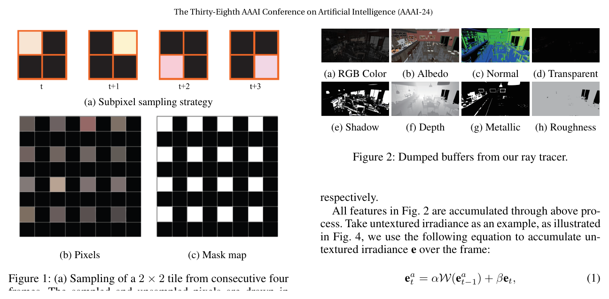
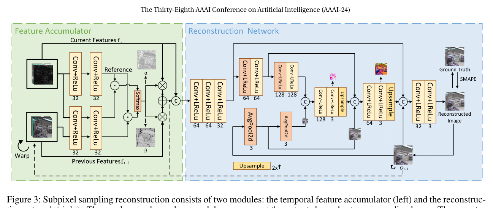
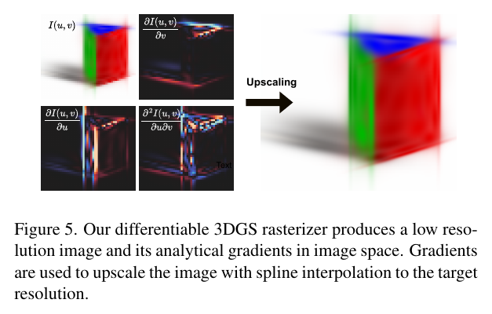
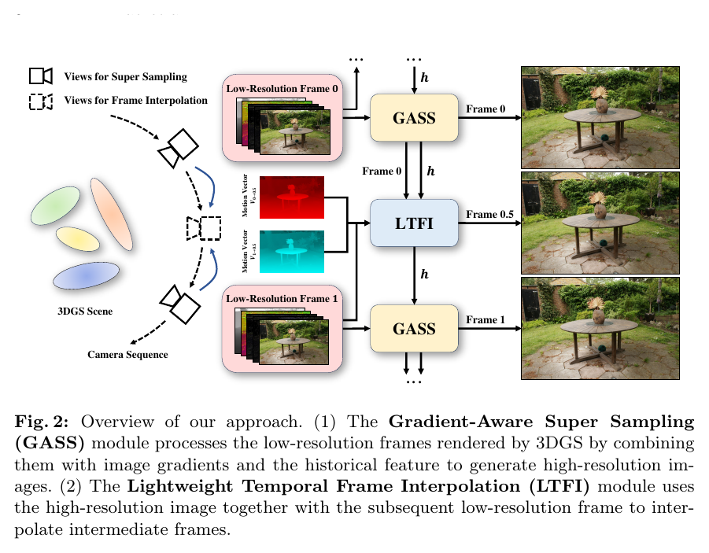
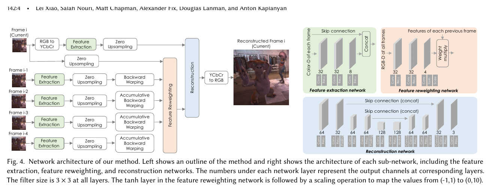
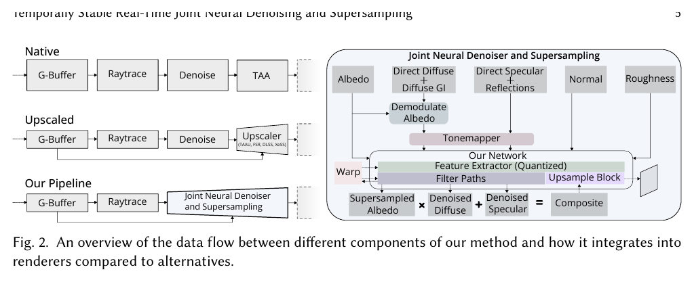
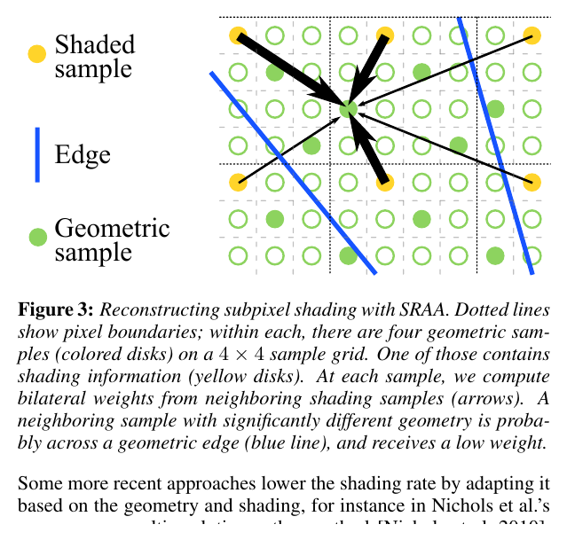
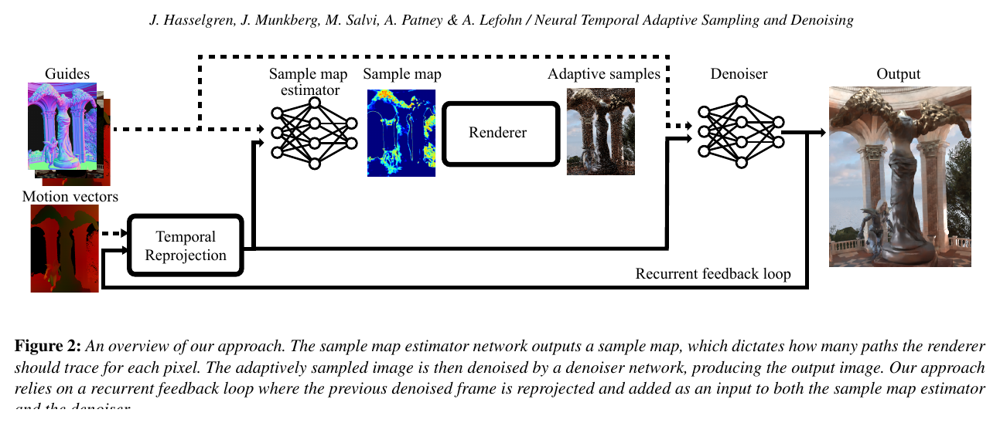
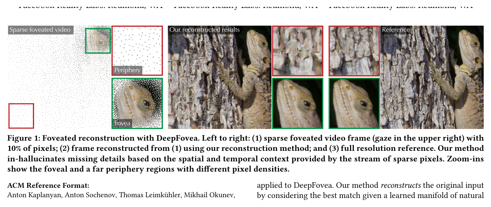

# 고정 조명 Gaussian Splatting의 Ray-Tracing Denoising 및 Sparse Reconstruction 선행연구 조사

> 작성일: 2026-07-28  
> 그림 보강 및 최종 검수: 2026-07-29  
> 조사 목적: **고정 조명 Gaussian Splatting(GS) 렌더링에서 primary-ray 또는 화면 샘플 수를 줄이고, GS로부터 얻을 수 있는 3D 정보(G-buffer)를 이용해 최종 영상을 복원하는 연구**가 존재하는지 파악한다.  
> 핵심 관심 시스템: 3DGS, 3DGRT, 3DGUT, 3DGEER, EVER  
> 조사 기준일: 2026-07-28

> **그림 사용 안내:** 아래 그림은 각 원 논문의 방법을 가장 잘 설명하는 figure를 학술 검토 목적으로 발췌한 것이다. 가독성을 위해 여백만 잘랐으며 내용은 수정하지 않았다. 각 그림 아래에 원 논문의 figure 번호와 출처를 표시했다. 저작권은 각 논문의 저자 및 출판사에 있다.

---

## 1. Executive Summary

### 1.1 가장 중요한 결론


가장 직접적인 연구는 AAAI 2024의 **High-Quality Real-Time Rendering Using Subpixel Sampling Reconstruction(SSR)** 이다. 이 논문은 출력 영상을 서로 겹치지 않는 `2×2` 블록으로 나누고, 각 블록에서 **한 픽셀에 대해서만 Monte Carlo ray tracing**을 수행한다. 논문은 이를 `1/4-spp`라고 부른다. 나머지 세 픽셀은 다음 정보를 이용하여 복원한다.

- 고해상도 G-buffer
  - albedo
  - normal
  - depth
  - metallic
  - roughness
  - shadow
  - transparency
- 현재 픽셀의 실제 ray-tracing 여부를 나타내는 mask
- motion vector로 정렬한 이전 프레임
- 이전 프레임에서 누적한 feature와 denoised RGB

즉 다음과 같은 구조이다.

```text
2×2 픽셀 중 1픽셀만 ray trace
               +
       full-resolution G-buffer
               +
     이전 프레임의 복원 결과와 feature
               ↓
 Temporal Feature Accumulation + U-Net
               ↓
        full-resolution clean image
```

이는 조사 초기에 제시했던 다음 아이디어와 사실상 같은 문제 설정이다.

> 3×3 픽셀을 하나의 블록으로 볼 때 일부 픽셀에만 ray를 쏘고, 나머지 픽셀은 Gaussian 및 3D 정보를 바탕으로 추정한다.

다만 SSR은 mesh 기반 hybrid renderer에서 검증됐으며 GS를 대상으로 하지 않는다.

GS에 직접 적용된 연구 중에서는 다음 두 편이 가장 가깝다.

1. **Lightweight Gradient-Aware Upscaling of 3D Gaussian Splatting Images**, ICCV 2025
   - 저해상도 GS RGB와 Gaussian의 analytical image gradient를 렌더링한다.
   - 계산하지 않은 고해상도 픽셀을 gradient-aware bicubic spline으로 복원한다.
   - 논문 결론에서 ray-tracing에 적용하여 costly ray 수를 줄이는 것을 명시적인 향후 연구로 제시한다.

2. **3DGS³: Joint Super Sampling and Frame Interpolation for Real-Time Large-Scale 3DGS Rendering**, arXiv 2026
   - 저해상도 GS RGB, analytical image gradient, depth, normal-view map, 이전 프레임 feature를 사용한다.
   - GRU 기반 refinement로 고해상도 영상을 복원한다.
   - 조사 대상 중 **GS + G-buffer + temporal neural reconstruction**을 실제로 결합한 가장 직접적인 사례이다.
   - 그러나 2026년 5월 공개된 arXiv v1이며, 논문에 “code will be publicly released upon acceptance”라고 적혀 있으므로 조사 기준일 현재 정식 게재 논문으로 간주해서는 안 된다.

반면 3DGRT, StochasticSplats, Gaussian Point Splatting, Stoch3DGS가 줄이는 샘플은 서로 다르다.

- **3DGRT의 stochastic sampling**: 화면 픽셀 ray를 생략하는 것이 아니라, 한 ray가 만나는 Gaussian hit를 확률적으로 reject한다.
- **StochasticSplats**: 픽셀을 생략하는 것이 아니라 rasterized Gaussian fragment를 확률적으로 accept/reject한다.
- **Gaussian Point Splatting**: Gaussian에서 pixel-sized opaque point를 확률적으로 생성한다.
- **Stoch3DGS**: 한 ray에 기여하는 Gaussian의 일부를 Monte Carlo estimator로 선택한다.

따라서 이들은 모두 denoising 또는 temporal accumulation과 연결될 수 있지만, “2×2나 3×3 중 일부 primary pixel ray만 계산한다”는 SSR 방식과는 샘플링 축이 다르다.

### 1.2 현재 확인되는 연구 공백

다음 네 조건을 동시에 만족하는 정식 선행연구는 조사 범위에서 확인하지 못했다.

1. 고정 조명 GS novel-view synthesis를 대상으로 한다.
2. 3DGRT·3DGUT·3DGEER·EVER처럼 Gaussian/ellipsoid를 3D ray 기준으로 평가한다.
3. `2×2`, `3×3` 또는 adaptive mask에서 일부 **primary pixel ray 자체를 생략**한다.
4. GS에서 얻은 depth·normal·opacity·motion·Gaussian gradient 등을 이용해 미추적 픽셀을 복원한다.

따라서 현재 선행연구 관계는 다음과 같이 정리된다.

```text
SSR (2024)
└─ sparse primary pixel ray + full-resolution G-buffer + temporal neural reconstruction
   └─ 질문의 샘플링 구조와 거의 정확히 일치하지만 GS가 아님

UpscaleGS (2025), 3DGS³ (2026)
└─ low-resolution GS + GS-derived auxiliary information + reconstruction
   └─ GS에는 직접 적용됐지만 renderer가 주로 rasterized 3DGS임

3DGRT / StochasticSplats / GPS / Stoch3DGS
└─ ray hit, Gaussian fragment 또는 Gaussian contribution을 stochastic sampling
   └─ 픽셀 ray 생략과는 다른 샘플링 축

3DGUT / 3DGEER / EVER
└─ fixed-light primary rendering backend
   └─ sparse primary-pixel reconstruction 또는 주된 denoiser가 없음
```

### 1.3 교수님 답변을 반영한 적절한 범위

교수님 답변은 다음 두 가지로 해석하는 것이 타당하다.

- 조명 분리, material decomposition, relighting은 별도 연구 주제이므로 우선 제외한다.
- 대신 GS가 제공할 수 있는 geometry-aware 정보를 최대한 확보한다. 최소한 depth는 필요하다.

따라서 리포트의 중심 범위는 다음과 같다.

> **고정 조명 GS의 primary rendering 비용을 줄이기 위해 저해상도 또는 sparse pixel sampling을 수행하고, depth를 포함한 GS-derived G-buffer와 공간·시간 정보를 이용해 최종 영상을 복원하는 방법**

secondary-ray 기반 shadow, reflection, GI denoising 연구는 핵심 연구가 아니라 비교 및 범위 구분을 위한 배경 연구로 두는 것이 적절하다.

---

## 2. 조사 질문과 판정 기준

### 2.1 Research Questions

본 조사는 다음 질문을 중심으로 진행했다.

1. 기존 GS의 고정 조명 novel-view rendering에서 denoising 또는 reconstruction을 이용해 렌더링 비용을 줄인 연구가 있는가?
2. 줄이는 대상은 무엇인가?
   - 출력 픽셀 또는 해상도
   - 픽셀당 camera ray
   - ray당 Gaussian hit
   - rasterized Gaussian fragment
   - secondary-ray SPP
   - 프레임 수
3. 복원에 어떤 3D 정보가 사용되는가?
   - depth
   - normal
   - motion vector
   - opacity/transmittance
   - albedo/material
   - Gaussian analytical image gradient
4. 해당 연구는 fixed-light GS인가, relightable GS인가?
5. primary ray만 사용하는가, secondary ray를 추가하는가?
6. rasterization, hybrid association, BVH ray tracing 중 어느 backend를 사용하는가?

---

## 3. 용어 정리: 무엇을 샘플링하고 무엇을 복원하는가

### 3.1 Denoising, Reconstruction, Super Sampling의 관계

전통적인 Monte Carlo denoising은 동일한 픽셀에 적은 수의 path/ray만 사용하여 발생한 확률적 noise를 제거하는 문제이다.

```text
모든 픽셀 × low SPP
        ↓
noisy full-resolution image
        ↓
denoiser
```

반면 sparse pixel reconstruction은 일부 픽셀의 값 자체가 존재하지 않는 문제이다.

```text
일부 픽셀만 ray trace
        ↓
sparse image + mask + G-buffer
        ↓
reconstruction network
```

저해상도 super sampling은 규칙적인 격자에서 적은 픽셀만 계산한다.

```text
low-resolution dense image
        ↓
spatial/temporal super-resolution
        ↓
high-resolution image
```

세 문제는 엄밀하게 동일하지 않지만, 공통 목표는 다음과 같다.

> 비싼 image formation sample 수를 줄이고, geometry·spatial·temporal prior로 계산하지 않은 정보를 복원한다.

교수님의 “Ray tracing 가속화 기술의 핵심인 denoising (with given 3D info)”는 좁은 의미의 low-SPP noise removal보다 위의 **geometry-aware sparse rendering reconstruction 전체**를 가리킬 가능성이 높다. 특히 SSR 논문은 방법 이름 자체를 “denoising”과 “subpixel sampling reconstruction”으로 함께 사용한다.


### 3.2 GS에서 G-buffer란 무엇인가

mesh deferred renderer의 G-buffer는 보통 각 픽셀의 단일 표면을 전제로 한다. 반면 GS는 여러 반투명 primitive가 한 픽셀에 누적되므로 depth와 normal의 정의가 유일하지 않다.

가능한 GS-derived buffer는 다음과 같다.

- expected depth
- median depth
- first-hit 또는 surface depth
- accumulated opacity
- transmittance
- blended normal
- surface normal 추정값
- view-normal inner product
- optical flow 또는 camera-pose 기반 motion vector
- 2D Gaussian analytical image gradient
- dominant Gaussian ID 또는 feature

따라서 “GS에서 G-buffer를 얻는다”는 말은 단순 구현 문제가 아니라 **각 buffer의 물리적·통계적 정의를 선택하는 문제**이다. 다만 현재 단계에서는 설계를 확정할 필요 없이, 각 선행연구가 어떤 정의를 사용했는지를 구분하면 된다.

---

## 4. 핵심 선행연구 I: Sparse Primary-Pixel Ray Reconstruction

### 4.1 High-Quality Real-Time Rendering Using Subpixel Sampling Reconstruction (SSR)

- 저자: Boyu Zhang, Hongliang Yuan
- 게재: AAAI 2024, Vol. 38(7), pp. 7006–7014
- DOI: [10.1609/aaai.v38i7.28527](https://doi.org/10.1609/aaai.v38i7.28527)
- 공식 페이지: [AAAI Proceedings](https://ojs.aaai.org/index.php/AAAI/article/view/28527)
- 논문: [PDF](https://ojs.aaai.org/index.php/AAAI/article/download/28527/29027)
- 관련성: **A — 사용자 아이디어와 가장 직접적으로 일치**

#### 4.1.1 문제 설정

기존 실시간 Monte Carlo denoiser는 대체로 `1 spp` 이상의 noisy full-resolution image를 입력으로 받는다. 저자들은 고해상도에서는 `1 spp` 자체도 비싸다고 보고, samples-per-pixel을 1보다 낮추는 `subpixel sampling`을 제안한다.

#### 4.1.2 1/4-spp 패턴

각 출력 프레임을 겹치지 않는 `2×2` tile로 분할한다. 각 tile에서 한 픽셀에 대해서만 Monte Carlo ray tracing을 수행한다.

```text
Frame t       Frame t+1     Frame t+2     Frame t+3

R .           . R           . .           . .
. .           . .           R .           . R
```

- `R`: 실제 ray-traced pixel
- `.`: 현재 프레임에서 미추적 pixel

네 프레임 동안 sampling position을 이동하여 모든 위치가 한 번씩 관측되도록 한다. 논문은 이를 `1/4-spp`라고 정의한다.

이 방법은 단순히 픽셀당 path 수를 `16 → 8`로 줄이는 것이 아니라, **픽셀 자체를 공간·시간적으로 선택하여 추적**한다는 점에서 사용자가 제시한 `3×3 중 한 픽셀` 아이디어와 같은 계열이다.



*그림 4-1. SSR의 핵심 입력. 왼쪽은 네 프레임에 걸쳐 위치를 바꾸는 `2×2 중 1픽셀` sampling과 mask이고, 오른쪽은 sparse RGB를 복원할 때 제공되는 full-resolution G-buffer다. 이 그림이 사용자가 제안한 구조와 가장 직접적으로 대응한다. 출처: [SSR 원 논문](https://ojs.aaai.org/index.php/AAAI/article/view/28527), Fig. 1–2.*

#### 4.1.3 입력 G-buffer

논문은 Vulkan 기반 hybrid ray tracer를 이용한다. RGB는 1/4-spp로 sparse하게 생성하지만, G-buffer는 rasterization pipeline을 이용해 고해상도로 생성한다.

입력 feature는 총 15채널로 설명된다.

- 3D vector 4개
  - albedo
  - normal
  - shadow
  - transparent
- scalar 3개
  - depth
  - metallic
  - roughness
- 별도의 sampled/unsampled mask
- temporal reprojection을 위한 motion vector

중요한 점은 **비싼 lighting/path integration과 상대적으로 싼 geometry buffer 생성을 분리**한다는 것이다.

이 가정은 fixed-light GS에 그대로 적용할 때 재검토가 필요하다. GS에서는 RGB와 depth가 같은 Gaussian traversal/compositing에서 함께 계산되는 경우가 많기 때문에, full-resolution depth를 얻는 비용이 정말 싼지 확인해야 한다. 교수님이 “GS로부터 얻을 수 있는 G-buffer는 다 얻고, depth는 당연히 있어야 한다”고 언급한 것은 바로 이 geometry guidance를 확보하라는 의미로 볼 수 있다.

#### 4.1.4 복원 네트워크

SSR은 두 모듈로 구성된다.



*그림 4-2. SSR 전체 복원 구조. 이전 프레임 feature를 warp·누적하는 TFA와 multi-scale reconstruction network가 결합된다. 즉 한 프레임의 공간 보간만이 아니라 시간축에서 다른 위치에 쌓인 ray sample을 함께 사용한다. 출처: [SSR 원 논문](https://ojs.aaai.org/index.php/AAAI/article/view/28527), Fig. 3.*

##### Temporal Feature Accumulator(TFA)

- motion vector로 이전 feature를 현재 프레임에 warp한다.
- current feature와 warped historical feature의 상관관계를 학습한다.
- sampled mask를 confidence 정보로 사용한다.
- current/history blending weight `α`, `β`를 예측한다.
- disocclusion과 ghosting을 처리하고, 서로 다른 프레임에 분산된 sparse sample을 누적한다.

##### Reconstruction Network(RN)

- multi-scale U-Net 구조
- current feature, accumulated feature, warped previous denoised image를 입력으로 사용한다.
- 이전 프레임의 denoised image를 여러 scale에서 feedback한다.
- coarse decoder stage에서도 RGB를 예측하여 계산량과 temporal receptive field를 절충한다.

RGB는 albedo로 demodulation한 irradiance 공간에서 복원한 뒤 accumulated albedo로 다시 modulation한다.

#### 4.1.5 데이터와 학습

- 장면: BistroInterior, BistroExterior, Sponza, Diningroom, Warmroom, Angel
- 각 장면: 100–1000 frames
- 해상도: `1024×2048`
- ground truth: `32768 spp`
- 장면별 별도 학습
- 8× NVIDIA Tesla A100
- 200 epochs
- 장면당 약 9시간

즉 general scene-independent model이 아니라, 논문 설정에서는 scene-specific training이 필요하다.

#### 4.1.6 GS에 대한 의미

이 논문은 현재 조사에서 다음 명제를 가장 강하게 뒷받침한다.

> 픽셀당 ray 수만 낮추는 것이 아니라, 일부 픽셀의 primary ray를 아예 계산하지 않고 G-buffer와 시간축 정보를 이용해 복원하는 것이 가능하다.

그러나 GS 적용 시 차이가 있다.

- SSR의 full-resolution G-buffer는 mesh rasterization으로 비교적 저렴하게 얻는다.
- GS의 depth/normal/opacity는 여러 Gaussian을 compositing해야 얻어질 수 있다.
- fixed-light GS에서는 albedo, metallic, roughness, shadow, transparency가 분리돼 있지 않다.
- 따라서 GS에서는 depth, opacity, normal, motion, Gaussian gradient 중 어떤 정보가 **RGB ray tracing보다 충분히 싸면서도 복원에 유효한지**가 핵심이다.

이 차이는 향후 설계 문제이지만, 현재 문헌조사 단계에서는 “가장 직접적인 non-GS precedent”로 분류하면 된다.

---

## 5. 핵심 선행연구 II: GS Low-Resolution Rendering and Reconstruction

### 5.1 Lightweight Gradient-Aware Upscaling of 3D Gaussian Splatting Images (UpscaleGS)

- 저자: Simon Niedermayr, Christoph Neuhauser, Rüdiger Westermann
- 게재: ICCV 2025
- 논문: [arXiv 2503.14171](https://arxiv.org/abs/2503.14171)
- 프로젝트/데모/코드: [Project Page](https://niedermayr.dev/upscale3dgs/)
- 관련성: **A/B — GS에 직접 적용된 가장 단순하고 해석 가능한 사례**

#### 5.1.1 핵심 아이디어

3DGS가 만드는 화면 함수 `I(x,y)`는 projected Gaussian kernel과 alpha compositing으로 구성되므로 image-space 좌표에 대해 미분 가능하다.

일반 bicubic interpolation은 주변 pixel intensity의 finite difference로 `∂I/∂x`, `∂I/∂y`를 근사한다. 이 논문은 각 projected Gaussian의 analytical derivative를 compositing하여 더 정확한 image gradient를 계산한다.

```text
low-resolution RGB
+ exact analytical gradients ∂I/∂x, ∂I/∂y, ∂²I/∂x∂y
                 ↓
       gradient-aware bicubic spline
                 ↓
          high-resolution RGB
```

픽셀 색은 다음 alpha compositing으로 표현된다.

```math
I(x,y)=\sum_{i=1}^{N} T_i(x,y)\alpha_i(x,y)c_i
```

이를 화면 좌표로 미분하면 Gaussian 자체의 derivative뿐 아니라 앞선 Gaussian들이 만든 transmittance의 derivative도 포함된다.

```math
\frac{\partial I}{\partial x}
=\sum_i c_i\left(\frac{\partial T_i}{\partial x}\alpha_i
+T_i\frac{\partial\alpha_i}{\partial x}\right)
```

따라서 이 연구의 보조 정보는 일반 mesh G-buffer가 아니라 **GS representation 자체에서 직접 유도한 연속 신호 정보**이다.



*그림 5-1. UpscaleGS의 핵심 과정. 저해상도 RGB와 함께 3DGS rasterizer가 analytical image gradient를 출력하고, 이를 spline interpolation에 넣어 목표 해상도를 복원한다. ray hit noise가 아니라 미계산 고해상도 pixel을 Gaussian의 미분 정보로 추정한다는 점이 중요하다. 출처: [UpscaleGS 원 논문](https://arxiv.org/abs/2503.14171), Fig. 5.*

#### 5.1.2 학습과 추론

두 방식이 가능하다.

1. 기존 3DGS를 저해상도로 렌더링하고 추론 시 spline upscaling만 적용
2. differentiable spline upscaler를 3DGS optimization 안에 넣어, 처음부터 저해상도 render → 고해상도 loss로 학습

두 번째 방식에서는 rasterizer가 훨씬 적은 fragment를 생성하고, upscaling loss가 analytical gradient를 통해 Gaussian parameter로 역전파된다.

이 방법은 neural network가 아니며 scene-specific denoiser 학습이 없다. 따라서 hallucination 위험과 network inference cost가 작고 해석 가능성이 높다.


#### 5.1.3 한계

- smooth spline 특성 때문에 완전히 새로운 sharp high-frequency detail을 복원하지 못한다.
- depth, normal, motion vector를 사용하지 않는다.
- 논문은 당시 3DGS에서 accurate depth/motion vector를 얻기 어렵다는 관점으로 DLSS를 비교한다.
- dynamic scene이나 disocclusion을 명시적으로 처리하지 않는다.
- training에 포함할 경우 backward upscaling implementation이 병목이 될 수 있다.

#### 5.1.4 본 조사에서 특히 중요한 문장

논문 결론은 향후 연구로 다음 방향을 명시한다.

> spline-based upscaling을 ray tracing에 적용하여 costly rays의 수를 줄이는 방향

즉 “GUT/GEER/EVER 같은 ray-evaluated GS에서 일부 ray만 계산하고 Gaussian gradient로 복원할 수 있는가?”라는 질문은 단순한 추측이 아니라, **ICCV 2025 GS upscaling 논문이 직접 제안한 미해결 방향** 이다.

---

### 5.2 3DGS³: Joint Super Sampling and Frame Interpolation for Real-Time Large-Scale 3DGS Rendering

- 저자: Yibo Zhao, Fan Gao, Youcheng Cai, Ligang Liu
- 공개: arXiv:2605.11489v1, 2026-05-12
- 논문: [arXiv](https://arxiv.org/abs/2605.11489), [HTML](https://arxiv.org/html/2605.11489v1)
- 상태: 조사 기준일 현재 arXiv preprint; 정식 게재 여부 확인 필요
- 관련성: **A — GS + depth/normal + temporal neural reconstruction의 가장 직접적인 사례**

#### 5.2.1 전체 구조

3DGS³는 기존 splatting pipeline을 바꾸지 않고 low-resolution output을 후처리한다.



*그림 5-2. 3DGS³ 전체 파이프라인. low-resolution GS frame은 GASS로 고해상도화되고, 연속한 두 frame과 geometry 정보를 이용한 LTFI가 중간 frame을 합성한다. 이 그림은 공간 sample과 시간 frame을 동시에 줄이는 논문의 범위를 보여준다. 출처: [3DGS³ 원 논문](https://arxiv.org/abs/2605.11489), Fig. 2.*

```text
Low-resolution 3DGS frame
├─ RGB
├─ analytical image gradients
├─ depth
├─ normal-view inner product
└─ warped historical feature
          ↓
Gradient-Aware Super Sampling (GASS)
          ↓
High-resolution frame
          +
subsequent low-resolution frame
          ↓
Lightweight Temporal Frame Interpolation (LTFI)
          ↓
High-resolution intermediate frame
```

#### 5.2.2 GASS: Gradient-Aware Super Sampling

GASS는 두 단계로 구성된다.

##### Gradient-Aware Interpolation(GAI)

- low-resolution `3×3` pixel neighborhood를 사용한다.
- 각 node의 RGB와 `∂I/∂x`, `∂I/∂y`를 사용한다.
- `S×` 확대 시 low-resolution neighborhood로부터 high-resolution `S×S` block의 색을 예측한다.
- convolution과 transposed convolution으로 polynomial coefficient mapping을 구현한다.

사용자가 언급한 `3×3`은 이 논문에도 실제로 등장한다. 다만 “3×3 중 한 픽셀만 추적”하는 sparse mask가 아니라, **저해상도 3×3 neighborhood 전체를 이용해 고해상도 block을 보간**한다.

##### Geometry-Temporal Recurrent Refinement(GTRR)

modified GRU가 다음 정보를 사용한다.

- current low-resolution RGB
- Gaussian analytical gradient
- depth map
- normal–view inner product map
- previous hidden feature를 현재 camera로 warp한 결과

논문 구현은 RaDe-GS를 사용하여 depth와 normal을 렌더링한다. camera pose로 motion vector를 구하고 CUDA kernel로 warping한다.

#### 5.2.3 LTFI: Frame Interpolation

LTFI는 frame 0과 frame 1 사이의 중간 frame 0.5를 합성한다.

- frame 0의 high-resolution RGB/depth/normal
- frame 1의 low-resolution RGB/depth/normal/gradient
- camera pose 기반 forward/backward warping
- lightweight U-Net-like feature fusion
- temporal recurrent unit

즉 이 논문은 공간 해상도뿐 아니라 시간 해상도도 함께 줄인다.


---

## 6. 전통 Ray-Tracing Denoising 및 Super Sampling 기반 연구

### 6.1 Neural Supersampling for Real-Time Rendering (NSRR)

- 저자: Lei Xiao 외
- 게재: ACM TOG 39(4), SIGGRAPH 2020, Article 142
- DOI: [10.1145/3386569.3392376](https://doi.org/10.1145/3386569.3392376)
- 논문: [PDF](https://www.cs.jhu.edu/~misha/ReadingSeminar/Papers/Xiao20.pdf)
- 관련성: **D/A — low-resolution primary rendering + depth/motion 기반 복원**

NSRR은 rendering 전용 neural super-resolution이다.

- low-resolution color
- low-resolution depth
- dense motion vector
- 여러 이전 frame

을 이용해 4×4 super sampling, 즉 각 저해상도 pixel에서 고해상도 `4×4` block을 복원한다. 단순 single-image super-resolution과 달리 renderer가 제공하는 정확한 motion/depth를 사용하고 temporal stability를 목표로 한다.

사용자의 아이디어와 차이는 sparse mask가 아니라 regular low-resolution grid라는 점뿐이다. 개념적으로는 full-resolution에서 16개 pixel을 계산하는 대신 한 개에 해당하는 저해상도 sample을 계산하고 나머지를 복원하는 구조다.

GS 적용 관점에서는 3DGS³의 직접적인 선행 계열이며, SSR 논문도 baseline으로 사용한다.



*그림 7-1. NSRR은 현재 low-resolution color와 여러 이전 frame을 feature extraction, backward warping, reweighting한 뒤 고해상도 frame을 복원한다. renderer가 제공하는 depth와 subpixel motion이 일반 영상 super-resolution과 구분되는 핵심이다. 출처: [NSRR 원 논문](https://doi.org/10.1145/3386569.3392376), Fig. 4.*

---

### 6.2 Temporally Stable Real-Time Joint Neural Denoising and Supersampling

- 저자: Manu Mathew Thomas 외
- 게재: High Performance Graphics 2022
- 공식 페이지: [Intel Graphics Research](https://www.intel.com/content/www/us/en/developer/articles/technical/temporally-stable-denoising-and-supersampling.html)
- 관련성: **D — low-resolution + low-SPP를 동시에 처리**

이 연구는 두 문제를 하나의 network에서 결합한다.



*그림 6-2. Joint Neural Denoising and Supersampling의 data flow. 기존의 `denoise → TAA/upscale` 두 단계 대신 low-resolution ray-traced diffuse/specular 신호와 G-buffer를 하나의 network에서 denoise·supersample한다. 출처: [Thomas et al. 원 논문](https://momentsingraphics.de/HPG2022.html), Fig. 2.*

- input: noisy low-resolution path-traced image
- shared low-precision feature extractor
- 여러 higher-precision filter stage
- output: denoised, antialiased, 2× resolution image

즉 다음 두 비용을 동시에 낮춘다.

1. 해상도를 낮춰 primary pixel 수 감소
2. SPP를 낮춰 픽셀당 path 수 감소

그러나 soft shadow, glossy reflection, diffuse GI 같은 ray-traced lighting을 주요 대상으로 하므로 secondary-ray 확장 파이프라인에 더 가깝다. GS 보고서에서는 “denoising과 super sampling을 분리할 필요가 없다”는 설계 개념의 근거로 사용하되, fixed-light GS 직접 선행연구로 분류해서는 안 된다.

---

### 6.3 Subpixel Reconstruction Antialiasing (SRAA)

- 저자: Matthäus G. Chajdas, Morgan McGuire, David Luebke
- 게재: I3D 2011
- 공식 페이지: [NVIDIA Research](https://research.nvidia.com/publication/2011-02_subpixel-reconstruction-antialiasing)
- 논문: [PDF](https://research.nvidia.com/sites/default/files/pubs/2011-02_Subpixel-Reconstruction-Antialiasing/I3D11.pdf)
- 관련성: **D — “given 3D info”의 고전적 사례**

SRAA는 deferred shading renderer에서 다음을 수행한다.

- shading은 regular 1× grid에서 pixel당 1회만 수행
- subpixel visibility/depth/normal은 super-resolution으로 확보
- joint bilateral reconstruction으로 geometric boundary를 보존

`1280×720`에서 약 1.8 ms로 동작하며, shading cost를 늘리지 않고 4–16× shading에 가까운 antialiasing quality를 보고한다.

이 연구는 stochastic noise 제거보다는 geometry-aware reconstruction/antialiasing이다. 그러나 교수님의 문구를 가장 고전적으로 해석하면 다음과 정확히 일치한다.

> 비싼 shading sample은 적게 계산하고, 고해상도 depth와 normal이라는 주어진 3D 정보로 미계산 subpixel을 복원한다.



*그림 6-3. SRAA는 적은 shaded sample(노란색)을 고해상도 geometric sample(초록색), edge, depth·normal 유사도로 가중하여 subpixel shading을 복원한다. 교수님의 “denoising with given 3D info”를 가장 고전적으로 시각화한 그림이다. 출처: [SRAA 원 논문](https://research.nvidia.com/publication/2011-02_subpixel-reconstruction-antialiasing), Fig. 3.*

---


---

### 6.4 Neural Temporal Adaptive Sampling and Denoising (NTASD)

- 저자: Jon Hasselgren 외
- 게재: Computer Graphics Forum 2020
- 프로젝트: [NVIDIA Research](https://research.nvidia.com/labs/rtr/publication/hasselgren2020neuraltemp/)
- 관련성: **D/E — adaptive sample allocation의 직접 근거**

이 연구는 sample predictor와 denoiser를 여러 frame에 걸쳐 end-to-end로 공동 학습한다.

- disocclusion 영역에 더 많은 sample 배치
- 움직이는 specular highlight를 시간축에서 추적
- temporal feedback으로 effective sample count 증가
- 초기 uniform sampling pass 제거 가능

사용자의 고정 `3×3 중 한 픽셀`보다 더 일반적인 adaptive mask를 학습하는 선행연구로 볼 수 있다. 다만 low-sample path tracing을 대상으로 하므로 GS 직접 연구는 아니다.



*그림 6-4. NTASD 전체 흐름. guide와 이전 denoised frame으로 sample map을 예측해 ray budget을 공간적으로 재배분하고, 그 결과를 다시 denoise한다. sampling policy와 denoiser가 recurrent feedback loop 안에서 공동으로 학습된다는 점이 핵심이다. 출처: [NTASD 원 논문](https://research.nvidia.com/labs/rtr/publication/hasselgren2020neuraltemp/), Fig. 2.*

---

### 6.5 DeepFovea

- 저자: Anton Kaplanyan 외
- 게재: SIGGRAPH Asia 2019
- 공식 페이지: [Meta AI Research](https://ai.meta.com/research/publications/deepfovea-neural-reconstruction-for-foveated-rendering-and-video-compression-using-learned-statistics-of-natural-videos/)
- 관련성: **D/A — 매우 sparse한 pixel stream에서 영상 복원**

DeepFovea는 peripheral vision 영역에서 매 frame 소수의 pixel만 제공하고, natural video manifold를 학습한 generative network로 plausible video를 복원한다.

장점은 sparse pixel rendering의 직접적인 가능성을 보여준다는 점이다. 반면 단점은 geometry-aware G-buffer보다 learned natural-image prior에 더 의존하여 실제 scene detail을 hallucinate할 가능성이 있고, 중심 목적이 gaze-contingent foveated rendering이라는 점이다.

고정 균일 sampling보다 시선 중심 non-uniform sampling을 검토할 때 참고할 연구다.



*그림 6-5. DeepFovea는 peripheral pixel 대부분이 비어 있는 sparse frame을 입력으로 받아 full-resolution reference에 가까운 영상을 생성한다. GS나 G-buffer 기반은 아니지만, ‘pixel 자체를 계산하지 않고 시간·영상 prior로 채운다’는 가능성을 가장 직관적으로 보여준다. 출처: [DeepFovea 원 논문](https://ai.meta.com/research/publications/deepfovea-neural-reconstruction-for-foveated-rendering-and-video-compression-using-learned-statistics-of-natural-videos/), Fig. 1.*
