# 3DGUT 기반 Sparse Primary-Ray Rendering 예비 실험 보고서

> 작성일: 2026-08-03  
> 현재 단계: **추론 단계의 성능·품질 상한 검증**  
> 핵심 결과: R1(원해상도)으로 학습한 동일한 3DGUT 모델에서 primary ray를 약 1/4만 평가하고 bilinear로 R1 영상을 복원했을 때, 4개 장면 평균 **2.36배**의 forward 가속과 **-0.026 dB**의 장면 평균 GT-PSNR 변화를 얻었다.

## 1. 배경

### 1.1 연구 질문

3DGUT는 타일 단위로 Gaussian 후보를 구성하지만, 최종 response와 compositing은 각 pixel의 3D ray를 기준으로 수행한다. 고해상도에서는 서로 인접한 primary ray가 유사한 Gaussian 집합과 radiance를 관측할 가능성이 높다. 따라서 모든 pixel에서 ray–Gaussian 평가를 반복하지 않고, 일부 pixel에서만 ray를 평가한 뒤 나머지를 복원할 수 있는지를 먼저 확인하였다.

이는 Ray tracing의 속도 문제를 denoising으로 해결하는 원리인 ray의 수를 줄이고 ray를 쏘지 않은 픽셀의 noise를 denoiser로 해결하는 구조를 gs계열에서 수행해본 것이라고 볼 수있다.

본 실험의 질문은 다음과 같다.

> **R1(원해상도)으로 학습된 장면을 R1 해상도로 출력하되, 1/4-ray 만 평가하고 나머지 pixel을 복원하면 품질을 거의 유지하면서 실제 forward 시간을 줄일 수 있는가?**

여기서 R1은 원해상도, 1/4-ray 는 가로·세로를 각각 1/2로 줄인 해상도를 뜻한다. 따라서 1/4-ray의 pixel 수와 ray 수는 R1의 약 1/4이다.

### 1.2 연구 범위

현재 실험은 다음 범위에 한정된다.

- 고정 조명이 appearance에 학습된 일반적인 3D Gaussian scene을 사용한다.
- shadow, reflection, GI를 위한 secondary ray를 추가하지 않는다.
- 학습된 R1 모델의 **forward inference**만 비교한다.
- 현재 복원기는 학습형 denoiser가 아니라 GPU bilinear interpolation이다.

### 1.3 핵심 가설

인접 pixel 간 radiance가 대부분 부드럽게 변한다면, smooth 영역은 값싼 image-space 복원만으로 충분할 수 있다. 반면 depth/opacity discontinuity에서는 서로 다른 Gaussian visibility가 섞이므로 오차가 집중될 가능성이 높다. 이 가설이 맞다면 모든 missing pixel에 복잡한 수식을 적용하기보다, smooth 영역은 단순 복원하고 visibility가 불확실한 일부 영역만 3D Gaussian 정보로 보정하는 구조가 효율적이다.

---

## 2. 수학적 구현 및 구조

### 2.1 Full-ray 3DGUT 기준 렌더링

R1 영상의 pixel $p$에 대한 camera ray를

$$
\mathbf r_p(t)=\mathbf o+t\mathbf d_p
$$

라고 하자. 3DGUT는 투영 및 tile culling으로 후보 Gaussian을 얻은 뒤, pixel ray를 기준으로 각 Gaussian의 response를 평가한다. 정렬된 Gaussian의 ray-dependent opacity contribution을 $\alpha_i(p)$, view-dependent color를 $\mathbf c_i(p)$라고 쓰면 front-to-back compositing은

$$
T_i(p)=\prod_{j<i}\left(1-\alpha_j(p)\right),
$$

$$
\mathbf C_{\mathrm{full}}(p)
=\sum_i T_i(p)\alpha_i(p)\mathbf c_i(p)
$$

로 표현할 수 있다. 실제 실험에서는 3DGUT의 기존 CUDA renderer를 변경하지 않고 이 결과를 full-ray reference로 사용했다.

### 2.2 2×2 sparse primary-ray proxy

출력 크기가 $H\times W$일 때 anchor grid를

$$
H_a=\left\lceil\frac H2\right\rceil,\qquad
W_a=\left\lceil\frac W2\right\rceil
$$

로 두고, R2 camera에서

$$
\widetilde{\mathbf C}(u,v)
=\operatorname{GUT}\!\left(\mathbf r^{(2)}_{u,v};\,\mathcal G\right)
$$

를 계산한다. $\mathcal G$는 R1에서 학습된 고정 Gaussian 집합이다. Full path와 sparse path 사이에서 모델 parameter, Gaussian 수, camera pose, shading 설정은 바뀌지 않는다.

### 2.3 Bilinear 복원

Missing pixel은 PyTorch의 bilinear interpolation(`align_corners=False`)으로 복원한다. 출력 pixel $(x,y)$에 대응하는 anchor-grid 연속 좌표를 $(u,v)$라 하고

$$
u_0=\lfloor u\rfloor,\quad u_1=u_0+1,\qquad
v_0=\lfloor v\rfloor,\quad v_1=v_0+1
$$

로 두면, 복원 색은 인접 네 anchor의 convex combination이다.

$$
\widehat{\mathbf C}(x,y)
=\sum_{m\in\{u_0,u_1\}}\sum_{n\in\{v_0,v_1\}}
w_{mn}(u,v)\widetilde{\mathbf C}(m,n),
$$

$$
\sum_{m,n}w_{mn}=1,\qquad w_{mn}\ge 0.
$$

현재 복원은 RGB 결과에만 적용된다. Missing ray에서 Gaussian 후보를 다시 탐색하거나, Gaussian response·depth·normal·opacity를 이용해 색을 직접 계산하지 않는다. 즉 “Gaussian 정보를 이용한 denoising”의 최종 구현이 아니라 가장 단순하고 빠른 비교 기준이다.

### 2.4 시간 모델

Full rendering 비용을 resolution-independent 비용과 ray-dependent 비용으로 나누면

$$
t_{\mathrm{full}}=t_{\mathrm{fixed}}+t_{\mathrm{ray}}(HW)
$$

로 볼 수 있다. 1/4-ray path는 이상적으로

$$
t_{\mathrm{sparse}}
=t'_{\mathrm{fixed}}+t_{\mathrm{ray}}(HW/4)+t_{\mathrm{recon}}
$$

가 된다. Ray 수가 4배 감소해도 Gaussian projection, tile duplication/culling, scan/sort, tensor 준비 등의 고정·준고정 비용이 남기 때문에 전체 가속은 4배보다 작다. 실제 측정에서는 2.18–2.45배의 complete-forward 가속을 얻었다.

### 2.5 Smooth/boundary 분리 평가

복원 오차가 visibility boundary에 집중되는지를 보기 위해 full-ray 결과의 depth $z_p$와 opacity $A_p$를 사용해 진단용 mask를 만들었다. 인접 pixel $p,q$에 대해

$$
e_z(p,q)=\frac{|z_p-z_q|}{\min(z_p,z_q)+\epsilon}
$$

를 계산하고, 다음 중 하나를 만족하면 boundary로 표시했다.

$$
e_z(p,q)>0.02
\quad\text{or}\quad
|A_p-A_q|>0.10.
$$

---

## 3. 정량 결과

### 3.1 데이터와 학습 설정

Mip-NeRF 360의 실내 장면 Bonsai, Counter, Room과 실외 장면 Stump를 사용하였다. 모든 모델은 COLMAP camera/data를 사용해 원해상도 R1에서 30,000 iteration 학습했다. Validation split은 `test_split_interval=8`이며, renderer는 vanilla 3DGUT, `k_buffer_size=0`, global z-order 설정이다. Counter, Room, Stump에는 OOM 방지를 위한 `spawn_cap=2,000,000`을 두었고 최종 Gaussian 수는 모두 이 값보다 작았다.

| 장면 | 장면 특성 | 평가 view | R1 출력 크기 | 1/4-ray 크기 | 최종 Gaussian 수 |
|---|---|---:|---:|---:|---:|
| Bonsai | 실내, 얇은 구조·식물·자전거 경계 | 37 | 2078×3118 | 1039×1559 | 1,137,814 |
| Counter | 실내, 복잡한 물체 경계·반사 표면 | 30 | 2076×3115 | 1038×1558 | 953,098 |
| Room | 실내, 넓은 smooth 영역·긴 depth | 39 | 2075×3114 | 1038×1557 | 894,947 |
| Stump | 실외, 식생·고주파 texture·복잡한 visibility | 16 | 3300×4978 | 1650×2489 | 1,844,630 |

실험 GPU는 NVIDIA GeForce RTX 4070 SUPER 12 GB이다. 품질은 각 장면의 전체 test view에서 측정했다. 

### 3.2 GT 기준 품질

| 장면 | Full R1  | 1/4 rays  | PSNR 변화 | SSIM 변화 |
|---|---:|---:|---:|---:|
| Bonsai | 32.066 dB / 0.934623 | 32.020 dB / 0.933778 | -0.046 dB | -0.000846 |
| Counter | 28.916 dB / 0.909066 | 28.861 dB / 0.907681 | -0.055 dB | -0.001385 |
| Room | 31.260 dB / 0.909922 | 31.201 dB / 0.908584 | -0.059 dB | -0.001338 |
| Stump | 26.035 dB / 0.790989 | 26.090 dB / 0.794189 | **+0.056 dB** | **+0.003201** |
| **장면 평균** | — | — | **-0.026 dB** | **-0.000092** |

Stump에서는 16개 validation view 모두 PSNR이 0.021–0.125 dB 개선됐다. 이는 sparse path가 full-ray path보다 물리적으로 더 정확하다는 의미가 아니라, bilinear smoothing이 기존 모델의 고주파 artifact 일부를 줄여 GT metric에 유리하게 작용한 결과로 해석해야 한다.

개별 view에서는 Bonsai의 최악 변화가 -0.478 dB, Counter는 -0.299 dB, Room은 -0.493 dB였다. 따라서 장면 평균 손실이 매우 작더라도 일부 camera에서의 국소 visibility 오류는 별도로 다뤄야 한다.

### 3.3 Full-ray render 재현도와 영역별 오차

| 장면 | 1/4-ray 복원 vs. Full PSNR | SSIM | Smooth PSNR | Boundary PSNR | Boundary 비율 |
|---|---:|---:|---:|---:|---:|
| Bonsai | 48.257 dB | 0.997345 | 49.212 dB | 42.946 dB | 8.53% |
| Counter | 46.179 dB | 0.995935 | 46.998 dB | 39.382 dB | 4.48% |
| Room | 47.856 dB | 0.996678 | 49.069 dB | 41.627 dB | 6.85% |
| Stump | 49.764 dB | 0.997477 | 51.147 dB | 46.105 dB | 18.69% |

네 장면의 복원-vs-full PSNR은 모두 46 dB 이상이다. 그러나 모든 장면에서 boundary PSNR이 smooth PSNR보다 낮으며, 격차는 약 5.0–7.6 dB이다. 

즉 단순 bilinear의 잔여 오차는 주로 depth/opacity 변화가 큰 위치에 집중된다. 이는 향후 계산 예산을 전체 영상이 아니라 visibility-risk 영역에 선택적으로 사용하면 품질면에서 조금 더 개선할 수 있는 부분이라고 보여지긴 한다.

### 3.4 추론 시간

| 장면 | Full renderer | 1/4-rays renderer | Full forward | 1/4-rays forward | Bilinear | 1/4-rays+bilinear | E2E 가속 |
|---|---:|---:|---:|---:|---:|---:|---:|
| Bonsai | 11.685 ms | 4.452 ms | 17.238 ms | 7.672 ms | 0.233 ms | 7.905 ms | **2.181×** |
| Counter | 15.102 ms | 5.521 ms | 20.222 ms | 8.093 ms | 0.229 ms | 8.322 ms | **2.430×** |
| Room | 12.033 ms | 4.461 ms | 17.011 ms | 6.902 ms | 0.230 ms | 7.132 ms | **2.385×** |
| Stump | 28.054 ms | 9.650 ms | 39.824 ms | 15.684 ms | 0.572 ms | 16.257 ms | **2.450×** |
| **장면 평균** | — | — | — | — | — | — | **2.361×** |

여기서 **renderer 시간**은 3DGUT plugin 내부의 `renderForward` 구간만 측정한 값이다. 이 구간에는 Gaussian의 투영·culling과 tile 후보 처리, ray–Gaussian 평가 및 compositing을 수행하는 핵심 렌더링 과정이 포함된다. 

반면 **forward 시간**은 CUDA event로 측정한 전체 `model(batch)` 호출 시간이다. 여기에는 `renderForward`뿐 아니라 입력 tensor 정리와 contiguous 변환, 출력 tensor 할당, camera parameter 설정, background 합성 및 출력 tensor 변환 등 renderer 전후의 처리도 포함된다. Dataset loading과 batch 생성은 두 시간 모두에 포함되지 않는다.

따라서 항상 `Full forward > Full renderer`, `1/4-rays forward > 1/4-rays renderer`가 된다. 두 값의 차이는 별도의 ray를 더 추적한 시간이 아니라, renderer 외부의 model forward overhead이다. E2E 가속은 다음과 같이 계산했다.

$$
S=\frac{t_{\mathrm{full\ forward}}}
{t_{\mathrm{1/4\text{-}rays\ forward}}+t_{\mathrm{bilinear}}}
$$

Bilinear 비용은 0.23–0.57 ms로 작았다. 4배 적은 ray가 2.18–2.45배 가속으로 이어진 것은 ray 외 단계가 상당한 시간을 차지함을 보여준다.

### 3.5 현재 결론

동일한 R1 학습 모델에서 1/4-rays만 사용했을 때 네 장면 평균 GT-PSNR 변화는 -0.026 dB에 그쳤다. 동시에 실제 complete forward와 복원을 합친 시간은 평균 2.36배 빨라졌다. 따라서 “고해상도 ray-evaluated GS에서 공간적으로 희소한 primary ray를 평가하고 나머지를 복원한다”는 방향에는 유효한 성능 향상이 보인다고 생각된다.

다만 이 결과만으로 새로운 방법의 기여가 완성된 것은 아니다. 현재 방식은 저해상도 GUT render와 일반 bilinear upsampling을 결합한 baseline이며, Gaussian/G-buffer 정보를 이용한 복원이나 불확실성 기반 exact fallback은 아직 없다.

---

## 4. 정성 결과

아래는 각 장면의 validation view 0이다. 왼쪽부터 GT, full-ray GUT, 1/4-rays 결과를 원해상도로 bilinear 복원한 영상, full-ray 결과와의 절대 오차를 5배 확대한 영상이다.

### 4.1 Bonsai

| GT | Full rays | 1/4-rays + bilinear | $\lvert\widehat{\mathbf C}-\mathbf C_{\mathrm{full}}\rvert\times5$ |
|---|---|---|---|
| 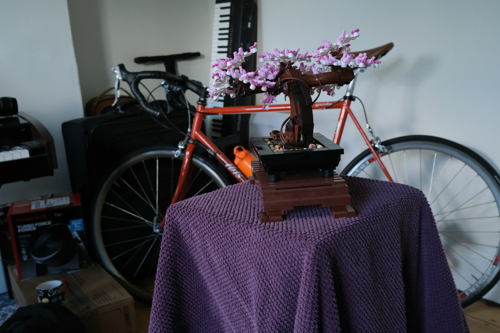 |  | 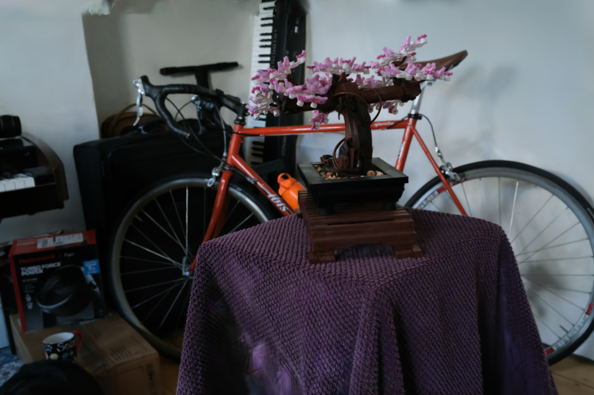 | 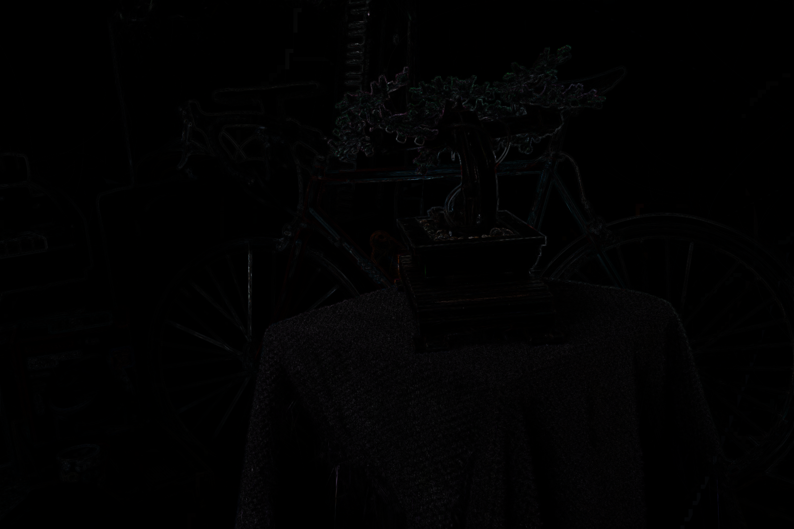 |

육안상 전체 구조와 색은 거의 동일하다. 확대 오차는 자전거 바퀴살, 화분과 꽃, 천의 주름처럼 얇고 고주파인 경계에 주로 나타난다.

### 4.2 Counter

| GT | Full rays | 1/4-rays + bilinear | $\lvert\widehat{\mathbf C}-\mathbf C_{\mathrm{full}}\rvert\times5$ |
|---|---|---|---|
| 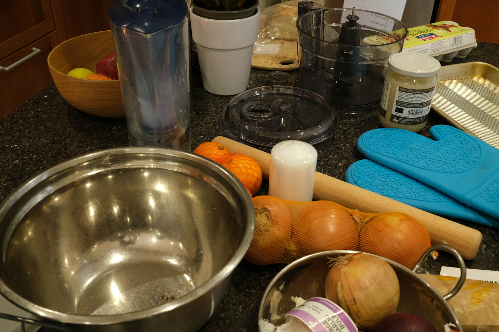 |  | 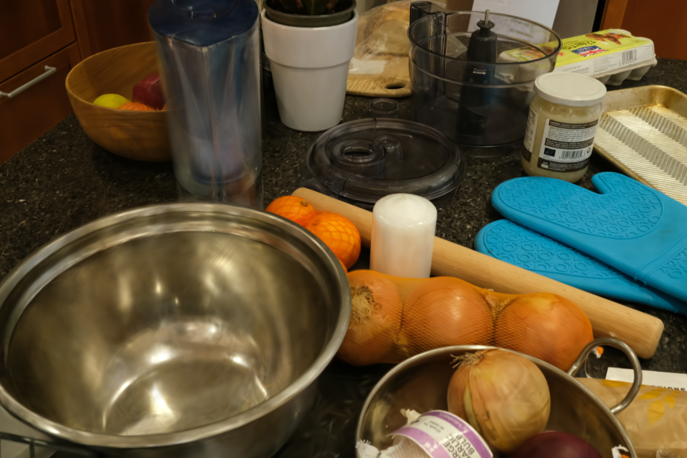 | 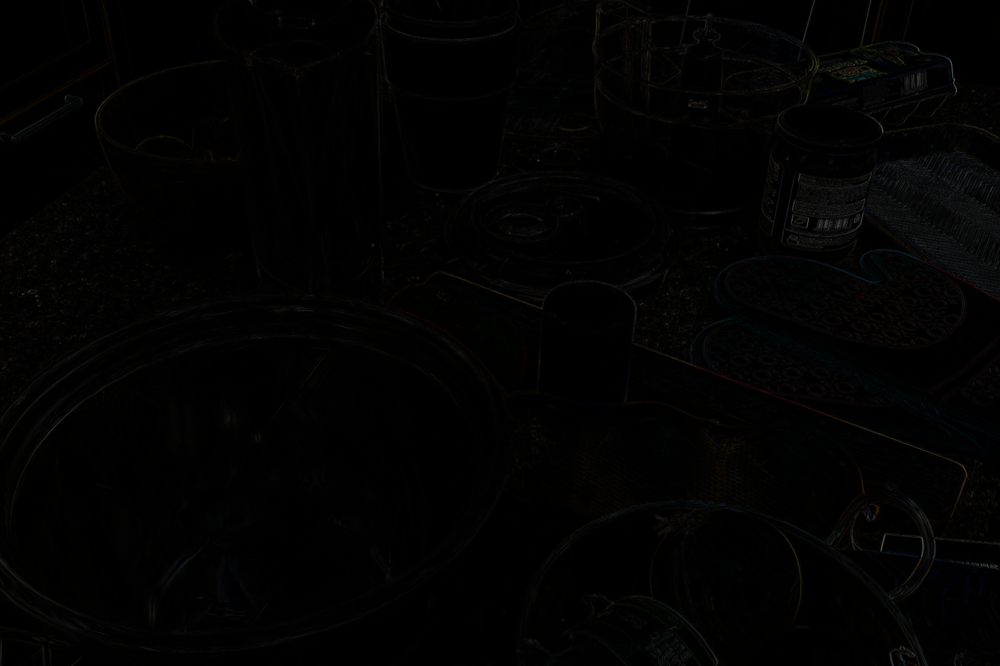 |

금속 그릇과 여러 물체가 겹치는 복잡한 장면에서도 복원 영상은 full-ray 영상과 매우 유사하다. 오차 영상에서는 물체 윤곽, 반사 highlight, 가는 texture 주변이 두드러진다.

### 4.3 Room

| GT | Full rays | 1/4-rays + bilinear | $\lvert\widehat{\mathbf C}-\mathbf C_{\mathrm{full}}\rvert\times5$ |
|---|---|---|---|
| 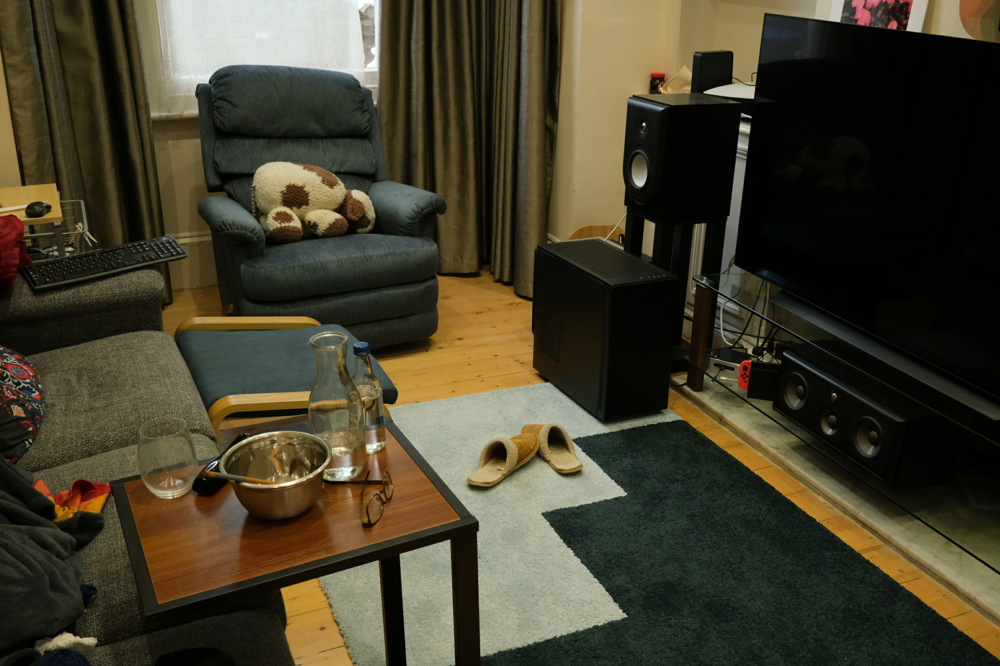 | 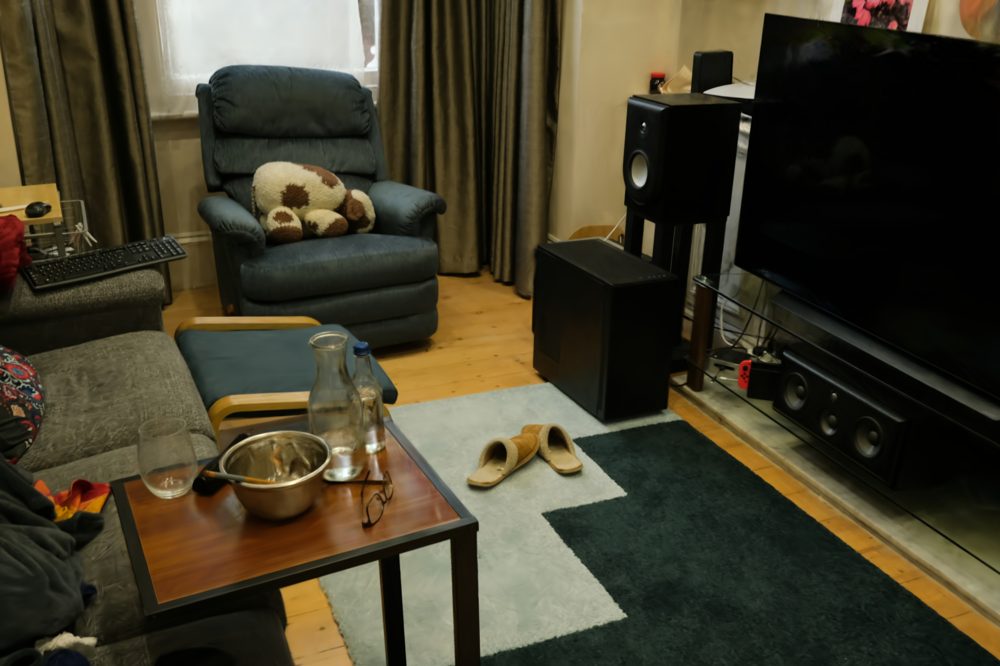 |  | 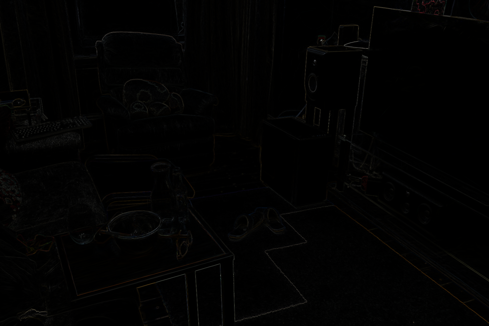 |

벽, 바닥, 가구 표면과 같은 넓은 smooth 영역에서는 차이가 거의 보이지 않는다. 오차는 TV·스피커·탁자·의자 등 foreground/background가 바뀌는 실루엣에 집중된다.

### 4.4 Stump

| GT | Full rays | 1/4-rays + bilinear | $\lvert\widehat{\mathbf C}-\mathbf C_{\mathrm{full}}\rvert\times5$ |
|---|---|---|---|
| 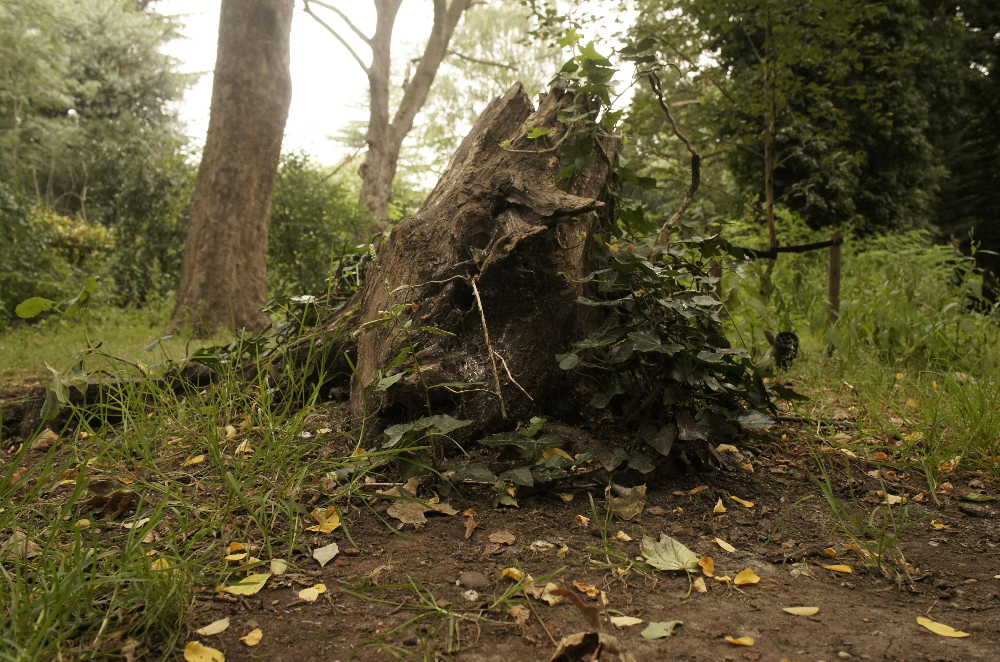 | 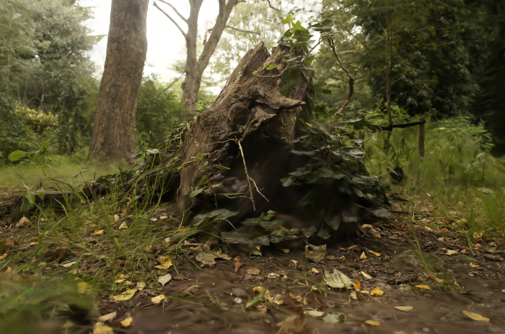 |  | 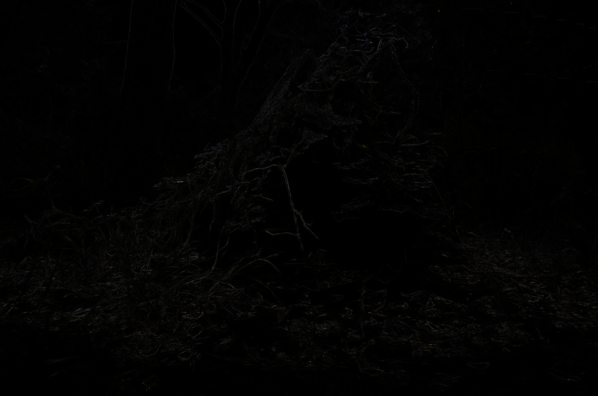 |

식생과 나뭇가지가 많은 고주파 실외 장면에서도 전역적인 차이는 작다. 미세 잎·가지와 stump 경계에서 오차가 남지만, 약한 smoothing이 모델의 artifact를 완화하여 GT PSNR과 SSIM은 오히려 소폭 상승했다.

---

## 5. 추후 연구 방향

### 5.1 학습구조 설계
현재 구조는 forward만을 설계해 inference 가속인데 이 forward를 통해 backward, densification 를 설계해서 완전한 학습파이프라인 구축이다. 

### 5.2 복원 방식의 수학적 보완과 적용 해상도

현재 구조는 전체 primary ray의 약 1/4만 평가한 뒤 RGB 결과를 bilinear interpolation하는 방식이다. 속도와 품질의 가능성을 확인하는 baseline으로는 의미가 있지만, ray–Gaussian response나 visibility를 직접 사용하지 않으므로 수학적·구조적 기여는 아직 단순하다. 

이후에는 1/4-rays pass에서 얻을 수 있는 depth, opacity, transmittance, hit count와 Gaussian response의 공간 변화량을 이용해 missing pixel을 복원하는 방식으로 보완할 필요가 있다. 특히 모든 pixel에 복잡한 계산을 적용하기보다, bilinear 오차가 집중되는 depth 및 visibility boundary에서만 Gaussian-aware 보정이나 추가 ray 평가를 수행하는 것을 생각할 수 있다. 

하지만 이렇게 했을 때 품질적으로 이미 상한이 있는 선에서 굳이 품질면으로 올릴 필요가 있는지가 애매한 부분이라고 생각된다. 

현재의 좋은 결과가 모든 출력 해상도에서 동일하게 나타나는 것도 아니다. R1 출력에서는 1/4-rays+bilinear가 평균 2.36배의 가속과 -0.026 dB의 장면 평균 PSNR 변화를 보였지만, Bonsai의 R2 출력에 같은 비율을 적용하여 R2의 1/4 수준의 ray만 평가했을 때는 가속이 1.22배에 그쳤고 GT PSNR도 0.971 dB 감소했다. 

이는 절대 ray 간격이 지나치게 커지면서 복원 난도가 높아지고, 낮은 출력 해상도에서는 Gaussian 전처리와 후보 구성 같은 고정 비용의 비중이 커지기 때문이다. 따라서 현재 방법은 우선 **고해상도 R1 inference를 1/4-rays로 가속하는 구조**로 범위를 명확히 하고, R2 이하에서는 sampling 비율을 완화하거나 boundary-adaptive ray 추가와 더 정교한 복원식을 사용해야 한다.

### 5.3 GEER 및 EVER로의 확장 검증

현재 실험은 GUT renderer에서만 수행했으므로, 확인된 속도–품질 특성이 GUT에 한정된 결과인지 ray 기반 Gaussian renderer 전반에 적용되는지는 아직 알 수 없다. 다음 단계에서는 GEER와 EVER에서도 각 방식으로 학습한 모델의 full-rays 결과를 기준으로 동일한 1/4-rays sampling과 원해상도 복원을 적용하고, full-rays 재현도, GT 품질 변화, renderer 및 forward 시간을 같은 조건으로 측정할 필요가 있다.

GEER와 EVER는 GUT와 ray–Gaussian response 및 compositing 방식, renderer의 고정 비용 비중이 다르므로 같은 ray 감소율이 같은 가속으로 이어진다고 가정할 수 없다. 세 renderer에서 공통적으로 품질을 유지한다면 본 방향을 특정 GUT 최적화가 아니라 **ray-evaluated GS 전반의 spatial ray redundancy를 이용하는 방법**으로 확장할 수 있다. 반대로 GEER나 EVER에서 품질 또는 속도 이득이 작다면, Gaussian response의 공간적 smoothness와 파이프라인별 병목을 비교해 GUT에서만 성능이 잘 나오는 원인을 분석해야 한다.

---
