# 3DGUT 기반 확률적 MC Sparse-Ray Denoiser 실험 보고서

> 작성일: 2026-08-04  
> 현재 단계: **1/64 sparse-ray Denoiser의 품질 상한 및 gradient 유용성 검증 (Gaussian 모델 고정)**  
> 핵심 결과: 8×8 stratum당 1개(1/64)의 확률적 primary ray만 추적하고 Denoiser로 원해상도 영상을 만들면, 전체 37개 test view 기준 **28.956 dB**로 full-ray GUT(32.066 dB) 대비 **-3.11 dB**다. 학습 step·모델 크기·블록당 샘플 수·출력 구조 등 다섯 축을 모두 변경해도 이 격차가 **3.1~4.0 dB 대역을 벗어나지 못했다.**

## 1. 배경

### 1.1 이전 실험과의 차이

[260803] 보고서는 결정론적 1/4-ray 격자로 **추론 가속**을 검증했다. 본 실험은 목표가 다르다.

| | 260803 예비실험 | 본 실험 |
|---|---|---|
| 목적 | inference 가속 | **학습(training) 비용 절감** |
| 샘플링 | 결정론적 1/2 해상도 격자 | **매 iteration 재추출되는 확률적 층화 MC** |
| ray 비율 | 1/4 | **1/64** |
| 최종 평가 | Denoiser 출력 영상 | Denoiser를 **버리고** full-ray 렌더링 |

즉 본 실험의 Denoiser는 **결과물이 아니라 학습 중 dense supervision을 공급하는 도구**다. 1/64 sparse ray만으로는 전체 픽셀의 1.6%에서만 손실을 계산할 수 있어 SSIM 같은 구조적 손실을 쓸 수 없는데, Denoiser가 원해상도 영상을 만들어 이를 가능하게 한다.

### 1.2 연구 질문

> **8×8 stratum당 1개의 확률적 primary ray에서 원해상도 영상을 복원할 수 있는가? 그리고 그 복원 품질이 Gaussian 학습에 실제로 기여하는가?**

두 번째 질문이 핵심이다. 복원 PSNR이 높다고 학습에 유용하다는 보장이 없으며, 본 실험의 주요 결과 상당수가 이 둘의 괴리에서 나왔다.

### 1.3 연구 범위

- Gaussian 모델은 **고정(frozen)** 이며 Denoiser만 학습한다. 따라서 본 보고서는 학습 가속을 주장하지 않는다.
- 장면은 Bonsai 단일 장면, R1(2078×3118), 3DGUT 30,000 iteration 학습 모델(Gaussian 1,137,814개)이다.
- GPU는 NVIDIA GeForce RTX 4070 SUPER 12 GB이다.

---

## 2. 구현 및 구조

### 2.1 MC 샘플링과 불편추정

원해상도 픽셀 영역을 겹치지 않는 8×8 블록 $B$로 분할하고, 매 iteration마다 각 블록에서 이산 균등하게 픽셀 1개를 독립 추출한다.

$$p_B^{(t)}\sim\mathrm{Uniform}(B)$$

경계 블록은 8×8보다 작을 수 있으므로, 픽셀별 손실 $l(p)$의 전체 평균에 대한 Horvitz–Thompson 추정량은 면적 가중을 갖는다.

$$\widehat L_{\mathrm{pixel}}=\sum_B\frac{|B|}{HW}\,l\!\left(p_B\right),\qquad \mathbb E\!\left[\widehat L_{\mathrm{pixel}}\right]=\frac{1}{HW}\sum_p l(p)$$

이 추정량은 영상 크기가 블록 크기로 나누어떨어지지 않아도 **불편(unbiased)** 이다. 실측에서 1/64 비율의 스칼라 손실 상대오차는 0.082%였다.

### 2.2 원본 픽셀 ID를 보존하는 sparse 렌더러

Sparse ray를 압축(compact) 텐서로 재배열해 기존 tracer에 넘기는 방식은 **수치적으로 무효**임을 먼저 확인했다. 101,400개 ray를 260×390으로 재배열해 호출하면 forward는 3.25 ms로 빨라지지만 RGB 일치도가 8.86 dB에 그친다. Native trace 경로가 dense raster 인덱싱과 camera-grid 가정에 의존하기 때문이다.

따라서 **원해상도 `uint8` active mask** 방식을 채택했다. 커널 launch geometry를 dense와 동일하게 유지하므로 `blockIdx/threadIdx`, 픽셀 ID, camera ray, tile ID가 모두 불변이다. 비활성 thread는 block-wide 동기화에는 참여하되 죽은 ray를 들고 ray–Gaussian response 평가를 건너뛴다.

Active 픽셀 집합에서 RGB, opacity, depth, hit count가 dense 렌더링과 **오차 0으로 일치**했고, backward도 동일한 masked L1 목적함수에서 gradient cosine ≈ 1.0, 상대 L2 오차 4.5e-8로 일치했다. 즉 sparse 경로는 "dense와 같은 ray를 같은 값으로 계산한다"는 정확성 게이트를 통과했다.

### 2.3 Denoiser 전체 구조

#### 설계 원칙

원해상도 2078×3118에서 convolution을 돌리면 채널 하나당 78 MB의 중간 텐서가 생겨 backward 비용이 렌더러 절감분을 넘긴다. 따라서 **모든 학습 convolution을 1/8 해상도 블록 격자에서 수행하고, 원해상도로의 확대는 마지막 PixelShuffle 한 번으로 처리**한다. 이 격자는 sparse 샘플의 자연스러운 배치이기도 하다 — 8×8 stratum마다 샘플이 정확히 1개이므로, 추적된 값을 그대로 260×390 격자에 담으면 빈칸 없는 조밀 텐서가 된다.

#### 입력 구성

Sparse 렌더러는 원해상도 버퍼를 반환하지만 유효한 값은 추적된 101,400개 픽셀($2078\times3118$의 1.565%)뿐이다. 이 픽셀들의 값을 블록 격자로 모아 8채널 텐서를 만든다.

| 채널 | 내용 | 정규화 |
|---:|---|---|
| 0–2 | 추적된 RGB | 원값 |
| 3 | opacity | 원값 |
| 4 | depth | 유효 depth 중앙값으로 나눈 뒤 $\log(1+\cdot)$, [0,1] 클램프 |
| 5 | hit count | $\log(1+\cdot)/\log 129$, [0,1] 클램프 |
| 6–7 | stratum 내 샘플 위치 $(\Delta y,\Delta x)$ | $[-1,1]$ |

마지막 두 채널이 중요하다. 샘플은 블록 중심이 아니라 블록 안 임의 위치에서 뽑히므로, 네트워크가 "이 값이 블록의 어디에서 관측된 것인지"를 모르면 최대 반 블록의 위치 모호성이 남는다. Depth와 hit count 채널은 `detach`하여 이 경로로는 Gaussian에 gradient가 흐르지 않게 했다.

#### 레이어 구성

$$X\;[8\times260\times390]\;\xrightarrow{\text{stem}}\;[32\times260\times390]\;\xrightarrow{\text{residual}\times3}\;[32\times260\times390]\;\xrightarrow{\text{head}}\;[C_{\text{out}}\times260\times390]\;\xrightarrow{\text{PixelShuffle}(8)}\;[3\times2080\times3120]$$

마지막에 원해상도 2078×3118로 잘라낸다.

| 단계 | 구성 | 출력 채널 | 파라미터 |
|---|---|---:|---:|
| Stem | `Conv3×3(8→32)` + SiLU | 32 | 2,336 |
| Residual ×3 | 각 블록 = `Conv3×3(32→32)` + SiLU + `Conv3×3(32→32)`, 출력에 입력을 더함 | 32 | 55,488 |
| Head (회귀) | `Conv3×3(32→192)`, zero-init | 3×8×8 | 55,488 |
| PixelShuffle | 8배 확대 (학습 파라미터 없음) | 3 | — |
| | | **합계** | **113,312** |

Residual block은 normalization layer를 쓰지 않는다. 이 선택이 4.1절에서 다룰 학습 불안정의 원인이 되므로 warmup이 필수가 된다.

수용 영역은 블록 격자에서 17픽셀, 원해상도로 환산하면 약 **136픽셀**이다. 즉 출력 한 픽셀은 자신 주변 17×17 블록에 들어 있는 추적 샘플 최대 289개의 정보를 참조할 수 있다.

#### 출력과 두 가지 head

출력은 원해상도 RGB 영상 $\widehat I\;[3\times2078\times3118]$이며, head가 이를 만드는 방식이 두 가지다.

**(A) 회귀 head.** 블록 특징에서 서브픽셀 64개의 RGB를 직접 예측한다.

$$\widehat I=\mathrm{Base}(X_{\mathrm{rgb}})+\mathrm{PixelShuffle}\!\left(\mathrm{Conv}_{32\to 3\cdot 64}(F)\right)$$

여기서 $\mathrm{Base}$는 블록 격자 RGB를 8배 확대한 초기 영상이며, head는 zero-init이므로 학습이 이 초기 영상에서 시작한다.

**(B) 커널 예측 head.** 회귀 head는 관측하지 못한 디테일에 대해 조건부 평균으로 수렴하므로 구조적으로 흐려진다. 이를 피하려고 색이 아니라 **필터 가중치**를 예측하는 변형을 구현했다. 출력 픽셀 $p$마다 주변 3×3 블록의 **실제 추적 샘플** 9개와 초기 영상값 1개, 총 10개 후보에 대한 가중치를 내놓는다.

$$\widehat I(p)=\sum_{k=1}^{10} w_k(p)\,C_k(p),\qquad \sum_k w_k(p)=1,\quad w_k(p)\ge 0$$

Softmax로 볼록결합을 강제하므로 출력은 항상 **실측 radiance의 볼록결합**이다. 따라서 존재하지 않는 디테일을 생성할 수 없고, 반대로 존재하는 디테일을 평균으로 지우지도 않는다. 이는 프로덕션 Monte-Carlo denoiser가 색을 직접 회귀하지 않고 kernel-predicting 방식을 쓰는 것과 같은 이유다. 검증에서 출력의 99.9999%가 후보 convex hull 내부였다.

Stem과 residual block은 회귀 head와 완전히 동일하고 마지막 conv만 바뀐다. 서브픽셀 64개 × 후보 10개 = 640채널을 내보내야 하므로 head가 `Conv3×3(32→640)`이 되어 파라미터가 늘어난다.

| head | 마지막 conv | 출력 채널 | head 파라미터 | 전체 파라미터 |
|---|---|---:|---:|---:|
| 회귀 | `Conv3×3(32→192)` | 3×8×8 | 55,488 | 113,312 |
| 커널 예측 | `Conv3×3(32→640)` | 10×8×8 | 184,960 | 242,784 |

가중치 계산은 전부 블록 격자에서 이뤄진다. 3×3 이웃 샘플은 `unfold`로 $[3\times9\times101400]$로 모으고, 예측된 logit은 $[64\times10\times101400]$로 reshape해 후보 축에 softmax를 적용한 뒤 einsum으로 결합한다. 원해상도 텐서를 만드는 것은 마지막 PixelShuffle 한 번뿐이므로, 채널 수가 늘어난 것 외에는 회귀 head와 비용 구조가 같다.

학습된 가중치 통계는 이 head가 의도대로 동작함을 보여준다. 초기에 0.992였던 초기영상 후보의 가중치가 학습 후 0.046으로 떨어지고, 단일 실측 샘플에 최대 0.508이 몰린다. 즉 모델이 보간값을 버리고 추적값을 **선택**한다.

두 head 모두 복원 후 추적된 픽셀에는 정확한 traced RGB를 다시 복사한다(sample consistency, 최대 오차 0).

### 2.4 Denoiser loss와 최적화

Denoiser는 sample consistency를 적용한 **뒤의** 원해상도 출력 $\widehat I$와 GT $I_{\mathrm{GT}}$ 사이에서 다음 손실로 학습한다.

$$L_{\mathrm{denoiser}}=0.8\,\bigl\lVert \widehat I-I_{\mathrm{GT}}\bigr\rVert_1+0.2\,\bigl(1-\mathrm{SSIM}(\widehat I,\,I_{\mathrm{GT}})\bigr)$$

세 가지를 명시한다.

**감독 대상은 GT이지 full-ray 렌더가 아니다.** Full-ray 결과를 목표로 삼으면 Denoiser가 Gaussian 모델의 오차까지 학습하게 되고, 최종 학습 파이프라인에서 실제로 쓰일 손실과 형태가 달라진다. 위 가중치 $0.8/0.2$는 vanilla 3DGUT 학습이 쓰는 $L_{\mathrm{GUT}}=0.8L_1+0.2(1-\mathrm{SSIM})$와 동일하게 맞춘 것으로, Denoiser가 "학습이 최적화하려는 바로 그 목적함수"를 대리하도록 하기 위함이다.

**추적된 픽셀에는 gradient가 흐르지 않는다.** Sample consistency가 $\widehat I=\mathrm{where}(\text{mask},\,C_{\mathrm{traced}},\,\text{network output})$이므로, 마스크된 1.6% 픽셀에서 출력은 네트워크와 무관한 상수다. 따라서 Denoiser는 **관측되지 않은 98.4% 픽셀만으로 학습**되며, 추적된 픽셀은 입력이자 고정 정답으로만 기능한다.

**손실은 전체 해상도에서 계산한다.** SSIM은 블록 격자가 아니라 2078×3118 원해상도에서 평가하므로, 8×8 stratum 경계를 넘는 구조적 오차가 손실에 반영된다.

최적화 설정은 다음과 같다.

| 항목 | 값 |
|---|---|
| Optimizer | Adam |
| 학습률 | $1\times10^{-3}$ |
| 학습률 스케줄 | 500 step 선형 warmup 후 cosine 감쇠, 최종 $1\times10^{-5}$ |
| Gradient clipping | max-norm 1.0 |
| Batch | 매 step 학습 view 1개(64개 중 무작위) + 새 MC 마스크 |
| Gaussian 모델 | `requires_grad=False`로 고정, gradient는 Denoiser로만 흐름 |

Warmup은 4.1절 (가)에서 설명하듯 필수다. 이 계열 네트워크에는 normalization layer가 없어 warmup 없이 full 학습률로 진입하면 파라미터가 큰 구성에서 발산한다.

### 2.5 시간축 누적

정적 장면·고정 카메라이므로 같은 view를 $N$번 방문하면 추가 ray 비용 없이 다음 비율의 픽셀이 실측값으로 채워진다.

$$\text{coverage}(N)=1-\left(1-\tfrac{1}{64}\right)^{N}$$

이 누적 이력을 커널 예측 head의 11번째 후보로 추가하되, 미방문 픽셀은 logit을 $-\infty$로 마스킹한다. Gaussian이 고정이므로 누적 이력은 정확한 렌더값과 같고, 따라서 본 실험은 **staleness를 배제한 누적의 상한**을 측정한다.

---

## 3. 평가 프로토콜 정정

정량 결과에 앞서 방법론 결함을 먼저 보고한다. 기존 실험들은 test view의 **앞 2~4개**만으로 지표를 집계했는데, Bonsai에서 이 view들은 장면에서 가장 어려운 축에 속한다.

| View 집합 | Full-ray GUT |
|---|---:|
| 앞 2개 | 25.998 dB |
| 앞 4개 | 29.467 dB |
| **전체 37개** | **32.066 dB** |

View별 PSNR은 24.360~35.605 dB, 표준편차 2.752 dB이다. 

---

## 4. 정량 결과

### 4.1 Denoiser 구성별 성능

전체 37개 test view, MC seed 2개 평균. 비교 기준은 full-ray GUT **32.066 dB**이며, "격차"는 그로부터의 부족분이다.

#### (가) 학습 step과 모델 크기

세 조건 모두 회귀 head이고 최종 체크포인트를 사용했다. 1행↔2행은 **step만**, 2행↔3행은 **파라미터 수만** 다르다.

| 변경 축 | head | 파라미터 | 학습 step | PSNR | SSIM | full-ray 대비 격차 |
|---|---|---:|---:|---:|---:|---:|
| (기준) | 회귀 | 113,312 | 1,000 | 28.358 | 0.8669 | 3.708 dB |
| **step** ↑ | 회귀 | 113,312 | **20,000** | 28.232 | 0.8770 | 3.834 dB |
| **파라미터** ↑ | 회귀 | **558,592** | 20,000 | 28.062 | 0.8758 | 4.004 dB |

step을 20배 늘려 **0.126 dB를 잃었고**, 파라미터를 4.9배 늘려 **0.170 dB를 더 잃었다.** 두 축 모두 역효과다. step이 역효과인 이유는 12,000~13,000 step에서 정점을 찍고 이후 하락하기 때문이며, 20,000 step은 이미 정점을 지난 지점이다.

이 두 축의 측정에는 최적화 설정이 결정적이었다. 이 계열 네트워크에는 normalization layer가 없어, 113,312 파라미터에서 안정적인 학습률을 그대로 쓰면 규모를 키웠을 때 초기 전이 구간에서 발산한다. 558,592 파라미터 모델은 warmup 없이 step 16,000에서 SSIM 0.41까지 붕괴했고, 498,816 파라미터 U-Net은 30,000 step 내내 초기값을 벗어나지 못했다. 500 step warmup을 넣으면 두 경우 모두 단조 수렴한다. Gradient norm 최댓값이 0.17로 clipping 임계값의 1/6이었으므로 원인은 gradient 폭발이 아니라 full 학습률로의 진입이다.

#### (나) head 구조

아래 두 조건은 12-view 분산 집합에서 고른 최고 체크포인트를 사용했다. 선택 방식이 (가)와 다르므로 **(가)의 수치와 직접 비교하면 안 되고**, 두 행끼리만 비교가 유효하다.

| head | 파라미터 | PSNR | SSIM | full-ray 대비 격차 |
|---|---:|---:|---:|---:|
| 회귀 (대조군) | 113,312 | 28.773 | 0.8790 | 3.294 dB |
| **커널 예측** | 242,784 | **28.956** | **0.8807** | **3.111 dB** |

커널 예측이 **0.183 dB** 우세하며, 이것이 본 실험에서 얻은 **최고 성능 Denoiser**다. 다만 (가) 대비 두 행 모두 0.5 dB가량 높은 것은 구조 덕이 아니라 체크포인트 선택을 12-view 분산 집합으로 바꾼 효과다. 3장의 view 편향이 체크포인트 선택 단계에서도 작용한다.

#### (다) 다섯 축 종합

| 변경 축 | 변경량 | PSNR 변화 | 측정 집합 |
|---|---|---:|---|
| 학습 step | 1,000 → 20,000 | **-0.126 dB** | 37 view |
| 모델 크기 | 113k → 559k (4.9배) | **-0.170 dB** | 37 view |
| 블록당 샘플 수 | 1/64 → 4/64 (4배) | **+0.802 dB** | 37 view |
| Base 정합 보정 | 샘플 실제 위치 반영 | **-0.007 dB** | 12 view |
| 출력 확장 구조 | 서브픽셀 64개 → 16개씩 4그룹 | **+0.050 dB** | 12 view |

유의미한 양의 효과는 블록당 샘플 수 하나뿐이며, 그마저 ray를 4배 쓴 대가다(배가당 약 0.40 dB). 나머지 네 축은 ±0.17 dB 이내이고 둘은 음수다. 어떤 축을 건드려도 full-ray와의 격차가 **3.1~4.0 dB 대역을 벗어나지 못한다.**

## 5. 정성 결과

### 5.1 전체 영상 비교

아래 전체 영상은 축소본이므로 8×8 규모의 아티팩트는 보이지 않는다. 전역 구조·색·조명이 유지되는지만 확인하는 용도이며, 실제 판단 근거는 5.3절의 원배율 크롭이다.

| view | Full rays | 1/64 + Denoiser | Full-ray 대비 오차 (5× 확대) |
|---|---|---|---|
| 3 |  | 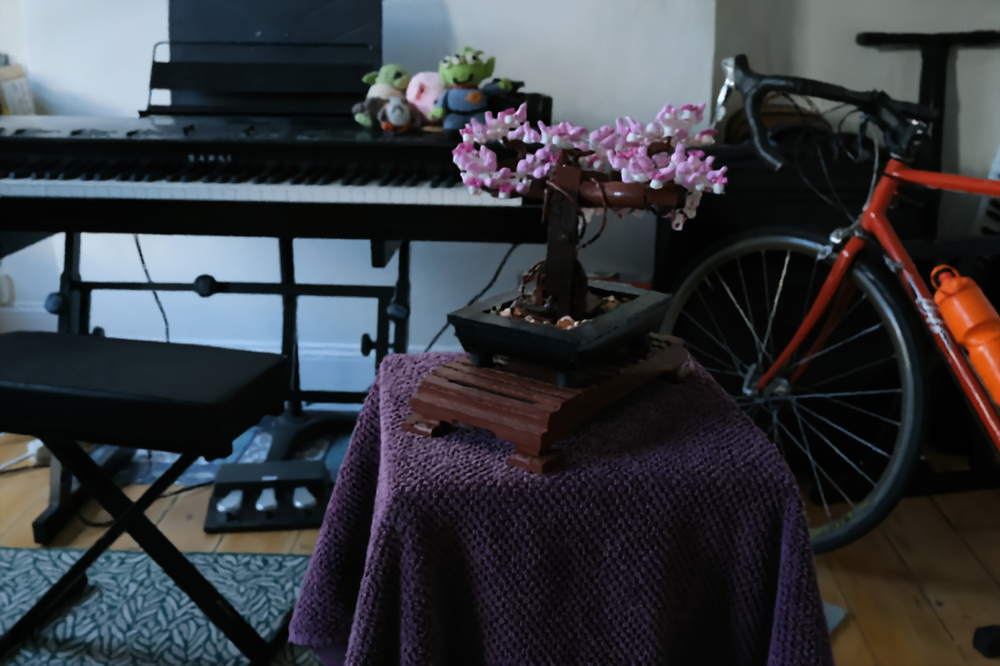 | 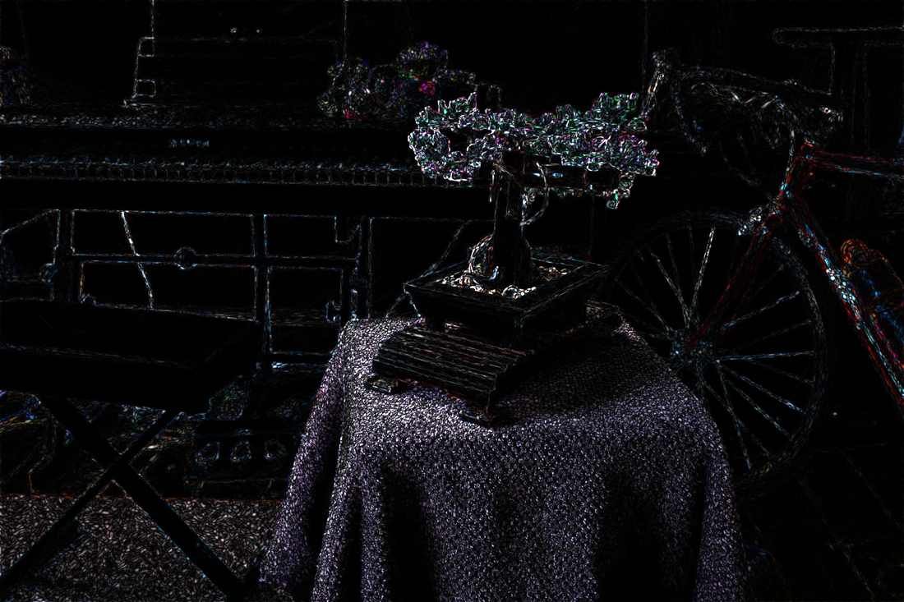 |
| 12 | 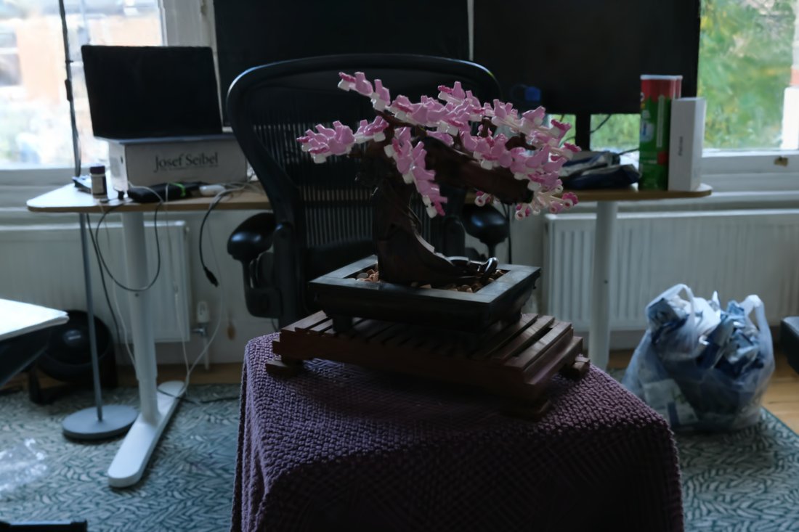 |  | 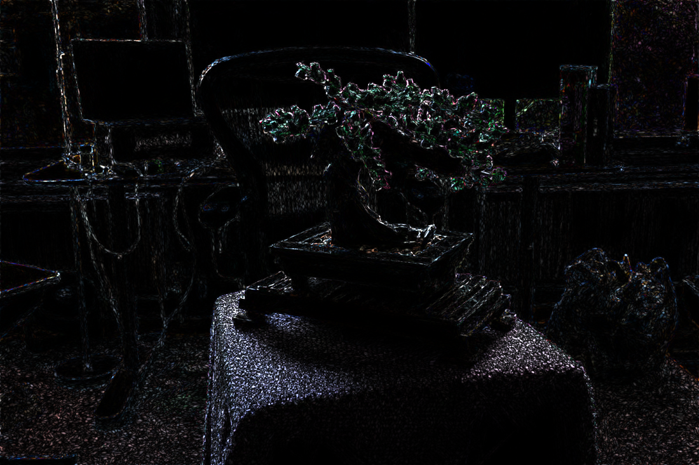 |
| 18 | 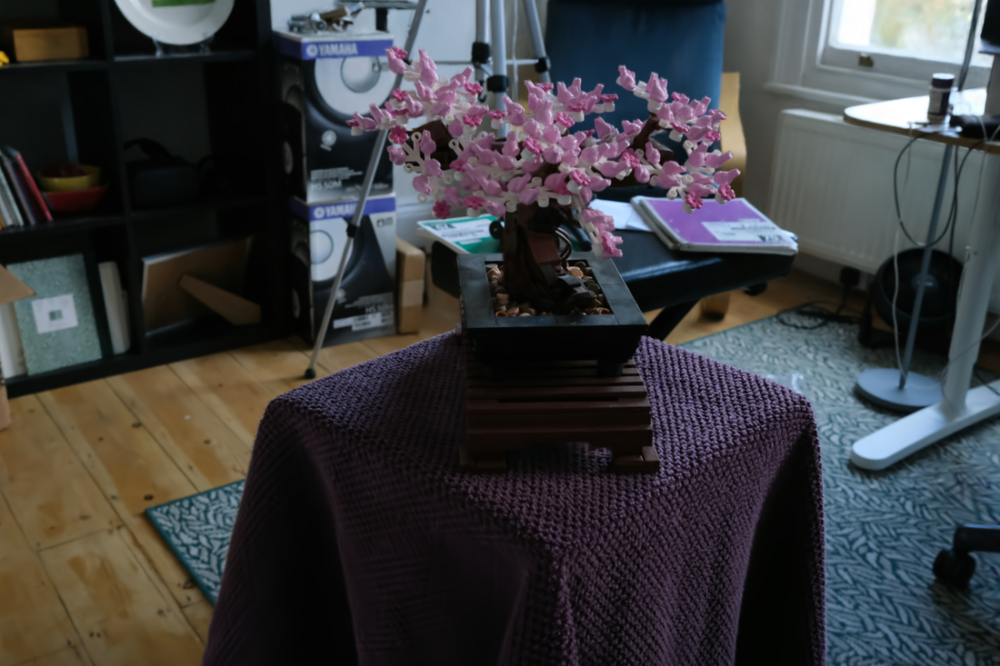 |  | 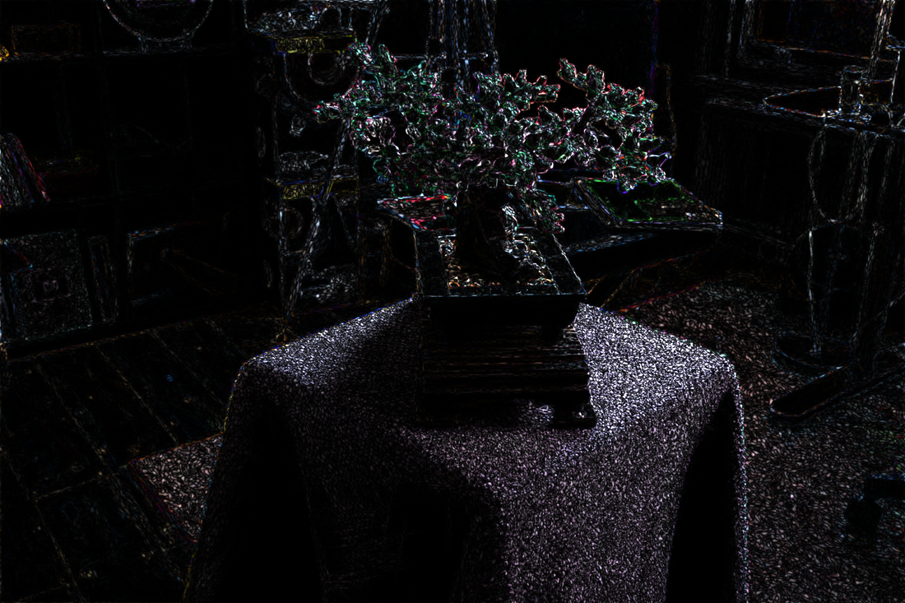 |
| 24 | 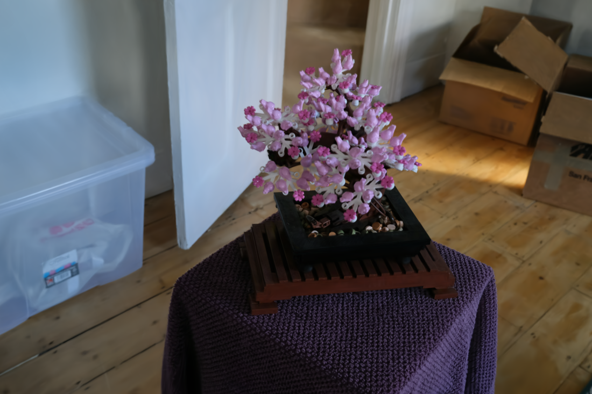 |  | 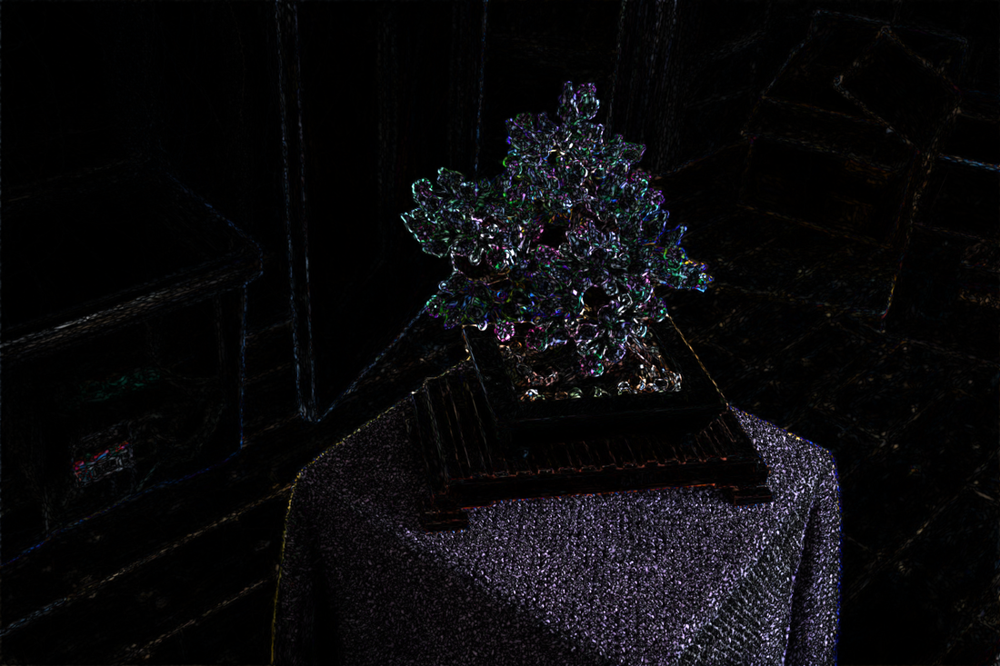 |
| 31 | 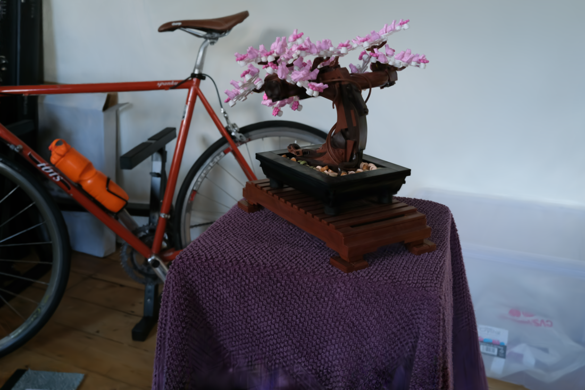 |  | 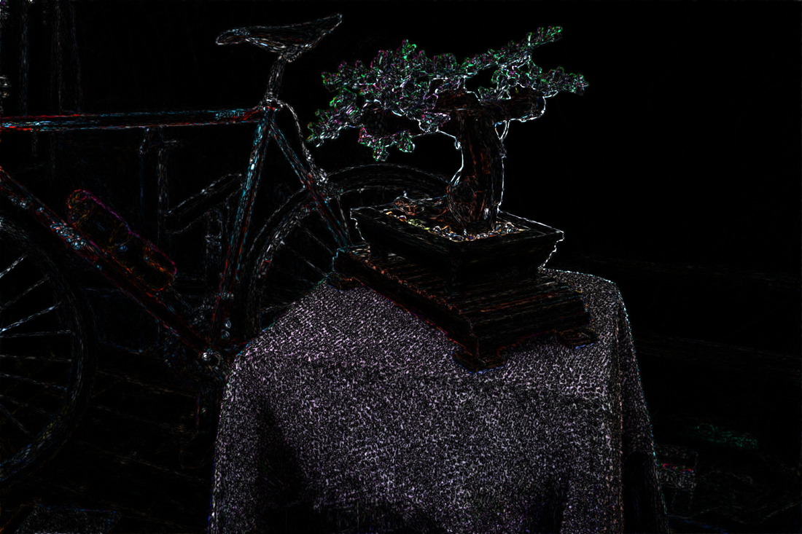 |

축소 배율에서는 두 영상의 차이가 거의 드러나지 않는다. 오차 영상에서 밝게 나타나는 곳이 바구니 표면, 잎과 꽃의 경계, 책장 모서리에 집중되어 있고 벽·바닥·천장 같은 넓은 평탄 영역은 어둡다.

### 5.2 원배율 크롭 (448×448)

#### view 18 — 격차 10.758 dB, 가장 큰 실패

| GT | Full rays | 1/64 + Denoiser |
|---|---|---|
| 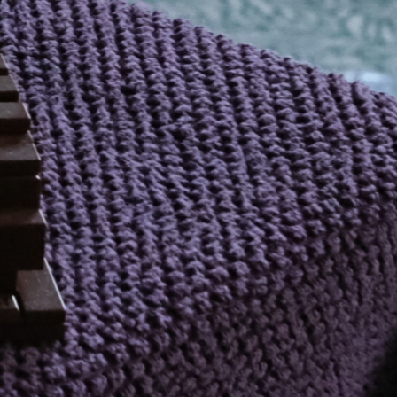 | 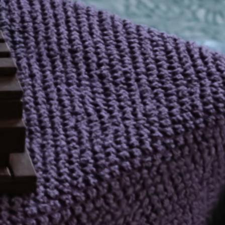 | 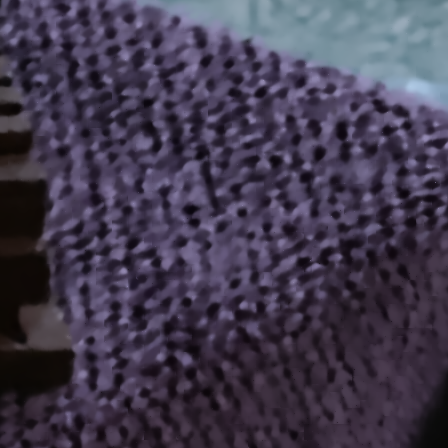 |

Full-ray에서는 구슬이 대각선 열로 규칙적으로 배열된 것이 개별적으로 분해되고 열 사이 음영도 유지된다. Denoiser 출력에서는 이 주기 구조가 완전히 무너져 **개별 구슬보다 큰 불규칙한 덩어리**로 바뀐다. 덩어리의 크기가 대략 8×8 stratum 규모와 일치한다.

이는 aliasing이다. 구슬의 주기가 2~4 픽셀로 샘플링 주기 8 픽셀보다 작으므로, 한 stratum 안에서 어떤 구슬을 맞히느냐에 따라 값이 크게 달라지고 그 무작위 변동이 저주파 덩어리로 재구성된다. 커널 예측 head는 실측 샘플만 조합하도록 강제되므로 없는 값을 지어내지는 않지만, **애초에 관측되지 않은 주기 구조를 복원할 방법이 없다.**

#### view 12 — 격차 7.412 dB

| GT | Full rays | 1/64 + Denoiser |
|---|---|---|
|  | 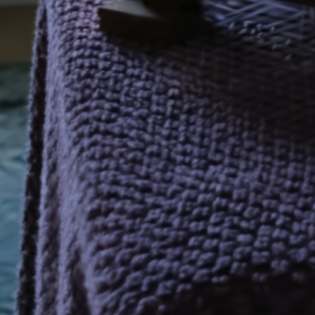 | 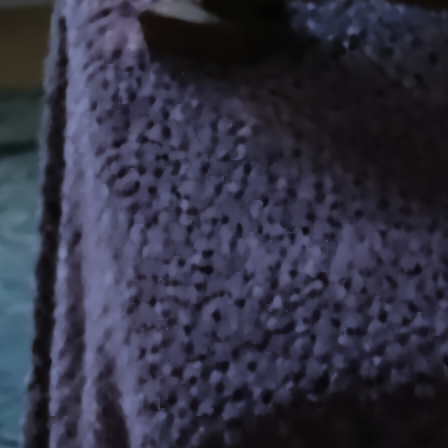 |

같은 바구니를 다른 각도에서 본 영역이다. 왼쪽 어두운 배경과 바구니가 만나는 실루엣은 비교적 잘 유지되는 반면, 바구니 내부의 구슬 짜임은 view 18과 동일하게 덩어리로 뭉친다. **경계(edge)보다 주기적 미세 texture에서 훨씬 크게 무너진다**는 점이 확인된다.

#### view 24 — 격차 5.992 dB

| GT | Full rays | 1/64 + Denoiser |
|---|---|---|
| 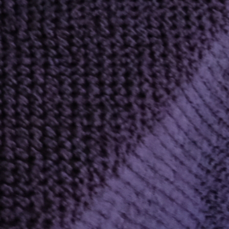 | 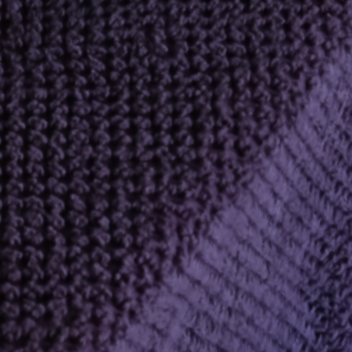 | 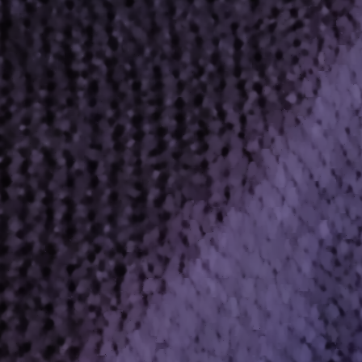 |

바구니 표면이 화면을 가득 채우는 구도다. Full-ray의 촘촘한 구슬 배열이 Denoiser에서는 성긴 반점 패턴으로 바뀌며, 전체 밝기와 색조는 유지되지만 재질감이 사라진다.

#### view 31 — 격차 5.873 dB

| GT | Full rays | 1/64 + Denoiser |
|---|---|---|
| 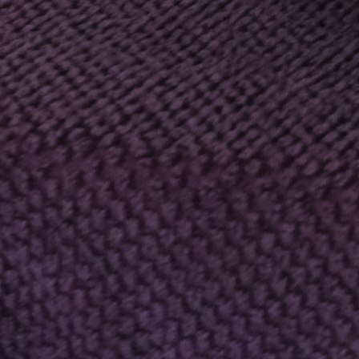 | 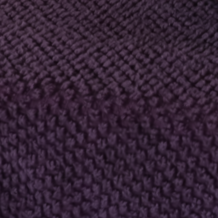 | 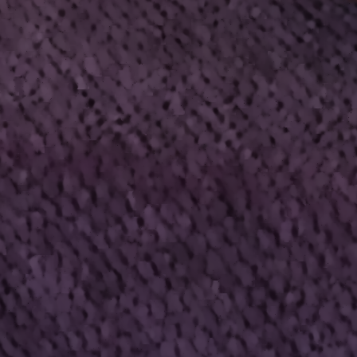 |

#### view 3 — 격차 2.025 dB, 가장 작은 실패

| GT | Full rays | 1/64 + Denoiser |
|---|---|---|
| 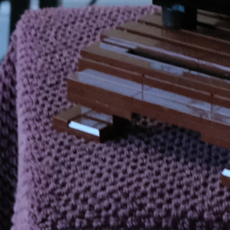 | 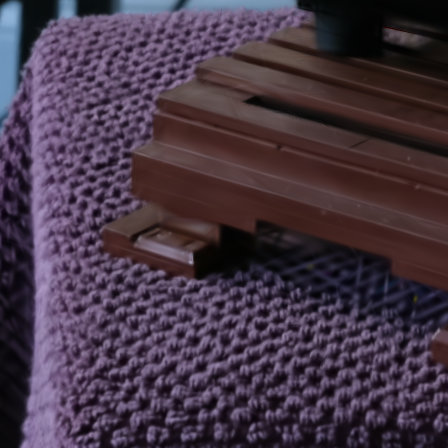 | 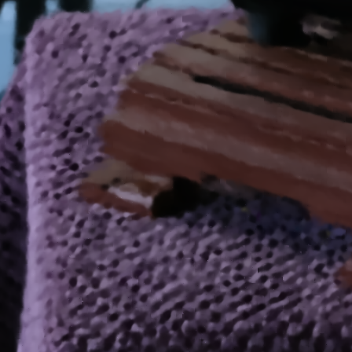 |

이 크롭에서는 full-ray 자체가 GT 대비 23.114 dB로 낮다. 즉 Gaussian 모델이 이미 이 영역을 잘 표현하지 못하고 있어 full-ray 결과도 흐리다. 그 결과 Denoiser와의 격차가 2.025 dB로 다섯 view 중 가장 작다.

이 관찰은 **Denoiser의 상대적 손실이 full-ray 자체의 품질에 의존한다**는 점을 보여준다. Gaussian 모델이 이미 뭉개고 있는 영역에서는 잃을 디테일이 없어 격차가 작고, 모델이 정확히 표현하는 영역에서 격차가 커진다.

### 5.4 정성 결론

1. 오차는 **주기가 샘플링 간격보다 짧은 미세 texture**에 집중된다. 다섯 view의 최악 영역이 모두 같은 소재였다.
2. 실루엣·경계는 상대적으로 잘 유지된다. 커널 예측 head가 경계 너머 샘플을 섞지 않도록 가중치를 학습하기 때문으로 보인다.
3. 전역 구조·색·조명은 전 view에서 유지된다. 축소 배율에서 두 영상은 사실상 구분되지 않는다.
4. Full-ray가 이미 흐린 영역에서는 격차가 작다. 즉 이 방법의 손실은 **Gaussian 모델이 실제로 표현하고 있는 고주파에 비례**한다.

