# 3DGRT 기반 Sparse-Ray 제어 변량(control variate) Denoiser 실험 보고서

> 작성일: 2026-08-05  
> 현재 단계: **구조의 3DGRT 이식 + 제어 변량(control variate) 도입, 추론(inference) 가속 검증 (Gaussian 모델 고정)**  
> 핵심 결과: 3DGRT에서 1/64 sparse ray + 제어 변량(control variate) + KPCN(kernel-predicting convolutional network) Denoiser로 전체 37개 test view 기준 **31.270 dB / 13.32 ms**를 얻었다. Full-ray 3DGRT(31.895 dB / 44.37 ms) 대비 **-0.625 dB에 3.33배**다. 
> 동시에 본 보고서는 **제어 변량(control variate) 구조 자체에 대한 반증도 함께 보고한다.** 제어 변량(control variate)이 충분히 정확하면 sparse ray와 Denoiser의 기여가 **+0.012 dB로 소멸**한다.

## 1. 배경

### 1.1 이전 실험과의 차이

| | 260803 예비실험 | 260804 실험 | **본 실험** |
|---|---|---|---|
| 렌더러 | 3DGUT (rasterizer) | 3DGUT (rasterizer) | **3DGRT (ray tracer)** |
| 목적 | inference 가속 | training 비용 절감 | **inference 가속** |
| ray 비율 | 1/4 | 1/64 | **1/64** |
| sparse 구현 | 저해상도 격자 | 원해상도 active mask | **compact ray tensor** |
| Denoiser 입력 | sparse RGB만 | sparse RGB + G-buffer | **sparse RGB + 제어 변량(control variate)** |
| 구조 | 단일 경로 | 단일 경로 | **2경로 (제어 변량(control variate) + 잔차)** |

두 가지가 근본적으로 바뀌었다.

**첫째, 렌더러를 바꿨다.** 260804까지의 실험은 rasterizer 위에서 진행됐고, 거기서 ray 축소는 속도로 환산되지 않았다. 3DGUT는 ray를 평가하기 전에 **모든 Gaussian을 투영**하므로 ray를 1/64로 줄여도 O(N) 작업이 그대로 남는다. 실측에서 full render 20.35 ms 대 1/64 sparse render 16.58 ms로, 64배 축소가 1.23배 가속에 그쳤다. 이는 구현의 문제가 아니라 rasterization의 정의에서 오는 한계다.

3DGRT는 BVH 순회 기반이며 가속 구조가 카메라가 아니라 장면의 속성이다. 정지 장면에서 BVH는 한 번 짓고 모든 view에 재사용할 수 있으므로, ray 수와 비용이 연동될 여지가 있다. 본 실험은 그 여지가 실제로 얼마인지를 측정하는 것에서 출발한다.

**둘째, 제어 변량(control variate) 구조를 도입했다.** 1/64 sparse ray만으로 원해상도 영상을 복원하는 단일 경로 구조는 260804에서 **-3.11 dB**의 격차를 보였고, 다섯 축(학습 step, 모델 크기, 블록당 샘플 수, 입력 정보, 출력 구조)을 모두 바꿔도 3.1~4.0 dB 대역을 벗어나지 못했다. 이 벽을 넘기 위해 1.4절에서 설명하는 2경로 구조를 도입했다.

### 1.2 연구 질문

> **(Q1)** 3DGRT에서 primary ray를 1/64로 줄이면 실제로 몇 배 빨라지며, 그 상한을 결정하는 것은 무엇인가?  
> **(Q2)** 제어 변량(control variate)을 결합하면 어느 정도의 품질-속도 지점에 도달하는가?  

### 1.3 연구 범위 — 추론 한정

본 보고서의 모든 결과는 **추론(inference) 시점의 것이다.** 구체적으로:

- Gaussian 모델은 **고정(frozen)** 이며 Denoiser만 학습한다. 학습 가속을 주장하지 않는다.
- 모든 속도 수치는 **단일 프레임 forward 렌더링**이며 backward를 포함하지 않는다.
- 3.1절에서 도입하는 Gaussian 파라미터 캐싱은 **정지 장면 추론에서만 유효**하다. 학습 중에는 매 step Gaussian이 갱신되므로 이 최적화를 쓸 수 없다.
- 평가는 정지 test view 37개에 대한 독립 렌더링이며, 프레임 간 시간적 재사용을 쓰지 않는다.

장면은 Bonsai 단일 장면이다. 3DGRT 논문의 MipNeRF360 실내 프로토콜을 따라 downsample factor 2(1559×1039, 1,619,801 px)에서 3DGRT로 30,000 iteration 학습했고, Gaussian은 **1,484,957개**, full-ray PSNR은 **31.895 dB**로 리포지토리 보고치(31.95 dB)와 일치한다. GPU는 NVIDIA GeForce RTX 4070 SUPER 12 GB이다.

원해상도(3118×2078) 모델은 본 보고서 작성 시점에 학습 중이며 결과에 포함되지 않았다.

고해상도로 갈 수록 속도와 품질이 더 좋아질 것으로 예상되므로 현재의 리포트보다 더 나은 성능을 기대할 수 있다. 

### 1.4 제어 변량(control variate) 구조의 도입

#### 왜 필요했는가

1/64 sparse ray는 전체 픽셀의 1.6%만 관측한다. 나머지 98.4%를 복원하는 문제를 Denoiser에게 그대로 맡기면, 네트워크는 **관측하지 못한 고주파에 대해 조건부 평균으로 수렴**할 수밖에 없다. [260804]의 정성 분석에서 오차가 샘플링 주기(8픽셀)보다 짧은 주기의 미세 texture에 집중된 것이 이 현상이다. 커널 예측 head로 "없는 디테일을 지어내지 않도록" 강제해도, 애초에 관측되지 않은 구조는 복원할 방법이 없다.

따라서 필요한 것은 더 좋은 네트워크가 아니라 **네트워크가 복원해야 할 대상을 줄이는 것**이다.

#### 실패의 양상

3DGRT로 옮긴 뒤에도 이 현상은 그대로 재현된다. 아래는 제어 변량(control variate) 없이 1/64 sparse ray만 커널 예측 Denoiser에 넣은 결과(4.1절의 `plain 1/64` 구성)와 full-ray 렌더를 같은 view에서 비교한 것이다. Test view 13이며, full-ray는 GT 대비 31.090 dB인 반면 sparse 단독 구성은 24.216 dB에 그친다.

| Full-ray (44.37 ms) | 1/64 sparse 단독 (6.46 ms) |
|---|---|
| 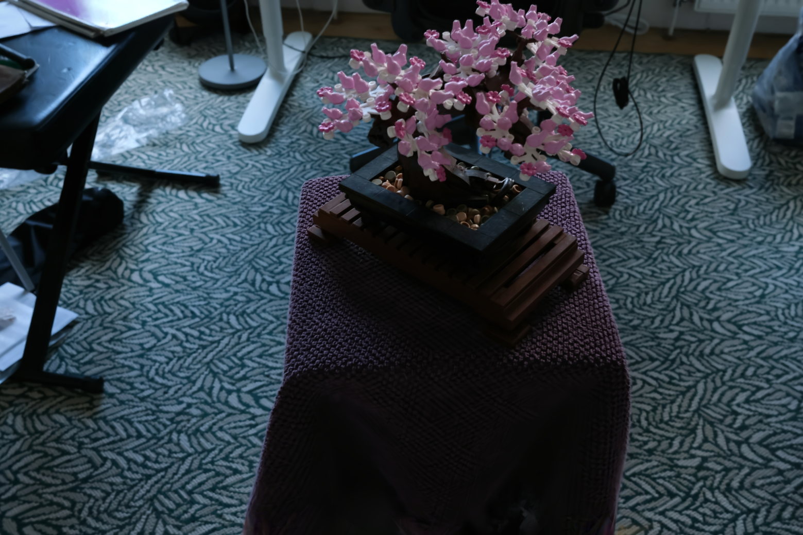 |  |

축소 배율에서는 전역 구조·색·조명이 모두 유지되어 두 영상이 거의 구분되지 않는다. 실패는 원배율에서만 드러난다. 아래 두 크롭은 full-ray 대비 오차가 가장 큰 448×448 영역을 자동으로 선택한 것이다(육안 선택을 배제하기 위해 integral image로 전 영역을 탐색하고, 두 번째 크롭은 첫 번째와 겹치지 않도록 강제했다).

**크롭 1 — (192, 352), 해당 영역 22.740 dB**

| Full-ray | 1/64 sparse 단독 |
|---|---|
| 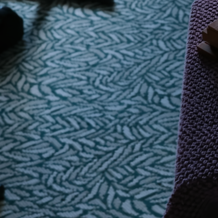 | 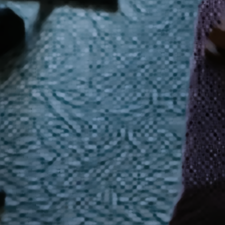 |

러그의 herringbone weave가 full-ray에서는 개별 가닥까지 분해되지만, sparse 단독 출력에서는 **방향성을 잃은 블록 단위 얼룩**으로 바뀐다. 얼룩의 크기가 8×8 stratum 규모와 일치한다. 커널 예측 head는 실측 샘플만 조합하도록 강제되므로 없는 값을 지어내지는 않지만, weave의 주기가 2~4픽셀로 샘플링 주기 8픽셀보다 짧아 **애초에 관측되지 않은 구조**다.

**크롭 2 — (1104, 384), 해당 영역 23.626 dB**

| Full-ray | 1/64 sparse 단독 |
|---|---|
| 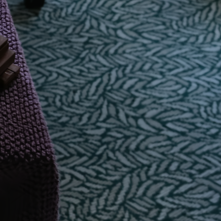 | 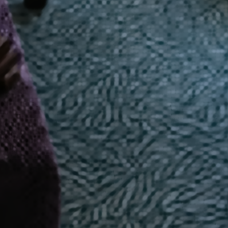 |

같은 러그를 카메라에 더 가까운 쪽에서 본 영역이다. 여기서는 한 크롭 안에서 성공과 실패가 갈린다. 원근 때문에 화면상 weave 주기가 아래쪽에서 더 크고 위쪽에서 더 작은데, **주기가 큰 아래쪽 절반은 방향과 굵기가 상당히 복원되는 반면 위쪽으로 갈수록 같은 소재가 무너진다.** 소재도 네트워크도 동일하고 화면상 주기만 다르므로, 이 경계가 곧 샘플링 주기의 Nyquist 한계다.

정리하면 이 구조가 잃는 것은 **저주파가 아니라 샘플링 간격보다 짧은 주기의 고주파**이며, 잃은 결과가 저주파 얼룩으로 나타나 전체적으로 흐린 인상을 준다. 그리고 이것은 네트워크 용량이나 학습량의 문제가 아니라 **관측 자체가 없는 정보**이므로, 같은 경로에 남아 있는 한 개선되지 않는다. 260804에서 다섯 축을 모두 바꿔도 격차가 3.1~4.0 dB를 벗어나지 못한 이유다.

#### 제어 변량(control variate)

몬테카를로의 고전적 분산 감소 기법인 **제어 변량(control variate)** 구조를 쓴다.

표준 형태는 다음과 같다. $\mu=\mathbb E[f]$를 추정할 때, $f$와 상관이 높고 기댓값을 아는 $g$가 있으면

$$\hat\mu = \mathbb E[g] + \frac{1}{N}\sum_i\bigl(f_i-g_i\bigr)$$

로 쓴다. 두 번째 항의 분산이 $\mathrm{Var}[f]$보다 작으므로 같은 샘플 수로 더 정확해진다. $g$를 잘 고를수록 이득이 크다.

본 구조는 이를 **이미지 공간**에 옮긴 것이다. 추정 대상은 full-ray 영상 $I$이고, 제어 변량(control variate) $B$는 **모든 픽셀에서 값을 아는 저비용 렌더**다(기댓값을 아는 대신 조밀하게 알고 있다). 1/64 위치 $p_i$에서만 정확한 $I(p_i)$를 관측하고, 잔차(residual)를 재구성한다.

$$\boxed{\;\hat I(p) \;=\; \underbrace{B(p)}_{\text{dense, low cost}} \;+\; \underbrace{\mathcal R\bigl[\{\,I(p_i)-B(p_i)\,\}_i\bigr](p)}_{\text{reconstructed from sparse observations}}\;}$$

$\mathcal R$이 커널 예측 Denoiser다.

#### 이 관점이 예측하는 것

제어 변량(control variate)의 효율은 **잔차 $I-B$가 얼마나 다루기 쉬운가**로 결정된다. 이미지 공간에서 "다루기 쉽다"는 것은 분산이 작다는 뜻이 아니라 **공간적으로 매끄럽다**는 뜻이다. sparse sample에서 dense field로 복원해야 하므로, 잔차의 공간 주파수가 샘플링 주기(8픽셀)의 Nyquist 한계 아래에 있어야 한다.

이 기준이 $B$의 선택을 결정한다.

| $B$를 싸게 만드는 방법 | 잔차 $I-B$의 성질 | 예측 |
|---|---|---|
| 해상도 축소 | 사라진 공간 고주파 = **sparse sample로 복원 불가** | 나쁨 |
| Gaussian 축소 (LOD) | 장면 구조 자체가 달라짐 = **잔차가 크고 불규칙** | 매우 나쁨 |
| **hit threshold 상향** | 약한 투과 기여의 손실 = **저진폭·공간적으로 완만** | **좋음** |

5.2절에서 이 예측이 실측과 일치함을 보인다. 즉 본 실험의 핵심 설계 결정(2.4절의 hit threshold 방식)은 경험적 탐색의 결과가 아니라 제어 변량(control variate) 관점에서 도출된 것이다.

---

## 2. 구현 및 구조

### 2.1 Compact ray tensor

260804에서 sparse ray를 compact tensor로 재배열해 rasterizer에 넘기는 방식은 **수치적으로 무효**였다. 101,400개 ray를 260×390으로 재배열하면 RGB 일치도가 8.86 dB에 그쳤다. Rasterizer 커널이 launch geometry에서 픽셀과 tile을 유도하기 때문이다. 그래서 원해상도 active mask 방식을 써야 했고, 이는 커널 launch 크기가 dense와 동일해 속도 이득의 상당 부분을 잃는 원인이었다.

3DGRT에는 이 제약이 없다. Ray tracer는 ray를 독립적인 기하 질의로 다루므로 픽셀 격자 가정이 없다. 임의의 ray 집합을 $[1, H', W', 3]$ 형태로 묶어 넘기면 되고, 실측에서 compact 경로와 dense 경로의 **최대 절대 오차가 0**이었다. 이로써 launch 크기 자체를 ray 수만큼 줄일 수 있다.

샘플링은 260804와 동일한 stratified MC를 쓴다. 원해상도를 겹치지 않는 8×8 블록으로 나누고 블록마다 픽셀 1개를 뽑는다. Jitter는 학습 손실을 dense 손실의 unbiased estimate로 만들기 위한 장치이므로 추정할 대상이 없는 추론에서는 분산만 더한다. 

### 2.2 2경로 구성

1.4절의 식을 구현 형태로 옮기면 다음과 같다.

$$\underbrace{\text{low-cost dense render}}_{\text{405,600 rays}}\;\longrightarrow\;B\qquad\qquad \underbrace{\text{1/64 stratified}}_{\text{25,350 rays}}\;\longrightarrow\;S$$

$$R(p_i)=S(p_i)-B(p_i)\quad\text{(defined only at traced pixels)}\qquad \hat I=B+\mathrm{KPCN}(R,\,d,\,\Delta)$$

$B$는 절반 해상도로 렌더한 뒤 bilinear로 확대한 것이고, $S$는 원해상도 위치에서 정확히 추적한 1/64 샘플이다. Denoiser는 **잔차만 복원**하고 결과에 $B$를 다시 더한다.

$B$의 ray는 정수배가 아닌 축소율에서도 균일 격자를 유지해야 하므로, 기존 픽셀 ray를 최근접으로 고르는 대신 ray 방향장을 `grid_sample`로 보간하고 재정규화한다. 최근접 선택은 격자를 불균일하게 만들어 $B$의 품질을 **0.27 dB** 떨어뜨렸다(30.200 → 30.466).

$B$를 어디에 쓸지는 두 갈래이며 분리해서 측정했다.

| 모드 | 입력 채널로 | 출력에 가산 | 성격 |
|---|---|---|---|
| `both` | ✓ | ✓ | 제어 변량(control variate) + G-buffer 가이드 |
| `output` | ✗ | ✓ | 순수 제어 변량(control variate) |
| `input` | ✓ | ✗ | G-buffer 가이드로만, 출력은 traced 샘플의 convex combination |
| `none` | ✗ | ✗ | 제어 변량(control variate) 없음 (260804 구조) |

### 2.3 KPCN — Kernel-Predicting Convolutional Network

#### 명칭과 출처

**KPCN**은 **K**ernel-**P**redicting **C**onvolutional **N**etwork의 약자다. Bako 등이 SIGGRAPH 2017에 발표한 *Kernel-Predicting Convolutional Networks for Denoising Monte Carlo Renderings*에서 제안했고(Disney Research Zürich·Pixar·UCSB), 이후 프로덕션 경로추적 denoiser의 사실상 표준 구조가 되었다.

#### 핵심 아이디어 — 색이 아니라 필터를 예측한다

일반적인 회귀형 denoiser는 노이즈 영상을 입력받아 **깨끗한 색을 직접 출력**한다. 이 방식은 L1/L2 손실 아래에서 구조적 결함을 갖는다. 네트워크가 관측하지 못한 성분에 대해서는 **조건부 평균**으로 수렴하는 것이 손실을 최소화하는 유일한 답이므로, 결과가 필연적으로 흐려진다. 1.4절 "실패의 양상"에서 본 얼룩이 이 현상의 시각적 형태다.

KPCN은 출력의 정의 자체를 바꾼다. 네트워크는 색을 내지 않고, 출력 픽셀 $p$마다 **주변 후보 값들에 대한 필터 가중치** $w_k(p)$를 낸다. 최종 값은 그 가중치로 실제 관측값 $C_k(p)$를 결합한 것이다.

$$\hat I(p)=\sum_{k=1}^{K} w_k(p)\,C_k(p),\qquad \sum_{k} w_k(p)=1,\quad w_k(p)\ge 0$$

가중치는 softmax로 생성되므로 합이 1이고 음수가 될 수 없다. 따라서 출력은 항상 **실측 radiance의 convex combination**, 즉 후보값들의 convex hull 내부에 있다. 여기서 두 가지 성질이 따라온다.

- **없는 값을 지어낼 수 없다.** 출력이 관측값의 가중평균이므로 hallucination이 구조적으로 불가능하다.
- **있는 값을 평균으로 지울 수 없다.** 특정 후보에 가중치를 몰아주면 그 값이 그대로 나오므로, edge 양쪽을 섞지 않는 선택이 가능하다. 회귀형은 이 선택지가 없어 반드시 섞인다.

즉 KPCN은 "무엇을 출력할까"를 학습하는 대신 **"이미 추적한 것들 중 무엇을 믿을까"** 를 학습한다. 

#### 본 실험에서의 변형

원 논문은 후보를 **같은 픽셀 주변의 노이즈 픽셀들**(보통 21×21 창)로 잡는다. 노이즈가 픽셀마다 독립이므로 이웃을 평균하면 분산이 줄어드는 상황이다.

본 실험의 상황은 다르다. 노이즈가 아니라 **관측 자체가 없는 픽셀**이 98.4%이고, 유효한 값은 8×8 블록마다 1개뿐이다. 따라서 후보를 픽셀이 아니라 **블록 단위**로 잡는다.

| | 원 KPCN (Bako 2017) | 본 실험 |
|---|---|---|
| 문제 | 픽셀마다 MC 노이즈 | 픽셀의 1.6%만 관측 |
| 후보 | 주변 노이즈 픽셀 (21×21) | **3×3 블록의 추적 샘플 9개 + bilinear 값 1개** |
| 예측 해상도 | 원해상도 | **coarse grid (130×195)** |
| 확대 | 없음 | **PixelShuffle(8)** |

가중치 예측을 coarse grid에서만 수행하는 것이 비용상 핵심이다. 원해상도에서 convolution을 돌리면 채널 하나당 수십 MB의 중간 텐서가 생겨 렌더러 절감분을 넘어선다. 블록 격자는 sparse 샘플의 자연스러운 배치이기도 하다 — 8×8 stratum마다 샘플이 정확히 1개이므로 추적값을 그대로 담으면 빈칸 없는 조밀 텐서가 된다.

bilinear 값을 10번째 후보로 넣은 이유는 두 가지다. 그 자체가 추적 샘플들의 convex combination이라 convexity가 유지되고, head를 zero-init하고 이 후보의 bias를 크게 주면 **학습이 bilinear 재구성에서 시작**한다.

#### 구조

260804의 커널 예측 head를 3DGRT의 coarse grid 입력에 맞춰 이식했다. Compact ray tensor가 이미 130×195 격자로 도착하므로 별도의 gather가 필요 없다.

입력은 6채널이다(`both`/`input` 모드는 제어 변량(control variate) $B$ 3채널이 추가되어 9채널).

| 채널 | 내용 |
|---:|---|
| 0–2 | 잔차 RGB $R$ (또는 `input`/`none` 모드에서는 추적 RGB) |
| 3 | depth, 중앙값 정규화 |
| 4–5 | 블록 내 샘플 위치 $(\Delta y,\Delta x)$, $[-0.5,0.5]$ |

$$X\;[6\times130\times195]\;\xrightarrow{\text{stem}}\;[32\times\cdot]\;\xrightarrow{\text{residual}\times3}\;[32\times\cdot]\;\xrightarrow{\text{head}}\;[640\times\cdot]\;\xrightarrow{\text{PixelShuffle}(8)}\;[3\times1040\times1560]$$

출력 픽셀마다 3×3 블록 이웃의 추적 샘플 9개와 bilinear 값 1개, 총 10개 후보에 softmax 가중치를 매겨 convex combination한다. 파라미터는 **242,208개**, 추론 비용은 **3.05 ms**다.

수용 영역은 두 층위로 나뉜다. 가중치를 *예측*하는 conv 수용 영역은 격자 17칸 = 원해상도 136픽셀이지만, 실제로 *사용할 수 있는* 샘플은 3×3 블록 = 24픽셀 범위의 9개뿐이다.

### 2.4 hit threshold 상향을 통한 $B$ coarsening

제어 변량(control variate)의 비용은 $B$가 지배한다(4절에서 51~70%). $B$를 싸게 만드는 세 방법과 그 잔차 성질은 1.4절에서 예측한 바와 같다. 

본 실험은 세 번째, **hit threshold 상향**을 채택했다.

3DGRT는 ray가 지나가며 만나는 Gaussian 중 응답이 `particle_kernel_min_response`(기본 0.0113)를 넘는 것을 hit으로 받아 누적한다. 이 값을 올리면 기여가 약한 Gaussian이 탈락해 ray당 hit count가 줄고, 비용이 선형으로 내려간다.

핵심은 이 오차가 **잔차로서 다루기 쉽다**는 점이다. 해상도 축소는 Nyquist 한계 아래의 공간 주파수를 지우므로 1/64 샘플(간격 8픽셀)로 복원할 수 없다. 반면 hit culling은 에지를 건드리지 않고 저진폭·저주파 오차만 만들므로, sparse sample이 자기 위치에서 정확히 측정하고 커널이 주변으로 전파할 수 있다. SSIM 변화가 이를 뒷받침한다 — hit culling은 -0.004, 같은 비용의 해상도 축소는 **-0.023**이다.

**이는 control variate구조의 문제인 overhead를 줄임과 동시에 품질까지 개선해준다고 볼 수 있다.**

### 2.5 Denoiser 학습 설정

Gaussian은 고정하고 Denoiser만 학습한다. 매 iteration마다 train split에서 view 1개를 뽑아 full-ray를 타깃으로 렌더하고, $B$를 렌더하고, jitter 층화 샘플 25,350개를 **실제로 추적**해 네트워크에 넣는다.

$$\mathcal L = \lVert \hat I - I_{\text{full-ray}}\rVert_1 + 0.2\,\bigl(1-\mathrm{SSIM}(\hat I, I_{\text{full-ray}})\bigr)$$

손실은 원해상도 dense다. 260804에서 쓴 "샘플 픽셀에만 L1 + 1/64 격자 SSIM"은 Gaussian을 학습할 때 필요한 형태이며, 본 실험은 Gaussian이 고정이라 full-ray 타깃을 전부 갖고 있다. 타깃을 GT가 아니라 full-ray 렌더로 둔 것은 과제를 "full-ray가 냈을 영상을 sparse로 복원하라"로 정의하기 위함이고, GT 대비 품질은 그 결과로 따라온다.

Adam, lr 2e-3, warmup 300 step 후 cosine decay, gradient clipping 1.0, 8,000 iteration. 학습에는 jitter 샘플링을, 평가에는 중앙 샘플링을 쓴다.

---

## 3. 추론 비용 구조 분석 (Q1)

1/64로 ray를 줄였을 때 왜 64배가 아닌지를 규명한다. 이 절의 결론이 4절 설계의 근거다.

### 3.1 프레임당 Gaussian 버퍼 재생성

`Tracer.render`는 호출마다 전체 Gaussian에 대해 activation을 다시 계산한다.

| 버퍼 | 크기 | 비용 |
|---|---:|---:|
| `get_features()` | 1,484,957 × 48 = **285.1 MB** | 1.775 ms |
| `get_rotation()` | 23.8 MB | 0.159 ms |
| `get_scale()` | 17.8 MB | 0.018 ms |
| `get_density()` | 5.9 MB | 0.009 ms |
| `particle_density` concat (autograd 내부) | 71.3 MB | — |
| **합계** | **~332 MB** | **~3.5 ms** |

**ray를 몇 개 쏘든 매 프레임 332 MB를 새로 만든다.** 정지 장면 추론에서 이 값들은 변하지 않으므로 한 번 계산해 재사용할 수 있다. 캐싱 시 1/64 trace가 **6.67 → 3.16 ms**로 줄었다.

이 최적화는 추론 전용이다. 학습 중에는 Gaussian이 매 step 갱신되므로 쓸 수 없다. 다만 1/64 sparse ray가 실제로 건드리는 Gaussian은 전체의 **7.9~10.6%** 뿐이므로(3.4절), 학습에서는 필요한 부분만 activation하는 별도 최적화가 가능하다. 본 보고서 범위 밖이다.

### 3.2 ray 수에 대한 비선형성

Gaussian 버퍼를 캐싱한 상태에서 ray 수를 훑었다.

| block | rays | ms | 총 hit | **ns/ray** | ns/hit |
|---:|---:|---:|---:|---:|---:|
| 1 | 1,619,801 | 41.014 | 49,316,212 | **25.3** | 0.83 |
| 2 | 405,600 | 13.552 | 12,349,368 | 33.4 | 1.10 |
| 4 | 101,400 | 5.163 | 3,087,010 | 50.9 | 1.67 |
| **8** | **25,350** | **3.175** | 771,337 | **125** | 4.12 |
| 16 | 6,370 | 2.690 | 193,030 | 422 | 13.93 |
| 32 | 1,617 | 2.211 | 49,550 | 1,367 | 44.62 |
| 64 | 425 | 1.657 | 12,918 | 3,899 | 128.26 |
| 128 | 117 | 1.625 | 3,637 | 13,889 | 446.79 |

**고정 오버헤드는 존재하지 않는다.** 곡선에 평탄 구간이 없고 ray당 비용이 25.3 ns로 매끄럽게 수렴한다. 1/64에서 125 ns/ray인 것은 **ray당 비용 자체가 5배 비싸기 때문**이다.

ray당 hit count는 30.4로 ray 수와 무관하게 일정하다. 즉 총 작업량은 정확히 1/64로 줄었는데 처리 효율이 5배 나쁘다.

### 3.3 원인은 ray coherence

두 가설을 분리했다.

| case | rays | ms | ns/ray | Gaussian당 재사용 |
|---|---:|---:|---:|---:|
| 1/64, 1 view | 25,350 | 3.385 | 125 | 4.9 |
| 1/64 × 4 views | 101,400 | 7.174 | 70.8 | 19.5 |
| **연속 crop** | **25,350** | **0.956** | **37.7** | **231.1** |
| full-ray | 1,619,801 | 38.772 | 23.9 | 164.8 |

**ray 수를 그대로 두고 배치만 연속으로 바꾸면 125 → 37.7 ns/ray로 3.3배 빨라진다.** Dense 렌더링은 인접 thread가 인접 픽셀을 쏘므로 같은 BVH 경로를 타고 같은 Gaussian 데이터를 공유한다(재사용 164.8회). 1/64는 인접 thread가 8픽셀씩 떨어져 서로 다른 경로로 발산하고 재사용이 4.9회로 떨어진다.

제어 변량(control variate) $B$ 경로와 sparse 경로를 하나의 launch로 합쳐 occupancy를 올리는 시도는 **0.346 ms**만 절감했다(17.539 → 17.193). Sparse ray의 지연을 숨기는 것은 launch 전체의 ray 수가 아니라 동시에 날아가는 **sparse ray의 수**이기 때문이다.

즉 이 비용은 sparse 샘플링의 정의에서 나오며, 샘플 패턴을 군집화하지 않는 한 제거할 수 없다.

### 3.4 Loss 정리

$$\text{cost} \;=\; \underbrace{N_{\text{ray}}}_{\text{reducible}} \times \underbrace{h}_{\text{see 2.4}} \times \underbrace{c(\text{coherence}, N_{\text{ray}})}_{\text{structural}}$$

- $N_{\text{ray}}$: 1/64까지 줄였고, 여기서 더 줄이면 $c$가 급격히 나빠져 이득이 없다.
- $h$ (ray당 hit count, 기본 30.4): **본 실험에서 처음 건드린 축이며 2.4절과 4.2절의 근거다.**
- $c$: 1/64에서 dense 대비 5배 나쁘고, 이는 sparse 샘플링의 구조적 비용이다.

---

## 4. 정량 결과 (Q2)

전체 37개 test view, Gaussian 버퍼 캐싱 적용. Full-ray 기준은 **31.895 dB / 44.37 ms**다.

### 4.1 제어 변량(control variate) 없는 구성

여기서 plain은 control variate가 없는 inference를 말한다.

| 구성 | ray | trace ms | KPCN ms | 총 ms | speedup | **PSNR** | 격차 |
|---|---:|---:|---:|---:|---:|---:|---:|
| full-ray | 1,619,801 | 44.37 | — | 44.37 | 1.00× | **31.895** | — |
| plain 1/16 | 101,400 | 5.16 | 3.97 | 9.13 | 4.86× | 29.523 | 2.372 |
| **plain 1/64** | 25,350 | 3.41 | 3.05 | **6.46** | **6.87×** | **26.167** | **5.728** |

**제어 변량(control variate) 없이는 260804의 벽이 그대로 재현된다.** 1/64에서 -5.73 dB이며, 렌더러를 rasterizer에서 ray tracer로 바꾼 것만으로는 품질이 개선되지 않는다. 속도만 6.87배로 크게 개선됐다.

1/16으로 완화하면 -2.37 dB에 4.86배지만, 여전히 실용 품질이 아니다. 주목할 점은 KPCN 비용이 1/16에서 **오히려 더 크다**는 것이다(3.97 대 3.05 ms). Head의 FLOP이 서브픽셀 수 $B^2$와 격자 셀 수 $HW/B^2$의 곱이라 블록 크기와 무관하게 고정인 반면, residual block은 셀 수에 비례해 4배가 되기 때문이다.

### 4.2 제어 변량(control variate)을 결합한 구성

$B$는 절반 해상도(405,600 ray), sparse는 1/64(25,350 ray), 모드는 `output`이다. $B$의 hit threshold만 바꿔가며 측정했다.

| $B$ hit threshold | hits/ray | $B$ ms | $B$ 단독 | **+sparse+KPCN** | **기여** | 총 ms | speedup | 격차 |
|---|---:|---:|---:|---:|---:|---:|---:|---:|
| 0.0113 (기본) | 30.4 | 14.36 | 31.346 | 31.358 | **+0.012** | 20.82 | 2.13× | 0.537 |
| **0.06** | 19.9 | 6.85 | 30.660 | **31.270** | **+0.610** | **13.32** | **3.33×** | **0.625** |
| 0.12 | 15.0 | 4.80 | 29.534 | **30.845** | **+1.311** | 11.30 | 3.93× | 1.050 |
| 0.25 | 10.8 | 3.38 | 27.432 | 29.633 | **+2.201** | 9.89 | 4.49× | 2.262 |

제어 변량(control variate)은 1/64 sparse만으로는 도달할 수 없는 영역을 연다. 격차가 5.728 dB에서 **0.625 dB**로 줄었고 속도는 3.33배다.

그리고 **$B$를 거칠게 만들수록 sparse ray와 Denoiser의 기여가 커진다** — +0.012 → +0.610 → +1.311 → **+2.201 dB**. 이 단조 관계가 5절의 논의로 이어진다.

### 4.3 control(대조군) — 그냥 원해상도로 렌더하되 hit threshold만 올리기

hit threshold가 비용을 줄인다면, sparse ray도 Denoiser도 없이 hit threshold만 올려 원해상도로 렌더하는 것이 가장 단순한 대안이다. 이 선을 넘지 못하면 파이프라인 전체가 무의미하다.

| hit threshold | ms | PSNR | SSIM |
|---|---:|---:|---:|
| 0.0113 | 44.37 | 31.895 | 0.9403 |
| 0.06 | 21.36 | 30.900 | 0.9319 |
| 0.12 | 14.70 | 29.485 | 0.9086 |
| 0.25 | 9.99 | 27.085 | 0.8540 |
| 0.4 | 9.92 | 25.230 | 0.7943 |

동일 비용에서 비교하면:

| 비용대 | control(대조군) | **본 파이프라인** | 차이 |
|---|---:|---:|---:|
| ~10 ms | 27.085 (9.99 ms) | **29.633** (9.89 ms) | **+2.548 dB** |
| ~14 ms | 29.485 (14.70 ms) | **31.270** (13.32 ms) | **+1.785 dB** (비용도 더 낮음) |
| ~21 ms | 30.900 (21.36 ms) | **31.358** (20.82 ms) | +0.458 dB |

**전 구간에서 파이프라인이 우위다.** 품질 기준으로 보면 31.27 dB를 control(대조군)으로 얻으려면 약 28 ms가 필요한데 본 파이프라인은 13.32 ms이므로 **약 2.1배**다.

### 4.4 제어 변량(control variate) $B$ 사용 방식 ablation

$B$의 hit threshold 기본값, block 8, 37 view.

| 모드 | 입력 채널 | 출력 가산 | PSNR | 격차 |
|---|---|---|---:|---:|
| `both` | ✓ | ✓ | 31.361 | 0.534 |
| `output` | ✗ | ✓ | 31.358 | 0.537 |
| `input` | ✓ | ✗ | 26.293 | 5.602 |
| `none` | ✗ | ✗ | 26.167 | 5.728 |

두 가지가 확인된다.

**$B$를 입력 채널로 주는 것은 무의미하다.** `both`와 `output`의 차이가 **0.003 dB**다. 3채널을 빼도 품질이 유지되므로 제거해도 된다. 즉 $B$의 가치는 전적으로 **제어 변량(control variate)으로서의 역할**에 있고, G-buffer 가이드로서의 가치는 없다.

**품질은 전적으로 출력 가산에서 나온다.** `input` 모드는 $B$를 가이드로만 쓰고 출력을 traced 샘플의 convex combination으로 유지하는 구성인데, 원리적으로는 상한이 $B$에 묶이지 않아 full-ray까지 열려 있음에도 26.293 dB에 그쳤다. **1/64 샘플만으로는 절대 radiance를 복원할 수 없고, 잔차 형태로만 유효하다**는 뜻이다.

### 4.5 정량평가

동일 GPU(RTX 4070 SUPER), 동일 장면(Bonsai), 동일 downsample factor 2, 동일한 37개 held-out view 기준이다.

| 구성 | Gaussian | rays | **PSNR** | **SSIM** | **ms** | **FPS** |
|---|---:|---:|---:|---:|---:|---:|
| 3DGUT (rasterizer) | 1,293,495 | 1,619,801 | **32.352**\* | 0.943\* | **4.39**\* | **227.8**\* |
| 3DGRT (ray tracer) | 1,484,957 | 1,619,801 | 31.895 | 0.9403 | 44.37 | 22.5 |
| plain 1/64 + KPCN | 1,484,957 | 25,350 | 26.167 | 0.7900 | **6.46** | **154.8** |
| **제어 변량(control variate) 0.06 + 1/64 + KPCN** | 1,484,957 | 430,950 | **31.270** | 0.9290 | **13.32** | **75.1** |

\* 3DGUT 수치는 본 실험에서 재측정한 것이 아니라 기존 기록(`runs/bonsai_3dgut/bonsai-2001_072904`, [260603] 보고서 및 `EXPERIMENT_CATALOG.md`)에서 가져온 것이다. 측정 프로토콜이 본 보고서와 동일한지 확인되지 않았다 — 4.5.2절 참조.

#### 4.5.1 3DGRT 기준 상대 성능

| 구성 | 3DGRT 대비 speedup | 3DGRT 대비 PSNR |
|---|---:|---:|
| **제어 변량(control variate) 0.06** | **3.33×** | **−0.625 dB** |

제어 변량(control variate) 구성은 ray를 1/64로 줄이고도 3DGRT 품질의 0.625 dB 안쪽을 유지하며 3.33배 빠르다. 제어 변량(control variate) 없이 같은 ray 수를 쓰면 5.728 dB를 잃는다. 4.4절에서 본 대로 이 차이는 전적으로 출력 가산 경로에서 나온다.

#### 4.5.2 3DGUT 기준 상대 성능과 측정상의 미해결 문제

| 구성 | 3DGUT 대비 speedup | 3DGUT 대비 PSNR |
|---|---:|---:|
| 3DGRT | 0.10× | −0.457 dB |
| 제어 변량(control variate) 0.06 | **0.33×** | −1.082 dB |

**본 방법은 3DGUT를 넘지 못한다.** 3DGRT를 3.33배 가속해도 3DGUT보다 여전히 3배 느리고 품질도 1.08 dB 낮다. 본 보고서가 주장할 수 있는 것은 "ray tracer를 rasterizer 속도에 도달시켰다"가 아니라 **"ray tracer 자체를 품질 손실 0.625 dB에 3.33배 가속했다"**까지다.

여기에 확인되지 않은 문제가 하나 있다. 위 표에서 3DGRT는 3DGUT의 **10.1배** 느린데, 3DGRT 논문은 자신의 렌더러가 rasterization보다 **약 3배** 느리다고 보고한다("at 78 FPS ... approximately three times slower than rasterization (238 FPS)", RTX 6000 Ada, MipNeRF360 실내 ds=2). 3배와 10배는 설명이 필요한 차이이며, 가능한 원인은 다음과 같다.

- 3DGUT의 4.39 ms가 본 보고서와 다른 방식으로 측정되었을 가능성. 해당 기록의 Gaussian 수(1,090K)가 체크포인트 실측치(1,293,495)와 일치하지 않아, 측정 시점이나 조건이 다를 여지가 있다.

- 빌드 구성, OptiX 버전, GPU 아키텍처 차이.

**따라서 4.5.2절의 비교는 잠정적이다.** 동일 프로토콜로 3DGUT를 재측정하는 것이 다음 작업이며, 그 전까지 3DGUT 대비 수치를 인용해서는 안 된다. 반면 4.5.1절의 3DGRT 대비 수치는 전부 동일 세션·동일 코드 경로에서 측정한 것이므로 그러한 유보가 없다.

#### 4.5.3 논문 보고치 참고

| | 논문 보고 FPS (RTX 6000 Ada) |
|---|---:|
| 3DGS | 238 |
| 3DGUT | 265 |
| 3DGRT | 78 (3DGUT 논문에서는 52) |

본 실험 GPU에서 3DGRT full-ray가 22.5 FPS이므로, 논문 하드웨어와의 비율은 약 3.5배다. 이 비율을 그대로 적용하면 제어 변량(control variate) 0.06 구성은 약 260 FPS에 해당한다. 다만 sparse 경로와 dense 경로가 서로 다른 아키텍처에서 같은 비율로 스케일한다는 보장이 없으므로, 이 환산치는 규모의 감을 잡는 용도로만 쓴다.

---

## 5. 정성 결과

### 5.1 view 18 — 기여가 가장 큰 경우

| | GT | Full-ray (44.37 ms) | **본 방법 (13.32 ms)** |
|---|---|---|---|
| 전체 | 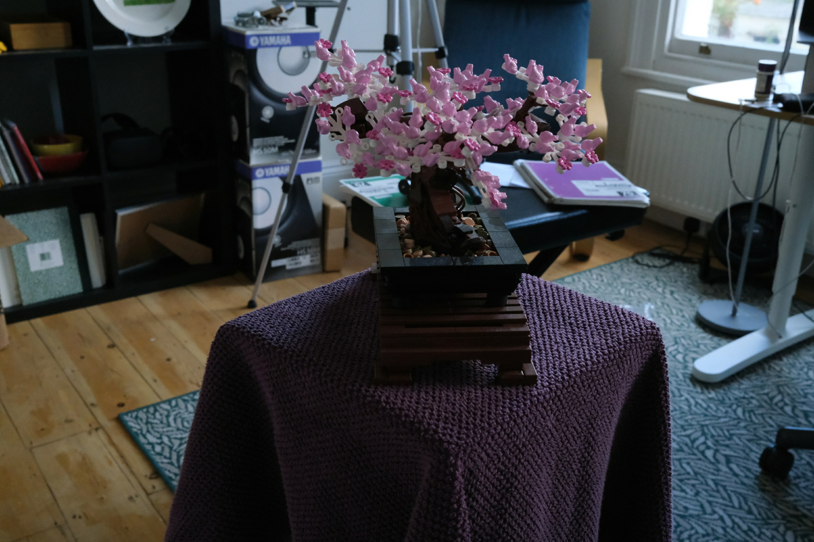 | 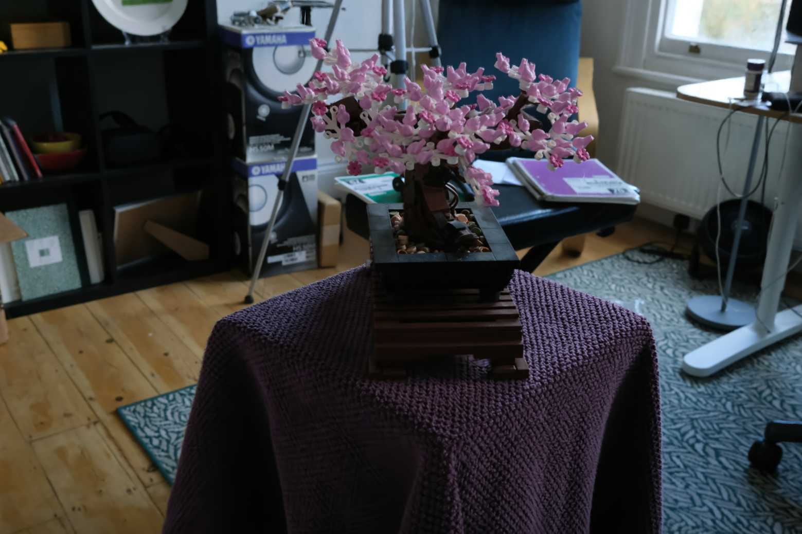 |  |
| 크롭 | 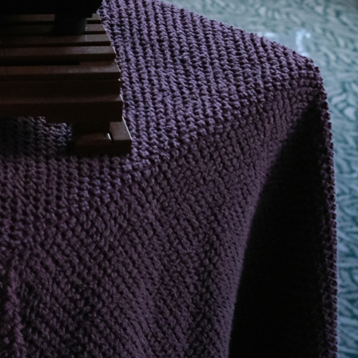 | 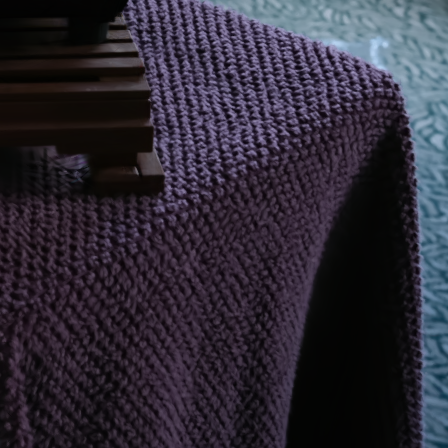 | 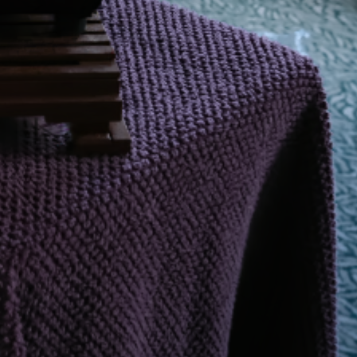 |

### 5.2 view 3 — 크롭 오차가 가장 큰 경우

| | GT | Full-ray | **본 방법** |
|---|---|---|---|
| 전체 | 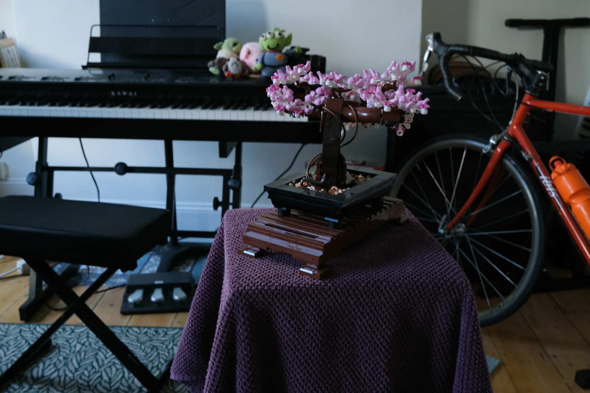 |  | 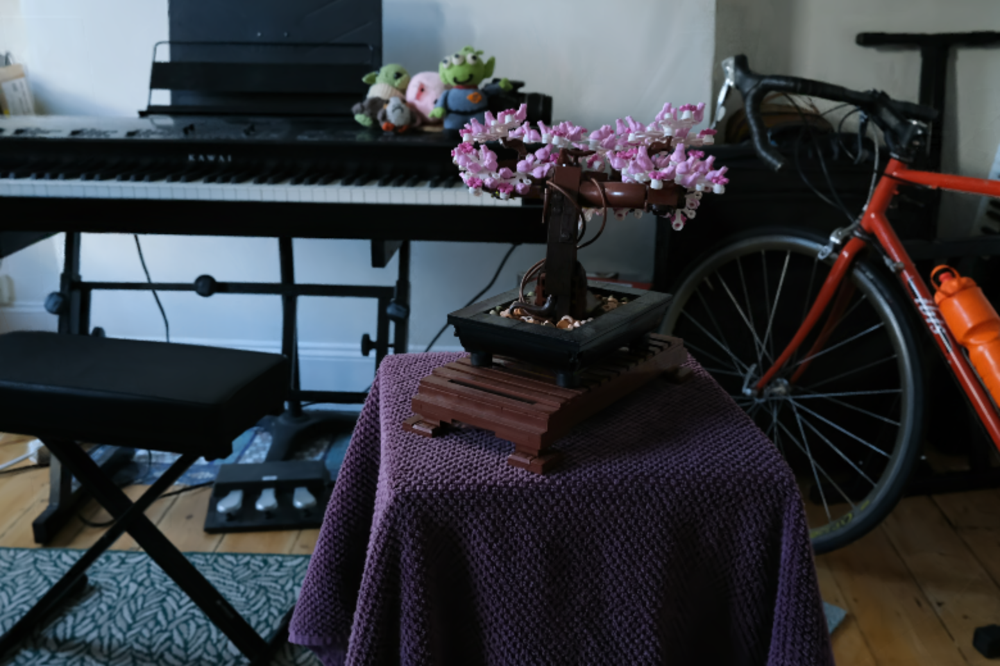 |
| 크롭 | 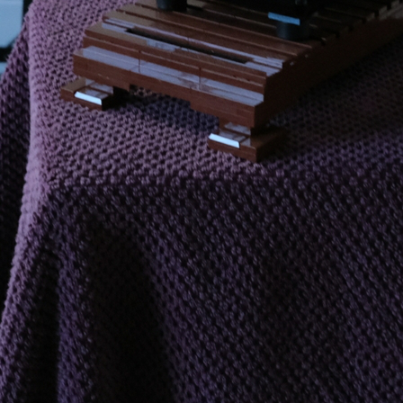 | 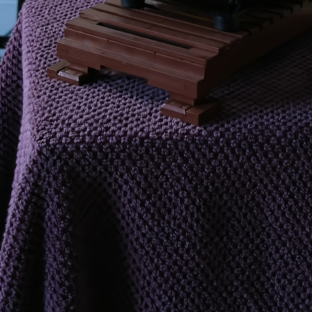 | 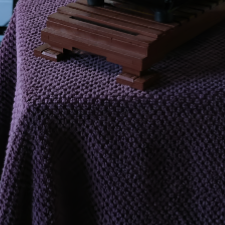 |

### 5.3 나머지 view

#### view 12 — full-ray 자체가 가장 흐린 경우

| | GT | Full-ray | **본 방법** |
|---|---|---|---|
| 전체 | 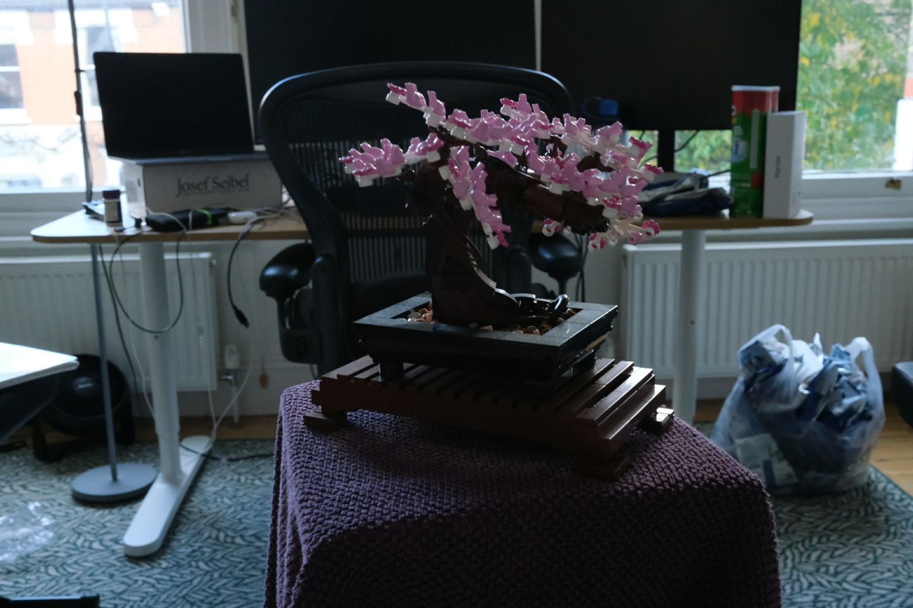 |  | 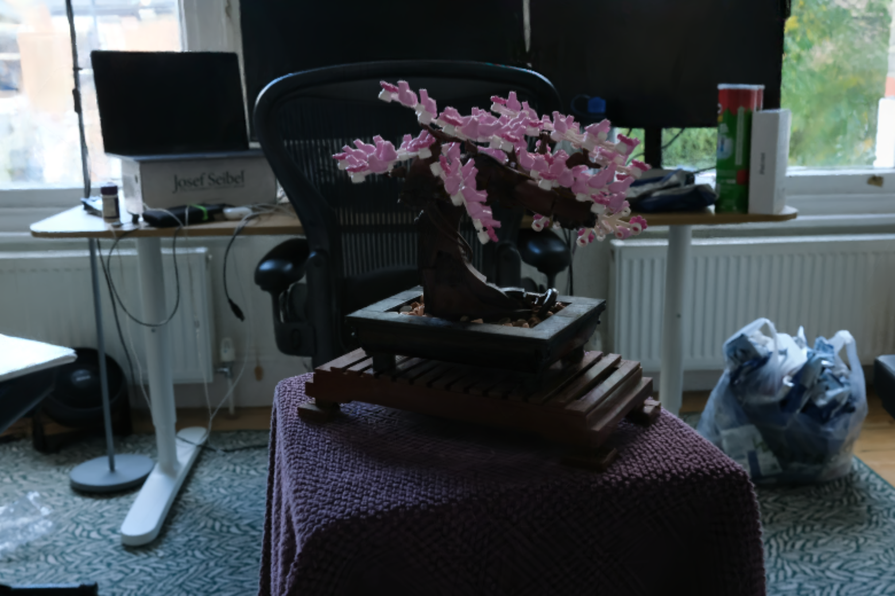 |
| 크롭 |  | 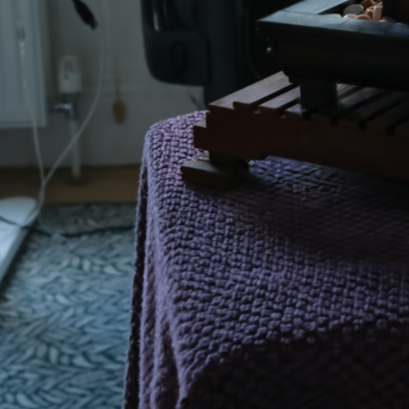 | 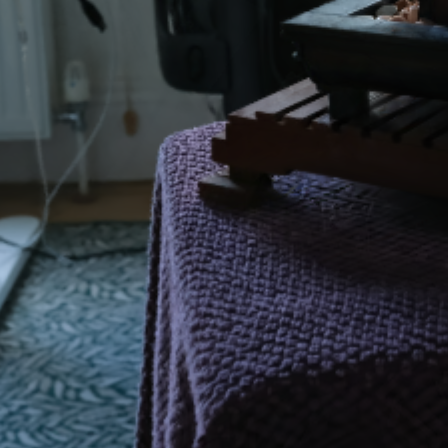 |

#### view 24, 31

| | GT | Full-ray | **본 방법** |
|---|---|---|---|
| view 24 전체 |  | 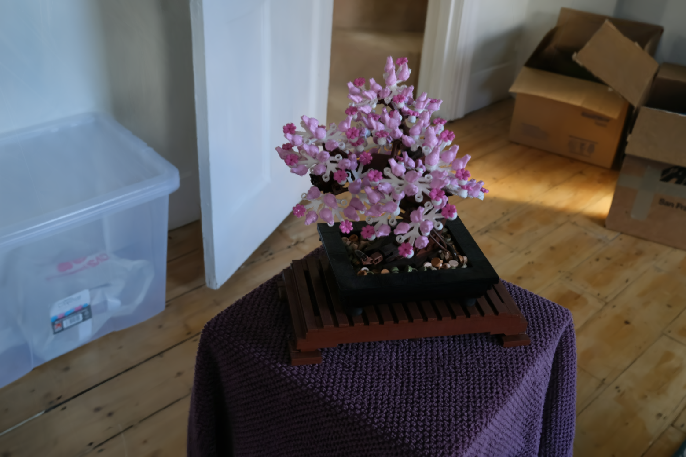 |  |
| view 24 크롭 | 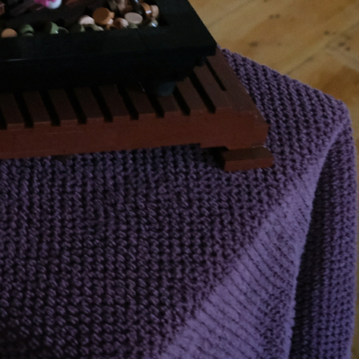 |  | 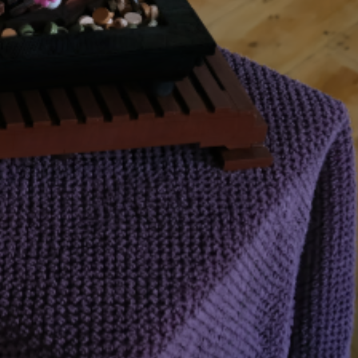 |
| view 31 전체 | 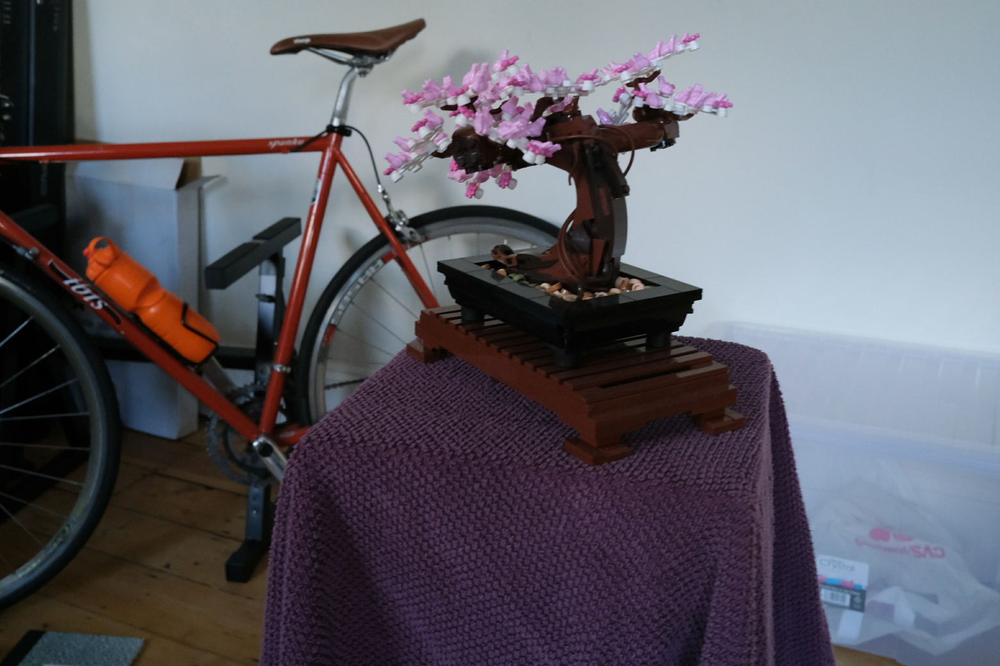 | 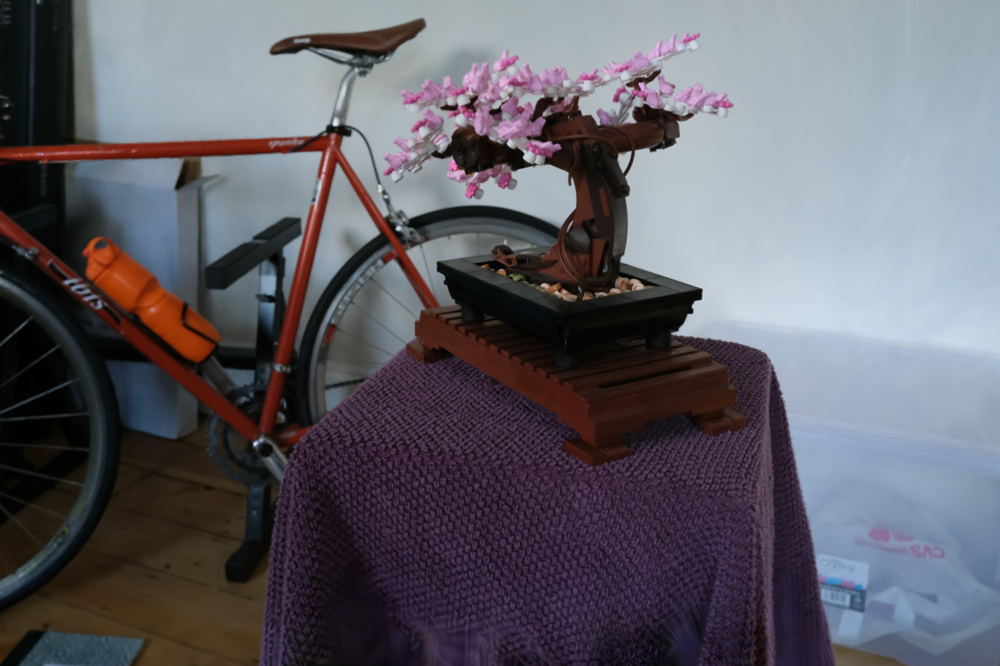 | 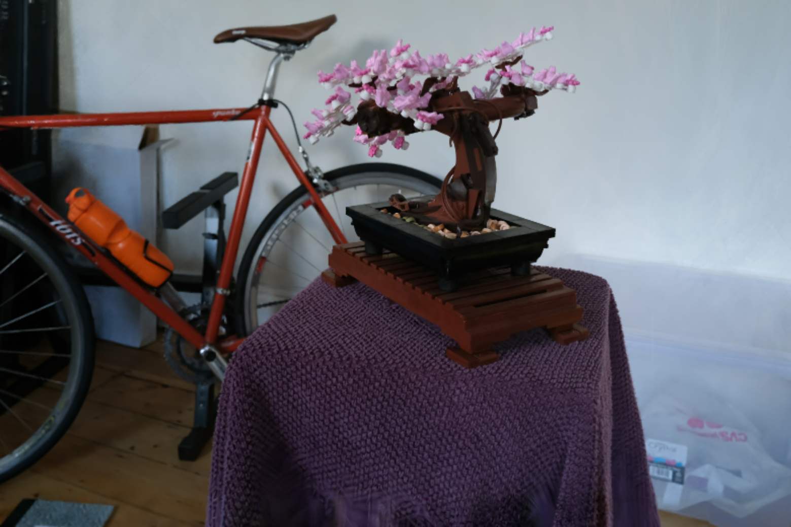 |
| view 31 크롭 | 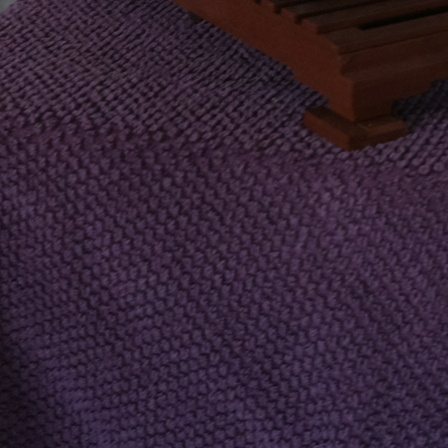 | 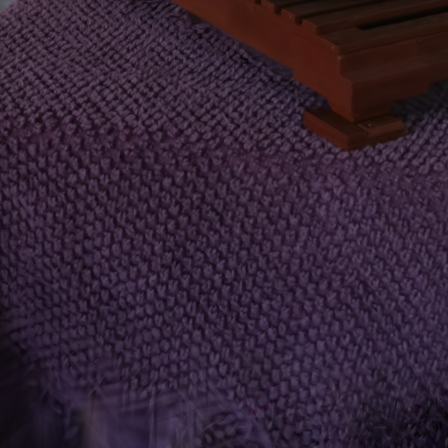 | 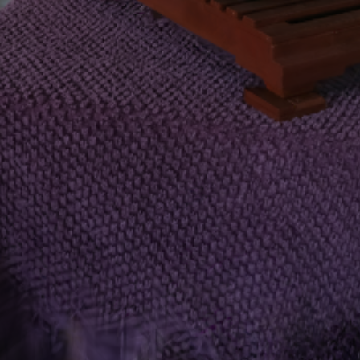 |

두 view 모두 GT 대비 격차가 0.1 dB 안쪽(view 24는 0.081, view 31은 0.107)이며, 크롭에서도 full-ray와의 차이를 지목하기 어렵다.

### 5.5 정성 결론

1. **1.4절에서 관측된 실패 양상이 해소되었다.** sparse 단독 구성이 무너뜨리던 미세 weave가 유지되며, 최악 크롭 기준으로 22.740 dB에서 32.631 dB로 바뀐다. 제어 변량(control variate)이 Nyquist 한계 아래의 고주파를 담당하고 sparse ray가 잔차만 보정하는 분업이 의도대로 작동한다.
2. **남은 열화는 그늘에 집중된다.** hit culling이 버리는 radiance의 절대량은 밝기와 무관하지만 상대 오차는 어두운 영역에서 커지므로, 잔차가 그늘로 몰린다. 이는 해상도 축소 방식이 만드는 에지 열화와 전혀 다른 분포이며, 대비를 조정하지 않는 한 지각적으로 덜 두드러진다.
3. **기여 폭이 full-ray 품질에 비례한다.** view 18(+0.853)과 view 12(+0.324)의 차이가 이를 보여준다. Gaussian 모델이 이미 흐린 영역에서는 $B$가 놓치는 것도 적어 sparse ray가 할 일이 줄어든다. 5.1절 표의 관계는 4.2절에서 관측한 "$B$가 좋을수록 기여가 사라진다"는 경향과 같은 현상의 view 단위 표현이다.

