# Sparse-Ray 학습 다중 씬 정량평가

> 작성일: 2026-08-07

> 대상: 1/N stratified primary ray만으로 3DGRT 씬을 처음부터 학습한 결과

> 하드웨어: NVIDIA GeForce RTX 4070 SUPER 12 GB (전 실행 동일)

> 공통 조건: 30,000 iteration, `test_split_interval=8`, L1 0.8 + SSIM 0.2, SH degree 3

---

## 1. bonsai (실내)

292장 · ds=1 3118×2078 (6.48MP) 

| 렌더러 | 해상도 | 희소도 | step당 ray | PSNR | 학습 시간 | Gaussian |
|---|---|---|---:|---:|---:|---:|
| 3DGUT | ds=1 | dense | 6,479,204 | 32.051 | 42:16 | 1,148,167 |
| 3DGRT | ds=1 | dense | 6,479,204 | 31.662 | 7:19:50 | 1,265,883 |
| **3DGRT sparse** | ds=1 | **1/64** | 101,400 | **31.293** | **30:22** | 1,221,706 |
| 3DGRT sparse | ds=1 | 1/256 | 25,350 | 30.192 | 32:00 | 1,874,972 |
| 3DGRT | ds=2 | dense | 1,619,801 | 31.893 | 2:12:38 | 1,484,957 |
| 3DGRT sparse | ds=2 | 1/64 | 25,350 | 30.398 | 28:02 | 2,024,335 |
| 3DGRT sparse | ds=2 | 1/16 | 25,350 | 30.698 | 27:02 | 1,937,125 |

---

## 2. counter (실내)

240장 · ds=1 3115×2076 (6.47MP) 

| 렌더러 | 해상도 | 희소도 | step당 ray | PSNR | 학습 시간 | Gaussian |
|---|---|---|---:|---:|---:|---:|
| 3DGUT | ds=1 | dense | 6,468,000 | 28.906 | 44:09 | 953,098 |
| 3DGRT | ds=1 | dense | 6,468,000 | 28.407 | 7:00:41 | 1,064,001 |
| **3DGRT sparse** | ds=1 | **1/64** | 101,400 | **28.297** | **20:27** | 1,040,193 |
| 3DGUT | ds=4 | dense | 404,250 | 29.299 | 18:43 | 1,153,201 |

#### counter씬에서 특히 품질이 많이 보존되는 것을 확인할 수 있다. 

## 3. room (실내)

311장 · ds=1 3114×2075 (6.46MP) 

| 렌더러 | 해상도 | 희소도 | step당 ray | PSNR | 학습 시간 | Gaussian |
|---|---|---|---:|---:|---:|---:|
| 3DGUT | ds=1 | dense | 6,461,550 | 31.259 | 36:25 | 894,947 |
| 3DGRT | ds=1 | dense | 6,461,550 | 30.765| 6:50:14| 1,174,511|
| **3DGRT sparse** | ds=1 | **1/64** | 101,400 | **30.444** | **16:55** | 1,096,966 |

---

## 4. kitchen (실내)

279장 · ds=1 3115×2078 (6.47MP)

| 렌더러 | 해상도 | 희소도 | step당 ray | PSNR | 학습 시간 | Gaussian |
|---|---|---|---:|---:|---:|---:|
| 3DGRT | ds=1 | dense | 6,472,970 | 30.017| 7:21:44| 1,316,712|
| **3DGRT sparse** | ds=1 | **1/64** | 101,400 | **29.355** | **31:29** | 1,306,485 |

---

## 5. stump (실외)

125장 · ds=1 4978×3300 (16.43MP)

| 렌더러 | 해상도 | 희소도 | step당 ray | PSNR | 학습 시간 | Gaussian |
|---|---|---|---:|---:|---:|---:|
| 3DGUT | ds=1 | dense | 16,427,400 | 26.032 | 1:09:56 | 1,844,630 |
| 3DGRT | ds=1 | dense | 16,427,400 | 메모리 초과 | | |
| **3DGRT sparse** | ds=1 | **1/64** | 257,299 | **26.079** | **43:06** | 3,038,520 |
| 3DGUT | ds=4 | dense | 1,026,712 | 26.283 | 29:18 | 2,088,200 |

3DGRT로 원해상도는 실외씬이여서 학습이 용이하지 않아 GUT와 비교하는 것으로 봤다.

3DGUT 대비 **+0.047 dB / 1.62배**로, 다섯 씬 중 유일하게 품질이 동등하다.

Gaussian의 수의 차이로 품질이 높은 것으로 볼 수 있으나 3DGUT의 gaussian수는 통제로 인한 수가 아니라 자연적인 수렴결과이므로 의미가 있다고 볼 수 있다. 

---

## 6. bicycle (실외)

194장 · ds=1 4946×3286 (16.25MP) 

| 렌더러 | 해상도 | 희소도 | step당 ray | PSNR | 학습 시간 | Gaussian |
|---|---|---|---:|---:|---:|---:|
| 3DGUT | ds=8 | dense | 254,203  | 26.298|22:24 | 2,250,521 |
| 3DGRT | ds=4 | dense | 1,016,814 | 24.624 | 1:09:42 | 3,159,475 |
| **3DGRT sparse** | ds=4 | **1/9** | 113,162 | **24.423** | **31:38** | 3,057,599 |
| 3DGRT sparse | ds=4 | 1/64 | 15,965 | 23.450 | 30:52 | 3,443,427 |
| EVER (cap 2M) | ds=8 | dense | 254,203 | 26.439 | 23:18 | |
| EVER (cap 120k) | ds=8 | dense | 254,203 | 24.512 | 6:27 | |

ds=4에서 희소도만 바꾼 대조

| 희소도 | step당 ray | PSNR | 학습 시간 | Gaussian |
|---|---:|---:|---:|---:|
| 1/64 | 15,965 | 23.450 | 30:52 | 3,443,427 |
| **1/9** | 113,162 (7.1배) | **24.423 (+0.973)** | 31:38 (+2.5%) | 3,057,599 |

ray를 7.1배 늘려도 학습 시간이 2.5%만 증가하고 품질이 0.973 dB 오른다. 

bicycle씬의 경우 Downsample한 씬에서 비교해서 그런지 sparse구조의 품질이 비교적 많이 떨어지는 경향을 보인다.

또한 1/64 sample-ray 대비 1/9 sample-ray에서 학습 속도가 크게 증가하지 않는 점이 가장 이상한 부분이고 이 부분에서 구현상 버그가 있는 것으로 파악된다. 

---

## 7. 씬별 요약

### 7.1 Sparse 3DGRT VS Dense 3DGRT (같은 렌더러, 같은 해상도)

희소화만의 대가를 재는 비교다. 렌더러가 같으므로 다른 요인이 섞이지 않는다.

| 씬 | 해상도 | dense PSNR | sparse PSNR | **품질 차** | dense 시간 | sparse 시간 | **속도** |
|---|---|---:|---:|---:|---:|---:|---:|
| counter | ds=1 | 28.407 | 28.297 | **-0.110** | 7:00:41 | 20:27 | **20.6배** |
| room | ds=1 | 30.765 | 30.444 | **-0.321** | 6:50:14 | 16:55 | **24.3배** |
| bonsai | ds=1 | 31.662 | 31.293 | **-0.369** | 7:19:50 | 30:22 | **14.5배** |
| kitchen | ds=1 | 30.017 | 29.355 | **-0.662** | 7:12:44 | 31:29 | **14배** |
| stump | ds=1 | 메모리 초과 | 26.079 | — | — | 43:06 | — |
| bicycle | ds=4 | 24.624 | 24.423 | **-0.201** | 1:09:42 | 31:38 | **2.2배** |

측정된 네 씬 모두 **품질 -0.4 dB 이내**다. 가속은 실내 ds=1에서 14~24배이고, bicycle은 ds=4로 step당 ray가 적어 2.2배에 그친다.

### 7.2 Sparse 3DGRT VS 그 씬 최고 모델

각 씬에서 우리가 돌린 것 중 PSNR이 가장 높았던 실행과 비교한다.

| 씬 | 해상도 | 최고 모델 | 그 PSNR | sparse PSNR | **품질 차** | 그 시간 | sparse 시간 | **속도** |
|---|---|---|---:|---:|---:|---:|---:|---:|
| stump | ds=1 | 3DGUT | 26.032 | 26.079 | **+0.047** | 1:09:56 | 43:06 | **1.62배** |
| counter | ds=1 | 3DGUT | 28.906 | 28.297 | -0.609 | 44:09 | 20:27 | **2.16배** |
| bonsai | ds=1 | 3DGUT | 32.051 | 31.293 | -0.758 | 42:16 | 30:22 | **1.39배** |
| room | ds=1 | 3DGUT | 31.259 | 30.444 | -0.815 | 36:25 | 16:55 | **2.15배** |
| kitchen | ds=1 | 3DGRT | 30.017 | 29.355 | **-0.662** | 7:12:44 | 31:29 | **14배** |
| bicycle | ds=4 | 3DGRT | 24.624 | 24.423 | **-0.201** | 1:09:42 | 31:38 | **2.2배** |

모든씬에서 최고 모델보다 **1.4~2.2배 빠르다**(kitchen제외). 품질은 stump에서 동등하고 실내 세 씬에서 -0.6~-0.8 dB다.

---

## 8. 정성 결과

모든 이미지는 왼쪽부터 **GT · 대조군 · Sparse 1/64** 순이다. 각 씬에서 두 방법의 제곱오차가 큰 상위 3개 뷰를 고르고, 각 뷰마다 전체 뷰와 그 안에서 오차가 큰 360×360 창 2개를 함께 싣는다. 두 창은 겹치지 않으며, 전체 뷰와 크롭 모두 원해상도다. 즉 아래 크롭은 **두 방법이 가장 크게 어긋나는 지점**이며 평균적인 모습이 아니다.

대조군은 bonsai·counter가 3DGRT dense, room·stump는 3DGRT dense가 없거나(room) 메모리 초과로 불가능해(stump) **3DGUT**를 사용했다.

### 8.1 bonsai — 대조군 3DGRT dense (31.66) 대 sparse 1/64 (31.29)

**view 12** — 전체 뷰 (원해상도)

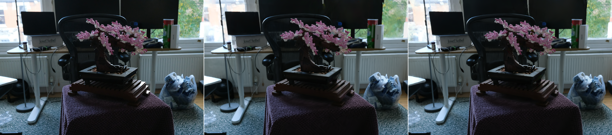

위 뷰에서 오차가 가장 큰 두 영역 (360×360, 원해상도)

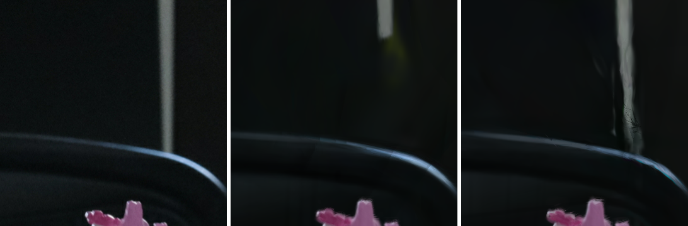

**view 15** — 전체 뷰 (원해상도)

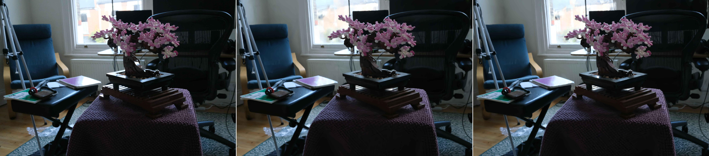

위 뷰에서 오차가 가장 큰 두 영역 (360×360, 원해상도)

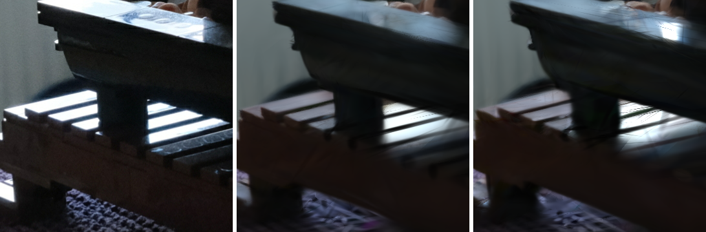

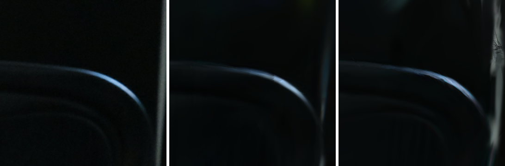

**view 0** — 전체 뷰 (원해상도)

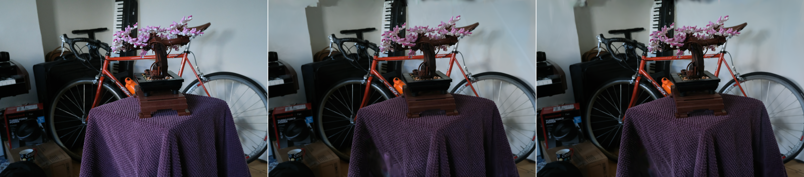

위 뷰에서 오차가 가장 큰 두 영역 (360×360, 원해상도)

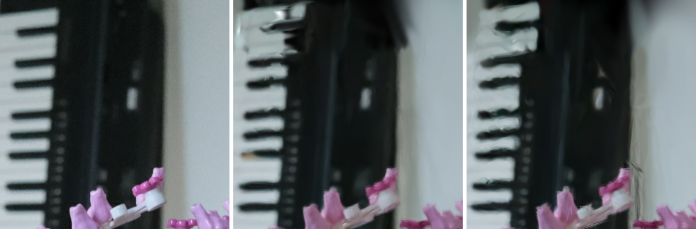

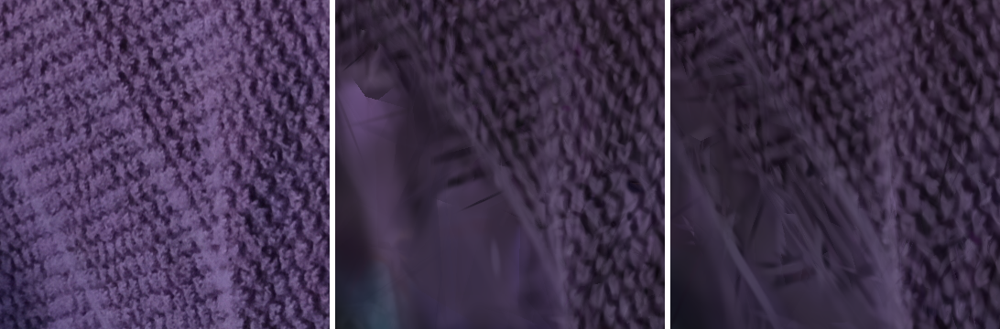

가장 어긋나는 지점인데도 sparse 쪽이 GT에 가깝다. dense는 잎 질감이 뭉개져 균일한 녹색으로 흐려지는 반면 sparse는 노란 반점과 잎맥 대비를 유지한다.

### 8.2 counter — 대조군 3DGRT dense (28.41) 대 sparse 1/64 (28.30)

**view 19** — 전체 뷰 (원해상도)

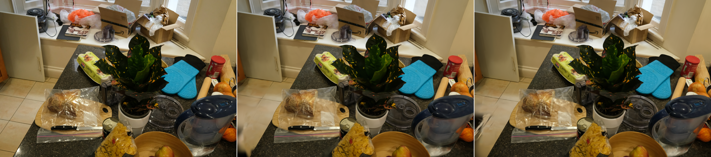

위 뷰에서 오차가 가장 큰 두 영역 (360×360, 원해상도)

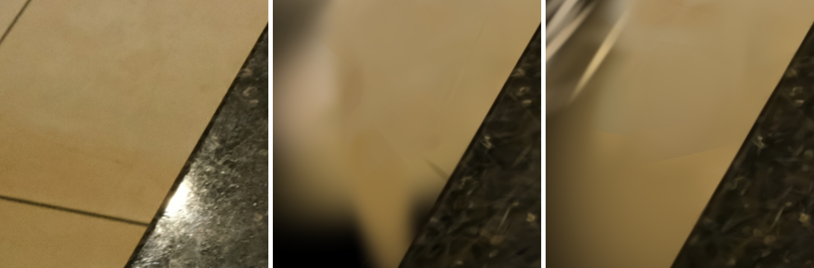

**view 9** — 전체 뷰 (원해상도)

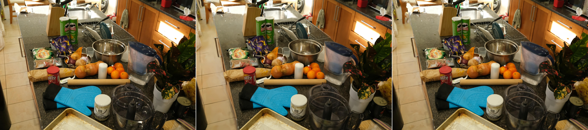

위 뷰에서 오차가 가장 큰 두 영역 (360×360, 원해상도)

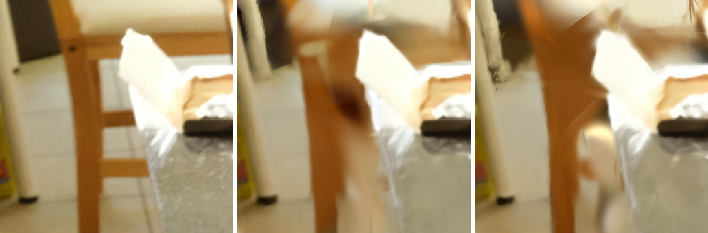

**view 17** — 전체 뷰 (원해상도)

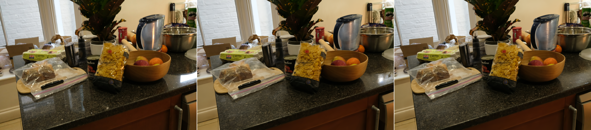

위 뷰에서 오차가 가장 큰 두 영역 (360×360, 원해상도)

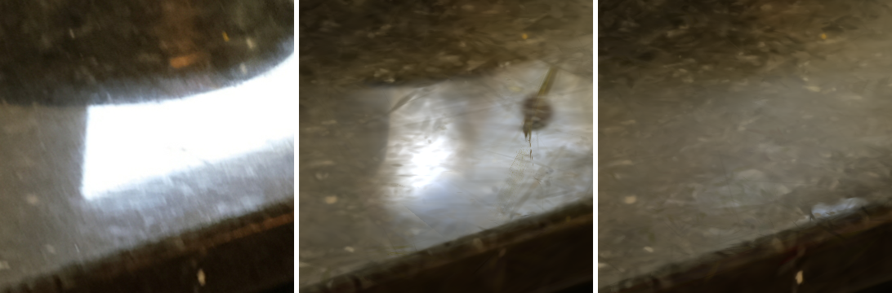

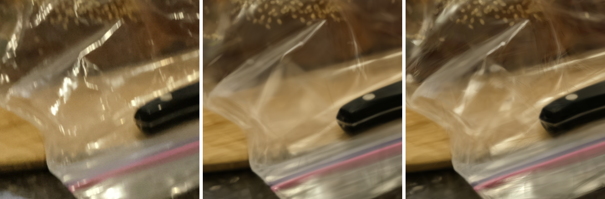

반대 사례다. GT가 타일 바닥의 직선 줄눈인데 sparse에 가늘고 긴 검은 streak가 대각선으로 들어간다. dense에도 같은 자리에 흐릿한 얼룩이 있으나 sparse 쪽이 훨씬 뚜렷하다.

### 8.3 room — 대조군 3DGRT (31.26) 대 sparse 1/64 (30.44)

**view 34** — 전체 뷰 (원해상도)

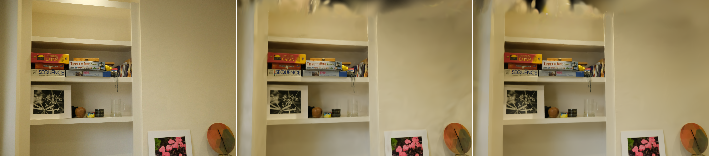

위 뷰에서 오차가 가장 큰 두 영역 (360×360, 원해상도)

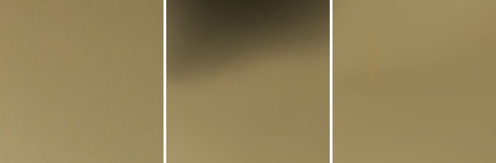

**view 36** — 전체 뷰 (원해상도)

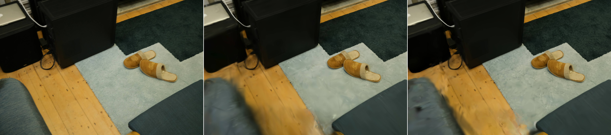

위 뷰에서 오차가 가장 큰 두 영역 (360×360, 원해상도)

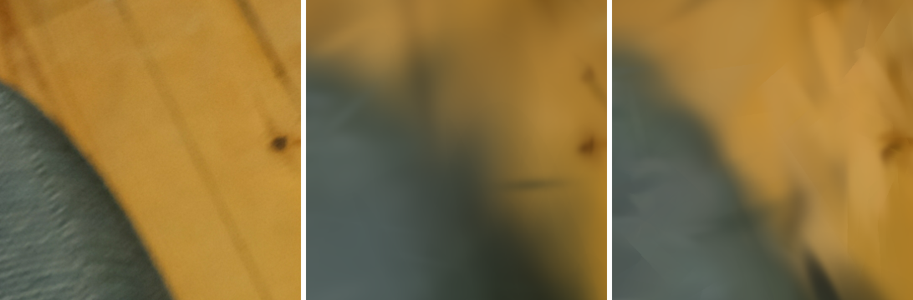

**view 35** — 전체 뷰 (원해상도)

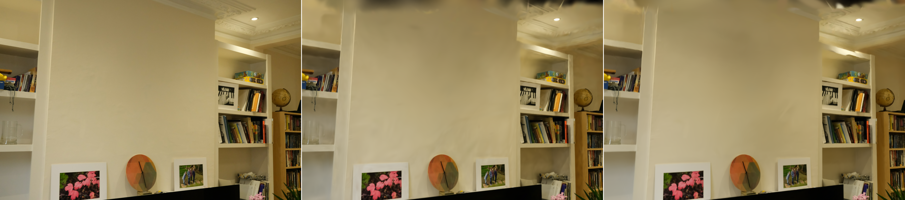

위 뷰에서 오차가 가장 큰 두 영역 (360×360, 원해상도)

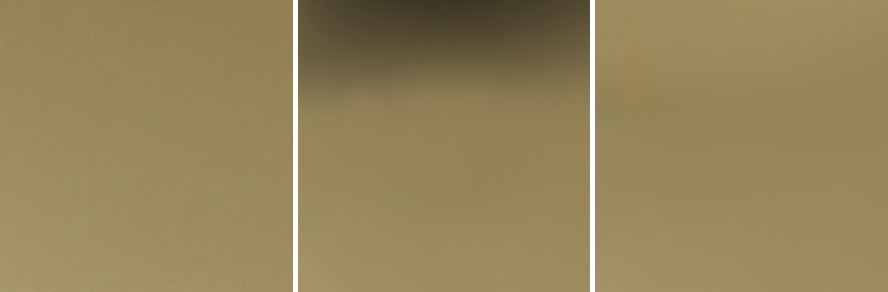

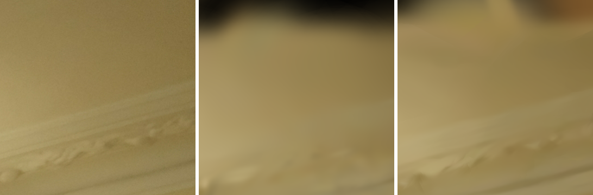

### 8.4 stump — 대조군 3DGUT (26.03) 대 sparse 1/64 (26.08)

**view 0** — 전체 뷰 (원해상도)

위 뷰에서 오차가 가장 큰 두 영역 (360×360, 원해상도)

**view 1** — 전체 뷰 (원해상도)

위 뷰에서 오차가 가장 큰 두 영역 (360×360, 원해상도)

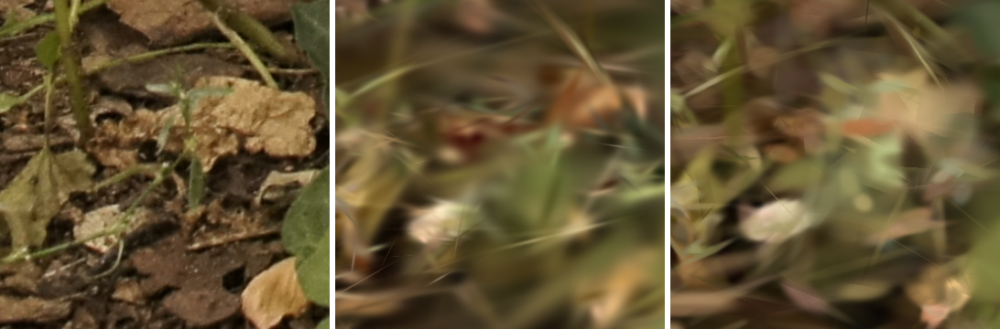

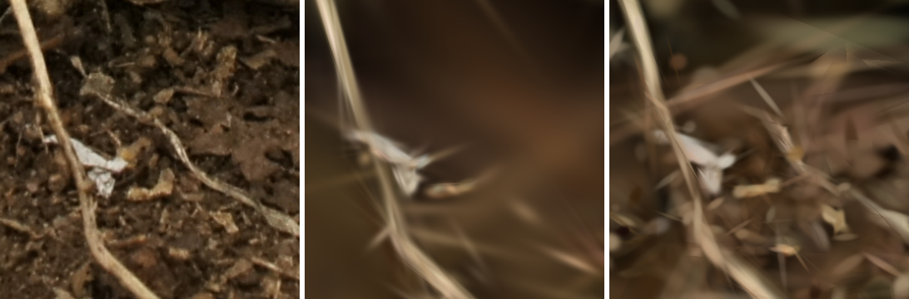

**view 2** — 전체 뷰 (원해상도)

위 뷰에서 오차가 가장 큰 두 영역 (360×360, 원해상도)

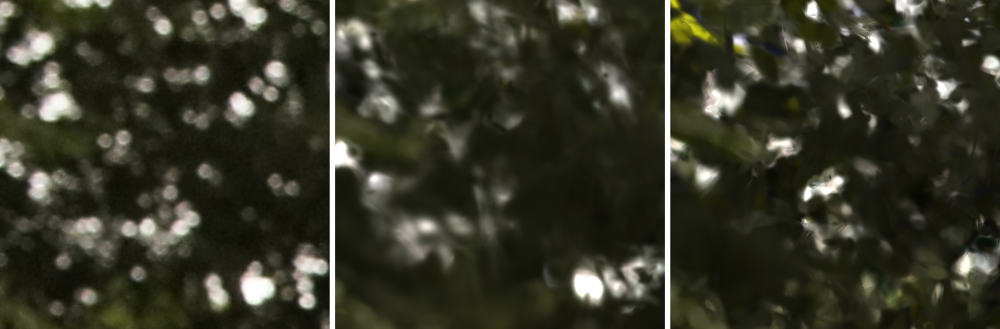

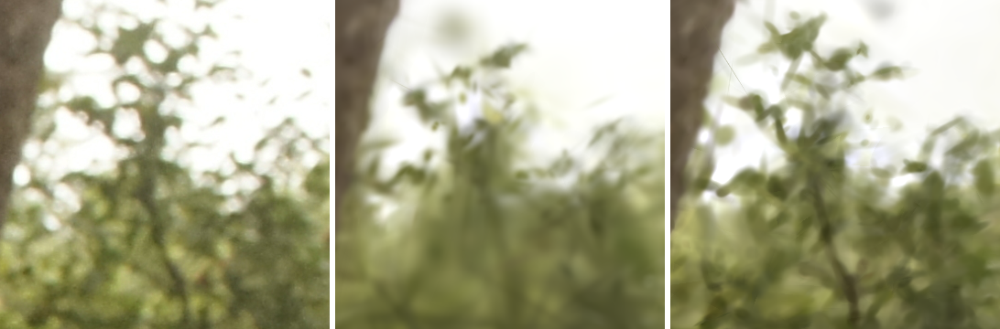

stump 원해상도에서의 비교는 GRT가 학습이 용이하지 않아 GUT와 비교한다.

sparse가 나뭇잎 사이 하이라이트와 잔가지를 더 또렷하게 복원하고 3DGUT는 같은 영역을 뭉개진 녹색 덩어리로 처리한다. 다만 sparse에는 가는 선 모양 artefact가 함께 들어가, 선명함과 허위 고주파가 동시에 나타난다. 이 씬에서 sparse가 PSNR로도 +0.047 dB 앞선 것과 일치한다.

### 8.5 bicycle — 대조군 3DGRT dense (24.62) 대 sparse 1/9 (24.42)

**view 1** — 전체 뷰 (원해상도)

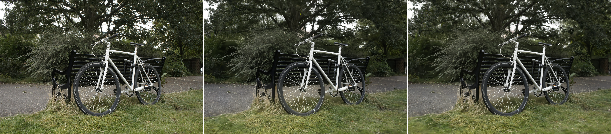

위 뷰에서 오차가 가장 큰 두 영역 (360×360, 원해상도)

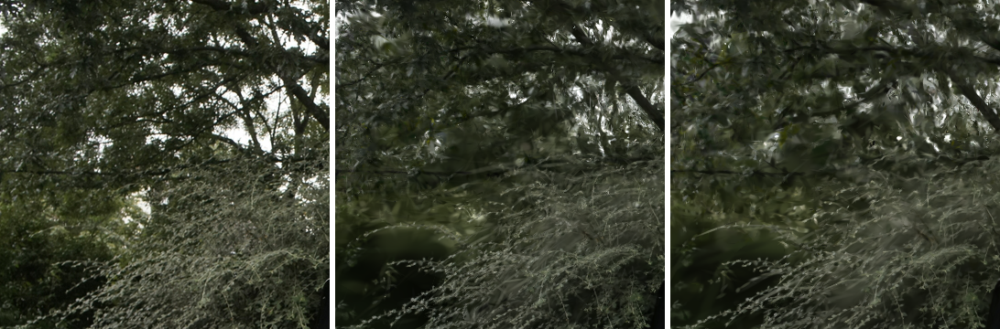

**view 2** — 전체 뷰 (원해상도)

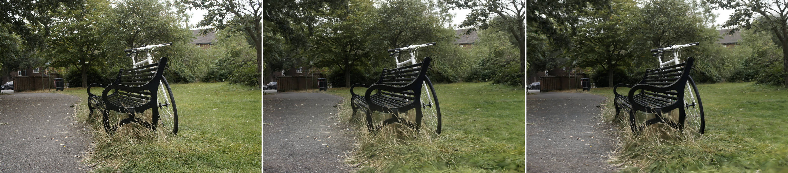

위 뷰에서 오차가 가장 큰 두 영역 (360×360, 원해상도)

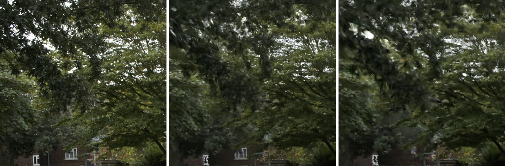

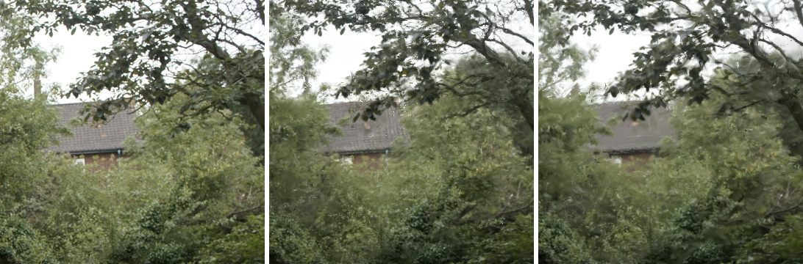

**view 3** — 전체 뷰 (원해상도)

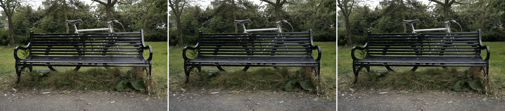

위 뷰에서 오차가 가장 큰 두 영역 (360×360, 원해상도)

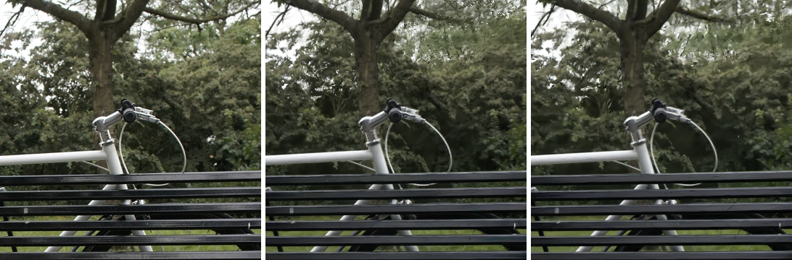

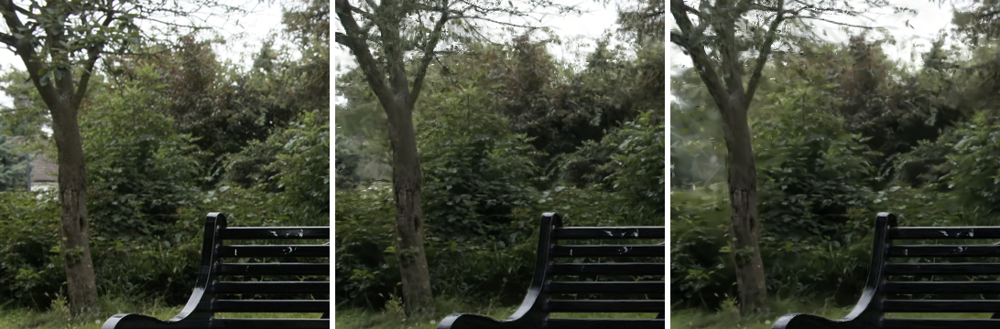

## 9. 결론

현재 sparse 구조의 경우 해상도 높을수록(원해상도) 속도차이와 품질이 올라가는 것을 다중씬으로 확인했다. 특히 sparse구조가 rasterization(3DGUT)보다도 학습속도가 빠른 것은 의미가 있다고 파악된다.

또한 Counter씬의 경우 GUT보다 품질이 좋다는 점을 분석해보는 것도 필요하다고 파악된다. GRT가 유리한 씬이여서 그렇다고 추측되긴한다.

그러나 Downsample씬에서는 속도, 품질 모두 부족한 것 같다고 파악됐고, 특히 ray수를 늘렸을 때(sample-ray) 속도가 느려지지 않는 점이 현재 문제점으로 보인다. 

그래서 현 구조에서 Downsample씬에서 원해상도의 속도, 품질이 왜 나오지 않는지를 중점으로 분석해야 한다. 