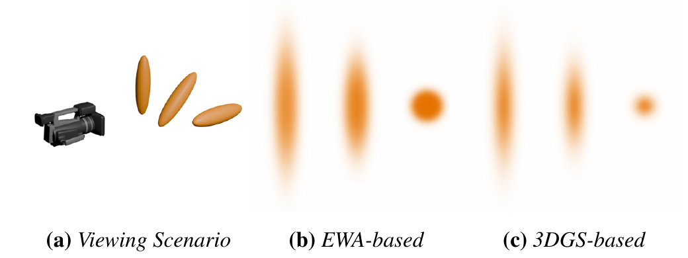
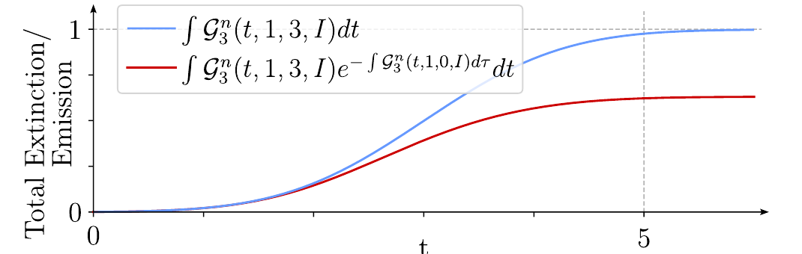
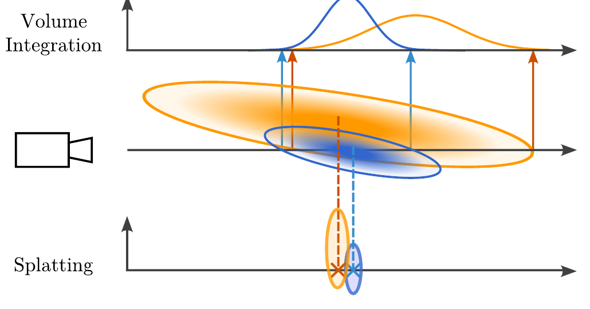
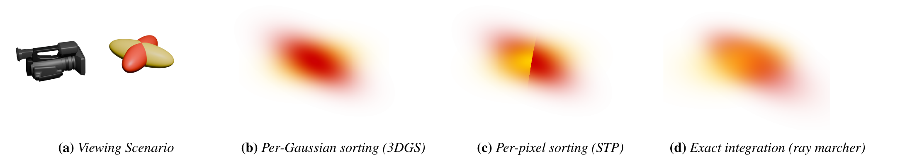
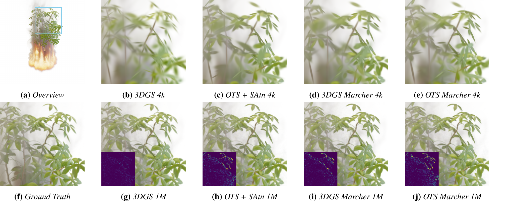

# Does 3D Gaussian Splatting Need Accurate Volumetric Rendering?

## 요약

**지난 미팅 (2026-07-25)** — 키워드 3줄
- 3DGEER 리뷰에서 overlap 처리가 속도를 위한 선택임을 확인
- 3DGS의 세 가지 근사(surface 대체, overlap 무시, self-attenuation 무시)를 정면으로 다룬 논문 확인
- 우리가 하던 medium·overlap 연구와 직접 연결

**합의 사항 → 상태**
- [완료] Celarek et al.(CGF 2025)의 실험 설계와 결론 정리
- [완료] 우리 연구 방향과의 접점 확인
- [부분] 저밀도 볼류메트릭 장면에서의 적용 범위 — 논문에 수치 없음

**이번 결과 / 막힌 것 / 다음**
- 논문의 EWA는 우리가 쓰던 medium과 같은 대상
- 자기감쇠 오차는 primitive 내부 광학 두께에 비례하므로 두껍고 밀도 높은 참여 매질에서 다시 커질 수 있음
- 막힌 것: 논문 실험이 대부분 solid object 장면이라 OTS와 OTS+SAtn을 저밀도 장면에서 따로 비교한 수치가 없음 🔴
- 다음: WDAS Cloud 같은 저밀도 데이터로 그 구간을 직접 확인

---

## 1. 논문 개요 및 성과 수준

### 1.1 서지 정보

- **논문명:** *Does 3D Gaussian Splatting Need Accurate Volumetric Rendering?*
- **저자:** A. Celarek, G. Kopanas, G. Drettakis, M. Wimmer, B. Kerbl
- **소속:** TU Wien(오스트리아), Google(영국), Inria 및 Université Côte d'Azur(프랑스)
- **게재 학회:** **Eurographics 2025 / Computer Graphics Forum 44(2)**
- **논문 상태:** CGF 정식 게재 (DOI 10.1111/cgf.70032), open access
- **arXiv:** 2502.19318v1 (2025년 2월 26일 버전)
- **주요 분야:** volumetric rendering theory, 3D Gaussian splatting, EWA splatting, ray marching, novel-view synthesis

저자진에 3DGS 원논문(Kerbl et al., SIGGRAPH 2023)의 제1저자 Bernhard Kerbl과 교신저자 George Drettakis, 공저자 George Kopanas가 포함되어 있다. 즉 3DGS를 만든 팀이 자신들이 채택한 근사를 직접 검증한 논문이며, 새로운 방법을 제안하는 논문이 아니라 **분석(analysis) 논문**이다.

### 1.2 이 논문에서 다루는 문제

NeRF는 물리에서 출발한 volumetric ray marching을 사용한다. 3DGS는 NeRF와 image formation model을 공유한다고 말하지만, 실제로는 속도를 얻기 위해 volume rendering 이론에서 상당히 벗어난 하이브리드 구조다. 그중 다수는 3DGS가 기반으로 삼은 EWA splatting(Zwicker et al., 2002)에서 이미 확립된 것이다.

- 3D에서 Gaussian이 서로 겹치지 않는다고 가정한다 (**overlap 무시**)
- Gaussian 내부에서 빛이 스스로 감쇠하는 효과를 무시한다 (**self-attenuation 무시**)
- 원근 투영을 Jacobian 1차 Taylor 전개로 선형화한다 (**투영 근사**)
- 감쇠항 $e^{-x}$를 $1-x$로 근사한다

여기에 3DGS 고유의 근사가 더해진다. Gaussian 중심의 view-space depth 하나로 전역 정렬하여 가시성을 해결하고(**ordering 근사**, popping의 원인), extinction 대신 시점 무관 상수 opacity를 primitive마다 학습한다(**opacity 파라미터화**).

이 논문이 던지는 질문은 단순하다.

> 이 근사들을 제거하고 원리적인 volumetric rendering으로 대체하면 3DGS의 품질이 좋아지는가?

답을 얻기 위해 논문에선 다음 세 가지를 수행한다.

1. **수학적 프레임워크 정립:** 3DGS의 "opacity"와 volume rendering의 "extinction"이 서로 다른 물리량임을 명확히 한다. 전자는 투영된 2D 진폭을 보존하고 후자는 총적분(질량)을 보존하며, 3DGS의 opacity는 volume rendering 이론에 대응하는 물리량이 없다.
2. **근사를 되돌린 알고리즘 설계:** extinction 기반 splatting(OTS), 자기감쇠를 반영한 변종(OTS+SAtn), 그리고 overlap과 투영까지 정확히 처리하는 ray marcher를 구현한다. 근사를 하나씩만 교체해 각각의 효과를 분리 측정하기 위한 도구다.
3. **모델 크기에 따른 체계적 평가:** densification을 끈 채 4k에서 1M개까지 Gaussian 수를 고정해가며 여섯 변종을 비교한다.

이 논문은 **정확한 볼륨 적분이 Gaussian 수가 적을 때만 유리하며, primitive가 충분히 많아지면 근사를 쓰는 원래 3DGS가 오히려 더 나은 결과를 낸다는 것**을 핵심 주장으로 제시한다.


## 2. 이 논문이 우리 연구에 주는 함의

이 논문에서는 3DGS에서 하는 근사 - gaussian을 medium(extinction)이 아닌 surface(opacity), overlap 무시, self-attenuated 무시 에 대해 고찰하는데 이는 우리가 원래 하던 연구와 매우 밀접하게 관계되어 있다. 

그래서 이 논문의 실험과 결과는 우리의 연구 방향성에 큰 도움을 줄 것으로 보인다. 

또한 이 논문에서는 3DGS를 

1.  extinctionbased volume rendering 즉 medium 모델
2.  self-attenuated 처리
3.  overlap 처리

하는 알고리즘을 추가해 어떤 결과가 나타나는지에 대해 설명하고 있다. 하지만 이 과정에서 알고리즘의 최적화를 하진 않았기 때문에 학습속도와 렌더링 속도 측면에서의 비교는 유효하지 않을 수 있다. 

이에 대해서 논문에는 아래와 같이 언급한다.

>Our ray marching implementations are intended to provide guide- lines or achievable quality with correct volume rendering and are **not optimized,** thus training a single scene can take several hours.


## 3. extinctionbased volume rendering - medium 모델

### 3.1 두 가지 파라미터화

Gaussian primitive는 학습되는 스칼라 $\theta$를 하나 갖는다. 이 $\theta$가 **무엇을 보존하는 양인가**에 따라 두 계열로 갈린다.

**extinction 기반 (EWA, NeRF)** — $\theta$는 정규화 Gaussian의 가중치 $w$, 즉 **총적분(질량)** 이다. 밀도장을 적분해 투과율을 얻는 volume rendering 이론과 같은 물리량이며, NeRF가 학습하는 density와 동일한 개념이다.

논문에서는 **EWA**라고 주로 부르지만 우리 연구에서 부르던 표현인 medium과 같은 대상을 가리킨다. 

$$G^n_D(x) = w \cdot N_D(x; \mu, \Sigma), \qquad \int G^n_D\,dx = w$$

**opacity 기반 (3DGS)** — $\theta$는 비정규화 Gaussian의 **진폭(중심에서의 값)** 이다. primitive마다 상수 하나를 부여하며, 이 값은 적분된 extinction과 무관하다.

$$G^u_D(x) = a \cdot I_D(\Sigma) \cdot N_D(x; \mu, \Sigma), \qquad a = \frac{w}{I_D(\Sigma)}$$

두 표현은 $I_D(\Sigma) = \sqrt{(2\pi)^D \det\Sigma}$로 변환 가능하지만, **무엇을 시점에 대해 고정할 것인가**에서 갈린다.

| | EWA (extinction) | 3DGS (opacity) |
|---|---|---|
| 학습 파라미터 $\theta$ | 총질량 $w$ | 투영 진폭 $a'$ |
| 투영 시 진폭 | $a' = \theta / I_2(\Sigma')$ | $a' = \theta$ |
| 시점 의존성 | 진폭이 시점에 따라 변함 | 진폭이 시점 무관하게 고정 |
| volume rendering 이론 대응 | 있음 (NeRF의 density와 동일) | **없음** |


### 3.2 두 방식의 차이



*Figure 4. (a) 왼쪽 Gaussian은 가장 얇은 면을, 가운데는 45°, 오른쪽은 가장 두꺼운 면을 카메라 쪽으로 향하고 있다. (b) EWA는 extinction의 적분을 보존하므로 세 Gaussian이 점점 어두워진다. (c) 3DGS는 세 Gaussian의 중심 밝기가 모두 같다.*

이 그림이 두 계열의 차이를 가장 직접적으로 보여준다.

**(b) EWA:** ray가 Gaussian 내부를 지나는 거리가 길수록 광학 깊이가 커지므로 더 어둡게 보인다. 물리적으로 옳은 거동이다. 안개를 얇게 통과할 때보다 두껍게 통과할 때 더 짙게 보이는 것과 같다.

**(c) 3DGS:** 세 Gaussian의 중심 밝기가 동일하다. ray가 얼마나 지나가든 무관하다. 이는 **두께가 없는 표면**의 성질이다.

논문은 이를 다음과 같이 정리한다.

> 3DGS는 **시점 의존 extinction을 갖는 volume rendering 모델**을 사용하는 셈이며, 이는 Gaussian 입자 구름의 밀도(와 질량)가 시점에 따라 변한다는 뜻이 되어 물리 기반 volume integration 프레임워크와 모순된다.

즉 3DGS의 opacity는 **volume rendering 이론에 대응물이 없는 양**이다. 논문은 후속 연구들에서 "extinction", "density", "opacity"가 혼용되거나 동일시되는 사례를 네 편 지목하며, 이 구분이 자주 간과된다고 지적한다.

다만 논문은 곧바로 균형을 잡는다. 이 선택은 **성능만을 위한 근사가 아니라 실제로 잘 작동하는 설계 결정(design decision)** 이며, 시점 무관 상수라서 유계이고 학습이 잘 되는 스칼라를 얻는다는 이점이 있다는 것이다.

### 3.3 3DGS에 extinction 기반을 구현하기 — OTS

EWA의 파라미터화를 3DGS 최적화 파이프라인에 그대로 넣으면 학습이 불안정해진다. 

```
    Gaussian 이 커짐  →  I₃, I₂ 증가  →  a' 감소  →  더 투명해짐
    Gaussian 이 작아짐 →  I₃, I₂ 감소  →  a' 증가  →  더 불투명해짐
```

이미 적절한 불투명도에 도달한 Gaussian이 형상을 조정하려는 순간 불투명도가 함께 흔들린다는 뜻이다. 특히 **얇고 불투명한 표면**(벽, 나뭇잎)을 모델링할 때 문제가 크다. 납작한 Gaussian이 불투명해 보이려면 두꺼운 Gaussian보다 훨씬 높은 extinction이 필요하기 때문이다.

논문은 이를 해결하기 위해 **OTS(opacity-thin-side)** 라는 파라미터화를 새로 설계한다. 핵심은 **가장 얇은 축 방향에서 봤을 때의 불투명도를 기준으로 $\theta$를 정의**하는 것이다.

$$a = \theta \frac{I_2^*(\Sigma)}{I_3(\Sigma)}, \qquad a' = \theta \frac{I_2^*(\Sigma)}{I_2(\Sigma')}, \qquad I_2^*(\Sigma) = 2\pi\sqrt{\lambda_1 \lambda_2}$$

여기서 $\lambda_1, \lambda_2$는 3D covariance의 최대·차대 고유값이다. 이렇게 하면 다음 두 성질을 동시에 얻는다.

| 성질 | 만족 |
|---|---|
| 회전에 대해 3D 적분값이 시점 독립 (물리적 정합성) | EWA와 동일 |
| 얇은 물체를 불투명하게 표현 가능 (학습 안정성) | 3DGS와 유사 |

OTS는 이 논문이 실험을 위해 만든 **측정 도구**다. extinction 기반을 학습 가능한 형태로 만들지 못하면 "extinction이 나은가"라는 질문 자체를 실험할 수 없기 때문이다.

### 3.4 OTS의 결과 — extinction은 언제 이기고 언제 지는가

**3DGS와 OTS는 둘 다 splatting이며, overlap과 self-attenuation을 똑같이 무시한다.** 따라서 두 방법의 차이는 오직 파라미터화 하나에서만 온다. extinction 축을 순수하게 분리 측정한 값이다.

densification을 끈 채 Gaussian 수를 4k에서 1M까지 고정해가며 측정한 전 장면 평균 결과다(논문 Table 2).

| Gaussian 수 | 4k | 12k | 36k | 100k | 330k | 1M |
|---|---|---|---|---|---|---|
| **PSNR ↑** | | | | | | |
| 3DGS (opacity) | 31.63 | 33.22 | 34.73 | **36.05** | **37.02** | **37.58** |
| OTS (extinction) | **32.17** | **33.66** | **34.83** | 35.78 | 36.52 | 36.93 |
| **SSIM ↑** | | | | | | |
| 3DGS (opacity) | .9320 | .9471 | .9596 | .9684 | **.9736** | **.9760** |
| OTS (extinction) | **.9394** | **.9524** | **.9619** | **.9686** | .9729 | .9747 |
| **LPIPS ↓** | | | | | | |
| 3DGS (opacity) | .1231 | .1007 | .0800 | .0632 | .0523 | **.0467** |
| OTS (extinction) | **.1115** | **.0906** | **.0742** | **.0611** | **.0517** | .0471 |

**Gaussian 수가 적을 때는 extinction이 이기고, 많아지면 opacity가 역전한다.** 4k에서 OTS가 +0.54 dB 앞서지만 1M에서는 3DGS가 +0.65 dB로 뒤집는다.

주목할 점은 **역전 시점이 지표마다 다르다**는 것이다.

| 지표 | 교차점 | 성격 |
|---|---|---|
| PSNR | 36k ~ 100k 사이 | 픽셀 오차 |
| SSIM | 100k ~ 330k 사이 | 구조적 유사도 |
| **LPIPS** | **330k ~ 1M 사이** | **지각적 품질** |

**지각 지표일수록 extinction이 오래 버틴다.** LPIPS 기준으로는 33만 개까지도 extinction이 앞서며, 1M에서의 역전 폭도 0.0004에 불과하다. PSNR만 보면 10만 개에서 이미 진 것처럼 보이지만, 사람이 느끼는 품질 기준으로는 훨씬 넓은 구간에서 경쟁력을 유지한다는 뜻이다.


### 왜 역전하는가

논문이 제시하는 이유는 다음과 같다.

**① 시점 무관 opacity가 표현력의 이점이 된다.** 3DGS는 납작한 이방성 Gaussian도 **모든 방향에서 solid하게** 보이도록 만들 수 있다. 나뭇가지, 전선, 줄무늬 같은 가는 구조를 표현하는 데 유리하다.

> in preserving opacity, they can trivially produce fine structures (anisotropic Gaussians) **that appear solid from all sides**

반면 extinction은 통과 거리에 따라 불투명도가 변하므로(위의 그림에서 확인 가능) 이런 구조를 만들려면 모델과 싸워야 한다. **물리를 지키면 자유도를 잃는 셈이다.**

**② 최적화 지형의 차이.** 정렬로 생기는 불연속이 물리적으로는 결함이지만 고주파 디테일을 만드는 도구가 된다는 설명이다. 다만 논문은 이를 명시적으로 **가설**로 제시한다.

> **We hypothesize** that this behavior is due to the simpler approach providing a more opportunistic optimization landscape, exploiting, e.g., discontinuities to model finer details.

**③ 수치 오차.** 샘플 수가 늘수록 볼륨 적분의 수치 오차가 누적된다. 언급만 있고 정량화되지는 않았다.

## 4. self-attenuation 처리

### 4.1 자기감쇠란 무엇인가

논문의 정의는 다음과 같다.

> self-attenuation: **the reduction of light intensity along a ray inside a primitive**

**하나의 primitive 내부**에서 빛이 진행하며 스스로 감쇠하는 현상이다. Gaussian 하나를 안개 덩어리라고 생각하면 이해하기 쉽다.

```
    ray →  ┌─────── 하나의 Gaussian ───────┐
           │  앞부분        중간      뒷부분 │
           │   ░░░░       ▓▓▓▓▓▓      ░░░░  │
           └───────────────────────────────┘

    뒷부분에서 나온 빛은 → 중간과 앞부분을 통과해야 카메라에 도달
                        → 같은 Gaussian 의 밀도에 의해 감쇠됨
```

**자기 자신의 extinction이 자기 자신의 겉보기를 가리는 것**이다. 다른 primitive에 의한 가림(attenuation)과 구분하기 위해 "self"를 붙인다.

여기서 중요한 점은 이 현상이 **overlap과 무관하게 발생**한다는 것이다. 논문도 이를 명시한다.

> it affects the visual result, **even when Gaussians do not overlap**

즉 primitive가 하나만 있어도 생기는 문제이며, 그래서 5장에서 다룰 overlap과 분리해서 측정할 수 있다.

### 4.2 splatting이 무시하는 부분

정확한 식은 다음과 같다. ray 시작점을 $-\infty$로 두어 Gaussian 전체를 통과시키면 (논문 Eq. 21)

$$I(p) = c_0(R) \int_{-\infty}^{\infty} \mathcal{G}^n_3(R(t), 0)\, e^{-\int_{-\infty}^{t} \mathcal{G}^n_3(R(\tau), 0)\, d\tau}\, dt$$

여기서 지수항이 자기감쇠다. **EWA와 3DGS는 이 항을 그냥 1로 둔다.**

$$\text{splatting}: \quad I(p) = c_0 \cdot f_0(p) \qquad\qquad \text{정확}: \quad I(p) = c_0\left(1 - e^{-f_0(p)}\right)$$

**선형이냐 포화하느냐**의 차이다.



*Figure 6. 3D Gaussian을 통과하는 ray에 대해 자기감쇠를 무시한 경우(파랑)와 반영한 경우(빨강). 초반에는 거의 같은 거동을 보이지만, ray가 진행할수록 진입 이후 누적된 extinction 때문에 추가로 빛을 내거나 소멸시키는 능력이 점차 줄어든다.*

두 식의 실제 차이를 수치로 보면 다음과 같다.

| $f_0(p)$ | 선형 (splatting) | $1 - e^{-f_0}$ (정확) | 오차 |
|---|---|---|---|
| 0.1 | 0.10 | 0.095 | 5% |
| 0.5 | 0.50 | 0.393 | 27% |
| 1.0 | 1.00 | 0.632 | 58% |
| 3.0 | 3.00 | 0.950 | 216% |

**밀도가 낮으면 둘이 거의 같다.** $1 - e^{-x} \approx x$이기 때문이다. 그러나 Gaussian이 진해질수록 splatting 쪽은 **1을 넘어 무한히 커진다.** 물리적으로는 "완전히 불투명"인 1에서 멈춰야 하는데도 그렇다.

이 발산이 실제 문제를 일으킨다. 논문은 $1 - g(p)$ 근사가 $g(p)$가 1을 넘으면 쓸 수 없다고 지적하는데, **OTS에서는 $\theta$가 질량이라 제한이 없으므로 실제로 이런 상황이 발생한다.** 단순히 $[0, 1)$로 clamp하면 Gaussian답지 않은 급격한 falloff가 생기고, 학습에 필수적인 gradient가 소멸한다.

참고로 3DGS 코드베이스에도 원래 이 clamp가 들어 있었다. 논문은 이를 "수치 안정성을 위해 이미 존재하던 것"이라고 언급하는데, 결과적으로 **자기감쇠를 무시해서 생긴 발산을 증상만 막고 있던 셈**이다.

### 4.3 3DGS에 자기감쇠를 구현하기 — OTS+SAtn

논문은 Eq. 11의 2D Gaussian extinction $f_i$를 이용해 **닫힌 해**를 유도한다 (Eq. 22).

$$I(p) = c_0(R)\left(1 - e^{-f_0(p)}\right)$$

증명은 supplemental에 있다. 여러 Gaussian으로 확장하면 (Eq. 23)

$$I(p) = \sum_{i} c_i(R)\left(1 - e^{-f_i(p)}\right)\prod_{j<i} e^{-f_j(p)} + c_b \prod_i e^{-f_i(p)}$$

**다만 이 확장에는 조건이 붙는다.** 논문의 표현으로는 "splatting이 본래 의존하는 **겹치지 않는다는 가정을 이용해(exploiting the assumption of non-overlapping Gaussians)**" 확장된다. 즉 자기감쇠는 풀렸지만 overlap은 여전히 가정으로 남아 있다.

부수 효과로 **clamping이 불필요해진다.** $f_i(p) \in [0, \infty)$ 어떤 값이든 계수가 $[0, 1)$에 들어오기 때문이다. 4.2에서 본 발산 문제가 원천적으로 사라지며, 논문은 이것이 OTS와 호환된다는 점을 명시한다.

구현상의 대가는 있었다.

| 항목 | 내용 |
|---|---|
| backward pass | back-to-front → **front-to-back으로 전면 재작성** |
| 활성화 함수 | sigmoid 사용 불가 → **softplus ($\beta=2$)** |

sigmoid를 못 쓰는 이유는 자기감쇠 버전이 감쇠 인자에 Taylor 근사를 쓰지 않기 때문이다. ray 적분값이 1이어도 opacity가 1이 되지 않으므로, sigmoid로는 Gaussian이 모든 방향에서 완전히 불투명해질 수 없다.

**중요한 점은 OTS+SAtn이 여전히 splatting이라는 것이다.** 논문 6.3절 제목이 "EWA-Based **Splatting** with Self-Attenuation"이며, 수정 대상도 rasterization kernel이다. 자기감쇠를 정확히 처리하는 데 ray marching이 필요하지 않다.

### 4.4 결과 — 자기감쇠는 무시해도 된다

**OTS와 OTS+SAtn은 파라미터화가 동일하고 자기감쇠 처리 여부만 다르다.** 자기감쇠 축을 순수하게 분리 측정한 값이다(논문 Table 2).

| Gaussian 수 | 4k | 12k | 36k | 100k | 330k | 1M |
|---|---|---|---|---|---|---|
| **PSNR ↑** | | | | | | |
| OTS | 32.17 | 33.66 | 34.83 | 35.78 | **36.52** | 36.93 |
| OTS+SAtn | **32.24** | **33.72** | **34.90** | **35.81** | 36.51 | 36.93 |
| **SSIM ↑** | | | | | | |
| OTS | .9394 | .9524 | .9619 | .9686 | .9729 | .9747 |
| OTS+SAtn | .9394 | **.9526** | **.9621** | **.9688** | **.9730** | **.9748** |
| **LPIPS ↓** | | | | | | |
| OTS | **.1115** | **.0906** | **.0742** | .0611 | **.0517** | .0471 |
| OTS+SAtn | .1122 | .0913 | .0744 | .0611 | .0518 | .0471 |

**차이가 사실상 없다.** PSNR 최대 격차가 +0.07 dB이고 1M에서는 완전히 동일하다. LPIPS는 오히려 자기감쇠를 반영한 쪽이 근소하게 나쁘다.

논문의 결론도 동일하다.

> there is **no discernible difference** between OTS and OTS+SAtn, suggesting that **self-attenuation is negligible** for reconstruction quality


### 왜 차이가 없는가

논문은 "negligible"이라는 결과만 보고하고 기전을 설명하지 않는다. 

```
    f 가 작을 때 :  1 - exp(-f) ≈ f       →  두 식이 거의 같음
    f 가 클 때   :  차이가 커짐

    그런데 3DGS 최적화는 Gaussian 을 잘게 쪼개는 방향으로 간다
    → primitive 가 얇아짐 → f 가 작아짐 → 오차가 0 으로 수렴
```

또한 $f \mapsto 1 - e^{-f}$는 **단조 증가 함수**이므로, 옵티마이저가 $\theta$를 조금 다르게 학습하는 것만으로 대부분 흡수할 수 있다. $\theta$는 물리적 진실이 아니라 이미지에 맞춰 학습되는 값이기 때문이다. (이는 본 리뷰의 해석이며 논문에 명시된 내용은 아니다.)

이 점은 **결론의 적용 범위**와 직결된다. 자기감쇠의 크기는 primitive 내부 광학 두께($\rho \times L$)에 비례하므로, 두껍고 밀도 있는 primitive가 필요한 참여 매질에서는 오차가 다시 커질 수 있다. 그런데 논문의 실험은 대부분 solid object 장면이며, **저밀도 볼류메트릭 장면에서 OTS와 OTS+SAtn을 따로 비교한 수치는 제시되지 않는다.**

정리하면 **"자기감쇠는 무시해도 된다"는 결론은 얇은 primitive로 수렴하는 solid object 조건에서 검증된 것**이며, 매질 조건에서는 아직 비어 있는 실험이라고 판단된다.

## 5. overlap 처리

### 5.1 overlap이란 무엇인가

4장의 자기감쇠가 **하나의 primitive 내부** 문제였다면, overlap은 **여러 primitive가 3D 공간에서 서로 침투할 때** 생기는 문제다.

```
    겹치지 않을 때 — ray 위에서 각자 구간을 차지
        ray ──[ P1 ]───[ P2 ]───[ P3 ]──▶

    겹칠 때 — 같은 구간에 두 primitive 의 밀도가 동시에 존재
        ray ──[ P1 ══[══ P2 ══]══ ]────▶
                   ↑
              이 구간에서 밀도가 합쳐지고 감쇠가 상호작용
```

EWA와 3DGS는 **3D에서 Gaussian이 서로 겹치지 않는다고 가정**한다. 이는 EWA(2002)부터 내려온 근사이며, 3DGS도 그대로 물려받았다. 그리고 4.3에서 본 자기감쇠의 다중 확장식(Eq. 23)조차 이 가정 위에서만 성립한다.

여기에 3DGS 고유의 문제가 하나 더 붙는다. **가시성 처리**다. 3DGS는 Gaussian 중심의 view-space depth **하나**로 전역 정렬하는데, Gaussian이 3D에서 겹치면 시점이 조금만 바뀌어도 정렬 순서가 뒤집히며 **popping artifact**가 발생한다.

논문은 5.4절에서 이 둘(ordering과 overlap)을 함께 다루므로, 이 장에서도 같이 정리한다.

### 5.2 splatting이 무시하는 부분

3DGS의 alpha compositing 식을 다시 보자.

$$I(p) = \sum_i c_i(R)\, g_i(p) \prod_{j<i}\left(1 - g_j(p)\right) + c_b \prod_i \left(1 - g_i(p)\right)$$

**이 식은 볼륨 적분의 근사가 아니라, 각 primitive가 ray 위에서 서로 겹치지 않는 구간을 차지할 때의 정확한 해다.** primitive마다 스칼라 하나를 뽑아 곱셈으로 합성하는 구조 자체가 "겹치지 않음"을 전제한다.



*Figure 2. 서로 겹친 Gaussian primitive 두 개(가운데). **위 — 볼륨 적분:** 각 viewing ray에 대해 모든 primitive와의 교차를 고려하고, ray 위의 각 지점에서 이들의 **합쳐진 extinction**을 평가한다. **아래 — splatting:** Gaussian을 카메라를 향한 납작한 원반으로 투영한다. 각 2D 원반은 ray에 **격리된 기여**를 제공하며, 3DGS는 이를 투영된 중심의 순서대로 합성한다.*

이 그림이 두 방식의 구조적 차이를 보여준다. 위쪽에서는 ray를 따라가며 두 primitive의 밀도가 **같은 지점에서 합쳐지지만**, 아래쪽에서는 각 원반이 독립적으로 값 하나씩을 내놓고 그것을 순서대로 곱할 뿐이다. **"어디에서 겹치는가"라는 위치 정보가 투영 과정에서 소실된다.**

그리고 겹침이 실제 화면에서 어떻게 나타나는지는 다음 그림에서 확인된다.



*Figure 7. (a) 같은 위치에서 90°로 교차하는 Gaussian 두 개. (b) 3DGS는 전역 정렬을 쓰므로 하나가 통째로 앞에 온다. (c) StopThePop의 per-pixel 정렬은 순서를 개선하지만 여전히 경계가 갈라진다. (d) ray marcher만이 두 색을 올바르게 섞는다.*

이 그림이 문제를 가장 명료하게 보여준다.

| | 처리 방식 | 결과 |
|---|---|---|
| **(b) 3DGS** | Gaussian 중심 depth로 전역 정렬 | 하나가 무조건 앞 → **popping** |
| **(c) STP** | per-pixel 계층 정렬 | 순서는 개선되나 **overlap은 미해결** |
| **(d) ray marcher** | 구간별 밀도 합산 후 적분 | **유일하게 색을 올바르게 섞음** |

논문의 지적은 명확하다.

> StopThePop (STP) mitigates this issue by using per-pixel sorting. **However, it does not resolve overlap during splatting.**

**정렬을 아무리 정교하게 해도 overlap은 풀리지 않는다.** 순서의 문제가 아니라 같은 구간에 밀도가 공존하는 문제이기 때문이다. 이를 제대로 처리하려면 ray를 따라 적분하는 방식으로 바꿔야 하고, 그것이 곧 성능 비용으로 이어진다.

한편 논문은 5.4절 말미에 **투영 근사** 문제도 함께 제기한다. Jacobian 1차 근사는 초점 근처의 작은 Gaussian에는 타당하지만 **주변부의 큰 Gaussian에서는 왜곡이 커진다.** ray marcher는 이 문제도 동시에 해결하므로, 뒤의 결과에서 두 효과가 분리되지 않는다는 점을 미리 염두에 둘 필요가 있다.

### 5.3 3DGS에 overlap 처리를 구현하기 — ray marcher

논문은 overlap과 per-pixel 순서를 정확히 처리하는 **미분 가능 ray marcher**를 구현한다. 파라미터화에 따라 두 변종이 있다(3DGS Marcher / OTS Marcher).

**주목할 점은 이것이 BVH 기반 ray tracing이 아니라 타일 기반이라는 것이다.** 논문 본문에도 명시되어 있고 코드에서도 확인된다.

> The rendering pipeline shares similarities with 3DGS, including a per-primitive pass, **identical tiling and sorting kernels**, and a per-pixel rendering kernel. However, the key distinction is **the traversal and integration** of 3D Gaussian primitives.

즉 후보 탐색은 3DGS와 동일한 타일 구조를 쓰고, **픽셀 루프 안에서만** 달라진다. 볼륨 적분과 ray tracing이 별개의 축이라는 점이 여기서도 확인된다.

**픽셀당 2-pass 구조**

```
    [Pass 1]  타일의 Gaussian 을 모두 훑으며 density section 버퍼 구성
              각 Gaussian → 중심 ±3σ 를 시작·끝으로, 필요한 bin 수로 밀도 산정
              section 이 겹치면 병합 (밀도 높은 쪽이 이김, 최대 3조각으로 분할)
                 ↓
              bin 경계 생성 — 크기가 밀도에 반비례하도록

    [Pass 2]  Gaussian 을 다시 훑으며 각 bin 에 (rgb·mass, mass) 누적
                 ↓
    [Blend]   bin 단위로 front-to-back 합성
```

배치 크기는 bin 128개 × 배치 16회로, **ray당 최대 2048개 bin**이다.

**overlap이 처리되는 지점**은 코드 한 줄에서 확인된다.

```cpp
    (*bins)[k] += glm::vec<4, scalar_t>(rgb * mass_in_bin, mass_in_bin);
                ↑
            여러 Gaussian 이 같은 bin 에 들어오면 밀도가 더해진다
```

그리고 합성 단계에서:

```cpp
    const auto transparency_k = stroke::exp(-eval_t.w);   // 합쳐진 밀도에 exp
    current_colour += effective_colour * current_transparency;
    current_transparency *= transparency_k;
```

**bin 안에서 밀도를 합산한 뒤 지수를 취한다.** 이것이 overlap 처리의 정확한 정의다.

$$\text{3DGS}: \prod_i (1 - \alpha_i) \qquad\qquad \text{marcher}: \prod_{\text{bin}} e^{-\sum_i \rho_i}$$

한편 **bin 내부는 해석적으로 정확하다.** ray와 Gaussian을 교차시켜 1D Gaussian으로 만든 뒤, 구간 질량을 **CDF 차이**로 계산한다.

```cpp
    const auto mass_in_bin = (cdf_end - cdf_start) * mass_on_ray;   // 닫힌 해
```

즉 완전한 수치 적분이 아니라 **준해석적(semi-analytic)** 이며, bin 경계에서만 이산화된다.

**비용**

```
    3DGS     ≈ O(타일당 Gaussian 수)
    marcher  ≈ O(타일당 Gaussian 수 × bin 수) × 2 passes
                                     ↑
                                 최대 2048
```

Gaussian 하나가 자기 구간에 걸친 **모든 bin에 대해 CDF를 평가**해야 하고, bin 경계를 정하려고 목록을 한 번 더 훑는다. 논문이 밝힌 실측은 **splatting 대비 1~2 자릿수 느림**이다.

> our ray marcher, implemented in CUDA, is considerably slower than splatting (**between one and two orders of magnitude**)... This is in spite of us following the guidelines for efficient GPU programming, **highlighting the implementation challenges of principled rendering variants.**

참고로 gradient는 attached(적분 절차까지 미분)와 detached(bin 경계를 상수 취급) 두 방식을 모두 구현했고, **detached가 확연히 나았다**고 보고한다.

### 5.4 결과 — overlap 처리의 순수 이득은 작다

**ordering만 분리한 경우 (3DGS vs 3DGS+STP)**

per-pixel 정렬로 순서만 정확히 한 결과다.

| Gaussian 수 (PSNR) | 4k | 36k | 100k | 1M |
|---|---|---|---|---|
| 3DGS | 31.63 | 34.73 | 36.05 | 37.58 |
| 3DGS+STP | **31.69** | **34.81** | **36.15** | **37.62** |

**전 구간에서 +0.04 ~ +0.10 dB에 그친다.** 논문의 기여 요약에도 "correct sorting does not affect results as much"라고 적혀 있다. **ordering은 정지 영상 품질에 거의 영향이 없다.**

**overlap을 포함해 처리한 경우 (splatting vs marcher)**

| Gaussian 수 (PSNR) | 4k | 12k | 36k | 100k | 330k | 1M |
|---|---|---|---|---|---|---|
| 3DGS | 31.63 | 33.22 | 34.73 | 36.05 | **37.02** | **37.58** |
| 3DGS Marcher | **32.23** | **33.77** | **35.08** | **36.11** | 36.79 | 37.14 |
| 차이 | +0.60 | +0.55 | +0.35 | +0.06 | −0.23 | −0.44 |
| | | | | | | |
| OTS | 32.17 | 33.66 | 34.83 | 35.78 | **36.52** | **36.93** |
| OTS Marcher | **32.28** | **33.77** | **34.94** | **35.85** | 36.45 | 36.77 |
| 차이 | +0.11 | +0.11 | +0.11 | +0.07 | −0.07 | −0.16 |

**여기서 가장 중요한 관찰은 두 쌍의 격차 크기가 크게 다르다는 것이다.** 4k 기준으로 3DGS 쌍은 +0.60 dB인데 OTS 쌍은 +0.11 dB에 불과하다.

이를 4k 지점에서 분해해 보면 이렇다.

```
    3DGS               31.63
    OTS (파라미터화만)  32.17    →  +0.54   ← extinction 으로 바꾼 효과
    3DGS Marcher       32.23    →  +0.60   ← overlap·투영·순서를 고친 효과
    OTS Marcher        32.28    →  +0.65   ← 둘 다 적용

    0.54 + 0.60 = 1.14  ≠  0.65
```

**두 축의 효과가 더해지지 않는다.** 즉 파라미터화 수정과 overlap 처리는 **상당 부분 같은 오차를 고치고 있으며**, 어느 한쪽만 해도 이득의 대부분을 회수한다. 논문도 같은 관찰을 명시한다.

> the EWA-based splatting solutions—OTS and OTS+SAtn—perform better than 3DGS-based splatting, **closely matching the advantage of the slower ray-marching methods**

**결론적으로 overlap 처리의 순수 기여는 작다.** 3장에서 본 extinction 파라미터화만으로 splatting 속도를 유지한 채 대부분을 얻을 수 있으며, 1~2 자릿수 느린 ray marching을 추가로 감수할 만한 이득이 나오지 않는다.

**렌더 이미지에서도 같은 경향이 나타난다.**



*Figure 12. BURNING FICUS 장면을 4k(윗줄)와 1M(아랫줄) Gaussian으로 재구성한 결과. OTS 계열과 3DGS Marcher는 Gaussian 수가 적을 때 섬세한 구조를 더 선명하게 복원한다. 연기 같은 볼류메트릭 효과는 영향을 받지 않는다. 아랫줄 좌하단 삽입 이미지는 GT 대비 제곱 오차다.*

윗줄(4k)에서 (b) 3DGS는 잎과 가지가 뭉개지는 반면, (c) OTS+SAtn, (d) 3DGS Marcher, (e) OTS Marcher는 잎맥까지 구분된다. 그런데 아랫줄(1M)에서는 네 방법의 차이가 육안으로 거의 사라진다. **수치 표에서 본 교차 현상이 그대로 나타난다.**

다만 논문 캡션의 마지막 문장을 함께 봐야 한다.

> **Volumetric effects like smoke are unaffected.**


### 왜 overlap이 무의미해지는가

논문의 설명은 단순하고 설득력이 있다.

> **With more Gaussians, the ability to consider overlap becomes insignificant, as Gaussians become so small that overlap is mostly avoided.**

```
    Gaussian 수 ↑  →  개별 크기 ↓  →  겹치는 일 자체가 줄어듦
                                     →  고칠 대상이 사라짐
```

**이득은 primitive 수가 늘수록 0으로 수렴하는 반면, 비용(계산량과 표현력 제약)은 그대로 남는다.** 그래서 순효과가 음수로 뒤집힌다. 33만 개 이상에서 marcher가 지는 이유다.

### 이 결과를 읽을 때의 단서

**① 세 가지 변화가 묶여 있다.** ray marcher는 overlap·투영 근사·per-pixel 순서를 **한꺼번에** 제거한다. 따라서 marcher의 이득이 어느 쪽에서 왔는지 분리되지 않는다. 논문도 뭉뚱그려 서술한다.

> **Discontinuities and projection errors** are most notable when Gaussians are large

특히 투영 근사는 5.2에서 논문 스스로 "주변부의 큰 Gaussian에서 왜곡이 커진다"고 예측해 놓고, 정작 실험 데이터셋은 좁은 FoV의 object-centric 장면(NeRF-synthetic)이라 **투영 오차가 가장 작게 나오는 조건**이다. 이 축은 사실상 측정되지 않았다.

**② 정지 영상 지표는 popping을 측정하지 못한다.** overlap 처리의 가장 큰 실용적 이점은 시점 이동 시의 일관성인데, PSNR·SSIM·LPIPS로는 잡히지 않는다. 논문도 supplementary video로만 이를 전달한다.

