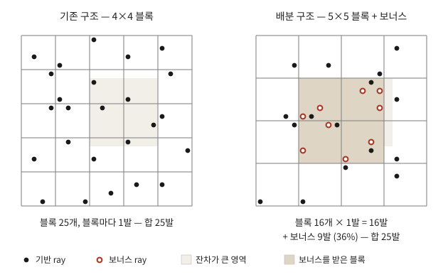

# 오차 기반 ray 배분과 실행 간 변동의 원인

작성일 2026-08-13 · 모진수 · 대상 EVER, bonsai, downsampling 2 (1559×1039 = 1,619,801 픽셀)

---

## 요약

이번 리포트의 핵심 발견은 세 가지다.

### 발견 1 — ray 수를 늘리지 않고 배분만 바꿔 PSNR 을 0.218 dB 올렸고, 그 이득은 전부 오차가 큰 블록을 대상으로 삼은 데서 나온다

step 당 ray 를 100,751 개(1/16)로 고정한 채, 균등하게 뿌리는 대신 잔차가 큰 블록에 더 많이 배정했다. 기준선 31.892 dB 에서 32.110 dB 로 0.218 dB 올랐다 (각 4 회 반복, t = 7.59). t 는 두 조건의 평균 차이를 그 차이의 표준오차로 나눈 값이며, 클수록 차이를 실행 간 변동으로 설명하기 어렵다. 각 조건을 4 회씩 돌린 이번 비교에서는 2 를 넘으면 변동으로 보기 어렵다고 판단했다.

여기서 중요한 것은 대조군이다. 같은 개수의 ray 를 같은 방식으로 균등하게 재배분한 조건은 31.851 dB 로, 기준선보다 **0.041 dB 낮았다** (t = −1.62, 유의하지 않음). 즉 ray 를 불균등하게 재배치하는 것 자체에는 이득이 없고, stratification 의 균일성이 깨진 만큼 손해가 난다. 0.218 dB 는 전부 "어디에 배정하는가" 에서 나온 값이다.

같은 품질을 기존의 방식으로 얻으려면 ray 를 1.78 배 (100,751 → 179,574) 써야 하고 학습 시간이 24.58 분에서 28.16 분으로 늘어난다. 배분 구조는 ray 를 78% 적게 쓰고 시간을 13% 적게 쓰면서 같은 품질에 도달한다.

### 발견 2 — 잔차 EMA 의 계수를 0.3 에서 0.1 로 낮추면 실행 간 변동이 절반 이하로 줄고 품질은 떨어지지 않는다

배분 구조에는 순환 (feedback) 이 있다. 잔차 추정이 ray 배분을 정하고, 배분이 기하를 바꾸고, 바뀐 기하가 다시 잔차를 바꾼다. 균등 표집에는 이 순환이 없다.

배분에 쓰는 점수는 블록마다 최근 잔차를 지수이동평균 (exponentially moving average, EMA) 으로 누적한 값이다.

```
E  ←  (1 − α) · E  +  α · (이번에 관측한 블록 내 평균 잔차)
```

α 가 클수록 최근 관측에 민감하고 작을수록 과거를 오래 평균한다. 기억하는 길이는 대략 1/α 회 갱신이고, 뷰 하나가 평균 255 step 에 한 번 갱신되므로 α = 0.3 은 약 850 step, α = 0.1 은 약 2,550 step 에 해당한다.

α = 0.3 일 때 4 회 반복의 표준편차가 0.084 dB 로, 기준선 0.042 dB 의 2 배였다. α = 0.1 로 낮추자 0.039 dB 가 되어 기준선보다도 낮아졌다. 같은 조작으로 평균은 32.089 dB 에서 32.110 dB 로 올랐다 (차이 +0.021, t = 0.45, 유의하지 않음).

품질과 변동이 교환 관계에 있을 것으로 예상했으나 그렇지 않았다. EMA 가 추정해야 할 값은 "어느 블록이 재구성하기 어려운가" 이고 이것은 장면의 구조라 천천히 변한다. α = 0.3 은 최근 850 step 만 기억하므로 구조보다 학습 궤적의 순간적 요동을 더 많이 담고 있었다. α = 0.1 은 2,550 step 을 평균하여 요동을 걸러낸다.

### 발견 3 — 시드를 고정해도 같은 설정이 재현되지 않으며, 원인은 densification 이 미세한 수치 차이를 이산 선택으로 증폭하는 데 있다

`safe_state` 가 `random`, `numpy`, `torch` 의 시드를 모두 0 으로 고정한다. 그런데도 같은 설정을 두 번 돌리면 3,000 step 시점에 PSNR 이 27.2478 dB 와 27.2369 dB 로, primitive 수가 1,083,368 개와 1,079,739 개로 갈렸다.

원인은 backward 에서 여러 ray 가 같은 primitive 에 gradient 를 atomicAdd 로 누적할 때 더해지는 순서가 실행마다 달라지는 것이다. 부동소수점 덧셈은 결합법칙이 성립하지 않으므로 합이 10⁻⁷ 수준에서 달라진다.

이 미세한 차이가 커지는 곳은 densification 이다. 통계로 순위를 매기고 상한까지 자르는 구조여서, 경계 근처에서는 10⁻⁷ 의 차이가 선택의 뒤바뀜으로 바뀐다. 한 primitive 가 다르게 분열하면 그 영역의 gradient 가 전부 달라지므로 차이가 더 이상 미세하지 않다. densification 은 1,500 step 부터 16,000 step 까지 200 step 간격으로 72 회 실행되므로 이 과정이 72 번 곱해진다.

최종 primitive 수는 안정적이다. 기준선 4 회가 1,388,589 개에서 1,389,996 개로 0.1% 안에 들어온다. `spawn_cap` 이 개수를 고정하기 때문이며, 갈리는 것은 개수가 아니라 어느 primitive 가 선택되느냐다. 개수를 통제해도 변동은 줄지 않는다.

**따라서 단일 실행으로 조건을 비교하면 안 된다.** 이번 리포트의 모든 수치는 4 회 반복의 평균과 표준편차다.

---

### 지난 리포트 (2026-08-12) 로부터

- 지난번에 알아낸 것: EVER 에 sparse ray 를 이식했고, 1/16 에서 품질 손실이 100% 기하 (geometry) 에서 발생하며 외형 (appearance) 은 무관하다는 것을 2×2 분해로 확인했다.
- 그때 몰랐던 것: 손실된 품질을 회복할 방법. ray 수를 늘리는 것 외의 수단이 있는지.
- 이번에 하기로 한 것: 결손이 공간적으로 몰려 있는지 확인하고, 몰려 있다면 그곳에 ray 를 더 배정하는 구조를 만들어 검증한다.

### 합의 사항 → 상태

- **[완료] 결손의 공간 분포 측정** — dense 모델과 1/16 모델의 오차 차이를 4×4 블록 단위로 집계했다. 상위 20% 블록이 결손의 88.6% (test 37 뷰) 를 갖는다. 균등하면 20% 이므로 결손은 강하게 몰려 있다.
- **[완료] 배분 신호 선택** — 후보 6 개를 결손 포착률로 비교했다. sparse 모델 자신의 잔차가 80.9% 로 가장 높았고, 결손을 직접 보는 oracle 이 88.5%, 무작위가 20.1% 였다. 잔차를 채택했다.
- **[완료] 배분 구조 구현과 검증** — 발견 1.
- **[완료] 실행 간 변동의 원인 규명과 처방** — 발견 2, 3.
- **[미착수] 다른 장면에서의 재현** (사유: bonsai 한 장면에서 조건별 4 회씩 총 16 회를 돌리는 데 GPU 시간이 소요되어 이번 리포트에서는 한 장면에 집중했다)

### 다음

- 다른 장면 (bicycle, room, counter) 에서 재현되는지 확인한다. bonsai 는 실내 정물이라 결손이 몰리기 쉬운 조건일 수 있고, 야외 장면은 텍스처가 화면 전체에 깔려 있어 결손 분포가 평평할 가능성이 있다. 🔴 어느 장면을 우선할지 판단 필요
- 보너스 비율 (현재 36%) 과 배분의 뾰족함을 조정한다. 현재는 잔차에 정비례하는 배분만 시험했다.
- α 를 0.05 까지 더 낮췄을 때 변동이 계속 줄어드는지 확인한다.
- MCMC GS에 대해 더 자세히 점검하고 구현구조를 파악한다. 

---

## 1. 실험 설계

step 당 ray 수를 100,751 개로 고정하고 배분 방식만 바꾸는 네 조건을 각 4 회씩 학습했다. 전부 같은 날, 같은 코드, 같은 설정 (SH 차수 3, downsampling 2, 30,000 step, spawn_cap 1,500,000) 이다.

| 조건 | 구성 | 밀도 불균일 | 순환 | 오차 대상 |
|---|---|:---:|:---:|:---:|
| 기준선 | 4×4 블록마다 1 발, 100,751 발 | 없음 | 없음 | 없음 |
| 균등 보너스 | 5×5 블록마다 1 발 (64,377) + 36,374 발을 균등 배분 | 있음 | 없음 | 없음 |
| 중요도 α=0.3 | 5×5 블록마다 1 발 + 36,374 발을 잔차에 비례 배분 | 있음 | 있음 | 있음 |
| 중요도 α=0.1 | 위와 같고 EMA 계수만 0.1 | 있음 | 있음 | 있음 |

균등 보너스 조건은 두 가지를 분리하기 위해 넣었다. 이 조건은 중요도 배분과 같은 밀도 불균일 (어떤 블록은 3 발, 어떤 블록은 1 발) 을 갖지만, 점수 맵이 1 로 고정되어 있어 순환이 없고 오차를 대상으로 삼지도 않는다.

### 배분 방식

20×20 픽셀 영역을 예로 들면 두 구조의 관계가 그대로 드러난다. 4×4 블록으로 나누면 블록이 25 개이고 블록마다 한 발씩 25 발이다. 5×5 블록으로 나누면 블록이 16 개라 기반이 16 발로 줄고, 남는 9 발 (전체의 36%) 을 잔차가 큰 블록에 얹으면 합이 다시 25 발이 된다.



*두 구조의 ray 총량은 같다. 왼쪽은 잔차가 큰 영역 (연한 음영) 을 다른 곳과 똑같이 표집하고, 오른쪽은 그 영역의 블록에 보너스를 배정한다.*

기반 격자를 5×5 로 넓혀 64,377 발을 블록마다 하나씩 배치하고, 남는 36,374 발을 점수에 비례하는 다항 추출 (multinomial) 로 배분한다. 합이 100,751 발로 4×4 균등 표집과 같다.

```
score  = 블록 내 평균 |잔차| 의 EMA
p      = score / Σ score
counts = multinomial(p, 36374, replacement=True)
```

점수 맵은 뷰마다 따로 유지한다 (255 뷰 × 64,377 블록 = 65.7 MB). 학습 시작 전 정답 이미지의 블록 내 밝기 표준편차로 초기화하는데, 이 값이 결손의 57.9% 를 포착하므로 균등하게 시작하는 것보다 나은 출발점이다.

실제 배분 결과는 다음과 같다. 블록의 66.9% 는 보너스를 받지 못하고, 상위 20% 블록이 보너스의 76.9% 를 가져간다. 기반 1 발이 보장되므로 밀도는 상위 20% 블록에서 기준 대비 2.10 배, 나머지에서 0.73 배가 된다.

| 블록당 보너스 | 블록 수 | 비율 |
|---:|---:|---:|
| 0 | 43,083 | 66.9% |
| 1 | 13,034 | 20.2% |
| 2 | 4,516 | 7.0% |
| 3 | 2,013 | 3.1% |
| 4 이상 | 1,731 | 2.7% (최대 11) |

한 블록이 여러 번 뽑혔을 때 같은 픽셀이 중복될 수 있으나, 측정한 중복 비율은 2.90% 로 낭비가 크지 않다.


---

## 2. 결과

| 조건 | PSNR 4 회 | 평균 | 표준편차 | 학습 시간 | 최종 primitive |
|---|---|---:|---:|---:|---:|
| 기준선 4×4 | 31.837 · 31.890 · 31.901 · 31.939 | 31.892 | 0.042 | 23.67 분 | 1,389,622 |
| 균등 보너스 | 31.808 · 31.856 · 31.868 · 31.869 | 31.851 | 0.029 | 24.42 분 | 1,422,000  |
| 중요도 α=0.3 | 31.970 · 32.105 · 32.119 · 32.164 | 32.089 | 0.084 | 24.26 분 | 1,422,708 |
| 중요도 α=0.1 | 32.072 · 32.086 · 32.125 · 32.158 | **32.110** | **0.039** | 24.58 분 | 1,422,000  |
| 1/9 균등 3×3 (1 회, ray 179,574) | 32.090 | 32.090 | — | 28.16 분 | 1,422,096 |

| 비교 | 차이 | 표준오차 | t |
|---|---:|---:|---:|
| 중요도 α=0.1 − 기준선 | +0.218 | 0.029 | +7.59 |
| 중요도 α=0.3 − 기준선 | +0.197 | 0.047 | +4.22 |
| 중요도 α=0.1 − 균등 보너스 | +0.260 | 0.024 | +10.67 |
| 균등 보너스 − 기준선 | −0.041 | 0.025 | −1.62 |
| 중요도 α=0.1 − 중요도 α=0.3 | +0.021 | 0.046 | +0.45 |

기준선 4 회의 최고값이 31.939 dB 이고 중요도 배분 8 회 (α 두 조건 합산) 의 최저값이 31.970 dB 이므로, 두 조건의 분포가 겹치지 않는다.

중요도 배분과 1/9 균등의 최종 primitive 수가 1,422,708 개와 1,422,096 개로 사실상 같다. ray 수가 1.78 배 다른데 기하의 규모가 일치한다. 배분 구조가 ray 를 늘린 것과 같은 densification 결과를 만들었다는 뜻으로 읽을 수 있다.

### 속도

중요도 배분은 기준선보다 3.8% 느리다 (23.67 분 → 24.58 분). 균등 보너스도 24.42 분으로 비슷하므로, 이 비용은 오차를 대상으로 삼는 부분이 아니라 기반 격자를 5×5 로 넓히고 보너스를 얹는 구조 자체에서 나온다.

비용의 출처는 ray 의 배열 순서다. 렌더러는 ray 하나에 thread 하나를 배정하고 thread 32 개를 warp 로 묶어 실행하므로, 목록에서 이웃한 ray 가 화면에서도 가까워야 BVH 순회 (traversal) 가 공유된다. 

보너스를 목록 뒤에 별도 블록으로 붙이면 기준선 대비 5.9% 느리고, 그 블록을 화면 순서로 정렬하면 3.7%, 기반과 합쳐 블록 번호 순으로 정렬하면 −0.7% 로 초과 비용이 사라진다 (같은 모델에서 조건을 번갈아 재어 표류를 상쇄한 측정). 

블록의 66.9% 가 보너스를 받지 못하므로 보너스만 정렬하면 빈 구간을 건너뛰는 도약이 남고, 합쳐서 정렬하면 모든 블록이 기반 1 발을 갖고 있어 도약이 없어진다. 최종 구현은 합쳐서 정렬하는 방식을 쓴다.

---

## 3. 오차 큰 픽셀의 위치와 그것을 찾는 신호

### 공간 분포

dense 모델과 1/16 모델을 같은 뷰에서 렌더링하여 픽셀별 제곱오차의 차이를 구하고 블록 단위로 집계했다.

| 블록 크기 | 상위 20% 가 갖는 결손 | 상위 20% 가 갖는 dense 오차 |
|---|---:|---:|
| 4×4 | 88.6% | 80.2% |
| 16×16 | 81.7% | 74.8% |
| 32×32 | 77.1% | 71.7% |

균등하면 20% 이므로 결손은 강하게 몰려 있다. 블록이 커질수록 집중도가 낮아지므로 결손의 구조는 작은 블록에 있다. TurboGS 가 쓰는 16×16 tile 단위는 이 구조에는 지나치게 크다.

뷰 단위로도 균일하지 않다. test 37 뷰에서 뷰별 PSNR 격차의 평균이 0.677 dB, 표준편차가 0.527 dB 이고, 10 분위와 90 분위가 0.245 dB 와 1.109 dB 다. sparse 모델이 오히려 1.165 dB 나은 뷰도 있다.

### 배분 신호의 선택

학습 중에 계산할 수 있는 후보 여섯 가지를 결손 포착률로 비교했다. 신호로 상위 20% 블록을 고르고 그 블록들이 전체 결손의 몇 퍼센트를 덮는지 잰 값이다 (train 80 뷰, 4×4 블록).

| 신호 | 덮는 결손 |
|---|---:|
| oracle (결손을 직접 봄) | 88.5% |
| **sparse 모델 자신의 잔차** | **80.9%** |
| 블록 내 잔차 표준편차 (Neyman 배분) | 74.2% |
| dense 모델의 오차 (대조군) | 64.3% |
| 정답 이미지의 텍스처 | 57.9% |
| 렌더 결과의 텍스처 | 56.1% |
| 무작위 | 20.1% |

잔차가 80.9% 로 상한 (88.5%) 에 가장 가깝다. 대조군을 함께 잰 이유는, 오차라는 양이 원래 몰려 있으므로 결손과 무관한 신호로도 상당한 포착률이 나올 수 있기 때문이다. dense 모델의 오차는 sparse 가 무엇을 망가뜨렸는지 전혀 모르는 신호인데도 64.3% 를 덮는다. 무작위와 oracle 사이 구간으로 환산하면 잔차가 88.9%, 대조군이 64.6% 이므로, 잔차의 성능 중 약 3 분의 1 이 결손의 위치를 실제로 찾아낸 몫이다.

이론적으로 근거가 있는 Neyman 배분 (블록 내 표준편차에 비례) 이 단순 잔차보다 낮았다. 배분 규칙은 이론에서 고르기보다 측정으로 고르는 편이 나았다.

---

## 4. 다중 뷰 표집을 채택하지 않은 이유

한 step 에 뷰를 여러 장 뽑으면 gradient 의 뷰 간 분산이 뷰 수에 반비례하여 줄어든다. TurboGS 는 이 방법으로 뷰 1 장에서 3 장으로 늘려 PSNR 을 0.73 dB 올렸다고 보고한다.

EVER 에서 gradient 분산을 뷰 내 성분과 뷰 간 성분으로 분해했다. 같은 뷰에서 독립적인 두 ray 집합을 뽑아 gradient 차이의 제곱을 재면 뷰 내 성분이 나오고, 서로 다른 뷰에서 뽑아 같은 양을 재면 두 성분의 합이 나온다.

| 블록 | ray | 뷰 내 | 뷰 간 | 뷰 간 비중 |
|---|---:|---:|---:|---:|
| 8×8 | 25,026 | 5.67e-2 | 1.74e-4 | 0.3% |
| 4×4 | 100,751 | 1.78e-2 | 1.08e-4 | 0.6% |
| 2×2 | 404,301 | 3.55e-3 | 1.35e-3 | 27.6% |

뷰 내 성분이 ray 수에 반비례하여 줄어드는 것은 확인된다. 뷰 간 성분은 ray 수와 무관해야 하므로 세 값 중 가장 잘 분해되는 2×2 의 1.35e-3 을 참값으로 보아야 한다 (8×8 과 4×4 에서는 뷰 내 성분이 165 배 이상 커서 두 값의 차이로 구하는 추정이 측정 오차보다 작아 구분되지 않는다). 이 값을 1/16 에 적용하면 뷰 간 비중이 7.1% 이고, 뷰를 4 장으로 늘렸을 때 분산이 5.3%, 표준편차가 2.7% 줄어든다.

EVER 의 gradient noise 는 3DGRT 보다 4.3 배 크지만, 그 초과분이 뷰 내부에 있다. 뷰를 늘려서 줄일 수 있는 성분이 거의 없으므로 이 방향은 채택하지 않았다.

---


## 5. 한계

- 장면이 bonsai 하나다. 다른 씬에서 재현되는지 확인해야 한다. 
- α = 0.3 과 0.1에서 0.1의 품질이 좋은 것도 다른 씬에서도 적용되는 부분인지 확ㅇ니해야 한다. 
- 배분 규칙은 잔차에 정비례하는 형태만 시험했다. 지수를 두어 뾰족함을 조절하는 방식은 시험하지 않았다.
- 보너스 비율 36% 는 TurboGS 가 보고한 최적값 0.4 에 맞춘 값이며, 우리 구조에서 최적인지는 확인하지 않았다.
