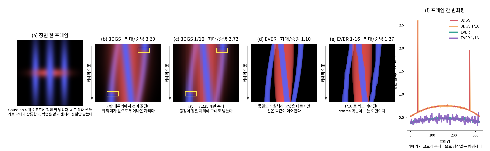
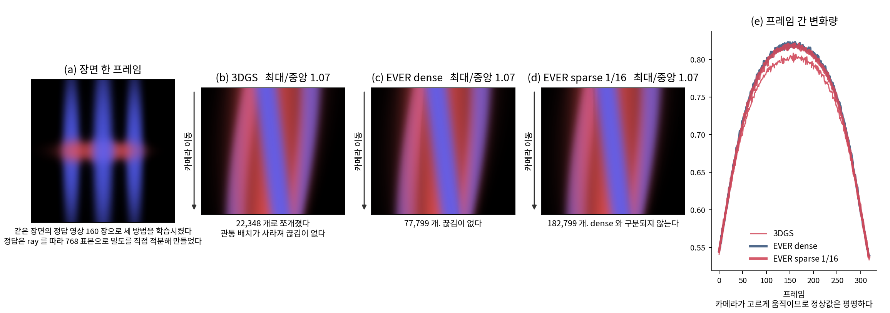
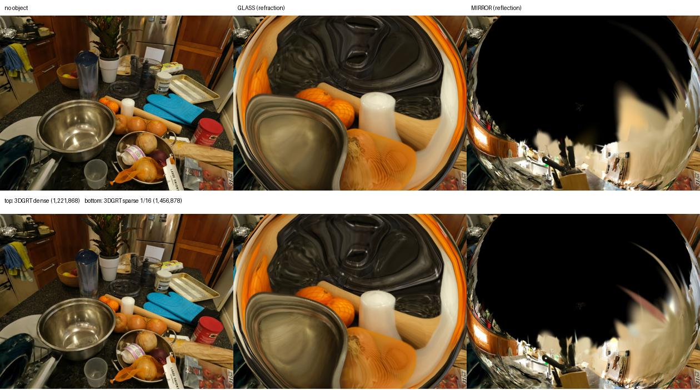

# Ray 기반 renderer의 다중 view 학습 — rasterizer 및 EMVT와의 비교

작성일 2026-08-25 · 모진수

## 요약

교수님 피드백에 따라 다음 내용을 정리했다. Ray 기반 renderer인 3DGRT와 EVER가
rasterizer 기반 3DGS 및 3DGUT보다 지원 범위가 넓은 기능, sparse 학습 후 해당 기능의
유지 여부, EMVT(arXiv 2506.12727)와의 차이, 2026-08-13 리포트의 다중 view 판정과 현재
결과의 관계, gradient 방향 편향 가설의 검증 방법을 다룬다.

### 발견 1 — 3DGRT는 stochastic Ray sampling을 지원하며 논문에서도 이를 학습에 적용했다

서론에 다음 문장이 있다.

> "rasterization cannot sample rays stochastically, a common practice for training
> in computer vision."

4.4 절이 이유를 적는다. differentiable rasterization 은 이미지 또는 tile 단위로만
효율적으로 렌더링하므로 픽셀 집합에 대한 stochastic optimization 이 성립하지 않는다.
sparse 학습이 Ray 기반에서만 가능하다는 근거가 원논문에 있다.

같은 논문이 부록 A 에서 그 실험을 했다.

> "For experiments with random-rays, during the last 15,000 iterations, we sample
> random rays across all training views with a batch size of 2^19 = 524,288, and
> only use the L1 loss to supervise the particles."

이 실험은 densification 종료 이후에 여러 view의 Ray를 무작위로 sampling하며, 2D grid가
유지되지 않아 L1 loss만 사용한다. 논문 §4.4도 SSIM과 같은 window 기반 loss를 사용할 수
없다고 설명한다. 우리는 block마다 픽셀 하나를 sampling한 뒤 view별 2D grid를 유지하여
SSIM을 계산한다. Step당 Ray 수는 101,400개로 원논문의 524,288개 중 19%다.

### 발견 2 — EMVT의 전체 다중 view rendering은 제안 방법보다 2.5배 느렸고, 3DGRT에서 view 수 증가에 따른 시간 증가는 1.22배였다

논문이 보고한 MipNeRF-360 학습 시간이다.

| 방식 | 시간 |
|---|---:|
| 전체 다중 view 렌더링 | 127 분 |
| 기존 부분 렌더링 | 105 분 |
| EMVT 제안 (tile 혼합 배치) | **50 분** |

4개 view를 각각 전체 rendering하면 127분이 걸리고, 하나의 tile에 여러 view의 픽셀을
배치하는 EMVT를 적용하면 50분이 걸린다. EMVT의 부분 rendering 구조는 전체 다중 view
rendering 대비 학습 시간을 2.5배 단축한다.

3DGRT counter의 15000~30000 step에서 K=1은 18분, K=4는 22분으로 1.22배 차이가 났다.
별도로 측정한 step 시간은 1.48배 차이였으나, 전체 학습에는 optimizer 등 Ray 수와
무관한 비용이 포함되어 증가율이 1.22배로 감소했다.

### 발견 3 — 2026-08-13 리포트는 position gradient만 보고 다중 view를 기각했지만 다른 parameter의 view 간 variance 비중은 84~98%였다

당시 리포트는 EVER의 gradient variance를 view 내부와 view 간 성분으로 분해하여 view 간 비중이 7.1%라고
보고하고, 뷰를 4 장으로 늘려도 표준편차가 2.7% 줄어드는 데 그치므로 기각했다.

기존 표에는 `_xyz`만 포함됐지만 원본 JSON에는 다른 parameter의 측정값도 저장되어
있었다. 다음은 block 4 조건에서 Ray 100,751개를 사용한 결과다.

| parameter | view 내부 | view 간 | view 간 비중 |
|---|---:|---:|---:|
| `_xyz` (위치) | 1.776e-02 | 0.000 | **0.0%** |
| `_opacity` (밀도) | 6.833e-07 | 3.568e-06 | **83.9%** |
| `_scaling` | 7.869e-07 | 5.579e-06 | **87.6%** |
| `_rotation` | 8.292e-06 | 7.368e-05 | **89.9%** |
| `_features_dc` (색) | 2.705e-08 | 1.549e-06 | **98.3%** |

Position gradient의 view 간 variance 비중은 0%였고, 나머지 parameter는 모두 84%
이상이었다. 따라서 다중 view로 감소시킬 수 있는 variance는 position gradient보다
다른 parameter에서 크다.

### 발견 4 — 3DGRT의 density gradient 방향 일치도는 K가 증가할 때 2.4배 높아졌다

counter의 15,000 checkpoint에서 Gaussian을 고정하고 전체 Ray 수를 101,400개로
유지했다. K를 1, 2, 4, 8, 16으로 변경하며 variance decomposition과 cosine similarity를
같은 실행에서 측정했다. Reference gradient는 32개 view를 full-Ray로 rendering하여
계산했으며, 각 K에서 12회 반복했다.

| K | 블록 | view 오차(밀도) | Ray 오차(밀도) | cos(밀도) | cos(위치) |
|---:|---:|---:|---:|---:|---:|
| 1 | 4 | 2.027e-04 | 1.044e-04 | **0.2018** | 0.1466 |
| 2 | 6 | 1.302e-04 | 1.013e-04 | 0.2408 | 0.1211 |
| 4 | 8 | 9.741e-05 | 9.763e-05 | **0.3461** | 0.1487 |
| 8 | 11 | 6.212e-05 | 8.722e-05 | 0.4058 | 0.1610 |
| 16 | 16 | 3.716e-05 | 8.344e-05 | **0.4857** | 0.1492 |

Density gradient의 cosine similarity는 0.2018에서 0.4857로 2.4배 증가했다. 따라서
다중 view 적용은 density gradient의 variance뿐 아니라 reference gradient에 대한 방향
오차도 감소시켰다.

Position gradient의 cosine similarity는 0.1466에서 0.1492로 0.0026 증가했다. View
sampling error는 4.693e-02에서 7.882e-03으로 감소했지만 방향 일치도는 개선되지 않았다.

`view 오차² ≈ A/K`, `Ray 오차² ≈ B·K` 로 맞춰 최적 K 를 구하면 다음과 같다.

| 성분 | A (view) | B (Ray) | A/B | 최적 K* |
|---|---:|---:|---:|---:|
| 위치 | 1.685e-03 | 8.357e-04 | 2.0 | **1.4** |
| 밀도 | 3.389e-08 | 2.383e-09 | 14.2 | **3.8** |

Density gradient의 최적값은 K*=3.8로 현재 설정 K=4와 일치했다. Position gradient의
최적값은 K*=1.4였다. 따라서 parameter별 최적 view 수가 다르다.

---

### 지난 리포트 (2026-08-24) 로부터
- 지난번까지 알아낸 것: EMVT가 고정 예산 다중 view 학습을 이미 제안했다. 원문을 다시 확인한 결과, 우리 통계량은 식 13·14가 아니라 **식 13과 식 12**에 대응한다. 식 14는 별도의 세 번째 통계량이다(§4.4). Jensen·convexity·bias는 원문에서 언급되지 않는다.
- 그때 몰랐던 것: rasterizer와 Ray tracing의 비용 차이, Ray 기반 renderer의 기능이 sparse 학습 후에도 유지되는지, 2026-08-13 판정과 현재 결과의 관계.
- 이번에 하기로 한 것: 원논문에서 근거를 찾아 대조표를 채우고, 충돌을 정리하고, 남은 가설의 검증을 설계한다.

### 합의 사항 → 상태
- **[완료] EMVT 대조표 5 개 항목** — 4 절에 정리했다.
- **[완료] 3DGRT 의 rasterizer 대비 능력 조사** — 원논문 기여 목록, 4.4 절, 부록 A 에서 확인했다.
- **[완료] EVER 의 기여 조사** — 포핑 제거, 어안·왜곡 렌즈, 겹침 무제한 정확 합성, defocus blur 네 가지다.
- **[완료] 어안 sparse 검증** — nyc 에서 dense 대비 0.296 dB 손실이다. 렌더러에 sparse 어안 경로가 없어 직접 추가해야 했다.
- **[완료] 2026-08-13 결론과의 관계 정리** — 대상 렌더러가 다르다. EVER 에서는 그 결론이 지금도 유효하다.
- **[완료] 다중 view 시작 시점 정의** — `strategy.densify.end_iteration`을 사용해야 하며 EVER의 설정값은 16,000이다.
- **[완료] 3DGRT 의 분산 분해와 방향 일치도** — 예산 101,400 Ray 고정, K 1~16, 12 회 반복. 밀도의 최적 K 가 3.8, 위치가 1.4 다.
- **[완료] 방향 편향 교정 가설의 입증** — 밀도에서 지지되고 위치에서 기각된다. 코사인이 밀도는 0.2018→0.4857, 위치는 0.1466→0.1492 다.
- **[완료] EVER 동일 조건 재측정** — bonsai에서 Ray 예산을 고정하고 K를 변경했다. 최적 K*는 position 0.9, density 2.9, scale 3.8, color 5.9였다.
- **[완료] 포핑 sparse 검증** — EPI 정성과 FLIP 정량 모두 sparse 가 나빠지지 않는다. FLIP7 이 dense 0.01282, sparse 0.00865 다.
- **[완료] Secondary-Ray sparse 검증** — 굴절과 반사에서 dense-sparse 차이가 1~2% 범위였다.

### 다음
- **Position gradient가 다중 view에 반응하지 않는 원인을 확인한다.** 두 renderer에서 공통으로 나타났으므로 구현 외의 원인도 검토해야 한다.
- **다중 view 시작 시점을 densification 종료 설정에서 읽도록 변경한다.**

---

## 1. Ray 기반 renderer와 rasterizer의 기능 비교

3DGRT 와 EVER 원논문에서 정리했다.

| 능력 | 3DGS | 3DGUT | 3DGRT | EVER |
|---|---|---|---|---|
| stochastic Ray sampling | 불가 | 불가 | 가능 | 가능 |
| fisheye·고왜곡 camera | 불가 | 가능 | 가능 | 가능 |
| rolling shutter | 불가 | 가능 | 가능 | 가능 |
| secondary Ray(그림자·반사·굴절) | 불가 | 불가 | 가능 | 가능 |
| depth of field | 불가 | 미확인 | 가능 | 가능 |
| 겹침 무제한 정확 합성 | 불가 | 불가 | 불가 | 가능 |
| popping 방지 | 불가 | 부분 | 부분 | 가능 |
| rendering 속도 | 가장 빠름 | 중간 | rasterizer의 약 1/3 | 미측정 |

3DGRT 는 "secondary ray effects like shadows and reflections, rendering from cameras
with high distortion and rolling shutter, training with stochastically sampled rays"
를 기여로 든다.

EVER 는 3DGS 의 근사 정렬과 3DGRT·StopThePop 의 겹침 무시를 문제로 지적하고, 상수
밀도 타원체로 표현해 겹침이 얼마나 많아도 볼륨 렌더링 방정식을 정확히 계산한다고
주장한다. 포핑이 없는 것은 그 결과이지 별도 기법이 아니다.

Ray 기반 renderer의 대표적인 단점은 실행 시간이다. 3DGRT 논문에서 pinhole rendering
속도는 78 FPS로, 3DGS rasterization의 238 FPS보다 약 3배 느렸다. Sparse 학습은 training
Ray 수를 줄여 이 비용을 낮추는 것을 목표로 한다. 그러나 2026-08-25 측정 결과, 속도 향상은
해상도에 따라 달랐다. Full-image Ray 수와 Gaussian 수의 비가 1보다 작아지면 Gaussian
처리 비용의 비중이 커져 Ray 수 감소에 따른 시간 단축이 제한됐다.

## 2. Sparse 학습 후 Ray 기반 기능 유지 여부

| 능력 | 검증 | 결과 |
|---|---|---|
| stochastic Ray sampling | 제안 방법 자체 | 적용됨 |
| fisheye | EVER nyc, 1/16 | dense 27.593 → sparse 27.297 (−0.296 dB) |
| popping | 손배치 통제 scene | **최대/중앙 비: 3DGS 3.69, 3DGRT 1.08, EVER 1.10 (§2.1.1)** |
| popping | 통제 scene 학습 | **세 조건 모두 최대/중앙 비 1.07 (§2.1.2)** 🔴 |
| popping | EVER bonsai, 궤도 EPI | **최대/중앙 비: sparse 1.22, dense 1.27 (§2.1.3)** |
| popping | bonsai 3DGS 대조 | **EVER 대비 증가가 측정되지 않음 (§2.1.3)** 🔴 |
| popping | FLIP7 | **sparse 0.00865, dense 0.01282 (§2.2)** |
| secondary Ray | 3DGRT counter, playground | **유지됨(§2.3)** |


### 2.1 EPI를 이용한 popping 평가

평가는 세 단계로 구성했다. 먼저 통제된 scene에서 rasterization의 depth ordering
오차를 확인했다. 이어서 같은 scene을 학습한 결과와 실제 scene의 결과를 평가했다.

Epipolar plane image(EPI)는 camera trajectory의 각 frame에서 같은 scanline을 추출하여
세로로 쌓은 영상이다. 세로축은 camera 위치, 가로축은 image 위치를 나타낸다. 동일한 3D
point의 투영 위치는 EPI에서 선으로 나타난다. Viewpoint에 따른 rendering이 연속적이면
선도 연속적으로 나타나며, compositing order가 불연속적으로 바뀌면 선이 끊기거나 계단 형태가
나타난다.

Frame 간 mean absolute difference를 측정했다. Camera가 일정하게 이동하므로 연속적인
rendering에서는 이 값도 일정하게 변한다. Popping이 발생한 frame에서는 값이 급증한다.
조건별 sharpness 차이를 정규화하기 위해 최댓값과 중앙값의 비를 사용했다. 비율이 1에
가까울수록 viewpoint에 따른 변화가 균일하다.

#### 2.1.1 손으로 배치한 scene에서의 rasterization ordering error



3DGS는 Gaussian을 screen space의 2D ellipse로 투영한 뒤 **Gaussian center의 depth**를
기준으로 정렬하여 front-to-back alpha compositing을 수행한다. 두 Gaussian이 공간에서
교차하면 올바른 compositing order가 Ray마다 달라지지만, 3DGS는 Gaussian당 하나의 depth
값을 사용하므로 일부 Ray에서 ordering error가 발생한다.

두 center의 depth order는 **view direction이 두 center를 연결하는 vector와 수직이 되는
각도**에서 반전된다. 이 각도를 통과할 때 compositing order가 불연속적으로 변경되어
popping이 발생한다. Ray tracing은 Ray별 intersection depth를 기준으로 정렬한다.

그림은 같은 scene을 full-Ray와 **1/16 Ray casting** 조건으로 각각 rendering한 결과다.
1/16 은 우리 sparse 학습이 실제로 쓰는 표집률이다.

Ordering error를 확인하기 위해 서로 교차하는 큰 primitive 4개를 직접 배치했다. 크기
`0.115×0.95×0.115`의 세로 방향 파란 primitive 3개와 크기
`0.50×0.125×0.125`의 가로 방향 빨간 primitive 1개를 교차시켰다. 각 primitive pair의
상대 위치가 달라 depth order가 반전되는 camera angle도 다르다. Camera는 원점을 중심으로
54도 이동했다. 학습 없이 동일한 primitive와 trajectory를 renderer별로 비교했다.

| | Ray / 프레임 | 프레임 간 변화 중앙 | 최대 | 최대/중앙 | 중앙의 2 배를 넘는 프레임 |
|---|---:|---:|---:|---:|---:|
| **3DGS** | 115,600 | 0.00070 | 0.00258 | **3.69** | 2 / 319 |
| **3DGS 1/16** | 7,225 | 0.00070 | 0.00260 | **3.73** | 2 / 319 |
| EVER | 115,600 | 0.00045 | 0.00050 | **1.10** | 0 / 319 |
| EVER 1/16 | 7,225 | 0.00044 | 0.00061 | **1.37** | 0 / 319 |
| (참고) 3DGRT | 115,600 | 0.00071 | 0.00076 | **1.08** | 0 / 319 |

3DGS는 depth order가 반전되는 두 frame에서 최대/중앙 비가 3.69로 증가했다. Figure (b)의
노란 상자에서 뒤쪽의 파란 primitive가 빨간 primitive 앞으로 불연속적으로 이동한다.
EVER와 3DGRT의 EPI는 같은 구간에서 연속적이다. Frame 간 변화의 중앙값은 3DGS 0.00070,
3DGRT 0.00071로 비슷했고, depth order가 반전되지 않는 frame에서 두 결과의 mean absolute
difference는 0.0032였다.

1/16 Ray 조건에서도 같은 두 frame의 discontinuity가 검출됐다. Ray 수를 115,600개에서
7,225개로 줄였을 때 3DGS의 최대/중앙 비는 3.69에서 3.73으로 변했고, 임계값을 초과한
frame 수는 모두 2개였다. 매 frame에서 grid를 다시 sampling한 조건도 3.67이었다. 따라서
이 통제 scene에서는 sparse sampling noise로 인해 popping signal이 검출되지 않는 문제가
나타나지 않았다.

EVER 1/16의 최대/중앙 비는 1.10에서 1.37로 증가했다. Constant-density ellipsoid의
경계에서 sampling 위치에 따른 픽셀 변화가 발생했지만, 3DGS의 3.73보다 낮았다.

EVER 의 그림이 다르게 보이는 것은 같은 파라미터를 **등밀도 타원체**로 해석하기 때문이다.
Gaussian 이 아니므로 경계가 뚜렷하다. 여기서 볼 것은 모양이 아니라 선의 연속성이다.

**구현 참고.** 3DGS 는 원본 저장소의 `diff_gaussian_rasterization` 을 그대로 썼다. 손배치
장면을 3DGS 가 읽는 PLY 로 내보내 (`opacity` 는 logit, `scale` 은 log, 색은 SH 0 차 계수)
같은 자세로 렌더했다. 3DGRT 는 kernel 을 degree 2 로 맞췄다 — 기본값 degree 4 는 3DGS 의
진짜 Gaussian 보다 넓게 퍼지는데, degree 2 로 두면 단일 Gaussian 의 반치폭 36px 와 0.02
초과폭 86px 이 두 구현에서 정확히 같아진다.

#### 2.1.2 학습 후 densification에 따른 popping 감소 🔴



같은 scene의 reference image 160장을 생성하여 세 방법을 각각 학습했다. 특정 renderer에
유리한 reference를 피하기 위해 **Ray당 768개 sample로 density를 직접 적분**했다. 이는
Gaussian mixture의 volume-rendering equation을 수치 적분한 결과이므로 각 renderer는 같은
reference를 근사한다.

| | primitive | 학습 시간 | 프레임 간 변화 중앙 | 최대 | 최대/중앙 |
|---|---:|---:|---:|---:|---:|
| 3DGS | 22,348 | 91 초 | 0.00076 | 0.00081 | **1.07** |
| EVER dense | 77,799 | 1,719 초 | 0.00077 | 0.00082 | **1.07** |
| **EVER sparse 1/16** | 182,799 | **691 초** | 0.00077 | 0.00082 | **1.07** |

세 조건의 최대/중앙 비는 모두 1.07이었다. 3DGS는 학습 과정에서 4개 primitive를
22,348개 Gaussian으로 densify했다. Gaussian scale이 감소하면서 primitive 간 교차가
줄고 center-depth ordering도 안정됐다. EPI의 mean absolute difference는 3DGS와 EVER
dense 사이 0.0024, EVER dense와 sparse 사이 0.0019였다.

따라서 §2.1.1은 3DGS의 ordering error가 발생하는 조건을 보여주지만, 학습된 3DGS의
일반적인 popping 크기를 나타내지는 않는다. 이 통제 실험에서는 크고 서로 교차하는
primitive 수가 적을 때 popping이 발생했으며, densification 이후에는 측정되지 않았다.

EVER sparse 1/16과 dense 조건의 최대/중앙 비는 모두 1.07이었고 EPI 차이는 0.0019였다.
학습 시간은 sparse 691초, dense 1,719초로 sparse가 2.5배 짧았다. Primitive 수는 sparse
182,799개, dense 77,799개로 sparse가 2.35배 많았다. RADC를 적용하지 않아 Jensen
inflation에 따른 Gaussian 수 증가가 나타났다.


### 2.2 FLIP을 이용한 popping 정량 평가

StopThePop 저자들의 `PoppingDetection` 도구를 그대로 썼다. RAFT (`raft-sintel.pth`) 로
연속 프레임 사이의 광학 흐름을 추정해 카메라 이동에서 오는 정상적인 변화를 상쇄하고,
optical flow로 정렬한 뒤 남은 차이를 FLIP으로 측정한다. 아래 표는 trajectory 변경 전에
측정한 결과이므로 §2.1.3과 조건이 다르다. Training camera 0번과 8번을 직선 보간한
120 frame을 사용했다. 촬영 궤도 기반 결과와 3DGS 비교는 §2.1.3에 제시했다.

| | FLIP1 | FLIP7 | MSE1 | MSE7 |
|---|---:|---:|---:|---:|
| EVER dense | 0.00513 | 0.01282 | 0.00112 | 0.00871 |
| EVER sparse 1/16 | **0.00393** | **0.00865** | 0.00107 | 0.00841 |

Sparse의 FLIP7과 FLIP1은 dense보다 각각 32%, 23% 낮았다. 다만 sparse 결과의
sharpness가 더 낮아서 발생한 차이일 가능성은 확인하지 않았다.

논문에 보고된 FLIP7 값은 재현되지 않았다. 논문은 Mip-NeRF 360 실내에서 EVER의 FLIP7을
0.0000 으로 보고하는데 우리 dense 는 0.01282 로 3DGS 의 0.0149 에 가깝다. 반면 FLIP1 은
논문이 EVER 를 0.0031~0.0076 으로 보고하고 우리 dense 가 0.00513 으로 그 범위 안이다.
FLIP1은 논문의 범위 안에 있었지만 FLIP7은 차이가 있었다.

원인 후보가 셋이다. 논문은 데이터셋 전체 평균이고 우리는 bonsai 한 씬이다. 궤적이
다르다 — 논문은 궤적을 명시하지 않았고 우리는 학습 카메라 0 번과 8 번 사이를 직선
보간했으며 그 길이가 2.485 다. 프레임 간 이동이 크면 step=7 에서 광학 흐름이 따라가지
못하고 그 잔차가 FLIP 으로 잡힌다. RAFT 가중치도 다를 수 있다.


### 2.3 Sparse 학습 후 secondary-Ray 효과 유지 여부

3DGRT 논문은 rasterizer와 구분되는 기능으로 secondary-Ray effect를 제시한다.
`threedgrut_playground`에서 counter scene에 sphere를 삽입하고 material을 GLASS와
MIRROR로 변경하여 rendering했다. 

Training view 0번을 사용하고 sphere는 camera 앞 0.8 거리에 배치했다. 

Dense checkpoint (1,221,868 개) 와 1/16 sparse checkpoint (1,456,878 개) 를 같은 설정으로
비교했다.



GLASS material에서는 sphere 뒤의 scene이 굴절됐고, MIRROR material에서는 camera
반대 방향의 scene이 반사됐다. 두 효과 모두 secondary Ray를 Gaussian scene에 다시
casting하여 계산한다.

| 조건 | 유리구 (물체 없음 대비) | 거울구 (물체 없음 대비) | 유리 vs 거울 |
|---|---:|---:|---:|
| dense | 52.44 (90.4% 픽셀) | 61.41 (91.6%) | 60.36 |
| sparse 1/16 | 52.60 (90.5%) | 62.22 (91.9%) | 61.82 |

세 측정값의 dense-sparse 차이는 1~2% 범위였다. 따라서 sparse 학습 후에도
secondary-Ray rendering 결과가 유지됐다.

굴절과 반사는 서로 다른 Ray path를 사용하므로 GLASS와 MIRROR 결과의 차이를 함께
측정했다. 두 material 간 차이는 dense 60.36, sparse 61.82로 나타나 material별
secondary-Ray path가 서로 다르게 계산됨을 확인했다.

어안은 성립하지만 **두 기능이 동시에 동작하도록 구현되어 있지 않았다.**
`gaussian_renderer/ever.py` 의 `camera2sampled_rays` 가 핀홀 언프로젝션만 지원해
`NotImplementedError` 로 막혀 있었다. 전체 프레임 경로와 같은 zip-NeRF 왜곡 모델에
표집된 픽셀 좌표만 넘기는 분기를 추가했고, 500 개 픽셀에서 원점과 방향 최대 오차가
0.0 임을 확인했다.

이것 자체가 결과다. **렌더러가 어안과 sparse 를 각각 지원해도 조합은 별도 작업이었다.**

## 3. Ray tracing과 rasterization의 다중 view 비용 구조

교수님 피드백의 핵심은 Gaussian을 view에 투영하는 rasterizer와 Ray casting 기반
renderer의 비용 구조가 다중 view에서 어떻게 달라지는지 확인하는 것이다.

두 방식의 비용 구조가 다르다.

Rasterizer는 view마다 Gaussian projection과 sorting을 수행한다. 이 비용은 선택한 픽셀
수뿐 아니라 Gaussian 수에도 의존한다. K개 view를 각각 rendering하면 projection과
sorting도 K회 수행되므로, view당 픽셀 수를 1/K로 줄여도 해당 비용은 같은 비율로
감소하지 않는다. EMVT는 이를 줄이기 위해 하나의 tile에 여러 view의 픽셀을 배치한다.

Ray tracing은 입력 Ray별로 acceleration structure를 traversal한다. Ray origin과
direction이 주어지므로 여러 view의 Ray를 같은 batch에서 처리할 수 있다. K를 늘려도
Gaussian을 view별로 projection하는 비용은 발생하지 않는다.

실측이 이를 지지한다. EMVT 는 장치 없이 2.5 배(127 분 대 50 분), 우리는 1.22 배다.
남는 1.22 배는 Ray 가 여러 view 로 분산되어 가속 구조 탐색 순서가 덜 규칙적인 데서
온다.

낮은 추가 비용이 곧 PSNR 개선을 보장하지는 않는다. EVER의 개선 폭은 0.085 dB,
3DGRT는 0.208~0.353 dB로 renderer에 따라 달랐다. 따라서 구조적 장점은 고정 Ray 예산을
여러 view에 배분하기 쉽다는 점이며, 품질 개선 폭은 gradient noise 특성을 별도로
분석해야 한다.

## 4. EMVT 대조표

교수님이 지시한 다섯 항목이다.

### 4.1 렌더링 백엔드 및 구현 방식

| | EMVT | 우리 |
|---|---|---|
| 백엔드 | rasterizer (3DGS) | ray tracer (3DGRT, EVER) |
| 다중 view 구현 | 하나의 tile에 여러 view의 픽셀을 배치하고 index array로 지정 | casting할 Ray 집합을 구성 |
| 렌더러 수정 | 필요 (논문의 상당 부분) | 불필요 (표집 함수 하나) |

### 4.2 고정 예산 분배 시 연산 비용

교수님 피드백에서는 K개 view에 예산을 분배할 때 Gaussian projection 비용이 K에 따라
증가하는지 확인하도록 했다.

논문의 학습 시간 표가 답이다. 전체 다중 view 렌더링 127 분, EMVT 제안 50 분이다.
**혼합 배치 장치가 없으면 2.5 배가 든다.** K=4 에서 정확히 4 배가 아닌 것은 투영·정렬
외에 view 와 무관한 비용이 섞이기 때문으로 보인다.

우리는 투영 고정비가 없다. 3DGRT 실측 1.22 배이고, 그 증가분은 투영이 아니라 가속 구조
탐색 지역성에서 온다.

### 4.3 다중 view 적용 구간

| | EMVT | 우리 |
|---|---|---|
| 구간 | 전 학습 구간 | densification 종료 이후 |
| 각 iteration 의 view 수 | 4 개 고정 | 4 개 (K 절제 미실시) |
| 이유 | 명시 없음 | 다중 view가 densification 통계량의 inflation을 17~21% 증가시킴 |

EMVT 는 전 구간에 적용하므로 densification 기준을 새로 정의해야 했다. 우리는 종료
이후에만 적용하므로 그 문제가 발생하지 않는다.

### 4.4 densification 통계량 처리 방식 — EMVT 식 12·13·14 

이 절은 EMVT 원문(arXiv 2506.12727v2) 5.2 절과 부록 8.2의 식이 우리의 파이프라인과 유사하다고 파악되어 정리한다.

#### 4.4.1 식 12·13·14의 정의

기호는 논문 그대로다. `G` 는 Gaussian 하나, `{p_i}` 는 그 Gaussian 이 덮는 픽셀들,
`V_{p_i}` 는 픽셀 `p_i` 가 속한 viewpoint, `N` 은 한 iteration 의 viewpoint 수,
`∇_{p_i} L` 은 그 픽셀에서 온 **2D 화면 공간 위치 gradient** 다.

**식 12 — 기존 ADC 가 쓰는 값.**

```
E_old(G) = ‖ Σ_{k=1..N} Σ_{V_pi = k} ∇_pi L ‖₂
```

모든 viewpoint의 픽셀 gradient vector를 합산한 뒤 L2 norm을 한 번 계산한다.
단일 view 학습에서는 `N = 1` 이므로 원래 3DGS 의 기준과 같다.

**식 13 — E1.**

```
E_1(G) = Σ_{k=1..N} Σ_{V_pi = k} ‖ ∇_pi L ‖₂
```

픽셀마다 L2 norm을 먼저 계산한 뒤 합산한다.

**식 14 — E2.**

```
E_2(G) = Σ_{k=1..N} ‖ Σ_{V_pi = k} ∇_pi L ‖₂
```

한 viewpoint 안에서 gradient vector를 합산한 뒤 L2 norm을 계산하고, 그 값을 viewpoint에
걸쳐 합산한다. 식 12와 13의 중간 형태이며, view 내부에서만 vector addition을 수행한다.

논문은 이 변경을 한 문장으로 요약한다 — *"we can remove the invalid vector arithmetic by
changing add and norm to norm and add."* 그리고 **E1 은 split 에, E2 는 clone 에 좋다**고
경험적으로 보고한다 (*"We empirically found that E1 is good at splitting, and E2 is good
at cloning."*).

#### 4.4.2 Screen-space coordinate에 따른 gradient cancellation

2D 위치 gradient 는 **각 view 의 화면 공간**에 산다. 서로 다른 화면 공간의 벡터를 더하는
것은 정의되지 않은 연산이고, 논문은 이것을 Fig. 5 와 부록 8.2 로 보인다.

부록 8.2 의 반례가 명시적이다. 두 카메라가 원점을 사이에 두고 **정확히 마주 보게** 놓는다.
`R₁ = diag(1,1,1)`, `t₁ = (0,0,−1)`, `R₂ = diag(−1,1,−1)`, `t₂ = (0,0,1)` 이고 3D 위치
gradient 는 `dL/dμ = (1,0,0)` 이다. 이때 두 view 의 NDC gradient 는 식 76·77 로

```
view 1 : ( dL/dx · P₀/z_cam ,  0 )
view 2 : ( dL/dx · (−P₀/z_cam) ,  0 )
```

가 되어 **부호만 반대인 같은 크기**다. `dL/dy = 0` 이므로 둘을 더하면 **영벡터**다.
두 값이 같은 3D gradient에서 유도됐음에도 합이 0이 되어 ADC 통계량도 0이 된다. 따라서
식 12를 다중 view에 직접 적용하면 서로 다른 screen-space coordinate의 gradient가
cancellation될 수 있다.

이는 서로 다른 coordinate system의 vector addition에 관한 기하학적 분석이며,
sampling에 따른 통계적 bias 분석은 아니다.

#### 4.4.3 Jensen inflation 통계량과 EMVT 식의 대응 🔴

우리는 Jensen inflation `φ = E‖g‖ / ‖E g‖` 를 쓴다. 대응은 이렇다.

| 우리 | EMVT | 연산 순서 |
|---|---|---|
| 분자 `E‖g‖` | **식 13 (E1)** | 표본마다 norm → 평균 |
| 분모 `‖E g‖` | **식 12 (E_old)** | 표본을 다 더함 → norm |
| — | 식 14 (E2) | view 안에서 더함 → norm → view 에 걸쳐 더함 |

**이전 판 리포트가 "우리가 쓰는 두 통계량이 식 13·14 에 있다"고 쓴 것은 부정확했다.**
우리 분모에 해당하는 것은 식 14 가 아니라 **식 12** 다. 식 14 는 우리가 쓰지 않는 제 3 의
양이다. 정정한다.

식 12와 식 13의 비는 Jensen inflation에 대응하며, 우리는 이 비를 보정 대상으로 사용한다.
식 14는 view 내부 합산 후 norm을 계산하는 중간 형태다. EMVT는 식 13과 14를 각각 split과
clone에 사용하고, 우리는 식 12와 13의 비를 측정하여 sparse sampling bias를 보정한다.

#### 4.4.4 EMVT에서 다루지 않은 통계적 bias

`Jensen`, `convex`, `convexity`, `bias`, `unbiased` — 원문 전체에서 **0 회**다.
`variance`는 29회 나오지만 다중 view가 mini-batch gradient의 **variance**를 줄인다는 맥락이며
(4 절 Motivation, 부록 8.1 *"Minimize variance of mini-batch gradient"*), 통계량의
**편향**을 다루지 않는다. 논문은 전체 이미지를 렌더링하는 학습에서 출발하므로 픽셀
표집에서 오는 noise 가 없고, 따라서 그 inflation 을 다룰 이유가 없다.

#### 4.4.5 우리와의 적용 구간 차이

EMVT는 다중 view를 **전체 학습 구간**에 적용하므로 densification 기준을 새로 정의해야 했다. 따라서
식 13·14가 필요했다. 우리는 다중 view를 **densification 종료 이후**(15000 step 이후)에만
켜므로 그 구간에 ADC 가 돌지 않고, 기준 자체를 바꿀 필요가 없다. 2.1.2 절의 통제 장면
실험에서 보였듯 다중 view를 densification 구간에 적용하면 Gaussian 수가 크게 달라진다.
garden ds=2 무보정 조건에서 K=1은 dense의 1.74배, K=4는 0.39배였다. 이는 EMVT가
densification 기준을 새로 정의한 이유와 관련된다. 🔴 우리 방법은 이 문제를
직접 해결하지 않고, densification 종료 이후에 다중 view를 적용하여 영향을 분리한다.

### 4.5 Sampling noise 및 Jensen inflation 분석 여부

EMVT에는 해당 분석이 없다. 원문에서 Jensen, convex 및 bias는 언급되지 않는다.
논문은 전체 이미지를 rendering하는 학습에서 출발하므로 픽셀 sampling에서 발생하는 noise가 없고,
따라서 그 inflation 을 다룰 이유가 없다.

우리는 전체 Ray의 1/16만 casting하므로 step별 gradient가 full-Ray gradient의 추정값이며, sampling error가
densification 통계량에 inflation 을 만든다. 실측으로 counter 1.734, garden 2.530,
flowers 2.712 다.

## 5. Rasterizer 적용 가능 범위

**부분적으로만 맞다.** 셋으로 나뉜다.

다중 view batch는 rasterizer에도 적용할 수 있다. EMVT에서 PSNR이 29.28 dB에서
29.74 dB 로 올랐다. 다만 tile 혼합 배치 장치가 필요하다.

Sparse Ray sampling은 rasterizer에서 직접 적용되지 않는다. 3DGRT 논문이 "efficient
stochastic optimization over the set of pixels in a scene is not possible" 이라고
적는다. 우리 방법의 전제가 여기 있다.

따라서 sparse Ray sampling을 포함한 전체 pipeline을 rasterizer에 그대로 적용할 수는
없으며, rasterization에 맞는 별도 sampling 및 partial-rendering 구조가 필요하다.

따라서 현재 정의한 inflation 보정은 rasterizer에 적용되지 않는다. Dense rendering에는 픽셀
sampling noise가 없으므로 같은 원인의 inflation이 발생하지 않는다. EMVT가 Jensen을 다루지 않는
것도 그래서다.

## 6. Gradient 방향 편향 가설 검증

교수님이 제안한 조건으로 실험했다.

### 6.1 방법

3DGRT counter 의 15,000 checkpoint (RADC, Gaussian 1,456,878 개) 에서 시작한다.
densification 종료 후이므로 개수가 변하지 않고 모든 조건이 같은 구조를 공유한다.

전체 Ray 수를 101,400개로 고정하고 K를 1, 2, 4, 8, 16으로 변경한다. Block 크기는
`sqrt(H·W / (예산/K))`로 정한다. 각 K에서 중복되지 않는 view 조합을 12회 sampling한다.

세 가지 gradient를 비교한다. Reference gradient는 32개 view 전체를 full-Ray로 계산한 것이고,
`g_viewK` 는 K 개 view 를 전체 Ray 로, `g_stepK` 는 같은 K 개 view 를 부분표집한
것이다. 그러면 `view 오차 = ||g_viewK − reference||`이고 `Ray 오차 = ||g_stepK − g_viewK||`
로 두 성분이 분리된다.

방향 일치도는 학습에 사용되는 `g_stepK`와 reference gradient의 cosine similarity다.

### 6.2 결과

| K | 블록 | view오차(위치) | Ray오차(위치) | view오차(밀도) | Ray오차(밀도) | cos(위치) | cos(밀도) |
|---:|---:|---:|---:|---:|---:|---:|---:|
| 1 | 4 | 4.693e-02 | 6.082e-02 | 2.027e-04 | 1.044e-04 | 0.1466 | 0.2018 |
| 2 | 6 | 2.902e-02 | 6.028e-02 | 1.302e-04 | 1.013e-04 | 0.1211 | 0.2408 |
| 4 | 8 | 2.086e-02 | 5.782e-02 | 9.741e-05 | 9.763e-05 | 0.1487 | 0.3461 |
| 8 | 11 | 1.365e-02 | 5.184e-02 | 6.212e-05 | 8.722e-05 | 0.1610 | 0.4058 |
| 16 | 16 | 7.882e-03 | 4.945e-02 | 3.716e-05 | 8.344e-05 | 0.1492 | 0.4857 |

Reference gradient의 L2 norm은 position 1.134e-02, density 5.061e-05였다.

### 6.3 판정

Density gradient에서는 가설이 지지됐다. Cosine similarity는 0.2018에서 0.4857로
2.4배 증가했다. View sampling error는 5.5배 감소했고 Ray sampling error는 1.25배
증가했다.

Position gradient에서는 가설이 지지되지 않았다. View sampling error는 6배 감소했지만
cosine similarity는 0.1466에서 0.1492로 0.0026 증가했다. K=1에서 Ray sampling error는
6.082e-02, view sampling error는 4.693e-02로 비슷한 크기였다.

최적 K 도 그 차이를 보여준다.

| 성분 | A/B | 최적 K* |
|---|---:|---:|
| 위치 | 2.0 | 1.4 |
| 밀도 | 14.2 | 3.8 |

Density gradient에서는 K=4가 추정된 최적값 K*=3.8과 가장 가까웠다.

### 6.4 EVER의 동일 조건 측정

3DGRT와 같은 설계로 EVER bonsai(ds=2, 1.5M cap, 30000)를 측정했다. Ray 예산은 block 4
기준으로 고정하고 K를 1, 2, 4, 8, 16으로 변경했다.

| K | 블록 | view(밀도) | Ray(밀도) | cos(밀도) | view(위치) | Ray(위치) | cos(위치) |
|---:|---:|---:|---:|---:|---:|---:|---:|
| 1 | 4 | 1.07e-03 | 8.10e-04 | **0.096** | 4.07e-02 | 1.10e-01 | 0.011 |
| 2 | 6 | 9.36e-04 | 8.01e-04 | 0.146 | 2.61e-02 | 1.26e-01 | 0.010 |
| 4 | 8 | 5.97e-04 | 8.18e-04 | 0.216 | 2.30e-02 | 1.02e-01 | 0.012 |
| 8 | 11 | 5.03e-04 | 6.13e-04 | 0.251 | 1.61e-02 | 9.20e-02 | 0.012 |
| 16 | 16 | 2.40e-04 | 6.31e-04 | **0.425** | 1.19e-02 | 1.05e-01 | 0.009 |

두 renderer에서 parameter별 최적 K를 비교하면 같은 경향이 나타난다.

| 파라미터 | 3DGRT A/B | 3DGRT K* | EVER A/B | EVER K* |
|---|---:|---:|---:|---:|
| 위치 | 2.0 | **1.4** | 0.8 | **0.9** |
| 밀도 | 14.2 | **3.8** | 8.5 | **2.9** |
| 크기 | — | — | 14.6 | 3.8 |
| 색 | — | — | 34.9 | 5.9 |

**위치는 두 렌더러 모두 K≈1 이고, 밀도 이상은 K≈3~6 이다.** 밀도 코사인도 3DGRT 가
2.4 배, EVER 가 4.4 배 오르는 같은 방향이다.

2026-08-13 리포트의 position gradient 결과는 재현됐지만, 이를 전체 parameter에
일반화할 수는 없다. Density, scale 및 color gradient에서는 K>1이 더 낮은 추정 오차를 보였다.

### 6.5 Renderer별 PSNR 개선 폭 차이

EVER 밀도의 K* 가 2.9 이고 3DGRT 가 3.8 로 비슷한데, 실제 학습 이득은 EVER nyc 가
0.085 dB, 3DGRT 실내가 0.208~0.353 dB 로 3 배 차이다.

절대값에 단서가 있다. **위치 코사인이 3DGRT 는 0.147, EVER 는 0.011 이다.** EVER 의 위치
gradient는 reference gradient와의 cosine similarity가 낮다. Position update의 오차가 큰 상태에서 density만 개선되어도 최종
품질이 따라오지 않는 것으로 보인다. 2026-08-13 이 EVER 의 gradient noise 가 3DGRT 보다
4.3 배 크다고 관찰한 것과도 맞는다.

이 해석은 아직 가설이다. Position gradient를 reference로 고정한 채 density만 다중 view로 update하는
실험으로 확인해야 한다. 🔴

## 7. 다중 view 시작 시점 정의

다중 view 시작 시점은 고정 step이 아니라 densification 종료 설정으로 정의해야 한다.

지금 코드와 리포트가 "15,000 step 부터" 로 쓰는데, 이는 3DGRT 설정
`strategy.densify.end_iteration` 의 기본값일 뿐이다. **EVER 는 그 값이 16,000 이라
15,000 을 쓰면 1,000 step 이 densification 구간과 겹친다.** 실제로 2026-08-25 nyc K=4
실행에서 이 착오가 있었고 `--multiview_from 16000` 으로 고쳤다.

`--multiview-from` 을 설정에서 읽도록 바꾸는 것이 맞다.

### 7.1 왜 densification 종료 시점인가

두 가지가 겹쳐서 그렇게 정했다.

**첫째, 다중 view 가 RADC 와 같이 돌지 않는다.** `_multiview()` 는 `last_full` 을 `None` 으로
두는데, online-k 의 `calibrate()` 는 `last_full` 이 `None` 이면 즉시 return 한다. 

즉 `--multiview-k 4` 와 `--online-k` 를 함께 주면 **RADC 의 k 곡선이 한 번도 갱신되지 않는다.
오류 없이 조용히 꺼진다.

** 다중 view 는 ray 를 미리 world 로 옮기고 `T_to_world` 를 단위행렬로 넘기므로 `calibrate(sensor_position)` 이 받는 camera 위치가 원점이 되어 거리 계산이 깨진다. 막아둔 것 자체는 맞는 판단이다. densification 종료 이후에는 ADC 가 돌지 않으므로 RADC 도 필요 없고, 이 충돌을 피할 수 있다.

**둘째, densification 구간에 켜면 Gaussian 개수가 통제를 벗어난다.** garden downsample 2,
RADC 없음, ray 예산 고정(K=1 273,229 / K=2 243,346 / K=4 274,300)으로 0 step 부터 켜본
결과다. dense 기준은 4,271,544 개다.

| multiview from 0 | Gaussian | dense 대비 | trunk 시간 | PSNR |
|---|---:|---:|---:|---:|
| K=1 | 7,422,257 | **1.74** | 19 분 | 26.035 |
| K=2 | 972,814 | **0.23** | 10 분 | 25.247 |
| K=4 | 1,661,562 | **0.39** | 12 분 | 25.325 |

K=1 은 dense 의 1.74 배로 과다 densification 이고, K=2 와 K=4 는 0.23 배와 0.39 배로
**반대편으로 넘어간 과통제**다. K=1 과 K=2 사이에서 7.6 배가 무너진다. 

게다가 K 에 대해 단조가 아니다 — K=2 가 K=4 보다 적다. 🔴 이 부분에 대해서는 더 파봐야할지 아닐지 결정이 필요하다. 

같은 설정을 densification 종료 이후(15,000 step 부터)에 켜면 K=1 과 K=4 의 Gaussian 수가
4,056,975 개로 **완전히 동일**하다. densification 이 이미 끝났으므로 다중 view 가 개수에
관여할 자리가 없다.

**따라서 지금 방식은 문제를 푼 것이 아니라 피한 것이다.** 🔴 다중 view 를 densification
구간에 쓰려면 **RADC 와 호환되면서 다중 view 에 맞는 densification 전략을 새로 세워야
한다.** EMVT 가 식 13·14 로 ADC 기준을 새로 정의한 것도 같은 자리의 문제다(4.4 절). 다만
EMVT 는 전체 image 를 렌더링하므로 sampling noise 가 없고, 우리는 ray 를 1/16 만 쏘므로
inflation 보정과 다중 view 를 동시에 성립시켜야 한다는 조건이 하나 더 붙는다.

## 8. 추가 확인이 필요한 항목

- Position gradient가 다중 view에 반응하지 않는 원인을 규명하지 않았다. 이 현상은 3DGRT와 EVER에서 모두 나타났다.
- EMVT §5.2.2의 multi-view ADC 세부 구현과 §11의 rasterizer 구현은 추가 대조가 필요하다. 🔴
- 실제 scene에서 EVER의 popping이 3DGS보다 낮다는 결과는 현재 trajectory에서 확인되지 않았다. 교차하는 큰 primitive가 포함된 scene 또는 frame 간 camera 이동이 더 큰 trajectory가 필요하다. 🔴

## 참고 문헌

- 3D Gaussian Ray Tracing: Fast Tracing of Particle Scenes — 3DGRT
- EVER: Exact Volumetric Ellipsoid Rendering for Real-time View Synthesis — arXiv 2410.01804
- Efficient multi-view training for 3D Gaussian Splatting — arXiv 2506.12727
- StopThePop: Sorted Gaussian Splatting for View-Consistent Real-time Rendering
- 2026-08-13 오차 기반 ray 배분과 실행 간 변동
- 2026-08-24 RADC + 다중 view 학습 결과
