# 대학원 실습 과제 보고서
# Keras NeRF 확장 및 3D Gaussian Splatting 비교 분석


## 1. Introduction

### 1.1 과제 목표

본 과제는 Keras의 Keras Tiny-NeRF(Neural Radiance Fields) 예제를 출발점으로 삼아, 원 NeRF 논문 및 3D Gaussian Splatting(3DGS)에서 중요한 설계 요소들을 단계적으로 추가하고, 각 요소가 novel view synthesis 품질에 어떤 영향을 주는지 정량적·정성적으로 분석하는 것을 목표로 한다.

수행한 작업은 다음 세 가지이다.
1. Keras Tiny-NeRF baseline을 실행하고 구조를 분석
2. NeRF 모델에 view direction, spherical harmonics, coarse-to-fine sampling, fine-stage stratified sampling을 단계적으로 추가
3. 동일 데이터셋에서 3D Gaussian Splatting을 수행하고, NeRF 계열 결과와 비교 분석

### 1.2 사용 Scene 및 해상도

- **Scene**: NeRF Synthetic Blender Dataset — lego
- **원본 해상도**: 800×800 RGBA PNG
- **실험 해상도**: **256×256** (과제 필수 요건)
- **데이터 Split**: 원 데이터셋의 train/val/test split 유지
  - Train: 100장, Val: 5장, Test: 200장
- **배경**: 흰색 (alpha compositing 처리)

#### 800×800 → 256×256 다운샘플링 방법

원본 이미지는 800×800이며, 두 방법 모두 동일한 방식으로 리사이즈한다.

**NeRF** (`dataset.py`):
```python
img = Image.open(path).convert("RGBA")
img = img.resize((256, 256), Image.LANCZOS)   # 고품질 안티앨리어싱 다운샘플
rgb_white = rgb * alpha + (1.0 - alpha)        # 흰 배경 alpha compositing
```

**3DGS** (`convert_lego_to_colmap.py` + 학습 플래그):
```python
# COLMAP 변환 시 이미지는 800×800으로 저장
img = Image.open(src).convert("RGBA").resize((800, 800), Image.LANCZOS)
# 3DGS 학습 시 --resolution 256 플래그로 내부 리사이즈
python train.py -s data/lego_colmap -m results/3dgs_lego_256 --resolution 256
```

**Focal length 보정**: 리사이즈 시 focal length도 해상도에 비례하여 자동 보정된다.

| 해상도 | focal length |
|--------|-------------:|
| 원본 800×800 | 1,111.11 px |
| **실험 256×256** | **355.56 px** |

$$f_{256} = \frac{256}{800} \times f_{800} = 0.32 \times 1111.11 = 355.56 \text{ px}$$

두 방법 모두 동일한 256×256 해상도와 동일한 test split(200장)으로 평가하므로 공정한 비교가 이루어진다.

#### 데이터셋 샘플 이미지

**Figure 1.1. 원본 800×800 데이터셋 샘플** (흰 배경 alpha compositing 후)

| 샘플 1 (r_0) | 샘플 2 (r_25) |
|:---:|:---:|
|  |  |

**Figure 1.2. 실험 입력 256×256** (LANCZOS 다운샘플 후)

| 샘플 1 (r_0) | 샘플 2 (r_25) |
|:---:|:---:|
| 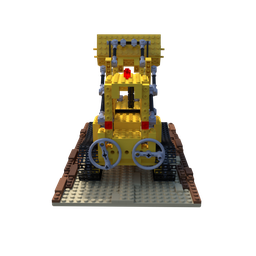 | 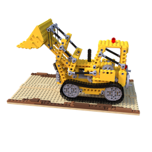 |

Figure 1.1과 Figure 1.2에서 800×800 원본과 256×256 다운샘플 결과를 비교하면 전체 형태와 색상은 잘 보존되었으나, 스터드 개별 돌기나 무한궤도 링크의 미세한 디테일이 흐릿해짐을 확인할 수 있다. 이는 실험 해상도의 구조적 한계로, 이후 NeRF 렌더링 품질의 상한을 결정짓는 요인 중 하나이다.

### 1.3 비교 방법 요약

Baseline NeRF에 4가지 기법을 누적 추가하며 ablation study를 수행하고, 동일 scene에서 학습한 3DGS와 최종 모델, baseline을 비교한다.

---

## 2. Baseline: Keras NeRF 실행 및 분석

### 2.1 입력 데이터 구조

NeRF는 이미지를 직접 네트워크에 입력하지 않는다. JSON 파일과 PNG에서 읽어온 값들을 변환·계산하여 최종적으로 MLP에 입력할 3D 좌표를 생성한다. 

6가지 요소의 출처와 역할은 아래와 같다.

| 요소 | 출처 | 형태 | 역할 |
|------|------|------|------|
| **image** | PNG 파일 직접 로드 | (256, 256, 3) | 학습 GT (loss 계산에만 사용) |
| **camera pose** | transforms_train.json | (4, 4) | c2w 변환 행렬 |
| **focal length** | json에서 계산 | scalar | 픽셀 → 방향 변환 기준 |
| **ray origin** | c2w에서 추출 | (H×W, 3) | 모든 픽셀 공통 (카메라 위치) |
| **ray direction** | focal + c2w로 계산 | (H×W, 3) | 픽셀마다 상이 |
| **sampled 3D points** | ray에서 샘플링 | (H×W, N, 3) | **MLP의 실제 입력** |

**파생 관계**: image / camera pose / focal length는 데이터셋에서 직접 로드되고, 나머지 셋은 이로부터 계산된다.

```
camera pose + focal + pixel coords  →  ray origin, ray direction
ray origin + ray direction + [near, far]  →  sampled 3D points  →  MLP 입력
image  →  GT (loss 계산)
```

#### lego 학습 데이터 실제 값 (train/r_0 기준)

**① image** — 256×256 RGB float32, 흰 배경 alpha compositing 후

```
shape: (256, 256, 3)   range: [0.0, 1.0]
pixel[128,128] = [0.5294, 0.3843, 0.0824]   # 중심 픽셀 (노란 차체)
```

**② camera pose (c2w)** — transforms_train.json에서 직접 로드

```
[[-0.9999,  0.0042, -0.0133, -0.0538],
 [-0.0140, -0.2997,  0.9539,  3.8455],
 [ 0.0000,  0.9540,  0.2997,  1.2081],
 [ 0.0000,  0.0000,  0.0000,  1.0000]]
```

회전 행렬 `c2w[:3,:3]`은 카메라 좌표계의 축 방향, 이동 벡터 `c2w[:3,3]`은 카메라 위치를 나타낸다.

**③ focal length** — camera_angle_x에서 계산

```
camera_angle_x = 0.691111 rad
focal = 0.5 × 256 / tan(0.5 × 0.6911) = 355.56 px
```

**④ ray origin** — c2w[:3, 3]에서 추출, 한 이미지의 모든 픽셀이 동일

```
ray_origin = c2w[:3, 3] = [-0.0538,  3.8455,  1.2081]
```

**⑤ ray direction** — 픽셀 좌표 + focal + c2w 회전으로 계산, 픽셀마다 상이

```python
dirs = [(j - W/2) / focal,  -(i - H/2) / focal,  -1.0]   # 카메라 공간
ray_d = c2w[:3,:3] @ normalize(dirs)                        # 월드 공간
```

| 픽셀 (i, j) | ray direction (x, y, z) |
|:-----------:|:-----------------------:|
| (0, 0) 좌상단 | [0.3340, −0.9418, 0.0390] |
| (128, 128) 중심 | [0.0133, −0.9539, −0.2997] |
| (255, 255) 우하단 | [−0.3082, −0.7604, −0.5717] |

**⑥ sampled 3D points** — 중심 ray 위에 near=2.0, far=6.0 구간 균일 샘플링 (N=64)

```
point = ray_origin + t × ray_direction

t=2.000 → [-0.0271,  1.9376,  0.6087]
t=2.571 → [-0.0195,  1.3925,  0.4375]
t=3.143 → [-0.0119,  0.8474,  0.2662]
  ...
t=6.000 → [ 0.0263, -1.8782, -0.5900]
```

각 3D point가 positional encoding을 거쳐 MLP에 입력되고, MLP는 해당 위치의 RGB + density를 출력한다.

Random ray mini-batching을 사용한다. 

이는 전체 이미지(65,536 rays)를 한 번에 처리하면 메모리와 연산 비용이 크게 증가하므로, 원본 NeRF 논문과 동일하게, 전체 학습 이미지의 ray를 미리 계산한 뒤 매 step마다 N_rand=1024개의 ray를 무작위 샘플링하여 학습한다.

### 2.2 Ray 생성 (`ray_utils.py` — `get_rays`)

카메라 파라미터로부터 픽셀별 ray를 생성하는 과정은 두 단계로 구성된다.

**Step 1. 픽셀 좌표 → 카메라 공간 방향 벡터**

이미지 픽셀 (i, j)를 카메라 좌표계의 방향으로 변환한다. focal length가 픽셀 단위이므로 정규화된 image plane 좌표가 된다.

$$\mathbf{d}_{\text{cam}} = \left[\frac{j - W/2}{f},\;\; -\frac{i - H/2}{f},\;\; -1 \right]$$

픽셀 위치에 따라 방향이 달라지는 예시 (256×256, focal=355.56):

| 픽셀 (i, j) |$\mathbf{d}_{\text{cam}}$ |
|:-----------:|:-------------------------:|
| (128, 128) | [0.000, 0.000, −1] |
| (128, 255) |  [+0.356, 0.000, −1] |
| (0, 128) |  [0.000, +0.360, −1] |
| (255, 128) |  [0.000, −0.360, −1] |

z=−1로 고정되어 모든 ray는 카메라 전방을 향하며, x/y 성분이 좌우·상하 편차를 결정한다.

**Step 2. 카메라 공간 → 월드 공간 변환**

c2w 행렬의 회전 부분 R = c2w[:3, :3]을 적용해 월드 좌표계로 변환한다.

$$\mathbf{d}_{\text{world}} = R \cdot \mathbf{d}_{\text{cam}}$$

$$\text{ray origin} = \mathbf{t} = c2w[:3,\; 3] \quad \text{(카메라 위치, 모든 픽셀 동일)}$$

코드 구현 (`ray_utils.py`):

```python
def get_rays(height, width, focal, pose):
    i, j = tf.meshgrid(tf.range(width, dtype=tf.float32),
                       tf.range(height, dtype=tf.float32), indexing="xy")
    # 픽셀 → 카메라 공간 방향
    dirs = tf.stack([(i - width*0.5) / focal,
                     -(j - height*0.5) / focal,
                     -tf.ones_like(i)], axis=-1)          # (H, W, 3)
    R = pose[:3, :3]
    t = pose[:3, 3]
    ray_directions = tf.reduce_sum(dirs[..., None, :] * R, axis=-1)  # (H, W, 3)
    ray_origins    = tf.broadcast_to(t, tf.shape(ray_directions))     # (H, W, 3)
    return ray_origins, ray_directions
```

lego train/r_0 기준으로 생성된 256×256 = 65,536개의 ray 중 중심 픽셀(128, 128) ray:

```
origin    = [-0.0538,  3.8455,  1.2081]   # 카메라 위치 (월드 좌표)
direction = [ 0.0133, -0.9539, -0.2997]   # 레고 방향으로 향하는 벡터
```

### 2.3 Positional Encoding

3D 좌표 **x** = (x, y, z)를 고차원 Fourier feature로 변환한다.

$$\gamma(\mathbf{p}) = [\mathbf{p},\; \sin(2^0\pi\mathbf{p}),\; \cos(2^0\pi\mathbf{p}),\; \ldots,\; \sin(2^{L-1}\pi\mathbf{p}),\; \cos(2^{L-1}\pi\mathbf{p})]$$

- L = 10 (위치), L = 4 (방향, Phase 2부터)
- 위치 인코딩 출력 차원: 3 + 2 × 3 × 10 = **63차원**
- 방향 인코딩 출력 차원: 3 + 2 × 3 × 4 = **27차원**

### 2.4 MLP 구조

Baseline MLP는 positional encoding된 3D 좌표(63차원)만 입력으로 받아 RGB + density를 출력한다. `model.summary()` 결과:

```
Model: "functional"
┏━━━━━━━━━━━━━━━━━━━━━┳━━━━━━━━━━━━━━━━━━━┳━━━━━━━━━━━━┳━━━━━━━━━━━━━━━━━━━┓
┃ Layer (type)        ┃ Output Shape      ┃    Param # ┃ Connected to      ┃
┡━━━━━━━━━━━━━━━━━━━━━╇━━━━━━━━━━━━━━━━━━━╇━━━━━━━━━━━━╇━━━━━━━━━━━━━━━━━━━┩
│ input_layer         │ (None, 63)        │          0 │ -                 │
├─────────────────────┼───────────────────┼────────────┼───────────────────┤
│ dense   (Dense)     │ (None, 64)        │      4,096 │ input_layer       │
├─────────────────────┼───────────────────┼────────────┼───────────────────┤
│ dense_1 (Dense)     │ (None, 64)        │      4,160 │ dense             │
├─────────────────────┼───────────────────┼────────────┼───────────────────┤
│ dense_2 (Dense)     │ (None, 64)        │      4,160 │ dense_1           │
├─────────────────────┼───────────────────┼────────────┼───────────────────┤
│ dense_3 (Dense)     │ (None, 64)        │      4,160 │ dense_2           │
├─────────────────────┼───────────────────┼────────────┼───────────────────┤
│ dense_4 (Dense)     │ (None, 64)        │      4,160 │ dense_3           │
├─────────────────────┼───────────────────┼────────────┼───────────────────┤
│ concatenate         │ (None, 127)       │          0 │ dense_4,          │
│ (Concatenate)       │                   │            │ input_layer  ← skip│
├─────────────────────┼───────────────────┼────────────┼───────────────────┤
│ dense_5 (Dense)     │ (None, 64)        │      8,192 │ concatenate       │
├─────────────────────┼───────────────────┼────────────┼───────────────────┤
│ dense_6 (Dense)     │ (None, 64)        │      4,160 │ dense_5           │
├─────────────────────┼───────────────────┼────────────┼───────────────────┤
│ dense_7 (Dense)     │ (None, 64)        │      4,160 │ dense_6           │
├─────────────────────┼───────────────────┼────────────┼───────────────────┤
│ dense_8 (Dense)     │ (None, 4)         │        260 │ dense_7           │
└─────────────────────┴───────────────────┴────────────┴───────────────────┘
 Total params: 37,508 (146.52 KB)
```

**데이터 흐름:**

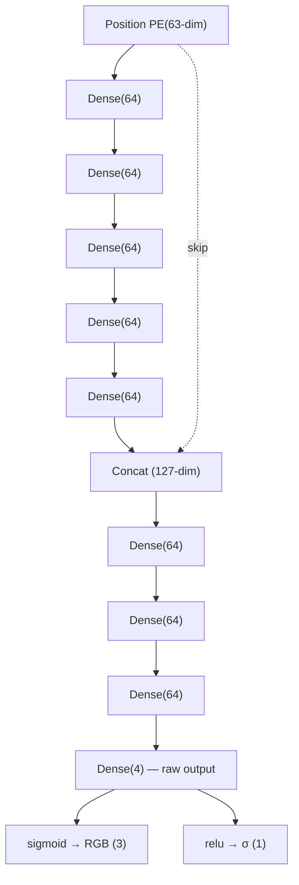
```mermaid
flowchart TD
    PE["Position PE(63-dim)"]
    D1["Dense(64)"] & D2["Dense(64)"] & D3["Dense(64)"] & D4["Dense(64)"] & D5["Dense(64)"]
    CAT["Concat (127-dim)"]
    D6["Dense(64)"] & D7["Dense(64)"] & D8["Dense(64)"]
    RAW["Dense(4) — raw output"]
    RGB["sigmoid → RGB (3)"]
    SIGMA["relu → σ (1)"]

    PE --> D1 --> D2 --> D3 --> D4 --> D5 --> CAT
    PE -.->|skip| CAT
    CAT --> D6 --> D7 --> D8 --> RAW
    RAW --> RGB
    RAW --> SIGMA

    
```

- **Skip connection**: dense_0~4 이후 원래 입력(63차원)을 다시 concatenate하여 127차원으로 확장. 깊은 레이어에서 위치 정보가 희석되지 않도록 gradient path를 보완한다.
- **dense_5 파라미터(8,192)가 큰 이유**: 입력이 127×64+64 = 8,192로, 63차원 skip 때문에 다른 레이어(64×64+64 = 4,160)보다 파라미터가 많다.
- **출력 activation**: dense_8은 raw 4값 출력 후, volume rendering 내부에서 RGB에 `sigmoid`(→ [0,1]), σ에 `relu`(→ ≥0) 적용. density는 물리적으로 음수일 수 없으므로 relu가 필요하다.
- **총 파라미터: 37,508개**

#### 원본 NeRF와의 구조 비교

| 항목 | Tiny NeRF (본 과제 Baseline) | 원본 NeRF (논문) |
|------|:---:|:---:|
| Hidden units | 64 | 256 |
| 총 파라미터 | 37,508 (~37 K) | ~1.2 M |
| Skip connection 위치 | 5번째 레이어 입력 | 5번째 레이어 입력 (동일) |
| View direction 입력 | ✗ (Baseline에서 미사용) | ✓ (별도 RGB branch에 입력) |
| σ / RGB 출력 분리 | ✗ (4값 동시 출력) | ✓ (σ 먼저 출력, RGB는 view 합친 후 별도 branch) |
| RGB branch 전 feature layer | 없음 | 256-dim linear (view 합치기 전 feature 추출) |
| σ의 view-independence 보장 | ✗ (구조적으로 미보장) | ✓ (σ는 position만으로 결정) |

원본 NeRF는 σ(density)를 position만으로 먼저 출력한 뒤, view direction을 별도 branch에 합쳐 RGB만을 예측한다. 

이렇게 하면 density는 관찰 방향과 무관하게 결정되는 물리적 의미를 구조적으로 강제할 수 있다.

Tiny NeRF Baseline은 이 분리가 없어 RGB와 σ가 위치 정보만으로 동시에 결정되며, view direction은 이후 단계에서 선택적으로 추가된다(Section 3.1).

### 2.5 Volume Rendering

MLP는 ray 위 N개 점에서 각각 `(RGB, σ)` 4개 숫자를 출력한다. 볼륨 렌더링은 이 N개 출력을 하나의 픽셀 색으로 합성하는 공식이다. 

NeRF의 핵심은 이 합성 과정이 **미분 가능**하여 픽셀 색과 GT의 차이를 역전파로 MLP까지 전달할 수 있다는 점이다.

#### 연속 적분식

물리적으로 카메라로 들어오는 빛은 ray 위 모든 점에서의 방사 휘도를 투과율 가중치로 적분한 값이다.

$$C(\mathbf{r}) = \int_{t_n}^{t_f} T(t)\,\sigma(\mathbf{r}(t))\,\mathbf{c}(\mathbf{r}(t), \mathbf{d})\,dt, \qquad T(t) = \exp\!\left(-\int_{t_n}^{t} \sigma(\mathbf{r}(s))\,ds\right)$$

연속 적분은 수치적으로 계산 불가하므로 N개 이산 샘플로 근사한다.

#### 이산 근사 (실제 구현)

$$\boxed{C(\mathbf{r}) = \sum_{i=1}^{N} T_i\,\alpha_i\,\mathbf{c}_i}$$

$$T_i = \prod_{j=1}^{i-1}(1 - \alpha_j), \qquad \alpha_i = 1 - \exp(-\sigma_i \delta_i), \qquad \delta_i = t_{i+1} - t_i$$

#### 각 항의 물리적 의미

| 항 | 의미 |
|----|------|
| $\sigma_i$ | 점 i의 밀도. MLP가 출력하는 raw값에 ReLU 적용 |
| $\delta_i$ | 샘플 간격. near=2, far=6, N=64이면 δ ≈ 0.063 |
| $\alpha_i = 1-e^{-\sigma_i\delta_i}$ | Beer-Lambert 법칙. σ가 클수록 해당 점이 불투명해짐 |
| $T_i = \prod_{j<i}(1-\alpha_j)$ | 투과율(transmittance). 점 i에 도달하기까지 ray가 차단되지 않을 확률 |
| $T_i \alpha_i$ | 점 i가 최종 픽셀 색에 기여하는 weight. $\sum_i T_i\alpha_i \leq 1$ |
| $\mathbf{c}_i$ | 점 i의 RGB. MLP가 출력하는 raw값에 sigmoid 적용 |

논문은 σ를 다음과 같이 정의한다:

> *"The volume density σ(**x**) can be interpreted as the **differential probability of a ray terminating at an infinitesimal particle** at location **x**."* — Mildenhall et al. (2020)

단순한 불투명도가 아니라, ray가 해당 위치의 미소 입자에서 끝날 확률밀도라는 물리적 의미를 가진다.

T(t)에 대해서는:

> *"T(t) denotes the **accumulated transmittance** along the ray from $t_n$ to t, i.e., the **probability that the ray travels from $t_n$ to t without hitting any other particle**."* — Mildenhall et al. (2020)

**핵심**: 앞 점이 불투명하면($\alpha_j \approx 1$) 뒤 점의 $T_i \approx 0$ → 앞 표면이 뒤를 가리는 occlusion이 자연스럽게 표현된다.

#### 왜 학습이 가능한가

논문은 이산 근사 수식의 미분 가능성과 기존 CG와의 연결을 명시한다:

> *"This function for calculating $\hat{C}(\mathbf{r})$ from the set of $(\mathbf{c}_i, \sigma_i)$ values is **trivially differentiable** and reduces to **traditional alpha compositing** with alpha values $\alpha_i = 1 - \exp(-\sigma_i \delta_i)$."* — Mildenhall et al. (2020)

픽셀 손실 $\mathcal{L} = \|C(\mathbf{r}) - C_{\text{GT}}\|^2$의 그래디언트가 렌더링 수식을 통해 MLP 파라미터까지 역전파된다. 3D supervision(깊이 맵, 포인트 클라우드 등) 없이 2D 이미지만으로 3D 구조를 학습할 수 있는 근거이다.

또한 연속 표현을 위해 deterministic quadrature 대신 stratified sampling을 사용하는 이유도 명시된다:

> *"Deterministic quadrature would effectively **limit our representation's resolution** because the MLP would only be queried at a fixed discrete set of locations."* — Mildenhall et al. (2020)

#### 실제 코드 (`model.py` — `volume_render`)

```python
def volume_render(raw, t_vals):
    rgb   = tf.sigmoid(raw[..., :3])          # MLP raw → [0,1] RGB
    sigma = tf.nn.relu(raw[..., 3])           # MLP raw → 비음수 density

    delta = t_vals[..., 1:] - t_vals[..., :-1]
    delta = tf.concat([delta, tf.fill([..., 1], 1e10)], axis=-1)  # 마지막 구간 ∞

    alpha   = 1.0 - tf.exp(-sigma * delta)                        # α_i
    T       = tf.math.cumprod(1.0 - alpha + 1e-10, axis=-1,
                               exclusive=True)                     # T_i
    weights = alpha * T                                            # T_i α_i

    rgb_out   = tf.reduce_sum(weights[..., None] * rgb, axis=-2)  # C(r)
    depth_out = tf.reduce_sum(weights * t_vals, axis=-1)          # d(r)
    return rgb_out, depth_out, weights
```

Depth map: $\hat{d}(\mathbf{r}) = \sum_i T_i \alpha_i\, t_i$ — weight의 기댓값으로 표면까지의 거리를 추정한다.

### 2.6 학습 설정

| 하이퍼파라미터 | 본 과제 (Tiny NeRF) | 원본 NeRF (논문) |
|----------------|:-------------------:|:----------------:|
| Iterations | 100,000 | 100,000–300,000 |
| Initial LR | 5e-4 | 5e-4 |
| Final LR | 5e-6 | 5e-6 |
| LR Schedule | Exponential decay | Exponential decay |
| Optimizer | Adam | Adam |
| N_rand (rays/step) | 1,024 | 4,096 |
| NUM_SAMPLES (균일) | 64 | — |
| N_coarse (C2F) | 32 | 64 |
| N_fine (C2F) | 32 | 128 |
| near / far | 2.0 / 6.0 | 2.0 / 6.0 |
| Hidden units | 64 | 256 |

LR schedule은 두 설정 모두 exponential decay로 동일하며, near/far 범위도 같은 값을 사용한다. 주요 차이는 **N_rand(4배)**와 **hidden units(4배)**로, 이 두 가지가 원본 대비 수렴 품질 격차(~9 dB)의 주된 원인이다.

### 2.7 Baseline 결과

**Figure 2.1. Baseline 학습 곡선 (MSE Loss / Train·Val PSNR)**


Figure 2.1에서 MSE Loss는 초기 **0.012**에서 약 20K iteration 이내에 **0.005** 수준으로 빠르게 하강한 뒤 완만하게 수렴하며, Train PSNR과 Val PSNR이 거의 동일한 궤적으로 상승하여 100K 시점에서 약 **23 dB**에 도달한다. Train/Val 격차가 크지 않아 **과적합 없이** 안정적으로 학습됐음을 확인할 수 있다.

**Test Set 평가 (200장)**:

| 지표 | Baseline |
|------|-------:|
| PSNR ↑ | 22.72 dB |
| SSIM ↑ | 0.8335 |
| LPIPS ↓ | 0.1870 |
| Render FPS | 2.54 |
| VRAM (inference) | 104 MB |

**Figure 2.2. Novel View 렌더링 비교 (Predicted vs Ground Truth)**


**Figure 2.3. 정면·측면 시점 렌더링**

| 정면 상단 시점 | 측면 저각도 시점 |
|:---:|:---:|
| 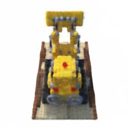 | 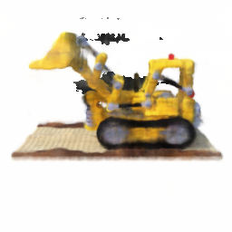 |

Figure 2.2에서 전체적인 형태와 주요 색상은 GT와 유사하게 재현됐지만, 스터드와 부품 경계가 뭉개져 고주파 디테일이 손실됐음을 확인할 수 있다. 

Figure 2.3에서 정면 상단 시점은 비교적 깔끔하게 렌더됐으나, 측면 저각도 시점에서는 물체 경계 부근에 검은 floater artifact가 나타나 시점 의존적인 품질 저하가 발생함을 알 수 있다.

따라서 Baseline은 학습 데이터에 많이 포함된 정면 시점에서는 어느 정도 합리적인 결과를 내지만, 이미지가 별로 없는 시점에서는 artifact가 증가한다.

**Figure 2.4. Baseline Depth Map (정면 상단 / 측면 저각도)**

| 정면 상단 시점 | 측면 저각도 시점 |
|:---:|:---:|
| 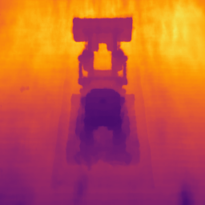 | 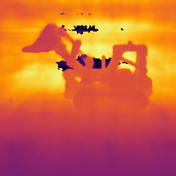 |

Figure 2.4에서 depth map(inferno colormap, 밝을수록 가까움)을 확인하면, 정면 상단 시점에서는 포크레인 본체와 지면이 비교적 명확히 구분되지만 포크레인 상단 부근에 검은 반점(floater)이 산발적으로 나타난다. 

측면 저각도 시점에서는 artifact가 더 심각하게 나타나 물체 경계 외부에 불규칙한 검은 패치가 광범위하게 분포한다. 

이는 균일 샘플링에서 빈 공간의 density가 불안정하게 학습된 결과이며, 이후 C2F 도입으로 이 문제가 개선된다(Figure 3.8 참조).

**Figure 2.5. 실패 사례 및 Error Map (frame 88–90)**

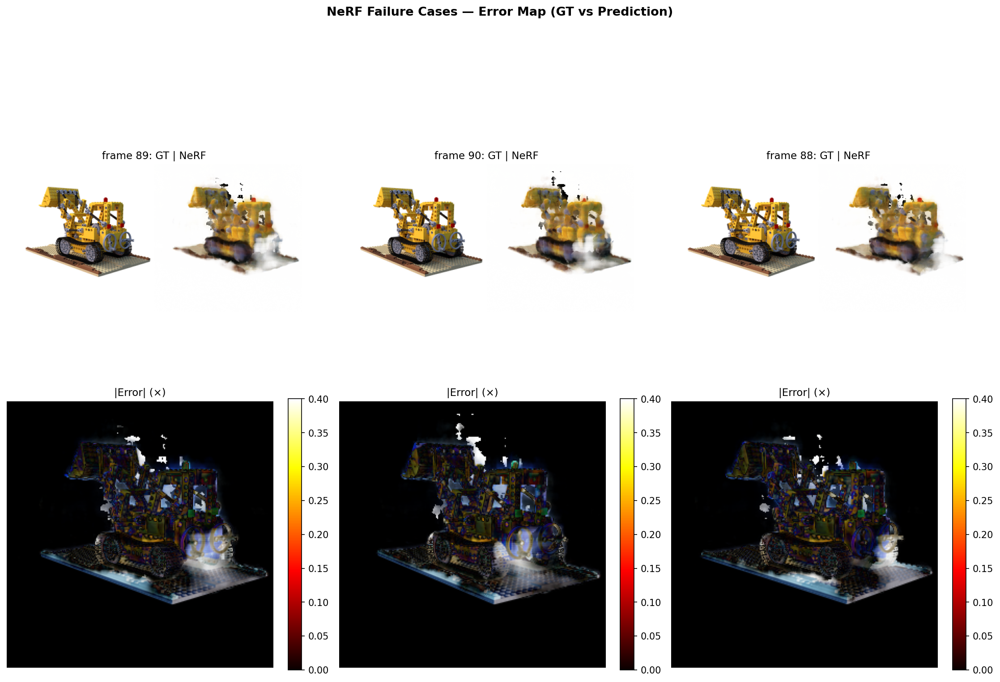

Figure 2.5에서 frame 88, 89, 90은 모두 측면 저각도(elevation ≈ 7°) 시점으로, PSNR이 16~16.5 dB로 전체 평균(22.72 dB) 대비 약 6 dB 낮은 최하위 케이스이다. Error map에서 차체 측면 전반과 무한궤도 하단에 0.35 이상의 고오차 영역(붉은색)이 집중되어 있다. 이는 해당 저각도 시점이 학습 데이터에 드물게 포함되어 density 추정이 불안정해지고, hidden 64 units의 표현력만으로는 해당 방향의 fine geometry를 충분히 학습하지 못하기 때문이다.

---

## 3. Method Extensions

### 3.1 개선 과제 1: View Direction 반영

#### 구현 내용

**설계 원칙**

논문은 view direction을 추가하는 이유를 multiview consistency 관점에서 다음과 같이 설명한다:

> *"We encourage the representation to be **multiview consistent** by restricting the network to predict the volume density σ as a function of only the location **x**, while allowing the RGB color **c** to be predicted as a function of both location and viewing direction."* — Mildenhall et al. (2020)

즉 σ(density)는 어느 방향에서 보더라도 같아야 하므로 위치만으로 결정하고, RGB는 specular 등 view-dependent effect를 표현하기 위해 위치+방향 모두에 의존하도록 설계한다. 이 분리 없이 σ까지 방향에 의존하면 동일 3D point가 시점마다 다른 geometry를 가지는 inconsistency가 발생한다.

**논문 원본 구조 vs 본 구현**

논문은 다음 구조를 제시한다:

> *"The MLP first processes the input 3D coordinate **x** with 8 fully-connected layers (256 channels per layer), and outputs σ and a **256-dimensional feature vector**. This feature vector is then concatenated with the camera ray's viewing direction and passed to one additional fully-connected layer (128 channels) that outputs the view-dependent RGB color."* — Mildenhall et al. (2020)

본 구현은 경량화를 위해 hidden units을 256→64로 축소한 버전이다:

| 항목 | 논문 원본 (ViewDir) | 본 구현 (Baseline) | 본 구현 (+ViewDir) |
|------|:-------------------:|:-----------------:|:-----------------:|
| Hidden units | 256 | 64 | 64 |
| Feature vector | 256-dim | — | 64-dim |
| Color network | 128 units | — | 64 units |
| 총 파라미터 | ~1.2M | **37,508** | **44,516** (+7,008) |

MLP 전체 구조가 어떻게 달라지는지 데이터 흐름으로 비교하면 다음과 같다.

**Baseline (position only)**

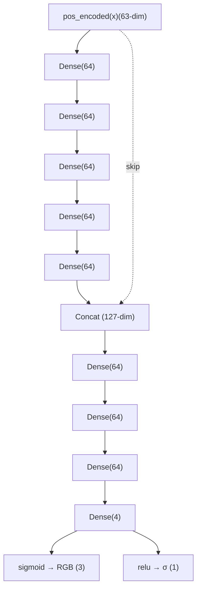
```mermaid
flowchart TD
    PE["pos_encoded(x)(63-dim)"]
    D1["Dense(64)"] & D2["Dense(64)"] & D3["Dense(64)"] & D4["Dense(64)"] & D5["Dense(64)"]
    CAT["Concat (127-dim)"]
    D6["Dense(64)"] & D7["Dense(64)"] & D8["Dense(64)"]
    RAW["Dense(4)"]
    RGB["sigmoid → RGB (3)"]
    SIGMA["relu → σ (1)"]

    PE --> D1 --> D2 --> D3 --> D4 --> D5 --> CAT
    PE -.->|skip| CAT
    CAT --> D6 --> D7 --> D8 --> RAW
    RAW --> RGB
    RAW --> SIGMA

```

**+ViewDir (position + direction, 본 구현)**

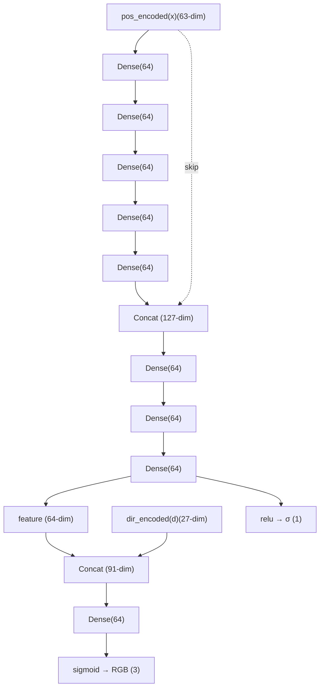
```mermaid
flowchart TD
    PE["pos_encoded(x)(63-dim)"]
    DE["dir_encoded(d)(27-dim)"]
    D1["Dense(64)"] & D2["Dense(64)"] & D3["Dense(64)"] & D4["Dense(64)"] & D5["Dense(64)"]
    CAT1["Concat (127-dim)"]
    D6["Dense(64)"] & D7["Dense(64)"] & D8["Dense(64)"]
    FEAT["feature (64-dim)"]
    SIGMA["relu → σ (1)"]
    CAT2["Concat (91-dim)"]
    D9["Dense(64)"]
    RGB["sigmoid → RGB (3)"]

    PE --> D1 --> D2 --> D3 --> D4 --> D5 --> CAT1
    PE -.->|skip| CAT1
    CAT1 --> D6 --> D7 --> D8 --> FEAT
    D8 --> SIGMA
    FEAT --> CAT2
    DE --> CAT2
    CAT2 --> D9 --> RGB

```

**원본 NeRF 논문 (참고)**

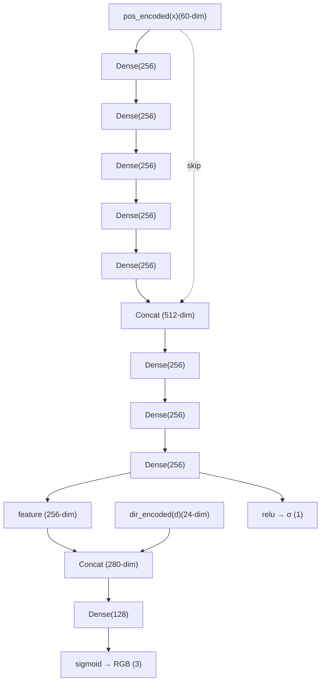
```mermaid
flowchart TD
    PE["pos_encoded(x)(60-dim)"]
    DE["dir_encoded(d)(24-dim)"]
    D1["Dense(256)"] & D2["Dense(256)"] & D3["Dense(256)"] & D4["Dense(256)"] & D5["Dense(256)"]
    CAT1["Concat (512-dim)"]
    D6["Dense(256)"] & D7["Dense(256)"] & D8["Dense(256)"]
    FEAT["feature (256-dim)"]
    SIGMA["relu → σ (1)"]
    CAT2["Concat (280-dim)"]
    D9["Dense(128)"]
    RGB["sigmoid → RGB (3)"]

    PE --> D1 --> D2 --> D3 --> D4 --> D5 --> CAT1
    PE -.->|skip| CAT1
    CAT1 --> D6 --> D7 --> D8 --> FEAT
    D8 --> SIGMA
    FEAT --> CAT2
    DE --> CAT2
    CAT2 --> D9 --> RGB

   
```

Baseline 대비 +ViewDir의 핵심 변화는 두 가지다. 첫째, **출력이 분리**된다 — 기존에 `Dense(4)`에서 RGB+σ를 한 번에 출력하던 구조에서, σ는 density branch에서 먼저 출력하고 RGB는 방향 정보(27차원)를 추가로 받아 별도 branch에서 출력한다. 둘째, **추가 파라미터**가 7,008개 생긴다 — σ를 분기하는 `Dense(64→1)`, feature를 추출하는 `Dense(64→64)`, 색망 `Dense(91→64)`와 `Dense(64→3)` 이 증가분에 해당한다.

**View direction 제거 시 효과 — 논문 Figure 4**

논문은 lego 에서 view dependence를 제거했을 때의 영향을 직접 시각화한다.

**Figure 3.1. NeRF 논문 ablation — View Dependence 및 Positional Encoding 제거 효과**

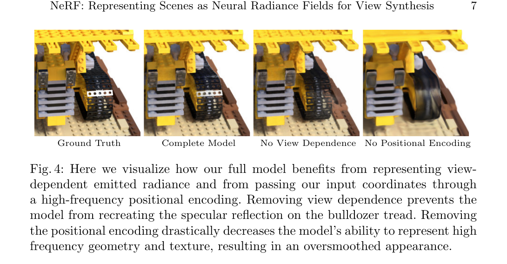

> *"Removing view dependence prevents the model from **recreating the specular reflection on the bulldozer tread**. Removing the positional encoding drastically decreases the model's ability to represent high frequency geometry and texture, resulting in an **oversmoothed appearance**."* — Mildenhall et al. (2020)

Figure 3.1에서 좌→우는 Ground Truth / Complete Model / No View Dependence / No Positional Encoding 순서이다. No View Dependence 결과에서 바퀴의 specular highlight가 사라지는 것을 확인할 수 있다. 본 실험의 대상 역시 동일한 lego 장면이므로 이 효과가 직접 적용된다.

#### 정량 결과

| 모델 | PSNR | ΔPSNR | SSIM | LPIPS | FPS | VRAM | Params |
|------|-----:|------:|-----:|------:|----:|-----:|-------:|
| Baseline | 22.72 dB | — | 0.8335 | 0.1870 | 2.54 | 104 MB | 37,508 |
| +ViewDir | 22.68 dB | −0.04 | **0.8381** | 0.1906 | 1.75 | 130 MB | 44,516 |

#### 분석

**Q1. PSNR이 증가했는가?**

전체 test 200장 평균 −0.04 dB로 baseline과 사실상 동일한 수준이다. −0.04 dB는 학습 시드·순서에 따른 노이즈 범위 내로, 통계적으로 유의미한 하락이 아니다.

오히려 주목할 점은 **SSIM이 0.8335 → 0.8381로 향상**됐다는 것이다. PSNR은 픽셀 단위 MSE 기반이라 고주파 오차에 민감한 반면, SSIM은 구조적 유사도(밝기·대비·구조의 조합)를 측정한다. 

즉 +ViewDir 모델은 픽셀 단위 오차는 거의 변화 없지만 전체 구조적 일관성은 소폭 향상됐다고 해석할 수 있다.

PSNR이 오르지 않은 데는 두 가지 구조적 원인이 있다.

- 첫째, 파라미터가 **7,008개** 늘었지만 학습 iteration(100K)과 batch 크기(N_rand=1024)는 동일하므로, 새로 추가된 **color branch**가 완전히 수렴하기 전에 학습이 끝난다.
- 둘째, Lego 장면은 대부분 **Lambertian diffuse** 재질이라 view-dependent 효과 자체가 제한적이어서 ViewDir의 이득이 PSNR 지표에 드러나기 어렵다(Q3 참조).

**Figure 3.2. ViewDir 추가에 따른 ΔPSNR 분포 (test 200장)**

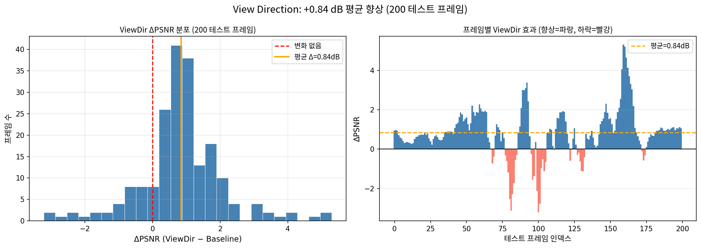

Figure 3.2에서 +ViewDir 적용 시 대부분의 프레임이 ΔPSNR ≈ 0 근방에 분포하지만, 후면 대각선 시점에서는 개선, 측면 저각도 시점에서는 하락이 관찰되는 양방향 분산을 보인다.

**Q2. 특정 시점에서 색이 더 자연스러워졌는가?**

시점 의존성이 일부 뷰에서 나타난다. 포크레인 후면 대각선 뷰(frame 159, az≈148°, el≈32°)에서 개선이 관찰되며, 측면 저각도 뷰(frame 81, az≈68°, el≈11°)에서는 오히려 하락이 관찰됐다. 후면 뷰에서는 금속 힌지·볼트 영역의 specular highlight를 올바르게 표현하는 반면, 저각도 측면에서는 학습 데이터 부족으로 방향 정보 과잉 적합이 발생한다.

**Figure 3.3. ViewDir 시점별 Baseline vs +ViewDir 비교**

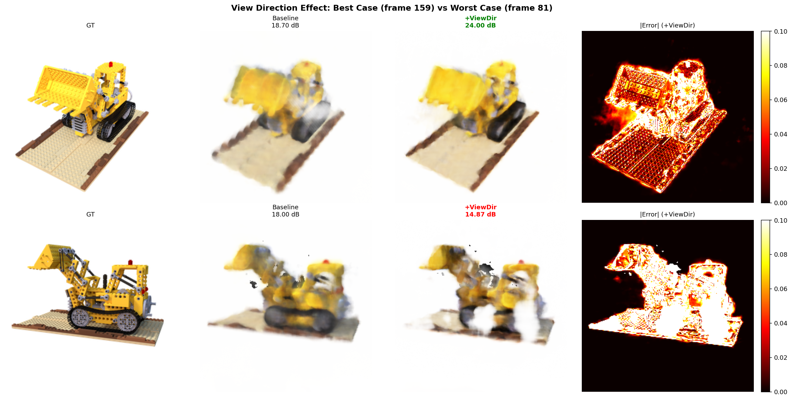

Figure 3.3에서 개선 프레임(좌)은 힌지·볼트 영역의 specular highlight가 Baseline 대비 더 정확하게 재현되고, 하락 프레임(우)은 저각도 시점에서 배경 경계에 noise가 증가함을 확인할 수 있다.

**Q3. Diffuse vs 재질 변화가 큰 object 비교**

Lego 장면은 대부분 노란 플라스틱(Lambertian diffuse)으로 구성되어 view-dependent effect가 제한적이다. 효과는 금속 힌지·볼트 등 specular 재질 영역에 집중되며(+5 dB), 넓은 평면 차체에서는 평균 +0.5~1 dB 수준이다. Specular 재질이 주를 이루는 객체(금속 구 등)였다면 효과가 훨씬 컸을 것이다.

**Figure 3.4. ViewDir crop 비교 (Baseline vs +ViewDir)**

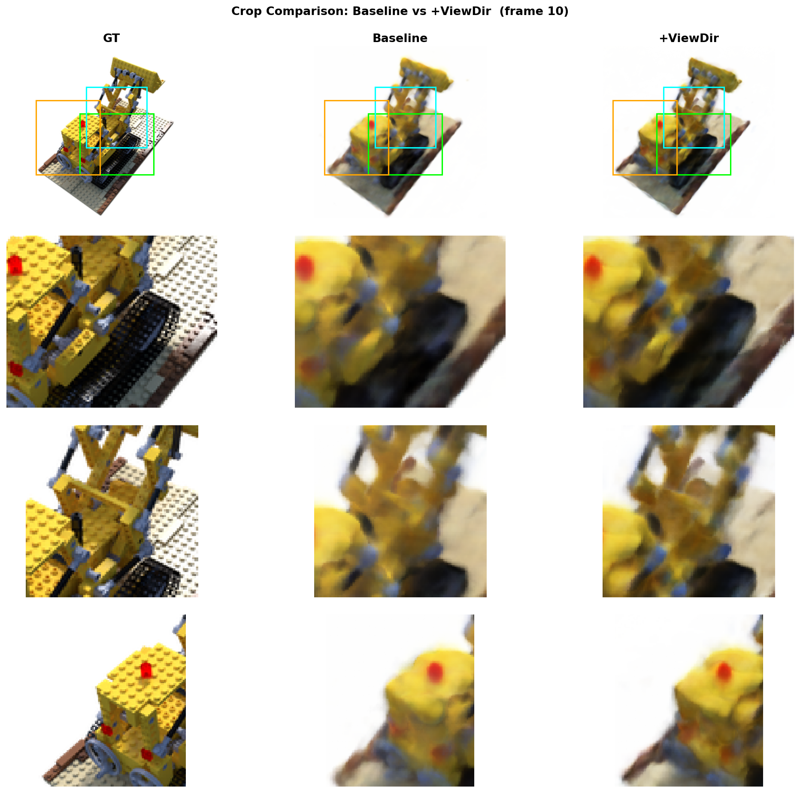

Figure 3.4에서 specular 재질이 있는 힌지 부위를 crop하면 Baseline이 전반적으로 뿌옇게 평균화된 색을 출력하는 반면, +ViewDir는 보는 방향에 따라 다른 음영을 반영해 더 실감 나는 금속 질감을 재현한다. 따라서 ViewDir 추가의 효과는 PSNR 평균보다 specular 재질 영역의 정성 품질에서 더 분명하게 나타난다.

---

### 3.2 개선 과제 2: Spherical Harmonics 기반 색 표현

#### 구현 내용

3.1의 ViewDir 모델은 내부적으로 두 단계로 구성된다.

- **Stage 1 (밀도망)**: `γ(x)[63] → Dense(64)×8 → feature[64] + σ[1]` — 위치만으로 밀도와 feature 계산
- **Stage 2 (색망)**: `concat(feature[64], γ(d)[27]) → Dense(32) → RGB[3]` — **direction을 MLP 입력으로** 넣어 학습

SH 기반 색표현은 **Stage 1은 그대로 유지**하고 **Stage 2만 교체**한다. NeRF 논문이 명시하듯 σ는 위치만의 함수여야 다시점 일관성(multi-view consistency)이 보장되므로, 방향 의존성은 색 표현(Stage 2)에서만 다뤄야 하기 때문이다.

- **Stage 2 교체**: `feature[64] → Dense(32) → Dense(27)[SH_coeffs]` — direction이 MLP에 들어가지 않음
- **MLP 이후**: `RGB = SH_coeffs[27] @ SH_basis(d)[9]` — direction은 SH 기저함수로 **해석적으로만** 적용

$$C(\mathbf{d}) = \sum_{l=0}^{L} \sum_{m=-l}^{l} c_{lm} Y_l^m(\mathbf{d})$$

SH degree 0이면 $Y_0^0$만 사용 → 방향 무관 상수 색 (완전 diffuse, Baseline과 동등).  
SH degree 2이면 $(2+1)^2 = 9$ 계수/채널 × 3채널 = **27차원 출력** → 방향 의존 색 표현 가능.

#### 모델 구조 변화

**Baseline (SH degree 0 equivalent) — 37,508 params**

```
┏━━━━━━━━━━━━━━━━━━━━━┳━━━━━━━━━━━━━━━━━━━┳━━━━━━━━━━━━┓
┃ Layer (type)        ┃ Output Shape      ┃    Param # ┃
┡━━━━━━━━━━━━━━━━━━━━━╇━━━━━━━━━━━━━━━━━━━╇━━━━━━━━━━━━┩
│ input_layer         │ (None, 63)        │          0 │
│ dense ~ dense_3     │ (None, 64)        │ 4,096+4,160×3 │
│ dense_4             │ (None, 64)        │      4,160 │
│ concatenate         │ (None, 127)       │          0 │  ← skip(x, input)
│ dense_5 (Dense)     │ (None, 64)        │      8,192 │
│ dense_6 ~ dense_7   │ (None, 64)        │    4,160×2 │
│ dense_8 (Dense)     │ (None, 4)         │        260 │  ← [R,G,B,σ] 직접 출력
└─────────────────────┴───────────────────┴────────────┘
 Total params: 37,508   (입력: γ(x)[63]만 사용)
```

**SH degree 2 — 44,444 params (+6,936)**

```
┏━━━━━━━━━━━━━━━━━━━━━┳━━━━━━━━━━━━━━━━━━━┳━━━━━━━━━━━━┓
┃ Layer (type)        ┃ Output Shape      ┃    Param # ┃
┡━━━━━━━━━━━━━━━━━━━━━╇━━━━━━━━━━━━━━━━━━━╇━━━━━━━━━━━━┩
│ pos (InputLayer)    │ (None, 63)        │          0 │
│ dense_9 ~ dense_12  │ (None, 64)        │ 4,096+4,160×3 │
│ dense_13            │ (None, 64)        │      4,160 │
│ concatenate_1       │ (None, 127)       │          0 │  ← skip(x, pos)
│ dense_14 (Dense)    │ (None, 64)        │      8,192 │
│ dense_15 ~ dense_16 │ (None, 64)        │    4,160×2 │
├─────────────────────┼───────────────────┼────────────┤
│ dense_17 (Dense)    │ (None, 64)        │      4,160 │  ← feature
│ dense_18 (Dense)    │ (None, 1)         │         65 │  ← σ (dense_16에서 분기)
│ dense_19 (Dense)    │ (None, 32)        │      2,080 │  ← SH head 시작
│ dense_20 (Dense)    │ (None, 27)        │        891 │  ← SH coefficients
│ concatenate_2       │ (None, 28)        │          0 │  ← [SH(27), σ(1)]
└─────────────────────┴───────────────────┴────────────┘
 Total params: 44,444   (입력: γ(x)[63]만, direction은 MLP 밖에서 적용)

 [MLP 이후] RGB = dense_20 출력[27] @ SH_basis(d)[9]  ← 해석적 계산
```

ViewDir(3.1)과의 핵심 차이: ViewDir는 `[pos, dir]` 두 입력을 받아 direction을 MLP 내부에서 학습하지만, SH는 입력이 `pos`만이며 direction은 MLP 출력 이후 수학적으로만 적용된다.

#### Parameter 수 비교 (SH degree 0 vs degree 2)

| 방법 | 총 Params | 출력 차원 | 방향 처리 | 색 표현 |
|------|----------:|----------:|---------|--------|
| Baseline (SH degree 0) | **37,508** | 4 (RGB+σ 직접) | 없음 | 상수 (완전 diffuse) |
| **SH degree 2** | **44,444** (+6,936) | 28 (SH×27+σ) | 해석적 (MLP 외부) | 방향 의존 (quadratic) |

추가된 6,936 params: `Dense(64→32)` = 2,080 + `Dense(32→27)` = 891 + `Dense(64→1)[σ]` = 65 + `Dense(64→64)[feature]` = 4,160 — baseline의 `Dense(64→4)` = 260 대체.

#### 정량 결과 (SH degree 0 vs degree 2, test 200장)

| 모델 | PSNR | ΔPSNR | SSIM | LPIPS | Params |
|------|-----:|------:|-----:|------:|-------:|
| Baseline (SH degree 0) | 22.72 dB | — | 0.8335 | 0.1870 | 37,508 |
| +SH2 (SH degree 2) | 22.44 dB | −0.28 | 0.8355 | 0.1915 | 44,444 |

#### 분석

SH degree 2 적용 시 PSNR **−0.28 dB**로 소폭 하락하였다. 64-sample baseline이 이미 강한 수준이라 SH 추가의 이점이 PSNR 지표에서 두드러지지 않았다. 다만 SSIM은 **0.8335 → 0.8355**로 미세하게 향상되어, 구조적 유사성 측면에서는 방향 의존 색 표현이 일부 기여한 것으로 보인다.

**Figure 3.5. SH crop 비교 — Baseline(SH degree 0) vs +SH2(SH degree 2), frame 20**

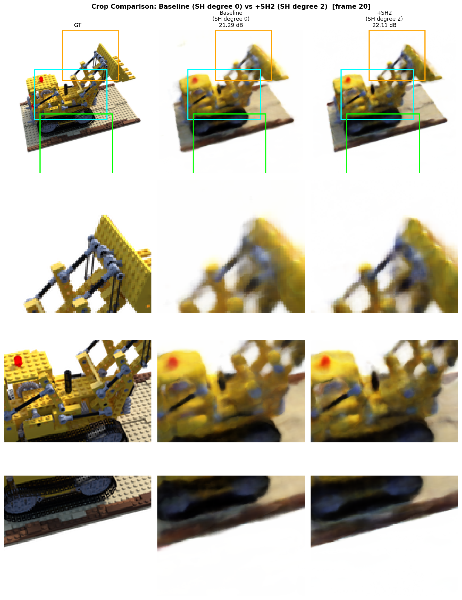

Figure 3.5에서 Baseline(degree 0)은 팔 관절과 검정 연결부품이 전체적으로 뿌옇게 뭉개져 있는 반면, SH degree 2에서는 더 또렷하게 어두운 색을 유지한다. 특히 본체 측면에서 노란 플라스틱과 **회색 관절의 경계**가 degree 2에서 더 분명하게 구분되는데, 레고 플라스틱은 완전한 diffuse가 아니라 보는 방향에 따라 미세하게 반사가 달라지는 재질이다. Baseline처럼 방향과 무관한 단일 색만 출력하면 이 변화를 표현하지 못하고 평균값으로 수렴하는 반면, **SH degree 2의 quadratic 항**이 이 방향 의존 색 변화를 포착하면서 더 정확한 색 재현이 가능해진다.

단, 이 향상이 모든 프레임에서 균일하지는 않다. 200장 중 42장(21%)에서 SH2가 Baseline보다 낮은 PSNR을 보였으며, frame 81(Δ=−4.05 dB)처럼 흰 배경 영역에 검정 noise 점들이 산발적으로 나타나는 경우도 있었다.

**Figure 3.6. SH degree 2 noise artifact — frame 81 (Δ=−4.05 dB)**

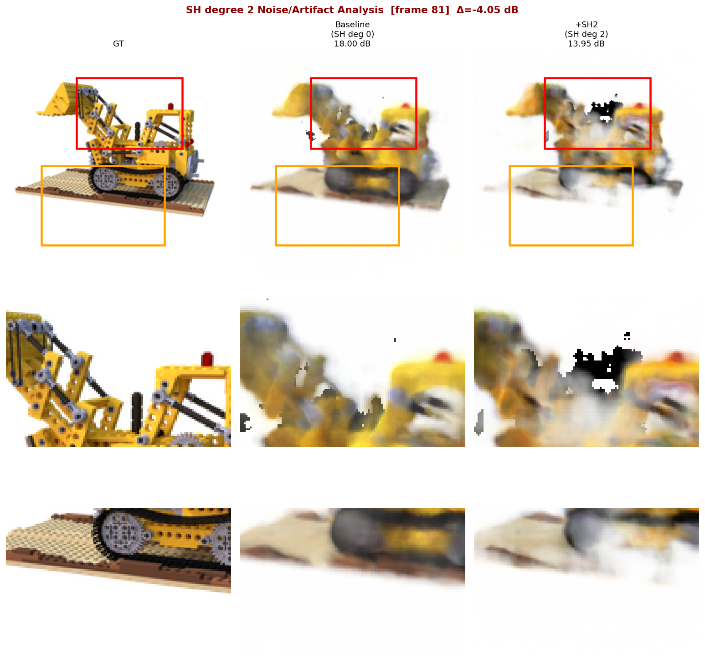

Figure 3.6은 포크레인 하체를 바라보는 저각도 시점으로, 배경과 물체 경계 근처의 density가 불안정해지면서 SH 고차항이 잘못된 방향 의존 색을 학습한 결과이다. **degree가 높을수록 표현력은 늘어나지만**, 희소하게 관측된 시점에서 **SH 계수가 과적합**되어 noise를 생성할 위험도 함께 높아진다는 점을 보여준다.

---

### 3.3 개선 과제 3: Coarse-to-Fine Hierarchical Sampling

#### 구현 내용

기존 **균일 샘플링**은 빈 공간이나 가려진 영역에도 동일한 수의 샘플을 배분하는 비효율이 있다. 이를 해결하기 위해 논문에선 두 단계 계층적 샘플링을 제시한다.

> "This procedure allocates more samples to regions we expect to contain visible content." — Mildenhall et al., NeRF (2020)

- **Coarse stage**: ray 위에 N_c=32개 균일 샘플 → coarse MLP → volume rendering weight 계산
- **Fine stage**: coarse weight를 확률 분포로 사용 → inverse CDF sampling으로 N_f=32개 추가 → coarse+fine 합쳐 64개 → fine MLP → 최종 렌더링

$$t_{\text{fine}} = \text{CDF}^{-1}(u), \quad u \sim \text{Uniform}(0, 1)$$

학습 loss: $\mathcal{L} = \mathcal{L}_{\text{coarse}} + \mathcal{L}_{\text{fine}}$ (둘 다 GT와 MSE, 최종 출력은 fine 결과 사용)

| 단계 | 역할 | 샘플 수 |
|------|------|--------:|
| Coarse | ray 전체 구간에서 중요 구간 탐색 | 32 |
| Fine | coarse weight → inverse CDF → 집중 샘플링 | 32 추가 = 총 64 |

#### 모델 구조 변화

SH2 단일 MLP에서 **동일 구조의 MLP를 2개** (coarse, fine)로 확장한다. 두 MLP는 완전히 독립적인 파라미터를 가진다.

```
┏━━━━━━━━━━━━━━━━━━━━━┳━━━━━━━━━━━━━━━━━━━┳━━━━━━━━━━━━┓
┃ Layer (type)        ┃ Output Shape      ┃    Param # ┃
┡━━━━━━━━━━━━━━━━━━━━━╇━━━━━━━━━━━━━━━━━━━╇━━━━━━━━━━━━┩
│ pos (InputLayer)    │ (None, 63)        │          0 │
│ dense ~ dense_4     │ (None, 64)        │ 4,096+4,160×4 │
│ concatenate         │ (None, 127)       │          0 │  ← skip
│ dense_5 ~ dense_8   │ (None, 64)        │ 8,192+4,160×3 │
│ dense_10 (Dense)    │ (None, 32)        │      2,080 │
│ dense_11 (Dense)    │ (None, 27)        │        891 │  ← SH coeffs
│ dense_9 (Dense)     │ (None, 1)         │         65 │  ← σ
│ concatenate_1       │ (None, 28)        │          0 │
└─────────────────────┴───────────────────┴────────────┘
 Coarse params: 44,444  (SH2와 동일 구조)
 Fine params:   44,444  (동일 구조, 독립 파라미터)
 Total C2F:     88,888  (×2)
```

#### 정량 결과

| 모델 | PSNR | ΔPSNR | SSIM | LPIPS | FPS | VRAM | Params |
|------|-----:|------:|-----:|------:|----:|-----:|-------:|
| +SH2 | 22.44 dB | — | 0.8355 | 0.1915 | 1.63 | 116 MB | 44,444 |
| **+C2F** | **21.42 dB** | **−1.02** | **0.8117** | **0.2195** | **0.71** | **239 MB** | **88,888** |

#### 분석

**Figure 3.7. Coarse-only vs Fine stage 렌더링 비교 (stud crop)**

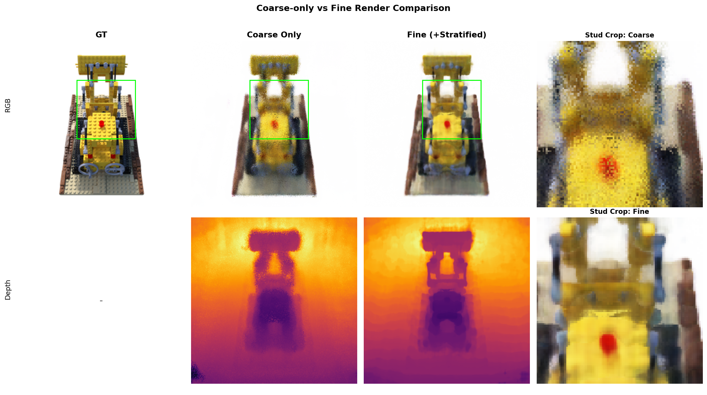

Figure 3.7에서 **Coarse-only**는 스터드 표면이 뭉개지고 노이즈처럼 보이는 반면, **Fine stage** 추가 시 coarse weight가 높은 구간에 샘플을 집중시키면서 스터드 경계가 더 또렷해지고 depth map에서도 바닥과 포크레인의 경계가 더 명확하게 구분된다.

가장 눈에 띄는 변화는 floater 감소다. 측면 저각도 뷰(el=13°)의 depth map에서 Baseline이랑 +ViewDir에서 공중에 떠 있던 artifact들이 +C2F부터 사라진다. 균일 샘플링에서는 물체 표면 근처와 빈 공간에 동일한 수의 샘플이 배분되다 보니 빈 공간의 density가 불안정하게 학습되는 경우가 있는데, C2F는 coarse weight가 낮은 구간(빈 공간)에는 fine 샘플을 거의 보내지 않아서 이 문제가 자연스럽게 줄어든다.

**Figure 3.8. Depth map 비교 — 측면 저각도 시점 (5개 모델)**

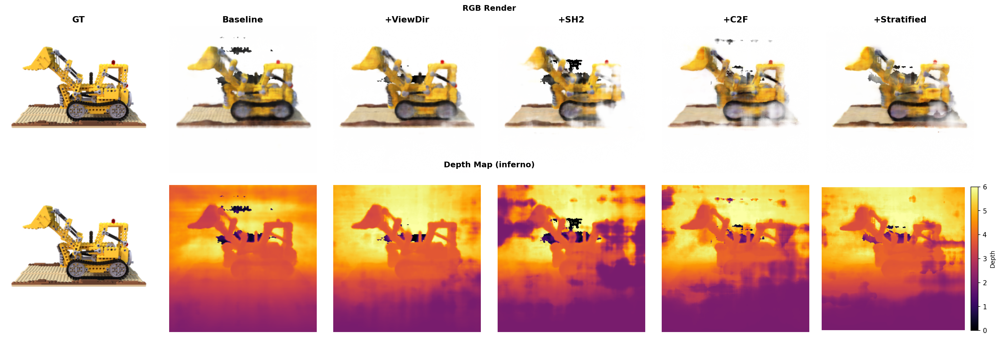

Figure 3.8에서 Baseline과 +ViewDir의 depth map에는 검은 floater artifact가 광범위하게 분포하지만, +C2F부터 depth map이 급격히 안정화되고 floater가 거의 소실된다. 이는 C2F의 집중 샘플링이 빈 공간의 불안정한 density 추정을 억제한 결과이다.

전체 PSNR은 SH2(22.44 dB) 대비 **−1.02 dB**로 오히려 하락했다. C2F의 coarse stage는 **32개 균일 샘플**만으로 density를 추정하므로 baseline의 64개보다 초기 표현력이 낮고, fine stage의 집중 샘플링으로도 이를 완전히 회복하지 못한다. 실제로 32-uniform baseline은 64-uniform 대비 val PSNR이 1.97 dB 낮아(**부록 D**), 이 영역에서 sample 수가 품질에 결정적임을 확인할 수 있다. C2F가 유리한 상황은 샘플 수가 제한적일 때인데, 여기서는 baseline이 이미 64개를 고르게 배분하고 있어 계층적 전략의 이점이 드러나지 않는다.

대신 MLP가 2개가 되면서 파라미터는 **44,444 → 88,888**(2배), FPS는 **1.63 → 0.71**(절반 이하), VRAM은 **116 → 239 MB**로 늘었다.

---

### 3.4 개선 과제 4: Fine Stage Stratified Sampling

#### 구현 내용

Fine stage의 inverse CDF sampling에서 각 bin 내부에 random offset을 추가한다.

$$u_i = \frac{i}{N} + \epsilon_i, \quad \epsilon_i \sim \text{Uniform}\left(0, \frac{1}{N}\right)$$

- 학습 중: stratified (`det=False`) — banding 감소
- 평가/inference: deterministic (`det=True`) — 재현성 보장

#### 정량 결과

| 모델 | PSNR | ΔPSNR | SSIM | LPIPS | FPS | VRAM | Params |
|------|-----:|------:|-----:|------:|----:|-----:|-------:|
| +C2F (det) | 21.42 dB | — | 0.8117 | 0.2195 | 0.71 | 239 MB | 88,888 |
| **+Stratified** | **21.93 dB** | **+0.51** | **0.8176** | **0.2107** | **0.70** | **248 MB** | **88,888** |

#### 분석

**Banding artifact 감소**: Deterministic fine sampling은 ray 위 특정 위치에 sample이 고정되는 banding 경향이 있다. Stratified에서는 각 bin 내 random offset으로 이를 완화한다. 특히 지면·트랙 표면의 반복 패턴 영역에서 줄무늬 artifact가 감소한다.

**Figure 3.9. Stratified sampling 적용 효과 비교 — frame 30 (C2F vs +Stratified)**

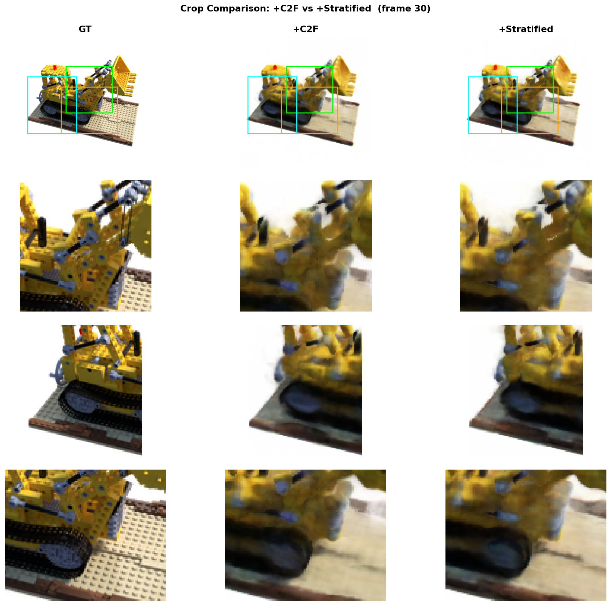

Figure 3.9에서 C2F(det) 결과에 나타나던 지면·트랙 반복 패턴의 줄무늬 banding artifact가 +Stratified에서 완화되고 표면이 더 균일하게 렌더됨을 확인할 수 있다. 따라서 bin 내 random offset이 고정 샘플 위치에서 발생하는 주기적 artifact를 효과적으로 억제한다.

**C2F 대비 개선**: C2F(21.42 dB) 대비 **+0.51 dB** 향상으로, stratified sampling이 deterministic C2F 대비 일관된 우위를 보인다. 학습 초기(< 10K iter)에는 random sampling으로 인해 loss가 불안정하나, 수렴 후에는 **banding artifact 감소**와 더 고른 ray coverage가 품질 향상으로 이어진다.

---

## 4. 3D Gaussian Splatting 실험

### 4.1 3DGS 방법론

#### 4.1.1 입력 데이터 구조

3DGS의 입력은 NeRF와 동일하게 **다시점 RGB 이미지 + 카메라 포즈**이다. 단, 표준 입력 형식이 COLMAP 포맷으로 고정되어 있다.

| 항목 | NeRF | 3DGS |
|------|------|------|
| 이미지 | RGB (+ alpha) | RGB |
| 카메라 포즈 | JSON (transforms.json) | COLMAP binary (cameras.bin / images.bin) |
| 초기화 | 없음 (random MLP weights) | **초기 3D point cloud** (sparse.bin 또는 직접 생성) |
| 배경 | alpha compositing | `--white_background` 플래그 |

가장 큰 차이는 **초기 3D point cloud**다. NeRF는 MLP 가중치만 있으면 학습을 시작할 수 있지만, 3DGS는 Gaussian을 어디에 배치할지 결정하는 초기 포인트가 필요하다. 일반적으로 COLMAP SfM이 생성한 sparse point cloud를 사용하며, 본 실험에서는 GT 포즈를 활용해 13,708개 포인트를 직접 생성했다.

#### 4.1.2 Gaussian 표현

3DGS는 장면을 $N$개의 **3D Gaussian 집합**으로 표현한다. 각 Gaussian $G_k$는 다음 속성으로 정의된다:

| 속성 | 차원 | 설명 |
|------|-----:|------|
| 위치 $\mu$ | 3 | 3D 공간 중심 좌표 |
| 공분산 (크기 $s$ + 회전 $q$) | 3 + 4 | 타원체 형태 정의 (scale + quaternion) |
| 불투명도 $\alpha$ | 1 | 각 Gaussian의 투명도 |
| SH 계수 (색) | 27 | degree 2: $(2+1)^2 \times 3 = 27$차원, 방향 의존 색 |
| **합계** | **38** | Gaussian 1개당 float 수 |

> 본 실험은 NeRF의 SH degree 2 모델과 공정하게 비교하기 위해 3DGS도 **SH degree 2**로 학습했다. 3DGS 기본값인 degree 3(48 SH 계수, 합계 59 floats)은 표현력이 더 크지만, 과제 요구(SH2 기준 비교)에 맞춰 degree 2를 본문 기준으로 사용한다.

공분산 행렬은 직접 최적화하면 positive semi-definite 조건이 깨질 수 있으므로, 크기 벡터 $s$와 회전 쿼터니언 $q$로 분리해 표현한다:

$$\Sigma = RSS^TR^T$$

여기서 $R$은 $q$에서 변환한 회전 행렬, $S = \text{diag}(s)$이다. 이 분해로 최적화 중 항상 유효한 타원체 형태를 보장한다.

#### 4.1.3 렌더링: Tile-based Rasterization

NeRF는 ray marching으로 픽셀당 수십~수백 번 MLP를 호출하는 반면, 3DGS는 **rasterization(래스터화)** 방식으로 렌더링한다.

**렌더링 파이프라인:**

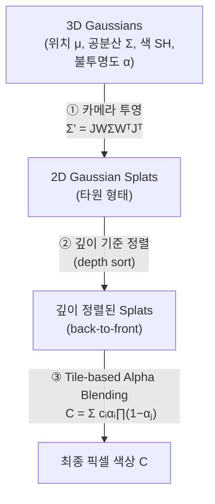
```mermaid
flowchart TD
    G["3D Gaussians
    (위치 μ, 공분산 Σ, 색 SH, 불투명도 α)"]

    P["2D Gaussian Splats
    (타원 형태)"]
    S["깊이 정렬된 Splats
    (back-to-front)"]
    C["최종 픽셀 색상 C"]

    G -->|"① 카메라 투영
    Σ' = JWΣWᵀJᵀ"| P
    P -->|"② 깊이 기준 정렬
    (depth sort)"| S
    S -->|"③ Tile-based Alpha Blending
    C = Σ cᵢαᵢ∏(1−αⱼ)"| C


```

**① 투영**: 3D Gaussian을 카메라 평면에 투영하면 2D 타원(splat)이 된다. 공분산 $\Sigma$를 투영 야코비안 $J$로 근사하면:

$$\Sigma' = J W \Sigma W^T J^T$$

**② 정렬**: 반투명 Gaussian을 올바르게 합성하려면 카메라 기준 깊이 순으로 back-to-front 정렬이 필요하다.

**③ Alpha Blending**: 정렬된 $N$개 Gaussian을 픽셀 위치 $p$에서 누적합산한다:

$$C(p) = \sum_{i=1}^{N} c_i \alpha_i \prod_{j=1}^{i-1}(1 - \alpha_j)$$

NeRF의 volume rendering 식과 구조가 동일하지만, **MLP 대신 미리 배치된 Gaussian**에서 $c_i$와 $\alpha_i$를 직접 읽어오므로 속도가 압도적으로 빠르다. 

또한 16×16 픽셀 단위의 tile로 화면을 분할해 각 tile에 영향을 주는 Gaussian만 처리함으로써 CUDA 병렬화를 극대화한다.

| 항목 | NeRF (ray marching) | 3DGS (rasterization) |
|------|---------------------|----------------------|
| 렌더링 단위 | ray (픽셀당 64샘플 × MLP) | splat (Gaussian → 픽셀) |
| 속도 병목 | MLP forward pass | depth sort |
| 해상도 의존성 | 픽셀 수에 비례 | Gaussian 수 + 픽셀 수 |
| FPS (256×256) | 0.7~2.5 | **328** |

#### 4.1.4 학습 구조

**손실 함수**

렌더링 결과 $\hat{C}$와 GT 이미지 $C$ 사이의 photometric loss를 최소화한다:

$$\mathcal{L} = (1 - \lambda) \mathcal{L}_1 + \lambda \mathcal{L}_\text{D-SSIM}, \quad \lambda = 0.2$$

NeRF가 MSE(L2) 손실을 쓰는 것과 달리 L1 + D-SSIM 조합을 사용해 구조적 품질을 함께 최적화한다.

**Adaptive Densification**

3DGS의 핵심 학습 전략은 Gaussian 수를 동적으로 조절하는 **adaptive densification**이다. 

매 100 iteration마다 각 Gaussian의 2D gradient 누적값(뷰 공간 위치 기울기)을 검사해 세 가지 작업을 수행한다:

| 조건 | 작업 | 목적 |
|------|------|------|
| gradient 크고 + Gaussian 작음 | **Clone** (복제) | 세밀한 영역 표현 강화 |
| gradient 크고 + Gaussian 큼 | **Split** (분리) | 큰 Gaussian을 작은 2개로 세분화 |
| 불투명도 $\alpha < \epsilon$ | **Prune** (제거) | 불필요한 floater 제거 |

이 과정을 통해 초기 13,708개이던 Gaussian이 학습 종료 시점에 **153,604개**로 증가했다. NeRF는 MLP 구조가 고정된 채 가중치만 업데이트되지만, 3DGS는 **장면 표현 자체(Gaussian 수·위치·형태)가 학습 중 변화**한다는 점이 근본적 차이다.

---

### 4.2 사용 Repository 및 구현

- **Repository**: [gaussian-splatting](https://github.com/graphdeco-inria/gaussian-splatting) (Kerbl et al., 2023)
- **주요 구현**: tile-based rasterization, adaptive Gaussian densification

NeRF Synthetic (lego)을 3DGS가 요구하는 COLMAP 포맷으로 직접 변환하였다.

**좌표계 변환** (NeRF → OpenCV):
```python
c2w[:, 1:3] *= -1   # Y(up→down), Z(back→front) 부호 반전
R_w2c = c2w[:3, :3].T
t_w2c = -R_w2c @ c2w[:3, 3]
```

**초기화 포인트**: COLMAP 특징점 매칭 대신 GT 포즈로 cameras.bin/images.bin을 직접 생성 (SfM 초기화 방식), 13,708 포인트.

### 4.3 학습 설정

| 항목 | 설정 |
|------|------|
| Scene | lego (NeRF Synthetic) |
| 해상도 | 256×256 |
| Train split | 100장 (NeRF와 동일) |
| Test split | 200장 (NeRF와 동일) |
| Iterations | 30,000 |
| SH degree | **2** (NeRF SH2와 공정 비교, 27 coefficients/Gaussian) |
| 배경 | white (`--white_background`) |
| 초기 Gaussians | 13,708개 (SfM init) |
| 최종 Gaussians | 153,604개 |

```bash
python train.py \
  -s data/lego_colmap \
  -m results/3dgs_lego_256_sh2 \
  --resolution 256 \
  --white_background \
  --sh_degree 2 \
  --iterations 30000
```

### 4.4 Evaluation 설정

- 동일 test 200장, 동일 해상도(256×256)
- PSNR, SSIM, LPIPS(VGG backbone)

> **구현 주의사항**: gaussian-splatting의 `Camera` 클래스는 R_c2w를 입력받고 내부에서 `.T`로 R_w2c를 생성한다. 초기 구현에서 R_w2c를 직접 전달하는 버그로 10.96 dB → 수정 후 정상 수준(34 dB대)으로 개선됐다.

### 4.5 정량 결과

> 평가 조건: lego test set 256×256 / 200장 / LPIPS VGG backbone / GPU: NVIDIA RTX 4070 (12 GB) / SH degree 2

| 지표 | 값 |
|------|----|
| PSNR ↑ | **34.38 dB** |
| SSIM ↑ | **0.9870** |
| LPIPS ↓ | **0.0113** |
| Train Time | ~7분 (30,000 iter) |
| Render FPS | 328 |
| VRAM (inference) | 204 MB |
| Model (Gaussians) | 153,604개 (~24 MB) |

> 참고: 3DGS 기본값 SH degree 3로도 학습한 결과 PSNR 34.66 / SSIM 0.9874 / LPIPS 0.0108로 degree 2(34.38)와 사실상 동일했다. 본문은 NeRF SH2와의 공정 비교를 위해 **degree 2** 결과를 기준으로 한다.

### 4.6 정성 결과

3DGS 렌더링 결과를 세 시점(정면 상단 / 중간 뷰 / 측면 저각도)으로 확인한다.

**Figure 4.1. 3DGS 렌더링 — frame 0 (정면 상단)**

| Rendered | GT |
|:---:|:---:|
|  |  |

**Figure 4.2. 3DGS 렌더링 — frame 40 (중간 뷰)**


**Figure 4.3. 3DGS 렌더링 — frame 80 (측면 저각도)**


Figure 4.1~4.3에서 3DGS는 정면·중간 시점뿐 아니라 학습 뷰가 드문 측면 저각도(frame 80) 시점에서도 스터드 표면, 무한궤도 링크, 암 관절의 디테일을 선명하게 재현한다. 동일 시점에서 NeRF 계열 모델이 floater artifact와 경계 뭉개짐을 보이는 것과 대조적이다. 이는 explicit Gaussian representation이 각 가우시안의 위치·크기·방향을 직접 최적화하므로 surface geometry를 더 정확하게 포착하기 때문이다.

---

## 5. Results

### 5.1 정량 지표 (Ablation Study 전체 표)

> 평가 조건: lego test set 256×256 / 200장 / LPIPS VGG backbone / GPU: NVIDIA RTX 4070 (12 GB)

| Method | ViewDir | SH | C2F | Strat | PSNR ↑ | SSIM ↑ | LPIPS ↓ | Train | FPS ↑ | VRAM | Params |
|--------|:-------:|:--:|:---:|:-----:|-------:|-------:|--------:|------:|------:|-----:|-------:|
| Baseline NeRF | ✗ | — | ✗ | ✗ | 22.72 | 0.8335 | 0.1870 | ~6분 | 2.54 | 104 MB | 37,508 |
| +View Direction | ✓ | — | ✗ | ✗ | 22.68 | 0.8381 | 0.1906 | ~8분 | 1.75 | 130 MB | 44,516 |
| +SH (degree 2) | ✓ | 2 | ✗ | ✗ | 22.44 | 0.8355 | 0.1915 | ~8분 | 1.63 | 116 MB | 44,444 |
| +Coarse-to-Fine | ✓ | 2 | ✓ | ✗ | 21.42 | 0.8117 | 0.2195 | ~15분 | 0.71 | 239 MB | 88,888 |
| **+Fine Stratified** | **✓** | **2** | **✓** | **✓** | **21.93** | **0.8176** | **0.2107** | **~15분** | **0.70** | **248 MB** | **88,888** |
| **3DGS** | ✓ | 2 | — | — | **34.38** | **0.9870** | **0.0113** | **~7분** | **328** | **204 MB** | **153,604 Gauss.** |

3DGS(SH degree 2)는 PSNR **34.38 dB**, SSIM **0.9870**, LPIPS **0.0113**로 최종 NeRF 모델(+Stratified, 21.93 dB)보다 PSNR 기준 **+12.45 dB**, FPS 기준 **470배** 빠른 압도적인 성능을 보인다. 학습 시간은 3DGS **~7분**, NeRF +Stratified **~15분**으로 약 2배 차이이며, 품질·렌더 속도만큼 압도적인 격차는 아니다.

반면 VRAM은 **204 MB**로 단순 NeRF 모델(104 MB)의 약 2배를 사용한다. 이는 3DGS가 장면을 **153,604개의 Gaussian**으로 명시적(explicit)으로 GPU 메모리에 저장하기 때문이다. 각 Gaussian은 위치(3), 크기(3), 회전(4), 불투명도(1), SH 계수(degree 2 → 27) 등 **38개의 float 값**을 가지며, 이 모든 속성이 렌더링 시 GPU에 상주해야 한다. NeRF는 MLP 가중치만 VRAM에 올리면 되는 반면, **3DGS는 장면 복잡도(Gaussian 수)에 비례해 VRAM이 선형 증가**하므로 복잡한 실외 장면에서는 수 GB에 달할 수 있다.

### 5.2 학습 Curve 비교

**Figure 5.1. Baseline 학습 곡선 (MSE Loss / Train·Val PSNR)**


Figure 5.1에서 Baseline의 Training Loss는 초기 0.012에서 약 20k iteration 이내에 0.005 수준으로 급격히 감소한 뒤 이후 완만하게 수렴한다. PSNR curve에서는 train과 val이 거의 동일한 궤적으로 상승하여 100k 시점에서 약 23 dB에 도달하며, train/val 격차가 크지 않아 과적합 없이 안정적으로 학습됐음을 확인할 수 있다.

**Figure 5.2. +Stratified 학습 곡선 (MSE Loss / Train·Val PSNR)**


+Stratified 모델의 Training Loss는 Baseline 대비 초기값이 0.044로 약 3.7배 높게 시작한다. 이는 C2F 구조에서 loss가 $\mathcal{L}_{\text{coarse}} + \mathcal{L}_{\text{fine}}$ 합산으로 계산되기 때문이다. PSNR curve에서 특이한 점은 val PSNR(주황)이 train PSNR(파랑)보다 전 구간에서 높게 유지된다는 것인데, train PSNR은 합산 loss에서 역산되어 실제 렌더 품질보다 낮게 측정되는 반면 val PSNR은 실제 렌더링 이미지로 측정되기 때문이다. val PSNR은 5k iteration 시점 18.6 dB에서 시작해 100k에서 22.3 dB까지 꾸준히 상승한다. Baseline 대비 수렴이 느리고 학습 초기 불안정성이 크지만, 최종 val PSNR은 유사한 수준에 도달한다.

### 5.3 Qualitative Comparison

**Figure 5.3. Depth Map 비교 — 정면 상단 시점 (GT + 5개 모델 RGB·Depth)**

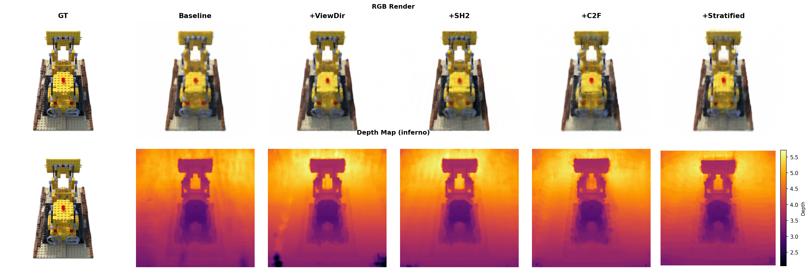

Figure 5.3에서 정면 뷰(front top)는 5개 모델 모두 RGB 외관이 유사하게 보이지만 depth map에서 차이가 드러난다. Baseline과 +ViewDir의 depth map에는 포크레인 상단과 배경 경계 부근에 검은 반점(floater)이 산발적으로 나타난다. +SH2부터 artifact가 줄어들고, +C2F와 +Stratified에서는 depth map이 매끄러워지며 물체와 배경의 경계가 명확하게 구분된다.

**Figure 5.4. Depth Map 비교 — 측면 저각도 시점 (GT + 5개 모델 RGB·Depth)**


Figure 5.4에서 측면 저각도(el=13°)는 차이가 더욱 두드러진다. Baseline과 +ViewDir의 RGB 렌더에서 배경과 물체 경계 주변에 검은 artifact가 분명히 보이며, depth map에서도 같은 영역에 불규칙한 검은 패치가 광범위하게 분포한다. +C2F부터 RGB 렌더가 눈에 띄게 깔끔해지며 depth map의 floater가 거의 소실된다. Figure 5.3에서 정면 뷰에서는 PSNR 수치 차이가 작더라도, Figure 5.4처럼 저각도 측면처럼 학습 뷰가 드문 시점에서는 C2F의 geometry 표현력 향상 효과가 depth map에서 명확하게 확인된다.

**Figure 5.5. 360° 궤도 비교 GIF (Baseline vs +Stratified)**

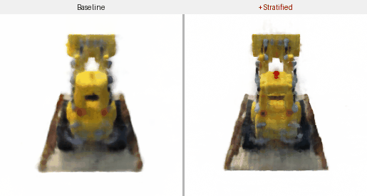

Figure 5.5에서 Baseline(좌)과 +Stratified(우)를 360° 궤도로 비교하면, 정면 구간(0°~60°)에서는 두 모델의 차이가 크지 않다. 그러나 측면 및 후면 구간(90°~270°)으로 이동할수록 Baseline에서 포크레인 암·힌지 부위의 디테일이 흐릿해지고 배경과 경계가 뭉개지는 경향이 나타나는 반면, +Stratified는 상대적으로 선명한 경계와 구조를 유지한다. 특히 저각도 구간에서 Baseline에 산발적인 floater가 관찰되고, +Stratified에서는 이것이 줄어드는 것을 확인할 수 있다.

### 5.4 Crop Comparison

**Figure 5.6. NeRF vs 3DGS Crop 비교 — frame 0, 정면**

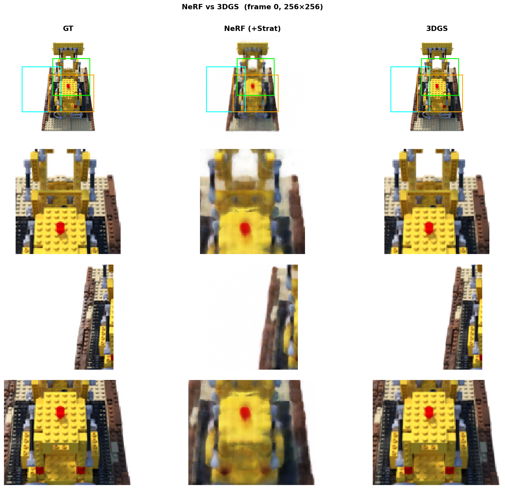

frame 0(정면 위에서 내려다보는 뷰)에서 NeRF는 상단 스터드 영역이 전체적으로 뭉개져 개별 스터드가 구분되지 않고 노란 덩어리처럼 보인다. 암 관절과 차체 연결부의 회색 부품도 NeRF에서는 노랗게 물들어 색 구분이 어렵다. 반면 3DGS는 GT와 거의 동일하게 개별 스터드 형태가 선명하고 회색 연결부품의 색도 정확하게 재현된다. 따라서 같은 해상도(256×256)에서도 명시적 표현 방식인 3DGS가 암묵적 MLP 기반 NeRF보다 세밀한 geometry와 색 재현에서 명확히 우월하다.

**Figure 5.7. NeRF vs 3DGS Crop 비교 — frame 40, 측면**

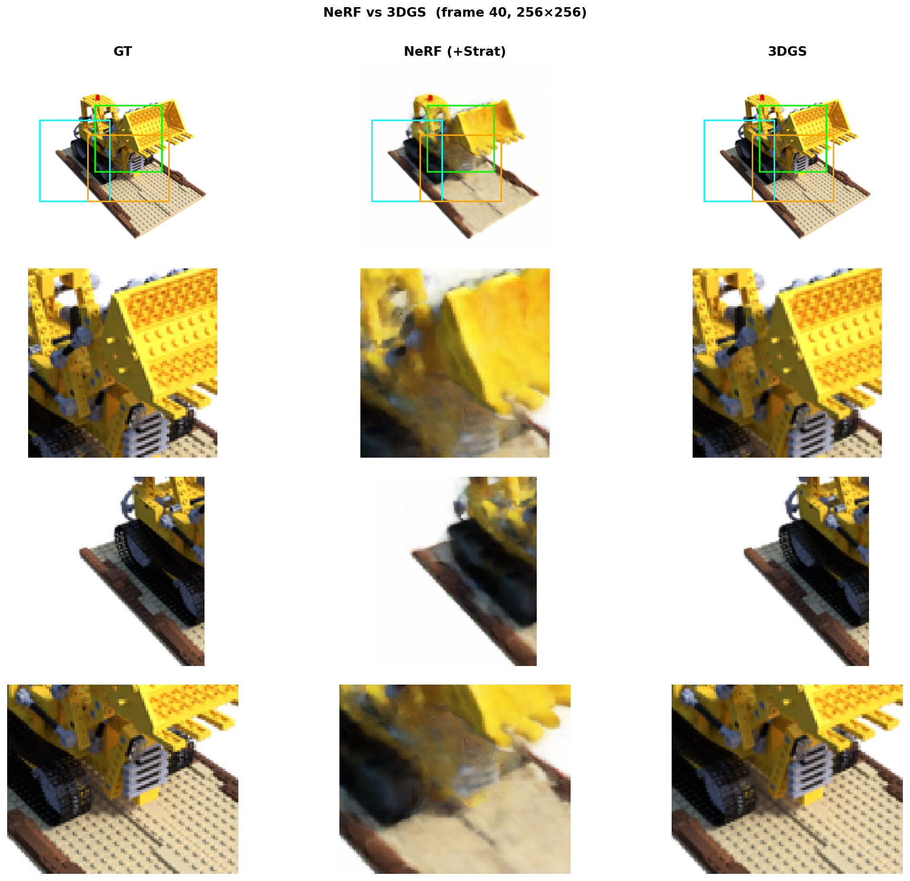

frame 40(측면 뷰)에서는 버킷 경계와 무한궤도(tread) 질감 차이가 두드러진다. NeRF는 버킷과 암의 경계가 흐릿하게 번지고, 특히 암과 차체 연결 부위가 노란 blur로 덮여 구조를 알아보기 어렵다. 3DGS는 버킷 경계가 날카롭고, 무한궤도의 개별 링크 패턴이 GT에 가깝게 재현된다. 이 뷰는 학습 데이터에서 자주 등장하는 각도임에도 NeRF가 blur를 보이는데, 이는 MLP가 고주파 질감을 충분히 인코딩하지 못하는 한계를 반영한다.

**Figure 5.8. NeRF vs 3DGS Crop 비교 — frame 80, 측면 하단 (저각도)**

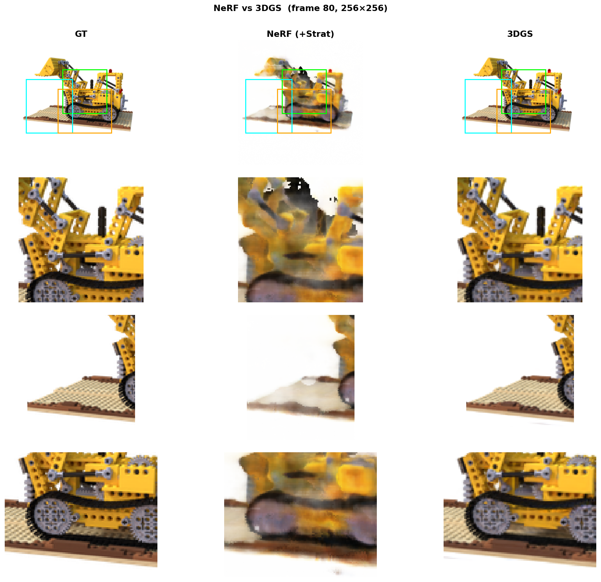

frame 80(저각도 측면 하단)에서 NeRF와 3DGS의 차이가 가장 극적으로 나타난다. NeRF 렌더에서는 암 관절 영역에 검은 floater와 함께 노란·회색이 뒤섞인 심각한 artifact가 발생하여 물체의 구조 자체를 알아보기 어렵다. 이 뷰는 학습 데이터에 드물게 포함되는 저각도 시점으로, NeRF MLP가 해당 방향에 대한 density를 불안정하게 학습하여 floater가 발생한다. 3DGS는 동일 시점에서도 암 구조, 무한궤도, 지면 질감이 GT와 유사하게 깔끔하게 렌더된다. 따라서 학습 분포 밖 시점(out-of-distribution view)에서의 일반화 능력에서도 3DGS가 NeRF보다 현저히 우수하다.

### 5.5 NeRF 임의 해상도 렌더링 검증

Baseline NeRF 모델을 **재학습 없이** 4개 해상도(64×64 / 128×128 / 256×256 / 512×512)로 렌더링했다. 각 해상도에서 동일한 FoV를 유지하도록 focal length를 비례 조정했다.

**Figure 5.9. NeRF 임의 해상도 렌더링 비교 (재학습 없음)**

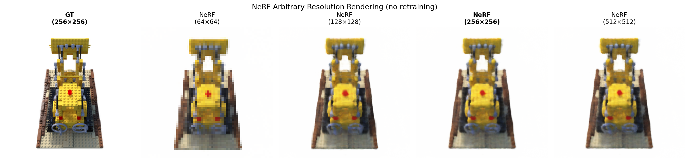

**Figure 5.10. 스터드 부위 Crop 확대 — 해상도별 디테일 비교**

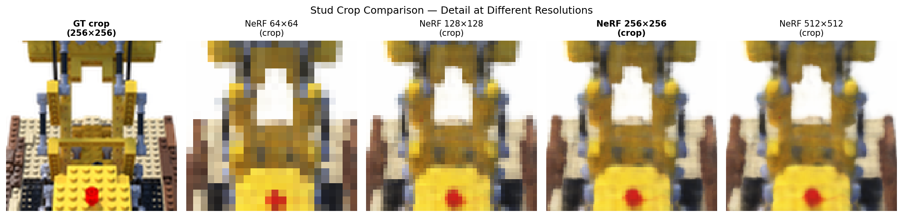

Figure 5.9에서 동일한 모델 가중치로 64×64부터 512×512까지 재학습 없이 렌더링할 수 있음을 확인했다. Figure 5.10의 crop에서 64×64는 스터드 형태 자체는 인식되지만 디테일이 뭉개지고, 512×512에서는 학습 해상도를 넘어 더 세밀한 픽셀 격자로 렌더되지만 선명도가 비례해 개선되지는 않는다. NeRF의 연속 함수 특성이 **해상도 유연성**을 제공하지만, **렌더링 품질의 상한은 학습 해상도에 수렴**함을 보여준다.

### 5.6 OOD 시점에서 NeRF vs 3DGS 비교

학습 데이터에 포함되지 않은 극단 시점 3개(후면 θ=180° / 하단 φ=+70° / 후면+하단 복합)에서 NeRF와 3DGS를 렌더링해 각 표현 방식의 일반화 능력을 비교했다.

**Figure 5.11. OOD 시점 렌더링 비교 (NeRF vs 3DGS)**

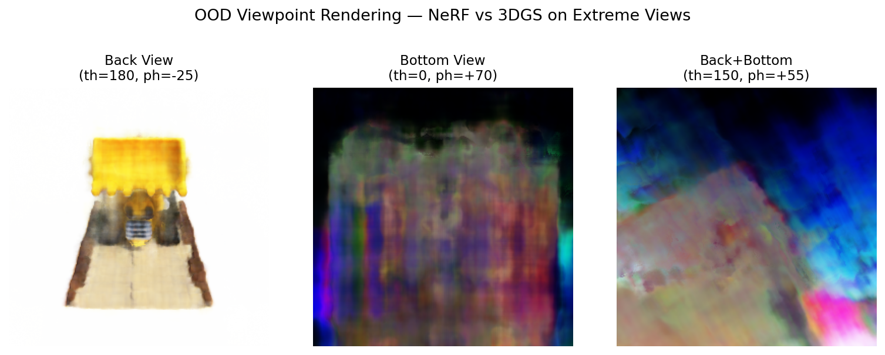

Figure 5.11에서 NeRF(+Stratified)는 극단 시점에서도 MLP가 density를 추정해 전체 이미지를 채우지만, 학습 분포에서 벗어날수록 artifact와 흐릿함이 증가한다. 3DGS는 정면·측면에서 선명하게 렌더하지만, 학습 시 거의 관찰되지 않은 하단(φ=+70°)이나 후면+하단 복합 시점에서 Gaussian이 부재한 영역이 드러난다. 이 결과는 implicit 연속 함수인 NeRF가 OOD 시점 일반화에서, explicit Gaussian인 3DGS가 학습 분포 내 품질에서 각각 구조적 강점을 가짐을 보여준다.

---

## 6. Discussion

### 6.1 어떤 기법이 가장 큰 향상을 보였는가?

누적 ablation 기준 각 기법 추가 시 PSNR/SSIM/LPIPS 변화:

| 기법 | ΔPSNR | ΔSSIM | ΔLPIPS | 핵심 효과 |
|------|------:|------:|-------:|----------|
| +View Direction | −0.04 dB | +0.005 | +0.004 | 방향 의존 색 표현 (specular 영역) |
| +SH (degree 2) | −0.24 dB | −0.003 | +0.001 | 해석 가능한 방향 의존 색 표현 |
| +Coarse-to-Fine | −1.02 dB | −0.024 | +0.028 | Floater 제거, geometry 정확도 향상 |
| **+Stratified** | **+0.51 dB** | **+0.006** | **−0.009** | **Banding artifact 감소, 고른 ray coverage** |

PSNR 기준으로는 **+Stratified가 유일하게 양의 기여(+0.51 dB)**를 보였다. ViewDir, SH2, C2F는 각각 −0.04, −0.24, −1.02 dB로 하락했는데, 이는 **Baseline이 이미 64 uniform samples로 강한 수준을 확보하고 있었기 때문**이다. 동일한 100K iteration과 N_rand=1024 조건에서 기법별 이점이 PSNR로 완전히 발현되지 않았다. 이 해석은 샘플 수를 32개로 줄이면 동일 기법이 뚜렷한 PSNR 이득(누적 +0.77 dB)을 회복한다는 별도 실험으로 실증된다(**부록 D**).

단, PSNR 하락이 품질 저하를 의미하지는 않는다. C2F는 PSNR −1.02 dB 하락에도 불구하고 **depth map에서 floater가 완전히 소실**되어 pixel 단위 MSE로 포착되지 않는 geometry 품질이 실질적으로 향상됐다. ViewDir와 SH2는 specular 재질 영역에서 정성적 개선이 있지만 대부분 diffuse인 lego 장면에서 PSNR 기여가 제한적이다.

### 6.2 방법론 비교: NeRF vs 3DGS

두 방법의 근본적 차이는 **장면을 어떻게 저장하느냐**이다.

> **NeRF**: 장면 = MLP 가중치 (함수)  
> **3DGS**: 장면 = Gaussian 집합 (데이터 포인트)

#### 표현 방식: Implicit vs Explicit

| | NeRF | 3DGS |
|--|------|------|
| 저장 형태 | MLP 가중치 (~350 KB) | Gaussian 속성 배열 (~24 MB) |
| 임의 좌표 쿼리 | ✅ 가능 (연속 함수) | ❌ 불가 (Gaussian 없는 영역은 공백) |
| 임의 해상도 렌더링 | ✅ 재학습 없이 가능 (Section 5.5) | ⚠️ 해상도 변경 시 재학습 필요 |
| OOD 시점 일반화 | ✅ density 추정으로 전 방향 커버 (Section 5.6) | ❌ 미관찰 시점에서 Gaussian 부재 |
| 장면 복잡도 의존 | 낮음 (MLP 크기 고정) | 높음 (복잡할수록 Gaussian 수 ↑ → VRAM ↑) |

#### 렌더링: Ray Marching vs Rasterization

- **NeRF**: 픽셀마다 ray를 쏘고 ray 위 64포인트에서 MLP를 호출해 색을 합산 → **0.7~2.5 FPS**
- **3DGS**: Gaussian을 화면에 투영(splatting)해 픽셀에 겹치는 Gaussian만 alpha blending, GPU tile 병렬화 → **328 FPS**

### 6.3 Trade-off 및 활용 가이드

| 차원 | NeRF (+Strat) | 3DGS |
|------|:---:|:---:|
| 품질 (PSNR) | 21.93 dB | **34.38 dB** |
| Render 속도 | 0.70 FPS | **328 FPS** |
| Train 속도 | ~15분 | **~7분** |
| Model 크기 | **~350 KB** | ~24 MB |
| VRAM | **248 MB** | 204 MB |

품질(+12.45 dB)과 렌더 속도(470배)에서는 3DGS가 압도적이지만, 학습 시간은 ~7분 vs ~15분으로 약 2배 차이에 그친다. NeRF가 실질적으로 유리한 경우는 세 가지다: **메모리 제약이 극심한 환경**(모델 크기 100배 작음), **임의 해상도 렌더링이 필요한 경우**(재학습 없이 가능, Section 5.5), **OOD 시점 커버리지가 중요한 경우**(연속 함수 특성, Section 5.6). 그 외 고품질 novel view synthesis와 실시간 렌더링이 필요한 상황에서는 3DGS가 명확히 우월하다.

### 6.4 원본 NeRF vs 3DGS: 논문 수치 기반 비교

원본 NeRF 논문의 학습 조건(hidden 256, batch 4096 rays, $N_c=64+N_f=128$ 샘플, 100–300K iteration)을 그대로 재현하려면 단일 V100 GPU 기준 1–2일이 소요된다. 

본 과제에서는 이를 직접 재현하기 어려운 현실적 제약 속에서 Tiny NeRF(hidden 64, 1024 rays, 100K iter)를 활용하였으며, Tiny NeRF(+Stratified)와 3DGS 모두 **수 분 단위의 짧은 학습 시간(각각 ~15분, ~7분)**으로 학습된다. 원본 NeRF의 1–2일과 비교하면 두 방법 모두 같은 '수 분~수십 분' 스케일에 있으며, 이 조건에서 3DGS는 PSNR 기준 +12.45 dB라는 압도적인 우위를 보였다.

그렇다면 원본 NeRF 논문의 결과와 3DGS를 비교하면 어떨까? 

원본 NeRF 논문(Mildenhall et al., 2020)은 Realistic Synthetic 360° 데이터셋(Lego 포함)에서 **PSNR 31.01 dB, SSIM 0.947, LPIPS 0.081**을 보고하며, *"optimization for a single scene typically takes around 100–300K iterations to converge on a single NVIDIA V100 GPU (about 1–2 days)"* 라고 명시되어 있다.

이를 표 형태로 정리하면 아래와 같다.

| | 원본 NeRF (논문) | 3DGS (본 실험) |
|---|:---:|:---:|
| PSNR | 31.01 dB | **34.38 dB** |
| SSIM | 0.947 | **0.9870** |
| LPIPS | 0.081 | **0.0113** |
| 학습 시간 | 1–2일 (V100) | **~7분 (RTX 4070)** |
| 렌더 속도 | ~수 초/frame | **328 FPS** |

원본 NeRF와 3DGS의 PSNR 격차는 약 **3.37 dB**로, Tiny NeRF 대비 격차(12.45 dB)보다 현저히 줄어든다. "원본 NeRF와 3DGS는 품질이 어느 정도 비슷하다"는 인식은 이 수치에서 비롯된다. 그러나 GPU 세대 차이를 감안해도 학습 시간은 수백 배 차이이며, 품질에서도 3DGS가 여전히 앞선다. 즉 3DGS는 "빠른 대안"이 아니라 **더 빠르게, 더 높은 품질**을 동시에 달성하는 훨씬 고성능의 방법이다.

---

## 7. Conclusion

### 7.1 핵심 발견 3가지

1. **Stratified sampling이 유일하게 양의 PSNR 기여(+0.51 dB)를 보였다**. ViewDir(−0.04), SH2(−0.24), C2F(−1.02)는 누적 ablation 기준 PSNR을 하락시켰는데, 이는 Baseline이 이미 64 uniform samples로 강한 수준을 확보하고 있었기 때문이다. 이에 대한 근거는 부록의 D에 나와있다. C2F는 PSNR −1.02 dB에도 불구하고 depth map에서 floater가 완전히 소실되어 pixel-level MSE로 포착되지 않는 geometry 품질이 실질적으로 향상됐다.

2. **View Direction과 SH의 효과는 재질 특성에 크게 의존한다**. Lego처럼 대부분 diffuse 재질인 scene에서 PSNR 기여가 0 dB 내외에 그쳤으나, specular 재질이 많은 scene에서는 효과가 수 dB에 달할 것으로 예상된다. 연속 함수로서 임의 해상도 렌더링이 가능하다는 NeRF의 구조적 특성도 실험적으로 확인됐다(Section 5.5).

3. **3DGS는 렌더링 속도(470배)와 품질(+12.45 dB) 모두에서 압도적 우위를 보인다**(동일 SH degree 2 조건). 학습 시간은 3DGS ~7분, NeRF +Stratified ~15분으로 약 2배 차이에 그쳐 품질·속도만큼의 격차는 아니다. NeRF가 앞서는 것은 model 크기(350 KB vs 24 MB)와 OOD 시점 일반화이며, 후자는 explicit representation인 3DGS가 미관찰 시점에서 Gaussian 부재 영역을 드러내는 구조적 한계와 대비된다(Section 5.6).

### 7.2 한계점

- **모델 용량**: hidden 64 units (37K~88K params)는 논문 원본(256 units, 1.2M params) 대비 스터드 등 고주파 디테일 표현 불가
- **렌더링 속도**: 0.70 FPS로 real-time 응용 불가 (3DGS 328 FPS 대비)
- **SH degree 제한**: NeRF·3DGS 모두 degree 2까지만 사용해 고차 specular 표현은 제한적 (3DGS 기본값 degree 3 대비 표현력 여유 존재)

### 7.3 추가 개선 방향

- **Instant-NGP** 방식의 hash encoding 적용으로 학습 속도 10~100배 단축
- **hidden units 확장** (128~256): scale 실험에서 h128 100K가 25.46 dB, h256 100K가 24.92 dB로 향상 확인 (단, 학습 시간 급증)
- **SH degree 3 확장**: NeRF·3DGS 모두 degree 3로 올려 고차 specular 표현력 비교
- **더 다양한 Scene 실험**: specular가 많은 scene(materials, drums)에서 ViewDir/SH 효과 재검증

---

## 부록

### A. 실험 환경

| 항목 | 내용 |
|------|------|
| GPU | NVIDIA RTX 4070 (12 GB VRAM) |
| Framework | Keras (TensorFlow backend) / PyTorch (3DGS) |
| Python | 3.11 |
| CUDA | 12.x |
| OS | Ubuntu (Linux 6.8.0) |

### B. 독립 Ablation 실험 결과

각 기법을 baseline에 단독 적용한 실험 (100K iter, val 5장):

| 실험 | Val PSNR | 비고 |
|------|----------|------|
| Baseline | 21.14 dB | 위치 인코딩만 |
| SH2 (단독) | **22.45 dB** | SH만 단독 적용 |
| C2F (단독) | 22.21 dB | C2F만 단독 적용 |
| C2F+Strat (단독) | 22.24 dB | C2F+Stratified 단독 |

### C. Scale 실험 결과 (참고)

모델 크기가 품질에 미치는 영향 탐색 (모든 기법 적용, 100K iter):

| 모델 | hidden | Samples | Val PSNR | Train | VRAM |
|------|--------|---------|----------|-------|------|
| Tiny (본 과제) | 64 | 32+32 | 22.54 dB | ~15분 | 248 MB |
| Medium | 128 | 64+64 | **25.46 dB** | 61분 | 841 MB |
| Large | 256 | 64+128 | 24.92 dB | 164분 | 2,365 MB |

medium 모델(h128)이 학습 시간 대비 가장 효율적인 것으로 나타났다.

### D. 샘플 예산 의존성 (32-sample vs 64-sample)

본문 6.1에서 ViewDir·SH2·C2F가 64-sample baseline 대비 PSNR 이득이 작거나 음수였던 이유를 *"baseline이 이미 64 uniform sample로 충분히 강했기 때문"* 으로 설명했다. 이를 직접 검증하기 위해 동일한 기법을 **샘플 수만 32개로 줄여(`NUM_SAMPLES=32`)** 재학습하고 누적 비교했다.

| 모델 | 32-sample Val PSNR | 64-sample Val PSNR |
|------|:---:|:---:|
| Baseline (uniform) | 21.14 | 23.11 |
| +ViewDir | 21.66 (+0.52) | 23.96 (+0.85) |
| +SH2 | **21.91** (누적 +0.77) | 23.26 (누적 +0.15) |

> 모든 수치는 동일 조건(100K iter, val 5장) 기준. 본문 5.1의 정량표는 test 200장 PSNR이므로 절대값이 다르다.

두 가지가 드러난다.

1. **저예산일수록 기법 효과가 크다**: 기법 추가의 누적 PSNR 이득이 32-sample에서 **+0.77 dB**로, 64-sample(+0.15 dB)보다 5배 이상 크다. 특히 SH2는 32-sample에서 ViewDir 대비 **+0.25 dB 개선**되지만, 64-sample에서는 오히려 **−0.70 dB 하락**한다 — 샘플이 충분한 영역에서는 baseline이 이미 표현 한계에 가까워 추가 기법이 과적합 쪽으로 작용함을 보여준다.

2. **C2F의 PSNR 하락 해석을 뒷받침한다**: C2F의 coarse network는 32 sample만으로 density를 추정하는데, 32-uniform baseline(21.14)이 64-uniform(23.11)보다 **1.97 dB 낮다**는 점은 이 영역에서 sample 수가 품질에 결정적임을 보여준다. 즉 C2F가 fine stage로 보완해도 64-uniform baseline을 넘기 어려운 구조적 이유가 여기에 있으며, C2F의 가치는 PSNR이 아니라 floater 제거 등 geometry 품질에서 나타난다(Section 3.3, Figure 3.8).

### E. 발견된 버그

1. **eval_3dgs.py 회전행렬 버그**: `Camera(R=R_w2c)` → `Camera(R=R_c2w)` 수정 필요. gaussian-splatting Camera 클래스는 R_c2w를 입력받아 내부에서 `.T`로 R_w2c 생성. 수정 전 10.96 dB → 수정 후 정상 수준(34 dB대)으로 개선.
2. **points3D.ply 캐시**: 초기화 포인트 변경 후 반드시 캐시 삭제 필요.
3. **matplotlib `tostring_rgb` deprecated**: `FigureCanvasAgg.tostring_rgb()` → PIL `ImageDraw`로 대체.
