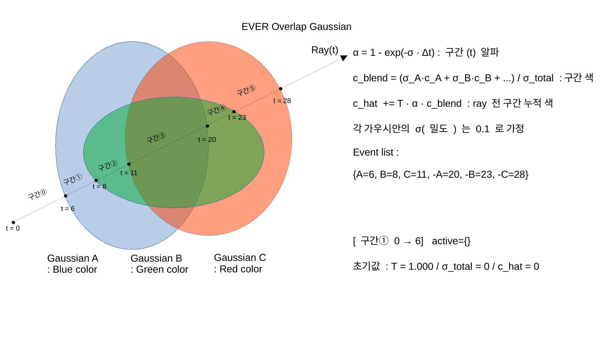
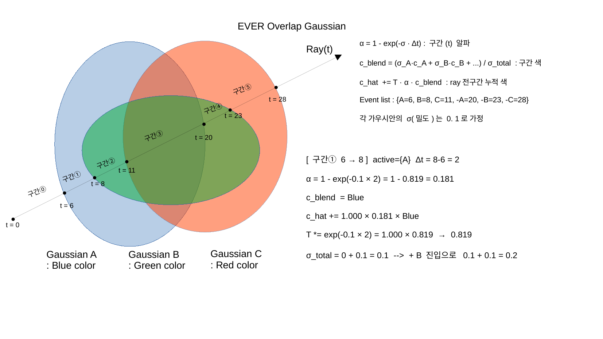
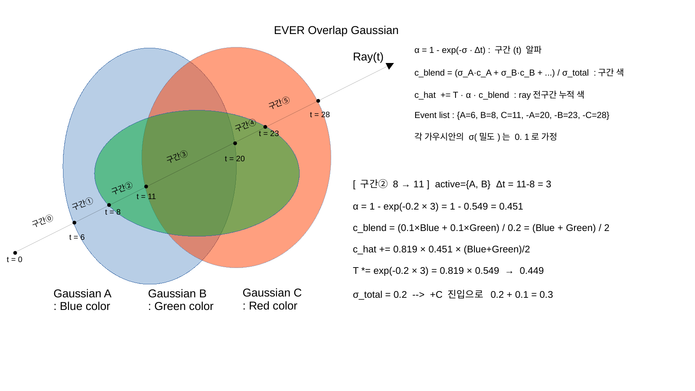
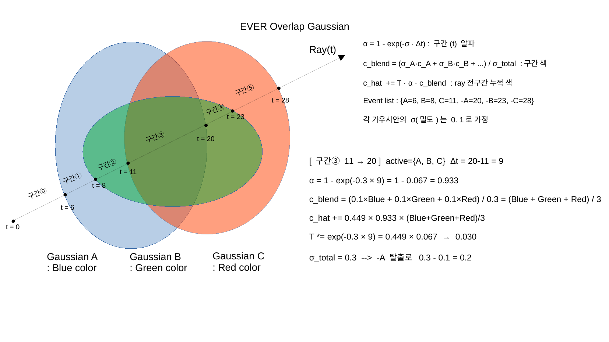
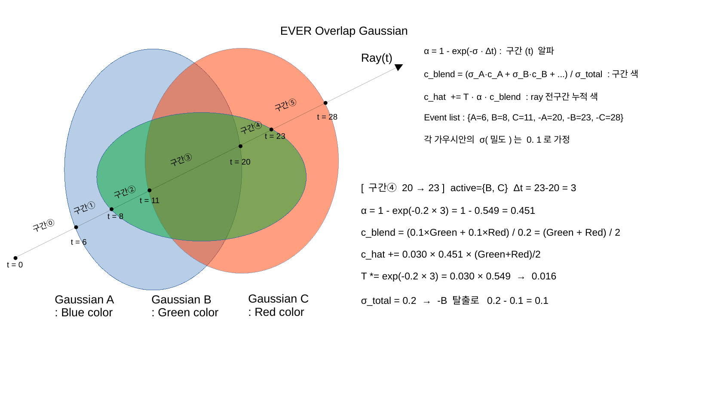
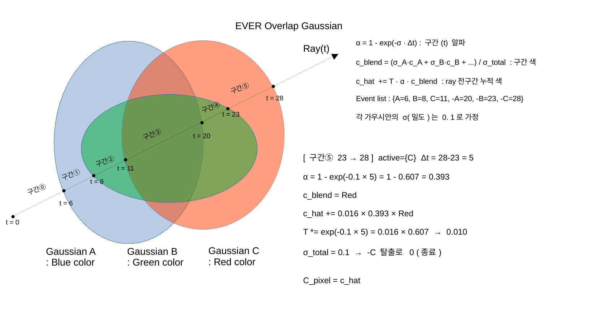

# update() — spline-machine.slang


## 전체 코드

```slang
[Differentiable]
SplineState update(
    in SplineState state,
    in ControlPoint ctrl_pt,
    no_diff in float t_min,
    no_diff in float t_max,
    no_diff in float max_prim_size)
{
  const float t = ctrl_pt.t;
  const float dt = max(t - state.t, 0.f);         // 이전 이벤트 ~ 현재 이벤트 구간 길이

  SplineState new_state;
  new_state.drgb = state.drgb + ctrl_pt.dirac;    // ★ 먼저 dirac 더함 (다음 구간용)
  new_state.t = t;

  float4 drgb = state.drgb;                       // ★ avg는 dirac 더하기 전 (현재 구간 활성 밀도)
  let avg = drgb;
  let area = max(avg.x * dt, 0.f);                // σ_total × Δt

  let rgb_norm = safe_div(float3(avg.y, avg.z, avg.w), avg.x);  // c_blend = density-weighted color

  new_state.logT = max(area + state.logT, 0.f);
  float alpha = -safe_expm1(-area);               // 1 - exp(-area) = α
  const float weight = clip(alpha * safe_exp(-state.logT), 0.f, 1.f);  // T · α
  new_state.C = state.C + weight * rgb_norm;      // c_hat += T · α · c_blend

  // depth 계산
  const float AREA_THRESHOLD = 1e-6f;
  float segment_depth_val;
  if (avg.x < AREA_THRESHOLD) {
      segment_depth_val = alpha * t + (1-alpha) * state.t;
  } else {
      segment_depth_val = safe_div(1.f, avg.x) * (-safe_expm1(-area))
                        - (t + t_min) * safe_exp(-area)
                        + (state.t + t_min);
  }
  const float segment_depth = max(segment_depth_val, 0.f);
  new_state.padding[0] = state.padding[0] + safe_exp(-state.logT) * segment_depth;

  // Distortion Loss 누적
  let m = tukey_power_ladder((new_state.t+state.t)/2 * PRE_MULTI, LADDER_P);
  new_state.distortion_parts.x = state.distortion_parts.x + 2 * weight * m * state.cum_sum.x;
  new_state.distortion_parts.y = state.distortion_parts.y + 2 * weight * state.cum_sum.y;
  new_state.cum_sum.x = state.cum_sum.x + weight;
  new_state.cum_sum.y = state.cum_sum.y + weight * m;

  return new_state;
}
```


## 핵심 설명

### 연결된 파일

| 방향 | 파일 | 설명 |
|------|------|------|
| 호출하는 쪽 | [03_rg_float.md](03_rg_float.md) | rg_float() while 루프에서 매 이벤트마다 호출 |
| 역전파 (bwd_diff) | [05_backward.md](05_backward.md) | backwards_kernel.slang의 run_update()에서 bwd_diff(update) |
| 입력 자료구조 | [01_SplineState.md](01_SplineState.md) | SplineState, ControlPoint 선언 |

---

### 역할 — 논문 Eq.4 대응

`update()` 한 번 호출 = **이벤트 하나를 처리** = 논문 Eq.4의 i번째 segment 기여 한 스텝.

$$C = \sum_i c_i \left(1 - e^{-\sigma_i \Delta t_i}\right) \prod_{j<i} e^{-\sigma_j \Delta t_j}$$

---

### PDF 표기 vs 코드 변수 대응

수식은 완전히 동일하며 변수 이름만 다르다.

| PDF 표기 | 코드 변수 | 위치 |
|---------|---------|------|
| `σ_total` | `avg.x` | `state.drgb.x` — 활성 Gaussian σ running sum |
| `σ_k · c_k` 합 | `avg.yzw` | `state.drgb.yzw` — 밀도 가중 color running sum |
| `c_blend` | `rgb_norm = avg.yzw / avg.x` | 밀도 가중 평균 색상 |
| `T` | `exp(-state.logT)` | 누적 transmittance |
| `α` | `alpha = 1 - exp(-area)` | 이 구간의 불투명도 |
| `c_hat +=` | `state.C +=` | 누적 픽셀 색상 |

**핵심 순서**: `avg`는 `ctrl_pt.dirac`을 더하기 **전** `state.drgb` 값이다.  
이벤트 이전 구간의 밀도로 적분하고, 이후 dirac을 더해 다음 구간을 준비한다.

---

### 수식 흐름 (한 이벤트 처리)

```
입력: state (이전까지 누적 상태), ctrl_pt (현재 이벤트: t, dirac)

dt       = ctrl_pt.t − state.t          ← 이전 이벤트 ~ 현재 이벤트 구간 길이
avg      = state.drgb                   ← ★ dirac 더하기 전 (현재 구간 활성 밀도)
area     = avg.x × dt                   ← σ_total × Δt  [PDF: σ · Δt]

alpha    = 1 − exp(−area)              ← α  [PDF: 구간 불투명도]
weight   = alpha × exp(−state.logT)   ← T · α  [PDF: T · α]
rgb_norm = avg.yzw / avg.x            ← c_blend  [PDF: 구간 색]

state.C    += weight × rgb_norm        ← c_hat += T · α · c_blend
state.logT += area                     ← T' = T × exp(−area)
state.drgb += ctrl_pt.dirac           ← σ_total 및 color running sum 갱신
```

---

### 구체적 예시 — A(Blue), B(Green), C(Red), σ=0.1

#### 씬 설정


---

#### 구간 구조



---

#### 구간① — active={A}



---

#### 구간② — active={A, B}



---

#### 구간③ — active={A, B, C}



---

#### 구간④ — active={B, C}



---

#### 구간⑤ — active={C}




---

### 함수 호출 경로 및 자료구조 동작 — PDF 예시 기준

```
// ─────────────────────────────────────────────
// 씬 데이터 (ctx.prims — GPU 전역, 모든 스레드 공유)
// ─────────────────────────────────────────────
prim_id : 0       1        2
means   : [posA,  posB,    posC  ]
scales  : [sA,    sB,      sC    ]
densities:[0.1,   0.1,     0.1   ]   // σ
features: [Blue,  Green,   Red   ]   // color

// tri 인코딩 규칙: entry = 2×prim_id+1,  exit = 2×prim_id+0
//   A_entry:tri=1  A_exit:tri=0
//   B_entry:tri=3  B_exit:tri=2
//   C_entry:tri=5  C_exit:tri=4


// ─────────────────────────────────────────────
// __raygen__rg_float()  — 이 픽셀 담당 GPU 스레드
// ─────────────────────────────────────────────

// [1] 초기화
SplineState state = {
    drgb : float4(0, 0, 0, 0),   // σ_total=0, color_sum=0
    logT : 0.0,                   // T = exp(-logT) = 1.000
    C    : float3(0, 0, 0),       // 누적 픽셀 색상
    t    : 0.0,                   // 마지막 처리 이벤트 t
}
// ray가 모든 Gaussian 밖에서 시작 → initial_drgb = (0,0,0,0)
state.drgb = initial_drgb[ray_idx]   // = (0, 0, 0, 0)


// [2] 스트리밍 루프 (6개 이벤트 < BUFFER_SIZE=16 → 루프 1회로 처리 완료)
while (state.logT < 5.54 && iter < max_iters):

    payload[32] = [(t=1e10, tri=∅)] × 16   // 빈 슬롯 초기화

    // ── optixTrace 호출 ──────────────────────────
    optixTrace(handle=ctx.gas.handle, start_t=0, tmax, payload)

        // BVH가 각 AABB 후보를 발견할 때마다 __intersection__ 자동 호출
        __intersection__(prim_id=0):        // Gaussian A
            (t_enter, t_exit) = ray_intersect_ellipsoid(posA, sA, quatA)
                              = (6.0, 20.0)
            optixReportHit(t=6,  hitkind=1, attr=20.0)   // entry 보고
                → __anyhit__() 호출: payload에 삽입 정렬
            optixReportHit(t=20, hitkind=0, attr=6.0)    // exit  보고
                → __anyhit__() 호출: payload에 삽입 정렬

        __intersection__(prim_id=1):        // Gaussian B
            (t_enter, t_exit) = (8.0, 23.0)
            optixReportHit(t=8,  hitkind=1, attr=23.0)
                → __anyhit__() 삽입 정렬
            optixReportHit(t=23, hitkind=0, attr=8.0)
                → __anyhit__() 삽입 정렬

        __intersection__(prim_id=2):        // Gaussian C
            (t_enter, t_exit) = (11.0, 28.0)
            optixReportHit(t=11, hitkind=1, attr=28.0)
                → __anyhit__() 삽입 정렬
            optixReportHit(t=28, hitkind=0, attr=11.0)
                → __anyhit__() 삽입 정렬

    // optixTrace 반환 후 payload (t 오름차순 정렬 완료):
    payload = [
        slot 0:  (t=6,    tri=1),   // A_entry
        slot 1:  (t=8,    tri=3),   // B_entry
        slot 2:  (t=11,   tri=5),   // C_entry
        slot 3:  (t=20,   tri=0),   // A_exit
        slot 4:  (t=23,   tri=2),   // B_exit
        slot 5:  (t=28,   tri=4),   // C_exit
        slot 6~15: (t=1e10, ∅)      // 빈 슬롯
    ]
    // ─────────────────────────────────────────


    // [3] payload 이벤트 순서대로 처리
    for i in 16:
        t   = payload[i].t
        tri = payload[i].tri
        if t >= 1e10: break          // 빈 슬롯 → 루프 종료

        ControlPoint ctrl_pt = get_ctrl_pt(tri, t)
            prim_id = tri / 2
            hitkind = tri % 2        // 1=entry, 0=exit
            σ       = densities[prim_id]
            color   = features[prim_id]
            dirac   = hitkind==1 ? (+σ, +σ·color)
                                 : (−σ, −σ·color)

        state = update(state, ctrl_pt)
            // ↓ 아래 SplineState 진화 참고

        tri_collection[ray + iter×W] = tri   // backward 재생용

    break  // 6개 이벤트 처리 완료, logT < 5.54이면 한 번으로 끝


// [4] 출력
fimage[ray_idx]    = extract_color(state)   // 최종 픽셀 색상
last_state[ray_idx] = state                 // backward 시작점


// ─────────────────────────────────────────────
// SplineState 진화 — update() 호출마다
// ─────────────────────────────────────────────
//
// 호출①  A_entry(t=6)
//   ctrl_pt = { t:6, dirac:(+0.1, +0.1·Blue) }
//   → dt=6, avg.x=0  → area=0, weight=0  (contribution 없음)
//   state = { drgb:(0.1, 0.1·Blue), logT:0,   C:(0,0,0),         t:6  }
//
// 호출②  B_entry(t=8)
//   ctrl_pt = { t:8, dirac:(+0.1, +0.1·Green) }
//   → dt=2, avg.x=0.1, area=0.2, α=0.181, T=1.000, weight=0.181
//   → rgb_norm=Blue,  C += 0.181·Blue
//   state = { drgb:(0.2, 0.1·B+0.1·G),  logT:0.2, C:0.181·Blue,  t:8  }
//
// 호출③  C_entry(t=11)
//   ctrl_pt = { t:11, dirac:(+0.1, +0.1·Red) }
//   → dt=3, avg.x=0.2, area=0.6, α=0.451, T=0.819, weight=0.369
//   → rgb_norm=(Blue+Green)/2,  C += 0.369·(B+G)/2
//   state = { drgb:(0.3, 0.1·B+0.1·G+0.1·R), logT:0.8, C:..., t:11 }
//
// 호출④  A_exit(t=20)
//   ctrl_pt = { t:20, dirac:(-0.1, -0.1·Blue) }
//   → dt=9, avg.x=0.3, area=2.7, α=0.933, T=0.449, weight=0.419
//   → rgb_norm=(Blue+Green+Red)/3,  C += 0.419·(B+G+R)/3
//   state = { drgb:(0.2, 0.1·G+0.1·R),  logT:3.5, C:..., t:20 }
//
// 호출⑤  B_exit(t=23)
//   ctrl_pt = { t:23, dirac:(-0.1, -0.1·Green) }
//   → dt=3, avg.x=0.2, area=0.6, α=0.451, T=0.030, weight=0.014
//   → rgb_norm=(Green+Red)/2,  C += 0.014·(G+R)/2
//   state = { drgb:(0.1, 0.1·R),   logT:4.1, C:..., t:23 }
//
// 호출⑥  C_exit(t=28)
//   ctrl_pt = { t:28, dirac:(-0.1, -0.1·Red) }
//   → dt=5, avg.x=0.1, area=0.5, α=0.393, T=0.016, weight=0.006
//   → rgb_norm=Red,  C += 0.006·Red
//   state = { drgb:(0,0,0,0),      logT:4.6, C:C_pixel, t:28 }
//
// → C_pixel = state.C   (6번 update() 누적 결과)
```

---

### `[Differentiable]` 어트리뷰트

Slang이 이 어트리뷰트를 보고 `bwd_diff(update)`를 **자동 생성**한다.  
backward에서 `bwd_diff(update)(DifferentialPair<SplineState> ...)`를 호출하면  
`update()`의 모든 연산에 대한 adjoint(역전파)가 자동으로 계산된다.


